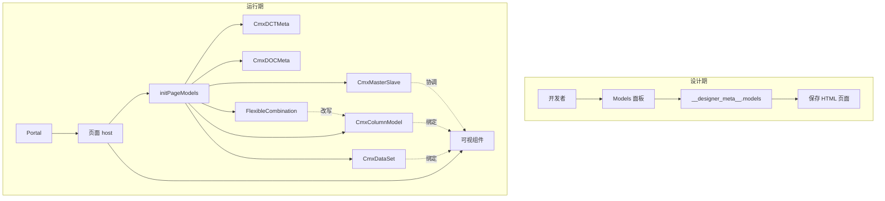
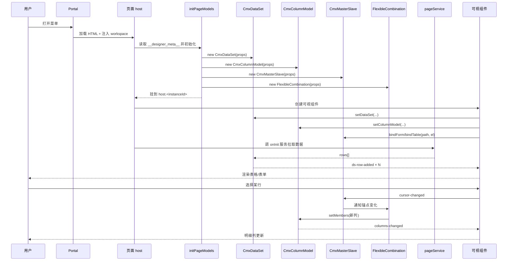
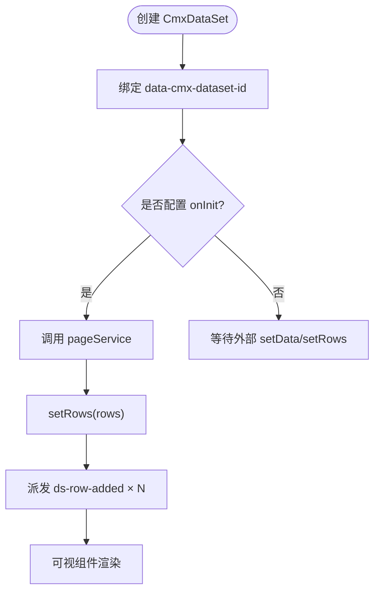
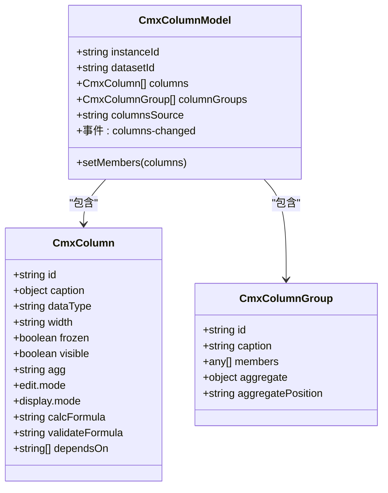
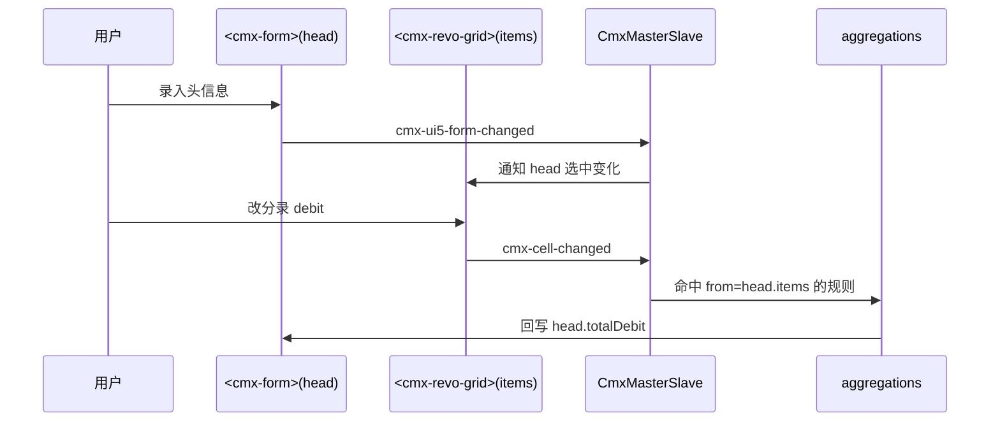
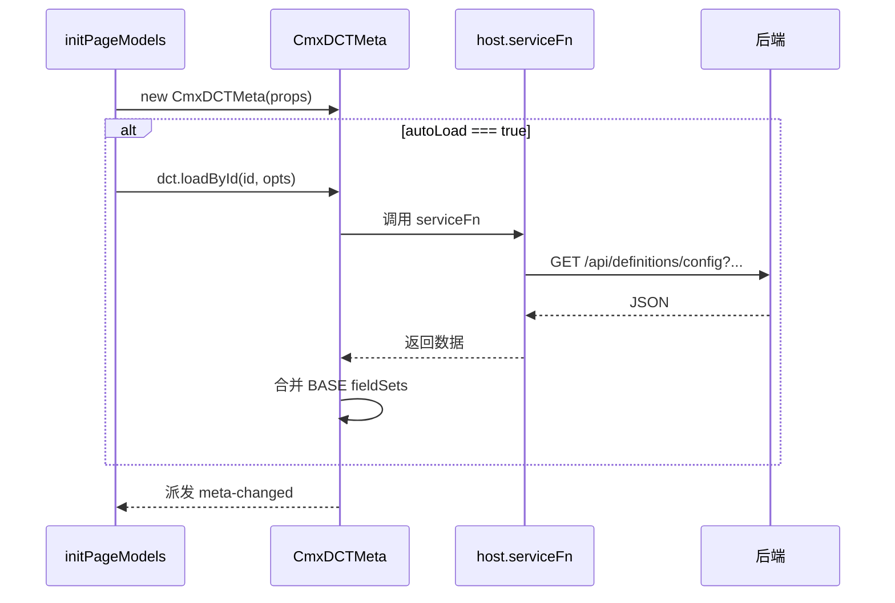
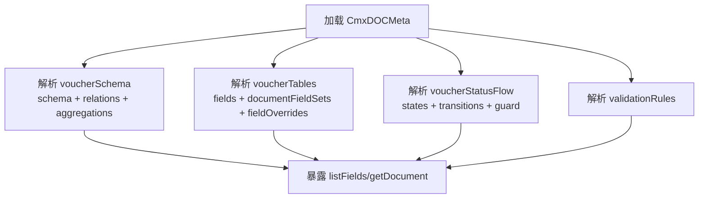
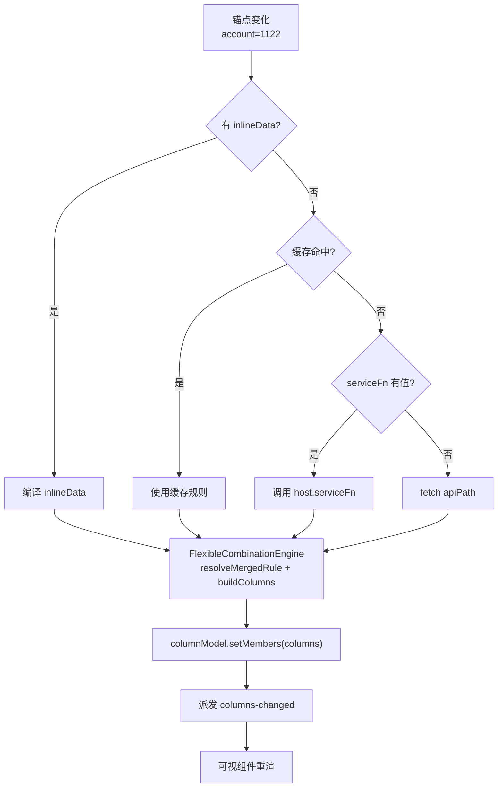
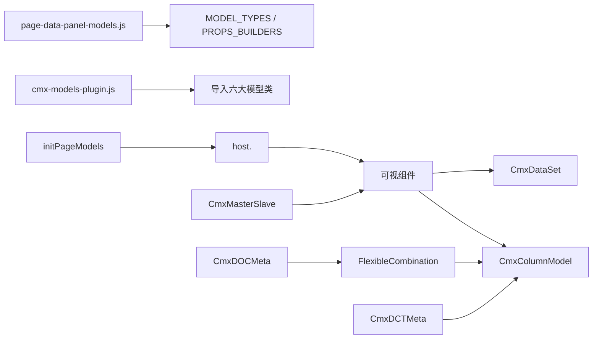

# 模型体系概览

<cite>
**本文引用的文件**
- [02-模型体系全景图.md](file://docs/CMXPortalManager+CMXHTMLDesigner-模型体系文档/02-模型体系全景图.md)
- [04-字典模型-CmxDCTMeta.md](file://docs/CMXPortalManager+CMXHTMLDesigner-模型体系文档/04-字典模型-CmxDCTMeta.md)
- [05-单据模型-CmxDOCMeta.md](file://docs/CMXPortalManager+CMXHTMLDesigner-模型体系文档/05-单据模型-CmxDOCMeta.md)
- [08-列模型-CmxColumnModel.md](file://docs/CMXPortalManager+CMXHTMLDesigner-模型体系文档/08-列模型-CmxColumnModel.md)
- [09-主从协调器-CmxMasterSlave.md](file://docs/CMXPortalManager+CMXHTMLDesigner-模型体系文档/09-主从协调器-CmxMasterSlave.md)
- [10-弹性组合-FlexibleCombination.md](file://docs/CMXPortalManager+CMXHTMLDesigner-模型体系文档/10-弹性组合-FlexibleCombination.md)
- [12-运行时初始化流程.md](file://docs/CMXPortalManager+CMXHTMLDesigner-模型体系文档/12-运行时初始化流程.md)
- [page-data-panel-models.js](file://CMXHTMLDesigner/src/components/designer-page-data/page-data-panel-models.js)
- [cmx-models-plugin.js](file://CMXHTMLDesigner/src/plugins/cmx-models-plugin.js)
</cite>

## 目录
1. [引言](#引言)
2. [项目结构](#项目结构)
3. [核心组件](#核心组件)
4. [架构总览](#架构总览)
5. [详细组件分析](#详细组件分析)
6. [依赖关系分析](#依赖关系分析)
7. [性能考量](#性能考量)
8. [故障排查指南](#故障排查指南)
9. [结论](#结论)
10. [附录](#附录)

## 引言
本文件面向“模型体系”的读者，系统性介绍 CMX 平台的六大核心数据模型：CmxDataSet、CmxColumnModel、CmxMasterSlave、CmxDCTMeta、CmxDOCMeta 与 FlexibleCombination。内容覆盖每个模型的设计目的、职责边界、在整体架构中的位置；模型之间的关系与数据流向（设计期 vs 运行期）；从页面元数据到可视组件渲染的完整链路；以及模型初始化流程、生命周期管理与最佳实践。

## 项目结构
- 设计期（CMXHTMLDesigner）
  - 通过 Models 面板拖拽生成模型实例，序列化进 __designer_meta__.models 数组，并保存到 HTML 页面源文件中。
  - 插件将六大模型注册为“模型卡片”，提供属性编辑与事件脚本能力。
- 运行期（CMXPortalManager）
  - 加载 HTML 页面后执行脚本块，调用 initPageModels 按 modelType 创建模型实例，挂到 host.<instanceId>。
  - 可视组件通过 data-cmx-dataset-id / data-cmx-model-id 等属性自动绑定模型。

图表来源
- [02-模型体系全景图.md:9-70](file://docs/CMXPortalManager+CMXHTMLDesigner-模型体系文档/02-模型体系全景图.md#L9-L70)
- [12-运行时初始化流程.md:74-116](file://docs/CMXPortalManager+CMXHTMLDesigner-模型体系文档/12-运行时初始化流程.md#L74-L116)

章节来源
- [02-模型体系全景图.md:9-70](file://docs/CMXPortalManager+CMXHTMLDesigner-模型体系文档/02-模型体系全景图.md#L9-L70)
- [12-运行时初始化流程.md:74-116](file://docs/CMXPortalManager+CMXHTMLDesigner-模型体系文档/12-运行时初始化流程.md#L74-L116)

## 核心组件
- CmxDataSet：数据集模型，承载行数据与子数据集，驱动表格/表单的数据源。
- CmxColumnModel：列模型，定义表格/表单的列结构、编辑与显示规则、聚合与计算。
- CmxMasterSlave：主从协调器，维护递归主从数据树、视图绑定、选中联动与自动聚合。
- CmxDCTMeta：数据字典元数据容器，加载并暴露字典表与共享字段集，供其他模型引用。
- CmxDOCMeta：业务单据元数据容器，描述多表结构、关系、聚合、状态机与校验规则。
- FlexibleCombination：上下文驱动的动态列引擎，根据锚点变化重写目标列模型。

章节来源
- [02-模型体系全景图.md:23-30](file://docs/CMXPortalManager+CMXHTMLDesigner-模型体系文档/02-模型体系全景图.md#L23-L30)
- [08-列模型-CmxColumnModel.md:7-22](file://docs/CMXPortalManager+CMXHTMLDesigner-模型体系文档/08-列模型-CmxColumnModel.md#L7-L22)
- [09-主从协调器-CmxMasterSlave.md:7-35](file://docs/CMXPortalManager+CMXHTMLDesigner-模型体系文档/09-主从协调器-CmxMasterSlave.md#L7-L35)
- [04-字典模型-CmxDCTMeta.md:7-22](file://docs/CMXPortalManager+CMXHTMLDesigner-模型体系文档/04-字典模型-CmxDCTMeta.md#L7-L22)
- [05-单据模型-CmxDOCMeta.md:7-22](file://docs/CMXPortalManager+CMXHTMLDesigner-模型体系文档/05-单据模型-CmxDOCMeta.md#L7-L22)
- [10-弹性组合-FlexibleCombination.md:7-26](file://docs/CMXPortalManager+CMXHTMLDesigner-模型体系文档/10-弹性组合-FlexibleCombination.md#L7-L26)

## 架构总览
下图展示从设计期到运行期的端到端链路，包括页面元数据、模型初始化、可视组件绑定、数据加载与列变更触发。

图表来源
- [02-模型体系全景图.md:111-147](file://docs/CMXPortalManager+CMXHTMLDesigner-模型体系文档/02-模型体系全景图.md#L111-L147)
- [12-运行时初始化流程.md:74-116](file://docs/CMXPortalManager+CMXHTMLDesigner-模型体系文档/12-运行时初始化流程.md#L74-L116)

## 详细组件分析

### CmxDataSet（数据集）
- 设计目的：作为可视组件的数据源，支持多级树形结构与子数据集。
- 职责边界：负责装载、缓存、派发行事件；不关心 UI 呈现细节。
- 在架构中的位置：被 Grid/Form/Tree 直接绑定；受 MasterSlave 管理层级与选中联动。
- 关键交互：
  - 设计期：配置 dataSource、dataSourceEvent、children。
  - 运行期：onInit 触发 pageService 拉取 rows，setRows 后派发 ds-row-added。

图表来源
- [12-运行时初始化流程.md:167-182](file://docs/CMXPortalManager+CMXHTMLDesigner-模型体系文档/12-运行时初始化流程.md#L167-L182)

章节来源
- [02-模型体系全景图.md:96-103](file://docs/CMXPortalManager+CMXHTMLDesigner-模型体系文档/02-模型体系全景图.md#L96-L103)
- [12-运行时初始化流程.md:167-182](file://docs/CMXPortalManager+CMXHTMLDesigner-模型体系文档/12-运行时初始化流程.md#L167-L182)

### CmxColumnModel（列模型）
- 设计目的：定义表格/表单的列模板，包括列组、编辑模式、显示格式、计算公式与校验。
- 职责边界：声明式列定义；可被 FlexibleCombination 动态改写。
- 在架构中的位置：被 Grid/Form 绑定；由 FC 通过 setMembers 替换 members。
- 关键特性：
  - 字段三态：dimension（维度）、attribute（属性）、measure（度量）。
  - 列组聚合：sum/avg/min/max/count，支持 before/after 聚合行位置。
  - 公式与校验：calcFormula/validateFormula/dependsOn。

图表来源
- [08-列模型-CmxColumnModel.md:25-67](file://docs/CMXPortalManager+CMXHTMLDesigner-模型体系文档/08-列模型-CmxColumnModel.md#L25-L67)
- [08-列模型-CmxColumnModel.md:106-127](file://docs/CMXPortalManager+CMXHTMLDesigner-模型体系文档/08-列模型-CmxColumnModel.md#L106-L127)

章节来源
- [08-列模型-CmxColumnModel.md:25-67](file://docs/CMXPortalManager+CMXHTMLDesigner-模型体系文档/08-列模型-CmxColumnModel.md#L25-L67)
- [08-列模型-CmxColumnModel.md:106-127](file://docs/CMXPortalManager+CMXHTMLDesigner-模型体系文档/08-列模型-CmxColumnModel.md#L106-L127)

### CmxMasterSlave（主从协调器）
- 设计目的：协调多张表的主从关系，维护当前选中行、视图联动与自动聚合。
- 职责边界：持有递归主从数据树；按 path 绑定 Form/Grid；监听 cell/row 事件跑聚合。
- 在架构中的位置：连接 DataSet 与可视组件；驱动 FlexibleCombination 的锚点变化。
- 关键配置：
  - schema：路径树（如 head → items → taxes），path 用点分隔。
  - aggregations：from/to/toField/agg/scope，监听 cmx-cell-changed / cmx-row-added 触发。
  - setData / setFlatData：树形或平铺数据装配。

图表来源
- [09-主从协调器-CmxMasterSlave.md:184-204](file://docs/CMXPortalManager+CMXHTMLDesigner-模型体系文档/09-主从协调器-CmxMasterSlave.md#L184-L204)

章节来源
- [09-主从协调器-CmxMasterSlave.md:27-53](file://docs/CMXPortalManager+CMXHTMLDesigner-模型体系文档/09-主从协调器-CmxMasterSlave.md#L27-L53)
- [09-主从协调器-CmxMasterSlave.md:56-131](file://docs/CMXPortalManager+CMXHTMLDesigner-模型体系文档/09-主从协调器-CmxMasterSlave.md#L56-L131)
- [09-主从协调器-CmxMasterSlave.md:152-179](file://docs/CMXPortalManager+CMXHTMLDesigner-模型体系文档/09-主从协调器-CmxMasterSlave.md#L152-L179)

### CmxDCTMeta（字典元数据）
- 设计目的：加载并暴露“数据字典”元数据，提供字段定义给其他模型使用。
- 职责边界：只负责加载 JSON、合并 base 字段集、暴露 getDictionary/listDictionaries 等 API。
- 在架构中的位置：为 CmxColumnModel / CmxMasterSlave / FlexibleCombination 提供字段定义与引用。
- 关键特性：
  - 四种加载优先级：resolver > serviceFn > baseResolver > fetch apiPath。
  - 顶层结构：moduleMeta / baseDctMetaRef / dictionaryTables / updatedAt。
  - 字段集复用：baseFieldSet/hierarchyFieldSet/auditFieldSet 等。

图表来源
- [04-字典模型-CmxDCTMeta.md:426-450](file://docs/CMXPortalManager+CMXHTMLDesigner-模型体系文档/04-字典模型-CmxDCTMeta.md#L426-L450)

章节来源
- [04-字典模型-CmxDCTMeta.md:25-72](file://docs/CMXPortalManager+CMXHTMLDesigner-模型体系文档/04-字典模型-CmxDCTMeta.md#L25-L72)
- [04-字典模型-CmxDCTMeta.md:75-273](file://docs/CMXPortalManager+CMXHTMLDesigner-模型体系文档/04-字典模型-CmxDCTMeta.md#L75-L273)
- [04-字典模型-CmxDCTMeta.md:277-320](file://docs/CMXPortalManager+CMXHTMLDesigner-模型体系文档/04-字典模型-CmxDCTMeta.md#L277-L320)

### CmxDOCMeta（单据元数据）
- 设计目的：描述业务单据的多表结构、关系、聚合、状态机与校验规则。
- 职责边界：加载 voucherTables/voucherSchema/voucherStatusFlow/validationRules，暴露 getDocument/listDocuments。
- 在架构中的位置：为 CmxColumnModel / CmxMasterSlave / FlexibleCombination 提供“物理表事实源”。
- 关键特性：
  - 顶层键比 DCT 更多：voucherCommonFieldSet / voucherSchema / voucherStatusFlow / validationRules。
  - 状态机：states/transitions/guard 引用 validationRules。
  - 推荐批量加载：loadMetaBatch 一次拉 DCT + DOC + base。

图表来源
- [05-单据模型-CmxDOCMeta.md:129-189](file://docs/CMXPortalManager+CMXHTMLDesigner-模型体系文档/05-单据模型-CmxDOCMeta.md#L129-L189)
- [05-单据模型-CmxDOCMeta.md:275-341](file://docs/CMXPortalManager+CMXHTMLDesigner-模型体系文档/05-单据模型-CmxDOCMeta.md#L275-L341)

章节来源
- [05-单据模型-CmxDOCMeta.md:25-57](file://docs/CMXPortalManager+CMXHTMLDesigner-模型体系文档/05-单据模型-CmxDOCMeta.md#L25-L57)
- [05-单据模型-CmxDOCMeta.md:60-189](file://docs/CMXPortalManager+CMXHTMLDesigner-模型体系文档/05-单据模型-CmxDOCMeta.md#L60-L189)
- [05-单据模型-CmxDOCMeta.md:275-341](file://docs/CMXPortalManager+CMXHTMLDesigner-模型体系文档/05-单据模型-CmxDOCMeta.md#L275-L341)

### FlexibleCombination（弹性组合）
- 设计目的：根据上下文（锚点）动态生成列，实现“同一组件不同场景不同列”。
- 职责边界：按 DAM 三段定位 + scenario 获取规则；resolveMergedRule 匹配评分；buildColumns 写入 CmxColumnModel。
- 在架构中的位置：监听主行维度变化，触发 loadByAnchor/setCombination，改写目标列模型。
- 关键特性：
  - 三种数据来源：inlineData（开页生效）、serviceFn（动态取数）、setCombination（运行时直设）。
  - 字段三态：dimension/attribute/measure。
  - 公式白名单求值：+ - * / ( ) 与 ROUND/ABS/MIN/MAX/IF。
  - Overlay 模式：ref + over 增量覆盖，避免重复定义列。

图表来源
- [10-弹性组合-FlexibleCombination.md:31-54](file://docs/CMXPortalManager+CMXHTMLDesigner-模型体系文档/10-弹性组合-FlexibleCombination.md#L31-L54)
- [10-弹性组合-FlexibleCombination.md:97-118](file://docs/CMXPortalManager+CMXHTMLDesigner-模型体系文档/10-弹性组合-FlexibleCombination.md#L97-L118)

章节来源
- [10-弹性组合-FlexibleCombination.md:58-74](file://docs/CMXPortalManager+CMXHTMLDesigner-模型体系文档/10-弹性组合-FlexibleCombination.md#L58-L74)
- [10-弹性组合-FlexibleCombination.md:139-189](file://docs/CMXPortalManager+CMXHTMLDesigner-模型体系文档/10-弹性组合-FlexibleCombination.md#L139-L189)
- [10-弹性组合-FlexibleCombination.md:223-313](file://docs/CMXPortalManager+CMXHTMLDesigner-模型体系文档/10-弹性组合-FlexibleCombination.md#L223-L313)

## 依赖关系分析
- 设计期
  - page-data-panel-models.js 定义 MODEL_TYPES 与 PROPS_BUILDERS，将六种模型注册为可拖拽卡片。
  - cmx-models-plugin.js 将模型类导入并注册到设计器插件系统。
- 运行期
  - initPageModels 按 modelType 创建实例并挂载到 host.<instanceId>。
  - 可视组件通过 DOM 属性自动绑定 DataSet 与 ColumnModel。
  - MasterSlave 协调多个 DataSet 与视图；FlexibleCombination 改写 ColumnModel。

图表来源
- [page-data-panel-models.js:35-50](file://CMXHTMLDesigner/src/components/designer-page-data/page-data-panel-models.js#L35-L50)
- [cmx-models-plugin.js:24-36](file://CMXHTMLDesigner/src/plugins/cmx-models-plugin.js#L24-L36)
- [12-运行时初始化流程.md:122-133](file://docs/CMXPortalManager+CMXHTMLDesigner-模型体系文档/12-运行时初始化流程.md#L122-L133)

章节来源
- [page-data-panel-models.js:35-50](file://CMXHTMLDesigner/src/components/designer-page-data/page-data-panel-models.js#L35-L50)
- [cmx-models-plugin.js:24-36](file://CMXHTMLDesigner/src/plugins/cmx-models-plugin.js#L24-L36)
- [12-运行时初始化流程.md:122-133](file://docs/CMXPortalManager+CMXHTMLDesigner-模型体系文档/12-运行时初始化流程.md#L122-L133)

## 性能考量
- 聚合规则优化：MasterSlave 对 aggregations 按 from 反向索引，仅重算命中规则，降低 cell change 时的开销。
- 列变更广播：ColumnModel 通过 columns-changed 事件一次性通知所有绑定的可视组件，避免重复计算。
- 弹性组合缓存：FlexibleCombination 按锚点签名缓存最近结果，减少后端请求。
- 批量元数据加载：DCT/DOC 推荐使用 loadMetaBatch，自动去重 base 字段集，减少网络往返。

[本节为通用指导，不直接分析具体文件]

## 故障排查指南
- host.<instanceId> 为 undefined：检查 models 数组中是否漏配 modelType 或 instanceId 拼写错误。
- 表格无数据：确认 dataSource 已配置且 dataSourceEvent 为 onInit；检查 pageService 是否返回 rows。
- 列未出现：检查 columnModelId 是否正确；若初始 columns=[]，需确保 FlexibleCombination 能成功触发 setMembers。
- 聚合不工作：核对 aggregations 的 from/to/toField 路径是否与 schema 一致。
- 事件未触发：确认事件名大小写正确；检查脚本语法错误。
- FC 静默失败：columnModelId 不存在或 inlineData 解析失败会在控制台 warn。

章节来源
- [12-运行时初始化流程.md:237-247](file://docs/CMXPortalManager+CMXHTMLDesigner-模型体系文档/12-运行时初始化流程.md#L237-L247)

## 结论
CMX 的六大模型构成了“数据—结构—协调—元数据—动态列”的完整闭环：
- CmxDataSet 提供数据流；
- CmxColumnModel 定义列结构；
- CmxMasterSlave 协调多表与聚合；
- CmxDCTMeta/CmxDOCMeta 提供字段与单据事实源；
- FlexibleCombination 实现上下文驱动的动态列。
设计期通过 Models 面板生成 __designer_meta__.models，运行期由 initPageModels 实例化并绑定到可视组件，形成从元数据到渲染的确定性链路。遵循 Overlay 模式与批量加载策略，可在保证灵活性的同时提升性能与可维护性。

[本节为总结，不直接分析具体文件]

## 附录
- 术语对照
  - ContextProfile = FlexibleCombination（别名）
  - DAM = Domain/App/Module（后端定位三段）
- 参考链接
  - 设计器 Models 面板与事件脚本：page-data-panel-models.js
  - 模型插件注册：cmx-models-plugin.js
  - 运行时初始化：initPageModels（见文档链）

[本节为补充说明，不直接分析具体文件]