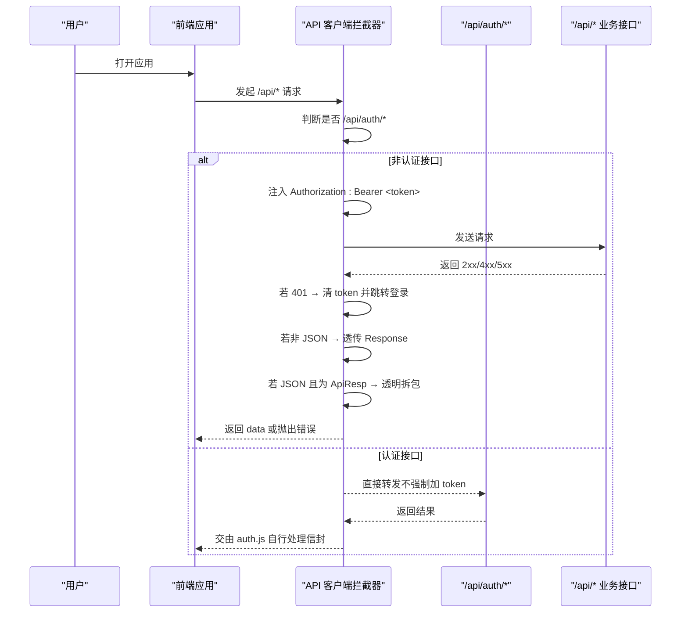
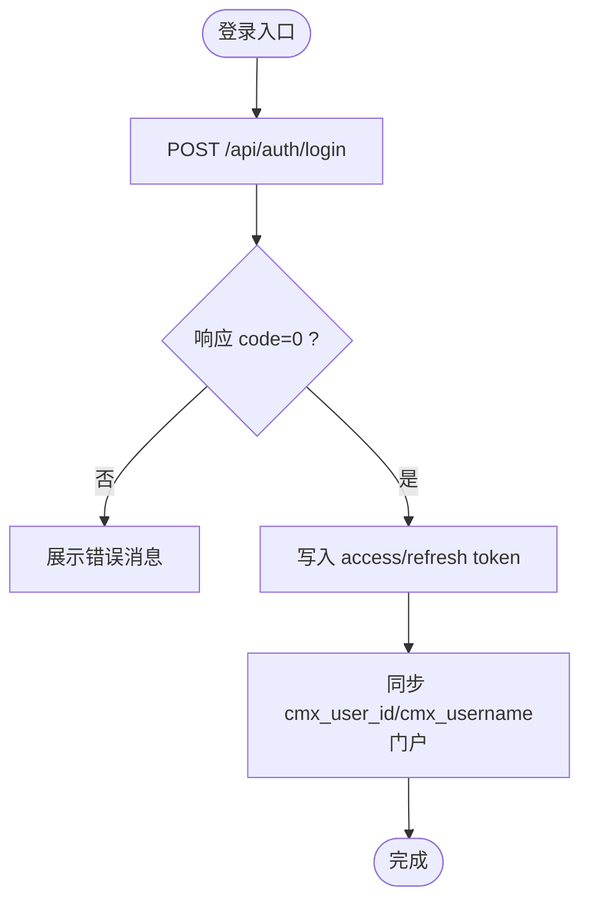
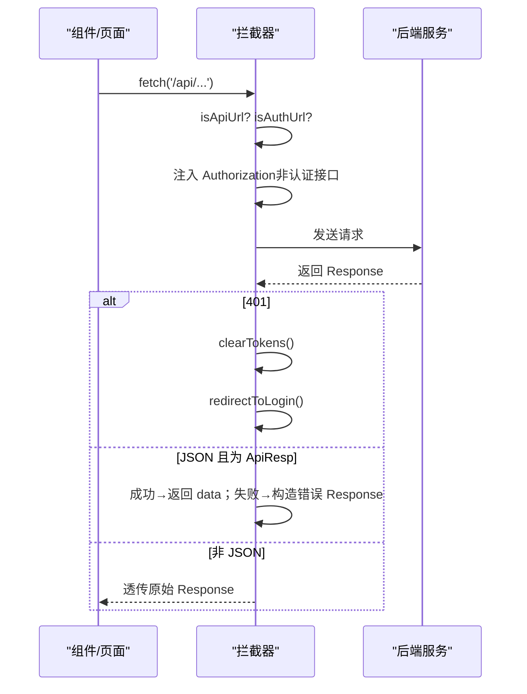
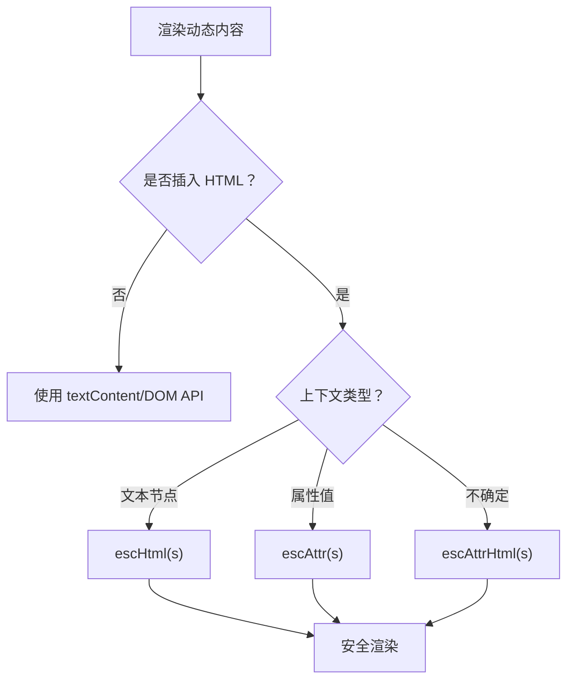
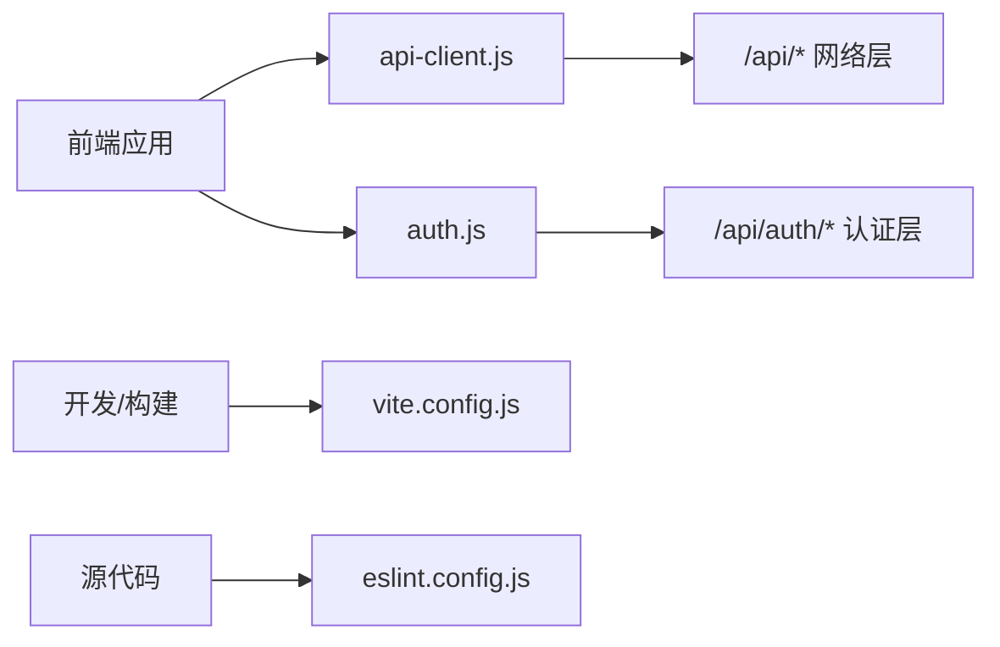

# 安全架构设计

<cite>
**本文引用的文件**
- [CMXHTMLDesigner/src/lib/api-client.js](file://CMXHTMLDesigner/src/lib/api-client.js)
- [CMXHTMLDesigner/src/lib/auth.js](file://CMXHTMLDesigner/src/lib/auth.js)
- [CMXPortalManager/src/lib/api-client.js](file://CMXPortalManager/src/lib/api-client.js)
- [CMXPortalManager/src/lib/auth.js](file://CMXPortalManager/src/lib/auth.js)
- [CMXPortalManager/src/lib/escape.js](file://CMXPortalManager/src/lib/escape.js)
- [CMXPortalManager/eslint.config.js](file://CMXPortalManager/eslint.config.js)
- [CMXPortalManager/vite.config.js](file://CMXPortalManager/vite.config.js)
- [CMXHTMLDesigner/vite.config.js](file://CMXHTMLDesigner/vite.config.js)
- [documents/20260822_cmx-flow-rpt_反向代理评估与优化方案.md](file://documents/20260822_cmx-flow-rpt_反向代理评估与优化方案.md)
- [CMXPortalManager/CMXPortalManager-评估报告.md](file://CMXPortalManager/CMXPortalManager-评估报告.md)
</cite>

## 目录
1. [简介](#简介)
2. [项目结构](#项目结构)
3. [核心组件](#核心组件)
4. [架构总览](#架构总览)
5. [详细组件分析](#详细组件分析)
6. [依赖关系分析](#依赖关系分析)
7. [性能与安全权衡](#性能与安全权衡)
8. [故障排查指南](#故障排查指南)
9. [结论](#结论)
10. [附录](#附录)

## 简介
本文件面向企业门户平台的前端与网关侧安全架构，聚焦认证授权、会话管理、权限控制、JWT Token 处理、API 请求拦截、错误处理、XSS 防护、CSRF 防护、数据加密策略、安全配置、审计日志与威胁防护，并给出安全开发指南与安全测试方法。内容基于仓库中前端认证与 API 客户端实现、ESLint 安全规则、Vite 构建与代理配置，以及反向代理头卫生与安全治理文档进行系统化梳理。

## 项目结构
本项目包含两个前端应用与共享能力：
- CMXHTMLDesigner：页面设计器前端，提供登录、鉴权与 API 调用能力。
- CMXPortalManager：门户主应用，提供统一入口、路由与工作区能力。
两者均通过统一的 API 客户端模块注入 Authorization 头、解析后端信封响应、处理 401 跳转登录，并在生产环境通过 Vite 代理将 /api/* 转发到后端服务。

```mermaid
graph TB
subgraph "浏览器"
D["设计器前端<br/>CMXHTMLDesigner"]
P["门户前端<br/>CMXPortalManager"]
end
subgraph "开发/构建期"
VD["vite.config.js设计器"]
VP["vite.config.js门户"]
end
subgraph "后端"
A["/api/auth/* 认证接口"]
B["/api/* 业务接口"]
end
D --> |installAuthFetchInterceptor()<br/>自动加 Authorization| B
P --> |installAuthFetchInterceptor()<br/>自动加 Authorization| B
D --> |login/logout/me| A
P --> |login/logout/me| A
VD --> |/api/* 代理| B
VP --> |/api/* 代理| B
```

图示来源
- [CMXHTMLDesigner/src/lib/api-client.js:167-245](file://CMXHTMLDesigner/src/lib/api-client.js#L167-L245)
- [CMXPortalManager/src/lib/api-client.js:175-259](file://CMXPortalManager/src/lib/api-client.js#L175-L259)
- [CMXHTMLDesigner/vite.config.js:72-84](file://CMXHTMLDesigner/vite.config.js#L72-L84)
- [CMXPortalManager/vite.config.js:84-96](file://CMXPortalManager/vite.config.js#L84-L96)

章节来源
- [CMXHTMLDesigner/vite.config.js:15-36](file://CMXHTMLDesigner/vite.config.js#L15-L36)
- [CMXPortalManager/vite.config.js:15-36](file://CMXPortalManager/vite.config.js#L15-L36)

## 核心组件
- 认证助手（auth.js）：封装登录、登出、获取当前用户、是否已登录、跳转到登录页等能力，统一对接 /api/auth/*。
- API 客户端（api-client.js）：统一封装 apiFetch、全局 fetch 拦截器安装、Token 存取、401 处理、ApiResp 信封透明拆包、跨域 API_BASE 重写。
- XSS 防护（escape.js + ESLint 规则）：集中提供 escHtml/escAttr/escAttrHtml，并通过 ESLint 禁止危险 DOM 操作与动态脚本执行。
- 构建与代理（vite.config.js）：定义 base、多入口、代理规则，确保 /api/* 在开发与构建期正确转发到后端。
- 反向代理头卫生（文档）：指出出站鉴权头透传风险与修复建议，强调对下游服务的头清洗与凭据保护。

章节来源
- [CMXHTMLDesigner/src/lib/auth.js:1-100](file://CMXHTMLDesigner/src/lib/auth.js#L1-L100)
- [CMXPortalManager/src/lib/auth.js:1-121](file://CMXPortalManager/src/lib/auth.js#L1-L121)
- [CMXHTMLDesigner/src/lib/api-client.js:1-245](file://CMXHTMLDesigner/src/lib/api-client.js#L1-L245)
- [CMXPortalManager/src/lib/api-client.js:1-259](file://CMXPortalManager/src/lib/api-client.js#L1-L259)
- [CMXPortalManager/src/lib/escape.js:1-35](file://CMXPortalManager/src/lib/escape.js#L1-L35)
- [CMXPortalManager/eslint.config.js:1-124](file://CMXPortalManager/eslint.config.js#L1-L124)
- [CMXHTMLDesigner/vite.config.js:72-84](file://CMXHTMLDesigner/vite.config.js#L72-L84)
- [CMXPortalManager/vite.config.js:84-96](file://CMXPortalManager/vite.config.js#L84-L96)
- [documents/20260822_cmx-flow-rpt_反向代理评估与优化方案.md:77-165](file://documents/20260822_cmx-flow-rpt_反向代理评估与优化方案.md#L77-L165)

## 架构总览
前端采用“无状态令牌 + 服务端校验”的认证模型：
- 登录成功后，前端将 access_token 与 refresh_token 写入 localStorage。
- 所有 /api/* 请求由全局拦截器自动附加 Authorization: Bearer <token>。
- 收到 401 时，清除本地 token 并重定向至登录页（带回跳参数）。
- 非 JSON 响应（SSE/下载/二进制）原样透传，避免破坏流式或二进制场景。
- 后端统一返回 ApiResp 信封 {code,msg,data}，前端在拦截器中透明拆包，使现有代码无需改动。



图示来源
- [CMXHTMLDesigner/src/lib/api-client.js:167-245](file://CMXHTMLDesigner/src/lib/api-client.js#L167-L245)
- [CMXPortalManager/src/lib/api-client.js:175-259](file://CMXPortalManager/src/lib/api-client.js#L175-L259)
- [CMXHTMLDesigner/src/lib/auth.js:33-47](file://CMXHTMLDesigner/src/lib/auth.js#L33-L47)
- [CMXPortalManager/src/lib/auth.js:33-51](file://CMXPortalManager/src/lib/auth.js#L33-L51)

## 详细组件分析

### 认证与会话管理
- 登录流程：调用 /api/auth/login，成功后写入 access_token 与 refresh_token；门户端还会同步 cmx_user_id/cmx_username 到 localStorage，供待办中心等按人过滤使用。
- 登出流程：调用 /api/auth/logout 使令牌失效，随后清理本地 token 及用户标识。
- 当前用户：调用 /api/auth/me 获取用户信息；若 401 则清理 token 并返回 null。
- 启动门：requireAuthOrRedirect 在未登录时跳转登录页并携带 redirect 参数。



图示来源
- [CMXHTMLDesigner/src/lib/auth.js:33-47](file://CMXHTMLDesigner/src/lib/auth.js#L33-L47)
- [CMXPortalManager/src/lib/auth.js:33-51](file://CMXPortalManager/src/lib/auth.js#L33-L51)
- [CMXPortalManager/src/lib/auth.js:57-64](file://CMXPortalManager/src/lib/auth.js#L57-L64)

章节来源
- [CMXHTMLDesigner/src/lib/auth.js:1-100](file://CMXHTMLDesigner/src/lib/auth.js#L1-L100)
- [CMXPortalManager/src/lib/auth.js:1-121](file://CMXPortalManager/src/lib/auth.js#L1-L121)

### JWT Token 处理与 API 请求拦截
- Token 存储：localStorage 中的 cmx_access_token 与 cmx_refresh_token。
- 自动注入：全局拦截器对同源 /api/* 请求自动附加 Authorization 头；/api/auth/* 不强制注入。
- 跨域重写：当设置 VITE_API_BASE 时，将相对路径 /api/* 重写为完整后端地址。
- 401 处理：非认证接口返回 401 时，清除本地 token 并跳转登录页。
- 信封拆包：对 application/json 响应，若为 ApiResp 信封，成功时返回 data，失败时映射为非 2xx 并保留 msg/code/data（含 violations），便于前端结构化错误展示。



图示来源
- [CMXHTMLDesigner/src/lib/api-client.js:167-245](file://CMXHTMLDesigner/src/lib/api-client.js#L167-L245)
- [CMXPortalManager/src/lib/api-client.js:175-259](file://CMXPortalManager/src/lib/api-client.js#L175-L259)

章节来源
- [CMXHTMLDesigner/src/lib/api-client.js:1-245](file://CMXHTMLDesigner/src/lib/api-client.js#L1-L245)
- [CMXPortalManager/src/lib/api-client.js:1-259](file://CMXPortalManager/src/lib/api-client.js#L1-L259)

### 权限控制策略
- 前端侧：以“必须登录”为前提，未登录即重定向；对业务资源访问依赖后端鉴权。
- 后端侧：通过 /api/auth/* 验证令牌有效性并返回用户上下文；业务接口根据服务端身份进行授权校验。
- 越权防护：关键动作（如流程任务完成/取消/撤回）在服务端进行 T0b 授权校验，拒绝非法主体操作。

章节来源
- [CMXHTMLDesigner/src/lib/auth.js:84-99](file://CMXHTMLDesigner/src/lib/auth.js#L84-L99)
- [CMXPortalManager/src/lib/auth.js:105-121](file://CMXPortalManager/src/lib/auth.js#L105-L121)
- [documents/技术债/20260817_流程引擎_已知问题与技术债务.md:109-123](file://documents/技术债/20260817_流程引擎_已知问题与技术债务.md#L109-L123)

### XSS 防护
- 转义工具：提供 escHtml/escAttr/escAttrHtml 三种上下文安全的转义函数，集中维护，避免各组件各自实现导致策略漂移。
- 静态检查：ESLint 禁止 innerHTML/outerHTML/insertAdjacentHTML/document.write 等危险操作，禁止 eval/new Function，强制使用统一转义或更安全 API。
- 最佳实践：任何动态 HTML 拼接必须经过 escHtml/escAttr；属性值必须使用 escAttr；不确定上下文时使用 escAttrHtml。



图示来源
- [CMXPortalManager/src/lib/escape.js:1-35](file://CMXPortalManager/src/lib/escape.js#L1-L35)
- [CMXPortalManager/eslint.config.js:39-89](file://CMXPortalManager/eslint.config.js#L39-L89)

章节来源
- [CMXPortalManager/src/lib/escape.js:1-35](file://CMXPortalManager/src/lib/escape.js#L1-L35)
- [CMXPortalManager/eslint.config.js:1-124](file://CMXPortalManager/eslint.config.js#L1-L124)

### CSRF 防护
- 现状：前端通过 Bearer Token 进行认证，通常不受 CSRF 影响；但需确保敏感操作不使用 Cookie 会话作为唯一凭证。
- 建议：在后端启用严格 CORS、限制可接受的 Origin；对写操作使用 SameSite Cookie（如使用）、校验 Referer/Origin；避免将敏感状态存入 sessionStorage。

章节来源
- [CMXPortalManager/CMXPortalManager-评估报告.md:485-532](file://CMXPortalManager/CMXPortalManager-评估报告.md#L485-L532)

### 数据加密策略
- 传输层：生产环境应通过 HTTPS 保障传输机密性与完整性。
- 存储层：敏感数据（如 token）存储在 localStorage，需结合站点隔离与最小化暴露原则；如需更高安全等级，可考虑 httpOnly Cookie 配合后端刷新机制。
- 密钥管理：不在前端硬编码密钥；构建期变量仅用于配置，不泄露到产物。

章节来源
- [CMXHTMLDesigner/src/lib/api-client.js:15-36](file://CMXHTMLDesigner/src/lib/api-client.js#L15-L36)
- [CMXPortalManager/src/lib/api-client.js:15-36](file://CMXPortalManager/src/lib/api-client.js#L15-L36)

### 安全配置选项
- 环境变量：
  - VITE_API_BASE：前后端不同源部署时，将 /api/* 重写至后端域名。
  - CMX_APP_BASE：应用基础路径，影响登录页跳转与资源加载。
- 代理配置：
  - /api、/rpc、/trpc、/sse、/ws 等路径在开发期代理至后端目标，支持 WebSocket。
- 构建产物：
  - 多入口（index.html、login.html、preview.html、debug.html）确保登录页独立托管，避免 SPA fallback 导致的 401 循环。

章节来源
- [CMXHTMLDesigner/vite.config.js:15-36](file://CMXHTMLDesigner/vite.config.js#L15-L36)
- [CMXPortalManager/vite.config.js:15-36](file://CMXPortalManager/vite.config.js#L15-L36)
- [CMXHTMLDesigner/vite.config.js:72-84](file://CMXHTMLDesigner/vite.config.js#L72-L84)
- [CMXPortalManager/vite.config.js:84-96](file://CMXPortalManager/vite.config.js#L84-L96)

### 审计日志与可观测性
- 前端：错误消息统一从 ApiResp.msg 或裸 error 抽取，便于统一上报与追踪。
- 后端：建议在网关或服务层记录认证事件、授权失败、异常堆栈与请求链路 ID，配合集中日志系统进行分析。

章节来源
- [CMXHTMLDesigner/src/lib/api-client.js:139-158](file://CMXHTMLDesigner/src/lib/api-client.js#L139-L158)
- [CMXPortalManager/src/lib/api-client.js:147-166](file://CMXPortalManager/src/lib/api-client.js#L147-L166)

### 威胁防护措施
- 令牌劫持与重放：通过短生命周期 access_token 与服务端校验降低风险；必要时引入刷新令牌与设备指纹。
- 头部污染与越权：反向代理需清洗上游传入的敏感头（如 X-API-Key、X-Delegated-User-Token、X-Tenant、X-User、Cookie），防止被客户端伪造覆盖平台注入值。
- 暴力破解与 DoS：建议在后端增加速率限制与验证码策略。

章节来源
- [documents/20260822_cmx-flow-rpt_反向代理评估与优化方案.md:77-165](file://documents/20260822_cmx-flow-rpt_反向代理评估与优化方案.md#L77-L165)
- [CMXPortalManager/CMXPortalManager-评估报告.md:485-532](file://CMXPortalManager/CMXPortalManager-评估报告.md#L485-L532)

## 依赖关系分析
- 前端应用依赖 api-client.js 提供的统一网络层与鉴权拦截。
- 认证逻辑依赖 auth.js 封装的 /api/auth/* 接口。
- 构建期依赖 vite.config.js 的代理与多入口配置，保证开发联调与生产部署一致性。
- 安全规则依赖 ESLint 配置，强制安全编码实践。



图示来源
- [CMXHTMLDesigner/src/lib/api-client.js:167-245](file://CMXHTMLDesigner/src/lib/api-client.js#L167-L245)
- [CMXPortalManager/src/lib/api-client.js:175-259](file://CMXPortalManager/src/lib/api-client.js#L175-L259)
- [CMXHTMLDesigner/vite.config.js:72-84](file://CMXHTMLDesigner/vite.config.js#L72-L84)
- [CMXPortalManager/vite.config.js:84-96](file://CMXPortalManager/vite.config.js#L84-L96)
- [CMXPortalManager/eslint.config.js:39-89](file://CMXPortalManager/eslint.config.js#L39-L89)

章节来源
- [CMXHTMLDesigner/src/lib/api-client.js:1-245](file://CMXHTMLDesigner/src/lib/api-client.js#L1-L245)
- [CMXPortalManager/src/lib/api-client.js:1-259](file://CMXPortalManager/src/lib/api-client.js#L1-L259)
- [CMXHTMLDesigner/vite.config.js:72-84](file://CMXHTMLDesigner/vite.config.js#L72-L84)
- [CMXPortalManager/vite.config.js:84-96](file://CMXPortalManager/vite.config.js#L84-L96)
- [CMXPortalManager/eslint.config.js:39-89](file://CMXPortalManager/eslint.config.js#L39-L89)

## 性能与安全权衡
- 首屏与按需加载：通过 chunk 拆分减少首屏体积，同时避免将重型库随主包加载，提升安全性（减少攻击面）与性能。
- 流式与二进制：拦截器对非 JSON 响应原样透传，保证 SSE/下载不被破坏，兼顾可用性与安全。
- 超时与熔断：反向代理需配置连接/读取超时与熔断策略，避免慢后端拖垮前端体验。

章节来源
- [CMXPortalManager/vite.config.js:97-169](file://CMXPortalManager/vite.config.js#L97-L169)
- [CMXHTMLDesigner/vite.config.js:90-103](file://CMXHTMLDesigner/vite.config.js#L90-L103)
- [documents/20260822_cmx-flow-rpt_反向代理评估与优化方案.md:144-165](file://documents/20260822_cmx-flow-rpt_反向代理评估与优化方案.md#L144-L165)

## 故障排查指南
- 401 风暴与回环：
  - 现象：登录后仍反复跳转登录页，URL 中 ?redirect= 指数叠加。
  - 原因：401 跳转时重复编码 redirect 参数，导致 URL 过长触发 414。
  - 修复：门户端已修复 redirect 拼接逻辑，避免重复编码与超长截断。
- 白屏与 404：
  - 现象：生产下 /portal/login.html 无法命中，进入 index 导致 401 循环。
  - 原因：多入口未正确输出 login.html。
  - 修复：确保 rollupOptions/rolldownOptions.input 包含 login 入口。
- 跨域与代理：
  - 现象：开发期 /api/* 请求无法到达后端。
  - 修复：检查 vite.config.js 的 server.proxy 配置与 VITE_API_BASE。

章节来源
- [CMXPortalManager/src/lib/api-client.js:59-73](file://CMXPortalManager/src/lib/api-client.js#L59-L73)
- [CMXPortalManager/vite.config.js:112-142](file://CMXPortalManager/vite.config.js#L112-L142)
- [CMXHTMLDesigner/vite.config.js:72-84](file://CMXHTMLDesigner/vite.config.js#L72-L84)

## 结论
本项目的安全架构以“前端无状态令牌 + 后端强校验”为核心，通过统一的 API 客户端与认证助手实现一致的鉴权与错误处理；借助 ESLint 与转义工具链有效抑制 XSS；通过 Vite 代理与多入口构建保障开发/生产一致性与可用性；反向代理头卫生与速率限制等建议进一步完善生产级安全基线。建议在生产环境落实 HTTPS、CORS 收紧、速率限制、审计日志与依赖漏洞扫描，形成闭环的安全治理体系。

## 附录
- 安全开发指南
  - 一律通过 escHtml/escAttr/escAttrHtml 渲染动态内容，禁止 innerHTML/outerHTML/insertAdjacentHTML/document.write。
  - 禁止 eval/new Function，避免动态脚本执行。
  - 所有 /api/* 请求走 apiFetch 或安装全局拦截器，确保 Authorization 注入与 401 处理一致。
  - 敏感配置使用环境变量，不在代码中硬编码。
- 安全测试方法
  - 单元测试：验证 escHtml/escAttr 的转义行为与边界情况。
  - 集成测试：模拟 401/业务错误信封，验证拦截器行为与跳转逻辑。
  - 安全扫描：npm audit 检查依赖漏洞；ESLint 强制规则纳入 CI。
  - 渗透测试：针对认证绕过、CSRF、XSS、头部污染等进行专项验证。