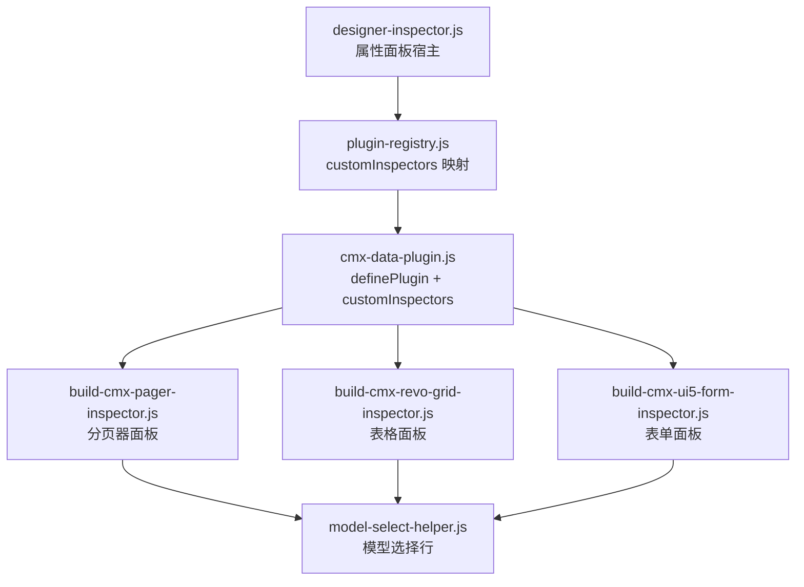
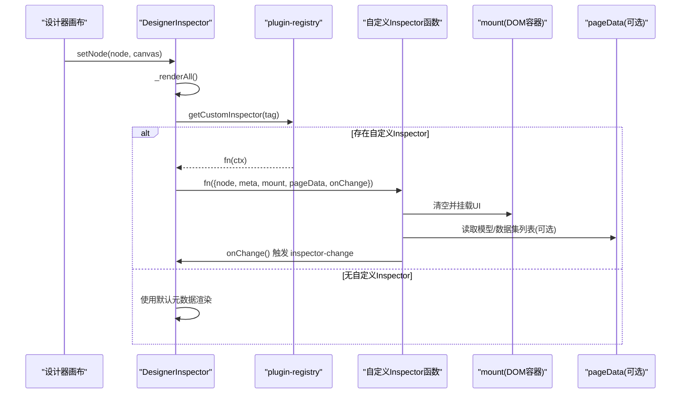
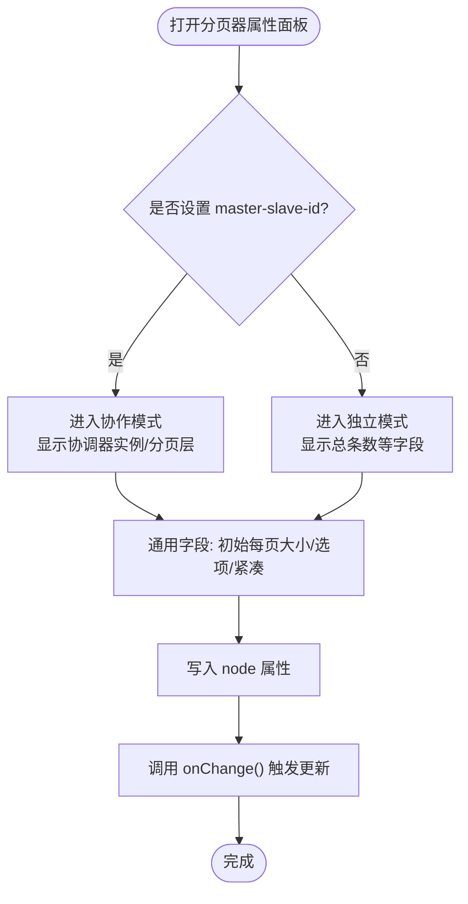
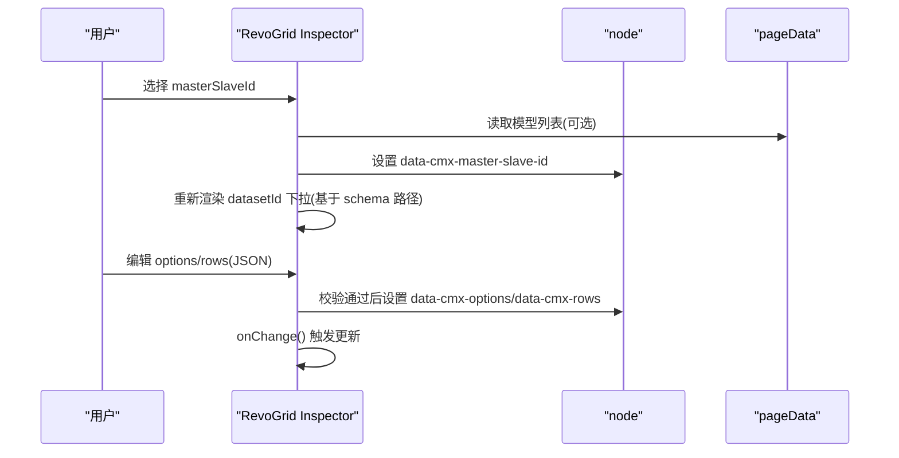
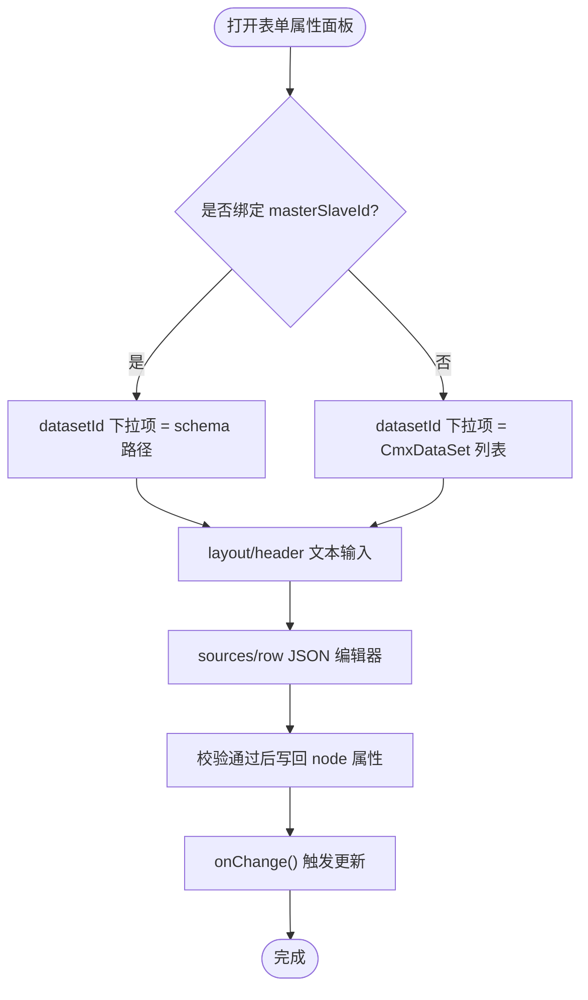
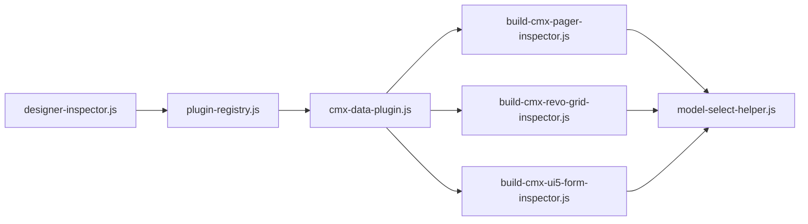

# Inspector 插件开发

<cite>
**本文引用的文件**
- [designer-inspector.js](file://CMXHTMLDesigner/src/components/designer-inspector.js)
- [plugin-registry.js](file://CMXHTMLDesigner/src/lib/plugin-registry.js)
- [cmx-data-plugin.js](file://CMXHTMLDesigner/src/plugins/cmx-data-plugin.js)
- [build-cmx-pager-inspector.js](file://CMXHTMLDesigner/src/plugins/cmx-inspector/build-cmx-pager-inspector.js)
- [build-cmx-revo-grid-inspector.js](file://CMXHTMLDesigner/src/plugins/cmx-inspector/build-cmx-revo-grid-inspector.js)
- [build-cmx-ui5-form-inspector.js](file://CMXHTMLDesigner/src/plugins/cmx-inspector/build-cmx-ui5-form-inspector.js)
- [model-select-helper.js](file://CMXHTMLDesigner/src/plugins/cmx-inspector/model-select-helper.js)
</cite>

## 目录
1. [简介](#简介)
2. [项目结构](#项目结构)
3. [核心组件](#核心组件)
4. [架构总览](#架构总览)
5. [详细组件分析](#详细组件分析)
6. [依赖关系分析](#依赖关系分析)
7. [性能与最佳实践](#性能与最佳实践)
8. [故障排查指南](#故障排查指南)
9. [结论](#结论)
10. [附录：上下文对象 ctx 字段说明](#附录：上下文对象-ctx-字段说明)

## 简介
本文档面向需要在 CMX HTML 设计器中为自定义组件开发“属性面板（Inspector）”的开发者。重点解释：
- 如何通过插件机制注册 customInspectors，使特定标签在右侧属性面板显示专属配置界面
- 上下文对象 ctx 的语义与用法（node、meta、mount、pageData、onChange）
- 复杂组件（分页器、表格、表单等）的属性面板实现范式
- 面板布局、数据绑定、事件处理的最佳实践

## 项目结构
与 Inspector 插件开发直接相关的代码集中在以下位置：
- 设计器右侧属性面板宿主：designer-inspector.js
- 插件注册与 customInspectors 映射：plugin-registry.js
- 组件元数据与 customInspectors 注册入口：cmx-data-plugin.js
- 具体组件的 Inspector 实现：cmx-inspector/*
- 模型选择辅助工具：model-select-helper.js

图表来源
- [designer-inspector.js:16-17](file://CMXHTMLDesigner/src/components/designer-inspector.js#L16-L17)
- [plugin-registry.js:48-94](file://CMXHTMLDesigner/src/lib/plugin-registry.js#L48-L94)
- [cmx-data-plugin.js:46-746](file://CMXHTMLDesigner/src/plugins/cmx-data-plugin.js#L46-L746)

章节来源
- [designer-inspector.js:16-17](file://CMXHTMLDesigner/src/components/designer-inspector.js#L16-L17)
- [plugin-registry.js:48-94](file://CMXHTMLDesigner/src/lib/plugin-registry.js#L48-L94)
- [cmx-data-plugin.js:46-746](file://CMXHTMLDesigner/src/plugins/cmx-data-plugin.js#L46-L746)

## 核心组件
- 属性面板宿主（DesignerInspector）：负责渲染属性/样式/事件/调试四个 Tab，并在选中节点时调用 getCustomInspector(tag) 获取并执行自定义 Inspector。
- 插件注册中心（plugin-registry）：维护 tag → customInspector 函数映射，提供 definePlugin 和 getCustomInspector。
- 数据组件插件（cmx-data-plugin）：集中注册大量 CMX 组件元数据，并通过 customInspectors 将特定标签与专用 Inspector 绑定。
- 各组件 Inspector：以函数形式接收 ctx，向 mount 挂载 DOM，读取/写入 node 属性，通过 onChange 通知上层变更。

章节来源
- [designer-inspector.js:182-293](file://CMXHTMLDesigner/src/components/designer-inspector.js#L182-L293)
- [plugin-registry.js:48-94](file://CMXHTMLDesigner/src/lib/plugin-registry.js#L48-L94)
- [cmx-data-plugin.js:740-746](file://CMXHTMLDesigner/src/plugins/cmx-data-plugin.js#L740-L746)

## 架构总览
下图展示了从“选中节点”到“渲染自定义属性面板”的完整流程，以及 ctx 在各环节中的传递方式。

图表来源
- [designer-inspector.js:182-293](file://CMXHTMLDesigner/src/components/designer-inspector.js#L182-L293)
- [plugin-registry.js:91-94](file://CMXHTMLDesigner/src/lib/plugin-registry.js#L91-L94)

## 详细组件分析

### 自定义 Inspector 注册机制
- 在 cmx-data-plugin.js 中通过 definePlugin 注册组件元数据，并在 customInspectors 中将 tag 映射到对应的构建函数。
- plugin-registry.js 内部维护 Map，将 tag 与渲染函数关联；当 DesignerInspector 渲染属性面板时，会优先查找是否有该 tag 的 customInspector，若有则调用它接管渲染。

章节来源
- [cmx-data-plugin.js:740-746](file://CMXHTMLDesigner/src/plugins/cmx-data-plugin.js#L740-L746)
- [plugin-registry.js:77-82](file://CMXHTMLDesigner/src/lib/plugin-registry.js#L77-L82)
- [designer-inspector.js:270-293](file://CMXHTMLDesigner/src/components/designer-inspector.js#L270-L293)

### 上下文对象 ctx 详解
ctx 由 DesignerInspector 构造并传入自定义 Inspector，包含以下关键属性：
- node: 当前选中的 DOM 元素，用于读写属性、事件绑定等
- meta: 组件元数据（ComponentMeta），描述标签的 attrs、styles、events 等
- mount: 属性面板根节点（已被清空），自定义面板需在此挂载 DOM
- pageData: designer-page-data 组件实例（可为 null），可读取页面模型/数据源/数据流等
- onChange: 回调函数，调用后触发 inspector-change 事件，标记页面数据脏更新

章节来源
- [plugin-registry.js:48-57](file://CMXHTMLDesigner/src/lib/plugin-registry.js#L48-L57)
- [designer-inspector.js:278-288](file://CMXHTMLDesigner/src/components/designer-inspector.js#L278-L288)

### 分页器（cmx-pager）自定义 Inspector
- 功能要点：
  - 协作模式判断：根据是否设置 master-slave-id 自动切换模式
  - 协作字段：协调器实例、分页层
  - 通用字段：初始每页大小、每页大小选项、紧凑模式
  - 独立模式字段：总条数（协作模式下禁用）
- 交互细节：
  - 切换 master-slave-id 时局部重渲染，确保字段启用/灰显状态正确
  - 所有输入均写回 node 对应属性，并调用 onChange 通知上层

图表来源
- [build-cmx-pager-inspector.js:76-179](file://CMXHTMLDesigner/src/plugins/cmx-inspector/build-cmx-pager-inspector.js#L76-L179)

章节来源
- [build-cmx-pager-inspector.js:76-179](file://CMXHTMLDesigner/src/plugins/cmx-inspector/build-cmx-pager-inspector.js#L76-L179)

### 表格（cmx-revo-grid）自定义 Inspector
- 功能要点：
  - 列定义只能引用 CmxColumnModel（通过 modelId 选择行 → data-cmx-model-id）
  - options / rows 使用 JSON 编辑器（cmx-json-textarea）
  - 支持绑定 CmxMasterSlave（masterSlaveId）与 datasetId（schema 路径）
- 交互细节：
  - 动态联动：选择 masterSlaveId 后，datasetId 下拉项变为对应 schema 的路径集合
  - JSON 编辑器校验通过后写回 node 属性，否则移除属性

图表来源
- [build-cmx-revo-grid-inspector.js:20-101](file://CMXHTMLDesigner/src/plugins/cmx-inspector/build-cmx-revo-grid-inspector.js#L20-L101)
- [model-select-helper.js:111-130](file://CMXHTMLDesigner/src/plugins/cmx-inspector/model-select-helper.js#L111-L130)

章节来源
- [build-cmx-revo-grid-inspector.js:20-101](file://CMXHTMLDesigner/src/plugins/cmx-inspector/build-cmx-revo-grid-inspector.js#L20-L101)
- [model-select-helper.js:111-130](file://CMXHTMLDesigner/src/plugins/cmx-inspector/model-select-helper.js#L111-L130)

### 表单（cmx-ui5-form）自定义 Inspector
- 功能要点：
  - 绑定 CmxMasterSlave（masterSlaveId）后自动以 bindForm 挂载（kind=single）
  - 支持 datasetId（schema 路径或 CmxDataSet 实例）
  - 支持 modelId（CmxColumnModel）
  - 支持 layout、header 文本输入
  - sources（字典）、row（初始行数据）使用 JSON 编辑器
- 交互细节：
  - 选择 masterSlaveId 后，datasetId 下拉项变为对应 schema 的路径集合
  - JSON 编辑器校验通过后写回 node 属性

图表来源
- [build-cmx-ui5-form-inspector.js:22-146](file://CMXHTMLDesigner/src/plugins/cmx-inspector/build-cmx-ui5-form-inspector.js#L22-L146)
- [model-select-helper.js:111-130](file://CMXHTMLDesigner/src/plugins/cmx-inspector/model-select-helper.js#L111-L130)

章节来源
- [build-cmx-ui5-form-inspector.js:22-146](file://CMXHTMLDesigner/src/plugins/cmx-inspector/build-cmx-ui5-form-inspector.js#L22-L146)
- [model-select-helper.js:111-130](file://CMXHTMLDesigner/src/plugins/cmx-inspector/model-select-helper.js#L111-L130)

### 模型选择辅助（model-select-helper）
- buildModelSelectRow：生成带“从模型面板选择”下拉行的输入控件，支持指定 items 或按 modelType 过滤 pageData._models
- buildDatasetIdRow：根据当前 masterSlaveId 动态决定 datasetId 的下拉选项（schema 路径或 CmxDataSet 列表）

章节来源
- [model-select-helper.js:18-84](file://CMXHTMLDesigner/src/plugins/cmx-inspector/model-select-helper.js#L18-L84)
- [model-select-helper.js:111-130](file://CMXHTMLDesigner/src/plugins/cmx-inspector/model-select-helper.js#L111-L130)

## 依赖关系分析
- DesignerInspector 依赖 plugin-registry.getCustomInspector 获取自定义渲染函数
- 插件通过 definePlugin 注册组件元数据和 customInspectors
- 各 Inspector 依赖 model-select-helper 提供模型选择能力
- 数据持久化：Inspector 将配置写入 node 的 data-cmx-* 或标准属性，运行时由组件读取

图表来源
- [designer-inspector.js:16-17](file://CMXHTMLDesigner/src/components/designer-inspector.js#L16-L17)
- [plugin-registry.js:77-82](file://CMXHTMLDesigner/src/lib/plugin-registry.js#L77-L82)
- [cmx-data-plugin.js:740-746](file://CMXHTMLDesigner/src/plugins/cmx-data-plugin.js#L740-L746)

章节来源
- [designer-inspector.js:16-17](file://CMXHTMLDesigner/src/components/designer-inspector.js#L16-L17)
- [plugin-registry.js:77-82](file://CMXHTMLDesigner/src/lib/plugin-registry.js#L77-L82)
- [cmx-data-plugin.js:740-746](file://CMXHTMLDesigner/src/plugins/cmx-data-plugin.js#L740-L746)

## 性能与最佳实践
- 避免频繁重建：在 Inspector 中尽量局部更新 DOM，仅在必要场景（如模式切换）整体重建
- 谨慎使用 JSON 编辑器：仅在校验通过后写回属性，减少无效渲染
- 合理使用 onChange：每次属性变更后调用 onChange，确保页面数据标记为脏并刷新
- 使用 model-select-helper：统一模型选择体验，减少重复逻辑
- 保持 UI 一致性：遵循 SAP 主题变量与间距规范，提升可读性

[本节为通用指导，不直接分析具体文件]

## 故障排查指南
- 自定义 Inspector 未生效：
  - 检查是否在 definePlugin 的 customInspectors 中正确映射 tag
  - 确认 getCustomInspector(tag) 能返回函数
- 属性未保存：
  - 确认 Inspector 已将值写入 node 的对应属性（data-cmx-* 或标准属性）
  - 确认 onChange 已调用
- 模型选择为空：
  - 检查 pageData._models 是否存在对应 modelType 的实例
  - 对于 datasetId，确认 masterSlaveId 是否正确设置以加载 schema 路径

章节来源
- [designer-inspector.js:270-293](file://CMXHTMLDesigner/src/components/designer-inspector.js#L270-L293)
- [plugin-registry.js:91-94](file://CMXHTMLDesigner/src/lib/plugin-registry.js#L91-L94)
- [cmx-data-plugin.js:740-746](file://CMXHTMLDesigner/src/plugins/cmx-data-plugin.js#L740-L746)

## 结论
通过插件机制与 customInspectors，可以为任意组件提供高度定制化的属性面板。结合 ctx 提供的 node、meta、mount、pageData、onChange，开发者可以灵活地实现复杂组件的配置界面，并确保与设计器其他模块的良好集成。建议遵循现有实现范式，复用 model-select-helper 等工具，提升一致性与可维护性。

[本节为总结，不直接分析具体文件]

## 附录：上下文对象 ctx 字段说明
- node: 当前选中的 DOM 元素，用于读写属性、事件绑定等
- meta: 组件元数据（ComponentMeta），描述标签的 attrs、styles、events 等
- mount: 属性面板根节点（已被清空），自定义面板需在此挂载 DOM
- pageData: designer-page-data 组件实例（可为 null），可读取页面模型/数据源/数据流等
- onChange: 回调函数，调用后触发 inspector-change 事件，标记页面数据脏更新

章节来源
- [plugin-registry.js:48-57](file://CMXHTMLDesigner/src/lib/plugin-registry.js#L48-L57)
- [designer-inspector.js:278-288](file://CMXHTMLDesigner/src/components/designer-inspector.js#L278-L288)