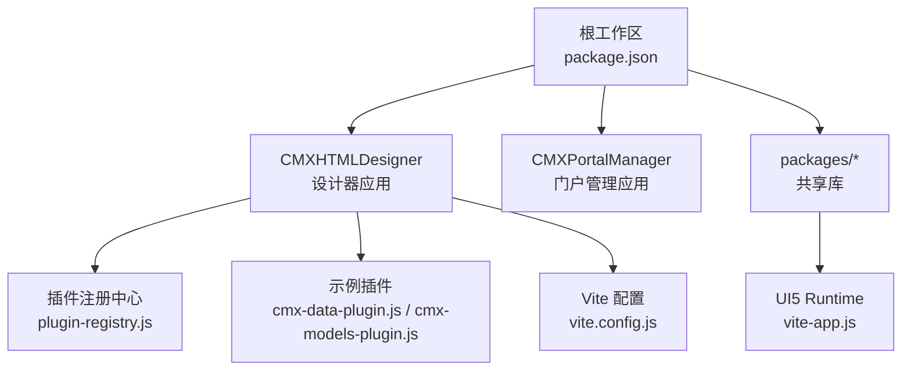
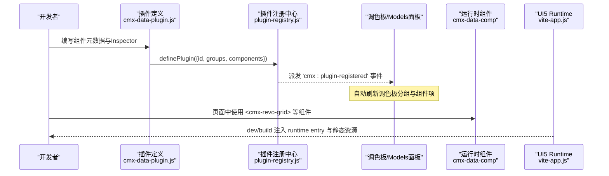
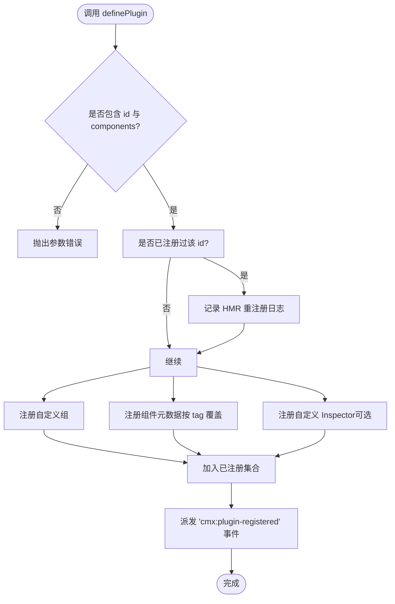
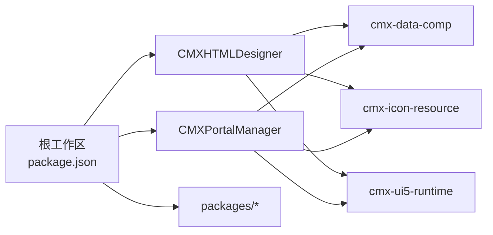

# 插件开发指南

<cite>
**本文引用的文件**
- [package.json](file://package.json)
- [CMXHTMLDesigner/package.json](file://CMXHTMLDesigner/package.json)
- [CMXPortalManager/package.json](file://CMXPortalManager/package.json)
- [vite.config.js](file://CMXHTMLDesigner/vite.config.js)
- [scripts/run-vite.mjs](file://CMXHTMLDesigner/scripts/run-vite.mjs)
- [src/lib/plugin-registry.js](file://CMXHTMLDesigner/src/lib/plugin-registry.js)
- [src/plugins/cmx-data-plugin.js](file://CMXHTMLDesigner/src/plugins/cmx-data-plugin.js)
- [src/plugins/cmx-models-plugin.js](file://CMXHTMLDesigner/src/plugins/cmx-models-plugin.js)
- [packages/cmx-ui5-runtime/vite-app.js](file://packages/cmx-ui5-runtime/vite-app.js)
- [vitest.config.js](file://CMXHTMLDesigner/vitest.config.js)
- [src/utils/cmx-console.js](file://CMXHTMLDesigner/src/utils/cmx-console.js)
</cite>

## 目录
1. [简介](#简介)
2. [项目结构](#项目结构)
3. [核心组件](#核心组件)
4. [架构总览](#架构总览)
5. [详细组件分析](#详细组件分析)
6. [依赖分析](#依赖分析)
7. [性能考虑](#性能考虑)
8. [故障排查](#故障排查)
9. [结论](#结论)
10. [附录](#附录)

## 简介
本指南面向希望在 CMX HTML 设计器中扩展自定义组件与模型的开发人员，提供从零搭建插件开发环境的完整步骤、目录组织规范、打包发布与版本管理最佳实践、模板与示例指引，以及代码规范、测试策略与调试技巧。文档基于仓库内现有实现进行提炼，确保可落地执行。

## 项目结构
仓库采用 monorepo 组织方式，根 package.json 通过 workspaces 聚合多个子工程：
- packages/*：共享库（如 cmx-data-comp、cmx-icon-resource、cmx-ui5-runtime）
- CMXHTMLDesigner：可视化设计器应用，内置插件注册机制与示例插件
- CMXPortalManager：门户管理应用，复用共享库并集成 UI5 runtime

关键要点
- 统一使用 Vite 作为构建工具，支持多环境 .env.<mode> 配置
- 插件系统集中在 CMXHTMLDesigner 的 src/lib/plugin-registry.js，并通过 src/plugins 下的示例插件展示用法
- 运行时与 UI5 资源由 cmx-ui5-runtime 提供，Vite 插件负责注入与代理

**图表来源**
- [package.json:1-39](file://package.json#L1-L39)
- [CMXHTMLDesigner/vite.config.js:1-118](file://CMXHTMLDesigner/vite.config.js#L1-L118)
- [packages/cmx-ui5-runtime/vite-app.js:113-174](file://packages/cmx-ui5-runtime/vite-app.js#L113-L174)

**章节来源**
- [package.json:1-39](file://package.json#L1-L39)
- [CMXHTMLDesigner/package.json:1-39](file://CMXHTMLDesigner/package.json#L1-L39)
- [CMXPortalManager/package.json:1-62](file://CMXPortalManager/package.json#L1-L62)

## 核心组件
- 插件注册中心：提供 definePlugin 接口，用于动态注册组件元数据、分组与自定义 Inspector；注册成功后派发事件以刷新调色板
- 示例插件：
  - cmx-data-plugin：注册数据类组件（网格、表单、树、分页等）及其属性、事件与默认值
  - cmx-models-plugin：注册不可视数据层模型（数据集、主从协调器、列模型、字典/单据元数据、弹性组合）到 Models 面板
- 构建与运行：
  - Vite 配置：别名映射、依赖去重、代理后端、环境变量分层、多入口构建
  - run-vite.mjs：稳定启动 Vite CLI，避免路径解析问题
  - UI5 Runtime 插件：dev/build 模式差异化处理，注入 runtime entry 与静态托管

**章节来源**
- [src/lib/plugin-registry.js:1-95](file://CMXHTMLDesigner/src/lib/plugin-registry.js#L1-L95)
- [src/plugins/cmx-data-plugin.js:1-747](file://CMXHTMLDesigner/src/plugins/cmx-data-plugin.js#L1-L747)
- [src/plugins/cmx-models-plugin.js:1-118](file://CMXHTMLDesigner/src/plugins/cmx-models-plugin.js#L1-L118)
- [CMXHTMLDesigner/vite.config.js:1-118](file://CMXHTMLDesigner/vite.config.js#L1-L118)
- [CMXHTMLDesigner/scripts/run-vite.mjs:1-30](file://CMXHTMLDesigner/scripts/run-vite.mjs#L1-L30)
- [packages/cmx-ui5-runtime/vite-app.js:113-174](file://packages/cmx-ui5-runtime/vite-app.js#L113-L174)

## 架构总览
插件在“设计时”通过 definePlugin 将组件元数据注入调色板与属性面板；在“运行时”，组件通过 cmx-data-comp 暴露的 Web Components 被页面引用。UI5 相关能力由 cmx-ui5-runtime 提供，Vite 插件在 dev/build 阶段完成资源注入与代理。

**图表来源**
- [src/plugins/cmx-data-plugin.js:46-747](file://CMXHTMLDesigner/src/plugins/cmx-data-plugin.js#L46-L747)
- [src/lib/plugin-registry.js:60-89](file://CMXHTMLDesigner/src/lib/plugin-registry.js#L60-L89)
- [packages/cmx-ui5-runtime/vite-app.js:134-174](file://packages/cmx-ui5-runtime/vite-app.js#L134-L174)

## 详细组件分析

### 插件注册中心（plugin-registry）
职责
- 校验插件对象（必填 id、components）
- 注册自定义组与组件元数据（按 tag 覆盖，支持 HMR 重注册）
- 注册自定义 Inspector 渲染函数（tag → 渲染函数）
- 派发注册成功事件，驱动 UI 刷新

数据结构
- GroupDef：{ id, label, icon, order?, collapsed? }
- ComponentMeta：与 metadata/tags/*.json 一致，包含 tag、group、label、description、canNest、isVoid、attrs、styleGroups、eventPreset、extraEvents、defaults 等
- customInspectors：{ [tag]: (ctx) => void }，ctx 包含 node、meta、mount、pageData、onChange

复杂度与性能
- 注册过程为 O(n)（n 为组件数量），HMR 场景下按 tag 覆盖，避免重复注册开销
- 事件派发轻量，仅通知 UI 刷新

错误处理
- 缺少 id 或 components 为空时抛出错误，便于早期发现配置问题

**图表来源**
- [src/lib/plugin-registry.js:60-89](file://CMXHTMLDesigner/src/lib/plugin-registry.js#L60-L89)

**章节来源**
- [src/lib/plugin-registry.js:1-95](file://CMXHTMLDesigner/src/lib/plugin-registry.js#L1-L95)

### 示例插件：cmx-data-plugin
作用
- 将数据类组件（网格、表单、树、分页、输入控件、面板、工具条、状态标签、空状态、描述清单、筛选条、KPI 卡等）注册到设计器调色板
- 声明每个组件的属性、事件、默认值与样式分组
- 为复杂组件提供自定义 Inspector（如网格、表单、树、分页）

关键点
- attrs 同时作为序列化白名单，未声明的属性在保存时被过滤
- extraEvents 声明组件对外暴露的事件，便于脚本绑定
- defaults 提供拖入时的初始结构与样式，提升设计体验

**章节来源**
- [src/plugins/cmx-data-plugin.js:1-747](file://CMXHTMLDesigner/src/plugins/cmx-data-plugin.js#L1-L747)

### 示例插件：cmx-models-plugin
作用
- 将不可视数据层模型（数据集、主从协调器、列模型、字典/单据元数据、弹性组合）注册到 Models 面板
- 暴露设计时模型类引用至全局，供 pageFns 与调试控制台使用

关键点
- modelOnly: true 表示这些模型仅在 Models 面板可见，不进入画布 DOM
- 通过 globalThis.__cmxDataComp 暴露常用模型类与初始化函数

**章节来源**
- [src/plugins/cmx-models-plugin.js:1-118](file://CMXHTMLDesigner/src/plugins/cmx-models-plugin.js#L1-L118)

### 构建与运行（Vite + UI5 Runtime）
- Vite 配置
  - 环境变量分层：.env、.env.production、shell 环境变量优先级最高
  - base 与代理：生产 base 为绝对路径，/shared、/api、/rpc、/graphql、/trpc、/sse、/ws 代理到后端目标
  - 别名与去重：对 cmx-data-comp、cmx-ui5-runtime 等关键包进行别名与去重，避免多实例
  - 多入口构建：main、login、preview、debug
- run-vite.mjs
  - 定位本地或 monorepo 根 node_modules 中的 vite 二进制，避免路径解析失败
- UI5 Runtime 插件
  - dev 模式：不 external UI5，直接解析源码，消除双实例
  - build 模式：替换 __CMX_UI5_RUNTIME_ENTRY__ 为带 hash 的 runtime entry，并从 manifest 读取正确路径

**章节来源**
- [CMXHTMLDesigner/vite.config.js:1-118](file://CMXHTMLDesigner/vite.config.js#L1-L118)
- [CMXHTMLDesigner/scripts/run-vite.mjs:1-30](file://CMXHTMLDesigner/scripts/run-vite.mjs#L1-L30)
- [packages/cmx-ui5-runtime/vite-app.js:113-174](file://packages/cmx-ui5-runtime/vite-app.js#L113-L174)

## 依赖分析
- 工作区依赖
  - 根 package.json 通过 workspaces 聚合 CMXHTMLDesigner、CMXPortalManager 与 packages/*
  - 统一 overrides vitest 与 graphql 版本，保证测试一致性
- 应用依赖
  - CMXHTMLDesigner 依赖 cmx-data-comp、cmx-icon-resource、cmx-ui5-runtime 及 UI5 WebComponents
  - CMXPortalManager 同样复用上述共享库，并集成 Fastify、tRPC、gRPC 等后端能力（legacy 备份）
- 构建依赖
  - Vite、Vitest、ESLint、UI5 Runtime 插件

**图表来源**
- [package.json:1-39](file://package.json#L1-L39)
- [CMXHTMLDesigner/package.json:1-39](file://CMXHTMLDesigner/package.json#L1-L39)
- [CMXPortalManager/package.json:1-62](file://CMXPortalManager/package.json#L1-L62)

**章节来源**
- [package.json:1-39](file://package.json#L1-L39)
- [CMXHTMLDesigner/package.json:1-39](file://CMXHTMLDesigner/package.json#L1-L39)
- [CMXPortalManager/package.json:1-62](file://CMXPortalManager/package.json#L1-L62)

## 性能考虑
- 依赖去重：在 Vite resolve.dedupe 中对 UI5 与 cmx-ui5-runtime 进行去重，避免多实例导致的内存与样式冲突
- 优化排除：optimizeDeps.exclude 排除大型 UI5 包，减少预构建时间
- 按需加载：插件仅引入所需组件与 Inspector，避免全量导入带来的体积膨胀
- 构建产物：开启 sourcemap 与 chunkSizeWarningLimit，便于定位大模块与调试

[本节为通用指导，无需特定文件来源]

## 故障排查
常见问题与对策
- 插件未生效
  - 检查 definePlugin 是否传入 id 与 components；确认组件 tag 与 group 是否正确
  - 查看浏览器控制台是否有 'cmx:plugin-registered' 事件派发
- HMR 重注册异常
  - 确认插件 id 唯一；重注册会按 tag 覆盖元数据与 Inspector
- 属性未持久化
  - 确保 attrs 中声明了所有需要保存的属性；未声明的属性会被过滤
- 调试困难
  - 使用 cmx-console 劫持 console 输出，将日志双写到 DevTools 与自定义 sink
  - 在 CodeMirror 编辑器中插入 debugger 断点，逐步排查脚本逻辑

**章节来源**
- [src/lib/plugin-registry.js:60-89](file://CMXHTMLDesigner/src/lib/plugin-registry.js#L60-L89)
- [src/utils/cmx-console.js:1-46](file://CMXHTMLDesigner/src/utils/cmx-console.js#L1-L46)

## 结论
本指南基于仓库现有实现，提供了插件开发的环境搭建、目录组织、打包发布、版本管理、模板示例、代码规范、测试策略与调试技巧。遵循插件注册中心的约定与示例插件的模式，可以快速扩展设计器的组件与模型能力，并在开发与生产环境中获得一致的构建与运行体验。

## 附录

### 插件开发环境搭建步骤
- 安装依赖
  - 在仓库根目录执行 npm install，确保 workspaces 与 overrides 生效
- 启动设计器
  - 使用 CMXHTMLDesigner 的 scripts/run-vite.mjs 启动 Vite，避免路径解析问题
- 配置环境变量
  - 创建 .env、.env.production 等文件，设置 CMX_APP_BASE、CMX_VITE_BACKEND 等变量
- 编写插件
  - 在 src/plugins 下新建插件文件，使用 definePlugin 注册组件与模型
  - 参考 cmx-data-plugin.js 与 cmx-models-plugin.js 的结构与写法

**章节来源**
- [CMXHTMLDesigner/scripts/run-vite.mjs:1-30](file://CMXHTMLDesigner/scripts/run-vite.mjs#L1-L30)
- [CMXHTMLDesigner/vite.config.js:16-31](file://CMXHTMLDesigner/vite.config.js#L16-L31)
- [src/plugins/cmx-data-plugin.js:46-747](file://CMXHTMLDesigner/src/plugins/cmx-data-plugin.js#L46-L747)
- [src/plugins/cmx-models-plugin.js:39-118](file://CMXHTMLDesigner/src/plugins/cmx-models-plugin.js#L39-L118)

### 目录结构与文件组织规范
- 插件文件
  - 放在 src/plugins 下，按功能拆分（如 cmx-data-plugin.js、cmx-models-plugin.js）
  - 自定义 Inspector 放在 src/plugins/cmx-inspector 下，便于维护
- 元数据与分组
  - 通过 definePlugin 的 groups 与 components 字段声明，保持与 metadata/tags/*.json 一致的格式
- 构建配置
  - Vite 配置位于 CMXHTMLDesigner/vite.config.js，集中管理别名、代理与构建选项
- 运行时集成
  - 通过 cmx-ui5-runtime 的 vite-app 插件注入 runtime entry 与静态资源

**章节来源**
- [src/lib/plugin-registry.js:1-95](file://CMXHTMLDesigner/src/lib/plugin-registry.js#L1-L95)
- [CMXHTMLDesigner/vite.config.js:33-103](file://CMXHTMLDesigner/vite.config.js#L33-L103)
- [packages/cmx-ui5-runtime/vite-app.js:134-174](file://packages/cmx-ui5-runtime/vite-app.js#L134-L174)

### 打包、发布与版本管理最佳实践
- 版本信息
  - 通过 package.json 的 version 字段管理应用版本，构建时注入 __APP_VERSION__ 与 __BUILD_TIME__
- 多环境构建
  - 使用 --mode 指定 .env.<mode> 文件，实现不同环境的 base 与后端地址配置
- 产物输出
  - 构建输出到 dist 目录，包含 main、login、preview、debug 多入口
- 依赖锁定
  - 根 package.json 使用 overrides 统一 vitest 与 graphql 版本，确保测试一致性

**章节来源**
- [CMXHTMLDesigner/vite.config.js:86-103](file://CMXHTMLDesigner/vite.config.js#L86-L103)
- [package.json:11-25](file://package.json#L11-L25)

### 插件开发模板与示例项目
- 最小模板
  - 新建 src/plugins/my-plugin.js，import definePlugin，调用 definePlugin({ id, groups, components })
  - 参考 cmx-models-plugin.js 的 modelOnly 模型注册方式
- 复杂组件模板
  - 参考 cmx-data-plugin.js，声明 attrs、extraEvents、defaults、styleGroups
  - 为复杂组件编写自定义 Inspector，放在 src/plugins/cmx-inspector 下

**章节来源**
- [src/plugins/cmx-models-plugin.js:39-118](file://CMXHTMLDesigner/src/plugins/cmx-models-plugin.js#L39-L118)
- [src/plugins/cmx-data-plugin.js:46-747](file://CMXHTMLDesigner/src/plugins/cmx-data-plugin.js#L46-L747)

### 代码规范、测试策略与调试技巧
- 代码规范
  - 使用 ESLint 进行静态检查（CMXPortalManager 提供 eslint.config.js）
  - 保持插件命名与分组清晰，attrs 与 events 命名一致
- 测试策略
  - 使用 Vitest 进行单元测试，CMXHTMLDesigner 与 cmx-data-comp 均提供 vitest.config.js
  - 覆盖率阈值与报告格式可在配置中调整
- 调试技巧
  - 使用 cmx-console 劫持 console 输出，双写日志到 DevTools 与自定义 sink
  - 在编辑器中插入 debugger 断点，逐步排查脚本逻辑

**章节来源**
- [CMXHTMLDesigner/vitest.config.js:1-14](file://CMXHTMLDesigner/vitest.config.js#L1-L14)
- [src/utils/cmx-console.js:1-46](file://CMXHTMLDesigner/src/utils/cmx-console.js#L1-L46)