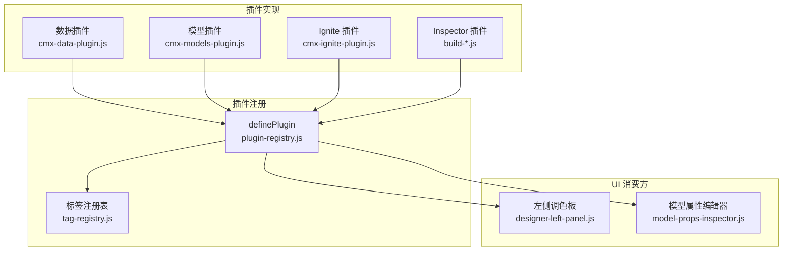
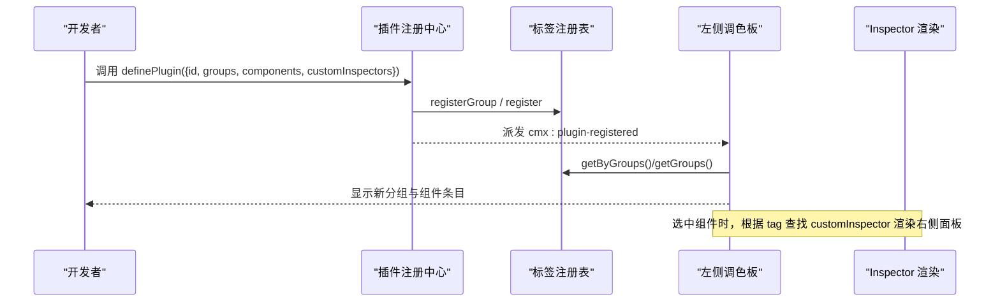
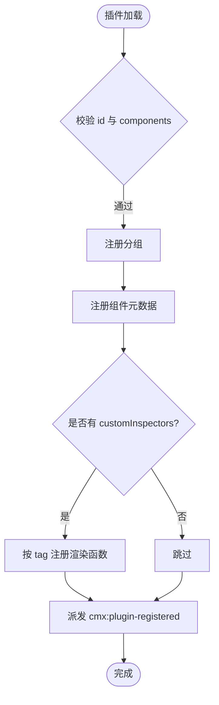
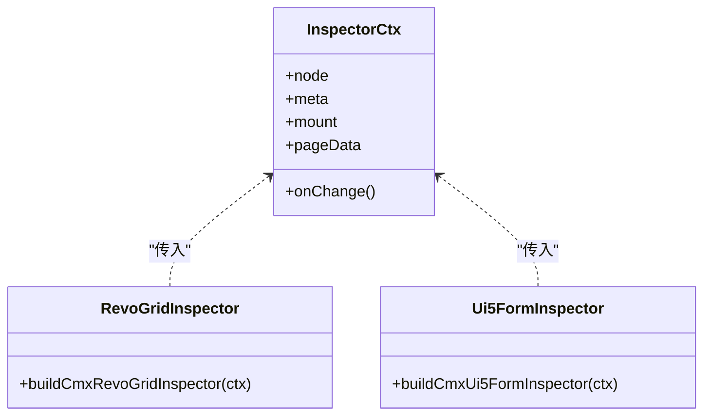
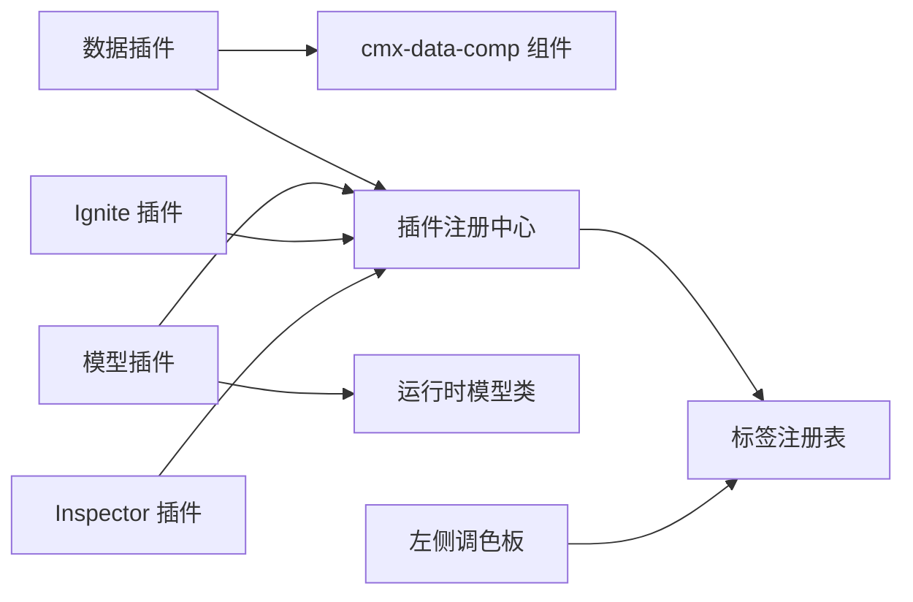

# 插件扩展系统

<cite>
**本文引用的文件**
- [plugin-registry.js](file://CMXHTMLDesigner/src/lib/plugin-registry.js)
- [tag-registry.js](file://CMXHTMLDesigner/src/metadata/tag-registry.js)
- [designer-left-panel.js](file://CMXHTMLDesigner/src/components/designer-left-panel.js)
- [cmx-data-plugin.js](file://CMXHTMLDesigner/src/plugins/cmx-data-plugin.js)
- [cmx-models-plugin.js](file://CMXHTMLDesigner/src/plugins/cmx-models-plugin.js)
- [cmx-ignite-plugin.js](file://CMXHTMLDesigner/src/plugins/cmx-ignite-plugin.js)
- [build-cmx-revo-grid-inspector.js](file://CMXHTMLDesigner/src/plugins/cmx-inspector/build-cmx-revo-grid-inspector.js)
- [build-cmx-ui5-form-inspector.js](file://CMXHTMLDesigner/src/plugins/cmx-inspector/build-cmx-ui5-form-inspector.js)
- [model-props-inspector.js](file://CMXHTMLDesigner/src/components/designer-inspector/model-props-inspector.js)
- [page-interface-registry.js](file://CMXHTMLDesigner/src/components/designer-page-data/page-interface-registry.js)
</cite>

## 目录
1. [简介](#简介)
2. [项目结构](#项目结构)
3. [核心组件](#核心组件)
4. [架构总览](#架构总览)
5. [详细组件分析](#详细组件分析)
6. [依赖关系分析](#依赖关系分析)
7. [性能考量](#性能考量)
8. [故障排查指南](#故障排查指南)
9. [结论](#结论)
10. [附录：开发规范与最佳实践](#附录开发规范与最佳实践)

## 简介
本文件面向“可视化设计器”的插件扩展系统，系统性说明插件注册机制、生命周期管理、扩展点设计与三类插件（Inspector 插件、数据插件、适配器/模型插件）的开发规范。同时给出插件间依赖管理与冲突解决策略、打包分发与版本管理建议，以及可操作的 API 参考与示例路径。

## 项目结构
- 插件注册中心位于设计器的 lib 层，提供 definePlugin/getCustomInspector 等能力，负责将插件声明的分组与组件元数据注入到标签注册表，并派发事件通知 UI 刷新。
- 标签元数据注册表集中维护分组、样式组、事件预设与标签元数据，支持运行时加载与动态覆盖。
- 左侧调色板监听插件注册事件，自动渲染新增分组与组件条目，支持搜索与拖拽。
- 内置三类插件：
  - 数据插件：注册大量数据类 Web Components 及其属性、事件与默认值。
  - 模型插件：注册不可视数据层模型（如 CmxDataSet、CmxMasterSlave 等），仅出现在 Models 面板。
  - Inspector 插件：为特定组件提供自定义右侧属性面板渲染函数。
  - 适配器/框架插件：封装第三方或框架组件（Ignite/SpreadJS）并暴露统一配置接口。

**图示来源**
- [plugin-registry.js:60-89](file://CMXHTMLDesigner/src/lib/plugin-registry.js#L60-L89)
- [tag-registry.js:15-118](file://CMXHTMLDesigner/src/metadata/tag-registry.js#L15-L118)
- [designer-left-panel.js:230-237](file://CMXHTMLDesigner/src/components/designer-left-panel.js#L230-L237)
- [cmx-data-plugin.js:46-746](file://CMXHTMLDesigner/src/plugins/cmx-data-plugin.js#L46-L746)
- [cmx-models-plugin.js:39-117](file://CMXHTMLDesigner/src/plugins/cmx-models-plugin.js#L39-L117)
- [cmx-ignite-plugin.js:18-124](file://CMXHTMLDesigner/src/plugins/cmx-ignite-plugin.js#L18-L124)

**章节来源**
- [plugin-registry.js:1-95](file://CMXHTMLDesigner/src/lib/plugin-registry.js#L1-L95)
- [tag-registry.js:1-149](file://CMXHTMLDesigner/src/metadata/tag-registry.js#L1-L149)
- [designer-left-panel.js:1-326](file://CMXHTMLDesigner/src/components/designer-left-panel.js#L1-L326)

## 核心组件
- 插件注册中心（plugin-registry.js）
  - 提供 definePlugin(plugin)：校验必填字段、注册分组与组件元数据、可选注册 customInspectors、去重保护、派发 cmx:plugin-registered 事件。
  - 提供 getCustomInspector(tag)：供 Inspector 渲染管线按 tag 获取自定义渲染函数。
- 标签注册表（tag-registry.js）
  - 维护分组、样式组、事件预设与标签元数据；支持 registerGroup/register/registerAll/getByGroups/get 等。
  - ensureTagRegistryLoaded() 异步加载 common-attrs/style-groups/event-presets/tag-index 并批量注册。
- 左侧调色板（designer-left-panel.js）
  - 订阅 cmx:plugin-registered 事件，重新渲染分组与条目；支持搜索过滤与拖拽（区分 modelOnly）。
- 模型属性编辑器（model-props-inspector.js）
  - 针对 CmxDataSet/CmxMasterSlave/CmxColumnModel/FlexibleCombination 提供右侧属性编辑界面，驱动 pageData 中的模型实例变更。

**章节来源**
- [plugin-registry.js:43-95](file://CMXHTMLDesigner/src/lib/plugin-registry.js#L43-L95)
- [tag-registry.js:15-118](file://CMXHTMLDesigner/src/metadata/tag-registry.js#L15-L118)
- [designer-left-panel.js:230-326](file://CMXHTMLDesigner/src/components/designer-left-panel.js#L230-L326)
- [model-props-inspector.js:14-35](file://CMXHTMLDesigner/src/components/designer-inspector/model-props-inspector.js#L14-L35)

## 架构总览
插件扩展系统采用“声明式注册 + 事件驱动 + 可扩展渲染”的架构：
- 插件以 JSON-like 对象声明分组与组件元数据，调用 definePlugin 完成注册。
- 注册表聚合所有标签元数据，供调色板与属性面板消费。
- 插件通过 customInspectors 提供复杂属性的可视化编辑能力。
- 页面生命周期与数据绑定由 page-interface-registry 定义，配合模型插件暴露的运行时类进行数据装配。

**图示来源**
- [plugin-registry.js:60-89](file://CMXHTMLDesigner/src/lib/plugin-registry.js#L60-L89)
- [tag-registry.js:30-55](file://CMXHTMLDesigner/src/metadata/tag-registry.js#L30-L55)
- [designer-left-panel.js:230-237](file://CMXHTMLDesigner/src/components/designer-left-panel.js#L230-L237)

## 详细组件分析

### 插件注册机制与生命周期
- 注册流程
  - 校验 plugin.id 与 plugin.components 非空。
  - 注册自定义分组（同 id 跳过重复）。
  - 注册组件元数据（同 tag 覆盖，便于 HMR 热更新）。
  - 可选注册 customInspectors（按 tag 覆盖）。
  - 记录已注册插件 id，防止重复注册。
  - 派发 cmx:plugin-registered 事件，携带插件 id、组件数量与是否重注册标记。
- 生命周期
  - 设计期：插件在模块加载时执行 definePlugin，立即生效于调色板与 Inspector。
  - 运行期：组件通过 data-cmx-* 属性读取配置，运行时由 init/pageFns 初始化数据与绑定。
  - 页面生命周期：initPage/onActivate/onDeactivate/onDispose 等钩子由 page-interface-registry 定义，用于数据加载与资源清理。

**图示来源**
- [plugin-registry.js:60-89](file://CMXHTMLDesigner/src/lib/plugin-registry.js#L60-L89)

**章节来源**
- [plugin-registry.js:60-89](file://CMXHTMLDesigner/src/lib/plugin-registry.js#L60-L89)
- [page-interface-registry.js:128-161](file://CMXHTMLDesigner/src/components/designer-page-data/page-interface-registry.js#L128-L161)

### 数据插件（cmx-data-plugin.js）
- 职责
  - 引入并注册一系列数据类 Web Components（表格、表单、树视图、分页、组合框、字典选择、展示组件等）。
  - 为每个组件声明 attrs、extraEvents、defaults、styleGroups，使设计期可配置、运行期可读。
  - 通过 customInspectors 为复杂组件（如 cmx-revo-grid、cmx-ui5-form、cmx-web-treeview、cmx-pager）提供专用属性面板。
- 关键特性
  - 使用 data-cmx-* 属性约定配置键，保证序列化一致性与运行时可解析性。
  - 支持主从协调器（CmxMasterSlave）与数据集（CmxDataSet）绑定，实现联动刷新。
  - 提供展示类组件（面板、工具条、状态标签、空状态、描述清单、筛选条、KPI 卡）的统一入口。

**章节来源**
- [cmx-data-plugin.js:1-747](file://CMXHTMLDesigner/src/plugins/cmx-data-plugin.js#L1-L747)

### 模型插件（cmx-models-plugin.js）
- 职责
  - 注册不可视数据层模型（CmxDataSet、CmxMasterSlave、CmxColumnModel、CmxDCTMeta、CmxDOCMeta、FlexibleCombination 等）至 Models 分组。
  - 将运行时类暴露给全局 __cmxDataComp 与 __cmxInitPageModels，供调试控制台与脚本使用。
- 设计要点
  - modelOnly=true 表示仅出现在 Models 面板，不参与画布拖拽。
  - 与数据插件协同，形成“模型定义 + 组件绑定”的完整链路。

**章节来源**
- [cmx-models-plugin.js:1-118](file://CMXHTMLDesigner/src/plugins/cmx-models-plugin.js#L1-L118)

### Inspector 插件（customInspectors）
- 职责
  - 为特定组件提供右侧属性面板渲染函数，接收 ctx={node, meta, mount, pageData, onChange}。
  - 通过设置 node 的 data-cmx-* 属性与触发 onChange 来持久化配置。
- 典型实现
  - build-cmx-revo-grid-inspector.js：绑定 masterSlaveId/datasetId/modelId，提供 options/rows JSON 编辑器。
  - build-cmx-ui5-form-inspector.js：绑定表单布局、头信息、sources/row JSON 编辑器，联动列模型。
- 扩展点
  - 在插件中通过 customInspectors 映射 tag → 渲染函数，即可为任意组件定制属性面板。

**图示来源**
- [build-cmx-revo-grid-inspector.js:20-101](file://CMXHTMLDesigner/src/plugins/cmx-inspector/build-cmx-revo-grid-inspector.js#L20-L101)
- [build-cmx-ui5-form-inspector.js:22-145](file://CMXHTMLDesigner/src/plugins/cmx-inspector/build-cmx-ui5-form-inspector.js#L22-L145)

**章节来源**
- [build-cmx-revo-grid-inspector.js:1-102](file://CMXHTMLDesigner/src/plugins/cmx-inspector/build-cmx-revo-grid-inspector.js#L1-L102)
- [build-cmx-ui5-form-inspector.js:1-146](file://CMXHTMLDesigner/src/plugins/cmx-inspector/build-cmx-ui5-form-inspector.js#L1-L146)

### 适配器/框架插件（cmx-ignite-plugin.js）
- 职责
  - 封装 Ignite/SpreadJS 等第三方组件，统一暴露 data-cmx-* 配置与事件，屏蔽底层差异。
  - 注册到调色板，使设计师可直接拖拽使用。
- 适用场景
  - 报表电子表格、下拉列表、行列表等需要商业库能力的场景。

**章节来源**
- [cmx-ignite-plugin.js:1-125](file://CMXHTMLDesigner/src/plugins/cmx-ignite-plugin.js#L1-L125)

## 依赖关系分析
- 耦合度
  - 插件与注册中心低耦合：仅依赖 definePlugin 与 registry 内部能力。
  - UI 与注册表解耦：通过事件与查询接口交互。
- 直接依赖
  - 数据插件依赖多个 cmx-data-comp 组件与内置字段类型。
  - 模型插件依赖运行时模型类与初始化函数。
  - Inspector 插件依赖通用 JSON 编辑器与模型选择辅助。
- 间接依赖
  - 页面生命周期与数据绑定通过 page-interface-registry 与模型插件暴露的运行时类协作。

**图示来源**
- [cmx-data-plugin.js:15-45](file://CMXHTMLDesigner/src/plugins/cmx-data-plugin.js#L15-L45)
- [cmx-models-plugin.js:8-20](file://CMXHTMLDesigner/src/plugins/cmx-models-plugin.js#L8-L20)
- [cmx-ignite-plugin.js:12-17](file://CMXHTMLDesigner/src/plugins/cmx-ignite-plugin.js#L12-L17)
- [plugin-registry.js:43-89](file://CMXHTMLDesigner/src/lib/plugin-registry.js#L43-L89)
- [tag-registry.js:15-118](file://CMXHTMLDesigner/src/metadata/tag-registry.js#L15-L118)
- [designer-left-panel.js:230-237](file://CMXHTMLDesigner/src/components/designer-left-panel.js#L230-L237)

**章节来源**
- [cmx-data-plugin.js:15-45](file://CMXHTMLDesigner/src/plugins/cmx-data-plugin.js#L15-L45)
- [cmx-models-plugin.js:8-20](file://CMXHTMLDesigner/src/plugins/cmx-models-plugin.js#L8-L20)
- [cmx-ignite-plugin.js:12-17](file://CMXHTMLDesigner/src/plugins/cmx-ignite-plugin.js#L12-L17)

## 性能考量
- 懒加载与按需引入
  - 插件仅在需要时引入对应组件与 Inspector，避免一次性加载全部依赖。
- 注册表缓存
  - 标签元数据通过 ensureTagRegistryLoaded 单次加载并缓存 Promise，避免重复网络请求。
- 重注册优化
  - 支持 HMR 重注册时按 tag 覆盖，减少 DOM 重建成本。
- 属性面板渲染
  - Inspector 仅对选中组件渲染，避免全量构建昂贵 UI。

[本节为通用指导，不直接分析具体文件]

## 故障排查指南
- 插件未显示在调色板
  - 检查 definePlugin 是否被调用且 plugin.id 与 components 非空。
  - 确认 ensureTagRegistryLoaded 已完成，分组与样式组已加载。
  - 查看浏览器事件面板是否收到 cmx:plugin-registered。
- 组件属性未保存
  - 确保 Inspector 通过 onChange 触发 dirty 标记，并写入 data-cmx-* 属性。
  - 检查 attrs 白名单是否包含目标属性名。
- 模型绑定失效
  - 确认 CmxMasterSlave/CmxDataSet 已声明并在 Models 面板可见。
  - 检查 datasetId/masterSlaveId/modelId 是否正确关联。
- 页面生命周期问题
  - 核对 initPage/onActivate/onDeactivate/onDispose 的实现是否符合契约。

**章节来源**
- [plugin-registry.js:60-89](file://CMXHTMLDesigner/src/lib/plugin-registry.js#L60-L89)
- [designer-left-panel.js:230-237](file://CMXHTMLDesigner/src/components/designer-left-panel.js#L230-L237)
- [page-interface-registry.js:128-161](file://CMXHTMLDesigner/src/components/designer-page-data/page-interface-registry.js#L128-L161)

## 结论
该插件扩展系统以声明式注册为核心，结合事件驱动的 UI 刷新与可扩展的 Inspector 渲染，实现了高度解耦与可插拔的设计。数据插件、模型插件与适配器插件各司其职，共同支撑可视化设计器的丰富生态。通过统一的属性约定与生命周期钩子，开发者可以高效扩展组件能力、定制属性面板，并安全地集成第三方库。

[本节为总结性内容，不直接分析具体文件]

## 附录：开发规范与最佳实践

### 插件开发指南
- 最小可用插件
  - 创建插件文件，导入 definePlugin，声明 id、groups、components，必要时添加 customInspectors。
  - 在应用入口或模块加载时执行 definePlugin。
- 组件元数据
  - 明确 tag、group、label、description、canNest、isVoid。
  - 使用 data-cmx-* 命名约定存储配置，确保序列化一致性。
  - 通过 extraEvents 声明组件对外事件，便于设计期绑定。
- 自定义 Inspector
  - 实现渲染函数，接收 ctx，写入 mount，并通过 onChange 提交变更。
  - 复用 cmx-json-textarea 与模型选择辅助，提升编辑体验。
- 模型插件
  - 将运行时类暴露到全局，便于调试与控制台使用。
  - 在 Models 分组注册不可视模型，设置 modelOnly=true。

**章节来源**
- [cmx-data-plugin.js:46-746](file://CMXHTMLDesigner/src/plugins/cmx-data-plugin.js#L46-L746)
- [cmx-models-plugin.js:39-117](file://CMXHTMLDesigner/src/plugins/cmx-models-plugin.js#L39-L117)
- [build-cmx-revo-grid-inspector.js:20-101](file://CMXHTMLDesigner/src/plugins/cmx-inspector/build-cmx-revo-grid-inspector.js#L20-L101)
- [build-cmx-ui5-form-inspector.js:22-145](file://CMXHTMLDesigner/src/plugins/cmx-inspector/build-cmx-ui5-form-inspector.js#L22-L145)

### API 参考
- definePlugin(plugin)
  - 参数：{ id, groups?, components, customInspectors? }
  - 行为：注册分组与组件元数据，可选注册 Inspector，派发事件。
- getCustomInspector(tag)
  - 返回：指定 tag 的自定义 Inspector 渲染函数或 null。
- TagRegistry
  - registerGroup(group)：注册分组（同 id 跳过）。
  - register(meta)：注册组件元数据（同 tag 覆盖）。
  - ensureTagRegistryLoaded()：异步加载并注册全部标签元数据。
- 页面生命周期（page-interface-registry）
  - initPage/onActivate/onDeactivate/onDispose：定义页面挂载、激活、失活、销毁时的钩子。

**章节来源**
- [plugin-registry.js:60-95](file://CMXHTMLDesigner/src/lib/plugin-registry.js#L60-L95)
- [tag-registry.js:30-149](file://CMXHTMLDesigner/src/metadata/tag-registry.js#L30-L149)
- [page-interface-registry.js:128-161](file://CMXHTMLDesigner/src/components/designer-page-data/page-interface-registry.js#L128-L161)

### 示例项目与路径
- 数据插件示例：[cmx-data-plugin.js](file://CMXHTMLDesigner/src/plugins/cmx-data-plugin.js)
- 模型插件示例：[cmx-models-plugin.js](file://CMXHTMLDesigner/src/plugins/cmx-models-plugin.js)
- 适配器插件示例：[cmx-ignite-plugin.js](file://CMXHTMLDesigner/src/plugins/cmx-ignite-plugin.js)
- Inspector 示例：
  - [build-cmx-revo-grid-inspector.js](file://CMXHTMLDesigner/src/plugins/cmx-inspector/build-cmx-revo-grid-inspector.js)
  - [build-cmx-ui5-form-inspector.js](file://CMXHTMLDesigner/src/plugins/cmx-inspector/build-cmx-ui5-form-inspector.js)

### 依赖管理与冲突解决策略
- 唯一标识
  - 插件 id 必须唯一；重复注册会记录并重注册（HMR 友好）。
  - 组件 tag 在同一分组内应唯一；重复注册会覆盖旧元数据。
- 分组顺序
  - 通过 order 控制分组显示顺序；未设置则默认靠后。
- 事件与样式组
  - extraEvents 与 styleGroups 合并到基础集合，避免重复。
- 运行时依赖
  - 数据插件与模型插件需确保对应 npm 包可用；Ignite/SpreadJS 等商业库需自备授权。

**章节来源**
- [plugin-registry.js:60-89](file://CMXHTMLDesigner/src/lib/plugin-registry.js#L60-L89)
- [tag-registry.js:30-55](file://CMXHTMLDesigner/src/metadata/tag-registry.js#L30-L55)
- [README.md:57-66](file://README.md#L57-L66)

### 打包、分发与版本管理最佳实践
- 模块化拆分
  - 将插件拆分为独立模块，按需引入，减少初始体积。
- 构建产物
  - 使用 Vite 等现代构建工具，利用 tree-shaking 移除未用代码。
- 版本兼容
  - 插件声明与运行时 API 保持向后兼容；重大变更升级插件 id 或版本号。
- 依赖声明
  - 在 package.json 中声明必要依赖；商业库通过私有仓库或本地安装。
- 发布与部署
  - 前端插件随应用构建产物一同发布；后端插件（如有）遵循既有部署流程。

[本节为通用指导，不直接分析具体文件]