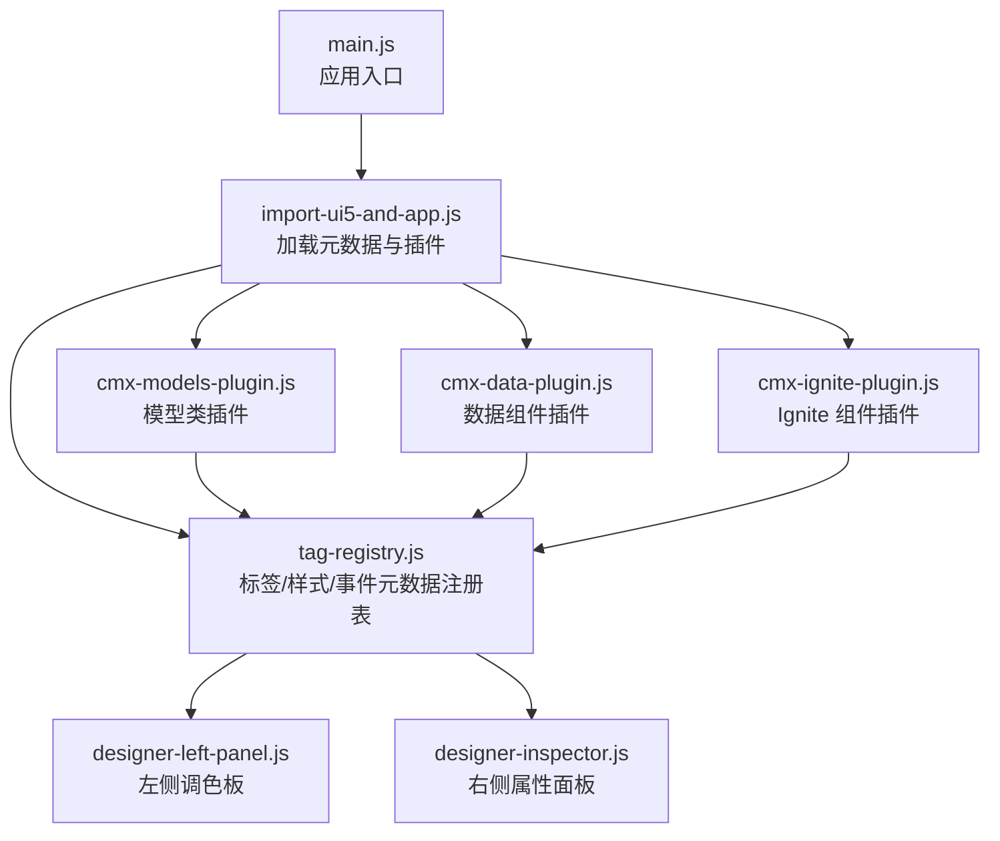
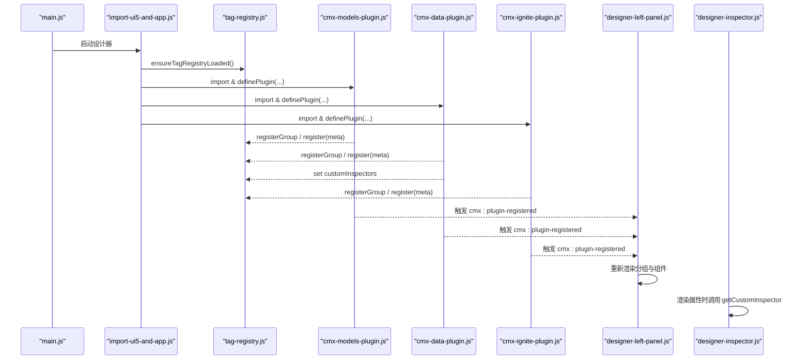
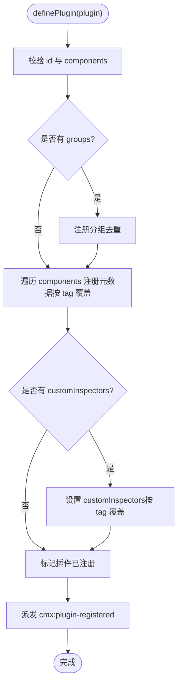
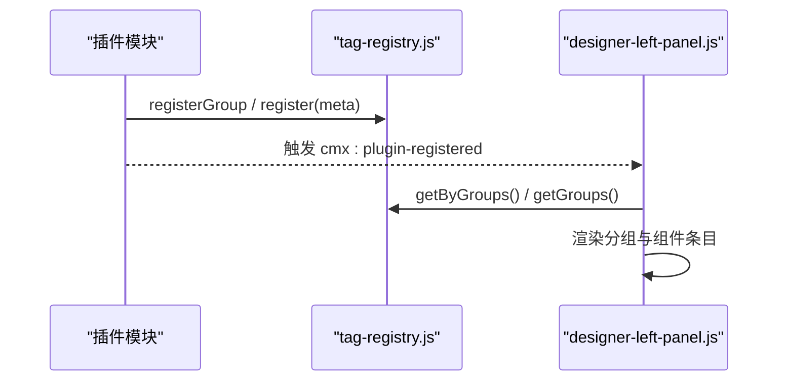
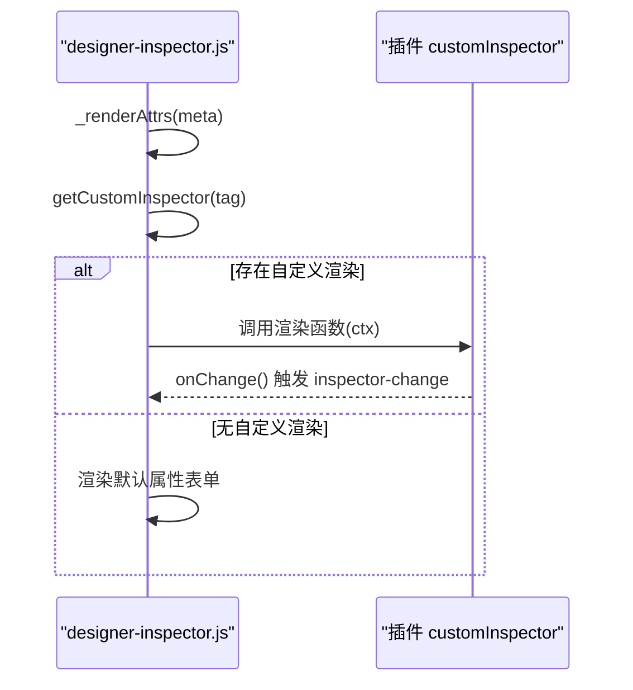
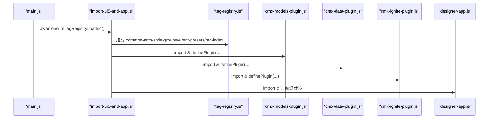
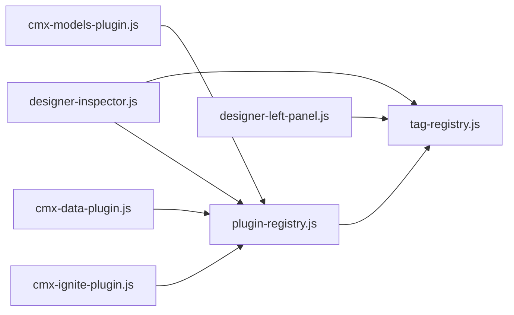

# 插件架构设计

<cite>
**本文引用的文件**
- [plugin-registry.js](file://CMXHTMLDesigner/src/lib/plugin-registry.js)
- [tag-registry.js](file://CMXHTMLDesigner/src/metadata/tag-registry.js)
- [designer-left-panel.js](file://CMXHTMLDesigner/src/components/designer-left-panel.js)
- [designer-inspector.js](file://CMXHTMLDesigner/src/components/designer-inspector.js)
- [import-ui5-and-app.js](file://CMXHTMLDesigner/src/import-ui5-and-app.js)
- [main.js](file://CMXHTMLDesigner/src/main.js)
- [designer-app.js](file://CMXHTMLDesigner/src/components/designer-app.js)
- [cmx-data-plugin.js](file://CMXHTMLDesigner/src/plugins/cmx-data-plugin.js)
- [cmx-models-plugin.js](file://CMXHTMLDesigner/src/plugins/cmx-models-plugin.js)
- [cmx-ignite-plugin.js](file://CMXHTMLDesigner/src/plugins/cmx-ignite-plugin.js)
- [groups.js](file://CMXHTMLDesigner/src/metadata/groups.js)
</cite>

## 目录
1. [简介](#简介)
2. [项目结构](#项目结构)
3. [核心组件](#核心组件)
4. [架构总览](#架构总览)
5. [详细组件分析](#详细组件分析)
6. [依赖关系分析](#依赖关系分析)
7. [性能考量](#性能考量)
8. [故障排查指南](#故障排查指南)
9. [结论](#结论)
10. [附录](#附录)

## 简介
本文件面向 CMX HTML 设计器的插件体系，系统性阐述插件注册机制、生命周期管理、扩展点设计、插件对象结构与元数据格式，以及插件与调色板、属性面板的集成方式。文档同时覆盖插件加载流程、事件机制与错误处理策略，并提供架构图与交互流程图，帮助读者快速理解并扩展设计器能力。

## 项目结构
设计器采用“运行时元数据 + 插件声明”的方式组织可插拔能力：
- 元数据注册表负责聚合内置标签与插件注册的组件元数据，驱动调色板渲染与属性面板生成。
- 插件通过统一的 definePlugin 接口声明组件、分组与自定义属性面板（customInspectors）。
- 应用入口按序加载元数据与插件，再启动设计器主界面。

图表来源
- [main.js:16-28](file://CMXHTMLDesigner/src/main.js#L16-L28)
- [import-ui5-and-app.js:4-11](file://CMXHTMLDesigner/src/import-ui5-and-app.js#L4-L11)
- [tag-registry.js:15-149](file://CMXHTMLDesigner/src/metadata/tag-registry.js#L15-L149)
- [designer-left-panel.js:217-326](file://CMXHTMLDesigner/src/components/designer-left-panel.js#L217-L326)
- [designer-inspector.js:48-199](file://CMXHTMLDesigner/src/components/designer-inspector.js#L48-L199)

章节来源
- [main.js:16-28](file://CMXHTMLDesigner/src/main.js#L16-L28)
- [import-ui5-and-app.js:4-11](file://CMXHTMLDesigner/src/import-ui5-and-app.js#L4-L11)

## 核心组件
- 插件注册中心 plugin-registry
  - 提供 definePlugin 统一入口，校验并合并 groups、components、customInspectors。
  - 维护已注册插件集合防止重复注册；支持 HMR 重注册覆盖。
  - 注册成功后派发 window 事件 cmx:plugin-registered，通知 UI 刷新。
- 标签元数据注册表 tag-registry
  - 集中管理标签元数据、样式组、事件预设与分组。
  - 提供 register/registerGroup/getByGroups/get 等 API，供调色板与属性面板消费。
- 调色板 designer-left-panel
  - 订阅 cmx:plugin-registered 事件，动态重新渲染分组与组件条目。
  - 支持搜索过滤、拖拽（区分 modelOnly 与可视化组件）。
- 属性面板 designer-inspector
  - 根据当前选中节点或模型类型渲染属性/样式/事件。
  - 通过 getCustomInspector 调用插件提供的 customInspector 函数，实现复杂属性的专属编辑体验。

章节来源
- [plugin-registry.js:45-95](file://CMXHTMLDesigner/src/lib/plugin-registry.js#L45-L95)
- [tag-registry.js:15-149](file://CMXHTMLDesigner/src/metadata/tag-registry.js#L15-L149)
- [designer-left-panel.js:217-326](file://CMXHTMLDesigner/src/components/designer-left-panel.js#L217-L326)
- [designer-inspector.js:171-199](file://CMXHTMLDesigner/src/components/designer-inspector.js#L171-L199)

## 架构总览
插件系统围绕“声明式元数据 + 运行时注册 + 事件驱动 UI 更新”展开：
- 加载阶段：确保标签元数据就绪后，顺序加载各插件模块，执行 definePlugin 完成注册。
- 运行阶段：调色板监听插件注册事件刷新；属性面板在渲染时优先使用插件提供的 customInspector。
- 扩展点：
  - 调色板分组与组件项（groups、components）
  - 属性面板定制（customInspectors）
  - 模型类仅用于 Models 面板（modelOnly）

图表来源
- [main.js:16-28](file://CMXHTMLDesigner/src/main.js#L16-L28)
- [import-ui5-and-app.js:4-11](file://CMXHTMLDesigner/src/import-ui5-and-app.js#L4-L11)
- [plugin-registry.js:60-89](file://CMXHTMLDesigner/src/lib/plugin-registry.js#L60-L89)
- [designer-left-panel.js:230-237](file://CMXHTMLDesigner/src/components/designer-left-panel.js#L230-L237)
- [designer-inspector.js:270-293](file://CMXHTMLDesigner/src/components/designer-inspector.js#L270-L293)

## 详细组件分析

### 插件对象结构与元数据格式
- 插件对象
  - id：必填，唯一标识，用于去重与日志追踪。
  - groups：可选，新增分组定义，包含 id、label、icon/iconName、order、collapsed。
  - components：必填，组件元数据数组，每个元素对应一个可拖入画布或模型的组件。
  - customInspectors：可选，{ [tag]: (ctx) => void }，为特定标签提供自定义属性面板渲染函数。
- 组件元数据关键字段
  - tag：组件标签名或模型类名。
  - group：归属分组 id。
  - label/description：显示名称与描述。
  - canNest/isVoid：是否允许嵌套、是否为空元素。
  - attrs：属性定义数组，name/label/type/placeholder/options/defaultValue 等。
  - styleGroups：允许的样式分组。
  - extraEvents：额外事件名列表，与事件预设合并后进入属性面板的事件编辑器。
  - defaults：默认 attributes/text/html/style，用于拖入时的初始状态。
  - modelOnly：仅用于 Models 面板（不可拖入画布），如 CmxDataSet、CmxMasterSlave 等。

章节来源
- [plugin-registry.js:4-18](file://CMXHTMLDesigner/src/lib/plugin-registry.js#L4-L18)
- [cmx-data-plugin.js:46-746](file://CMXHTMLDesigner/src/plugins/cmx-data-plugin.js#L46-L746)
- [cmx-models-plugin.js:39-117](file://CMXHTMLDesigner/src/plugins/cmx-models-plugin.js#L39-L117)
- [cmx-ignite-plugin.js:18-124](file://CMXHTMLDesigner/src/plugins/cmx-ignite-plugin.js#L18-L124)

### 插件注册机制与生命周期
- 注册时机
  - 应用启动时，先确保标签元数据加载完成，再依次导入并执行插件模块，调用 definePlugin 完成注册。
- 注册过程
  - 校验 id 与 components 非空。
  - 注册分组（同 id 自动跳过）。
  - 注册组件元数据（同 tag 会覆盖，便于 HMR 热更新）。
  - 注册 customInspectors（按 tag 覆盖）。
  - 记录已注册插件 id，派发自定义事件 cmx:plugin-registered。
- 生命周期钩子
  - 目前无显式 init/destroy 钩子；通过事件与 UI 组件生命周期进行协作：
    - 左侧调色板监听 cmx:plugin-registered 刷新视图。
    - 属性面板按需调用 customInspector 渲染。
    - 应用层在 cleanup 中移除全局监听与调试桥接。

图表来源
- [plugin-registry.js:60-89](file://CMXHTMLDesigner/src/lib/plugin-registry.js#L60-L89)

章节来源
- [plugin-registry.js:60-89](file://CMXHTMLDesigner/src/lib/plugin-registry.js#L60-L89)
- [import-ui5-and-app.js:4-11](file://CMXHTMLDesigner/src/import-ui5-and-app.js#L4-L11)

### 插件与调色板的集成
- 分组与排序
  - 插件通过 groups 注入新分组，order 控制显示顺序；未指定 order 时使用默认值。
  - 调色板读取 registry.getGroups() 并按 order 升序渲染。
- 组件条目
  - 插件通过 components 声明组件元数据，调色板按分组聚合渲染条目。
  - modelOnly 的条目在左侧以特殊样式标识，且只允许拖入 Models 面板。
- 事件刷新
  - 每次 definePlugin 成功都会派发 cmx:plugin-registered，左侧面板监听该事件后重新渲染。

图表来源
- [tag-registry.js:24-41](file://CMXHTMLDesigner/src/metadata/tag-registry.js#L24-L41)
- [designer-left-panel.js:265-300](file://CMXHTMLDesigner/src/components/designer-left-panel.js#L265-L300)
- [plugin-registry.js:84-89](file://CMXHTMLDesigner/src/lib/plugin-registry.js#L84-L89)

章节来源
- [designer-left-panel.js:217-326](file://CMXHTMLDesigner/src/components/designer-left-panel.js#L217-L326)
- [tag-registry.js:24-41](file://CMXHTMLDesigner/src/metadata/tag-registry.js#L24-L41)

### 插件与属性面板的集成
- 自定义属性面板
  - 插件可在 customInspectors 中为特定 tag 提供渲染函数，接收 ctx = { node, meta, mount, pageData, onChange }。
  - 属性面板在 _renderAttrs 中优先调用 getCustomInspector(tag)，若存在则清空 mount 并交由插件渲染。
- 变更回写
  - 插件内部通过 onChange 回调触发 inspector-change 事件，使上层同步源码与结构树。
- 错误隔离
  - 调用 customInspector 包裹 try/catch，捕获异常并输出到调试区，避免影响其他面板。

图表来源
- [designer-inspector.js:270-293](file://CMXHTMLDesigner/src/components/designer-inspector.js#L270-L293)
- [plugin-registry.js:91-95](file://CMXHTMLDesigner/src/lib/plugin-registry.js#L91-L95)

章节来源
- [designer-inspector.js:270-293](file://CMXHTMLDesigner/src/components/designer-inspector.js#L270-L293)
- [plugin-registry.js:91-95](file://CMXHTMLDesigner/src/lib/plugin-registry.js#L91-L95)

### 插件加载流程
- 启动顺序
  - main.js 初始化认证与全局错误处理，然后调用 ensureCmxUi5Runtime 并应用主题。
  - 异步导入 import-ui5-and-app.js，先确保标签元数据加载完成，再顺序导入各插件模块。
- 插件模块职责
  - cmx-models-plugin：注册模型类分组与模型元数据（modelOnly）。
  - cmx-data-plugin：注册数据组件分组与组件元数据，并注册多个 customInspectors。
  - cmx-ignite-plugin：注册 Ignite 相关组件分组与元数据。
- 应用装配
  - 最后导入 designer-app 启动设计器主界面，协调各子组件通信。

图表来源
- [main.js:16-28](file://CMXHTMLDesigner/src/main.js#L16-L28)
- [import-ui5-and-app.js:4-11](file://CMXHTMLDesigner/src/import-ui5-and-app.js#L4-L11)
- [tag-registry.js:120-149](file://CMXHTMLDesigner/src/metadata/tag-registry.js#L120-L149)

章节来源
- [main.js:16-28](file://CMXHTMLDesigner/src/main.js#L16-L28)
- [import-ui5-and-app.js:4-11](file://CMXHTMLDesigner/src/import-ui5-and-app.js#L4-L11)

### 事件机制
- 插件注册事件
  - 每次 definePlugin 成功派发 cmx:plugin-registered，携带 pluginId、count、reRegister 信息。
- 属性面板事件
  - 自定义属性面板通过 onChange 触发 inspector-change，通知上层刷新源码与结构树。
- 控制台镜像
  - 设计器将 console 输出映射到属性面板调试区，可通过开关控制 log/warn/error 级别。

章节来源
- [plugin-registry.js:84-89](file://CMXHTMLDesigner/src/lib/plugin-registry.js#L84-L89)
- [designer-inspector.js:139-169](file://CMXHTMLDesigner/src/components/designer-inspector.js#L139-L169)
- [designer-app.js:90-94](file://CMXHTMLDesigner/src/components/designer-app.js#L90-L94)

### 错误处理策略
- 输入校验
  - definePlugin 对必填字段进行校验，抛出明确错误提示。
- 重注册保护
  - 使用 Set 记录已注册插件 id，避免重复注册；HMR 场景下按 tag 覆盖元数据。
- 自定义渲染异常隔离
  - 调用 customInspector 包裹 try/catch，捕获异常并输出到调试区，不影响其他面板。
- 全局错误兜底
  - 应用入口安装全局错误拦截，将 unhandledrejection/脚本错误转换为轻量 toast，提升用户可见性。

章节来源
- [plugin-registry.js:60-69](file://CMXHTMLDesigner/src/lib/plugin-registry.js#L60-L69)
- [designer-inspector.js:270-293](file://CMXHTMLDesigner/src/components/designer-inspector.js#L270-L293)
- [main.js:11-14](file://CMXHTMLDesigner/src/main.js#L11-L14)

## 依赖关系分析
- 低耦合高内聚
  - 插件通过 definePlugin 与 tag-registry 解耦，不直接依赖 UI 组件。
  - UI 组件通过事件与 API 消费元数据，保持职责单一。
- 直接依赖
  - 插件模块依赖 tag-registry 与 plugin-registry。
  - 左侧面板依赖 tag-registry 与事件。
  - 属性面板依赖 tag-registry 与 plugin-registry 的 getCustomInspector。
- 外部依赖
  - 组件实现来自 cmx-data-comp 与 UI5 runtime，插件仅声明元数据与 customInspectors。

图表来源
- [plugin-registry.js:43-95](file://CMXHTMLDesigner/src/lib/plugin-registry.js#L43-L95)
- [tag-registry.js:15-149](file://CMXHTMLDesigner/src/metadata/tag-registry.js#L15-L149)
- [designer-left-panel.js:217-326](file://CMXHTMLDesigner/src/components/designer-left-panel.js#L217-L326)
- [designer-inspector.js:48-199](file://CMXHTMLDesigner/src/components/designer-inspector.js#L48-L199)
- [cmx-models-plugin.js:39-117](file://CMXHTMLDesigner/src/plugins/cmx-models-plugin.js#L39-L117)
- [cmx-data-plugin.js:46-746](file://CMXHTMLDesigner/src/plugins/cmx-data-plugin.js#L46-L746)
- [cmx-ignite-plugin.js:18-124](file://CMXHTMLDesigner/src/plugins/cmx-ignite-plugin.js#L18-L124)

章节来源
- [plugin-registry.js:43-95](file://CMXHTMLDesigner/src/lib/plugin-registry.js#L43-L95)
- [tag-registry.js:15-149](file://CMXHTMLDesigner/src/metadata/tag-registry.js#L15-L149)

## 性能考量
- 元数据懒加载
  - 标签元数据通过 fetch 异步加载，避免阻塞首屏；多次调用返回同一 Promise，减少重复请求。
- 批量注册与覆盖
  - 插件按 tag 覆盖元数据，支持 HMR 热更新，无需重启应用。
- UI 刷新节流
  - 左侧面板在插件注册事件后统一重新渲染；设计器主应用使用 requestAnimationFrame 合并刷新，降低频繁 DOM 操作带来的卡顿。
- 模型与可视化分离
  - modelOnly 的模型类不参与画布渲染，仅在 Models 面板展示，减少不必要的 DOM 开销。

[本节为通用性能建议，不直接分析具体文件]

## 故障排查指南
- 插件未生效
  - 检查 definePlugin 是否被调用，id 与 components 是否合法。
  - 确认 ensureTagRegistryLoaded 已完成后再导入插件。
- 调色板未刷新
  - 确认 cmx:plugin-registered 事件是否派发，左侧面板是否正确监听。
- 属性面板崩溃
  - 检查 customInspector 是否存在异常，查看属性面板调试区日志。
- 全局错误
  - 查看全局错误拦截是否捕获到异常，必要时调整错误提示策略。

章节来源
- [plugin-registry.js:60-89](file://CMXHTMLDesigner/src/lib/plugin-registry.js#L60-L89)
- [designer-left-panel.js:230-237](file://CMXHTMLDesigner/src/components/designer-left-panel.js#L230-L237)
- [designer-inspector.js:270-293](file://CMXHTMLDesigner/src/components/designer-inspector.js#L270-L293)
- [main.js:11-14](file://CMXHTMLDesigner/src/main.js#L11-L14)

## 结论
本插件架构通过统一的 definePlugin 接口与 tag-registry 元数据注册表，实现了调色板与属性面板的可插拔扩展。插件以声明式元数据为主，辅以 customInspectors 提供深度定制能力；事件驱动的 UI 更新确保了开发体验与运行时一致性。整体设计低耦合、易扩展，适合企业级设计器的持续演进。

[本节为总结性内容，不直接分析具体文件]

## 附录
- 分组定义
  - 内置分组包括 UI5、Fiori、默认标签；插件可新增分组并通过 order 控制显示顺序。
- 示例插件
  - cmx-data-plugin：注册大量数据组件与展示组件，并提供多个 customInspectors。
  - cmx-models-plugin：注册模型类分组与模型元数据，供 Models 面板使用。
  - cmx-ignite-plugin：注册 Ignite 相关组件分组与元数据。

章节来源
- [groups.js:5-31](file://CMXHTMLDesigner/src/metadata/groups.js#L5-L31)
- [cmx-data-plugin.js:46-746](file://CMXHTMLDesigner/src/plugins/cmx-data-plugin.js#L46-L746)
- [cmx-models-plugin.js:39-117](file://CMXHTMLDesigner/src/plugins/cmx-models-plugin.js#L39-L117)
- [cmx-ignite-plugin.js:18-124](file://CMXHTMLDesigner/src/plugins/cmx-ignite-plugin.js#L18-L124)