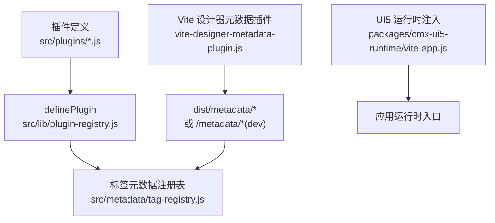
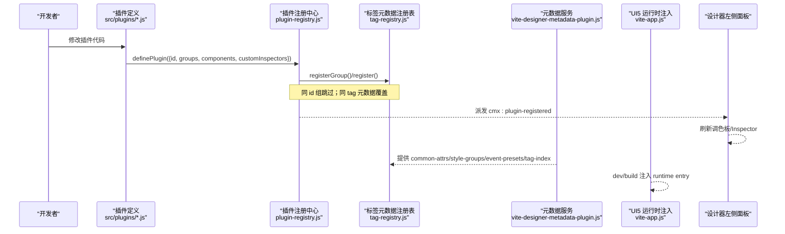
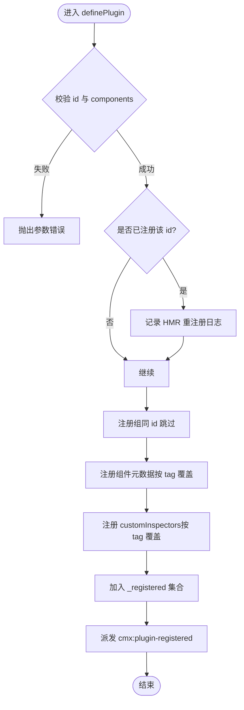
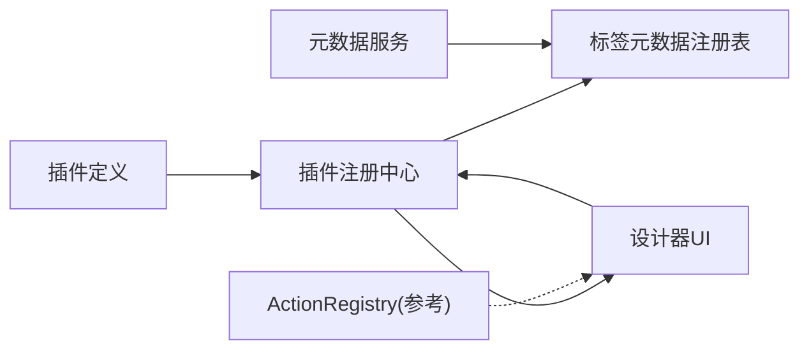

# 插件生命周期管理

<cite>
**本文引用的文件**
- [plugin-registry.js](file://CMXHTMLDesigner/src/lib/plugin-registry.js)
- [tag-registry.js](file://CMXHTMLDesigner/src/metadata/tag-registry.js)
- [cmx-data-plugin.js](file://CMXHTMLDesigner/src/plugins/cmx-data-plugin.js)
- [cmx-models-plugin.js](file://CMXHTMLDesigner/src/plugins/cmx-models-plugin.js)
- [cmx-ignite-plugin.js](file://CMXHTMLDesigner/src/plugins/cmx-ignite-plugin.js)
- [vite-designer-metadata-plugin.js](file://CMXHTMLDesigner/vite-designer-metadata-plugin.js)
- [vite-app.js](file://packages/cmx-ui5-runtime/vite-app.js)
- [action-registry.js](file://CMXPortalManager/src/lib/action-registry.js)
- [cmx-console.js](file://CMXHTMLDesigner/src/utils/cmx-console.js)
- [cmx-doc-error-presenter.js](file://packages/cmx-data-comp/src/lib/cmx-doc-error-presenter.js)
</cite>

## 目录
1. [简介](#简介)
2. [项目结构](#项目结构)
3. [核心组件](#核心组件)
4. [架构总览](#架构总览)
5. [详细组件分析](#详细组件分析)
6. [依赖关系分析](#依赖关系分析)
7. [性能考量](#性能考量)
8. [故障排查指南](#故障排查指南)
9. [结论](#结论)
10. [附录](#附录)

## 简介
本文件聚焦于 CMX HTML Designer 的“插件系统”在浏览器端的完整生命周期：加载、初始化、运行与卸载；并说明插件间的依赖管理与冲突解决策略，HMR（热模块替换）下的重注册机制，以及状态监控、错误恢复与资源清理的最佳实践。同时提供面向开发者的调试与排障方法。

## 项目结构
- 插件定义位于 src/plugins 下，每个插件通过 definePlugin 暴露元数据与可选的自定义 Inspector。
- 插件注册表位于 src/lib/plugin-registry.js，负责去重、覆盖式注册、派发事件。
- 标签元数据注册表位于 src/metadata/tag-registry.js，维护组、标签元数据、样式/事件预设，并提供 ensureTagRegistryLoaded 异步加载。
- 构建期由 Vite 插件将 metadata JSON 复制到 dist 并在 dev 模式托管 /metadata/。
- UI5 运行时入口注入由 packages/cmx-ui5-runtime/vite-app.js 完成，确保 dev/build 一致。

图表来源
- [plugin-registry.js:60-89](file://CMXHTMLDesigner/src/lib/plugin-registry.js#L60-L89)
- [tag-registry.js:15-55](file://CMXHTMLDesigner/src/metadata/tag-registry.js#L15-L55)
- [vite-designer-metadata-plugin.js:44-66](file://CMXHTMLDesigner/vite-designer-metadata-plugin.js#L44-L66)
- [vite-app.js:134-174](file://packages/cmx-ui5-runtime/vite-app.js#L134-L174)

章节来源
- [plugin-registry.js:1-95](file://CMXHTMLDesigner/src/lib/plugin-registry.js#L1-L95)
- [tag-registry.js:1-149](file://CMXHTMLDesigner/src/metadata/tag-registry.js#L1-L149)
- [vite-designer-metadata-plugin.js:33-66](file://CMXHTMLDesigner/vite-designer-metadata-plugin.js#L33-L66)
- [vite-app.js:122-174](file://packages/cmx-ui5-runtime/vite-app.js#L122-L174)

## 核心组件
- 插件定义层：以 id + groups + components + customInspectors 描述插件能力。
- 注册中心：维护已注册插件集合、自定义 Inspector 映射，派发 cmx:plugin-registered 事件。
- 标签元数据注册表：维护组、标签元数据、样式/事件预设，支持按 tag 覆盖注册。
- 构建期元数据服务：dev 托管 /metadata/*，build 复制至 dist/metadata/*。
- UI5 运行时注入：dev/build 统一 runtime entry 解析，避免双实例。

章节来源
- [plugin-registry.js:43-94](file://CMXHTMLDesigner/src/lib/plugin-registry.js#L43-L94)
- [tag-registry.js:15-149](file://CMXHTMLDesigner/src/metadata/tag-registry.js#L15-L149)
- [vite-designer-metadata-plugin.js:44-66](file://CMXHTMLDesigner/vite-designer-metadata-plugin.js#L44-L66)
- [vite-app.js:134-174](file://packages/cmx-ui5-runtime/vite-app.js#L134-L174)

## 架构总览
下图展示插件从定义到注册、再到设计器消费的全链路，包括 HMR 重注册路径。

图表来源
- [plugin-registry.js:60-89](file://CMXHTMLDesigner/src/lib/plugin-registry.js#L60-L89)
- [tag-registry.js:24-55](file://CMXHTMLDesigner/src/metadata/tag-registry.js#L24-L55)
- [vite-designer-metadata-plugin.js:44-66](file://CMXHTMLDesigner/vite-designer-metadata-plugin.js#L44-L66)
- [vite-app.js:134-174](file://packages/cmx-ui5-runtime/vite-app.js#L134-L174)

## 详细组件分析

### 插件注册中心（plugin-registry.js）
- 职责
  - 校验插件必填字段（id、components）。
  - 记录已注册插件 id，防止重复注册。
  - 调用 tag-registry.registerGroup/register 进行组与组件元数据注册。
  - 注册 customInspectors（可选），供 Inspector 渲染使用。
  - 派发 cmx:plugin-registered 事件，携带 pluginId、count、reRegister。
- HMR 重注册
  - 若检测到相同 id 再次注册，视为 HMR 场景，打印日志并按 tag 覆盖元数据与 customInspectors，保证热更新即时生效。
- 复杂度
  - 注册过程为 O(n)（n 为组件数量），Map/Set 操作均摊 O(1)。

图表来源
- [plugin-registry.js:60-89](file://CMXHTMLDesigner/src/lib/plugin-registry.js#L60-L89)

章节来源
- [plugin-registry.js:1-95](file://CMXHTMLDesigner/src/lib/plugin-registry.js#L1-L95)

### 标签元数据注册表（tag-registry.js）
- 职责
  - 维护内置组与插件扩展组，按 order 排序。
  - 注册标签元数据，合并公共属性、样式组、事件预设与默认初始化逻辑。
  - 提供 get/getByGroup/getAll 等查询接口。
  - 提供 ensureTagRegistryLoaded 异步加载 common-attrs、style-groups、event-presets、tag-index，再批量注册所有标签元数据。
- 冲突处理
  - 同 id 组忽略重复注册。
  - 同 tag 元数据覆盖，满足 HMR 重注册预期。
- 复杂度
  - registerAll 为 O(m)，m 为标签总数；查询均为 O(1)/O(k)。

章节来源
- [tag-registry.js:15-149](file://CMXHTMLDesigner/src/metadata/tag-registry.js#L15-L149)

### 插件实现示例
- cmx-data-plugin.js：注册大量数据类组件与展示类组件，声明 attrs、extraEvents、defaults、styleGroups，并挂载多个 customInspectors。
- cmx-models-plugin.js：注册不可视模型（modelOnly），暴露运行时类引用以便调试控制台使用。
- cmx-ignite-plugin.js：注册 Ignite/SpreedJS 相关组件，声明事件与默认属性。

章节来源
- [cmx-data-plugin.js:1-747](file://CMXHTMLDesigner/src/plugins/cmx-data-plugin.js#L1-L747)
- [cmx-models-plugin.js:1-118](file://CMXHTMLDesigner/src/plugins/cmx-models-plugin.js#L1-L118)
- [cmx-ignite-plugin.js:1-125](file://CMXHTMLDesigner/src/plugins/cmx-ignite-plugin.js#L1-L125)

### 构建期元数据服务（vite-designer-metadata-plugin.js）
- 构建时复制 src/metadata 到 dist/metadata。
- 开发时中间件托管 /metadata/*，返回 application/json。
- 与 tag-registry.ensureTagRegistryLoaded 配合，确保设计器启动前元数据就绪。

章节来源
- [vite-designer-metadata-plugin.js:33-66](file://CMXHTMLDesigner/vite-designer-metadata-plugin.js#L33-L66)

### UI5 运行时注入（vite-app.js）
- 构建模式：读取 manifest.json 获取正确 hash 路径，替换 client.js 中的占位符。
- 开发模式：跳过替换，直接走 Vite alias 解析源码 install.js，消除双实例问题。

章节来源
- [vite-app.js:122-174](file://packages/cmx-ui5-runtime/vite-app.js#L122-L174)

## 依赖关系分析
- 插件 → 注册中心：通过 definePlugin 调用，向注册中心提交元数据。
- 注册中心 → 标签元数据注册表：注册组与组件元数据。
- 标签元数据注册表 ← 构建期元数据服务：加载公共属性、样式组、事件预设与标签索引。
- 设计器 UI 监听 cmx:plugin-registered 事件，触发调色板刷新与 Inspector 更新。
- Portal 侧 ActionRegistry 提供键空间隔离与变更传播，可作为跨模块状态同步参考（非插件系统核心，但体现依赖解耦思想）。

图表来源
- [plugin-registry.js:60-89](file://CMXHTMLDesigner/src/lib/plugin-registry.js#L60-L89)
- [tag-registry.js:15-149](file://CMXHTMLDesigner/src/metadata/tag-registry.js#L15-L149)
- [vite-designer-metadata-plugin.js:44-66](file://CMXHTMLDesigner/vite-designer-metadata-plugin.js#L44-L66)
- [action-registry.js:112-129](file://CMXPortalManager/src/lib/action-registry.js#L112-L129)

章节来源
- [plugin-registry.js:60-89](file://CMXHTMLDesigner/src/lib/plugin-registry.js#L60-L89)
- [tag-registry.js:15-149](file://CMXHTMLDesigner/src/metadata/tag-registry.js#L15-L149)
- [vite-designer-metadata-plugin.js:44-66](file://CMXHTMLDesigner/vite-designer-metadata-plugin.js#L44-L66)
- [action-registry.js:89-129](file://CMXPortalManager/src/lib/action-registry.js#L89-L129)

## 性能考量
- 元数据懒加载：ensureTagRegistryLoaded 仅首次加载，后续复用 Promise，避免重复网络请求。
- 增量注册：groups 同 id 跳过，components 按 tag 覆盖，减少冗余计算。
- 事件驱动刷新：仅在 cmx:plugin-registered 后刷新 UI，避免频繁重绘。
- 构建优化：dev 模式不 external UI5，共享 ES module 实例，减少内存占用与双实例风险。

[本节为通用指导，无需具体文件引用]

## 故障排查指南
- 插件未生效
  - 检查 definePlugin 是否被调用且传入有效 id 与 components。
  - 确认 tag-registry.ensureTagRegistryLoaded 已完成。
  - 监听 window.cmx:plugin-registered 事件，查看 detail.reRegister 是否为 true（HMR 场景）。
- HMR 后旧 Inspector 仍显示
  - 确认 customInspectors 已随插件重新注册覆盖。
  - 检查 getCustomInspector(tag) 是否能取到新函数。
- 元数据缺失
  - 确认 vite-designer-metadata-plugin 已挂载 /metadata/* 或在 dist/metadata/* 存在。
  - 检查 tag-index.json 是否包含新增标签路径。
- 运行时错误
  - 使用 cmx-console 劫持 console 输出，将日志转发到 inspector 调试区，便于定位。
  - 对存储服务错误，可使用 describeDocError/presentDocError 统一呈现与恢复流程。
- 资源清理
  - 对于 DOM 关联的 Inspector 或监听器，应在页面卸载或模块销毁时移除，避免内存泄漏。
  - 可参考 action-registry 中断开观察器的思路，在元素断开连接时清理订阅。

章节来源
- [cmx-console.js:37-84](file://CMXHTMLDesigner/src/utils/cmx-console.js#L37-L84)
- [cmx-doc-error-presenter.js:44-158](file://packages/cmx-data-comp/src/lib/cmx-doc-error-presenter.js#L44-L158)
- [action-registry.js:89-129](file://CMXPortalManager/src/lib/action-registry.js#L89-L129)

## 结论
本插件体系通过“插件定义 + 注册中心 + 标签元数据注册表 + 构建期元数据服务”的分层设计，实现了清晰的加载、初始化、运行与卸载流程。HMR 场景下通过同 id 检测与按 tag 覆盖，保证了热更新的稳定性与即时性。结合事件驱动的 UI 刷新与统一的错误呈现、日志桥接，形成了可观测、可调试、易维护的插件生态。

## 附录
- 最佳实践清单
  - 插件 id 唯一且稳定，避免运行时变更。
  - 组件元数据尽量声明 defaults/extraEvents，降低运行时配置成本。
  - customInspectors 保持幂等，支持 HMR 覆盖。
  - 对长生命周期对象（Observer、EventListener）做好清理。
  - 使用 ensureTagRegistryLoaded 保证元数据就绪后再执行依赖逻辑。
- 调试技巧
  - 在 CodeMirror 编辑器插入 debugger; 断点。
  - 使用 cmx-console 安装 sink，集中查看日志。
  - 监听 cmx:plugin-registered 事件，验证重注册流程。

[本节为通用指导，无需具体文件引用]