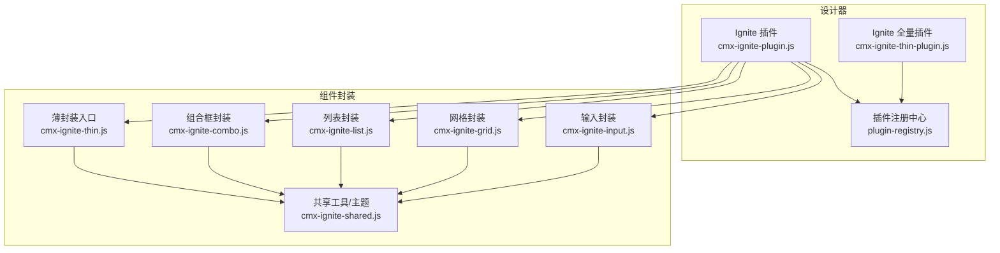
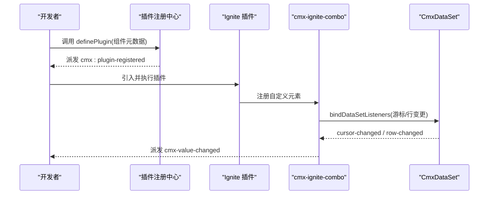
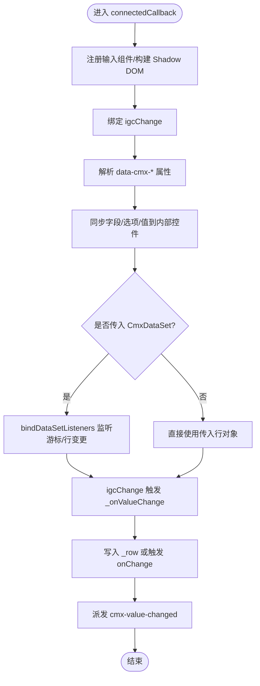
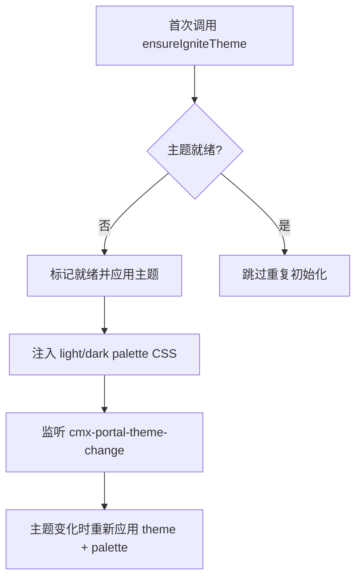
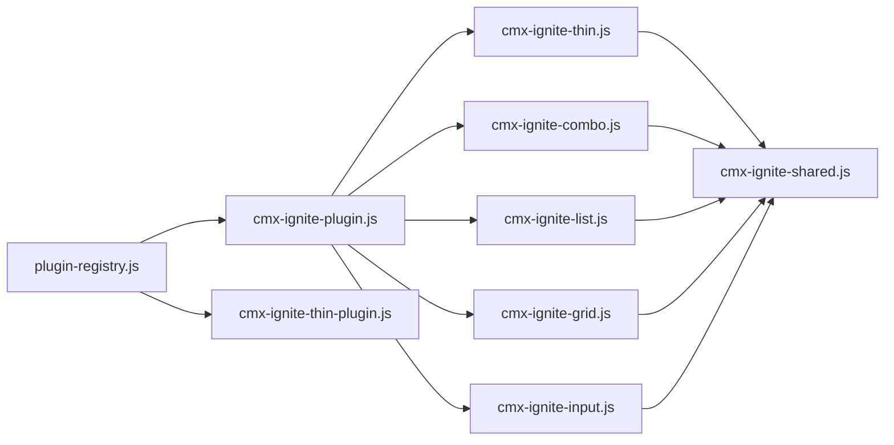

# Ignite UI 集成插件

<cite>
**本文引用的文件**
- [cmx-ignite-plugin.js](file://CMXHTMLDesigner/src/plugins/cmx-ignite-plugin.js)
- [cmx-ignite-thin-plugin.js](file://CMXHTMLDesigner/src/plugins/cmx-ignite-thin-plugin.js)
- [plugin-registry.js](file://CMXHTMLDesigner/src/lib/plugin-registry.js)
- [cmx-ignite-shared.js](file://packages/cmx-data-comp/src/components/ignite/cmx-ignite-shared.js)
- [cmx-ignite-thin.js](file://packages/cmx-data-comp/src/components/ignite/cmx-ignite-thin.js)
- [cmx-ignite-combo.js](file://packages/cmx-data-comp/src/components/ignite/cmx-ignite-combo.js)
- [cmx-ignite-list.js](file://packages/cmx-data-comp/src/components/ignite/cmx-ignite-list.js)
- [cmx-ignite-grid.js](file://packages/cmx-data-comp/src/components/ignite/cmx-ignite-grid.js)
- [cmx-ignite-input.js](file://packages/cmx-data-comp/src/components/ignite/cmx-ignite-input.js)
- [index.js](file://packages/cmx-data-comp/src/components/ignite/index.js)
- [register-inputs.js](file://packages/cmx-data-comp/src/components/ignite/register-inputs.js)
- [register-lists.js](file://packages/cmx-data-comp/src/components/ignite/register-lists.js)
- [ignite-thin.md](file://.agents/skills/cmx-components-guide/references/ignite-thin.md)
</cite>

## 更新摘要
**变更内容**
- 移除了独立的 Ignite UI 组件文档文件（cmx-ignite-gauge、cmx-ignite-list、cmx-ignite-thin、cmx-ignite-combo、cmx-ignite-grid、cmx-ignite-input），统一整合到 Wiki 系统中
- 更新了文档结构以反映新的组织方式，将详细组件说明迁移至技能参考文档
- 保持了核心架构和集成方式的完整性，确保现有功能不受影响

## 目录
1. [简介](#简介)
2. [项目结构](#项目结构)
3. [核心组件](#核心组件)
4. [架构总览](#架构总览)
5. [详细组件分析](#详细组件分析)
6. [依赖关系分析](#依赖关系分析)
7. [性能与内存优化](#性能与内存优化)
8. [故障排查指南](#故障排查指南)
9. [结论](#结论)
10. [附录：设计器使用示例](#附录：设计器使用示例)

## 简介
本文件面向在 CMX HTML 设计器中集成 Ignite UI Web Components 的开发者，系统性说明如何通过插件机制将 Ignite 组件注册到设计器调色板，并提供数据绑定、事件处理、主题适配、性能优化与内存管理的实践建议。文档覆盖图表、数据网格、表单控件等常见场景的封装方式，并给出在设计器中拖拽配置、绑定数据源与处理事件的完整流程。

**更新** 组件详细文档已整合至 Wiki 系统，本文档聚焦于整体架构和集成方式。

## 项目结构
Ignite UI 集成由"设计器插件层"和"组件封装层"两部分组成：
- 设计器插件层：负责把 cmx-ignite-* 组件元数据注册到设计器调色板，定义属性面板、默认样式、事件提示等。
- 组件封装层：基于 igniteui-webcomponents 提供薄封装（批量生成）与厚封装（带 CmxDataSet 数据绑定），并统一主题注入与事件转发。

**图示来源**
- [plugin-registry.js:1-95](file://CMXHTMLDesigner/src/lib/plugin-registry.js#L1-L95)
- [cmx-ignite-plugin.js:1-125](file://CMXHTMLDesigner/src/plugins/cmx-ignite-plugin.js#L1-L125)
- [cmx-ignite-thin-plugin.js:2920-2924](file://CMXHTMLDesigner/src/plugins/cmx-ignite-thin-plugin.js#L2920-L2924)
- [cmx-ignite-thin.js:1-80](file://packages/cmx-data-comp/src/components/ignite/cmx-ignite-thin.js#L1-L80)
- [cmx-ignite-shared.js:1-64](file://packages/cmx-data-comp/src/components/ignite/cmx-ignite-shared.js#L1-L64)

**章节来源**
- [plugin-registry.js:1-95](file://CMXHTMLDesigner/src/lib/plugin-registry.js#L1-L95)
- [cmx-ignite-plugin.js:1-125](file://CMXHTMLDesigner/src/plugins/cmx-ignite-plugin.js#L1-L125)
- [cmx-ignite-thin-plugin.js:2920-2924](file://CMXHTMLDesigner/src/plugins/cmx-ignite-thin-plugin.js#L2920-L2924)

## 核心组件
- 薄封装组件族（cmx-ignite-*）：通过工厂函数批量生成，透传属性、事件与插槽，统一事件名转换为 cmx-* 自定义事件，便于设计器与运行时一致交互。
- 厚封装组件：
  - cmx-ignite-combo：支持字段绑定、选项映射、CmxDataSet 游标与行变更联动，兼容 form/grid 编辑器模式。
  - cmx-ignite-list：列表/卡片布局，支持静态 rows 或动态 items，可注入页面模板皮肤。
  - cmx-ignite-grid：数据表格，支持列模型、选择模式、虚拟滚动等高级特性。
  - cmx-ignite-input：基础输入控件，支持类型转换和验证。
- 主题适配：统一通过 ensureIgniteTheme 注入 Ignite 原生主题与 palette，跟随门户明暗主题切换。

**更新** 各组件的详细 API 和使用方法请参考技能参考文档中的 ignite-thin.md。

**章节来源**
- [ignite-thin.md:1-41](file://.agents/skills/cmx-components-guide/references/ignite-thin.md#L1-L41)
- [cmx-ignite-combo.js:1-200](file://packages/cmx-data-comp/src/components/ignite/cmx-ignite-combo.js#L1-L200)
- [cmx-ignite-shared.js:1-64](file://packages/cmx-data-comp/src/components/ignite/cmx-ignite-shared.js#L1-L64)
- [cmx-ignite-plugin.js:1-125](file://CMXHTMLDesigner/src/plugins/cmx-ignite-plugin.js#L1-L125)

## 架构总览
设计器通过 definePlugin 将组件元数据注册到调色板；组件在运行时加载时自动完成主题初始化与事件桥接。数据流方面，厚封装组件通过 CmxDataSet 监听游标与行变更，实现双向绑定与事件派发。

**图示来源**
- [plugin-registry.js:60-89](file://CMXHTMLDesigner/src/lib/plugin-registry.js#L60-L89)
- [cmx-ignite-plugin.js:18-21](file://CMXHTMLDesigner/src/plugins/cmx-ignite-plugin.js#L18-L21)
- [cmx-ignite-combo.js:95-115](file://packages/cmx-data-comp/src/components/ignite/cmx-ignite-combo.js#L95-L115)
- [cmx-ignite-shared.js:91-126](file://packages/cmx-data-comp/src/components/ignite/cmx-ignite-shared.js#L91-L126)

## 详细组件分析

### 组合框 cmx-ignite-combo
- 能力
  - 字段绑定：setField(field) 支持 valueKey/displayKey 与 editSettings 透传。
  - 数据绑定：setDataSet(dsOrRow) 支持 CmxDataSet 游标与行变更联动。
  - 编辑器模式：setEditorMode(true) 抑制自带 label，撑满宿主，适配 form/grid 单元格。
  - 事件：igcChange → cmx-value-changed，携带 key/value/row。
- 关键流程
  - connectedCallback 中注册输入组件、创建 shadow DOM、绑定 igcChange。
  - setDataSet 内部通过 bindDataSetListeners 订阅 cursor-changed 与 row-changed。
  - _onValueChange 优先使用事件 detail.newValue 避免时序问题，再回写 _row 或触发 field.onChange。

**图示来源**
- [cmx-ignite-combo.js:35-65](file://packages/cmx-data-comp/src/components/ignite/cmx-ignite-combo.js#L35-L65)
- [cmx-ignite-combo.js:95-115](file://packages/cmx-data-comp/src/components/ignite/cmx-ignite-combo.js#L95-L115)
- [cmx-ignite-combo.js:167-192](file://packages/cmx-data-comp/src/components/ignite/cmx-ignite-combo.js#L167-L192)
- [cmx-ignite-shared.js:91-126](file://packages/cmx-data-comp/src/components/ignite/cmx-ignite-shared.js#L91-L126)

**章节来源**
- [cmx-ignite-combo.js:1-200](file://packages/cmx-data-comp/src/components/ignite/cmx-ignite-combo.js#L1-L200)
- [cmx-ignite-shared.js:91-136](file://packages/cmx-data-comp/src/components/ignite/cmx-ignite-shared.js#L91-L136)

### 薄封装机制与事件命名
- 工厂函数 defineThinIgnite 根据规格清单批量生成轻量组件，透传属性、事件与插槽。
- 事件转换规则：igc 事件去除前缀、驼峰转短横线、加 cmx- 前缀，例如 igcChange → cmx-change。
- 通用 API：getValue/setValue/focus 等，便于统一操作。

**更新** 完整的薄封装组件规格和事件映射请参考 ignite-thin.md 技能文档。

**章节来源**
- [ignite-thin.md:1-41](file://.agents/skills/cmx-components-guide/references/ignite-thin.md#L1-L41)
- [cmx-ignite-thin.js:1-80](file://packages/cmx-data-comp/src/components/ignite/cmx-ignite-thin.js#L1-L80)

### 主题适配与全局 Palette
- ensureIgniteTheme 幂等初始化：按当前明暗主题调用 configureTheme('bootstrap', 'light'|'dark')，并将对应 palette CSS 注入 document.head，确保下拉/列表等内嵌组件样式正确。
- 监听门户主题切换事件 cmx-portal-theme-change，自动切换 Ignite 主题变体。

**图示来源**
- [cmx-ignite-shared.js:1-64](file://packages/cmx-data-comp/src/components/ignite/cmx-ignite-shared.js#L1-L64)

**章节来源**
- [cmx-ignite-shared.js:1-64](file://packages/cmx-data-comp/src/components/ignite/cmx-ignite-shared.js#L1-L64)

## 依赖关系分析
- 设计器侧
  - plugin-registry.js：提供 definePlugin，维护组与组件元数据注册，派发 cmx:plugin-registered。
  - cmx-ignite-plugin.js：注册 cmx-ignite-combo/list/spreadsheet/spreadjs-sheet 等厚封装组件。
  - cmx-ignite-thin-plugin.js：注册全部开源薄封装组件（由脚本生成）。
- 组件侧
  - cmx-ignite-thin.js：批量生成薄封装组件，导入 igniteui-webcomponents 的 Igc* 组件。
  - cmx-ignite-shared.js：主题注入、JSON 属性解析、CmxDataSet 绑定与事件派发。
  - 各厚封装组件：具体业务逻辑（字段/选项/数据集绑定、编辑器模式）。

**图示来源**
- [plugin-registry.js:1-95](file://CMXHTMLDesigner/src/lib/plugin-registry.js#L1-L95)
- [cmx-ignite-plugin.js:1-125](file://CMXHTMLDesigner/src/plugins/cmx-ignite-plugin.js#L1-L125)
- [cmx-ignite-thin-plugin.js:2920-2924](file://CMXHTMLDesigner/src/plugins/cmx-ignite-thin-plugin.js#L2920-L2924)
- [index.js:1-83](file://packages/cmx-data-comp/src/components/ignite/index.js#L1-L83)

**章节来源**
- [plugin-registry.js:1-95](file://CMXHTMLDesigner/src/lib/plugin-registry.js#L1-L95)
- [cmx-ignite-plugin.js:1-125](file://CMXHTMLDesigner/src/plugins/cmx-ignite-plugin.js#L1-L125)
- [cmx-ignite-thin-plugin.js:2920-2924](file://CMXHTMLDesigner/src/plugins/cmx-ignite-thin-plugin.js#L2920-L2924)

## 性能与内存优化
- 主题初始化
  - ensureIgniteTheme 幂等执行，避免重复注入 CSS 与重复 configureTheme 调用。
  - 仅按需注入 light/dark palette，减少样式体积。
- 数据绑定
  - 使用 bindDataSetListeners/unbindDataSetListeners 成对管理监听器，防止内存泄漏。
  - 在 disconnectedCallback 中解绑，保证组件卸载后无残留引用。
- 渲染与更新
  - 薄封装组件透传属性与事件，避免额外计算开销。
  - 厚封装组件仅在必要路径更新内部控件状态，减少重排。
- 大数据集
  - 对于列表/表格类组件，建议使用分页或虚拟滚动策略（由上层数据源控制），避免一次性渲染大量节点。
  - 合理设置 data-cmx-items/rows，避免过大 JSON 导致序列化/反序列化开销。

**更新** 性能优化策略保持不变，适用于所有整合后的组件。

**章节来源**
- [cmx-ignite-shared.js:55-64](file://packages/cmx-data-comp/src/components/ignite/cmx-ignite-shared.js#L55-L64)
- [cmx-ignite-shared.js:91-136](file://packages/cmx-data-comp/src/components/ignite/cmx-ignite-shared.js#L91-L136)
- [cmx-ignite-combo.js:67-69](file://packages/cmx-data-comp/src/components/ignite/cmx-ignite-combo.js#L67-L69)

## 故障排查指南
- 下拉透明/尺寸塌陷/文字叠加
  - 现象：下拉或列表样式异常。
  - 原因：未注入 Ignite palette 或未启用 dark/light variant。
  - 解决：确保在组件使用前调用 ensureIgniteTheme；检查门户主题切换事件是否正确传递。
- 事件不触发或值不同步
  - 现象：选择后未触发 cmx-value-changed 或值未回写。
  - 原因：igcChange 时序问题或 silent 标志导致忽略。
  - 解决：优先使用事件 detail.newValue；确认 _silent 标志未被误用；检查字段 key 与 row.set 是否存在。
- 内存泄漏
  - 现象：页面切换后仍有监听器存在。
  - 原因：未在 disconnectedCallback 中解绑。
  - 解决：确保所有组件在断开连接时调用 unbindDataSetListeners。
- 设计器无法识别组件
  - 现象：调色板无组件或属性面板缺失。
  - 原因：插件未注册或重复注册冲突。
  - 解决：检查 definePlugin 调用与 groups/components 配置；确认 HMR 下重新注册生效。

**更新** 故障排查指南适用于所有整合后的组件，问题解决方案保持一致。

**章节来源**
- [cmx-ignite-shared.js:55-64](file://packages/cmx-data-comp/src/components/ignite/cmx-ignite-shared.js#L55-L64)
- [cmx-ignite-combo.js:167-192](file://packages/cmx-data-comp/src/components/ignite/cmx-ignite-combo.js#L167-L192)
- [cmx-ignite-shared.js:116-126](file://packages/cmx-data-comp/src/components/ignite/cmx-ignite-shared.js#L116-L126)
- [plugin-registry.js:60-89](file://CMXHTMLDesigner/src/lib/plugin-registry.js#L60-L89)

## 结论
通过插件机制与薄/厚封装分层，Ignite UI Web Components 能够以最小侵入的方式集成到 CMX HTML 设计器中。统一的属性约定、事件命名与主题注入，使得在设计器中拖拽配置、绑定数据源与处理事件变得直观可靠。配合严格的监听器管理与性能优化策略，可在复杂页面中保持良好体验。

**更新** 组件文档的整合提高了知识管理的效率，开发者可以通过统一的技能文档获取详细的组件使用说明。

## 附录：设计器使用示例
- 添加组合框
  - 在设计器调色板中找到 <cmx-ignite-combo>，拖入画布。
  - 配置 data-cmx-field（包含 key、label、options）、data-cmx-items（可选）、data-cmx-row（初始值）。
  - 运行后，选择项变化会触发 cmx-value-changed，携带 key/value/row。
- 添加列表
  - 使用 <cmx-ignite-list>，配置 data-cmx-items 或 data-cmx-rows，layout 可为 card。
  - 通过 data-cmx-style-id 注入页面模板中的样式，实现卡片外观定制。
  - 事件 cmx-row-selected / cmx-item-selected 用于响应选择行为。
- 添加电子表格
  - 使用 <cmx-spreadsheet> 或 <cmx-spreadjs-sheet>，配置 data-cmx-report（grid/cells/meta）驱动报表表样。
  - 事件 cmx-cell-selected / cmx-cell-edited / cmx-sheet-changed 用于捕获单元格交互。
- 数据源绑定
  - 在代码中将 CmxDataSet 实例传入 setDataSet，组件会自动监听游标与行变更，并在行更新时刷新显示。
- 事件处理
  - 监听 cmx-* 自定义事件，获取 detail 中的键值与上下文信息，进行后续业务处理。

**更新** 更多组件的使用示例和最佳实践请参考 ignite-thin.md 技能文档。

**章节来源**
- [cmx-ignite-plugin.js:21-122](file://CMXHTMLDesigner/src/plugins/cmx-ignite-plugin.js#L21-L122)
- [cmx-ignite-combo.js:117-124](file://packages/cmx-data-comp/src/components/ignite/cmx-ignite-combo.js#L117-L124)
- [cmx-ignite-shared.js:91-126](file://packages/cmx-data-comp/src/components/ignite/cmx-ignite-shared.js#L91-L126)