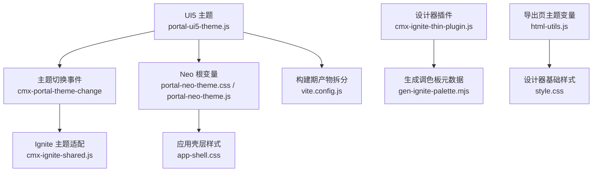
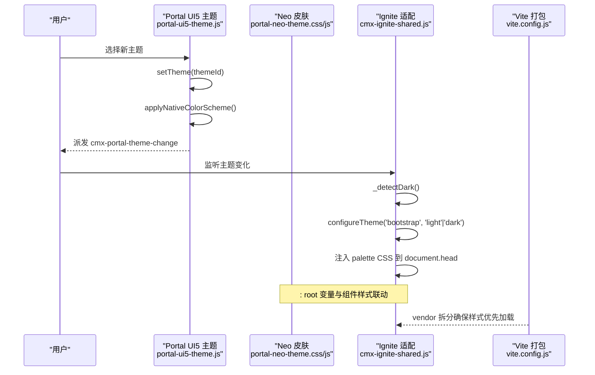
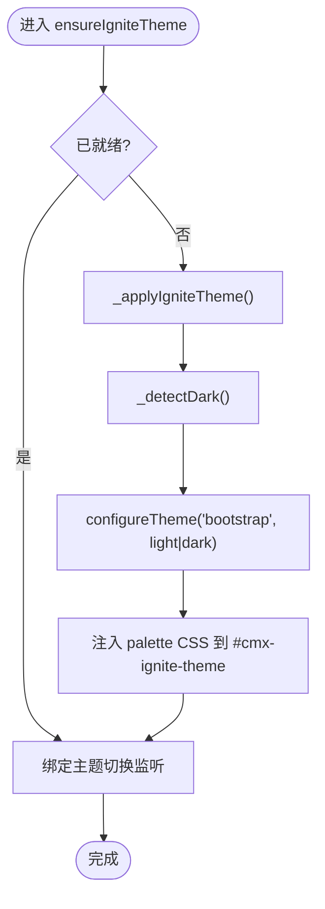
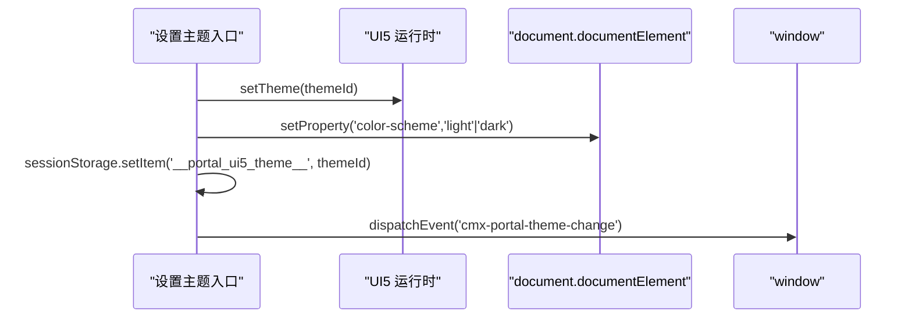
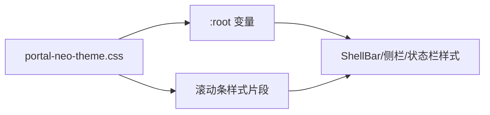
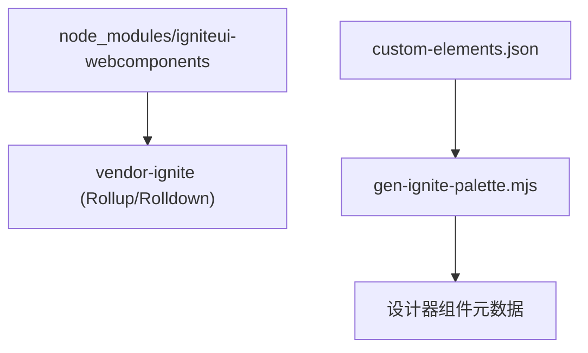
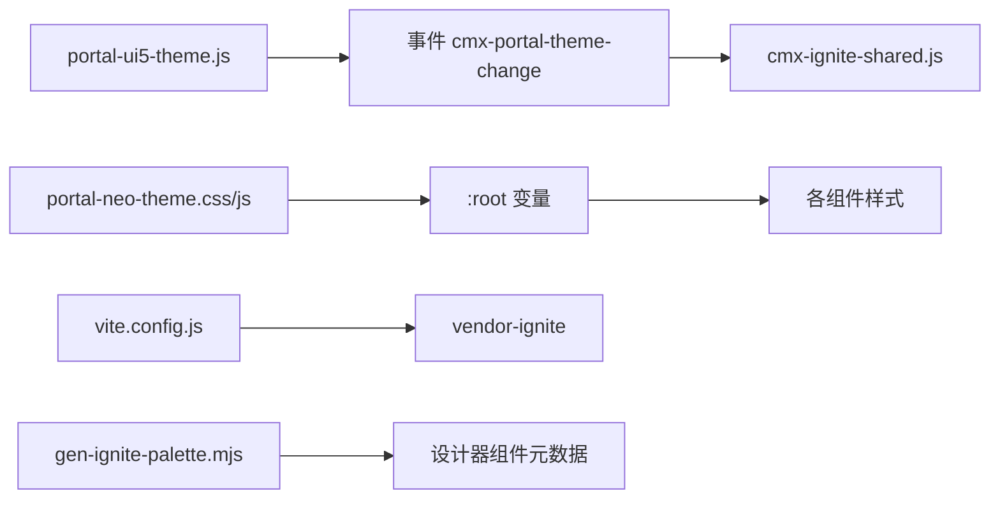

# 主题集成与样式定制

<cite>
**本文引用的文件**
- [cmx-ignite-shared.js](file://packages/cmx-data-comp/src/components/ignite/cmx-ignite-shared.js)
- [portal-ui5-theme.js](file://CMXPortalManager/src/lib/portal-ui5-theme.js)
- [portal-neo-theme.css](file://CMXPortalManager/src/lib/portal-neo-theme.css)
- [portal-neo-theme.js](file://CMXPortalManager/src/lib/portal-neo-theme.js)
- [app-shell.css](file://CMXPortalManager/src/app-shell.css)
- [vite.config.js](file://CMXPortalManager/vite.config.js)
- [gen-ignite-palette.mjs](file://packages/cmx-data-comp/scripts/gen-ignite-palette.mjs)
- [cmx-ignite-thin-plugin.js](file://CMXHTMLDesigner/src/plugins/cmx-ignite-thin-plugin.js)
- [html-utils.js](file://CMXHTMLDesigner/src/utils/html-utils.js)
- [style.css](file://CMXHTMLDesigner/src/style.css)
- [cmx-theme-detect.js](file://packages/cmx-data-comp/src/lib/cmx-theme-detect.js)
</cite>

## 目录
1. [简介](#简介)
2. [项目结构](#项目结构)
3. [核心组件](#核心组件)
4. [架构总览](#架构总览)
5. [详细组件分析](#详细组件分析)
6. [依赖关系分析](#依赖关系分析)
7. [性能考虑](#性能考虑)
8. [故障排查指南](#故障排查指南)
9. [结论](#结论)
10. [附录](#附录)

## 简介
本文件面向在 CMX 平台中集成 Ignite UI 主题并进行样式定制的工程实践，覆盖以下目标：
- 主题文件的加载、配置与应用流程（UI5 主题、Neo 皮肤、Ignite 主题）
- 通过 CSS 变量与自定义样式覆盖 Ignite 组件外观
- 具体定制示例：颜色、字体、间距等视觉元素
- 响应式设计与移动端优化建议
- 与设计器主题系统的集成方式，确保多主题下的一致性显示

## 项目结构
CMX 平台的主题体系由三层构成：
- UI5 主题层：负责全局明暗主题与原生控件渲染（如 select、滚动条），并通过事件通知其他子系统。
- Neo 皮肤层：定义门户级设计令牌（颜色、渐变、阴影、边框等），统一视觉语言。
- Ignite 主题层：为 Ignite Web Components 注入 palette 并切换 light/dark variant，使其与门户主题一致。

图表来源
- [portal-ui5-theme.js:39-53](file://CMXPortalManager/src/lib/portal-ui5-theme.js#L39-L53)
- [cmx-ignite-shared.js:34-64](file://packages/cmx-data-comp/src/components/ignite/cmx-ignite-shared.js#L34-L64)
- [portal-neo-theme.css:4-49](file://CMXPortalManager/src/lib/portal-neo-theme.css#L4-L49)
- [app-shell.css:1-32](file://CMXPortalManager/src/app-shell.css#L1-L32)
- [vite.config.js:122-135](file://CMXPortalManager/vite.config.js#L122-L135)
- [cmx-ignite-thin-plugin.js:2920-2924](file://CMXHTMLDesigner/src/plugins/cmx-ignite-thin-plugin.js#L2920-L2924)
- [gen-ignite-palette.mjs:1-30](file://packages/cmx-data-comp/scripts/gen-ignite-palette.mjs#L1-L30)
- [html-utils.js:7-22](file://CMXHTMLDesigner/src/utils/html-utils.js#L7-L22)
- [style.css:3-11](file://CMXHTMLDesigner/src/style.css#L3-L11)

章节来源
- [portal-ui5-theme.js:39-53](file://CMXPortalManager/src/lib/portal-ui5-theme.js#L39-L53)
- [portal-neo-theme.css:4-49](file://CMXPortalManager/src/lib/portal-neo-theme.css#L4-L49)
- [app-shell.css:1-32](file://CMXPortalManager/src/app-shell.css#L1-L32)
- [vite.config.js:122-135](file://CMXPortalManager/vite.config.js#L122-L135)
- [cmx-ignite-shared.js:34-64](file://packages/cmx-data-comp/src/components/ignite/cmx-ignite-shared.js#L34-L64)
- [cmx-ignite-thin-plugin.js:2920-2924](file://CMXHTMLDesigner/src/plugins/cmx-ignite-thin-plugin.js#L2920-L2924)
- [gen-ignite-palette.mjs:1-30](file://packages/cmx-data-comp/scripts/gen-ignite-palette.mjs#L1-L30)
- [html-utils.js:7-22](file://CMXHTMLDesigner/src/utils/html-utils.js#L7-L22)
- [style.css:3-11](file://CMXHTMLDesigner/src/style.css#L3-L11)

## 核心组件
- UI5 主题管理：提供主题列表、持久化、应用与 color-scheme 同步，并在切换时派发 cmx-portal-theme-change 事件。
- Neo 皮肤：集中定义 :root 变量与可复用样式片段，供 ShellBar、侧栏、状态栏等使用。
- Ignite 主题适配：检测当前明暗，调用 igniteui-webcomponents 的 configureTheme，并向 document.head 注入对应 palette CSS，保证 Shadow DOM 内嵌组件正确渲染。
- 设计器集成：通过插件将 Ignite 组件暴露给设计器，并使用构建期脚本生成组件元数据以驱动调色板。

章节来源
- [portal-ui5-theme.js:39-53](file://CMXPortalManager/src/lib/portal-ui5-theme.js#L39-L53)
- [portal-neo-theme.css:4-49](file://CMXPortalManager/src/lib/portal-neo-theme.css#L4-L49)
- [cmx-ignite-shared.js:34-64](file://packages/cmx-data-comp/src/components/ignite/cmx-ignite-shared.js#L34-L64)
- [cmx-ignite-thin-plugin.js:2920-2924](file://CMXHTMLDesigner/src/plugins/cmx-ignite-thin-plugin.js#L2920-L2924)
- [gen-ignite-palette.mjs:1-30](file://packages/cmx-data-comp/scripts/gen-ignite-palette.mjs#L1-L30)

## 架构总览
下图展示从 UI5 主题切换到 Ignite 组件样式生效的完整链路：

图表来源
- [portal-ui5-theme.js:39-53](file://CMXPortalManager/src/lib/portal-ui5-theme.js#L39-L53)
- [cmx-ignite-shared.js:19-48](file://packages/cmx-data-comp/src/components/ignite/cmx-ignite-shared.js#L19-L48)
- [vite.config.js:122-135](file://CMXPortalManager/vite.config.js#L122-L135)

## 详细组件分析

### Ignite 主题适配与样式注入
- 明暗检测：优先读取 --sapBackgroundColor 计算相对亮度，回退系统偏好。
- 主题切换：调用 igniteui-webcomponents 的 configureTheme 设置 bootstrap 主题的 light/dark variant。
- Palette 注入：向 document.head 插入唯一 style 节点，按当前明暗写入对应 palette CSS，使 Ignite 组件内部 Shadow DOM 能继承 --ig-* 变量。
- 事件订阅：监听 cmx-portal-theme-change 事件，实现无刷新切换。

图表来源
- [cmx-ignite-shared.js:19-64](file://packages/cmx-data-comp/src/components/ignite/cmx-ignite-shared.js#L19-L64)

章节来源
- [cmx-ignite-shared.js:19-64](file://packages/cmx-data-comp/src/components/ignite/cmx-ignite-shared.js#L19-L64)
- [cmx-theme-detect.js:9-30](file://packages/cmx-data-comp/src/lib/cmx-theme-detect.js#L9-L30)

### UI5 主题管理与 color-scheme 同步
- 主题列表与默认值：维护可用主题集合与默认主题。
- 应用主题：设置 UI5 运行时主题，持久化至 sessionStorage，并同步 :root 的 color-scheme，确保原生控件（select、滚动条等）随主题切换。
- 事件派发：切换后派发 cmx-portal-theme-change，供 Ignite 等子系统响应。

图表来源
- [portal-ui5-theme.js:39-53](file://CMXPortalManager/src/lib/portal-ui5-theme.js#L39-L53)

章节来源
- [portal-ui5-theme.js:39-53](file://CMXPortalManager/src/lib/portal-ui5-theme.js#L39-L53)

### Neo 皮肤与全局变量
- 根变量：定义 neo-cyan/violet/mint/warn/accent 等令牌，以及 portal-workspace-bg、portal-shellbar-bg 等复合背景。
- 滚动条与面板：提供统一的滚动条样式与面板表面风格，提升整体一致性。
- 注入机制：通过 initPortalNeoTheme 或 app-shell.css 引入，确保 :root 变量可用。

图表来源
- [portal-neo-theme.css:4-49](file://CMXPortalManager/src/lib/portal-neo-theme.css#L4-L49)
- [portal-neo-theme.js:6-52](file://CMXPortalManager/src/lib/portal-neo-theme.js#L6-L52)
- [app-shell.css:1-32](file://CMXPortalManager/src/app-shell.css#L1-L32)

章节来源
- [portal-neo-theme.css:4-49](file://CMXPortalManager/src/lib/portal-neo-theme.css#L4-L49)
- [portal-neo-theme.js:6-52](file://CMXPortalManager/src/lib/portal-neo-theme.js#L6-L52)
- [app-shell.css:1-32](file://CMXPortalManager/src/app-shell.css#L1-L32)

### 构建期与打包策略
- 主题资源拆分：将 Ignite 相关依赖拆分为独立 vendor chunk，避免首屏阻塞与样式冲突。
- 设计器插件：通过 cmx-ignite-thin-plugin 暴露 Ignite 全量组件；构建期脚本 gen-ignite-palette.mjs 解析 custom-elements.json 生成组件元数据，驱动设计器调色板。

图表来源
- [vite.config.js:122-135](file://CMXPortalManager/vite.config.js#L122-L135)
- [gen-ignite-palette.mjs:1-30](file://packages/cmx-data-comp/scripts/gen-ignite-palette.mjs#L1-L30)
- [cmx-ignite-thin-plugin.js:2920-2924](file://CMXHTMLDesigner/src/plugins/cmx-ignite-thin-plugin.js#L2920-L2924)

章节来源
- [vite.config.js:122-135](file://CMXPortalManager/vite.config.js#L122-L135)
- [gen-ignite-palette.mjs:1-30](file://packages/cmx-data-comp/scripts/gen-ignite-palette.mjs#L1-L30)
- [cmx-ignite-thin-plugin.js:2920-2924](file://CMXHTMLDesigner/src/plugins/cmx-ignite-thin-plugin.js#L2920-L2924)

### 导出页面与主题变量
- 导出 HTML 内联主题变量：将 UI5 主题参数以 JSON 形式内联，确保导出页面无需 CDN 即可获得完整样式。
- 设计器基础样式：设置 html/body 的背景色、文字色与字体，保证预览与导出一致性。

章节来源
- [html-utils.js:7-22](file://CMXHTMLDesigner/src/utils/html-utils.js#L7-L22)
- [style.css:3-11](file://CMXHTMLDesigner/src/style.css#L3-L11)

## 依赖关系分析
- UI5 主题 → 事件 → Ignite 适配：UI5 主题切换触发事件，Ignite 适配层据此切换变体并注入 palette。
- Neo 皮肤 → 全局变量：所有组件通过 :root 变量获取颜色与渐变，保证视觉一致性。
- 构建期 → 运行期：vite.config.js 对 Ignite 依赖进行分包；gen-ignite-palette.mjs 生成设计器元数据。

图表来源
- [portal-ui5-theme.js:39-53](file://CMXPortalManager/src/lib/portal-ui5-theme.js#L39-L53)
- [cmx-ignite-shared.js:34-64](file://packages/cmx-data-comp/src/components/ignite/cmx-ignite-shared.js#L34-L64)
- [portal-neo-theme.css:4-49](file://CMXPortalManager/src/lib/portal-neo-theme.css#L4-L49)
- [vite.config.js:122-135](file://CMXPortalManager/vite.config.js#L122-L135)
- [gen-ignite-palette.mjs:1-30](file://packages/cmx-data-comp/scripts/gen-ignite-palette.mjs#L1-L30)

章节来源
- [portal-ui5-theme.js:39-53](file://CMXPortalManager/src/lib/portal-ui5-theme.js#L39-L53)
- [cmx-ignite-shared.js:34-64](file://packages/cmx-data-comp/src/components/ignite/cmx-ignite-shared.js#L34-L64)
- [portal-neo-theme.css:4-49](file://CMXPortalManager/src/lib/portal-neo-theme.css#L4-L49)
- [vite.config.js:122-135](file://CMXPortalManager/vite.config.js#L122-L135)
- [gen-ignite-palette.mjs:1-30](file://packages/cmx-data-comp/scripts/gen-ignite-palette.mjs#L1-L30)

## 性能考虑
- 首屏样式加载：通过 vendor 拆分将 Ignite 样式与业务代码解耦，减少主包体积与样式阻塞。
- 主题切换开销：仅切换 configureTheme 与替换一个 <style> 节点内容，避免重建组件树。
- 变量计算：大量使用 color-mix 与 CSS 变量，减少 JS 计算，利用浏览器合成层优化。
- 滚动条与网格：采用细滚动条与紧凑布局，降低重排与重绘成本。

[本节为通用指导，不直接分析具体文件]

## 故障排查指南
- 下拉透明/尺寸塌陷/文字叠加
  - 现象：Ignite 组件内嵌 combo/grid 出现透明或尺寸异常。
  - 原因：未注入 Ignite palette 或未正确切换 dark/light variant。
  - 处理：确保在 defineComponents 前调用 ensureIgniteTheme；确认 cmx-portal-theme-change 事件被监听并触发 _applyIgniteTheme。
  - 参考路径
    - [cmx-ignite-shared.js:34-64](file://packages/cmx-data-comp/src/components/ignite/cmx-ignite-shared.js#L34-L64)

- 原生 select option 弹层颜色不一致
  - 现象：Shadow DOM 内的 select 弹层未按主题反色。
  - 原因：未设置 :root 的 color-scheme。
  - 处理：通过 applyNativeColorScheme 同步 color-scheme；必要时在宿主文档补充 select option 样式。
  - 参考路径
    - [portal-ui5-theme.js:33-37](file://CMXPortalManager/src/lib/portal-ui5-theme.js#L33-L37)
    - [portal-neo-theme.css:51-58](file://CMXPortalManager/src/lib/portal-neo-theme.css#L51-L58)

- 主题切换后 Ignite 未跟随
  - 现象：切换 UI5 主题后 Ignite 仍保持旧主题。
  - 原因：未绑定 cmx-portal-theme-change 监听或 ensureIgniteTheme 未执行。
  - 处理：检查 ensureIgniteTheme 是否在所有 register-ignite-* 之前调用；确认事件监听存在。
  - 参考路径
    - [cmx-ignite-shared.js:55-64](file://packages/cmx-data-comp/src/components/ignite/cmx-ignite-shared.js#L55-L64)
    - [portal-ui5-theme.js:50-53](file://CMXPortalManager/src/lib/portal-ui5-theme.js#L50-L53)

- 导出页面样式缺失
  - 现象：导出的 HTML 缺少主题变量导致样式错乱。
  - 原因：未内联 UI5 主题参数。
  - 处理：确保导出流程包含主题参数内联逻辑。
  - 参考路径
    - [html-utils.js:7-22](file://CMXHTMLDesigner/src/utils/html-utils.js#L7-L22)

章节来源
- [cmx-ignite-shared.js:34-64](file://packages/cmx-data-comp/src/components/ignite/cmx-ignite-shared.js#L34-L64)
- [portal-ui5-theme.js:33-53](file://CMXPortalManager/src/lib/portal-ui5-theme.js#L33-L53)
- [portal-neo-theme.css:51-58](file://CMXPortalManager/src/lib/portal-neo-theme.css#L51-L58)
- [html-utils.js:7-22](file://CMXHTMLDesigner/src/utils/html-utils.js#L7-L22)

## 结论
CMX 平台通过“UI5 主题 + Neo 皮肤 + Ignite 适配”的分层方案，实现了跨组件的主题一致性与高可定制性。UI5 负责全局明暗与原生控件，Neo 提供设计令牌与共享样式，Ignite 适配层则确保第三方组件与门户主题无缝融合。配合构建期分包与设计器插件，既保证了性能，又提升了开发体验。

[本节为总结性内容，不直接分析具体文件]

## 附录

### 主题定制示例（基于 CSS 变量）
- 修改强调色与边框
  - 在 :root 调整 --neo-accent、--neo-border、--neo-border-subtle，即可影响 ShellBar、侧栏、状态栏及组件边框。
  - 参考路径
    - [portal-neo-theme.css:4-17](file://CMXPortalManager/src/lib/portal-neo-theme.css#L4-L17)

- 修改工作区与顶栏背景
  - 调整 --portal-workspace-bg、--portal-shellbar-bg 可改变整体氛围。
  - 参考路径
    - [portal-neo-theme.css:17-49](file://CMXPortalManager/src/lib/portal-neo-theme.css#L17-L49)

- 修改字体与字号
  - 通过 --sapFontFamily 与 body 字体设置统一字体族；可在 app-shell.css 中调整基础字号。
  - 参考路径
    - [app-shell.css:21-32](file://CMXPortalManager/src/app-shell.css#L21-L32)

- 覆盖 Ignite 组件局部样式
  - 通过 :root 上的 --ig-* 变量（palette 注入）控制组件尺寸与表面色；必要时在组件容器上添加类名并覆盖局部样式。
  - 参考路径
    - [cmx-ignite-shared.js:5-10](file://packages/cmx-data-comp/src/components/ignite/cmx-ignite-shared.js#L5-L10)

### 响应式设计与移动端优化建议
- 使用 -webkit-fill-available 稳定 100% 高度，避免移动端地址栏导致的裁切。
- 侧边栏与菜单项行高收紧，减少深层菜单溢出风险。
- 滚动条细窄且低对比度，提升信息密度与观感。
- 使用 color-mix 与 CSS 变量减少媒体查询分支，提高跨端一致性。

章节来源
- [app-shell.css:1-32](file://CMXPortalManager/src/app-shell.css#L1-L32)
- [portal-neo-theme.js:470-578](file://CMXPortalManager/src/lib/portal-neo-theme.js#L470-L578)