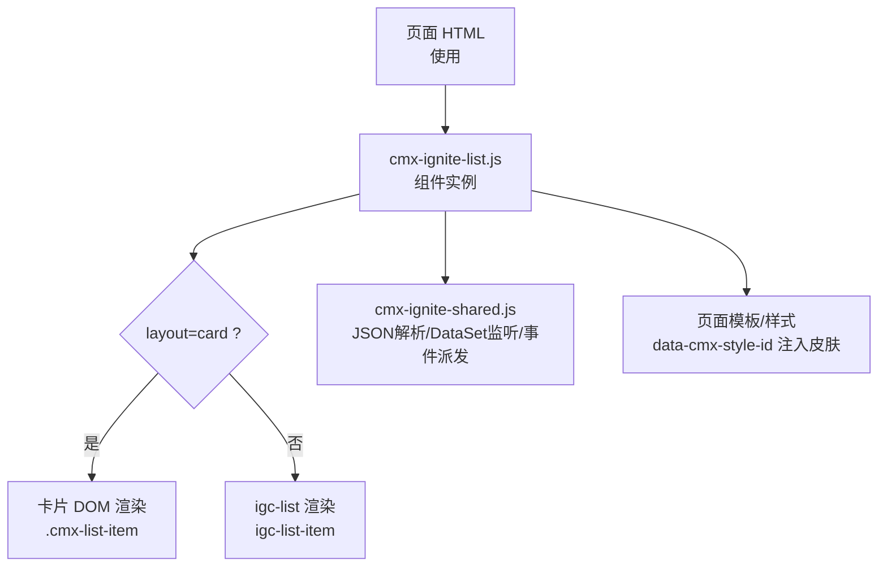
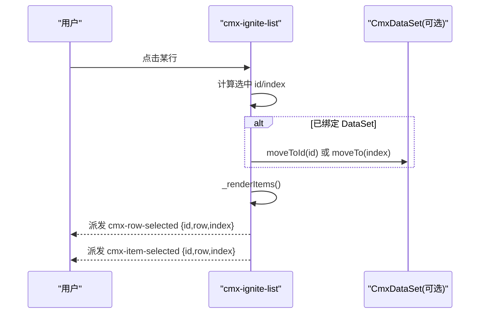
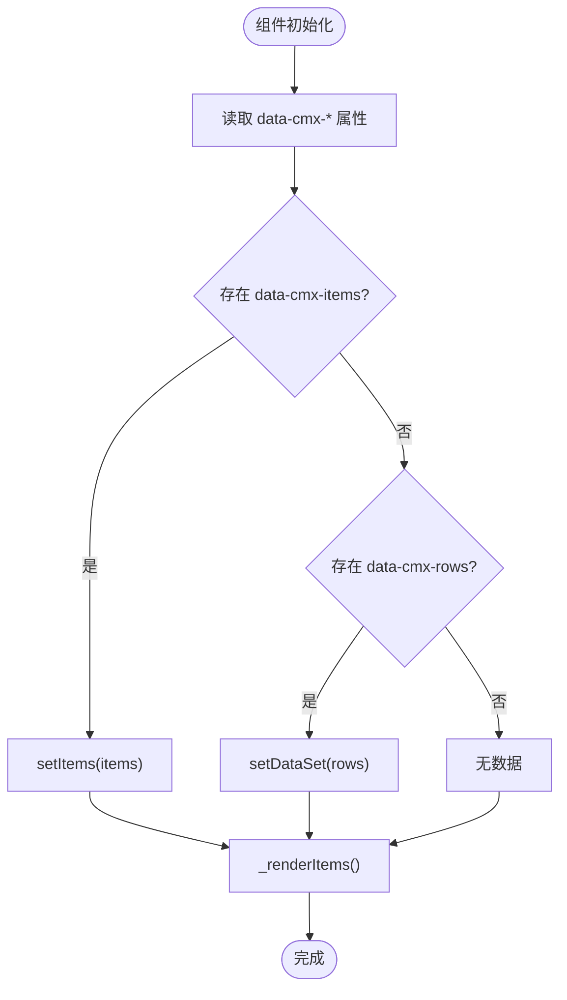
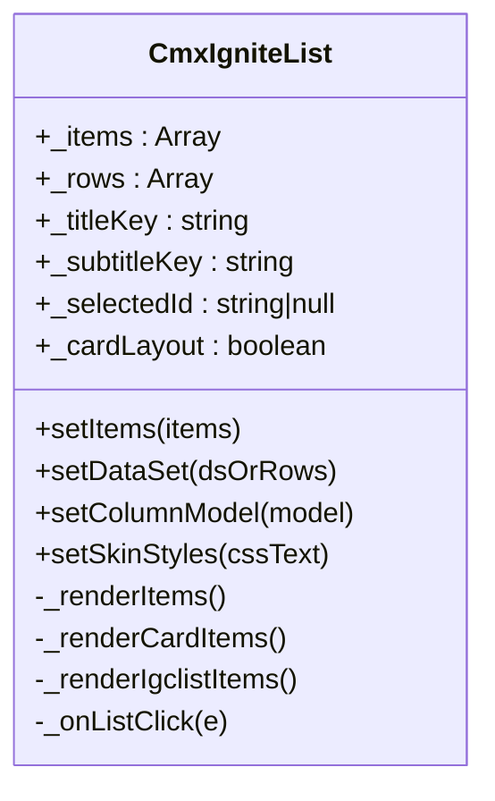
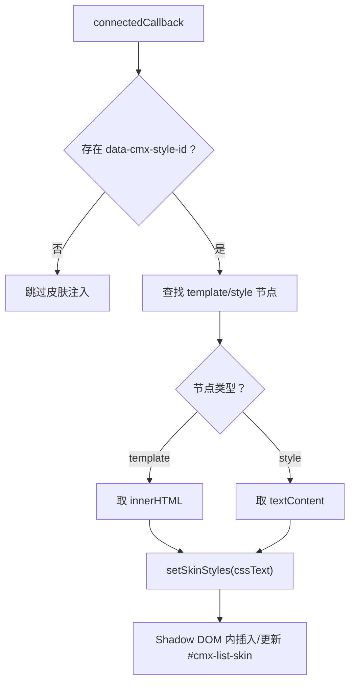
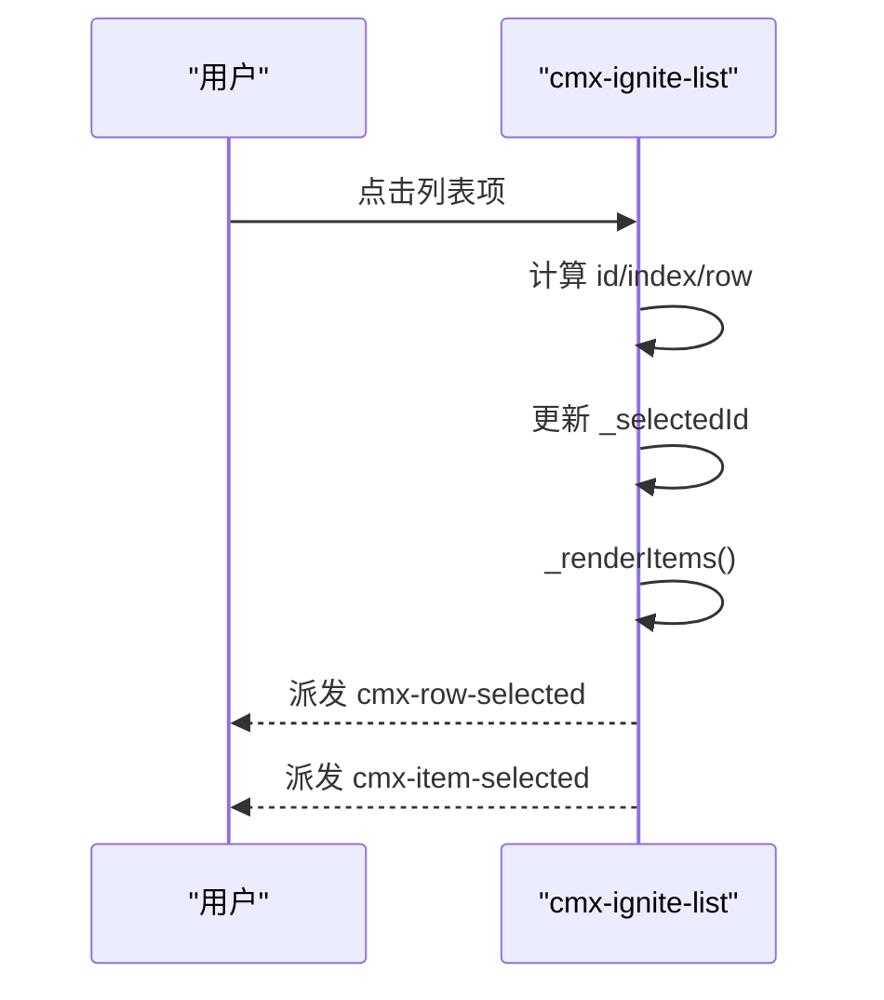
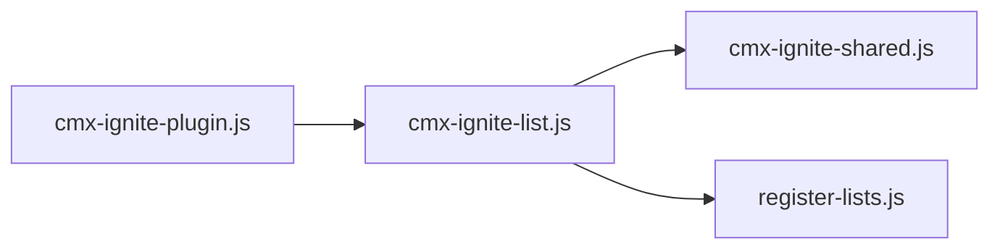

# 列表组件 (cmx-ignite-list)

<cite>
**本文引用的文件**
- [packages/cmx-data-comp/src/components/ignite/cmx-ignite-list.js](file://packages/cmx-data-comp/src/components/ignite/cmx-ignite-list.js)
- [packages/cmx-data-comp/src/components/ignite/cmx-ignite-shared.js](file://packages/cmx-data-comp/src/components/ignite/cmx-ignite-shared.js)
- [CMXHTMLDesigner/src/plugins/cmx-ignite-plugin.js](file://CMXHTMLDesigner/src/plugins/cmx-ignite-plugin.js)
- [.agents/skills/cmx-components-guide/references/ignite-thin.md](file://.agents/skills/cmx-components-guide/references/ignite-thin.md)
</cite>

## 目录
1. [简介](#简介)
2. [项目结构](#项目结构)
3. [核心组件](#核心组件)
4. [架构总览](#架构总览)
5. [详细组件分析](#详细组件分析)
6. [依赖关系分析](#依赖关系分析)
7. [性能注意事项](#性能注意事项)
8. [故障排查指南](#故障排查指南)
9. [结论](#结论)
10. [附录](#附录)

## 简介
cmx-ignite-list 是一个行列表 Web Component，默认基于 IgniteUI 的 igc-list 渲染；当设置 data-cmx-layout="card" 时切换为自定义卡片 DOM 布局。组件支持通过 data-cmx-style-id 引用页面中的模板或样式节点注入自定义外观，并通过 data-cmx-density 控制紧凑密度。数据源既可以是静态 items，也可以是 CmxDataSet（rows），并支持通过 data-cmx-options 配置标题与副标题字段映射。事件方面，组件在选中项变化时派发 cmx-row-selected 与 cmx-item-selected，携带 id、row、index 等上下文信息。

## 项目结构
- 组件实现位于 packages/cmx-data-comp/src/components/ignite/cmx-ignite-list.js，负责：
  - 生命周期与 Shadow DOM 挂载
  - 两种布局模式（igc-list 与 card）的渲染
  - 数据绑定（items / rows / DataSet）
  - 皮肤注入（data-cmx-style-id 与 setSkinStyles）
  - 事件派发（cmx-row-selected、cmx-item-selected）
- 共享工具位于 cmx-ignite-shared.js，提供 JSON 属性解析、CmxDataSet 检测与监听、主题初始化、事件派发等能力。
- 设计器插件注册了 cmx-ignite-list 的属性面板与事件提示，便于可视化配置。

图表来源
- [packages/cmx-data-comp/src/components/ignite/cmx-ignite-list.js:72-87](file://packages/cmx-data-comp/src/components/ignite/cmx-ignite-list.js#L72-L87)
- [packages/cmx-data-comp/src/components/ignite/cmx-ignite-shared.js:67-76](file://packages/cmx-data-comp/src/components/ignite/cmx-ignite-shared.js#L67-L76)

章节来源
- [packages/cmx-data-comp/src/components/ignite/cmx-ignite-list.js:1-120](file://packages/cmx-data-comp/src/components/ignite/cmx-ignite-list.js#L1-L120)
- [CMXHTMLDesigner/src/plugins/cmx-ignite-plugin.js:47-76](file://CMXHTMLDesigner/src/plugins/cmx-ignite-plugin.js#L47-L76)

## 核心组件
- 组件类：CmxIgniteList（继承 HTMLElement）
- 关键方法：
  - setItems(items)：设置静态数据数组
  - setDataSet(dsOrRows)：绑定 CmxDataSet 或行数组
  - setColumnModel(model)：设置标题与副标题字段映射
  - setSkinStyles(cssText)：编程注入皮肤 CSS
- 关键属性：
  - data-cmx-items：静态数据数组
  - data-cmx-rows：静态本地数据数组（优先于 items）
  - data-cmx-options：titleKey/subtitleKey 等选项
  - data-cmx-layout：card | 空（默认 igc-list）
  - data-cmx-style-id：引用同页 template/style 元素 id 注入皮肤
  - data-cmx-density：compact 启用紧凑密度
- 事件：
  - cmx-row-selected：行选中事件
  - cmx-item-selected：项选中事件（与 cmx-row-selected 等价）

章节来源
- [packages/cmx-data-comp/src/components/ignite/cmx-ignite-list.js:61-127](file://packages/cmx-data-comp/src/components/ignite/cmx-ignite-list.js#L61-L127)
- [packages/cmx-data-comp/src/components/ignite/cmx-ignite-list.js:129-178](file://packages/cmx-data-comp/src/components/ignite/cmx-ignite-list.js#L129-L178)
- [packages/cmx-data-comp/src/components/ignite/cmx-ignite-list.js:276-291](file://packages/cmx-data-comp/src/components/ignite/cmx-ignite-list.js#L276-L291)
- [CMXHTMLDesigner/src/plugins/cmx-ignite-plugin.js:58-69](file://CMXHTMLDesigner/src/plugins/cmx-ignite-plugin.js#L58-L69)

## 架构总览
组件在 connectedCallback 中根据 layout 决定内部容器：card 模式使用自定义 div 列表，否则使用 igc-list。随后应用外部皮肤、从属性引导数据绑定并渲染。点击列表项时更新选中状态、同步 DataSet 游标，并派发选中事件。

图表来源
- [packages/cmx-data-comp/src/components/ignite/cmx-ignite-list.js:276-291](file://packages/cmx-data-comp/src/components/ignite/cmx-ignite-list.js#L276-L291)

## 详细组件分析

### 数据源与属性配置
- data-cmx-items：静态数据数组，每项可为对象或字符串。对象建议包含 id/title/subtitle/icon 等字段。
- data-cmx-rows：静态本地数据数组，优先级高于 items。
- data-cmx-options：JSON 对象，可配置 titleKey/subtitleKey，用于指定标题与副标题字段名。
- data-cmx-layout：card 启用卡片布局；不设置或为空时使用 igc-list。
- data-cmx-density：compact 启用紧凑密度（影响 igc-list-item 的标题、副标题与图标尺寸）。
- data-cmx-style-id：引用同根节点下的 template/style 元素 id，将其文本作为 CSS 注入组件 Shadow DOM。

图表来源
- [packages/cmx-data-comp/src/components/ignite/cmx-ignite-list.js:170-178](file://packages/cmx-data-comp/src/components/ignite/cmx-ignite-list.js#L170-L178)
- [packages/cmx-data-comp/src/components/ignite/cmx-ignite-list.js:193-197](file://packages/cmx-data-comp/src/components/ignite/cmx-ignite-list.js#L193-L197)

章节来源
- [packages/cmx-data-comp/src/components/ignite/cmx-ignite-list.js:129-178](file://packages/cmx-data-comp/src/components/ignite/cmx-ignite-list.js#L129-L178)
- [packages/cmx-data-comp/src/components/ignite/cmx-ignite-list.js:180-191](file://packages/cmx-data-comp/src/components/ignite/cmx-ignite-list.js#L180-L191)

### 布局模式与渲染
- 默认布局（igc-list）：
  - 动态创建 igc-list-item，将标题与副标题通过 slot 注入。
  - 支持图标（thumbnail），图标名称来自 row.icon/row.cmxIcon/row.__icon。
- 卡片布局（card）：
  - 使用自定义 .cmx-list-item 结构，包含图标区与内容区。
  - 同样支持标题、副标题与图标。

图表来源
- [packages/cmx-data-comp/src/components/ignite/cmx-ignite-list.js:61-87](file://packages/cmx-data-comp/src/components/ignite/cmx-ignite-list.js#L61-L87)
- [packages/cmx-data-comp/src/components/ignite/cmx-ignite-list.js:199-274](file://packages/cmx-data-comp/src/components/ignite/cmx-ignite-list.js#L199-L274)

章节来源
- [packages/cmx-data-comp/src/components/ignite/cmx-ignite-list.js:199-274](file://packages/cmx-data-comp/src/components/ignite/cmx-ignite-list.js#L199-L274)

### 皮肤注入与样式定制
- 通过 data-cmx-style-id 引用页面中的 template/style 元素，组件会读取其文本内容并注入到 Shadow DOM 的 style 节点中。
- 也可通过 setSkinStyles(cssText) 编程注入。
- 基础样式包含列表容器、列表项、图标与紧凑密度的样式覆盖。

图表来源
- [packages/cmx-data-comp/src/components/ignite/cmx-ignite-list.js:94-120](file://packages/cmx-data-comp/src/components/ignite/cmx-ignite-list.js#L94-L120)

章节来源
- [packages/cmx-data-comp/src/components/ignite/cmx-ignite-list.js:20-59](file://packages/cmx-data-comp/src/components/ignite/cmx-ignite-list.js#L20-L59)
- [packages/cmx-data-comp/src/components/ignite/cmx-ignite-list.js:94-120](file://packages/cmx-data-comp/src/components/ignite/cmx-ignite-list.js#L94-L120)

### 事件处理
- 点击列表项时，组件计算选中 id 与 index，若绑定了 DataSet 则移动游标，然后重新渲染并派发两个事件：
  - cmx-row-selected：{ id, row, index }
  - cmx-item-selected：{ id, row, index }
- 这两个事件可用于上层业务逻辑（如打开详情、加载子列表等）。

图表来源
- [packages/cmx-data-comp/src/components/ignite/cmx-ignite-list.js:276-291](file://packages/cmx-data-comp/src/components/ignite/cmx-ignite-list.js#L276-L291)

章节来源
- [packages/cmx-data-comp/src/components/ignite/cmx-ignite-list.js:276-291](file://packages/cmx-data-comp/src/components/ignite/cmx-ignite-list.js#L276-L291)

### 使用示例

- 静态数据（items）
  - 在 HTML 中使用 data-cmx-items 传入 JSON 数组，每项包含 id/title/subtitle/icon 等字段。
  - 适用于无需与 DataSet 联动的简单场景。

- 静态本地数据（rows）
  - 使用 data-cmx-rows 传入 JSON 数组，优先级高于 items。
  - 适合快速原型或离线展示。

- 动态数据源（CmxDataSet）
  - 通过 setDataSet(ds) 绑定 CmxDataSet，组件会监听游标与行变更，自动同步选中与渲染。
  - 适合与表单、表格等联动场景。

- 卡片布局与密度
  - 设置 data-cmx-layout="card" 启用卡片布局。
  - 设置 data-cmx-density="compact" 启用紧凑密度（影响 igc-list-item 的字体与图标尺寸）。

- 事件处理
  - 监听 cmx-row-selected 或 cmx-item-selected，获取选中行的 id、row、index 进行后续操作。

章节来源
- [packages/cmx-data-comp/src/components/ignite/cmx-ignite-list.js:129-178](file://packages/cmx-data-comp/src/components/ignite/cmx-ignite-list.js#L129-L178)
- [packages/cmx-data-comp/src/components/ignite/cmx-ignite-list.js:199-274](file://packages/cmx-data-comp/src/components/ignite/cmx-ignite-list.js#L199-L274)
- [packages/cmx-data-comp/src/components/ignite/cmx-ignite-list.js:276-291](file://packages/cmx-data-comp/src/components/ignite/cmx-ignite-list.js#L276-L291)
- [CMXHTMLDesigner/src/plugins/cmx-ignite-plugin.js:58-69](file://CMXHTMLDesigner/src/plugins/cmx-ignite-plugin.js#L58-L69)

## 依赖关系分析
- 组件依赖：
  - registerIgniteLists：确保 igc-list 组件可用（非 card 模式）。
  - cmx-ignite-shared：JSON 属性解析、CmxDataSet 检测与监听、主题初始化、事件派发。
- 设计器插件：
  - 注册 cmx-ignite-list 的属性面板与事件提示，便于可视化配置。

图表来源
- [packages/cmx-data-comp/src/components/ignite/cmx-ignite-list.js:11-18](file://packages/cmx-data-comp/src/components/ignite/cmx-ignite-list.js#L11-L18)
- [packages/cmx-data-comp/src/components/ignite/cmx-ignite-shared.js:55-64](file://packages/cmx-data-comp/src/components/ignite/cmx-ignite-shared.js#L55-L64)
- [CMXHTMLDesigner/src/plugins/cmx-ignite-plugin.js:14-16](file://CMXHTMLDesigner/src/plugins/cmx-ignite-plugin.js#L14-L16)

章节来源
- [packages/cmx-data-comp/src/components/ignite/cmx-ignite-list.js:11-18](file://packages/cmx-data-comp/src/components/ignite/cmx-ignite-list.js#L11-L18)
- [packages/cmx-data-comp/src/components/ignite/cmx-ignite-shared.js:67-76](file://packages/cmx-data-comp/src/components/ignite/cmx-ignite-shared.js#L67-L76)
- [CMXHTMLDesigner/src/plugins/cmx-ignite-plugin.js:47-76](file://CMXHTMLDesigner/src/plugins/cmx-ignite-plugin.js#L47-L76)

## 性能注意事项
- 大数据量渲染：
  - 卡片模式直接操作 DOM，数据量大时注意虚拟滚动或分页策略。
  - igc-list 模式由 IgniteUI 管理，通常具备更好的虚拟化与性能优化。
- 频繁更新：
  - 避免在循环中多次调用 setItems/setDataSet；尽量批量更新后一次性渲染。
- 皮肤注入：
  - 皮肤 CSS 仅注入一次，避免重复 setSkinStyles 造成不必要的重排。

[本节为通用指导，不直接分析具体文件]

## 故障排查指南
- data-cmx-style-id 无效：
  - 检查页面是否存在对应 id 的 template/style 节点；组件会在 connectedCallback 中查找并注入。
- 事件未触发：
  - 确认点击目标为列表项（卡片模式需命中 .cmx-list-item，igc 模式需命中 igc-list-item）。
- 数据未显示：
  - 确认 data-cmx-items 或 data-cmx-rows 格式正确；若绑定 DataSet，确保 ds.rows 有数据且游标有效。
- 主题异常：
  - 确保 ensureIgniteTheme 已执行；主题切换时会重新应用 palette。

章节来源
- [packages/cmx-data-comp/src/components/ignite/cmx-ignite-list.js:94-120](file://packages/cmx-data-comp/src/components/ignite/cmx-ignite-list.js#L94-L120)
- [packages/cmx-data-comp/src/components/ignite/cmx-ignite-list.js:276-291](file://packages/cmx-data-comp/src/components/ignite/cmx-ignite-list.js#L276-L291)
- [packages/cmx-data-comp/src/components/ignite/cmx-ignite-shared.js:55-64](file://packages/cmx-data-comp/src/components/ignite/cmx-ignite-shared.js#L55-L64)

## 结论
cmx-ignite-list 提供了灵活的列表展示能力：默认 igc-list 满足常规需求，card 布局支持高度自定义外观；通过 data-cmx-style-id 与 setSkinStyles 可实现页面级皮肤注入；data-cmx-options 允许灵活映射标题与副标题字段；事件 cmx-row-selected 与 cmx-item-selected 为交互提供了统一入口。结合 CmxDataSet 可实现与表单、表格等组件的深度联动。

[本节为总结性内容，不直接分析具体文件]

## 附录

### 属性速查表
- data-cmx-items：静态数据数组
- data-cmx-rows：静态本地数据数组（优先于 items）
- data-cmx-options：titleKey/subtitleKey 等选项
- data-cmx-layout：card | 空（默认 igc-list）
- data-cmx-style-id：引用页面 template/style 元素 id 注入皮肤
- data-cmx-density：compact 启用紧凑密度

章节来源
- [CMXHTMLDesigner/src/plugins/cmx-ignite-plugin.js:58-69](file://CMXHTMLDesigner/src/plugins/cmx-ignite-plugin.js#L58-L69)
- [packages/cmx-data-comp/src/components/ignite/cmx-ignite-list.js:170-178](file://packages/cmx-data-comp/src/components/ignite/cmx-ignite-list.js#L170-L178)

### API 与方法
- setItems(items)：设置静态数据
- setDataSet(dsOrRows)：绑定 CmxDataSet 或行数组
- setColumnModel(model)：设置标题与副标题字段映射
- setSkinStyles(cssText)：编程注入皮肤 CSS

章节来源
- [packages/cmx-data-comp/src/components/ignite/cmx-ignite-list.js:122-127](file://packages/cmx-data-comp/src/components/ignite/cmx-ignite-list.js#L122-L127)
- [packages/cmx-data-comp/src/components/ignite/cmx-ignite-list.js:129-160](file://packages/cmx-data-comp/src/components/ignite/cmx-ignite-list.js#L129-L160)
- [packages/cmx-data-comp/src/components/ignite/cmx-ignite-list.js:94-107](file://packages/cmx-data-comp/src/components/ignite/cmx-ignite-list.js#L94-L107)

### 事件说明
- cmx-row-selected：{ id, row, index }
- cmx-item-selected：{ id, row, index }

章节来源
- [packages/cmx-data-comp/src/components/ignite/cmx-ignite-list.js:276-291](file://packages/cmx-data-comp/src/components/ignite/cmx-ignite-list.js#L276-L291)
- [.agents/skills/cmx-components-guide/references/ignite-thin.md:246-252](file://.agents/skills/cmx-components-guide/references/ignite-thin.md#L246-L252)