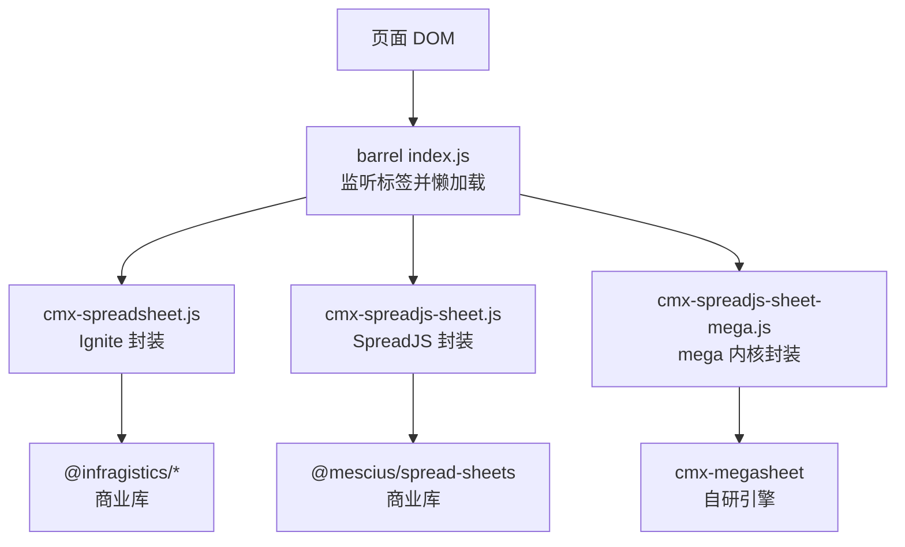
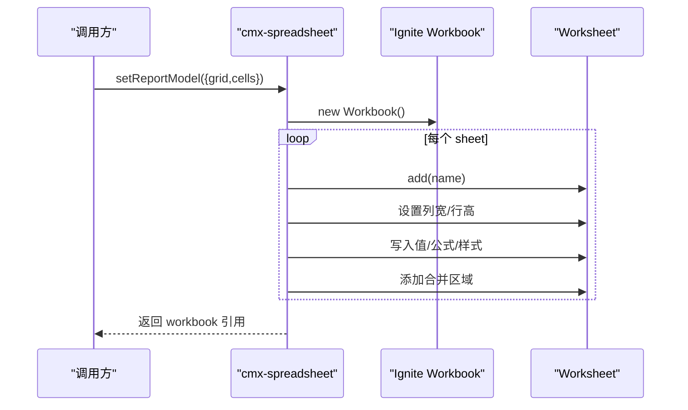
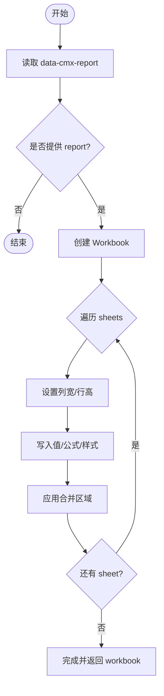
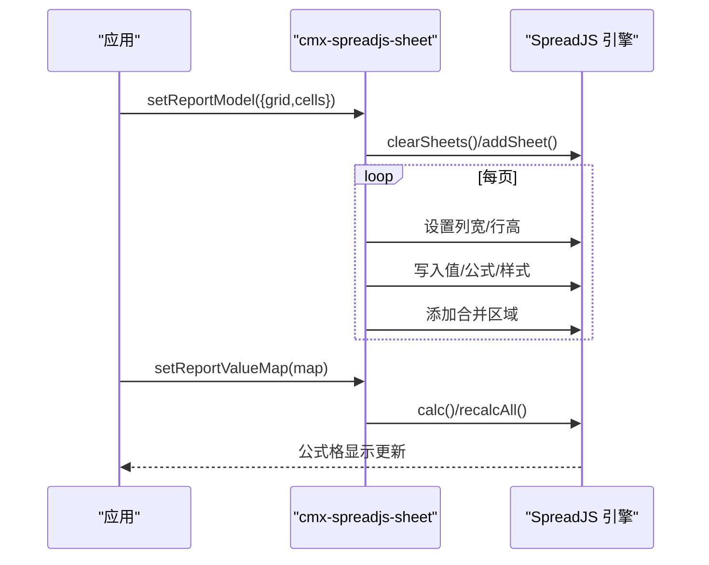
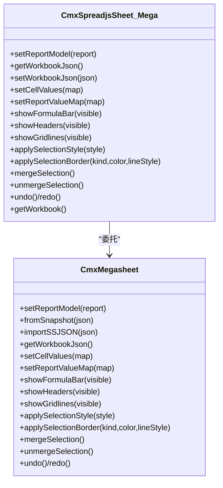
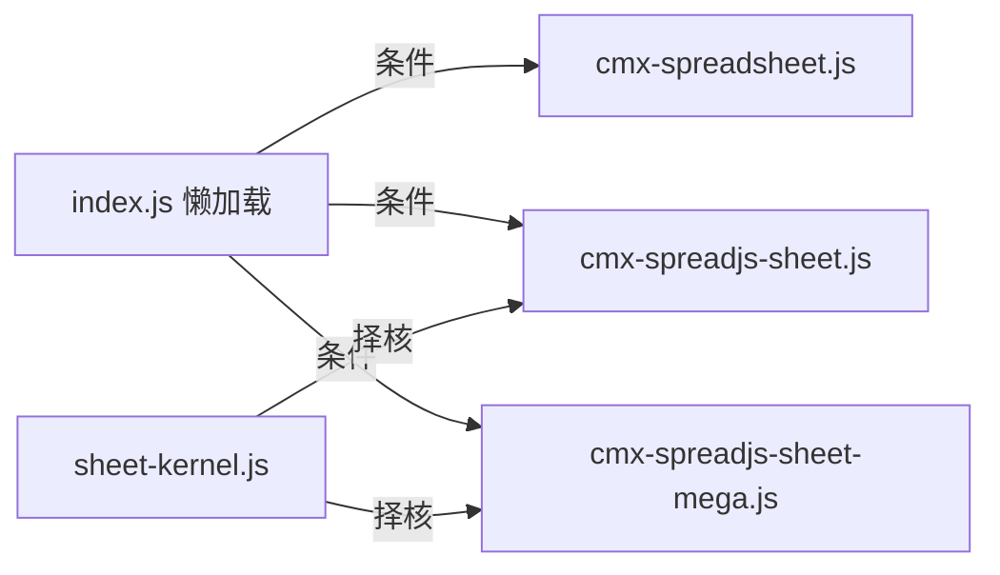

# 电子表格组件

<cite>
**本文引用的文件**
- [cmx-spreadsheet.js](file://packages/cmx-data-comp/src/components/ignite/cmx-spreadsheet.js)
- [register-spreadsheet.js](file://packages/cmx-data-comp/src/components/ignite/register-spreadsheet.js)
- [cmx-spreadjs-sheet.js](file://packages/cmx-data-comp/src/components/spreadjs/cmx-spreadjs-sheet.js)
- [cmx-spreadjs-sheet-mega.js](file://packages/cmx-data-comp/src/components/spreadjs/cmx-spreadjs-sheet-mega.js)
- [sheet-kernel.js](file://packages/cmx-data-comp/src/components/spreadjs/sheet-kernel.js)
- [index.js](file://packages/cmx-data-comp/src/index.js)
- [cmx-ignite-plugin.js](file://CMXHTMLDesigner/src/plugins/cmx-ignite-plugin.js)
- [spec-m0.js](file://cmx-mega-sheet/demo/specs/spec-m0.js)
- [spec-m1.js](file://cmx-mega-sheet/demo/specs/spec-m1.js)
- [spec-m2.js](file://cmx-mega-sheet/demo/specs/spec-m2.js)
</cite>

## 目录
1. [简介](#简介)
2. [项目结构](#项目结构)
3. [核心组件](#核心组件)
4. [架构总览](#架构总览)
5. [详细组件分析](#详细组件分析)
6. [依赖关系分析](#依赖关系分析)
7. [性能考虑](#性能考虑)
8. [故障排查指南](#故障排查指南)
9. [结论](#结论)
10. [附录：data-cmx-report 配置与示例](#附录data-cmx-report-配置与示例)

## 简介
本组件提供两套“Excel 式”电子表格能力，统一对外暴露一致的 API 与事件契约，用于报表表样渲染与编辑：
- cmx-spreadsheet：基于 Ignite igc-spreadsheet 的封装，原生支持合并格、公式栏、单元格样式、公式计算等。
- cmx-spreadjs-sheet：SpreadJS 的封装（默认内核已切换为自研 cmx-megasheet），提供与 cmx-spreadsheet 对齐的 API 和事件接口，便于在商业引擎与自研引擎之间无缝切换。

两个组件均通过 data-cmx-report 属性接收 JSON 配置，驱动报表模板渲染；同时支持运行时 setReportModel/setWorkbook/getWorkbook 等编程式 API。

## 项目结构
- 组件注册与懒加载：
  - 入口 barrel 会在首次遇到 <cmx-spreadsheet> / <cmx-spreadjs-sheet> 标签时动态 import 对应实现，避免无关依赖提前加载。
- 内核选择：
  - sheet-kernel.js 决定 cmx-spreadjs-sheet 使用 SpreadJS 还是自研 mega 内核，默认 mega。
- 设计器集成：
  - 设计器插件中声明了 data-cmx-report 与 data-cmx-formula-bar 等属性，并提供示例 JSON 片段。

图表来源
- [index.js:30-55](file://packages/cmx-data-comp/src/index.js#L30-L55)
- [sheet-kernel.js:1-27](file://packages/cmx-data-comp/src/components/spreadjs/sheet-kernel.js#L1-L27)

章节来源
- [index.js:30-55](file://packages/cmx-data-comp/src/index.js#L30-L55)
- [sheet-kernel.js:1-27](file://packages/cmx-data-comp/src/components/spreadjs/sheet-kernel.js#L1-L27)

## 核心组件
- cmx-spreadsheet（Ignite 封装）
  - 定位：报表表样渲染 / Excel 式编辑，原生合并格、公式栏、单元格样式、公式计算。
  - 关键 API：setReportModel、setWorkbook、getWorkbook、showFormulaBar/showHeaders/showGridlines、exportXlsx/importXlsx、setCellValues、verifyAgainst 等。
  - 事件：cmx-cell-selected（包含 addr/row/col）。
  - 声明式属性：data-cmx-report（JSON）、data-cmx-formula-bar。
- cmx-spreadjs-sheet（SpreadJS/mega 封装）
  - 定位：与 cmx-spreadsheet 对齐的 API/事件，便于替换内核。
  - 关键 API：setReportModel、setWorkbookJson/getWorkbookJson、setCellValues、setReportValueMap、setColorScheme、applySelectionStyle/Border、merge/unmerge、undo/redo 等。
  - 事件：cmx-cell-selected、cmx-cell-edited、cmx-sheet-changed（由内部或轮询触发）。
  - 声明式属性：data-cmx-report、data-cmx-formula-bar、data-cmx-theme。

章节来源
- [cmx-spreadsheet.js:1-21](file://packages/cmx-data-comp/src/components/ignite/cmx-spreadsheet.js#L1-L21)
- [cmx-spreadjs-sheet.js:1-6](file://packages/cmx-data-comp/src/components/spreadjs/cmx-spreadjs-sheet.js#L1-L6)
- [cmx-spreadjs-sheet-mega.js:1-12](file://packages/cmx-data-comp/src/components/spreadjs/cmx-spreadjs-sheet-mega.js#L1-L12)

## 架构总览
两套组件共享同一份“数据模型约定”——data-cmx-report 的 {grid, cells} 结构，分别映射到不同底层引擎：
- Ignite 路径：CmxSpreadsheet → Workbook/Worksheet → 渲染与交互。
- SpreadJS/mega 路径：CmxSpreadjsSheet → GC.Spread.Sheets.Workbook 或 cmx-megasheet 工作簿 → 渲染与交互。

图表来源
- [cmx-spreadsheet.js:707-723](file://packages/cmx-data-comp/src/components/ignite/cmx-spreadsheet.js#L707-L723)
- [cmx-spreadsheet.js:725-798](file://packages/cmx-data-comp/src/components/ignite/cmx-spreadsheet.js#L725-L798)

章节来源
- [cmx-spreadsheet.js:707-798](file://packages/cmx-data-comp/src/components/ignite/cmx-spreadsheet.js#L707-L798)

## 详细组件分析

### cmx-spreadsheet（Ignite 封装）
- 生命周期与挂载
  - 在 light DOM 下挂载 igc-spreadsheet，确保其注入的 head 级样式生效；若处于 shadow root 内，会复制样式以解决塌陷问题。
  - 连接后读取 data-cmx-report/data-cmx-formula-bar 并初始化。
- 数据模型渲染
  - _buildWorkbook/_fillWorksheet：按 grid（行列、合并、列宽、行高、blocks、styleClasses）与 cells（类型、值、样式）构建 Worksheet。
  - 支持 fetches 预置取数函数（QM/QC…）作为 UDF，使公式可算且显示真值。
- 导出/导入
  - exportXlsx：构造“纯值+无颜色”副本以避免 UDF/颜色导致的序列化失败。
  - importXlsx：解析 xlsx 回写为 sheets[{id,name,grid,cells}] 供设计器使用。
- 一致性校验
  - verifyAgainst：将后端 values 与前端计算结果逐格比对，发现偏差。
- 事件
  - 绑定后派发 cmx-cell-selected（addr/row/col）。

图表来源
- [cmx-spreadsheet.js:707-723](file://packages/cmx-data-comp/src/components/ignite/cmx-spreadsheet.js#L707-L723)
- [cmx-spreadsheet.js:725-798](file://packages/cmx-data-comp/src/components/ignite/cmx-spreadsheet.js#L725-L798)

章节来源
- [cmx-spreadsheet.js:170-204](file://packages/cmx-data-comp/src/components/ignite/cmx-spreadsheet.js#L170-L204)
- [cmx-spreadsheet.js:214-253](file://packages/cmx-data-comp/src/components/ignite/cmx-spreadsheet.js#L214-L253)
- [cmx-spreadsheet.js:299-318](file://packages/cmx-data-comp/src/components/ignite/cmx-spreadsheet.js#L299-L318)
- [cmx-spreadsheet.js:395-465](file://packages/cmx-data-comp/src/components/ignite/cmx-spreadsheet.js#L395-L465)
- [cmx-spreadsheet.js:707-798](file://packages/cmx-data-comp/src/components/ignite/cmx-spreadsheet.js#L707-L798)

### cmx-spreadjs-sheet（SpreadJS 封装）
- 主题与可见性
  - 内置 light/dark 配色，自动跟随门户主题；对隐藏容器做 IntersectionObserver 保护，避免 0×0 布局缓存导致空白。
- 取数函数
  - 注册 QM/QC/JE/FS/REF 全局自定义函数，从内存 map 按“所在格”取值，参与 SpreadJS 原生公式计算。
- 版式存储
  - getWorkbookJson：导出 SSJSON 并剔除主题视图色键，保证 BLOB 主题中性。
  - setWorkbookJson：从 SSJSON 复原，清理撤销栈。
- 数据回填
  - setCellValues：按 A1 坐标覆盖显示值，保留版式与公式；setReportValueMap：灌入取数值 map 并触发重算。
- 选区与样式
  - applySelectionStyle/Border、merge/unmerge、clear、insert/deleteRows/Columns 等，全部包裹为可撤销命令。
- 事件
  - 名称框/公式栏兜底轮询，确保 cmx-cell-selected 稳定触发；编辑/变更事件由内部机制派发。

图表来源
- [cmx-spreadjs-sheet.js:401-425](file://packages/cmx-data-comp/src/components/spreadjs/cmx-spreadjs-sheet.js#L401-L425)
- [cmx-spreadjs-sheet.js:531-544](file://packages/cmx-data-comp/src/components/spreadjs/cmx-spreadjs-sheet.js#L531-L544)

章节来源
- [cmx-spreadjs-sheet.js:78-100](file://packages/cmx-data-comp/src/components/spreadjs/cmx-spreadjs-sheet.js#L78-L100)
- [cmx-spreadjs-sheet.js:115-153](file://packages/cmx-data-comp/src/components/spreadjs/cmx-spreadjs-sheet.js#L115-L153)
- [cmx-spreadjs-sheet.js:445-502](file://packages/cmx-data-comp/src/components/spreadjs/cmx-spreadjs-sheet.js#L445-L502)
- [cmx-spreadjs-sheet.js:509-544](file://packages/cmx-data-comp/src/components/spreadjs/cmx-spreadjs-sheet.js#L509-L544)
- [cmx-spreadjs-sheet.js:654-748](file://packages/cmx-data-comp/src/components/spreadjs/cmx-spreadjs-sheet.js#L654-L748)

### cmx-spreadjs-sheet（mega 内核封装）
- 目标：用自研 cmx-megasheet 替代 SpreadJS，保持标签名与公共 API 一致，消费方零改动。
- 适配层：getWorkbook() 返回 SpreadJS 兼容适配器，使 designer/report-applier 中原生 Worksheet/Workbook 方法调用继续有效。
- 双读版式：setWorkbookJson 识别新旧格式（cmx-megasheet 中性快照 vs SpreadJS SSJSON），均可复原。
- 事件转发：内部组件事件自然穿出 shadow DOM，保持 cmx-cell-selected/edited/sheet-changed 语义。

图表来源
- [cmx-spreadjs-sheet-mega.js:26-192](file://packages/cmx-data-comp/src/components/spreadjs/cmx-spreadjs-sheet-mega.js#L26-L192)

章节来源
- [cmx-spreadjs-sheet-mega.js:1-12](file://packages/cmx-data-comp/src/components/spreadjs/cmx-spreadjs-sheet-mega.js#L1-L12)
- [cmx-spreadjs-sheet-mega.js:67-192](file://packages/cmx-data-comp/src/components/spreadjs/cmx-spreadjs-sheet-mega.js#L67-L192)

## 依赖关系分析
- 商业依赖隔离
  - Ignite：仅在 cmx-spreadsheet 路径引入，按需注册模块。
  - SpreadJS：仅在 SpreadJS 内核路径引入；默认内核已切换到自研 mega。
- 懒加载与择核
  - barrel 根据文档中出现标签动态 import；sheet-kernel 决定具体类注册。

图表来源
- [index.js:30-55](file://packages/cmx-data-comp/src/index.js#L30-L55)
- [sheet-kernel.js:16-26](file://packages/cmx-data-comp/src/components/spreadjs/sheet-kernel.js#L16-L26)

章节来源
- [register-spreadsheet.js:1-24](file://packages/cmx-data-comp/src/components/ignite/register-spreadsheet.js#L1-L24)
- [index.js:30-55](file://packages/cmx-data-comp/src/index.js#L30-L55)
- [sheet-kernel.js:16-26](file://packages/cmx-data-comp/src/components/spreadjs/sheet-kernel.js#L16-L26)

## 性能考虑
- 批量绘制与防抖
  - SpreadJS 路径使用 suspendPaint/resumePaint 包裹批量修改，减少重绘次数。
  - 主题切换与 fromJSON 后集中 refresh，避免频繁刷新。
- 可见性保护
  - 使用 IntersectionObserver 检测宿主可见性，隐藏期延迟刷新，防止 0×0 布局缓存导致空白。
- 大表渲染
  - 自研 mega 引擎具备视口虚拟化与几何前缀和，仅渲染可视区域，降低大数据量下的开销。
- 导出优化
  - Ignite 导出时构造“纯值+无颜色”副本，规避 UDF/颜色导致的序列化失败与性能损耗。

[本节为通用性能建议，不直接分析具体文件]

## 故障排查指南
- 公式栏/名称框不更新
  - SpreadJS 路径存在 SelectionChanged 不总是触发的已知问题，组件通过 200ms 轮询活动格地址同步名称框并派发 cmx-cell-selected。
- 阴影 DOM 下样式失效
  - Ignite 路径会将 head 注入的样式复制到当前 shadow root，避免工具条/滚动条/标签样式丢失。
- 颜色崩溃
  - Ignite 路径通过安全构造 WorkbookColorInfo（先 Color.create 再传入对象）绕过字符串路径构造缺陷，避免渲染冻结。
- 主题切换后画布空白
  - SpreadJS 路径在隐藏期跳过 refresh，待重新可见时补刷；主题切换也会触发一次刷新。

章节来源
- [cmx-spreadjs-sheet.js:380-399](file://packages/cmx-data-comp/src/components/spreadjs/cmx-spreadjs-sheet.js#L380-L399)
- [cmx-spreadsheet.js:655-695](file://packages/cmx-data-comp/src/components/ignite/cmx-spreadsheet.js#L655-L695)
- [cmx-spreadsheet.js:96-116](file://packages/cmx-data-comp/src/components/ignite/cmx-spreadsheet.js#L96-L116)
- [cmx-spreadjs-sheet.js:577-623](file://packages/cmx-data-comp/src/components/spreadjs/cmx-spreadjs-sheet.js#L577-L623)

## 结论
- 两套组件提供统一的 data-cmx-report 配置与 API/事件契约，可在 Ignite 与 SpreadJS/mega 之间灵活切换。
- 通过网格定义（grid）与单元格定义（cells）即可描述复杂报表模板；结合取数函数与公式，满足报表展示与编辑需求。
- 针对阴影 DOM、主题切换、大表渲染等场景提供了稳健的实现策略。

[本节为总结性内容，不直接分析具体文件]

## 附录：data-cmx-report 配置与示例

### data-cmx-report 结构说明
- grid：定义画布与样式
  - rows/cols：行数/列数
  - colWidths：列宽（像素），如 {"A":220,"B":140}
  - rowHeights：行高（像素），如 {"1":34}
  - merges：合并区域数组，如 ["A1:F1","B2:D5"]
  - blocks：区块角色（如 header），用于提示加粗等
  - styleClasses：命名样式表，复用样式，如 title/num/tot 等
- cells：单元格内容
  - type：text | param | fetch | calc | ref
  - value：文本/数值/参数占位
  - formula：公式（fetch/calc/ref 常用）
  - class/style：引用命名样式或内联样式
  - 样式字段：bold/italic/underline/align/format/fontSize/fontColor/fillColor/border/topBorder 等

章节来源
- [cmx-ignite-plugin.js:81-124](file://CMXHTMLDesigner/src/plugins/cmx-ignite-plugin.js#L81-L124)
- [cmx-spreadsheet.js:725-798](file://packages/cmx-data-comp/src/components/ignite/cmx-spreadsheet.js#L725-L798)
- [cmx-spreadjs-sheet.js:202-235](file://packages/cmx-data-comp/src/components/spreadjs/cmx-spreadjs-sheet.js#L202-L235)

### 报表模板示例（示意）
- 标题合并与列宽
  - grid.merges: ["A1:F1"]
  - grid.colWidths: {"A":220,"B":60,"C":120}
- 参数与取数
  - cells.E1: {type:"param", value:"=@org.name"}
  - cells.C3: {type:"fetch", formula:"=QM('1001')"}
  - cells.C4: {type:"calc", formula:"=SUM(C2:C3)"}
- 样式复用
  - grid.styleClasses.title: {bold:true, fontSize:16, align:"center", fillColor:"#eef2f7", fontColor:"#1a1d22"}
  - grid.styleClasses.num: {align:"right", format:"#,##0.00"}
  - cells.C3.class: "num"

章节来源
- [cmx-ignite-plugin.js:88-114](file://CMXHTMLDesigner/src/plugins/cmx-ignite-plugin.js#L88-L114)
- [spec-m0.js:15-38](file://cmx-mega-sheet/demo/specs/spec-m0.js#L15-L38)

### 事件处理
- cmx-cell-selected：选中单元格变化时派发，detail 包含 addr/row/col。
- cmx-cell-edited：单元格编辑完成后派发（SpreadJS/mega 路径）。
- cmx-sheet-changed：工作表内容变更后派发（SpreadJS/mega 路径）。

章节来源
- [cmx-spreadsheet.js:13-16](file://packages/cmx-data-comp/src/components/ignite/cmx-spreadsheet.js#L13-L16)
- [cmx-ignite-plugin.js:82-91](file://CMXHTMLDesigner/src/plugins/cmx-ignite-plugin.js#L82-L91)
- [cmx-ignite-plugin.js:103-114](file://CMXHTMLDesigner/src/plugins/cmx-ignite-plugin.js#L103-L114)
- [cmx-spreadjs-sheet.js:380-399](file://packages/cmx-data-comp/src/components/spreadjs/cmx-spreadjs-sheet.js#L380-L399)
- [spec-m2.js:1-14](file://cmx-mega-sheet/demo/specs/spec-m2.js#L1-L14)