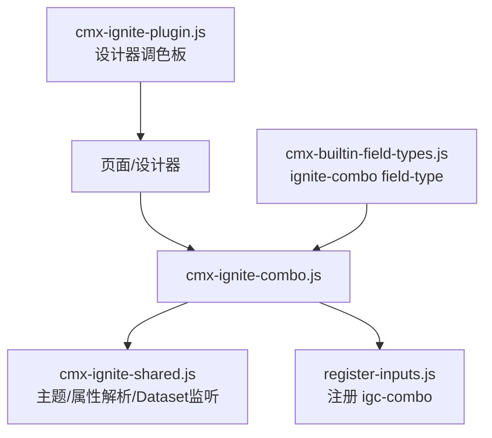
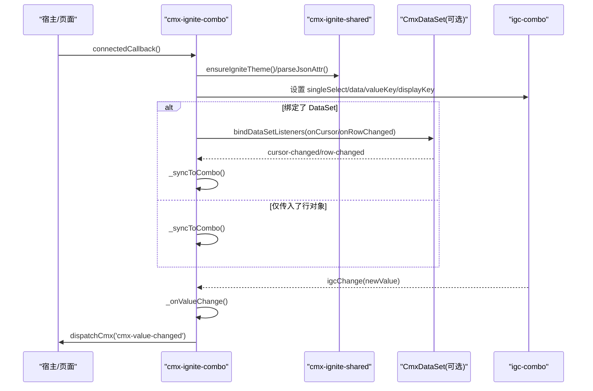
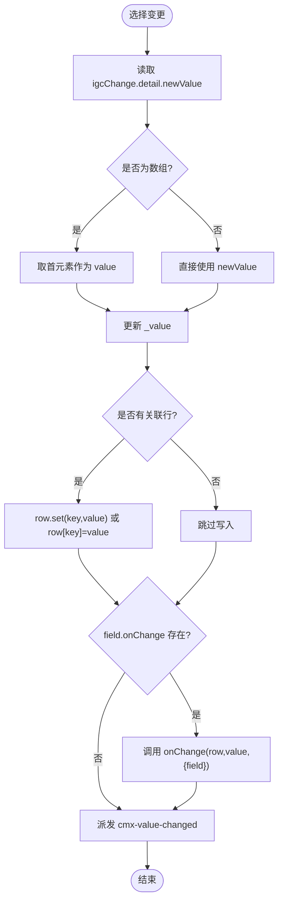
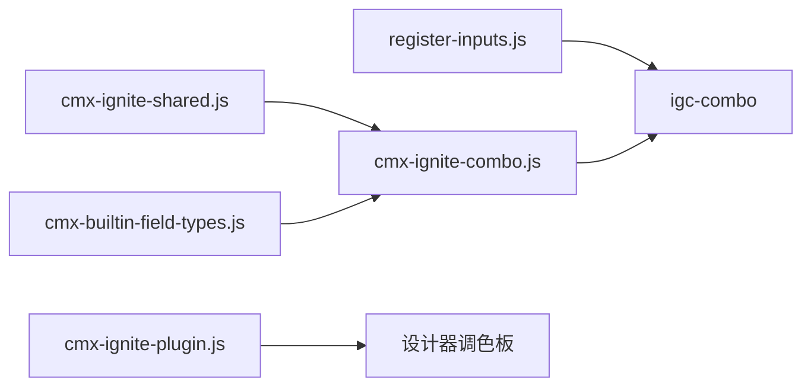

# 组合框组件 (cmx-ignite-combo)

<cite>
**本文引用的文件**
- [cmx-ignite-combo.js](file://packages/cmx-data-comp/src/components/ignite/cmx-ignite-combo.js)
- [cmx-ignite-shared.js](file://packages/cmx-data-comp/src/components/ignite/cmx-ignite-shared.js)
- [register-inputs.js](file://packages/cmx-data-comp/src/components/ignite/register-inputs.js)
- [cmx-builtin-field-types.js](file://packages/cmx-data-comp/src/lib/cmx-builtin-field-types.js)
- [cmx-ignite-plugin.js](file://CMXHTMLDesigner/src/plugins/cmx-ignite-plugin.js)
- [ignite-thin.md](file://.agents/skills/cmx-components-guide/references/ignite-thin.md)
</cite>

## 目录
1. [简介](#简介)
2. [项目结构](#项目结构)
3. [核心组件](#核心组件)
4. [架构总览](#架构总览)
5. [详细组件分析](#详细组件分析)
6. [依赖关系分析](#依赖关系分析)
7. [性能与样式建议](#性能与样式建议)
8. [故障排查](#故障排查)
9. [结论](#结论)
10. [附录：属性、事件与使用示例](#附录属性事件与使用示例)

## 简介
cmx-ignite-combo 是 Ignite igc-combo 的封装组件，提供单选下拉能力。它支持两种典型用法：
- 独立或主从绑定：通过 setField/setItems/setColumnModel/setDataSet 配置数据源与字段绑定；
- 作为 cmx-ui5-form 或 cmx-revo-grid 的字段编辑器（editMode=ignite-combo），在表单或网格单元格中直接编辑当前行字段。

该组件通过 data-cmx-* 属性进行声明式配置，包括 data-cmx-field、data-cmx-items、data-cmx-row 等，便于在设计器中拖拽并可视化配置。

## 项目结构
- 组件实现位于 packages/cmx-data-comp/src/components/ignite/cmx-ignite-combo.js，内部基于 igniteui-webcomponents 的 igc-combo。
- 共享工具（主题注入、JSON 属性解析、CmxDataSet 监听）位于 cmx-ignite-shared.js。
- 输入类组件注册（含 igc-combo）位于 register-inputs.js。
- 作为表单/网格编辑器时，由 cmx-builtin-field-types.js 中的 ignite-combo field-type 创建并挂载组件。
- 设计器侧通过 CMXHTMLDesigner/src/plugins/cmx-ignite-plugin.js 将 <cmx-ignite-combo> 暴露到调色板，支持拖拽与属性面板配置。

图表来源
- [cmx-ignite-combo.js:1-231](file://packages/cmx-data-comp/src/components/ignite/cmx-ignite-combo.js#L1-L231)
- [cmx-ignite-shared.js:1-136](file://packages/cmx-data-comp/src/components/ignite/cmx-ignite-shared.js#L1-L136)
- [register-inputs.js:1-40](file://packages/cmx-data-comp/src/components/ignite/register-inputs.js#L1-L40)
- [cmx-builtin-field-types.js:230-355](file://packages/cmx-data-comp/src/lib/cmx-builtin-field-types.js#L230-L355)
- [cmx-ignite-plugin.js:1-125](file://CMXHTMLDesigner/src/plugins/cmx-ignite-plugin.js#L1-L125)

章节来源
- [cmx-ignite-combo.js:1-231](file://packages/cmx-data-comp/src/components/ignite/cmx-ignite-combo.js#L1-L231)
- [cmx-ignite-shared.js:1-136](file://packages/cmx-data-comp/src/components/ignite/cmx-ignite-shared.js#L1-L136)
- [register-inputs.js:1-40](file://packages/cmx-data-comp/src/components/ignite/register-inputs.js#L1-L40)
- [cmx-builtin-field-types.js:230-355](file://packages/cmx-data-comp/src/lib/cmx-builtin-field-types.js#L230-L355)
- [cmx-ignite-plugin.js:1-125](file://CMXHTMLDesigner/src/plugins/cmx-ignite-plugin.js#L1-L125)

## 核心组件
- 组件标签：<cmx-ignite-combo>
- 内部控件：igc-combo（single-select 单选模式）
- 关键 API：
  - setField(field)：设置字段定义，自动读取 options/valueKey/displayKey 等
  - setItems(items)：设置静态选项数组
  - setColumnModel(model)：将列模型转换为 field 后调用 setField
  - setDataSet(dsOrRow)：绑定 CmxDataSet（游标同步）或直接传入行对象
  - setValue(v, opts?) / getValue()：编辑器模式下读写值
  - setEditorMode(b)：进入编辑器模式（抑制自带 label，撑满宿主）
  - setReadonly(b)、focus()、open()：只读、聚焦、展开
- 事件：
  - cmx-value-changed { key, value, row }：选中值变化时派发

章节来源
- [cmx-ignite-combo.js:20-231](file://packages/cmx-data-comp/src/components/ignite/cmx-ignite-combo.js#L20-L231)
- [ignite-thin.md:172-191](file://.agents/skills/cmx-components-guide/references/ignite-thin.md#L172-L191)

## 架构总览
cmx-ignite-combo 在连接 DOM 时完成以下流程：
- 注册 Ignite 输入组件并确保主题就绪
- 创建 Shadow DOM，渲染 igc-combo，并强制 singleSelect
- 解析 data-cmx-* 属性，初始化 field/items/row
- 根据 field 和 _row/_value 同步到 igc-combo
- 监听 igcChange，派发自定义事件并回写行字段

图表来源
- [cmx-ignite-combo.js:35-192](file://packages/cmx-data-comp/src/components/ignite/cmx-ignite-combo.js#L35-L192)
- [cmx-ignite-shared.js:55-136](file://packages/cmx-data-comp/src/components/ignite/cmx-ignite-shared.js#L55-L136)

## 详细组件分析

### 属性与配置（data-cmx-*）
- data-cmx-field：JSON 字符串，描述字段定义。可包含 key、label、placeholder、readonly、options、editSettings 等。
  - editSettings.valueKey/valueField：选项的值字段名（默认 value）
  - editSettings.displayKey：选项的显示字段名（默认 label）
  - editSettings.options：静态选项数组（与 field.options 二选一）
- data-cmx-items：JSON 数组，直接提供选项列表。每项可为字符串或对象 {value, label}。
- data-cmx-row：JSON 对象，初始行数据。若为 CmxDataSet，则启用游标与行变更监听。

注意：
- 当同时提供 field 与 items 时，field 优先用于 label/placeholder/readonly 等元信息，items 用于数据源。
- 值映射优先级：编辑器模式优先 _value；主从绑定模式优先从 _row[field.key] 取值。

章节来源
- [cmx-ignite-combo.js:117-146](file://packages/cmx-data-comp/src/components/ignite/cmx-ignite-combo.js#L117-L146)
- [cmx-ignite-shared.js:68-76](file://packages/cmx-data-comp/src/components/ignite/cmx-ignite-shared.js#L68-L76)

### 数据绑定与事件流
- 绑定 CmxDataSet：
  - 监听 cursor-changed：切换行时清空 _value，重新从 _row 取值
  - 监听 row-changed：当当前行变化时触发 _syncToCombo
- 值写入：
  - 选择项后，尝试通过 row.set(key, value) 或 row[key]=value 写入
  - 若存在 field.onChange，调用回调
- 事件派发：
  - 统一派发 cmx-value-changed，携带 {key, value, row}

图表来源
- [cmx-ignite-combo.js:167-192](file://packages/cmx-data-comp/src/components/ignite/cmx-ignite-combo.js#L167-L192)

章节来源
- [cmx-ignite-combo.js:95-192](file://packages/cmx-data-comp/src/components/ignite/cmx-ignite-combo.js#L95-L192)
- [cmx-ignite-shared.js:91-126](file://packages/cmx-data-comp/src/components/ignite/cmx-ignite-shared.js#L91-L126)

### 作为表单/网格编辑器（editMode=ignite-combo）
- 在 cmx-ui5-form 中：
  - 通过 ignite-combo field-type 创建 <cmx-ignite-combo>，并调用 setEditorMode(true) 抑制自带 label，适配 UI5 表单布局
  - 监听 cmx-value-changed 后将值提交给表单上下文
- 在 cmx-revo-grid 中：
  - 通过 grid.editor 动态挂载 <cmx-ignite-combo>，设置 data-cmx-fill-host 以撑满单元格高度
  - 监听 cmx-value-changed 后保存并关闭编辑器
  - 只读显示时，优先使用 ${prop}_label 冗余字段，否则按 editSettings.options 查表映射

章节来源
- [cmx-builtin-field-types.js:251-355](file://packages/cmx-data-comp/src/lib/cmx-builtin-field-types.js#L251-L355)

### 设计器集成
- 设计器插件将 <cmx-ignite-combo> 注册到“Ignite 组件”分组，支持拖拽
- 属性面板暴露 data-cmx-field、data-cmx-items、data-cmx-row 等 JSON 文本输入
- 默认样式为 display:block;width:100%

章节来源
- [cmx-ignite-plugin.js:18-46](file://CMXHTMLDesigner/src/plugins/cmx-ignite-plugin.js#L18-L46)

## 依赖关系分析
- 外部依赖：
  - igniteui-webcomponents：提供 igc-combo 及主题配置
- 内部依赖：
  - cmx-ignite-shared：主题注入、JSON 属性解析、CmxDataSet 监听、事件派发
  - register-inputs：注册 igc-* 组件
  - cmx-builtin-field-types：在 form/grid 中创建并管理编辑器实例
  - cmx-ignite-plugin：设计器侧注册与属性面板

图表来源
- [register-inputs.js:1-40](file://packages/cmx-data-comp/src/components/ignite/register-inputs.js#L1-L40)
- [cmx-ignite-shared.js:1-136](file://packages/cmx-data-comp/src/components/ignite/cmx-ignite-shared.js#L1-L136)
- [cmx-ignite-combo.js:1-231](file://packages/cmx-data-comp/src/components/ignite/cmx-ignite-combo.js#L1-L231)
- [cmx-builtin-field-types.js:230-355](file://packages/cmx-data-comp/src/lib/cmx-builtin-field-types.js#L230-L355)
- [cmx-ignite-plugin.js:1-125](file://CMXHTMLDesigner/src/plugins/cmx-ignite-plugin.js#L1-L125)

章节来源
- [register-inputs.js:1-40](file://packages/cmx-data-comp/src/components/ignite/register-inputs.js#L1-L40)
- [cmx-ignite-shared.js:1-136](file://packages/cmx-data-comp/src/components/ignite/cmx-ignite-shared.js#L1-L136)
- [cmx-ignite-combo.js:1-231](file://packages/cmx-data-comp/src/components/ignite/cmx-ignite-combo.js#L1-L231)
- [cmx-builtin-field-types.js:230-355](file://packages/cmx-data-comp/src/lib/cmx-builtin-field-types.js#L230-L355)
- [cmx-ignite-plugin.js:1-125](file://CMXHTMLDesigner/src/plugins/cmx-ignite-plugin.js#L1-L125)

## 性能与样式建议
- 主题与样式
  - 确保 ensureIgniteTheme 已执行，避免下拉透明、尺寸塌陷、文字叠加
  - 编辑器模式使用 setEditorMode(true) 与 data-cmx-fill-host，使组件撑满宿主并保持垂直居中
  - 可通过 CSS 变量 --ig-size 控制尺寸（如 small）
- 数据量与选项
  - 大量静态选项时，尽量使用扁平数组；必要时考虑分页或远端搜索场景改用其他 combo（ignite-combo 主打本地静态选项）
- 事件与回环
  - setValue 时可使用 opts.silent=true 避免重复派发 cmx-value-changed
  - 利用 _silent 标志防止 igcChange 与程序化赋值之间的回环
- 内存与生命周期
  - 组件断开连接时会解绑 CmxDataSet 监听，避免内存泄漏

[本节为通用指导，不直接分析具体文件]

## 故障排查
- 下拉透明/样式异常
  - 检查 ensureIgniteTheme 是否被调用；确认 palette CSS 已注入
- 值未更新
  - 确认 field.key 正确；检查 _row 是否存在 set 方法或可写属性
  - 若使用 setValue，确保未设置 silent=true 且监听了 cmx-value-changed
- 编辑器模式错位
  - 在表单/网格中使用 setEditorMode(true)，并设置 data-cmx-fill-host
- 只读状态无效
  - 检查 field.readonly 或 type==='readonly'；或通过 setReadonly(true) 设置

章节来源
- [cmx-ignite-shared.js:55-64](file://packages/cmx-data-comp/src/components/ignite/cmx-ignite-shared.js#L55-L64)
- [cmx-ignite-combo.js:126-146](file://packages/cmx-data-comp/src/components/ignite/cmx-ignite-combo.js#L126-L146)
- [cmx-ignite-combo.js:205-227](file://packages/cmx-data-comp/src/components/ignite/cmx-ignite-combo.js#L205-L227)

## 结论
cmx-ignite-combo 提供了简洁而强大的单选下拉能力，既能独立使用，也能无缝嵌入表单与网格。通过 data-cmx-* 属性与设计器集成，开发者可以高效配置数据源与行为；结合 CmxDataSet 的主从绑定与事件机制，可实现响应式的数据交互。遵循主题与性能建议，可获得稳定一致的视觉与体验。

[本节为总结性内容，不直接分析具体文件]

## 附录：属性、事件与使用示例

### 属性速查
- data-cmx-field：JSON，字段定义（key/label/placeholder/readonly/options/editSettings.*）
- data-cmx-items：JSON 数组，静态选项 [{value,label}] 或字符串
- data-cmx-row：JSON 对象或 CmxDataSet，初始行数据或数据集

章节来源
- [cmx-ignite-combo.js:117-124](file://packages/cmx-data-comp/src/components/ignite/cmx-ignite-combo.js#L117-L124)
- [cmx-ignite-plugin.js:32-39](file://CMXHTMLDesigner/src/plugins/cmx-ignite-plugin.js#L32-L39)

### 事件
- cmx-value-changed { key, value, row }：选中值变化时派发

章节来源
- [cmx-ignite-combo.js:8-9](file://packages/cmx-data-comp/src/components/ignite/cmx-ignite-combo.js#L8-L9)
- [cmx-ignite-combo.js:191-192](file://packages/cmx-data-comp/src/components/ignite/cmx-ignite-combo.js#L191-L192)

### 使用示例（路径引用）
- 独立使用 + 绑定 DataSet：
  - 参考：[ignite-thin.md:292-313](file://.agents/skills/cmx-components-guide/references/ignite-thin.md#L292-L313)
- 作为 cmx-ui5-form 编辑器：
  - 参考：[cmx-builtin-field-types.js:251-270](file://packages/cmx-data-comp/src/lib/cmx-builtin-field-types.js#L251-L270)
- 作为 cmx-revo-grid 编辑器：
  - 参考：[cmx-builtin-field-types.js:271-355](file://packages/cmx-data-comp/src/lib/cmx-builtin-field-types.js#L271-L355)
- 设计器拖拽配置：
  - 参考：[cmx-ignite-plugin.js:18-46](file://CMXHTMLDesigner/src/plugins/cmx-ignite-plugin.js#L18-L46)