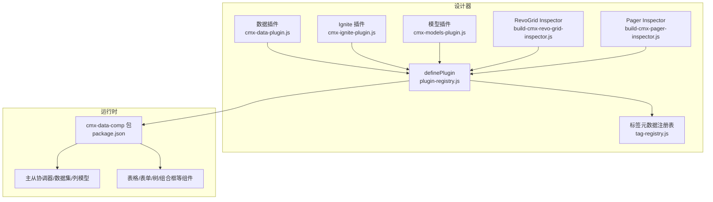
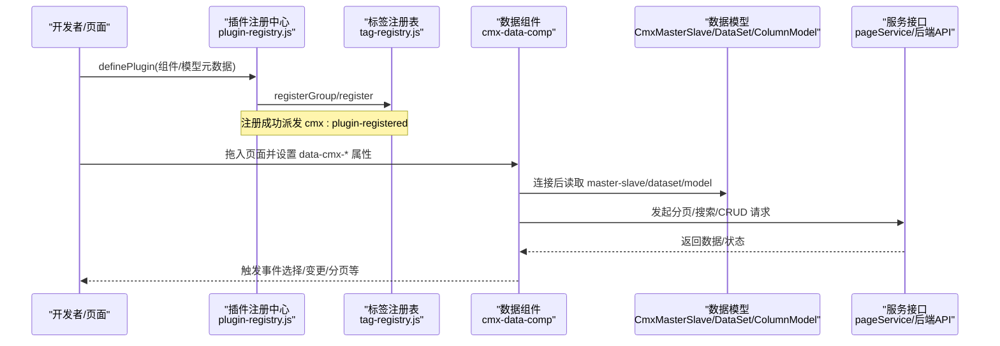
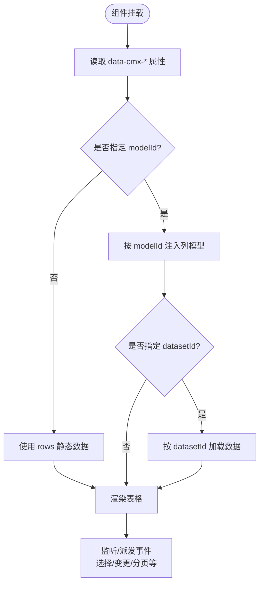
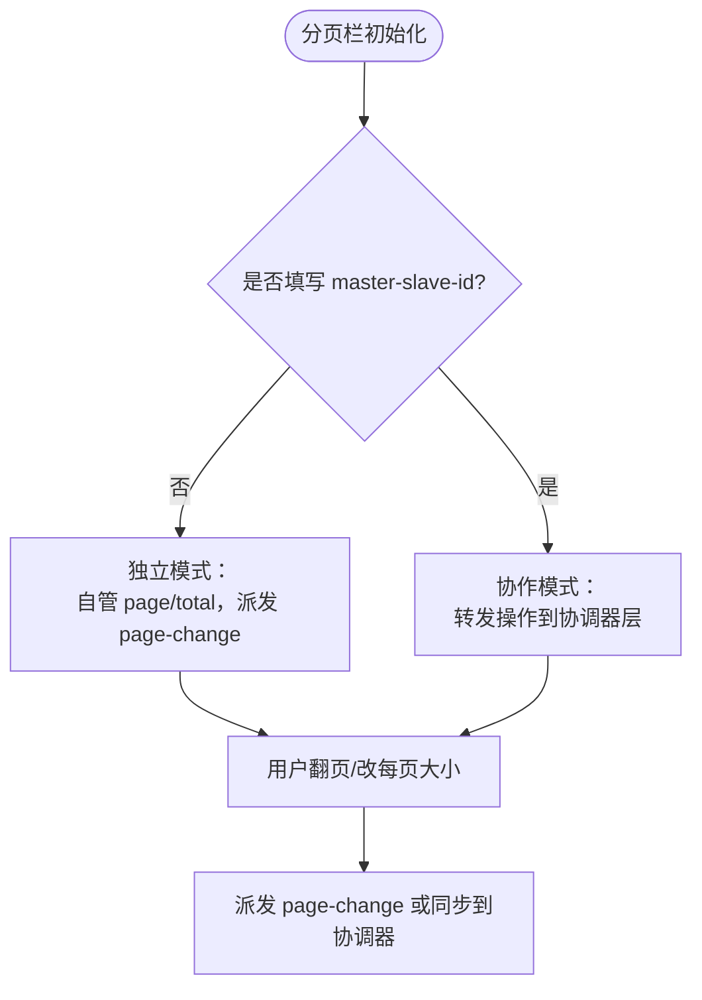
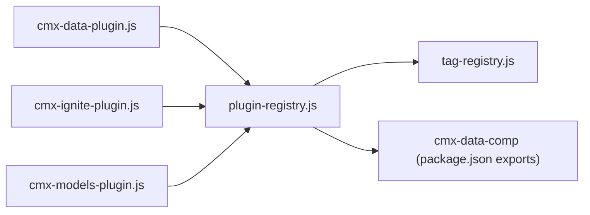

# 数据插件开发

<cite>
**本文引用的文件**
- [cmx-data-plugin.js](file://CMXHTMLDesigner/src/plugins/cmx-data-plugin.js)
- [cmx-ignite-plugin.js](file://CMXHTMLDesigner/src/plugins/cmx-ignite-plugin.js)
- [cmx-models-plugin.js](file://CMXHTMLDesigner/src/plugins/cmx-models-plugin.js)
- [plugin-registry.js](file://CMXHTMLDesigner/src/lib/plugin-registry.js)
- [tag-registry.js](file://CMXHTMLDesigner/src/metadata/tag-registry.js)
- [build-cmx-revo-grid-inspector.js](file://CMXHTMLDesigner/src/plugins/cmx-inspector/build-cmx-revo-grid-inspector.js)
- [build-cmx-pager-inspector.js](file://CMXHTMLDesigner/src/plugins/cmx-inspector/build-cmx-pager-inspector.js)
- [component-library-adapter.js](file://CMXHTMLDesigner/src/lib/component-library-adapter.js)
- [package.json（cmx-data-comp）](file://packages/cmx-data-comp/package.json)
- [page-cache.js](file://CMXPortalManager/src/lib/page-cache.js)
</cite>

## 目录
1. [简介](#简介)
2. [项目结构](#项目结构)
3. [核心组件](#核心组件)
4. [架构总览](#架构总览)
5. [详细组件分析](#详细组件分析)
6. [依赖关系分析](#依赖关系分析)
7. [性能考虑](#性能考虑)
8. [故障排查指南](#故障排查指南)
9. [结论](#结论)
10. [附录](#附录)

## 简介
本文件面向企业级前端应用的数据插件开发，聚焦 CMX HTML Designer 与 cmx-data-comp 生态中的“数据源插件”模式。内容涵盖：
- 数据模型注册、数据集绑定与服务接口集成
- 数据插件生命周期与数据流管理
- 企业级数据组件示例：Ignite UI 组件的数据绑定、分页查询、CRUD 操作
- 数据缓存、错误处理与性能优化策略

目标读者包括页面设计器使用者、数据组件开发者与企业级应用集成工程师。

## 项目结构
该仓库围绕“设计器插件 + 运行时数据组件”的双层架构组织：
- 设计器侧：通过 definePlugin 将可视化组件与不可视数据模型注册到调色板，并支持自定义属性面板（Inspector）。
- 运行时代码：cmx-data-comp 提供 CmxDataSet、CmxMasterSlave、CmxColumnModel 等核心数据能力，以及表格/表单/树形/组合框等 Web Components。

图表来源
- [plugin-registry.js:60-89](file://CMXHTMLDesigner/src/lib/plugin-registry.js#L60-L89)
- [tag-registry.js:15-55](file://CMXHTMLDesigner/src/metadata/tag-registry.js#L15-L55)
- [cmx-data-plugin.js:46-746](file://CMXHTMLDesigner/src/plugins/cmx-data-plugin.js#L46-L746)
- [cmx-ignite-plugin.js:18-124](file://CMXHTMLDesigner/src/plugins/cmx-ignite-plugin.js#L18-L124)
- [cmx-models-plugin.js:39-117](file://CMXHTMLDesigner/src/plugins/cmx-models-plugin.js#L39-L117)
- [build-cmx-revo-grid-inspector.js:20-101](file://CMXHTMLDesigner/src/plugins/cmx-inspector/build-cmx-revo-grid-inspector.js#L20-L101)
- [build-cmx-pager-inspector.js:76-179](file://CMXHTMLDesigner/src/plugins/cmx-inspector/build-cmx-pager-inspector.js#L76-L179)
- [package.json（cmx-data-comp）:14-74](file://packages/cmx-data-comp/package.json#L14-L74)

章节来源
- [plugin-registry.js:60-89](file://CMXHTMLDesigner/src/lib/plugin-registry.js#L60-L89)
- [tag-registry.js:15-55](file://CMXHTMLDesigner/src/metadata/tag-registry.js#L15-L55)
- [cmx-data-plugin.js:46-746](file://CMXHTMLDesigner/src/plugins/cmx-data-plugin.js#L46-L746)
- [cmx-ignite-plugin.js:18-124](file://CMXHTMLDesigner/src/plugins/cmx-ignite-plugin.js#L18-L124)
- [cmx-models-plugin.js:39-118](file://CMXHTMLDesigner/src/plugins/cmx-models-plugin.js#L39-L118)
- [build-cmx-revo-grid-inspector.js:20-101](file://CMXHTMLDesigner/src/plugins/cmx-inspector/build-cmx-revo-grid-inspector.js#L20-L101)
- [build-cmx-pager-inspector.js:76-179](file://CMXHTMLDesigner/src/plugins/cmx-inspector/build-cmx-pager-inspector.js#L76-L179)
- [package.json（cmx-data-comp）:14-74](file://packages/cmx-data-comp/package.json#L14-L74)

## 核心组件
- 数据组件插件（cmx-data-plugin.js）：注册 RevoGrid、Tabulator、UI5 Form、Web Treeview、Split Pane、View Tabs、Embed Page、Combo Box、Dict Select、输入控件、分页栏及展示类组件；声明 data-cmx-* 属性与事件，供运行时解析与绑定。
- Ignite 插件（cmx-ignite-plugin.js）：注册 Ignite 封装组件（combo/list/spreadsheet/spreadjs），用于报表与列表场景。
- 模型插件（cmx-models-plugin.js）：注册不可视数据模型（CmxDataSet、CmxMasterSlave、CmxColumnModel、字典/单据元数据、弹性组合），并在设计时暴露给调试控制台使用。
- 插件注册中心（plugin-registry.js）：统一注册组、组件元数据与自定义 Inspector，派发 cmx:plugin-registered 事件驱动 UI 刷新。
- 标签元数据注册表（tag-registry.js）：维护标签元数据、样式组、事件预设，并提供 ensureTagRegistryLoaded 异步加载。

章节来源
- [cmx-data-plugin.js:46-746](file://CMXHTMLDesigner/src/plugins/cmx-data-plugin.js#L46-L746)
- [cmx-ignite-plugin.js:18-124](file://CMXHTMLDesigner/src/plugins/cmx-ignite-plugin.js#L18-L124)
- [cmx-models-plugin.js:39-118](file://CMXHTMLDesigner/src/plugins/cmx-models-plugin.js#L39-L118)
- [plugin-registry.js:60-89](file://CMXHTMLDesigner/src/lib/plugin-registry.js#L60-L89)
- [tag-registry.js:15-55](file://CMXHTMLDesigner/src/metadata/tag-registry.js#L15-L55)

## 架构总览
数据插件的“设计期—运行期”协作流程如下：
- 设计期：插件通过 definePlugin 注册组件与模型，Inspector 将配置写入 data-cmx-* 属性。
- 运行期：组件 connectedCallback 读取属性，结合 CmxMasterSlave/CmxDataSet/CmxColumnModel 完成数据绑定、分页、编辑与事件回传。

图表来源
- [plugin-registry.js:60-89](file://CMXHTMLDesigner/src/lib/plugin-registry.js#L60-L89)
- [tag-registry.js:123-145](file://CMXHTMLDesigner/src/metadata/tag-registry.js#L123-L145)
- [cmx-data-plugin.js:46-746](file://CMXHTMLDesigner/src/plugins/cmx-data-plugin.js#L46-L746)
- [cmx-models-plugin.js:39-118](file://CMXHTMLDesigner/src/plugins/cmx-models-plugin.js#L39-L118)
- [package.json（cmx-data-comp）:14-74](file://packages/cmx-data-comp/package.json#L14-L74)

## 详细组件分析

### 数据网格与表单：RevoGrid / Tabulator / UI5 Form
- 设计期：在 cmx-data-plugin.js 中声明 tag、group、attrs、extraEvents、defaults 等元信息；RevoGrid 与 Tabulator 支持 datasetId、modelId、masterSlaveId 等关键绑定属性。
- 运行期：组件读取 data-cmx-* 属性，按 modelId 注入列模型，按 datasetId 或 rows 初始化数据；通过 masterSlaveId 进入主从协作模式，实现联动刷新。
- 编辑器：RevoGrid 的 Inspector（build-cmx-revo-grid-inspector.js）提供 model 选择、datasetId 选择与 JSON 编辑器（options/rows）。

图表来源
- [cmx-data-plugin.js:49-157](file://CMXHTMLDesigner/src/plugins/cmx-data-plugin.js#L49-L157)
- [build-cmx-revo-grid-inspector.js:20-101](file://CMXHTMLDesigner/src/plugins/cmx-inspector/build-cmx-revo-grid-inspector.js#L20-L101)

章节来源
- [cmx-data-plugin.js:49-157](file://CMXHTMLDesigner/src/plugins/cmx-data-plugin.js#L49-L157)
- [build-cmx-revo-grid-inspector.js:20-101](file://CMXHTMLDesigner/src/plugins/cmx-inspector/build-cmx-revo-grid-inspector.js#L20-L101)

### 分页栏：独立模式与协作模式
- 设计期：cmx-pager 在 cmx-data-plugin.js 中声明 attrs（master-slave-id、layer、page-size、page-sizes、compact、total）与事件 page-change。
- 运行期：未填写协调器实例时为独立模式，自管页码/总数；填写后进入协作模式，操作转发至 CmxMasterSlave 对应层。
- Inspector：build-cmx-pager-inspector.js 动态切换字段启用态，提示当前模式与行为差异。

图表来源
- [cmx-data-plugin.js:561-588](file://CMXHTMLDesigner/src/plugins/cmx-data-plugin.js#L561-L588)
- [build-cmx-pager-inspector.js:76-179](file://CMXHTMLDesigner/src/plugins/cmx-inspector/build-cmx-pager-inspector.js#L76-L179)

章节来源
- [cmx-data-plugin.js:561-588](file://CMXHTMLDesigner/src/plugins/cmx-data-plugin.js#L561-L588)
- [build-cmx-pager-inspector.js:76-179](file://CMXHTMLDesigner/src/plugins/cmx-inspector/build-cmx-pager-inspector.js#L76-L179)

### 组合框与字典选择：远端搜索与 MRU
- 组合框（cmx-combo-box）：支持 list/tree/grid 三种下拉模式，可绑定 CmxDataSet + CmxColumnModel；远端通过 pageService 异步搜索，支持分页、扩展按钮与多事件。
- 字典选择（cmx-dict-select）：输入即搜，MRU（本地+后端个性化），帮助弹窗支持分类树/分组树/纯字典 grid，分级字典走 treegrid。
- 两者均通过 data-cmx-* 属性配置，运行时由组件解析并调用数据源。

章节来源
- [cmx-data-plugin.js:352-439](file://CMXHTMLDesigner/src/plugins/cmx-data-plugin.js#L352-L439)

### Ignite 组件：数据绑定与报表模板
- cmx-ignite-combo：绑定 CmxDataSet 当前行字段，可作为表单/网格的字段编辑器（editMode=ignite-combo）。
- cmx-ignite-list：默认 igc-list，card 布局可通过 style-id 注入页面 template 皮肤。
- cmx-spreadsheet / cmx-spreadjs-sheet：Excel 式电子表格，用 data-cmx-report（{grid, cells, meta}）驱动报表模板，API/事件对齐。

章节来源
- [cmx-ignite-plugin.js:22-122](file://CMXHTMLDesigner/src/plugins/cmx-ignite-plugin.js#L22-L122)

### 数据模型注册与运行时桥接
- 模型插件（cmx-models-plugin.js）：注册 CmxDataSet、CmxMasterSlave、CmxColumnModel、CmxDCTMeta、CmxDOCMeta、FlexibleCombination 等不可视模型，并在 globalThis 暴露以便调试。
- 运行时桥接：init-page-models 根据 data-cmx-model-id 注入列模型；createPageServiceDataSource 提供 pageService 数据源适配。

章节来源
- [cmx-models-plugin.js:21-37](file://CMXHTMLDesigner/src/plugins/cmx-models-plugin.js#L21-L37)
- [cmx-models-plugin.js:39-118](file://CMXHTMLDesigner/src/plugins/cmx-models-plugin.js#L39-L118)
- [package.json（cmx-data-comp）:48-53](file://packages/cmx-data-comp/package.json#L48-L53)

## 依赖关系分析
- 插件注册中心与标签注册表解耦：definePlugin 仅负责聚合与派发事件，具体元数据由 tag-registry 维护。
- 组件与模型分离：cmx-data-plugin.js 只声明组件元数据；数据模型由 cmx-models-plugin.js 单独注册，避免耦合。
- 运行时依赖：cmx-data-comp 作为核心包，导出组件与 lib，被设计器插件按需 import。

图表来源
- [plugin-registry.js:60-89](file://CMXHTMLDesigner/src/lib/plugin-registry.js#L60-L89)
- [tag-registry.js:15-55](file://CMXHTMLDesigner/src/metadata/tag-registry.js#L15-L55)
- [cmx-data-plugin.js:46-746](file://CMXHTMLDesigner/src/plugins/cmx-data-plugin.js#L46-L746)
- [cmx-ignite-plugin.js:18-124](file://CMXHTMLDesigner/src/plugins/cmx-ignite-plugin.js#L18-L124)
- [cmx-models-plugin.js:39-118](file://CMXHTMLDesigner/src/plugins/cmx-models-plugin.js#L39-L118)
- [package.json（cmx-data-comp）:14-74](file://packages/cmx-data-comp/package.json#L14-L74)

章节来源
- [plugin-registry.js:60-89](file://CMXHTMLDesigner/src/lib/plugin-registry.js#L60-L89)
- [tag-registry.js:15-55](file://CMXHTMLDesigner/src/metadata/tag-registry.js#L15-L55)
- [cmx-data-plugin.js:46-746](file://CMXHTMLDesigner/src/plugins/cmx-data-plugin.js#L46-L746)
- [cmx-ignite-plugin.js:18-124](file://CMXHTMLDesigner/src/plugins/cmx-ignite-plugin.js#L18-L124)
- [cmx-models-plugin.js:39-118](file://CMXHTMLDesigner/src/plugins/cmx-models-plugin.js#L39-L118)
- [package.json（cmx-data-comp）:14-74](file://packages/cmx-data-comp/package.json#L14-L74)

## 性能考虑
- 虚拟滚动与大列表：RevoGrid 内置虚拟滚动，适合大数据量表格；Tabulator 支持分页与局部更新。
- 分页与懒加载：优先使用服务端分页（pageService），减少首屏数据体积；组合框 grid 模式开启 paginated。
- 主从协调：通过 CmxMasterSlave 的 layer 机制，避免全表重绘，仅刷新当前层。
- 页面缓存：page-cache 对页面资产进行 LRU 与配额管理，失败时自动淘汰旧条目并重试，提升二次访问速度。
- 主题/语言切换：ComponentLibraryAdapter 抽象主题与语言切换，降低运行时开销。

章节来源
- [package.json（cmx-data-comp）:14-74](file://packages/cmx-data-comp/package.json#L14-L74)
- [page-cache.js:145-181](file://CMXPortalManager/src/lib/page-cache.js#L145-L181)
- [component-library-adapter.js:17-39](file://CMXHTMLDesigner/src/lib/component-library-adapter.js#L17-L39)

## 故障排查指南
- 插件重复注册：definePlugin 内部检测重复 id 并支持 HMR 重注册，若出现异常请检查插件 id 唯一性。
- 组件属性未生效：确认 data-cmx-* 属性名称与类型正确；RevoGrid 的 options/rows 需为合法 JSON。
- 分页不联动：检查是否填写 master-slave-id；协作模式下 total 由协调器覆盖，独立模式下需自行回填 pager.total。
- 字典/远端搜索失败：网络异常或信封 code≠0 时不写缓存，下次重试；确保 host.fetch 返回正确格式。
- 页面缓存写入失败：QuotaExceededError 会触发淘汰旧条目后重试；关注控制台警告定位问题。

章节来源
- [plugin-registry.js:60-89](file://CMXHTMLDesigner/src/lib/plugin-registry.js#L60-L89)
- [build-cmx-revo-grid-inspector.js:20-101](file://CMXHTMLDesigner/src/plugins/cmx-inspector/build-cmx-revo-grid-inspector.js#L20-L101)
- [build-cmx-pager-inspector.js:76-179](file://CMXHTMLDesigner/src/plugins/cmx-inspector/build-cmx-pager-inspector.js#L76-L179)
- [page-cache.js:145-181](file://CMXPortalManager/src/lib/page-cache.js#L145-L181)

## 结论
本方案以“插件化注册 + 运行时数据组件”为核心，实现了数据模型、数据集与服务接口的松耦合集成。通过 data-cmx-* 属性与 CmxMasterSlave 协调器，页面可在设计期配置、运行期绑定的方式快速构建企业级数据界面。配合分页、缓存与错误处理策略，满足大规模数据与复杂交互场景的性能与稳定性要求。

## 附录
- 最佳实践建议
  - 始终通过 CmxMasterSlave 管理主从关系与分页层，避免多处状态不一致。
  - 大列表优先使用服务端分页与虚拟滚动；组合框 grid 模式开启分页。
  - 字典与远端数据采用缓存与重试策略，失败时优雅降级。
  - 使用 Inspector 规范配置，减少手写 JSON 出错概率。
- 参考路径
  - 数据组件包导出清单：[package.json（cmx-data-comp）:14-74](file://packages/cmx-data-comp/package.json#L14-L74)
  - 插件注册与事件派发：[plugin-registry.js:60-89](file://CMXHTMLDesigner/src/lib/plugin-registry.js#L60-L89)
  - 标签元数据加载：[tag-registry.js:123-145](file://CMXHTMLDesigner/src/metadata/tag-registry.js#L123-L145)
  - 分页栏协作模式：[build-cmx-pager-inspector.js:76-179](file://CMXHTMLDesigner/src/plugins/cmx-inspector/build-cmx-pager-inspector.js#L76-L179)
  - RevoGrid 列模型注入：[build-cmx-revo-grid-inspector.js:20-101](file://CMXHTMLDesigner/src/plugins/cmx-inspector/build-cmx-revo-grid-inspector.js#L20-L101)