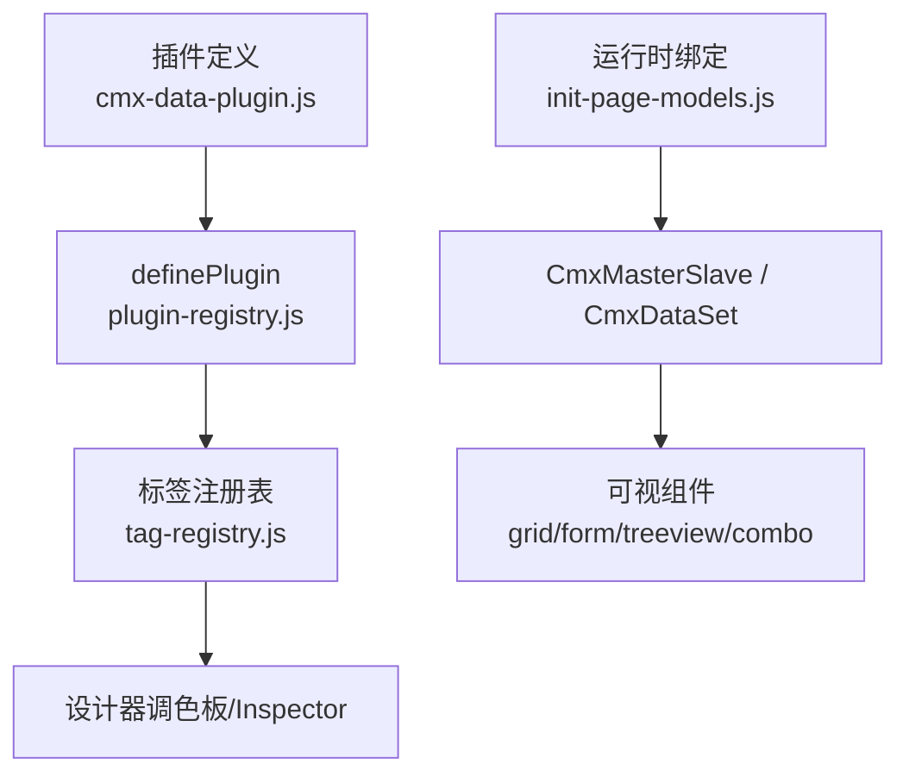
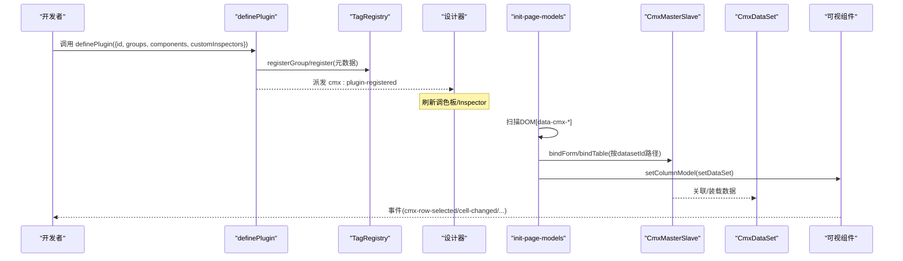
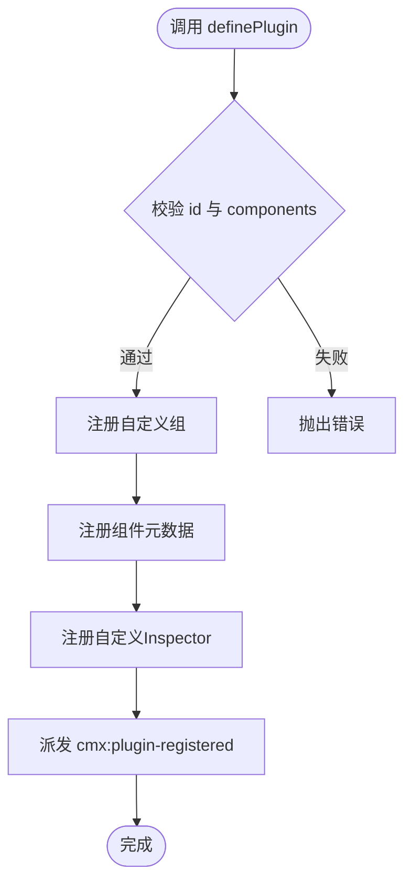
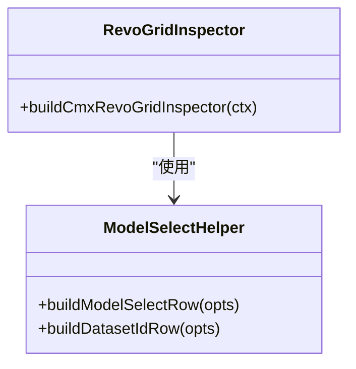
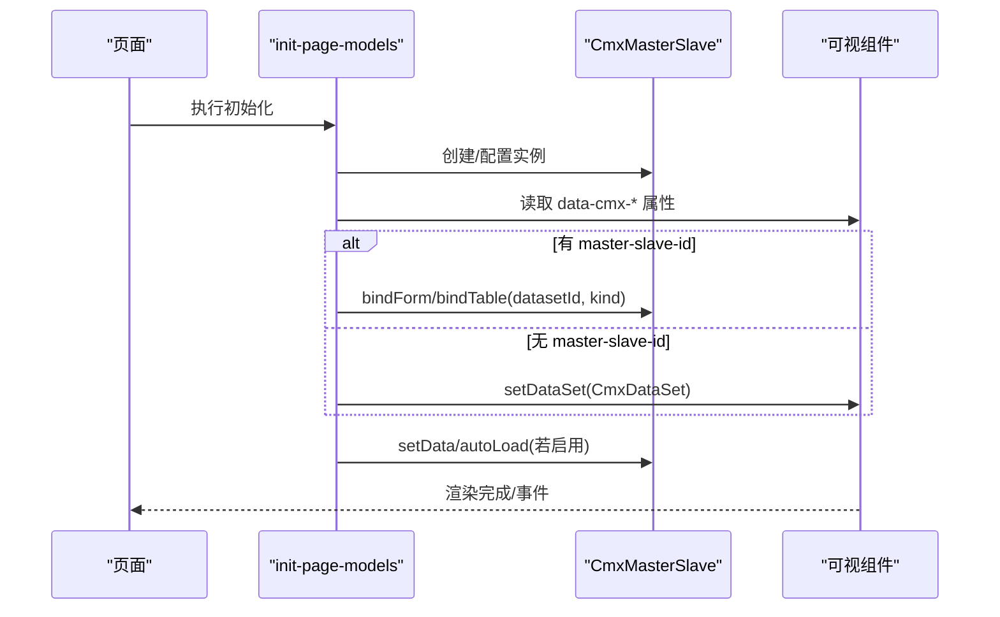
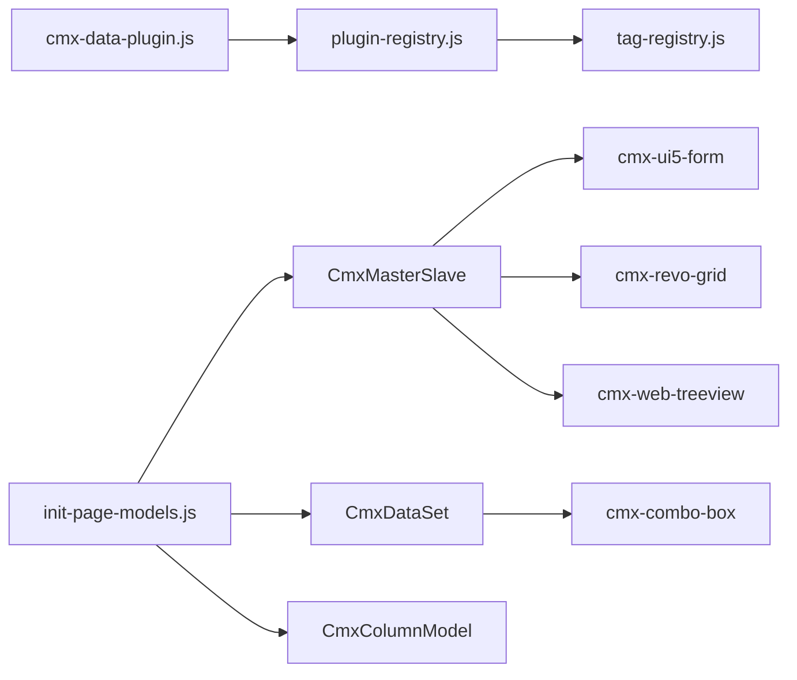

# 数据插件开发指南

<cite>
**本文引用的文件**
- [plugin-registry.js](file://CMXHTMLDesigner/src/lib/plugin-registry.js)
- [tag-registry.js](file://CMXHTMLDesigner/src/metadata/tag-registry.js)
- [cmx-data-plugin.js](file://CMXHTMLDesigner/src/plugins/cmx-data-plugin.js)
- [build-cmx-revo-grid-inspector.js](file://CMXHTMLDesigner/src/plugins/cmx-inspector/build-cmx-revo-grid-inspector.js)
- [model-select-helper.js](file://CMXHTMLDesigner/src/plugins/cmx-inspector/model-select-helper.js)
- [init-page-models.js](file://packages/cmx-data-comp/src/lib/init-page-models.js)
- [cmx-master-slave-config.js](file://packages/cmx-data-comp/src/components/cmx-master-slave-config.js)
- [cmx-data-set.js](file://packages/cmx-data-comp/src/lib/cmx-data-set.js)
- [cmx-column-model.js](file://packages/cmx-data-comp/src/lib/cmx-column-model.js)
- [cmx-combo-box.js](file://packages/cmx-data-comp/src/components/cmx-combo-box.js)
- [cmx-web-treeview.js](file://packages/cmx-data-comp/src/components/cmx-web-treeview.js)
- [cmx-ui5-form.js](file://packages/cmx-data-comp/src/components/cmx-ui5-form.js)
- [model-master-slave.md](file://.agents/skills/html-page-generator/references/model-master-slave.md)
</cite>

## 目录
1. [简介](#简介)
2. [项目结构](#项目结构)
3. [核心组件](#核心组件)
4. [架构总览](#架构总览)
5. [详细组件分析](#详细组件分析)
6. [依赖关系分析](#依赖关系分析)
7. [性能与可维护性建议](#性能与可维护性建议)
8. [故障排查指南](#故障排查指南)
9. [结论](#结论)
10. [附录：完整开发示例与最佳实践](#附录完整开发示例与最佳实践)

## 简介
本指南面向希望在 CMX 设计器中扩展“数据类组件”的开发者，系统讲解数据插件的注册机制、生命周期、属性配置、事件绑定以及数据绑定模式。你将学会如何通过 definePlugin API 注册自定义数据组件，配置组件元数据（标签、描述、属性、默认值等），并实现与 CmxMasterSlave、CmxDataSet 的数据绑定；同时提供调试技巧与最佳实践。

## 项目结构
CMX 的设计器通过“插件 + 元数据注册表”的方式将可视化组件暴露到调色板，并在运行时由页面初始化流程完成数据绑定。关键路径如下：
- 插件定义与注册：CMXHTMLDesigner/src/plugins/cmx-data-plugin.js
- 插件注册入口：CMXHTMLDesigner/src/lib/plugin-registry.js
- 标签元数据注册表：CMXHTMLDesigner/src/metadata/tag-registry.js
- 运行时数据绑定：packages/cmx-data-comp/src/lib/init-page-models.js
- 主从协调器与数据集：packages/cmx-data-comp/src/lib/cmx-data-set.js、packages/cmx-data-comp/src/components/cmx-master-slave-config.js
- 列模型：packages/cmx-data-comp/src/lib/cmx-column-model.js
- 典型数据组件：cmx-combo-box、cmx-web-treeview、cmx-ui5-form 等

**图表来源**
- [cmx-data-plugin.js:46-746](file://CMXHTMLDesigner/src/plugins/cmx-data-plugin.js#L46-L746)
- [plugin-registry.js:60-89](file://CMXHTMLDesigner/src/lib/plugin-registry.js#L60-L89)
- [tag-registry.js:43-109](file://CMXHTMLDesigner/src/metadata/tag-registry.js#L43-L109)
- [init-page-models.js:970-995](file://packages/cmx-data-comp/src/lib/init-page-models.js#L970-L995)

**章节来源**
- [cmx-data-plugin.js:46-746](file://CMXHTMLDesigner/src/plugins/cmx-data-plugin.js#L46-L746)
- [plugin-registry.js:60-89](file://CMXHTMLDesigner/src/lib/plugin-registry.js#L60-L89)
- [tag-registry.js:43-109](file://CMXHTMLDesigner/src/metadata/tag-registry.js#L43-L109)
- [init-page-models.js:970-995](file://packages/cmx-data-comp/src/lib/init-page-models.js#L970-L995)

## 核心组件
- 插件注册器 definePlugin：负责校验参数、注册组与组件元数据、注册自定义 Inspector 渲染函数，并派发 cmx:plugin-registered 事件以刷新设计器调色板。
- 标签注册表 TagRegistry：集中管理所有标签的元数据（attrs、events、styleGroups、defaults），支持按 tag 覆盖与分组查询。
- 数据组件插件 cmx-data-plugin：批量注册数据类组件（网格、表单、树、组合框、分页器等）及其属性、事件、默认样式与自定义 Inspector。
- 运行时绑定 init-page-models：扫描 DOM 上的 data-cmx-* 属性，完成 CmxMasterSlave/CmxDataSet 与可视组件的绑定，并触发初始数据装载。

**章节来源**
- [plugin-registry.js:60-89](file://CMXHTMLDesigner/src/lib/plugin-registry.js#L60-L89)
- [tag-registry.js:43-109](file://CMXHTMLDesigner/src/metadata/tag-registry.js#L43-L109)
- [cmx-data-plugin.js:46-746](file://CMXHTMLDesigner/src/plugins/cmx-data-plugin.js#L46-L746)
- [init-page-models.js:970-995](file://packages/cmx-data-comp/src/lib/init-page-models.js#L970-L995)

## 架构总览
数据插件的生命周期分为“设计期”和“运行期”两个阶段：
- 设计期：插件调用 definePlugin 注册组件元数据与自定义 Inspector；TagRegistry 聚合元数据；设计器左侧面板监听 cmx:plugin-registered 事件刷新调色板。
- 运行期：页面初始化时，init-page-models 扫描 DOM，根据 data-cmx-master-slave-id、data-cmx-dataset-id、data-cmx-model-id 等属性，调用 CmxMasterSlave.bindForm/bindTable 或组件 setDataSet/setColumnModel，完成数据绑定与视图渲染。

**图表来源**
- [plugin-registry.js:60-89](file://CMXHTMLDesigner/src/lib/plugin-registry.js#L60-L89)
- [tag-registry.js:43-109](file://CMXHTMLDesigner/src/metadata/tag-registry.js#L43-L109)
- [init-page-models.js:970-995](file://packages/cmx-data-comp/src/lib/init-page-models.js#L970-L995)

## 详细组件分析

### 插件注册机制与生命周期
- definePlugin 校验 id 与 components，支持 HMR 重注册（按 tag 覆盖）。
- 注册自定义组（groups）与组件元数据（components），并将 customInspectors 映射到 tag。
- 完成后派发 window 事件 cmx:plugin-registered，供设计器刷新。

**图表来源**
- [plugin-registry.js:60-89](file://CMXHTMLDesigner/src/lib/plugin-registry.js#L60-L89)

**章节来源**
- [plugin-registry.js:60-89](file://CMXHTMLDesigner/src/lib/plugin-registry.js#L60-L89)

### 组件元数据与属性配置
- 每个组件在 components 数组中声明 tag、group、label、description、canNest、isVoid、attrs、extraEvents、defaults、styleGroups 等。
- attrs 中的 name 即为序列化到 DOM 的属性名（如 data-cmx-master-slave-id、data-cmx-dataset-id、data-cmx-model-id）。
- defaults.attributes 为拖入画布时的默认属性；styleGroups 控制样式面板可用范围。
- extraEvents 为设计器事件面板提供的额外事件列表。

示例参考（不展示代码内容）：
- 网格组件：cmx-revo-grid、cmx-tabulator
- 表单组件：cmx-ui5-form
- 树形组件：cmx-web-treeview
- 组合框：cmx-combo-box
- 分页器：cmx-pager
- 展示组件：cmx-panel、cmx-toolbar、cmx-status-tag、cmx-empty-state、cmx-desc-list、cmx-filter-bar、cmx-kpi-card

**章节来源**
- [cmx-data-plugin.js:46-746](file://CMXHTMLDesigner/src/plugins/cmx-data-plugin.js#L46-L746)
- [tag-registry.js:43-109](file://CMXHTMLDesigner/src/metadata/tag-registry.js#L43-L109)

### 自定义 Inspector（属性面板）
- 通过 customInspectors 为特定 tag 提供专属属性编辑界面。
- 构建函数接收 ctx = { node, meta, mount, pageData, onChange }，将属性写入节点属性并调用 onChange 标记脏更新。
- 常用辅助：
  - buildModelSelectRow：选择 CmxMasterSlave/CmxColumnModel 实例
  - buildDatasetIdRow：根据 msId 动态生成 datasetId 下拉选项（来自 schema 路径或 CmxDataSet 列表）

**图表来源**
- [build-cmx-revo-grid-inspector.js:1-102](file://CMXHTMLDesigner/src/plugins/cmx-inspector/build-cmx-revo-grid-inspector.js#L1-L102)
- [model-select-helper.js:87-123](file://CMXHTMLDesigner/src/plugins/cmx-inspector/model-select-helper.js#L87-L123)

**章节来源**
- [build-cmx-revo-grid-inspector.js:1-102](file://CMXHTMLDesigner/src/plugins/cmx-inspector/build-cmx-revo-grid-inspector.js#L1-L102)
- [model-select-helper.js:87-123](file://CMXHTMLDesigner/src/plugins/cmx-inspector/model-select-helper.js#L87-L123)

### 数据绑定模式与生命周期
- 声明式绑定（推荐）：在组件上设置 data-cmx-master-slave-id、data-cmx-dataset-id、data-cmx-kind、data-cmx-model-id。
- 命令式绑定：通过 CmxMasterSlave.bindForm/bindTable 手动绑定，适用于动态场景。
- L0 纯数据集模式：仅设置 data-cmx-dataset-id（无 master-slave-id），直接调用组件 setDataSet(ds)。
- 初始化顺序：
  1) 创建模型实例（MS、ColumnModel、FlexibleCombination）
  2) 扫描 DOM 绑定可视组件
  3) 装载初始数据（cmxInitialData 优先，否则 autoLoad）

**图表来源**
- [init-page-models.js:970-995](file://packages/cmx-data-comp/src/lib/init-page-models.js#L970-L995)
- [model-master-slave.md:180-230](file://.agents/skills/html-page-generator/references/model-master-slave.md#L180-L230)

**章节来源**
- [init-page-models.js:970-995](file://packages/cmx-data-comp/src/lib/init-page-models.js#L970-L995)
- [model-master-slave.md:180-230](file://.agents/skills/html-page-generator/references/model-master-slave.md#L180-L230)

### 与 CmxMasterSlave 的绑定
- 通过 data-cmx-master-slave-id 指定 MS 实例，data-cmx-dataset-id 指定 schema 路径，data-cmx-kind 决定 bindForm(single) 或 bindTable(list)。
- 也可通过 cmx-master-slave-config 元素声明式自启动：解析 JSON 配置，创建 MS，按 selector 自动绑定，最后注入 initialData 并派发 cmx-ms-ready。

**章节来源**
- [init-page-models.js:970-995](file://packages/cmx-data-comp/src/lib/init-page-models.js#L970-L995)
- [cmx-master-slave-config.js:1-126](file://packages/cmx-data-comp/src/components/cmx-master-slave-config.js#L1-L126)

### 与 CmxDataSet 的绑定
- 当组件仅有 data-cmx-dataset-id（无 master-slave-id）时，init-page-models 会直接调用组件 setDataSet(ds)，进入 L0 纯数据集模式。
- CmxDataSet 提供 addRow/setRows/removeRow/cursor 操作，并通过 row-changed/ds-row-added/ds-row-removed/cursor-changed 等事件驱动视图更新。
- 组件内部需正确订阅这些事件并在 disconnectedCallback 中解绑，避免内存泄漏。

**章节来源**
- [init-page-models.js:970-995](file://packages/cmx-data-comp/src/lib/init-page-models.js#L970-L995)
- [cmx-data-set.js:1-200](file://packages/cmx-data-comp/src/lib/cmx-data-set.js#L1-L200)
- [cmx-web-treeview.js:652-683](file://packages/cmx-data-comp/src/components/cmx-web-treeview.js#L652-L683)
- [cmx-ui5-form.js:162-197](file://packages/cmx-data-comp/src/components/cmx-ui5-form.js#L162-L197)

### 与 CmxColumnModel 的绑定
- 通过 data-cmx-model-id 指定 ColumnModel 实例，init-page-models 会调用组件 setColumnModel(model)。
- 组件应监听 columns-changed 事件以响应列定义变化，并在 disconnectedCallback 中移除监听。

**章节来源**
- [cmx-column-model.js:1-30](file://packages/cmx-data-comp/src/lib/cmx-column-model.js#L1-L30)
- [cmx-combo-box.js:151-185](file://packages/cmx-data-comp/src/components/cmx-combo-box.js#L151-L185)

### 事件绑定与转发
- 数据组件通常对外派发统一前缀的事件，如 cmx-row-selected、cmx-cell-changed、cmx-combo-value-change、cmx-dict-change 等。
- 设计器通过 extraEvents 将这些事件暴露给脚本编辑器；运行时由组件内部转发。

**章节来源**
- [cmx-data-plugin.js:46-746](file://CMXHTMLDesigner/src/plugins/cmx-data-plugin.js#L46-L746)

## 依赖关系分析
- 插件层：cmx-data-plugin.js 依赖 plugin-registry.js 与 tag-registry.js，用于注册与刷新。
- 运行时层：init-page-models.js 依赖 CmxMasterSlave、CmxDataSet、CmxColumnModel 及具体可视组件 API。
- 组件层：各数据组件依赖 CmxDataSet/CmxColumnModel 的事件体系，并在生命周期钩子中正确订阅/释放。

**图表来源**
- [cmx-data-plugin.js:46-746](file://CMXHTMLDesigner/src/plugins/cmx-data-plugin.js#L46-L746)
- [plugin-registry.js:60-89](file://CMXHTMLDesigner/src/lib/plugin-registry.js#L60-L89)
- [init-page-models.js:970-995](file://packages/cmx-data-comp/src/lib/init-page-models.js#L970-L995)

**章节来源**
- [cmx-data-plugin.js:46-746](file://CMXHTMLDesigner/src/plugins/cmx-data-plugin.js#L46-L746)
- [plugin-registry.js:60-89](file://CMXHTMLDesigner/src/lib/plugin-registry.js#L60-L89)
- [init-page-models.js:970-995](file://packages/cmx-data-comp/src/lib/init-page-models.js#L970-L995)

## 性能与可维护性建议
- 合理拆分插件：将不同业务域的数据组件拆分为独立插件，便于按需加载与维护。
- 最小化属性：attrs 仅保留必要字段，复杂配置通过 JSON 字符串（如 options、rows）传递，保持 DOM 简洁。
- 事件去抖：对高频事件（如 cell-changed）进行节流/去抖，减少重渲染开销。
- 内存管理：在 disconnectedCallback 中务必移除所有外部监听（CmxDataSet、CmxColumnModel、UI5 语言切换等），避免泄漏。
- 懒加载：大数据集采用分页/虚拟滚动，结合 CmxDataSet 的分页 total 与视图 fillView 能力。
- 可测试性：为组件编写单元测试，覆盖 setDataSet/setColumnModel/dispatchEvent 等关键路径。

[本节为通用指导，无需具体文件引用]

## 故障排查指南
- 组件未显示数据：检查 data-cmx-master-slave-id 与 data-cmx-dataset-id 是否匹配 MS 实例与 schema 路径；确认 data-cmx-kind 是否正确（single/list）。
- 列未生效：确认 data-cmx-model-id 指向有效的 CmxColumnModel 实例；检查组件是否实现了 setColumnModel 并监听 columns-changed。
- 事件未触发：确认组件已对外派发对应事件（如 cmx-row-selected、cmx-cell-changed）；在设计器中通过 extraEvents 暴露事件。
- 内存泄漏：检查 disconnectedCallback 是否移除了所有监听；确保 CmxDataSet 与 CmxColumnModel 的监听被正确清理。
- 重复绑定：避免多次调用 bindForm/bindTable 或 setDataSet；可在组件内部做幂等处理。

**章节来源**
- [init-page-models.js:970-995](file://packages/cmx-data-comp/src/lib/init-page-models.js#L970-L995)
- [cmx-ui5-form.js:162-197](file://packages/cmx-data-comp/src/components/cmx-ui5-form.js#L162-L197)
- [cmx-web-treeview.js:652-683](file://packages/cmx-data-comp/src/components/cmx-web-treeview.js#L652-L683)

## 结论
通过 definePlugin 与 TagRegistry，CMX 设计器提供了强大的数据组件扩展能力。配合 init-page-models 的声明式绑定协议，开发者可以以极少的配置实现与 CmxMasterSlave/CmxDataSet/CmxColumnModel 的深度集成。遵循本文的最佳实践与排查方法，能够高效构建稳定、可维护的数据插件。

[本节为总结，无需具体文件引用]

## 附录：完整开发示例与最佳实践

### 步骤一：创建插件文件
- 新建一个模块，导入 definePlugin，并引入你的自定义组件实现（若需要）。
- 在 definePlugin 中声明 id、groups、components、customInspectors。

参考路径：
- [cmx-data-plugin.js:46-746](file://CMXHTMLDesigner/src/plugins/cmx-data-plugin.js#L46-L746)

### 步骤二：定义组件元数据
- 为每个组件定义 tag、group、label、description、canNest、isVoid。
- 配置 attrs（name 即最终 DOM 属性名）、extraEvents、defaults、styleGroups。
- 对于数据组件，至少包含 data-cmx-master-slave-id、data-cmx-dataset-id、data-cmx-model-id 等关键属性。

参考路径：
- [cmx-data-plugin.js:46-746](file://CMXHTMLDesigner/src/plugins/cmx-data-plugin.js#L46-L746)
- [tag-registry.js:43-109](file://CMXHTMLDesigner/src/metadata/tag-registry.js#L43-L109)

### 步骤三：实现自定义 Inspector（可选）
- 为复杂组件提供专属属性面板，使用 buildModelSelectRow/buildDatasetIdRow 辅助函数。
- 在 onChange 中触发 dirty 更新，确保设计器保存最新属性。

参考路径：
- [build-cmx-revo-grid-inspector.js:1-102](file://CMXHTMLDesigner/src/plugins/cmx-inspector/build-cmx-revo-grid-inspector.js#L1-L102)
- [model-select-helper.js:87-123](file://CMXHTMLDesigner/src/plugins/cmx-inspector/model-select-helper.js#L87-L123)

### 步骤四：实现数据绑定
- 组件需实现 setDataSet(ds)、setColumnModel(model)，并订阅 CmxDataSet/CmxColumnModel 事件。
- 在 connectedCallback 中解析 data-cmx-* 属性并调用相应 setter。
- 在 disconnectedCallback 中移除所有监听，避免内存泄漏。

参考路径：
- [init-page-models.js:970-995](file://packages/cmx-data-comp/src/lib/init-page-models.js#L970-L995)
- [cmx-combo-box.js:151-185](file://packages/cmx-data-comp/src/components/cmx-combo-box.js#L151-L185)
- [cmx-web-treeview.js:652-683](file://packages/cmx-data-comp/src/components/cmx-web-treeview.js#L652-L683)
- [cmx-ui5-form.js:162-197](file://packages/cmx-data-comp/src/components/cmx-ui5-form.js#L162-L197)

### 步骤五：调试与验证
- 在设计器中拖入组件，打开 Inspector 检查属性是否正确序列化到 DOM。
- 在运行时控制台查看 cmx:plugin-registered 事件是否触发。
- 使用浏览器开发者工具检查组件是否成功调用 setDataSet/setColumnModel，并观察事件流。

参考路径：
- [plugin-registry.js:60-89](file://CMXHTMLDesigner/src/lib/plugin-registry.js#L60-L89)
- [init-page-models.js:970-995](file://packages/cmx-data-comp/src/lib/init-page-models.js#L970-L995)

### 最佳实践清单
- 使用声明式绑定优先（data-cmx-*），命令式绑定用于动态场景。
- 明确区分 L0 纯数据集模式与 MS 协调器模式。
- 为所有外部监听提供对应的解绑逻辑。
- 通过 extraEvents 暴露必要事件，便于脚本编排。
- 使用 defaults 提供合理的默认值，提升用户体验。
- 对大数据集采用分页/虚拟滚动，并结合 CmxDataSet.total 与 fillView。

[本节为实践指导，无需具体文件引用]