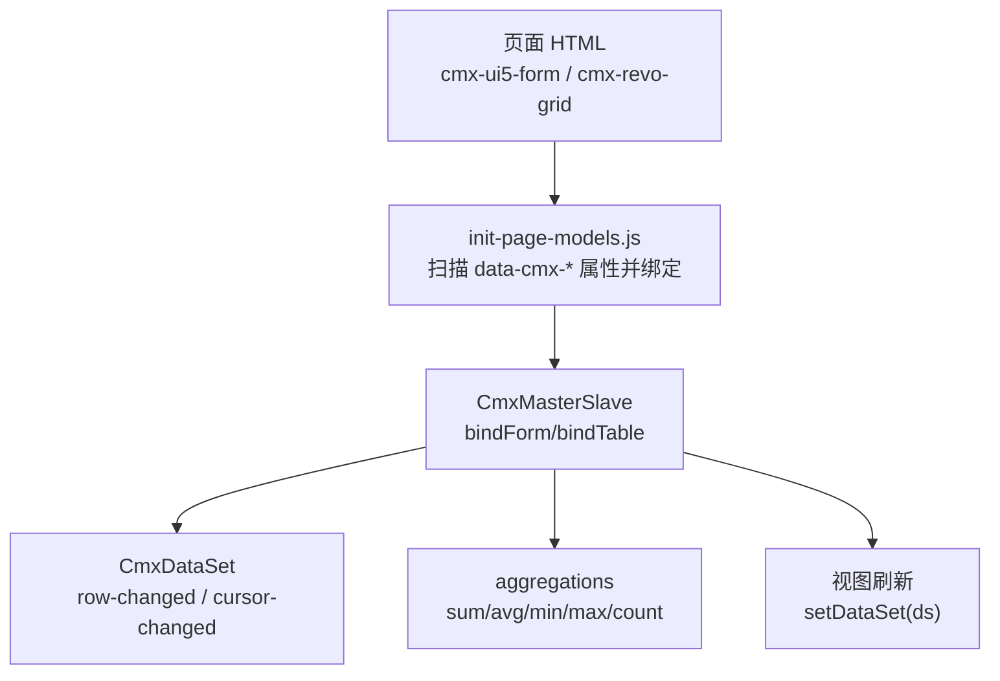
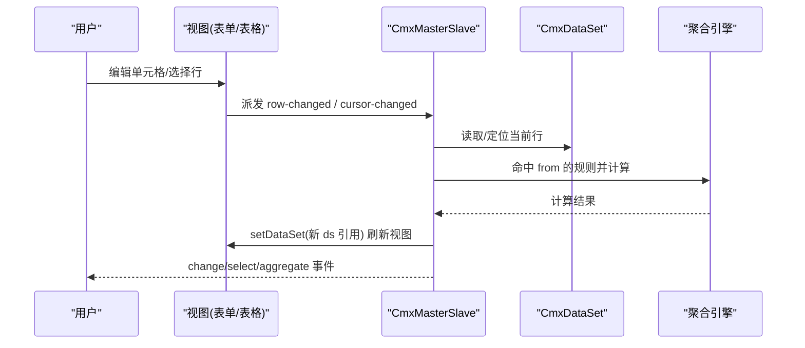
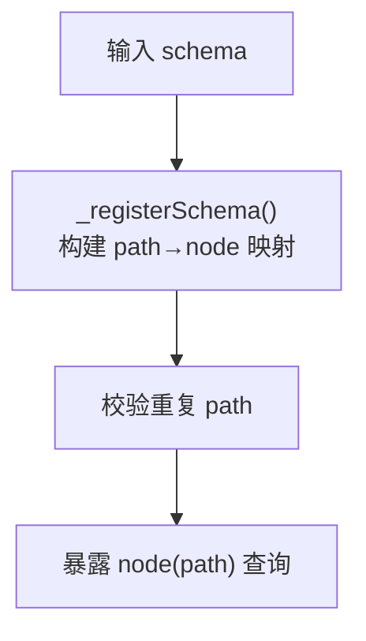
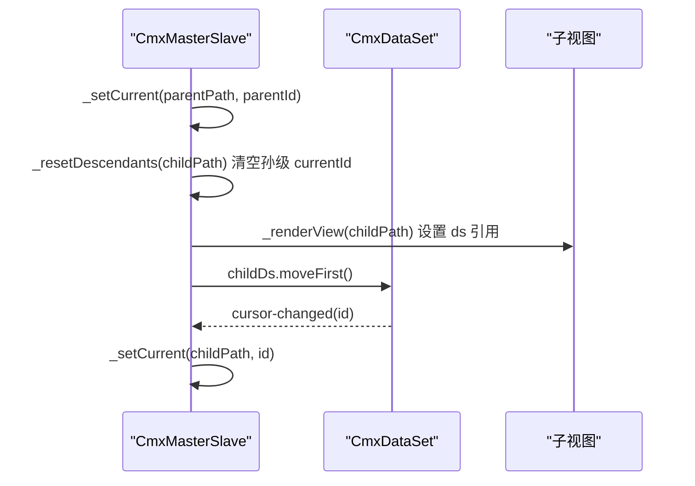
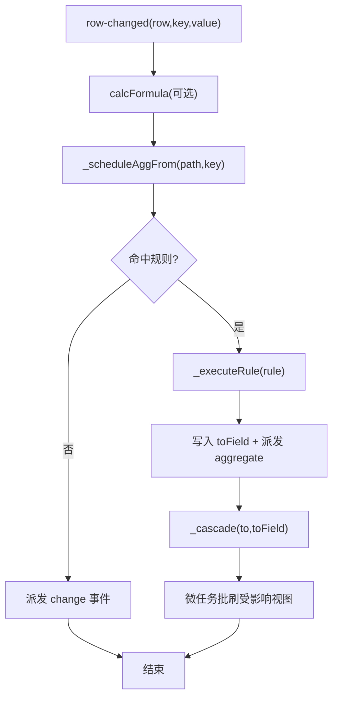
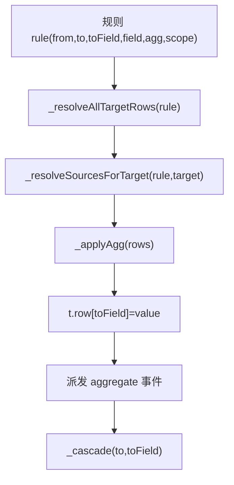
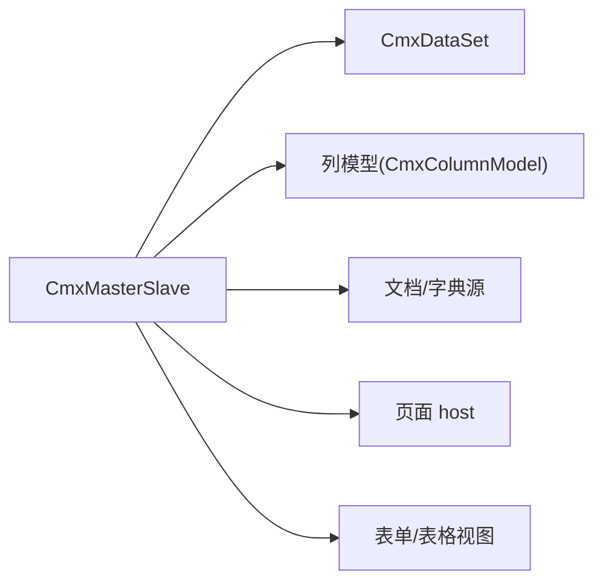

# 主从协调器 (CmxMasterSlave)

<cite>
**本文引用的文件**
- [cmx-master-slave.js](file://packages/cmx-data-comp/src/lib/cmx-master-slave.js)
- [cmx-master-slave-config.js](file://packages/cmx-data-comp/src/components/cmx-master-slave-config.js)
- [models-props-masterslave.js](file://CMXHTMLDesigner/src/components/designer-page-data/models-props-masterslave.js)
- [init-page-models.js](file://packages/cmx-data-comp/src/lib/init-page-models.js)
- [model-master-slave.md](file://.agents/skills/html-page-generator/references/model-master-slave.md)
- [form-components.md](file://.agents/skills/cmx-components-guide/references/form-components.md)
- [skill-generate-master-slave-page.md](file://packages/cmx-data-comp/docs/skill-generate-master-slave-page.md)
- [09-主从协调器-CmxMasterSlave.md](file://docs/CMXPortalManager+CMXHTMLDesigner-模型体系文档/09-主从协调器-CmxMasterSlave.md)
</cite>

## 目录
1. [简介](#简介)
2. [项目结构](#项目结构)
3. [核心组件](#核心组件)
4. [架构总览](#架构总览)
5. [详细组件分析](#详细组件分析)
6. [依赖关系分析](#依赖关系分析)
7. [性能考量](#性能考量)
8. [故障排查指南](#故障排查指南)
9. [结论](#结论)
10. [附录](#附录)

## 简介
CmxMasterSlave 是“多表协调器”，负责把多个数据视图（表单、表格等）按 schema 路径组织成递归主从树，维护每层的当前选中行，并在子表变更时自动执行聚合规则回写父层字段。它不感知业务术语，仅通过配置驱动：schema（路径树）、aggregations（聚合规则）、relations（平铺数据的主外键关系）。典型场景包括凭证录入（头-分录-税项）、订单管理（多级明细）、BOM 展开等。

## 项目结构
与 CmxMasterSlave 直接相关的代码分布在以下位置：
- 核心实现：packages/cmx-data-comp/src/lib/cmx-master-slave.js
- 声明式自启动元素：packages/cmx-data-comp/src/components/cmx-master-slave-config.js
- 设计器属性面板：CMXHTMLDesigner/src/components/designer-page-data/models-props-masterslave.js
- 页面初始化绑定：packages/cmx-data-comp/src/lib/init-page-models.js
- 参考文档与示例：.agents/skills/html-page-generator/references/model-master-slave.md、.agents/skills/cmx-components-guide/references/form-components.md、packages/cmx-data-comp/docs/skill-generate-master-slave-page.md、docs/.../09-主从协调器-CmxMasterSlave.md

图表来源
- [init-page-models.js:970-1002](file://packages/cmx-data-comp/src/lib/init-page-models.js#L970-L1002)
- [cmx-master-slave.js:117-139](file://packages/cmx-data-comp/src/lib/cmx-master-slave.js#L117-L139)
- [cmx-master-slave.js:673-703](file://packages/cmx-data-comp/src/lib/cmx-master-slave.js#L673-L703)

章节来源
- [init-page-models.js:970-1002](file://packages/cmx-data-comp/src/lib/init-page-models.js#L970-L1002)
- [cmx-master-slave.js:117-139](file://packages/cmx-data-comp/src/lib/cmx-master-slave.js#L117-L139)

## 核心组件
- CmxMasterSlave：主从协调器核心类，持有 schema、视图绑定、当前选中、聚合规则、数据装载与保存、分页、字典能力等。
- CmxMasterSlaveConfig：自定义元素，解析 JSON 配置并自动创建 CmxMasterSlave，按 selector 绑定表单/表格，注入初始数据。
- 设计器属性面板：提供可视化编辑 schema 树与聚合规则。
- init-page-models：在页面初始化阶段扫描 DOM 属性，完成声明式绑定。

章节来源
- [cmx-master-slave.js:41-85](file://packages/cmx-data-comp/src/lib/cmx-master-slave.js#L41-L85)
- [cmx-master-slave-config.js:1-65](file://packages/cmx-data-comp/src/components/cmx-master-slave-config.js#L1-L65)
- [models-props-masterslave.js:1-132](file://CMXHTMLDesigner/src/components/designer-page-data/models-props-masterslave.js#L1-L132)
- [init-page-models.js:970-1002](file://packages/cmx-data-comp/src/lib/init-page-models.js#L970-L1002)

## 架构总览
CmxMasterSlave 以“路径”为纽带串联视图与数据集：
- Schema：定义路径树（如 head → items → taxes），每个节点对应一张表或一个单行视图。
- 视图绑定：bindForm(path, formEl)、bindTable(path, tableEl)。
- 当前选中：维护 _currentIds[path] = id；上级选中变化级联到下级 moveFirst。
- 事件监听：监听 row-changed、cursor-changed、row-added/removed，触发聚合与联动。
- 聚合：根据 from/to/field/agg 计算并回写目标字段，支持链式传播。
- 数据入口：setData/setFlatData/setDataSet；loadDoc/loadDict/saveDoc/saveDict；enablePaging/gotoPage 等。

图表来源
- [cmx-master-slave.js:357-417](file://packages/cmx-data-comp/src/lib/cmx-master-slave.js#L357-L417)
- [cmx-master-slave.js:673-703](file://packages/cmx-data-comp/src/lib/cmx-master-slave.js#L673-L703)
- [cmx-master-slave.js:805-833](file://packages/cmx-data-comp/src/lib/cmx-master-slave.js#L805-L833)

## 详细组件分析

### 1) 主从关系建立与路径树（Schema）
- 通过 schema 数组构建路径树，每个节点有 id、children；内部维护 _schemaById 映射 path→node。
- 所有 path 使用点分隔完整路径（如 head.items.taxes），避免歧义。
- 设计器提供可视化编辑 schema 树，支持添加/删除节点。

图表来源
- [cmx-master-slave.js:89-113](file://packages/cmx-data-comp/src/lib/cmx-master-slave.js#L89-L113)
- [models-props-masterslave.js:25-61](file://CMXHTMLDesigner/src/components/designer-page-data/models-props-masterslave.js#L25-L61)

章节来源
- [cmx-master-slave.js:89-113](file://packages/cmx-data-comp/src/lib/cmx-master-slave.js#L89-L113)
- [models-props-masterslave.js:25-61](file://CMXHTMLDesigner/src/components/designer-page-data/models-props-masterslave.js#L25-L61)

### 2) 视图绑定与游标同步机制
- bindForm/bindTable：将 DOM 组件注册到指定 path；表格额外监听 cmx-row-added/removed。
- 当前选中：_setCurrent(path, id) 记录并级联到子路径；子层 moveFirst 触发 cursor-changed 继续下钻。
- 渲染刷新：_renderView 仅在 ds 引用切换时调用 setDataSet，减少重绘；form/table 分别处理。
- 首次装载后 _primeCursors 确保根层首行被选中，从而自上而下点亮子层视图。

图表来源
- [cmx-master-slave.js:705-740](file://packages/cmx-data-comp/src/lib/cmx-master-slave.js#L705-L740)
- [cmx-master-slave.js:337-350](file://packages/cmx-data-comp/src/lib/cmx-master-slave.js#L337-L350)
- [cmx-master-slave.js:673-703](file://packages/cmx-data-comp/src/lib/cmx-master-slave.js#L673-L703)

章节来源
- [cmx-master-slave.js:117-139](file://packages/cmx-data-comp/src/lib/cmx-master-slave.js#L117-L139)
- [cmx-master-slave.js:337-350](file://packages/cmx-data-comp/src/lib/cmx-master-slave.js#L337-L350)
- [cmx-master-slave.js:673-703](file://packages/cmx-data-comp/src/lib/cmx-master-slave.js#L673-L703)
- [cmx-master-slave.js:705-740](file://packages/cmx-data-comp/src/lib/cmx-master-slave.js#L705-L740)

### 3) 事件传播与数据更新策略
- 事件源：row-changed、cursor-changed、row-added/removed、ds-row-added/removed。
- 传播路径：
  - row-changed：执行 calcFormula（若有），调度聚合，派发 change 事件。
  - cursor-changed：_setCurrent 级联刷新子层。
  - row-added/removed：触发命中 from=path 或 from 以 path. 开头的聚合规则。
- 聚合执行：_executeRule 计算 target 行集合，对每条 target 求 source 集合并应用 agg，写入 toField，派发 aggregate 事件；支持链式传播（_cascade），带深度上限防止循环。

图表来源
- [cmx-master-slave.js:357-417](file://packages/cmx-data-comp/src/lib/cmx-master-slave.js#L357-L417)
- [cmx-master-slave.js:744-766](file://packages/cmx-data-comp/src/lib/cmx-master-slave.js#L744-L766)
- [cmx-master-slave.js:805-833](file://packages/cmx-data-comp/src/lib/cmx-master-slave.js#L805-L833)
- [cmx-master-slave.js:835-861](file://packages/cmx-data-comp/src/lib/cmx-master-slave.js#L835-L861)
- [cmx-master-slave.js:863-885](file://packages/cmx-data-comp/src/lib/cmx-master-slave.js#L863-L885)

章节来源
- [cmx-master-slave.js:357-417](file://packages/cmx-data-comp/src/lib/cmx-master-slave.js#L357-L417)
- [cmx-master-slave.js:744-766](file://packages/cmx-data-comp/src/lib/cmx-master-slave.js#L744-L766)
- [cmx-master-slave.js:805-833](file://packages/cmx-data-comp/src/lib/cmx-master-slave.js#L805-L833)
- [cmx-master-slave.js:835-861](file://packages/cmx-data-comp/src/lib/cmx-master-slave.js#L835-L861)
- [cmx-master-slave.js:863-885](file://packages/cmx-data-comp/src/lib/cmx-master-slave.js#L863-L885)

### 4) 聚合规则与语义
- 规则字段：from、to、toField、field（可选）、agg（内置 sum/avg/min/max/count 或自定义函数）、scope（siblings/all）。
- 语义：
  - scope=all：整树聚合，忽略上下文。
  - scope=siblings（默认）：若 to 是 from 的祖先 list，则限定在 t 的子树；否则寻找最近公共 list 祖先，沿相对路径展开。
- 触发时机：setData 预热、cell 变更、行增删。
- 链式：一条规则写出的字段可作为另一条规则的 source，自动触发下游规则。

图表来源
- [cmx-master-slave.js:805-833](file://packages/cmx-data-comp/src/lib/cmx-master-slave.js#L805-L833)
- [cmx-master-slave.js:892-970](file://packages/cmx-data-comp/src/lib/cmx-master-slave.js#L892-L970)

章节来源
- [cmx-master-slave.js:206-215](file://packages/cmx-data-comp/src/lib/cmx-master-slave.js#L206-L215)
- [cmx-master-slave.js:755-766](file://packages/cmx-data-comp/src/lib/cmx-master-slave.js#L755-L766)
- [cmx-master-slave.js:892-970](file://packages/cmx-data-comp/src/lib/cmx-master-slave.js#L892-L970)

### 5) 数据装载与保存
- setData/setFlatData/setDataSet：三种数据入口，支持嵌套树与平铺数据（relations 关联）。
- loadDoc/loadDict：加载单据/字典数据，自动建 ChangeSetCollector 用于增量保存。
- saveDoc/saveDict：导出 changeset 并持久化，失败统一结构化错误提示。
- reload/reloadDict：基于上次 def 重新加载。

章节来源
- [cmx-master-slave.js:281-335](file://packages/cmx-data-comp/src/lib/cmx-master-slave.js#L281-L335)
- [cmx-master-slave.js:510-536](file://packages/cmx-data-comp/src/lib/cmx-master-slave.js#L510-L536)
- [cmx-master-slave.js:1005-1103](file://packages/cmx-data-comp/src/lib/cmx-master-slave.js#L1005-L1103)
- [cmx-master-slave.js:1277-1349](file://packages/cmx-data-comp/src/lib/cmx-master-slave.js#L1277-L1349)

### 6) 分页能力
- enablePaging/disablePaging：启用/关闭分页，控制 countTotal 与 layers[layer] 参数。
- gotoPage/nextPage/prevPage/setPageSize：翻页与页大小调整。
- getPagingInfo/_totalPages：获取分页信息，基于后端返回 total 计算总页数。

章节来源
- [cmx-master-slave.js:1124-1243](file://packages/cmx-data-comp/src/lib/cmx-master-slave.js#L1124-L1243)

### 7) 字典（DCT）能力
- loadDict/loadDictChildren/newDictEntry/deleteDictEntry：加载字典、懒下钻、新增/删除行。
- setDictGridFilter/dictGridView/dictGridMode：四区联动中 grid 只显示某父节点的直接子级。
- setDictSelected：标记选中行并移动游标。

章节来源
- [cmx-master-slave.js:1245-1539](file://packages/cmx-data-comp/src/lib/cmx-master-slave.js#L1245-L1539)

### 8) 声明式自启动元素与页面初始化
- <cmx-master-slave-config>：解析 JSON，创建 CmxMasterSlave，按 selector 绑定表单/表格，注入 initialData，并通过 element.ms 暴露实例。
- init-page-models：扫描 data-cmx-master-slave-id/data-cmx-dataset-id/data-cmx-kind，完成 bindForm/bindTable；支持旧方式直绑 dataset。

章节来源
- [cmx-master-slave-config.js:1-65](file://packages/cmx-data-comp/src/components/cmx-master-slave-config.js#L1-L65)
- [init-page-models.js:970-1002](file://packages/cmx-data-comp/src/lib/init-page-models.js#L970-L1002)

### 9) 不同场景下的主从配置示例
- 主从表格（头-分录）：schema 定义 head/items，relations 用 childKey 关联；aggregations 汇总金额到 head。
- 表单与表格联动：head 用 bindForm，items 用 bindTable；选头行自动刷分录。
- 树形结构与详情表单：DCT 场景，tree 选中节点 → setDictGridFilter 过滤 grid；setDictSelected 高亮选中。

章节来源
- [model-master-slave.md:180-230](file://.agents/skills/html-page-generator/references/model-master-slave.md#L180-L230)
- [form-components.md:218-273](file://.agents/skills/cmx-components-guide/references/form-components.md#L218-L273)
- [skill-generate-master-slave-page.md:132-204](file://packages/cmx-data-comp/docs/skill-generate-master-slave-page.md#L132-L204)
- [09-主从协调器-CmxMasterSlave.md:135-166](file://docs/CMXPortalManager+CMXHTMLDesigner-模型体系文档/09-主从协调器-CmxMasterSlave.md#L135-L166)

## 依赖关系分析
- 外部依赖：CmxDataSet（数据容器）、列模型（calcFormula）、页面 host（fetch/$coord/shadowRoot）、文档/字典源（loadDocData/saveDocData、loadDictData/saveDictData）。
- 内部耦合：
  - 视图绑定与事件监听强耦合于 CmxDataSet 的事件模型（row-changed/cursor-changed）。
  - 聚合引擎与路径解析紧密配合，依赖 schema 路径正确性。
  - 分页与文档装载逻辑共享同一套 def/query/layers 约定。

图表来源
- [cmx-master-slave.js:1-15](file://packages/cmx-data-comp/src/lib/cmx-master-slave.js#L1-L15)
- [cmx-master-slave.js:974-986](file://packages/cmx-data-comp/src/lib/cmx-master-slave.js#L974-L986)
- [cmx-master-slave.js:1005-1103](file://packages/cmx-data-comp/src/lib/cmx-master-slave.js#L1005-L1103)
- [cmx-master-slave.js:1277-1349](file://packages/cmx-data-comp/src/lib/cmx-master-slave.js#L1277-L1349)

章节来源
- [cmx-master-slave.js:1-15](file://packages/cmx-data-comp/src/lib/cmx-master-slave.js#L1-L15)
- [cmx-master-slave.js:974-986](file://packages/cmx-data-comp/src/lib/cmx-master-slave.js#L974-L986)
- [cmx-master-slave.js:1005-1103](file://packages/cmx-data-comp/src/lib/cmx-master-slave.js#L1005-L1103)
- [cmx-master-slave.js:1277-1349](file://packages/cmx-data-comp/src/lib/cmx-master-slave.js#L1277-L1349)

## 性能考量
- 批处理视图刷新：聚合写值后立即执行，但视图刷新合并到下一个微任务，避免多次重绘。
- 规则索引：按 from-path 反向索引，仅命中相关规则，降低无关计算。
- 链式保护：_cascade 深度上限（16）防止循环或过宽图导致性能问题。
- 游标点亮：_primeCursors 在装载后自动 moveFirst，减少手动操作与多余刷新。
- 分页优化：仅在启用分页时合入 countTotal，避免无谓 COUNT 开销。
- 建议：
  - 合理拆分 schema，避免过深层级。
  - 谨慎使用 scope=all，优先 siblings。
  - 大量聚合规则时，尽量细化 field 匹配以减少误触发。
  - SPA 切换页面时调用 destroy 释放监听，防止内存泄漏。

章节来源
- [cmx-master-slave.js:772-786](file://packages/cmx-data-comp/src/lib/cmx-master-slave.js#L772-L786)
- [cmx-master-slave.js:835-861](file://packages/cmx-data-comp/src/lib/cmx-master-slave.js#L835-L861)
- [cmx-master-slave.js:337-350](file://packages/cmx-data-comp/src/lib/cmx-master-slave.js#L337-L350)
- [cmx-master-slave.js:1124-1168](file://packages/cmx-data-comp/src/lib/cmx-master-slave.js#L1124-L1168)
- [cmx-master-slave.js:145-167](file://packages/cmx-data-comp/src/lib/cmx-master-slave.js#L145-L167)

## 故障排查指南
- 常见错误与原因：
  - duplicate path：schema 中存在同名 id，需保证唯一。
  - unknown path：引用了未定义的 path，检查 schema 与 relations。
  - 未绑视图就 setCurrentId：不会报错，但视图不会自动刷新，需先 bindForm/bindTable。
  - 聚合 to 写错：写到不存在 path，检查 to 是否合法。
  - 忘记 destroy：SPA 切换页面可能导致内存泄漏。
- 调试建议：
  - 监听 change/select/aggregate 事件，观察数据流。
  - 使用 getRow/getRootDataSet 检查当前数据状态。
  - 检查 _bindings 与 _currentIds，确认绑定与选中是否正确。
  - 对于复杂聚合，逐步缩小 scope 与 field 范围验证。

章节来源
- [cmx-master-slave.js:89-113](file://packages/cmx-data-comp/src/lib/cmx-master-slave.js#L89-L113)
- [cmx-master-slave.js:145-167](file://packages/cmx-data-comp/src/lib/cmx-master-slave.js#L145-L167)
- [09-主从协调器-CmxMasterSlave.md:294-304](file://docs/CMXPortalManager+CMXHTMLDesigner-模型体系文档/09-主从协调器-CmxMasterSlave.md#L294-L304)

## 结论
CmxMasterSlave 以配置驱动的方式，将多张表/视图组织为递归主从树，自动维护选中联动与聚合回写，并提供统一的装载/保存/分页/字典能力。其“业务无感知”的设计使得同一份协调器可复用于多种业务场景，只需通过 schema/aggregations/relations 进行配置。合理使用批处理、规则索引与分页优化，可在复杂场景中保持良好性能。

## 附录
- 快速上手步骤：
  1) 定义 schema（路径树）。
  2) 定义 aggregations（聚合规则）。
  3) 定义 relations（如需平铺数据）。
  4) 绑定视图（bindForm/bindTable 或通过声明式属性）。
  5) 装载数据（setData/setFlatData/setDataSet 或 loadDoc/loadDict）。
  6) 监听事件（change/select/aggregate）进行扩展。
- 参考示例：
  - 表单+表格联动：见 form-components.md 示例。
  - 生成页面脚本模板：见 skill-generate-master-slave-page.md。
  - 设计器属性面板：见 models-props-masterslave.js。

章节来源
- [form-components.md:218-273](file://.agents/skills/cmx-components-guide/references/form-components.md#L218-L273)
- [skill-generate-master-slave-page.md:132-204](file://packages/cmx-data-comp/docs/skill-generate-master-slave-page.md#L132-L204)
- [models-props-masterslave.js:1-132](file://CMXHTMLDesigner/src/components/designer-page-data/models-props-masterslave.js#L1-L132)