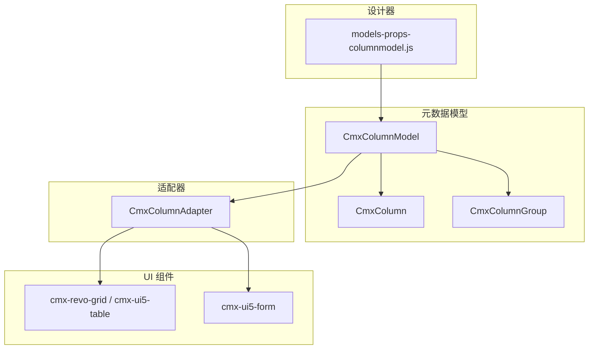
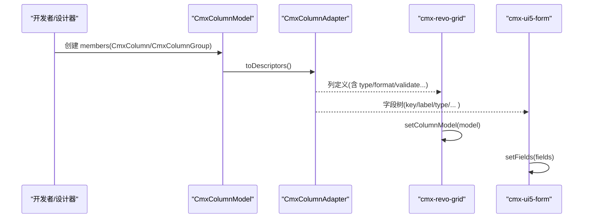
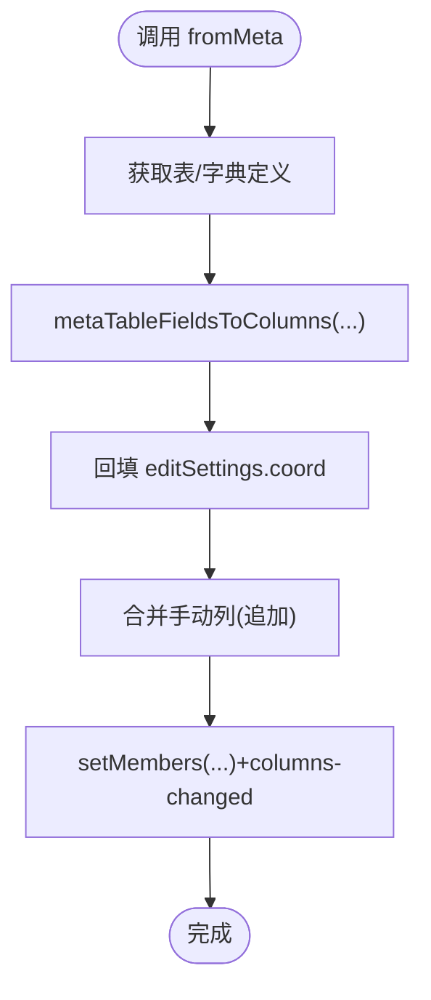
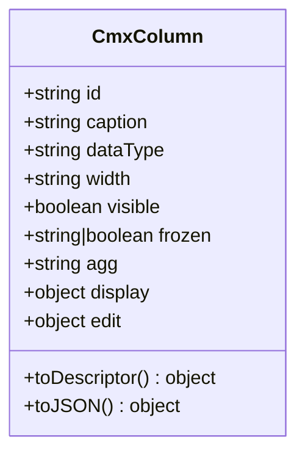
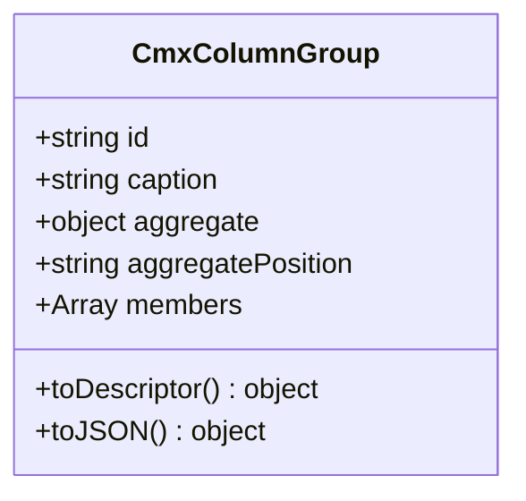
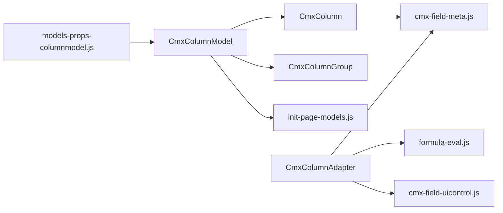

# 列模型绑定 (CmxColumnModel)

<cite>
**本文引用的文件**
- [cmx-column-model.js](file://packages/cmx-data-comp/src/lib/cmx-column-model.js)
- [cmx-column.js](file://packages/cmx-data-comp/src/lib/cmx-column.js)
- [cmx-column-group.js](file://packages/cmx-data-comp/src/lib/cmx-column-group.js)
- [cmx-column-adapter.js](file://packages/cmx-data-comp/src/lib/cmx-column-adapter.js)
- [models-props-columnmodel.js](file://CMXHTMLDesigner/src/components/designer-page-data/models-props-columnmodel.js)
- [init-page-models.js](file://packages/cmx-data-comp/src/lib/init-page-models.js)
- [08-列模型-CmxColumnModel.md](file://docs/CMXPortalManager+CMXHTMLDesigner-模型体系文档/08-列模型-CmxColumnModel.md)
- [column-editor-display-guide.md](file://packages/cmx-data-comp/docs/column-editor-display-guide.md)
- [model-column-model.md](file://.agents/skills/html-page-generator/references/model-column-model.md)
</cite>

## 目录
1. [简介](#简介)
2. [项目结构](#项目结构)
3. [核心组件](#核心组件)
4. [架构总览](#架构总览)
5. [详细组件分析](#详细组件分析)
6. [依赖关系分析](#依赖关系分析)
7. [性能考虑](#性能考虑)
8. [故障排查指南](#故障排查指南)
9. [结论](#结论)
10. [附录](#附录)

## 简介
本文件系统性说明 CmxColumnModel（列模型）在数据绑定中的作用与实现：字段定义、类型映射、验证规则、显示格式、配置选项、动态列生成、条件渲染与编辑控制，并提供表格列配置、表单字段配置、复杂数据类型处理等场景示例。同时给出性能优化建议与最佳实践。

## 项目结构
围绕列模型的代码主要分布在 cmx-data-comp 的 lib 层与设计器页面数据面板中：
- 元数据模型：CmxColumnModel、CmxColumn、CmxColumnGroup
- 适配器：CmxColumnAdapter（将通用描述符转换为具体 UI 组件所需定义）
- 设计器属性面板：models-props-columnmodel.js（可视化编辑 columns / columnGroups）
- 运行时初始化：init-page-models.js（从元数据构建列）
- 文档与参考：08-列模型-CmxColumnModel.md、model-column-model.md、column-editor-display-guide.md



图表来源
- [cmx-column-model.js:16-29](file://packages/cmx-data-comp/src/lib/cmx-column-model.js#L16-L29)
- [cmx-column.js:84-126](file://packages/cmx-data-comp/src/lib/cmx-column.js#L84-L126)
- [cmx-column-group.js:25-40](file://packages/cmx-data-comp/src/lib/cmx-column-group.js#L25-L40)
- [cmx-column-adapter.js:1-21](file://packages/cmx-data-comp/src/lib/cmx-column-adapter.js#L1-L21)
- [models-props-columnmodel.js:23-79](file://CMXHTMLDesigner/src/components/designer-page-data/models-props-columnmodel.js#L23-L79)

章节来源
- [cmx-column-model.js:1-241](file://packages/cmx-data-comp/src/lib/cmx-column-model.js#L1-L241)
- [models-props-columnmodel.js:1-833](file://CMXHTMLDesigner/src/components/designer-page-data/models-props-columnmodel.js#L1-L833)

## 核心组件
- CmxColumnModel：组织列与列组，提供成员管理、聚合配置、序列化、以及 fromMeta 动态构建列的能力。
- CmxColumn：单列定义，包含 id、caption、dataType、width、visible、frozen、agg、display/edit 结构化配置、计算与校验公式等。
- CmxColumnGroup：列分组，支持嵌套成员与组内聚合（sum/avg/max/min/count），可设置合计行位置。
- CmxColumnAdapter：将模型 toDescriptors() 输出的通用描述符转换为具体 UI 组件（grid/form）所需的列定义。

章节来源
- [cmx-column-model.js:20-239](file://packages/cmx-data-comp/src/lib/cmx-column-model.js#L20-L239)
- [cmx-column.js:84-255](file://packages/cmx-data-comp/src/lib/cmx-column.js#L84-L255)
- [cmx-column-group.js:25-162](file://packages/cmx-data-comp/src/lib/cmx-column-group.js#L25-L162)
- [cmx-column-adapter.js:1-579](file://packages/cmx-data-comp/src/lib/cmx-column-adapter.js#L1-L579)

## 架构总览
列模型通过“声明式 + 适配器”的方式解耦业务列定义与 UI 实现：
- 声明：CmxColumnModel/CmxColumn/CmxColumnGroup 表达字段、类型、显示、编辑、聚合等元信息。
- 转换：toDescriptors() 输出通用中间格式；CmxColumnAdapter 将其转为 grid/form 的具体列定义。
- 绑定：可视组件（如 cmx-revo-grid、cmx-ui5-form）通过 setColumnModel/setFields 接收并渲染。



图表来源
- [cmx-column-model.js:181-195](file://packages/cmx-data-comp/src/lib/cmx-column-model.js#L181-L195)
- [cmx-column-adapter.js:529-579](file://packages/cmx-data-comp/src/lib/cmx-column-adapter.js#L529-L579)

## 详细组件分析

### CmxColumnModel：列模型容器
- 成员管理：addMember/removeMember/setMembers，内部派发 columns-changed 事件驱动视图刷新。
- 动态列：fromMeta(metaModel, tableId, opts) 从字典/单据元数据自动构建列，并回填 refDict 坐标，再追加手动列（如操作列）。
- 聚合：toAggregateMap() 汇总 agg 配置供合计行或后端使用。
- 序列化：toJSON/fromJSON 支持持久化与还原。



图表来源
- [cmx-column-model.js:89-158](file://packages/cmx-data-comp/src/lib/cmx-column-model.js#L89-L158)
- [init-page-models.js:145-169](file://packages/cmx-data-comp/src/lib/init-page-models.js#L145-L169)

章节来源
- [cmx-column-model.js:20-239](file://packages/cmx-data-comp/src/lib/cmx-column-model.js#L20-L239)

### CmxColumn：字段定义与三域
- 基础：id、caption、dataType、width、visible、frozen、agg、actionRef 等。
- 显示域 display：format、mode（text/badge/link/icon）、cellStyle、render 逃生舱、decimalDigits 等。
- 编辑域 edit：mode（input/textarea/number/date/datetime/checkbox/select/ref/combo/dict-select/image/video/readonly/none）、trigger、options、source、valueField、displayTemplate、dependents、required、requiredWhen、validate、validateWhen、readonlyWhen、editor 逃生舱。
- 别名归一化：displayMask→display.format、displayMode→display.mode、validateFormula→edit.validate、decimalDigits→display.decimalDigits、actionRef→display.link.actionRef。
- 描述符输出：toDescriptor() 输出通用中间格式，供适配器消费。



图表来源
- [cmx-column.js:84-200](file://packages/cmx-data-comp/src/lib/cmx-column.js#L84-L200)

章节来源
- [cmx-column.js:1-255](file://packages/cmx-data-comp/src/lib/cmx-column.js#L1-L255)

### CmxColumnGroup：列分组与聚合
- 成员：members 可为 CmxColumn 或嵌套 CmxColumnGroup。
- 聚合：aggregate 启用 sum/avg/max/min/count，aggregatePosition 控制合计行位置。
- 描述符：toDescriptor() 输出 group 节点与子节点。



图表来源
- [cmx-column-group.js:25-131](file://packages/cmx-data-comp/src/lib/cmx-column-group.js#L25-L131)

章节来源
- [cmx-column-group.js:1-162](file://packages/cmx-data-comp/src/lib/cmx-column-group.js#L1-L162)

### CmxColumnAdapter：适配到具体 UI
- 表格适配：_cmxTableType 根据 edit.mode/dataType 推断控件类型；支持 datetime、date、number、text、combo、ref 等。
- 表单适配：toCmxForm/toCmxFormGrouped 输出扁平或树形字段数组；将 edit.* 提升到 field 顶层（如 valueField/displayTemplate/dependents/requiredWhen/validate），BOOLEAN → checkbox。
- 合计：_cmxTableTotals 收集分组聚合配置。

```mermaid
sequenceDiagram
participant Model as "CmxColumnModel"
participant Adapter as "CmxColumnAdapter"
participant Form as "cmx-ui5-form"
Model->>Adapter : toDescriptors()
Adapter->>Adapter : _flatDescriptors()/_descriptorToFormNode()
Adapter-->>Form : fields[] (key/label/type/...)
Note over Adapter,Form : BOOLEAN→checkbox; edit.*→field顶层
```

图表来源
- [cmx-column-adapter.js:529-579](file://packages/cmx-data-comp/src/lib/cmx-column-adapter.js#L529-L579)
- [cmx-column-adapter.js:432-462](file://packages/cmx-data-comp/src/lib/cmx-column-adapter.js#L432-L462)

章节来源
- [cmx-column-adapter.js:1-579](file://packages/cmx-data-comp/src/lib/cmx-column-adapter.js#L1-L579)

### 设计器属性面板：可视化编辑列模型
- 提供“定义”和“JSON”双视图，支持复制/粘贴列与列组、添加/删除列与列组、枚举值编辑、列移动等。
- normalizeColumnModelProps 兼容历史 fields/groups 与 legacy columns，统一为 columns/columnGroups。
- JSON 视图基于 CodeMirror，支持格式化与应用。

章节来源
- [models-props-columnmodel.js:23-833](file://CMXHTMLDesigner/src/components/designer-page-data/models-props-columnmodel.js#L23-L833)

## 依赖关系分析
- CmxColumnModel 依赖 CmxColumn/CmxColumnGroup 进行成员组织，依赖 init-page-models.js 的 metaTableFieldsToColumns 实现 fromMeta。
- CmxColumn 依赖 cmx-field-meta.js 的 fieldCaption 解析多语言标题。
- CmxColumnAdapter 依赖 formula-eval.js、cmx-field-uicontrol.js、cmx-field-meta.js 完成类型推断与表单字段构造。
- 设计器 models-props-columnmodel.js 依赖 cmx-data-comp 提供的字段面板能力（renderFieldPanel/renderFieldTable 等）。



图表来源
- [cmx-column-model.js:16-18](file://packages/cmx-data-comp/src/lib/cmx-column-model.js#L16-L18)
- [cmx-column.js:82-82](file://packages/cmx-data-comp/src/lib/cmx-column.js#L82-L82)
- [cmx-column-adapter.js:23-27](file://packages/cmx-data-comp/src/lib/cmx-column-adapter.js#L23-L27)
- [models-props-columnmodel.js:11-19](file://CMXHTMLDesigner/src/components/designer-page-data/models-props-columnmodel.js#L11-L19)

章节来源
- [cmx-column-model.js:16-18](file://packages/cmx-data-comp/src/lib/cmx-column-model.js#L16-L18)
- [cmx-column.js:82-82](file://packages/cmx-data-comp/src/lib/cmx-column.js#L82-L82)
- [cmx-column-adapter.js:23-27](file://packages/cmx-data-comp/src/lib/cmx-column-adapter.js#L23-L27)
- [models-props-columnmodel.js:11-19](file://CMXHTMLDesigner/src/components/designer-page-data/models-props-columnmodel.js#L11-L19)

## 性能考虑
- 避免频繁重建列：优先使用 setMembers 整体替换，减少多次 addMember/removeMember 触发的多次 columns-changed。
- 合理使用 visible/frozen：隐藏不可见列可减少渲染开销；冻结列不宜过多。
- 谨慎使用自定义 render/editor：函数型渲染/编辑器会引入额外开销，仅在必要时使用。
- 聚合配置集中：通过 CmxColumnGroup.aggregate 集中声明，便于一次性计算合计。
- 从元数据动态构建列时复用 fromMeta，避免重复解析与构造。

[本节为通用指导，不直接分析具体文件]

## 故障排查指南
- 列未生效：检查 members 是否已正确传入，toDescriptors 是否过滤了 visible=false 的列。
- 表单控件类型不正确：确认 edit.mode 与 dataType 的优先级；BOOLEAN 应映射为 checkbox。
- 校验/必填未触发：确保 edit.required/requiredWhen/validate/validateWhen 已正确设置，且表达式作用域为行字段铺平后的扁平键。
- 字典选择弹窗报错：fromMeta 后需回填 editSettings.coord；若缺失 domain/application/module，可能导致请求失败。
- 设计器 JSON 应用失败：检查根节点是否为对象、columns/columnGroups 是否为数组。

章节来源
- [cmx-column-model.js:188-195](file://packages/cmx-data-comp/src/lib/cmx-column-model.js#L188-L195)
- [cmx-column-adapter.js:459-462](file://packages/cmx-data-comp/src/lib/cmx-column-adapter.js#L459-L462)
- [cmx-column-adapter.js:529-579](file://packages/cmx-data-comp/src/lib/cmx-column-adapter.js#L529-L579)
- [models-props-columnmodel.js:494-515](file://CMXHTMLDesigner/src/components/designer-page-data/models-props-columnmodel.js#L494-L515)

## 结论
CmxColumnModel 以声明式方式统一定义列的字段、类型、显示与编辑行为，并通过适配器将通用描述符转换为不同 UI 组件所需的列定义。其支持动态列生成、条件渲染与编辑控制，配合设计器可视化编辑，能高效支撑表格与表单的多场景需求。遵循本文的最佳实践可获得更优的性能与可维护性。

[本节为总结，不直接分析具体文件]

## 附录

### 配置选项速查
- 列基础：id、caption、dataType、width、visible、frozen、agg、actionRef
- 显示域 display：format、mode、cellStyle、render、decimalDigits、zeroAsBlank、emptyText、badgeMap、icon、link
- 编辑域 edit：mode、trigger、options、source、valueField、displayTemplate、parent、dropdownColumns、placeholder、dependents、required、requiredWhen、validate、validateWhen、readonlyWhen、editor
- 别名：displayMask→display.format、displayMode→display.mode、validateFormula→edit.validate、decimalDigits→display.decimalDigits、actionRef→display.link.actionRef

章节来源
- [cmx-column.js:13-80](file://packages/cmx-data-comp/src/lib/cmx-column.js#L13-L80)
- [model-column-model.md:38-80](file://.agents/skills/html-page-generator/references/model-column-model.md#L38-L80)

### 典型场景示例路径
- 表格列配置：参见测试与示例中对 CmxColumnModel/CmxColumn 的使用
  - [cmx-column-adapter.test.js:12-36](file://packages/cmx-data-comp/src/lib/__tests__/cmx-column-adapter.test.js#L12-L36)
  - [cmx-column-adapter.test.js:121-143](file://packages/cmx-data-comp/src/lib/__tests__/cmx-column-adapter.test.js#L121-L143)
- 表单字段配置：toCmxForm/toCmxFormGrouped 将列转为表单字段
  - [cmx-column-adapter.js:529-579](file://packages/cmx-data-comp/src/lib/cmx-column-adapter.js#L529-L579)
- 复杂数据类型处理：DATETIME/DATE/DECIMAL/VARCHAR/BOOLEAN 的类型映射与控件路由
  - [cmx-column-adapter.js:432-462](file://packages/cmx-data-comp/src/lib/cmx-column-adapter.js#L432-L462)
- 端到端示例（form+grid 共用列定义）：
  - [column-editor-display-guide.md:377-405](file://packages/cmx-data-comp/docs/column-editor-display-guide.md#L377-L405)

### 运行时流程与事件
- 动态列变更：setMembers 后派发 columns-changed，驱动网格/表单重刷
  - [cmx-column-model.js:33-72](file://packages/cmx-data-comp/src/lib/cmx-column-model.js#L33-L72)
- 从元数据构建列：fromMeta 自动填充列并回填字典坐标
  - [cmx-column-model.js:89-158](file://packages/cmx-data-comp/src/lib/cmx-column-model.js#L89-L158)

章节来源
- [cmx-column-model.js:33-158](file://packages/cmx-data-comp/src/lib/cmx-column-model.js#L33-L158)
- [cmx-column-adapter.js:432-462](file://packages/cmx-data-comp/src/lib/cmx-column-adapter.js#L432-L462)
- [column-editor-display-guide.md:377-405](file://packages/cmx-data-comp/docs/column-editor-display-guide.md#L377-L405)