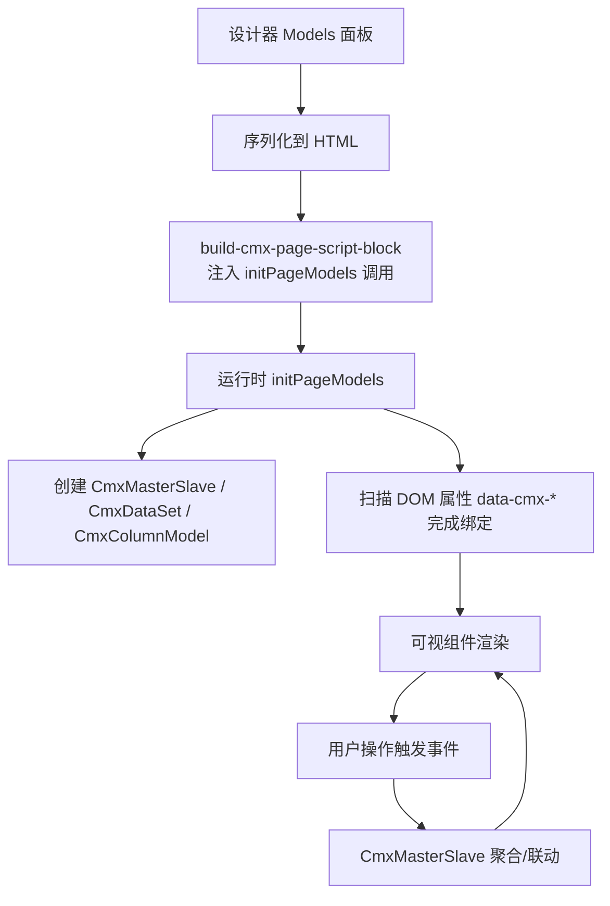
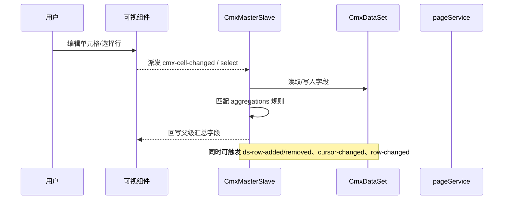
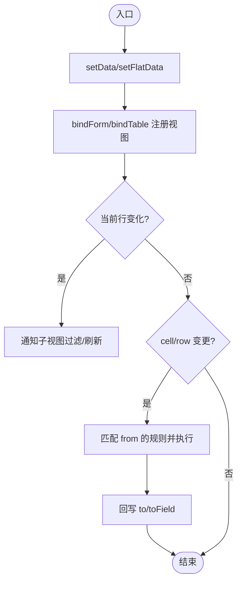
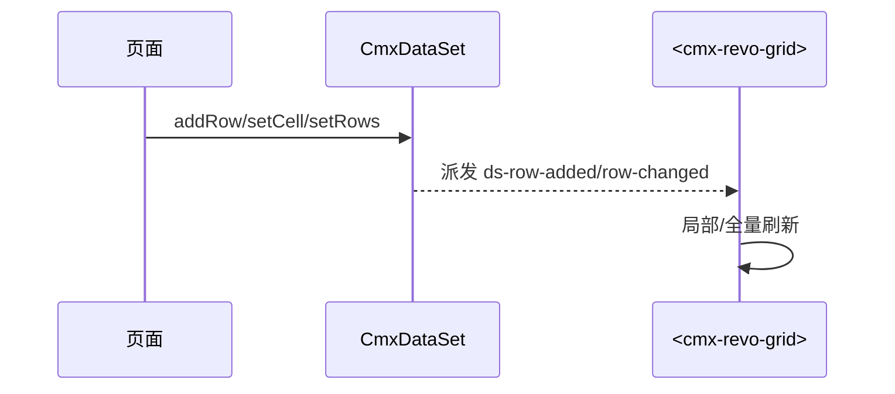
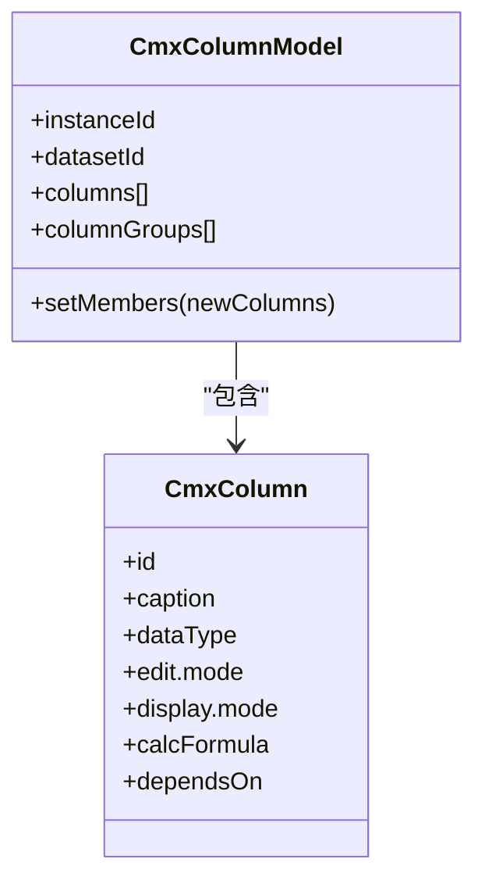
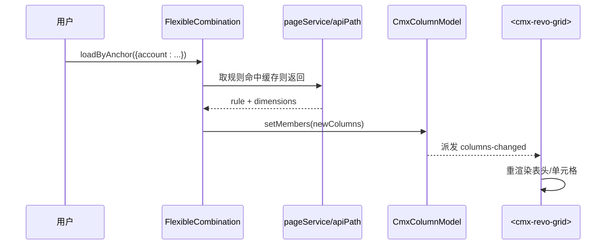
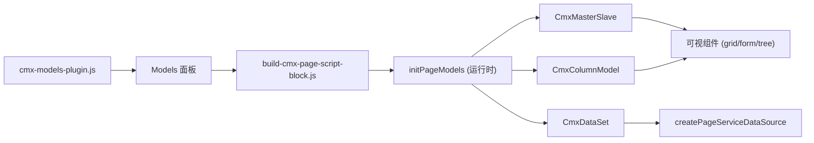

# 数据绑定模式

<cite>
**本文引用的文件**
- [09-主从协调器-CmxMasterSlave.md](file://docs/CMXPortalManager+CMXHTMLDesigner-模型体系文档/09-主从协调器-CmxMasterSlave.md)
- [08-列模型-CmxColumnModel.md](file://docs/CMXPortalManager+CMXHTMLDesigner-模型体系文档/08-列模型-CmxColumnModel.md)
- [14-典型场景示例.md](file://docs/CMXPortalManager+CMXHTMLDesigner-模型体系文档/14-典型场景示例.md)
- [10-弹性组合-FlexibleCombination.md](file://docs/CMXPortalManager+CMXHTMLDesigner-模型体系文档/10-弹性组合-FlexibleCombination.md)
- [11-模型事件与脚本.md](file://docs/CMXPortalManager+CMXHTMLDesigner-模型体系文档/11-模型事件与脚本.md)
- [12-运行时初始化流程.md](file://docs/CMXPortalManager+CMXHTMLDesigner-模型体系文档/12-运行时初始化流程.md)
- [model-dataset.md](file://.agents/skills/html-page-generator/references/model-dataset.md)
- [model-master-slave.md](file://.agents/skills/html-page-generator/references/model-master-slave.md)
- [cmx-models-plugin.js](file://CMXHTMLDesigner/src/plugins/cmx-models-plugin.js)
- [build-cmx-page-script-block.js](file://CMXHTMLDesigner/src/utils/build-cmx-page-script-block.js)
- [cmx-ignite-shared.js](file://packages/cmx-data-comp/src/components/ignite/cmx-ignite-shared.js)
- [cmx-web-treeview.js](file://packages/cmx-data-comp/src/components/cmx-web-treeview.js)
- [cmx-page-service-source.js](file://packages/cmx-data-comp/src/lib/cmx-page-service-source.js)
</cite>

## 目录
1. [引言](#引言)
2. [项目结构](#项目结构)
3. [核心组件](#核心组件)
4. [架构总览](#架构总览)
5. [详细组件分析](#详细组件分析)
6. [依赖关系分析](#依赖关系分析)
7. [性能考量](#性能考量)
8. [故障排查指南](#故障排查指南)
9. [结论](#结论)
10. [附录](#附录)

## 引言
本文件系统性阐述 CMX 平台的数据绑定模式，围绕 CmxMasterSlave（主从协调器）、CmxDataSet（数据集）与 CmxColumnModel（列模型）的协作机制展开。重点说明：
- 双向数据绑定、单向数据流与事件驱动的数据更新模式
- 表格、表单、树形等典型场景的数据绑定实践
- 数据同步策略、性能优化与错误处理方案

## 项目结构
CMX 的数据绑定由“设计期配置 → 运行时初始化 → 视图绑定 → 事件驱动更新”构成。关键路径包括：
- 设计器侧：Models 面板定义模型实例、DOM 属性声明绑定关系
- 构建侧：将页面模型配置编译进 HTML 脚本块，并在运行时调用 initPageModels
- 运行侧：initPageModels 创建并挂载模型实例，扫描 DOM 完成可视组件绑定
- 交互侧：通过事件（如 cmx-cell-changed、cursor-changed、row-changed）驱动数据流与 UI 刷新

图表来源
- [build-cmx-page-script-block.js:111-304](file://CMXHTMLDesigner/src/utils/build-cmx-page-script-block.js#L111-L304)
- [12-运行时初始化流程.md:117-189](file://docs/CMXPortalManager+CMXHTMLDesigner-模型体系文档/12-运行时初始化流程.md#L117-L189)

章节来源
- [build-cmx-page-script-block.js:111-304](file://CMXHTMLDesigner/src/utils/build-cmx-page-script-block.js#L111-L304)
- [12-运行时初始化流程.md:117-189](file://docs/CMXPortalManager+CMXHTMLDesigner-模型体系文档/12-运行时初始化流程.md#L117-L189)

## 核心组件
- CmxMasterSlave：主从多表“协调器”，维护递归主从数据树、当前选中行、视图按 path 绑定、自动聚合规则执行
- CmxDataSet：多级树形数据集，提供行增删改、游标管理、事件派发（ds-row-added/removed、cursor-changed、row-changed）
- CmxColumnModel：表格列模板，定义列结构、编辑/显示方式、聚合、公式与校验；可被 FlexibleCombination 动态改写
- FlexibleCombination：上下文驱动的动态列生成器，根据锚点维度值加载规则并改写目标 CmxColumnModel

章节来源
- [09-主从协调器-CmxMasterSlave.md:7-35](file://docs/CMXPortalManager+CMXHTMLDesigner-模型体系文档/09-主从协调器-CmxMasterSlave.md#L7-L35)
- [08-列模型-CmxColumnModel.md:7-36](file://docs/CMXPortalManager+CMXHTMLDesigner-模型体系文档/08-列模型-CmxColumnModel.md#L7-L36)
- [10-弹性组合-FlexibleCombination.md:7-26](file://docs/CMXPortalManager+CMXHTMLDesigner-模型体系文档/10-弹性组合-FlexibleCombination.md#L7-L26)

## 架构总览
CMX 数据绑定采用“声明式绑定 + 事件驱动”的混合模式：
- 声明式：通过 DOM 属性 data-cmx-master-slave-id、data-cmx-dataset-id、data-cmx-kind、data-cmx-model-id 声明绑定关系
- 事件驱动：组件与模型之间通过 CustomEvent 传递变更，CmxMasterSlave 监听并执行聚合与联动
- 数据源：支持 pageService 作为 DataSource，统一封装查询、分页、缓存与去抖

图表来源
- [09-主从协调器-CmxMasterSlave.md:182-205](file://docs/CMXPortalManager+CMXHTMLDesigner-模型体系文档/09-主从协调器-CmxMasterSlave.md#L182-L205)
- [11-模型事件与脚本.md:29-66](file://docs/CMXPortalManager+CMXHTMLDesigner-模型体系文档/11-模型事件与脚本.md#L29-L66)

## 详细组件分析

### CmxMasterSlave 主从协调器
- 职责
  - 持有递归主从数据树（每个 row 可挂 _children）
  - 视图按 path 注册（bindForm/bindTable）
  - 维护“当前选中行”，上级变化时下级自动重算
  - 自动跑聚合规则（sum/avg/min/max/count），监听 cmx-cell-changed、cmx-row-added/removed
- 配置要点
  - schema：路径树，path 用点分隔（如 head.items.taxes）
  - aggregations：from/to/toField/agg，支持 scope:'all' 整树聚合
- 数据装载
  - setData：传入树形 tables
  - setFlatData：传入平铺数据 + relations 外键关系
- 事件
  - change/select/aggregate，event.detail 包含 path/id/key/value/row/rule/targetId

图表来源
- [09-主从协调器-CmxMasterSlave.md:27-35](file://docs/CMXPortalManager+CMXHTMLDesigner-模型体系文档/09-主从协调器-CmxMasterSlave.md#L27-L35)
- [09-主从协调器-CmxMasterSlave.md:87-131](file://docs/CMXPortalManager+CMXHTMLDesigner-模型体系文档/09-主从协调器-CmxMasterSlave.md#L87-L131)
- [09-主从协调器-CmxMasterSlave.md:208-237](file://docs/CMXPortalManager+CMXHTMLDesigner-模型体系文档/09-主从协调器-CmxMasterSlave.md#L208-L237)

章节来源
- [09-主从协调器-CmxMasterSlave.md:7-35](file://docs/CMXPortalManager+CMXHTMLDesigner-模型体系文档/09-主从协调器-CmxMasterSlave.md#L7-L35)
- [09-主从协调器-CmxMasterSlave.md:56-131](file://docs/CMXPortalManager+CMXHTMLDesigner-模型体系文档/09-主从协调器-CmxMasterSlave.md#L56-L131)
- [09-主从协调器-CmxMasterSlave.md:152-178](file://docs/CMXPortalManager+CMXHTMLDesigner-模型体系文档/09-主从协调器-CmxMasterSlave.md#L152-L178)
- [09-主从协调器-CmxMasterSlave.md:208-237](file://docs/CMXPortalManager+CMXHTMLDesigner-模型体系文档/09-主从协调器-CmxMasterSlave.md#L208-L237)

### CmxDataSet 数据集
- 能力
  - 行级操作：addRow/removeRow/setCell/setRows
  - 游标与变更：cursor-changed、row-changed、ds-row-added/removed
  - 与可视组件解耦：通过 setDataSet 注入数据，或通过 MS 的 path 绑定
- 绑定模式
  - L0 纯数据集模式：直接绑 data-cmx-dataset-id，组件调用 setDataSet
  - 主从模式：由 MS 内部管理 DataSet，不要重复在 DOM 上再绑 datasetId

图表来源
- [model-dataset.md:175-229](file://.agents/skills/html-page-generator/references/model-dataset.md#L175-L229)
- [cmx-ignite-shared.js:90-135](file://packages/cmx-data-comp/src/components/ignite/cmx-ignite-shared.js#L90-L135)

章节来源
- [model-dataset.md:175-229](file://.agents/skills/html-page-generator/references/model-dataset.md#L175-L229)
- [cmx-ignite-shared.js:90-135](file://packages/cmx-data-comp/src/components/ignite/cmx-ignite-shared.js#L90-L135)

### CmxColumnModel 列模型
- 能力
  - 定义 columns/columnGroups，控制 edit/display/validate/formula/dependsOn 等
  - 支持列组聚合与聚合行位置
  - 可被 FlexibleCombination 动态改写（setMembers）
- 绑定
  - 通过 data-cmx-model-id 或命令式 setColumnModel 注入可视组件
  - 与 CmxDataSet 通过 datasetId 关联

图表来源
- [08-列模型-CmxColumnModel.md:25-67](file://docs/CMXPortalManager+CMXHTMLDesigner-模型体系文档/08-列模型-CmxColumnModel.md#L25-L67)
- [08-列模型-CmxColumnModel.md:106-127](file://docs/CMXPortalManager+CMXHTMLDesigner-模型体系文档/08-列模型-CmxColumnModel.md#L106-L127)

章节来源
- [08-列模型-CmxColumnModel.md:7-36](file://docs/CMXPortalManager+CMXHTMLDesigner-模型体系文档/08-列模型-CmxColumnModel.md#L7-L36)
- [08-列模型-CmxColumnModel.md:39-67](file://docs/CMXPortalManager+CMXHTMLDesigner-模型体系文档/08-列模型-CmxColumnModel.md#L39-L67)
- [08-列模型-CmxColumnModel.md:106-127](file://docs/CMXPortalManager+CMXHTMLDesigner-模型体系文档/08-列模型-CmxColumnModel.md#L106-L127)

### FlexibleCombination 弹性组合
- 作用：根据锚点维度值（如 account=1122）动态生成列，覆盖目标 CmxColumnModel
- 数据来源：inlineData（开页生效）、serviceFn（pageService）、apiPath（默认 REST）
- 运行时 API：loadByAnchor、setCombination、setRule、clear、invalidateCache
- 与 MS/CM 的关系：FC 改写 CM，CM 派发 columns-changed，可视组件重渲染；CM 与 MS 通过 datasetId/path 关联

图表来源
- [10-弹性组合-FlexibleCombination.md:29-53](file://docs/CMXPortalManager+CMXHTMLDesigner-模型体系文档/10-弹性组合-FlexibleCombination.md#L29-L53)
- [10-弹性组合-FlexibleCombination.md:97-189](file://docs/CMXPortalManager+CMXHTMLDesigner-模型体系文档/10-弹性组合-FlexibleCombination.md#L97-L189)
- [10-弹性组合-FlexibleCombination.md:317-345](file://docs/CMXPortalManager+CMXHTMLDesigner-模型体系文档/10-弹性组合-FlexibleCombination.md#L317-L345)

章节来源
- [10-弹性组合-FlexibleCombination.md:7-26](file://docs/CMXPortalManager+CMXHTMLDesigner-模型体系文档/10-弹性组合-FlexibleCombination.md#L7-L26)
- [10-弹性组合-FlexibleCombination.md:97-189](file://docs/CMXPortalManager+CMXHTMLDesigner-模型体系文档/10-弹性组合-FlexibleCombination.md#L97-L189)
- [10-弹性组合-FlexibleCombination.md:317-345](file://docs/CMXPortalManager+CMXHTMLDesigner-模型体系文档/10-弹性组合-FlexibleCombination.md#L317-L345)

### 典型场景示例
- 会计凭证（三层主从 + 辅助核算）
  - MS 协调 head/items/details，aggregations 汇总借/贷/金额
  - FC 根据科目动态生成 details 的列
  - 端到端链路：setFlatData → 选分录 → loadByAnchor → setMembers → 重渲染 → 改值触发聚合
- 交易明细定义（设计期编辑器）
  - 直接用 new CmxColumnModel 构造列模型，不依赖 6 大模型实例化
- 定义中心（DCT/DOC 管理）
  - 生产 DCT/DOC JSON，运行时由 CmxDCTMeta/CmxDOCMeta 消费

章节来源
- [14-典型场景示例.md:12-161](file://docs/CMXPortalManager+CMXHTMLDesigner-模型体系文档/14-典型场景示例.md#L12-L161)
- [14-典型场景示例.md:164-247](file://docs/CMXPortalManager+CMXHTMLDesigner-模型体系文档/14-典型场景示例.md#L164-L247)
- [14-典型场景示例.md:249-325](file://docs/CMXPortalManager+CMXHTMLDesigner-模型体系文档/14-典型场景示例.md#L249-L325)

## 依赖关系分析
- 设计器插件暴露模型类型与描述，供 Models 面板使用
- 运行时通过 initPageModels 统一初始化模型与绑定
- 可视组件通过通用方法 setDataSet/setColumnModel 接入模型
- 数据源通过 createPageServiceDataSource 适配 pageService 为 DataSource

图表来源
- [cmx-models-plugin.js:24-77](file://CMXHTMLDesigner/src/plugins/cmx-models-plugin.js#L24-L77)
- [build-cmx-page-script-block.js:286-304](file://CMXHTMLDesigner/src/utils/build-cmx-page-script-block.js#L286-L304)
- [cmx-page-service-source.js:1-74](file://packages/cmx-data-comp/src/lib/cmx-page-service-source.js#L1-L74)

章节来源
- [cmx-models-plugin.js:24-77](file://CMXHTMLDesigner/src/plugins/cmx-models-plugin.js#L24-L77)
- [build-cmx-page-script-block.js:286-304](file://CMXHTMLDesigner/src/utils/build-cmx-page-script-block.js#L286-L304)
- [cmx-page-service-source.js:1-74](file://packages/cmx-data-comp/src/lib/cmx-page-service-source.js#L1-L74)

## 性能考量
- 聚合规则索引：CmxMasterSlave 按 from 反向索引规则，仅对命中规则重算，避免全量遍历
- 事件批量与去抖：pageService 支持 debounceMs/pageSize/cacheSize，减少频繁请求
- 树形刷新优化：TreeView 对 ds-row-added/removed/row-changed 进行整树同步，避免多次重绘
- 缓存：FlexibleCombination 按锚点签名缓存规则结果，重复锚点不再请求后端
- 内存管理：SPA 切换时需销毁模型实例（destroy），避免内存泄漏

章节来源
- [09-主从协调器-CmxMasterSlave.md:125-131](file://docs/CMXPortalManager+CMXHTMLDesigner-模型体系文档/09-主从协调器-CmxMasterSlave.md#L125-L131)
- [cmx-page-service-source.js:48-74](file://packages/cmx-data-comp/src/lib/cmx-page-service-source.js#L48-L74)
- [cmx-web-treeview.js:652-683](file://packages/cmx-data-comp/src/components/cmx-web-treeview.js#L652-L683)
- [10-弹性组合-FlexibleCombination.md:432-440](file://docs/CMXPortalManager+CMXHTMLDesigner-模型体系文档/10-弹性组合-FlexibleCombination.md#L432-L440)

## 故障排查指南
- 路径错误：schema 中 path 必须完整且唯一，重复 path 会抛 duplicate path
- 聚合目标不存在：to 指向未知 path 会抛 unknown path
- 未绑视图：setCurrentId 但无绑定视图，UI 不会自动刷新
- 服务失败：FlexibleCombination 取数失败或解析失败，会派发 error 事件并回退到初始列
- 事件监听：确保正确订阅 ds-row-added/removed、cursor-changed、row-changed 等事件
- 内存泄漏：页面切换时调用 destroy() 释放模型实例

章节来源
- [09-主从协调器-CmxMasterSlave.md:294-304](file://docs/CMXPortalManager+CMXHTMLDesigner-模型体系文档/09-主从协调器-CmxMasterSlave.md#L294-L304)
- [11-模型事件与脚本.md:29-66](file://docs/CMXPortalManager+CMXHTMLDesigner-模型体系文档/11-模型事件与脚本.md#L29-L66)
- [10-弹性组合-FlexibleCombination.md:444-453](file://docs/CMXPortalManager+CMXHTMLDesigner-模型体系文档/10-弹性组合-FlexibleCombination.md#L444-L453)

## 结论
CMX 的数据绑定以 CmxMasterSlave 为核心，串联 CmxDataSet 与 CmxColumnModel，并通过 FlexibleCombination 实现上下文驱动的动态列。其优势在于：
- 声明式绑定降低样板代码
- 事件驱动保证数据一致性与实时性
- 聚合与联动配置化，业务无感知
- 支持多种数据源与缓存策略，兼顾灵活性与性能

## 附录

### 数据绑定模式速查
- 双向数据绑定：表单/网格与 CmxDataSet 字段双向同步，通过事件（row-changed/cell-changed）驱动
- 单向数据流：MS 聚合规则单向回写父级字段，避免循环更新
- 事件驱动：所有变更均通过 CustomEvent 传播，便于跨组件通信与调试

章节来源
- [09-主从协调器-CmxMasterSlave.md:168-178](file://docs/CMXPortalManager+CMXHTMLDesigner-模型体系文档/09-主从协调器-CmxMasterSlave.md#L168-L178)
- [11-模型事件与脚本.md:29-66](file://docs/CMXPortalManager+CMXHTMLDesigner-模型体系文档/11-模型事件与脚本.md#L29-L66)

### 常见场景与最佳实践
- 表格数据展示：使用 CmxColumnModel 定义列，CmxDataSet 提供数据，MS 管理主从关系
- 表单数据编辑：bindForm 绑定 single 路径，字段变更触发聚合与联动
- 树形结构数据：TreeView 监听 ds-row-added/removed/row-changed 进行整树同步

章节来源
- [model-master-slave.md:180-230](file://.agents/skills/html-page-generator/references/model-master-slave.md#L180-L230)
- [cmx-web-treeview.js:652-683](file://packages/cmx-data-comp/src/components/cmx-web-treeview.js#L652-L683)