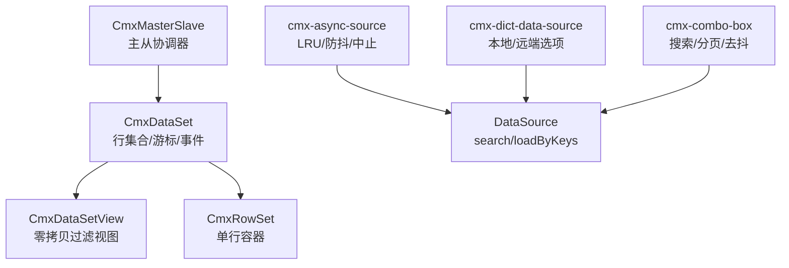
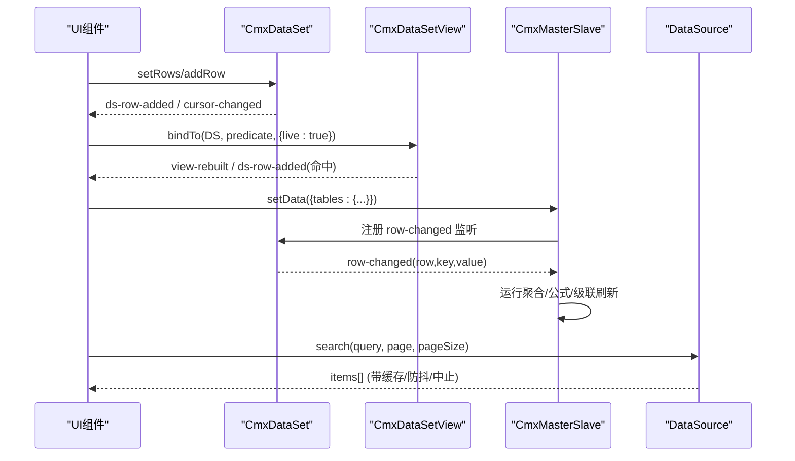
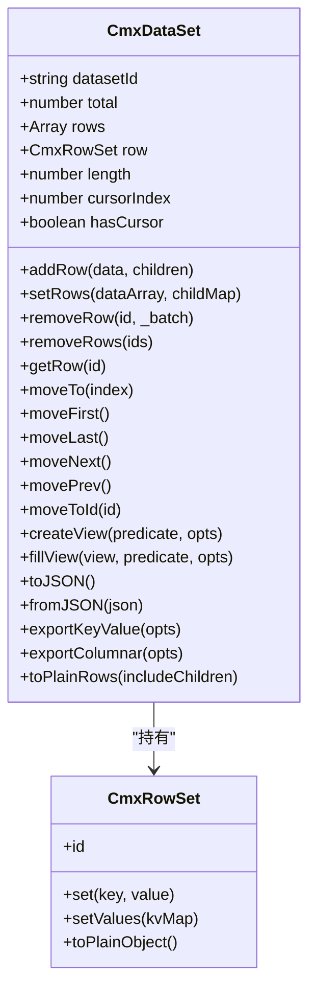
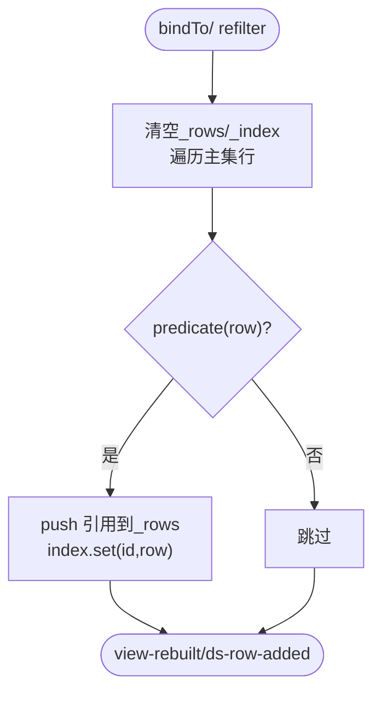
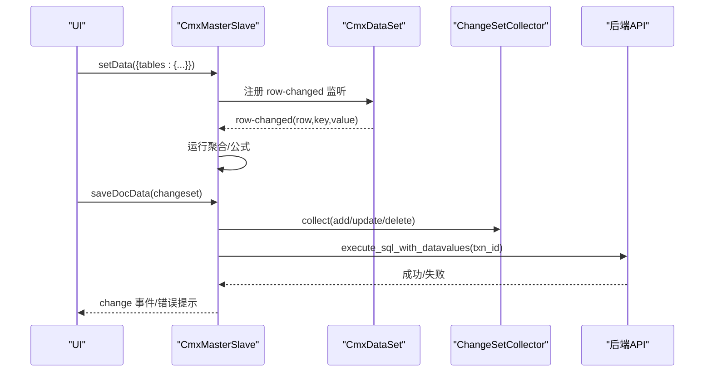
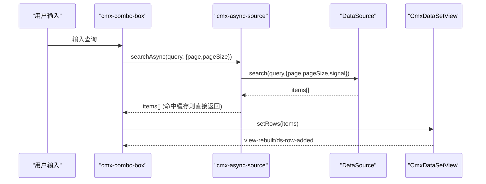
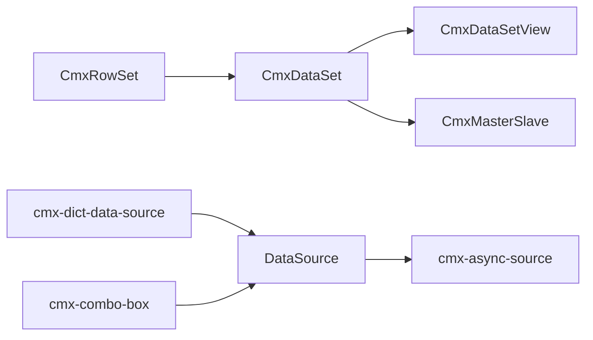

# 数据集管理 (CmxDataSet)

<cite>
**本文引用的文件**
- [cmx-data-set.js](file://packages/cmx-data-comp/src/lib/cmx-data-set.js)
- [cmx-row-set.js](file://packages/cmx-data-comp/src/lib/cmx-row-set.js)
- [cmx-data-set-view.js](file://packages/cmx-data-comp/src/lib/cmx-data-set-view.js)
- [cmx-master-slave.js](file://packages/cmx-data-comp/src/lib/cmx-master-slave.js)
- [cmx-async-source.js](file://packages/cmx-data-comp/src/lib/cmx-async-source.js)
- [cmx-dict-data-source.js](file://packages/cmx-data-comp/src/lib/cmx-dict-data-source.js)
- [cmx-combo-box.js](file://packages/cmx-data-comp/src/components/cmx-combo-box.js)
- [20260729_lib目录模块总览.md](file://packages/cmx-data-comp/docs/20260729_lib目录模块总览.md)
</cite>

## 目录
1. [简介](#简介)
2. [项目结构](#项目结构)
3. [核心组件](#核心组件)
4. [架构总览](#架构总览)
5. [详细组件分析](#详细组件分析)
6. [依赖关系分析](#依赖关系分析)
7. [性能考量](#性能考量)
8. [故障排查指南](#故障排查指南)
9. [结论](#结论)
10. [附录：使用示例与最佳实践](#附录使用示例与最佳实践)

## 简介
本文件围绕 CmxDataSet 及其生态，系统化说明“数据集”的概念、职责与用法。CmxDataSet 是内存中的多级数据容器，提供行增删改查、游标定位、事件通知、序列化/反序列化、以及过滤视图等能力；配合 CmxMasterSlave 可组织主从多层数据树，结合 DataSource 实现远程加载、缓存、分页与搜索，并通过事件驱动 UI 刷新。本文覆盖：
- 数据加载、缓存、分页、搜索
- 生命周期管理、变更监听、批量操作、事务处理（协调器层）
- 本地/远程/混合数据集的使用方式
- 同步策略、错误处理与性能优化

## 项目结构
与 CmxDataSet 直接相关的核心位于 cmx-data-comp 包的 lib 目录，辅以 master-slave 协调器与 DataSource 工具：
- 数据容器：CmxRowSet（行）、CmxDataSet（集）、CmxDataSetView（过滤视图）
- 多表协调：CmxMasterSlave（主从树、聚合、绑定）
- 远程加载：cmx-async-source（LRU 缓存、防抖、AbortController）
- 字典数据源：cmx-dict-data-source（本地/远端选项）
- 组合框集成：cmx-combo-box（输入搜索、分页、去抖）

图表来源
- [cmx-data-set.js:37-232](file://packages/cmx-data-comp/src/lib/cmx-data-set.js#L37-L232)
- [cmx-data-set-view.js:92-249](file://packages/cmx-data-comp/src/lib/cmx-data-set-view.js#L92-L249)
- [cmx-row-set.js:10-53](file://packages/cmx-data-comp/src/lib/cmx-row-set.js#L10-L53)
- [cmx-master-slave.js:1-85](file://packages/cmx-data-comp/src/lib/cmx-master-slave.js#L1-L85)
- [cmx-async-source.js:10-75](file://packages/cmx-data-comp/src/lib/cmx-async-source.js#L10-L75)
- [cmx-dict-data-source.js:128-154](file://packages/cmx-data-comp/src/lib/cmx-dict-data-source.js#L128-L154)
- [cmx-combo-box.js:1308-1346](file://packages/cmx-data-comp/src/components/cmx-combo-box.js#L1308-L1346)

章节来源
- [20260729_lib目录模块总览.md:28-36](file://packages/cmx-data-comp/docs/20260729_lib目录模块总览.md#L28-L36)

## 核心组件
- CmxRowSet：单行容器，字段以实例属性存储，修改通过 set/setValues 统一上报变更。
- CmxDataSet：行集合，维护 rows/index/cursor/total，支持 addRow/setRows/removeRow/getRow、移动游标、事件派发、序列化/反序列化、导出列式/键值对、创建过滤视图。
- CmxDataSetView：基于 CmxDataSet 的过滤视图，零拷贝引用主集行，支持 live 订阅自动重过滤，对外暴露与 CmxDataSet 同构的事件接口，可直接绑定到表格。
- CmxMasterSlave：主从协调器，组织多层 CmxDataSet 树，绑定表单/表格，执行聚合规则，管理当前选中行级联刷新，并集成数据装载/回存流程。
- cmx-async-source：为 DataSource 提供 LRU 查询缓存、key 缓存、防抖、请求中止等能力。
- cmx-dict-data-source：将本地 options 或远端服务包装成 DataSource，供下拉/选择组件使用。
- cmx-combo-box：组合框组件，封装搜索、分页、去抖与结果渲染，内部使用 DataSource 协议。

章节来源
- [cmx-row-set.js:10-53](file://packages/cmx-data-comp/src/lib/cmx-row-set.js#L10-L53)
- [cmx-data-set.js:37-416](file://packages/cmx-data-comp/src/lib/cmx-data-set.js#L37-L416)
- [cmx-data-set-view.js:92-249](file://packages/cmx-data-comp/src/lib/cmx-data-set-view.js#L92-L249)
- [cmx-master-slave.js:1-85](file://packages/cmx-data-comp/src/lib/cmx-master-slave.js#L1-L85)
- [cmx-async-source.js:10-75](file://packages/cmx-data-comp/src/lib/cmx-async-source.js#L10-L75)
- [cmx-dict-data-source.js:128-154](file://packages/cmx-data-comp/src/lib/cmx-dict-data-source.js#L128-L154)
- [cmx-combo-box.js:1308-1346](file://packages/cmx-data-comp/src/components/cmx-combo-box.js#L1308-L1346)

## 架构总览
CmxDataSet 作为基础数据容器，向上支撑多种消费场景：
- 本地数据：直接 setRows/addRow 构建数据集，配合 CmxDataSetView 做过滤展示。
- 远程数据：通过 DataSource.search/loadByKeys 拉取，借助 cmx-async-source 的缓存与防抖提升体验。
- 主从数据：由 CmxMasterSlave 组织多层数据集，绑定表单/表格，按路径联动刷新。
- 事件驱动：row-changed、ds-row-added/removed、cursor-changed 等事件驱动 UI 更新。

图表来源
- [cmx-data-set.js:82-108](file://packages/cmx-data-comp/src/lib/cmx-data-set.js#L82-L108)
- [cmx-data-set-view.js:120-158](file://packages/cmx-data-comp/src/lib/cmx-data-set-view.js#L120-L158)
- [cmx-master-slave.js:117-167](file://packages/cmx-data-comp/src/lib/cmx-master-slave.js#L117-L167)
- [cmx-async-source.js:56-75](file://packages/cmx-data-comp/src/lib/cmx-async-source.js#L56-L75)

## 详细组件分析

### CmxDataSet：行集合与事件中心
- 数据结构
  - _rows：CmxRowSet 数组
  - _index：Map(id→row)，O(1) 查找
  - _columns：列 key 提示，影响 toJSON 顺序
  - _cursor：当前行索引，-1 表示无定位
  - _total：后端 count_total=true 时返回的总行数（用于分页）
- 行写入
  - addRow：追加一行，建立子数据集挂载，派发 ds-row-added
  - setRows：批量覆盖，重置索引与游标，派发 cursor-changed
  - removeRow/removeRows：删除单行/批量删除，维护游标一致性，派发 ds-row-removed 与 cursor-changed
- 读取与游标
  - getRow(rows/row/length)：便捷访问
  - moveTo/moveFirst/moveLast/moveNext/movePrev/moveToId：游标导航
  - isFirst/isLast/hasCursor：状态判断
- 变更通知
  - _notifyChange：由 CmxRowSet.set 触发，派发 row-changed
- 过滤视图
  - createView/fillView：创建或复用 CmxDataSetView，支持 live 模式自动同步
- 序列化与转换
  - toJSON/fromJSON：含 childRows 的多层结构
  - exportKeyValue/exportColumnar：两种导出格式
  - toPlainRows：导出纯对象数组（可选包含子层）
  - toMasterSlaveWrap/inputFromMap/fromMasterSlaveData：与主从协调器互转

图表来源
- [cmx-data-set.js:37-416](file://packages/cmx-data-comp/src/lib/cmx-data-set.js#L37-L416)
- [cmx-row-set.js:10-53](file://packages/cmx-data-comp/src/lib/cmx-row-set.js#L10-L53)

章节来源
- [cmx-data-set.js:37-416](file://packages/cmx-data-comp/src/lib/cmx-data-set.js#L37-L416)
- [cmx-row-set.js:10-53](file://packages/cmx-data-comp/src/lib/cmx-row-set.js#L10-L53)

### CmxDataSetView：零拷贝过滤视图
- 设计要点
  - _rows 仅保存主集 CmxRowSet 引用，不复制字段数据
  - 写操作委托给主集，避免破坏数据所有权
  - 支持 live 模式：订阅主集的 ds-row-added/removed/row-changed，自动重过滤
- 关键方法
  - bindTo(master, predicate, opts)：绑定主集与过滤条件，重建引用
  - setFilter/refilter：动态调整过滤条件并重建
  - dispose：解绑主集监听，释放引用，防止内存泄漏
- 事件兼容
  - 对外派发与 CmxDataSet 同构的事件（ds-row-added/removed、row-changed、cursor-changed），可直接被 grid 消费

图表来源
- [cmx-data-set-view.js:120-158](file://packages/cmx-data-comp/src/lib/cmx-data-set-view.js#L120-L158)

章节来源
- [cmx-data-set-view.js:92-249](file://packages/cmx-data-comp/src/lib/cmx-data-set-view.js#L92-L249)

### CmxMasterSlave：主从协调器与事务处理
- 职责
  - 组织多层 CmxDataSet 树（每个 row 可挂 _children）
  - 绑定表单/表格（bindForm/bindTable），维护 path → 当前 id
  - 监听单元格/行变更，运行聚合规则，回写目标字段
  - 支持 setData 嵌套树或平铺多表 defineRelation
- 聚合与公式
  - 内置 sum/avg/min/max/count 等聚合函数
  - 通过 ColumnModel 在 row-changed 时执行 calcFormula
- 事务与回存
  - 通过 ChangeSetCollector 累积增删改，saveDocData 进行合并/替换提交
  - 后端采用事务内逐层 UPSERT/DELETE，保证一致性

图表来源
- [cmx-master-slave.js:1-85](file://packages/cmx-data-comp/src/lib/cmx-master-slave.js#L1-L85)
- [cmx-master-slave.js:117-167](file://packages/cmx-data-comp/src/lib/cmx-master-slave.js#L117-L167)

章节来源
- [cmx-master-slave.js:1-200](file://packages/cmx-data-comp/src/lib/cmx-master-slave.js#L1-L200)

### 数据加载、缓存、分页与搜索
- 远程加载
  - DataSource.search(query, {page, pageSize, signal}) 返回 items[]
  - cmx-async-source 提供 LRU 查询缓存、key 缓存、防抖、AbortController 中止上一次请求
- 分页
  - CmxDataSet.total 来自后端 count_total=true 的回传，用于计算页码
  - 组合框在用户输入时重置到第 1 页，避免跨页错乱
- 搜索
  - 声明式条件 buildPredicate 支持 eq/ne/gt/ge/lt/le/in/nin/contains/startsWith/endsWith/between/empty/notEmpty/expr
  - 组合框内部对 fields 或全字段进行本地模糊匹配，再调用远端 search

图表来源
- [cmx-async-source.js:56-75](file://packages/cmx-data-comp/src/lib/cmx-async-source.js#L56-L75)
- [cmx-combo-box.js:1308-1346](file://packages/cmx-data-comp/src/components/cmx-combo-box.js#L1308-L1346)

章节来源
- [cmx-async-source.js:10-75](file://packages/cmx-data-comp/src/lib/cmx-async-source.js#L10-L75)
- [cmx-combo-box.js:1308-1346](file://packages/cmx-data-comp/src/components/cmx-combo-box.js#L1308-L1346)
- [cmx-data-set-view.js:32-77](file://packages/cmx-data-comp/src/lib/cmx-data-set-view.js#L32-L77)

### 数据同步策略与事件模型
- 主集与视图
  - 视图通过 live 订阅主集事件，自动维护成员资格；非 live 时需手动 refilter
- 主从协调
  - 协调器在 setDataSet 时递归给每个 CmxDataSet 注册 row-changed 监听，携带完整路径，无需冒泡推断
- 事件类型
  - ds-row-added/ds-row-removed：行增删
  - row-changed：字段变更
  - cursor-changed：游标变化
  - view-rebuilt：视图重建完成

章节来源
- [cmx-data-set.js:195-207](file://packages/cmx-data-comp/src/lib/cmx-data-set.js#L195-L207)
- [cmx-data-set-view.js:164-211](file://packages/cmx-data-comp/src/lib/cmx-data-set-view.js#L164-L211)
- [cmx-master-slave.js:117-167](file://packages/cmx-data-comp/src/lib/cmx-master-slave.js#L117-L167)

### 批量操作与事务处理
- 批量删除
  - removeRows 内部循环 removeRow(true)，统一派发一次 cursor-changed，减少事件风暴
- 事务
  - 前端通过 ChangeSetCollector 收集变更，后端在一个事务中逐层 UPSERT/DELETE，任一失败整体回滚
  - 大事务 atomic=true 时，整批失败全部回滚；atomic=false 时逐单独立事务

章节来源
- [cmx-data-set.js:137-148](file://packages/cmx-data-comp/src/lib/cmx-data-set.js#L137-L148)
- [20260729_lib目录模块总览.md:98-113](file://packages/cmx-data-comp/docs/20260729_lib目录模块总览.md#L98-L113)

## 依赖关系分析
- CmxDataSet 依赖 CmxRowSet 作为行载体
- CmxDataSetView 继承自 CmxDataSet，延迟注册以避免循环依赖
- CmxMasterSlave 依赖 CmxDataSet 组织多层数据，并绑定 UI 组件
- DataSource 抽象由 cmx-async-source 增强，cmx-dict-data-source 提供本地/远端实现
- cmx-combo-box 使用 DataSource 协议进行搜索与分页

图表来源
- [cmx-data-set.js:25-35](file://packages/cmx-data-comp/src/lib/cmx-data-set.js#L25-L35)
- [cmx-data-set-view.js:28-35](file://packages/cmx-data-comp/src/lib/cmx-data-set-view.js#L28-L35)
- [cmx-master-slave.js:1-85](file://packages/cmx-data-comp/src/lib/cmx-master-slave.js#L1-L85)
- [cmx-async-source.js:10-75](file://packages/cmx-data-comp/src/lib/cmx-async-source.js#L10-L75)
- [cmx-dict-data-source.js:128-154](file://packages/cmx-data-comp/src/lib/cmx-dict-data-source.js#L128-L154)
- [cmx-combo-box.js:1308-1346](file://packages/cmx-data-comp/src/components/cmx-combo-box.js#L1308-L1346)

## 性能考量
- 零拷贝视图：CmxDataSetView 仅保存行引用，内存占用与字段宽度无关
- 快速路径：fromJSON 批量构造时跳过事件与列扫描，利用 V8 fast-shape 提升解析速度
- 缓存与防抖：cmx-async-source 的 LRU 查询缓存与 key 缓存减少重复请求；debounce 降低高频输入带来的网络压力
- 事件合并：批量删除统一派发 cursor-changed，减少 UI 重绘次数
- 分页：后端 count_total=true 时设置 total，前端据此计算页码，避免全量加载

章节来源
- [cmx-data-set-view.js:1-26](file://packages/cmx-data-comp/src/lib/cmx-data-set-view.js#L1-L26)
- [cmx-data-set.js:372-410](file://packages/cmx-data-comp/src/lib/cmx-data-set.js#L372-L410)
- [cmx-async-source.js:10-75](file://packages/cmx-data-comp/src/lib/cmx-async-source.js#L10-L75)
- [cmx-data-set.js:137-148](file://packages/cmx-data-comp/src/lib/cmx-data-set.js#L137-L148)

## 故障排查指南
- 视图未生效
  - 检查是否调用 bindTo 且 live=true；必要时调用 refilter/resetCursor
  - 确认 predicate 编译正确，避免空条件导致误判
- 行无法删除
  - 确保主键类型一致（String化 key），避免 Map 查找失败
- 事件风暴
  - 使用 removeRows 批量删除，减少 cursor-changed 频率
- 内存泄漏
  - 页面销毁时调用 CmxDataSetView.dispose 与 CmxMasterSlave.destroy，解绑监听
- 搜索卡顿
  - 启用 debounceMs 与 pageSize 控制；合理设置 cacheSize

章节来源
- [cmx-data-set-view.js:120-158](file://packages/cmx-data-comp/src/lib/cmx-data-set-view.js#L120-L158)
- [cmx-data-set.js:110-148](file://packages/cmx-data-comp/src/lib/cmx-data-set.js#L110-L148)
- [cmx-async-source.js:37-75](file://packages/cmx-data-comp/src/lib/cmx-async-source.js#L37-L75)
- [cmx-master-slave.js:141-167](file://packages/cmx-data-comp/src/lib/cmx-master-slave.js#L141-L167)

## 结论
CmxDataSet 提供了高性能、可扩展的数据集能力，结合 CmxDataSetView 的零拷贝过滤、CmxMasterSlave 的主从协调与事件驱动机制，能够高效支撑本地、远程与混合数据场景。通过 DataSource 的缓存、防抖与分页，以及后端的批量事务处理，系统在交互体验与数据一致性之间取得良好平衡。建议在实际项目中遵循本文的最佳实践，合理使用视图、事件与批量操作，以获得稳定与高效的业务表现。

## 附录：使用示例与最佳实践

### 本地数据集
- 直接 setRows/addRow 构建数据，配合 CmxDataSetView 做过滤展示
- 使用 columnKeys 控制导出顺序，toJSON/fromJSON 持久化

章节来源
- [cmx-data-set.js:82-108](file://packages/cmx-data-comp/src/lib/cmx-data-set.js#L82-L108)
- [cmx-data-set.js:307-410](file://packages/cmx-data-comp/src/lib/cmx-data-set.js#L307-L410)

### 远程数据集
- 实现 DataSource.search/loadByKeys，使用 cmx-async-source 获取缓存与防抖
- 组合框中根据用户输入触发搜索，重置到第 1 页，渲染结果到内部数据集

章节来源
- [cmx-async-source.js:56-75](file://packages/cmx-data-comp/src/lib/cmx-async-source.js#L56-L75)
- [cmx-combo-box.js:1308-1346](file://packages/cmx-data-comp/src/components/cmx-combo-box.js#L1308-L1346)

### 混合数据集
- 先加载本地基础数据，再通过 DataSource 增量补充（如字典项、关联数据）
- 使用 CmxDataSetView 对不同来源的行进行统一过滤与展示

章节来源
- [cmx-dict-data-source.js:128-154](file://packages/cmx-data-comp/src/lib/cmx-dict-data-source.js#L128-L154)
- [cmx-data-set-view.js:120-158](file://packages/cmx-data-comp/src/lib/cmx-data-set-view.js#L120-L158)

### 主从数据与事务
- 使用 CmxMasterSlave 组织多层数据集，绑定表单/表格
- 通过 ChangeSetCollector 收集变更，后端在一个事务中提交，保证一致性

章节来源
- [cmx-master-slave.js:1-85](file://packages/cmx-data-comp/src/lib/cmx-master-slave.js#L1-L85)
- [20260729_lib目录模块总览.md:98-113](file://packages/cmx-data-comp/docs/20260729_lib目录模块总览.md#L98-L113)