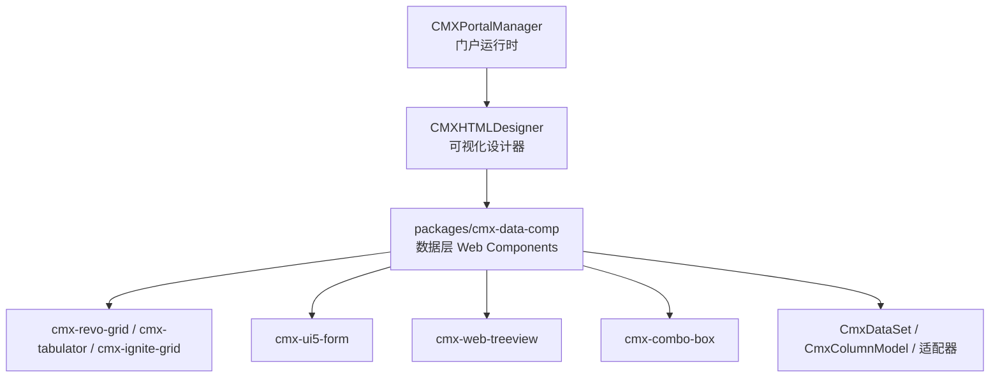
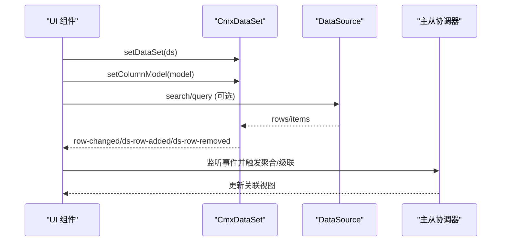
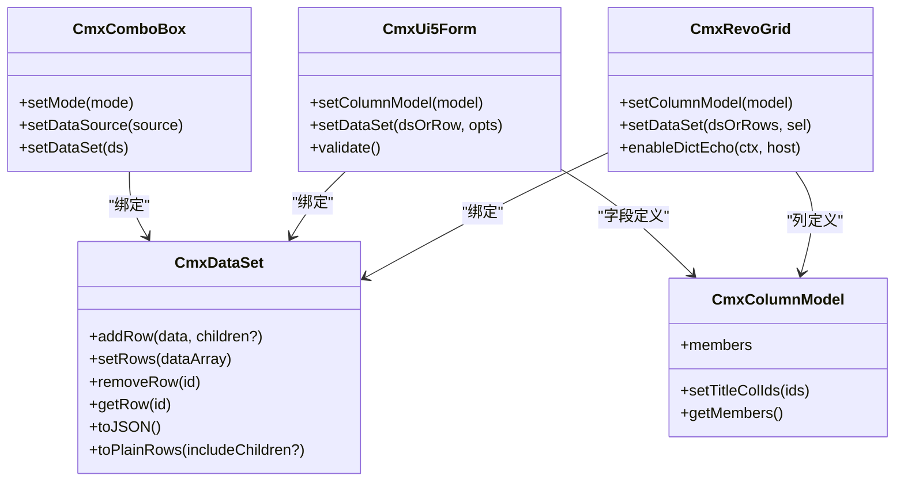

# 绑定模式示例

<cite>
**本文引用的文件**
- [README.md](file://README.md)
- [combo-box.md](file://.agents/skills/cmx-components-guide/references/combo-box.md)
- [grid-components.md](file://.agents/skills/cmx-components-guide/references/grid-components.md)
- [form-components.md](file://.agents/skills/cmx-components-guide/references/form-components.md)
- [treeview.md](file://.agents/skills/cmx-components-guide/references/treeview.md)
- [data-source-patterns.md](file://.agents/skills/cmx-components-guide/references/data-source-patterns.md)
- [cmx-data-set.js](file://packages/cmx-data-comp/src/lib/cmx-data-set.js)
- [cmx-column-adapter.js](file://packages/cmx-data-comp/src/lib/cmx-column-adapter.js)
- [model-dataset.md](file://.agents/skills/html-page-generator/references/model-dataset.md)
</cite>

## 目录
1. [简介](#简介)
2. [项目结构](#项目结构)
3. [核心组件与数据模型](#核心组件与数据模型)
4. [架构总览](#架构总览)
5. [详细场景与实现示例](#详细场景与实现示例)
6. [依赖关系分析](#依赖关系分析)
7. [性能考虑](#性能考虑)
8. [常见问题排查](#常见问题排查)
9. [结论](#结论)
10. [附录：配置速查](#附录：配置速查)

## 简介
本文件面向企业级前端页面，围绕“元数据驱动 + Web Components”的数据绑定体系，提供表格展示、表单编辑、树形结构、组合框（下拉/树/网格）等典型业务场景的完整绑定示例。内容涵盖：
- 使用场景与适用性
- 配置方法与关键属性
- 事件与交互流程
- 常见陷阱与性能优化建议
- 运行效果说明与排错指引

## 项目结构
本项目为 monorepo，包含门户运行时、可视化设计器以及数据层 Web Components。数据绑定能力集中在 packages/cmx-data-comp 中，通过 CmxDataSet、CmxColumnModel 与多种 UI 组件（表格、表单、树、组合框）协作完成。

图表来源
- [README.md:1-73](file://README.md#L1-L73)

章节来源
- [README.md:1-73](file://README.md#L1-L73)

## 核心组件与数据模型
- CmxDataSet：多级数据集，支持行增删改、子表嵌套、视图投影、事件通知（row-changed、ds-row-added、ds-row-removed、cursor-changed）。
- CmxColumnModel：列模型定义，统一描述字段类型、显示格式、编辑模式、分组与合计等；可被 form/grid 消费。
- 适配器：将 CmxColumnModel 转换为具体组件所需列定义（如 revo-grid、ui5-form）。
- 数据源适配器：统一的 DataSource 契约（search/loadByKeys），支持 REST、pageServices、内存三种变体，并提供缓存、防抖、中断能力。

章节来源
- [cmx-data-set.js:1-269](file://packages/cmx-data-comp/src/lib/cmx-data-set.js#L1-L269)
- [cmx-column-adapter.js:1-200](file://packages/cmx-data-comp/src/lib/cmx-column-adapter.js#L1-L200)
- [data-source-patterns.md:1-245](file://.agents/skills/cmx-components-guide/references/data-source-patterns.md#L1-L245)

## 架构总览
数据从后端或内存经 DataSource 加载到 CmxDataSet，再由各 UI 组件通过 setColumnModel/setDataSet 进行绑定渲染；编辑变更通过事件回写 DataSet，主从协调器可联动聚合与级联。

图表来源
- [data-source-patterns.md:1-245](file://.agents/skills/cmx-components-guide/references/data-source-patterns.md#L1-L245)
- [form-components.md:93-167](file://.agents/skills/cmx-components-guide/references/form-components.md#L93-L167)

## 详细场景与实现示例

### 场景一：表格数据展示（列表/树表/分页/合计）
- 适用场景：大数据量列表、树形层级展示、需要合计统计、远程分页。
- 推荐组件：
  - 通用列表首选 cmx-revo-grid（虚拟滚动、列拉伸、字典回显、操作列）。
  - 树表备选 cmx-tabulator（内置 dataTree、列拖拽、本地/远程分页）。
  - Ignite 体系内可用 cmx-ignite-grid。
- 绑定方式：
  - 声明式：data-cmx-model-id + data-cmx-options + data-cmx-fill-height。
  - 命令式：setColumnModel(model) + setDataSet(dsOrRows, sel)。
- 关键配置要点：
  - 列宽：px/百分比/flex/对象形式，配合 stretch 控制自适应。
  - 合计：showTotals 自动汇总数值列，或自定义 totals。
  - 字典回显：enableDictEcho 预加载字典条目，id→名称映射。
  - 操作列：display.mode='actions'，按行状态 visible 函数控制按钮显隐。
- 事件与交互：
  - cmx-cell-changed：单元格编辑完成。
  - cmx-row-selected / cmx-row-selection-change：选择变化。
  - cmx-cell-invalid：校验失败提示。
- 运行效果说明：
  - 列表：首屏快速渲染，滚动流畅；合计行自动计算；点击操作列按钮触发业务逻辑。
  - 树表：节点展开/折叠保持展开态快照；支持层级缩进与图标。
- 注意事项：
  - 列模型必须来自 CmxColumnModel；避免直接设置 columns。
  - 百分比列与冻结列共存时，冻结列不参与拉伸。
  - 字典回显需确保 refDict 坐标正确，否则可能降级为 id 显示。

章节来源
- [grid-components.md:12-123](file://.agents/skills/cmx-components-guide/references/grid-components.md#L12-L123)
- [grid-components.md:190-234](file://.agents/skills/cmx-components-guide/references/grid-components.md#L190-L234)
- [grid-components.md:238-321](file://.agents/skills/cmx-components-guide/references/grid-components.md#L238-L321)
- [grid-components.md:390-441](file://.agents/skills/cmx-components-guide/references/grid-components.md#L390-L441)

### 场景二：表单数据编辑（单行编辑/校验/主从联动）
- 适用场景：单据头信息编辑、条件必填、引用字段回显、主从聚合。
- 推荐组件：cmx-ui5-form（基于 UI5 Form）。
- 绑定方式：
  - 声明式：data-cmx-model-id + data-cmx-master-slave-id + data-cmx-dataset-id。
  - 命令式：setColumnModel(model) + setDataSet(dsOrRow, opts)。
- 关键配置要点：
  - 字段类型由 field.type（源自 edit.mode）决定编辑器映射。
  - 校验：required/requiredWhen/validate/validateWhen/requiredMessage/validateMessage。
  - 主从协调器：cmx-master-slave-config 声明 schema/aggregations/relations/dataSources/initialData。
- 事件与交互：
  - cmx-ui5-form-changed：字段值提交。
  - cmx-ui5-form-invalid：校验失败返回 errors。
  - cmx-ms-ready：协调器就绪后可执行提交前校验与导出。
- 运行效果说明：
  - 表单根据列模型动态生成字段布局；校验失败标红并提示；主从联动自动聚合明细金额至头部。
- 注意事项：
  - 字段跨列 colspan/columnSpan 与分组 group 可提升可读性。
  - ref-display 字段依赖 dataSources 解析关联值。
  - 主从模式下，DataSet 由协调器管理，避免在 DOM 重复绑定 dataset-id。

章节来源
- [form-components.md:13-90](file://.agents/skills/cmx-components-guide/references/form-components.md#L13-L90)
- [form-components.md:93-167](file://.agents/skills/cmx-components-guide/references/form-components.md#L93-L167)
- [form-components.md:218-294](file://.agents/skills/cmx-components-guide/references/form-components.md#L218-L294)
- [model-dataset.md:175-229](file://.agents/skills/html-page-generator/references/model-dataset.md#L175-L229)

### 场景三：树形结构数据（组织树/分类树/权限树）
- 适用场景：层级导航、节点拖拽、角标计数、懒加载。
- 推荐组件：cmx-web-treeview。
- 绑定方式：
  - setDataSet(ds) + setColumnModel(model)。
  - 通过 id-member/path-member/parent-path-member/display-value-member 等属性映射字段。
- 关键配置要点：
  - 显示文本：display-value-member 或由 model.getTitleColIds() 拼接。
  - 图标：icon-member 或 model.iconCol。
  - 角标：badge-member，值 > 0 显示蓝色气泡。
  - 选中态：is-selected-member。
  - 加载态：children-loading-member。
- 事件与交互：
  - node-clicked：节点点击（默认同步 DataSet 游标，可关闭）。
  - selected-node-changed：选中变化。
  - tree-changed：结构变化。
- 运行效果说明：
  - 树节点支持展开/折叠、搜索过滤、滚动高亮；刷新时保持展开路径。
- 注意事项：
  - 扁平数据可通过 parent-path-member 构建层级。
  - 大数据量建议使用虚拟滚动与渐进渲染参数。

章节来源
- [treeview.md:1-169](file://.agents/skills/cmx-components-guide/references/treeview.md#L1-L169)

### 场景四：组合框数据绑定（下拉/树/网格选择）
- 适用场景：枚举选择、远端搜索、树选择、网格多选。
- 推荐组件：cmx-combo-box（list/tree/grid 三种弹出模式）。
- 绑定方式：
  - 独立使用：setDataSet(ds)/setColumnModel(model) + setMode('list'|'tree'|'grid') + setValue/getValue。
  - 集成 form/grid 编辑器：field-type='combo'，读取 editSettings.source/dropdown/parentField/dropdownColumns。
- 关键配置要点：
  - list：隐藏表头、单列标题拼接（优先 titleColIds）。
  - tree：parentField 决定父子关系；path 优先级：行自带 path > 按 parentField 回溯 > 平铺根节点。
  - grid：完整列显示、支持分页。
  - 远端数据：setDataSource(source)，source 需实现 search/loadByKeys/keyField/labelField。
- 事件与交互：
  - cmx-combo-value-change：选中变化，detail 含 id 与 row。
- 运行效果说明：
  - 输入搜索即时过滤；树模式支持层级展开；网格模式可多列展示与分页。
- 注意事项：
  - 远端搜索需透传 signal 以支持中断；pageSize 要足够大以避免批量回显截断。
  - 内存数据源务必设置 items，否则每次都会走远程，性能差。

章节来源
- [combo-box.md:1-51](file://.agents/skills/cmx-components-guide/references/combo-box.md#L1-L51)
- [combo-box.md:177-232](file://.agents/skills/cmx-components-guide/references/combo-box.md#L177-L232)
- [data-source-patterns.md:1-245](file://.agents/skills/cmx-components-guide/references/data-source-patterns.md#L1-L245)

### 场景五：数据源适配（REST/pageServices/内存）
- 适用场景：下拉/组合框/异步搜索组件的数据获取。
- 标准契约：
  - search(query, opts)：返回 items[]，opts 含 page/pageSize/signal。
  - loadByKeys(keys)：批量按 key 加载。
- 工厂与工具：
  - createDictDataSource(host, def)：统一封装 service 调用、响应取值、transform。
  - searchAsync/lookupByKeyAsync：LRU 缓存、AbortController 中断、keyCache 填充。
  - debounceForSource：同一 source 共享定时器，防抖输入。
- 运行效果说明：
  - 快速输入不会堆积请求；命中缓存立即返回；批量回显不截断。
- 注意事项：
  - 字典接口通常返回 id 而非 code，需显式 keyField:'id'。
  - loadByKeys 的 pageSize 应取 Math.max(minPageSizeForKeys, keys.length)。

章节来源
- [data-source-patterns.md:1-245](file://.agents/skills/cmx-components-guide/references/data-source-patterns.md#L1-L245)

## 依赖关系分析
- 组件与数据模型耦合点：
  - 表格/表单/树/组合框均依赖 CmxColumnModel 描述列结构与行为。
  - 所有 UI 组件通过 setDataSet 绑定 CmxDataSet，利用其事件机制实现双向联动。
- 适配器职责：
  - cmx-column-adapter 将 CmxColumnModel 转换为不同组件所需的列定义（revo-grid、ui5-form、ag-grid）。
- 数据源抽象：
  - DataSource 契约解耦后端实现，便于替换 REST/pageServices/内存数据源。

图表来源
- [grid-components.md:49-64](file://.agents/skills/cmx-components-guide/references/grid-components.md#L49-L64)
- [form-components.md:20-35](file://.agents/skills/cmx-components-guide/references/form-components.md#L20-L35)
- [combo-box.md:41-51](file://.agents/skills/cmx-components-guide/references/combo-box.md#L41-L51)
- [cmx-data-set.js:1-269](file://packages/cmx-data-comp/src/lib/cmx-data-set.js#L1-L269)

章节来源
- [cmx-column-adapter.js:1-200](file://packages/cmx-data-comp/src/lib/cmx-column-adapter.js#L1-L200)
- [grid-components.md:49-64](file://.agents/skills/cmx-components-guide/references/grid-components.md#L49-L64)
- [form-components.md:20-35](file://.agents/skills/cmx-components-guide/references/form-components.md#L20-L35)
- [combo-box.md:41-51](file://.agents/skills/cmx-components-guide/references/combo-box.md#L41-L51)

## 性能考虑
- 虚拟滚动：表格启用 virtualScroll，减少首屏渲染压力。
- 列宽策略：合理使用百分比与 flex，避免频繁重排；冻结列不参与拉伸。
- 字典回显：enableDictEcho 预加载字典条目，避免逐行远程查询。
- 数据源缓存：searchAsync/lookupByKeyAsync 使用 LRU 缓存与 keyCache，降低重复请求。
- 防抖与中断：debounceForSource 与 AbortController 防止输入抖动与请求堆积。
- 主从聚合：仅在必要时机触发 aggregations，避免频繁重算。
- 树节点展开态：刷新时保持展开路径快照，减少用户操作成本。

[本节为通用指导，无需特定文件来源]

## 常见问题排查
- 表格未显示数据：
  - 检查是否已调用 setColumnModel 与 setDataSet；确认列模型 members 与数据字段一致。
  - 若使用 data-cmx-model-id，确认 init-page-models 阶段已注入。
- 字典外键未回显：
  - 确认列 refDict 坐标正确；调用 enableDictEcho 后刷新。
- 组合框远端搜索无结果：
  - 检查 DataSource 的 keyField/labelField 是否与后端一致；确保 search 透传 signal。
  - 内存数据源需设置 items，否则每次都走远程。
- 表单校验不生效：
  - 确认字段配置了 required/validate 及 validateWhen；监听 cmx-ui5-form-invalid。
- 主从联动异常：
  - 检查 cmx-master-slave-config 的 relations 与 aggregations 配置；确认 selector 与 dataset-id 绑定。
- 树节点展开态丢失：
  - 刷新数据时保存展开路径并在渲染后恢复。

章节来源
- [grid-components.md:93-123](file://.agents/skills/cmx-components-guide/references/grid-components.md#L93-L123)
- [data-source-patterns.md:236-245](file://.agents/skills/cmx-components-guide/references/data-source-patterns.md#L236-L245)
- [form-components.md:37-54](file://.agents/skills/cmx-components-guide/references/form-components.md#L37-L54)
- [form-components.md:93-167](file://.agents/skills/cmx-components-guide/references/form-components.md#L93-L167)
- [treeview.md:162-169](file://.agents/skills/cmx-components-guide/references/treeview.md#L162-L169)

## 结论
通过 CmxDataSet + CmxColumnModel 的统一数据与列模型抽象，结合 cmx-revo-grid、cmx-ui5-form、cmx-web-treeview、cmx-combo-box 等组件，可在企业级应用中高效实现表格、表单、树、组合框等多种数据绑定场景。借助数据源适配器与主从协调器，既能满足复杂业务需求，又能保证性能与可维护性。

[本节为总结，无需特定文件来源]

## 附录：配置速查
- 表格（cmx-revo-grid）
  - 声明式：data-cmx-model-id、data-cmx-options、data-cmx-fill-height。
  - 命令式：setColumnModel(model)、setDataSet(dsOrRows, sel)。
  - 合计：showTotals 或自定义 totals。
  - 字典回显：enableDictEcho(ctx, host)。
- 表单（cmx-ui5-form）
  - 声明式：data-cmx-model-id、data-cmx-master-slave-id、data-cmx-dataset-id。
  - 命令式：setColumnModel(model)、setDataSet(dsOrRow, opts)。
  - 校验：validate() 返回 { valid, errors }。
- 树（cmx-web-treeview）
  - 属性：id-member、path-member、parent-path-member、display-value-member、icon-member、badge-member。
  - 方法：expandAll/collapseAll/filterNodes/scrollToPath。
- 组合框（cmx-combo-box）
  - 模式：setMode('list'|'tree'|'grid')。
  - 数据：setDataSet(ds)/setDataSource(source)。
  - 事件：cmx-combo-value-change。
- 数据源（DataSource）
  - 契约：search(query, opts)、loadByKeys(keys)。
  - 工具：createDictDataSource、searchAsync、lookupByKeyAsync、debounceForSource。

章节来源
- [grid-components.md:79-123](file://.agents/skills/cmx-components-guide/references/grid-components.md#L79-L123)
- [form-components.md:55-90](file://.agents/skills/cmx-components-guide/references/form-components.md#L55-L90)
- [treeview.md:27-119](file://.agents/skills/cmx-components-guide/references/treeview.md#L27-L119)
- [combo-box.md:41-51](file://.agents/skills/cmx-components-guide/references/combo-box.md#L41-L51)
- [data-source-patterns.md:1-245](file://.agents/skills/cmx-components-guide/references/data-source-patterns.md#L1-L245)