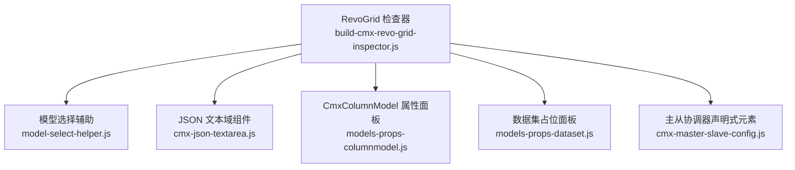
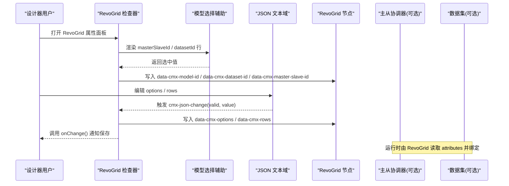
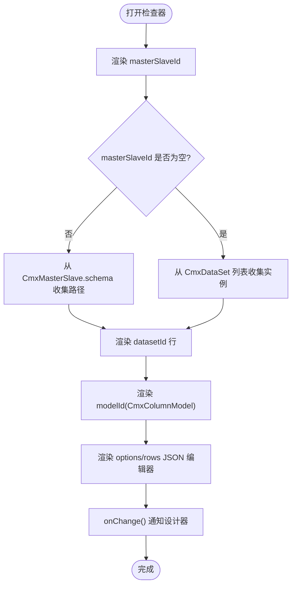
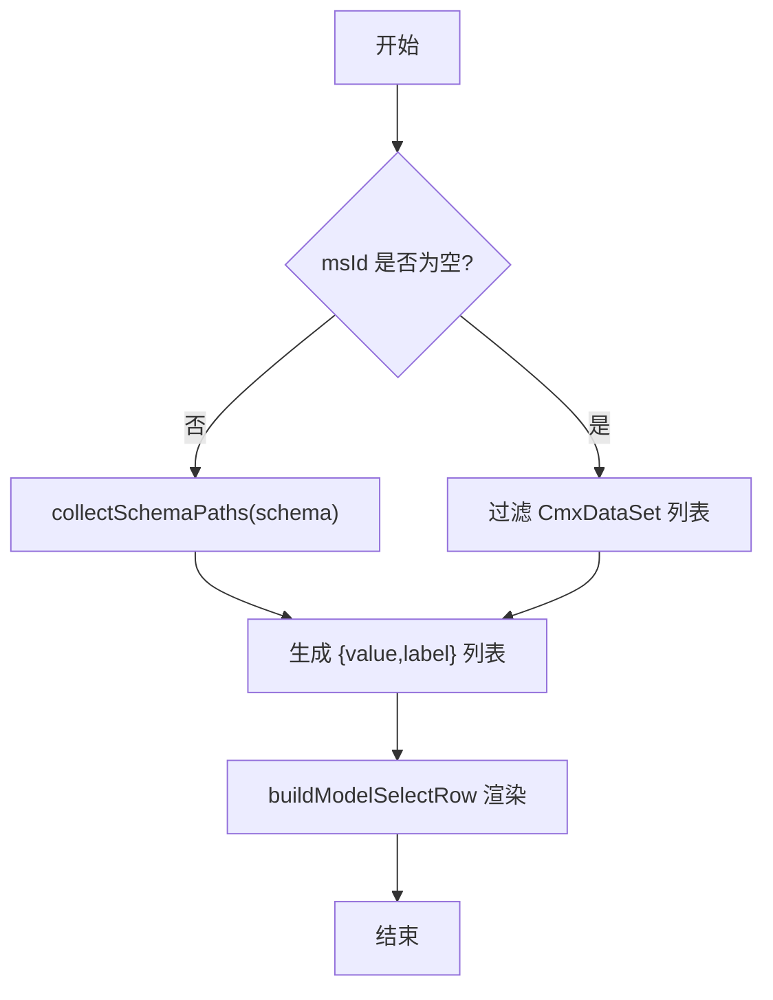
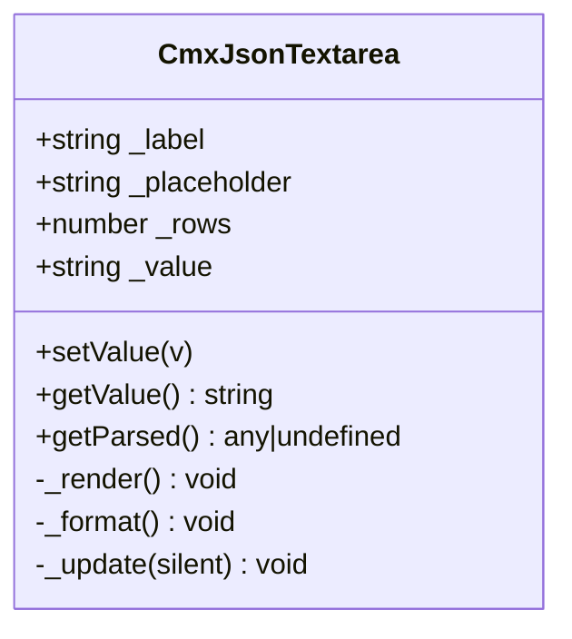
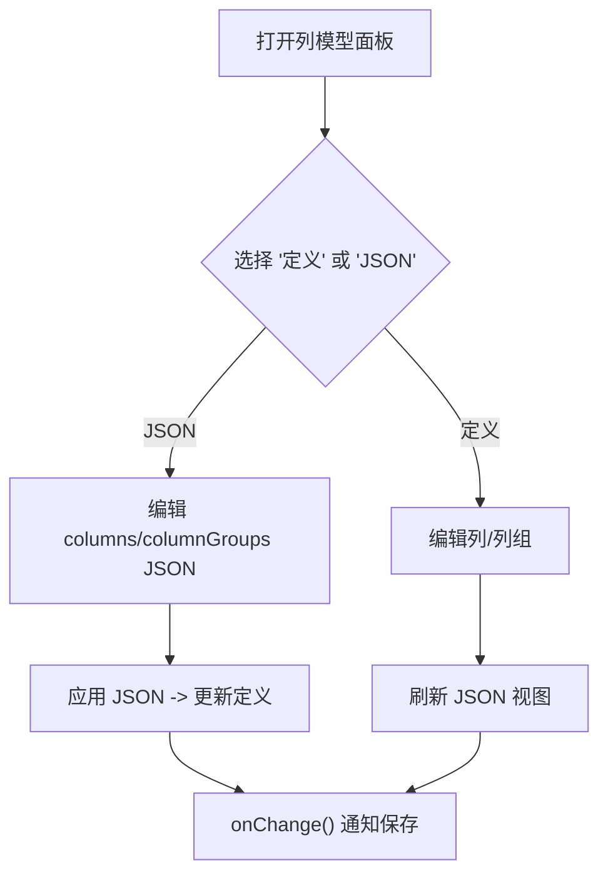
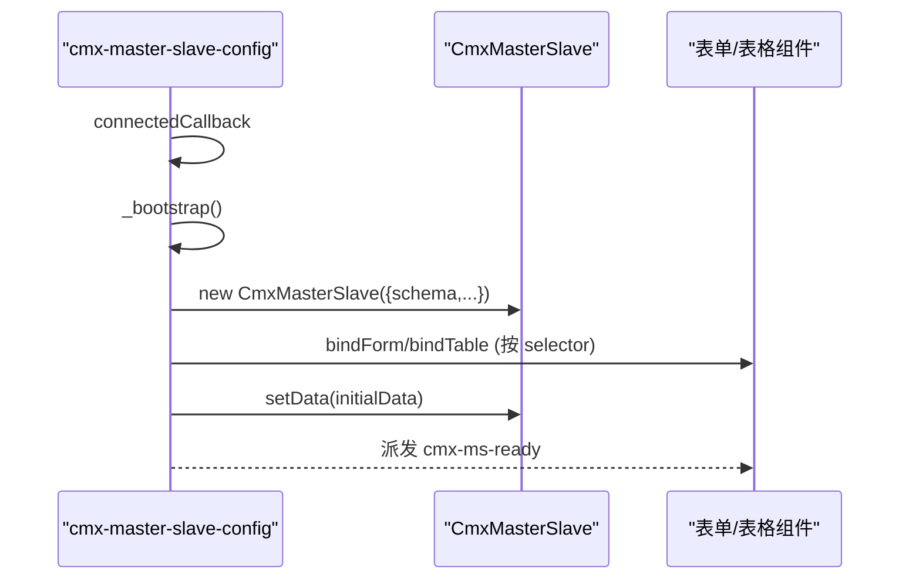
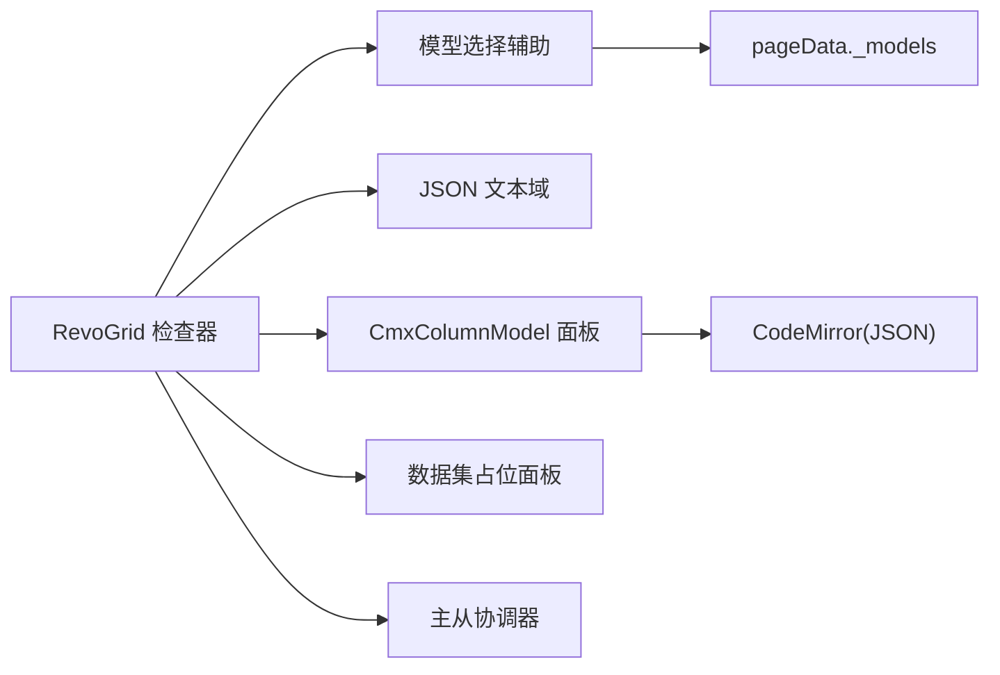
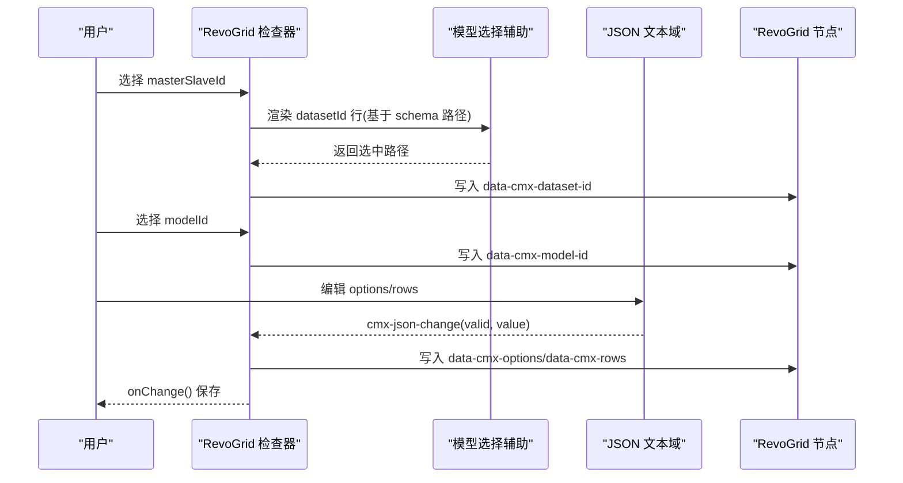

# RevoGrid 检查器开发

<cite>
**本文引用的文件**
- [build-cmx-revo-grid-inspector.js](file://CMXHTMLDesigner/src/plugins/cmx-inspector/build-cmx-revo-grid-inspector.js)
- [model-select-helper.js](file://CMXHTMLDesigner/src/plugins/cmx-inspector/model-select-helper.js)
- [cmx-json-textarea.js](file://CMXHTMLDesigner/src/plugins/cmx-inspector/cmx-json-textarea.js)
- [models-props-columnmodel.js](file://CMXHTMLDesigner/src/components/designer-page-data/models-props-columnmodel.js)
- [models-props-dataset.js](file://CMXHTMLDesigner/src/components/designer-page-data/models-props-dataset.js)
- [cmx-master-slave-config.js](file://packages/cmx-data-comp/src/components/cmx-master-slave-config.js)
</cite>

## 目录
1. [简介](#简介)
2. [项目结构](#项目结构)
3. [核心组件](#核心组件)
4. [架构总览](#架构总览)
5. [详细组件分析](#详细组件分析)
6. [依赖关系分析](#依赖关系分析)
7. [性能考虑](#性能考虑)
8. [故障排查指南](#故障排查指南)
9. [结论](#结论)
10. [附录：完整开发示例](#附录完整开发示例)

## 简介
本文件面向在 CMX 设计器中为 cmx-revo-grid（RevoGrid）构建可视化属性面板与检查器的开发者。文档围绕以下目标展开：
- 列定义绑定：通过 CmxColumnModel 动态生成列配置，支持列分组、聚合、录入控件等。
- 数据集关联：实现 datasetId 的动态绑定与验证，支持直接绑定 CmxDataSet 或从 CmxMasterSlave schema 路径中选择。
- 主从模型集成：将 RevoGrid 与主从协调器结合，按 schema 节点路径进行数据绑定。
- JSON 编辑器：为 options 与 rows 提供带语法高亮、实时校验与错误提示的编辑体验。
- 完整示例：展示如何为复杂表格组件创建可视化属性面板，覆盖选择器、JSON 编辑、状态反馈与变更回写。

## 项目结构
RevoGrid 检查器位于设计器插件体系下，由“检查器构建函数 + 模型选择辅助 + JSON 文本域”三部分协作完成；同时与页面数据区的“列模型属性面板”和“主从协调器声明式元素”紧密耦合。

图表来源
- [build-cmx-revo-grid-inspector.js:1-102](file://CMXHTMLDesigner/src/plugins/cmx-inspector/build-cmx-revo-grid-inspector.js#L1-L102)
- [model-select-helper.js:1-132](file://CMXHTMLDesigner/src/plugins/cmx-inspector/model-select-helper.js#L1-L132)
- [cmx-json-textarea.js:1-139](file://CMXHTMLDesigner/src/plugins/cmx-inspector/cmx-json-textarea.js#L1-L139)
- [models-props-columnmodel.js:1-800](file://CMXHTMLDesigner/src/components/designer-page-data/models-props-columnmodel.js#L1-L800)
- [models-props-dataset.js:1-16](file://CMXHTMLDesigner/src/components/designer-page-data/models-props-dataset.js#L1-L16)
- [cmx-master-slave-config.js:1-126](file://packages/cmx-data-comp/src/components/cmx-master-slave-config.js#L1-L126)

章节来源
- [build-cmx-revo-grid-inspector.js:1-102](file://CMXHTMLDesigner/src/plugins/cmx-inspector/build-cmx-revo-grid-inspector.js#L1-L102)
- [model-select-helper.js:1-132](file://CMXHTMLDesigner/src/plugins/cmx-inspector/model-select-helper.js#L1-L132)
- [cmx-json-textarea.js:1-139](file://CMXHTMLDesigner/src/plugins/cmx-inspector/cmx-json-textarea.js#L1-L139)
- [models-props-columnmodel.js:1-800](file://CMXHTMLDesigner/src/components/designer-page-data/models-props-columnmodel.js#L1-L800)
- [models-props-dataset.js:1-16](file://CMXHTMLDesigner/src/components/designer-page-data/models-props-dataset.js#L1-L16)
- [cmx-master-slave-config.js:1-126](file://packages/cmx-data-comp/src/components/cmx-master-slave-config.js#L1-L126)

## 核心组件
- RevoGrid 检查器构建函数：负责渲染 masterSlaveId、datasetId、modelId 以及 options/rows 的 JSON 编辑器，并将值持久化到 data-cmx-* 属性，触发 onChange 通知设计器保存。
- 模型选择辅助：提供通用下拉+输入行，支持从 pageData._models 中按类型筛选实例；并针对 datasetId 根据是否绑定主从模型动态切换选项来源。
- JSON 文本域组件：封装 ui5-textarea，提供即时 JSON 解析校验、格式化按钮、状态指示与事件上报。
- CmxColumnModel 属性面板：可视化编辑 columns 与 columnGroups，支持复制粘贴、增删改、JSON 同步视图与格式化应用。
- 数据集占位面板：用于说明数据集实例的属性在右侧属性区编辑。
- 主从协调器声明式元素：解析 JSON 配置，创建协调器实例，按 selector 自动绑定表单/表格，派发就绪事件。

章节来源
- [build-cmx-revo-grid-inspector.js:1-102](file://CMXHTMLDesigner/src/plugins/cmx-inspector/build-cmx-revo-grid-inspector.js#L1-L102)
- [model-select-helper.js:1-132](file://CMXHTMLDesigner/src/plugins/cmx-inspector/model-select-helper.js#L1-L132)
- [cmx-json-textarea.js:1-139](file://CMXHTMLDesigner/src/plugins/cmx-inspector/cmx-json-textarea.js#L1-L139)
- [models-props-columnmodel.js:1-800](file://CMXHTMLDesigner/src/components/designer-page-data/models-props-columnmodel.js#L1-L800)
- [models-props-dataset.js:1-16](file://CMXHTMLDesigner/src/components/designer-page-data/models-props-dataset.js#L1-L16)
- [cmx-master-slave-config.js:1-126](file://packages/cmx-data-comp/src/components/cmx-master-slave-config.js#L1-L126)

## 架构总览
RevoGrid 检查器在设计器中作为“属性面板”存在，运行时由 cmx-revo-grid 读取 data-cmx-* 属性并调用相应 API 完成初始化。其关键数据流如下：

图表来源
- [build-cmx-revo-grid-inspector.js:20-101](file://CMXHTMLDesigner/src/plugins/cmx-inspector/build-cmx-revo-grid-inspector.js#L20-L101)
- [model-select-helper.js:88-130](file://CMXHTMLDesigner/src/plugins/cmx-inspector/model-select-helper.js#L88-L130)
- [cmx-json-textarea.js:69-135](file://CMXHTMLDesigner/src/plugins/cmx-inspector/cmx-json-textarea.js#L69-L135)

## 详细组件分析

### RevoGrid 检查器（build-cmx-revo-grid-inspector.js）
- 职责
  - 渲染 masterSlaveId、datasetId、modelId 三个绑定项。
  - 提供 options 与 rows 的 JSON 编辑器，仅对非空且合法的 JSON 写入 data-cmx-* 属性。
  - 监听变化并通过 onChange 回调通知设计器。
- 关键点
  - 使用常量 ATTR 映射 data-cmx-* 属性名，避免硬编码字符串散落。
  - datasetId 行随 masterSlaveId 变化而重渲染，以切换选项来源（主从 schema 路径 vs 数据集列表）。
  - 列定义由所选 CmxColumnModel 提供，检查器不直接维护列数组，而是通过 modelId 引用。

图表来源
- [build-cmx-revo-grid-inspector.js:29-66](file://CMXHTMLDesigner/src/plugins/cmx-inspector/build-cmx-revo-grid-inspector.js#L29-L66)
- [build-cmx-revo-grid-inspector.js:77-101](file://CMXHTMLDesigner/src/plugins/cmx-inspector/build-cmx-revo-grid-inspector.js#L77-L101)
- [model-select-helper.js:111-130](file://CMXHTMLDesigner/src/plugins/cmx-inspector/model-select-helper.js#L111-L130)

章节来源
- [build-cmx-revo-grid-inspector.js:1-102](file://CMXHTMLDesigner/src/plugins/cmx-inspector/build-cmx-revo-grid-inspector.js#L1-L102)

### 模型选择辅助（model-select-helper.js）
- buildModelSelectRow
  - 统一渲染 label + 输入框 + 可选下拉（从 pageData._models 过滤指定 modelType）。
  - 支持自定义 items 覆盖默认列表。
- buildDatasetIdRow
  - 当 masterSlaveId 有值时，递归收集对应 CmxMasterSlave.schema 的所有路径作为 datasetId 选项。
  - 否则回退到 CmxDataSet 实例列表。
- collectSchemaPaths
  - 深度优先遍历 schema 树，拼接形如 “parent.child” 的路径。

图表来源
- [model-select-helper.js:18-84](file://CMXHTMLDesigner/src/plugins/cmx-inspector/model-select-helper.js#L18-L84)
- [model-select-helper.js:88-130](file://CMXHTMLDesigner/src/plugins/cmx-inspector/model-select-helper.js#L88-L130)

章节来源
- [model-select-helper.js:1-132](file://CMXHTMLDesigner/src/plugins/cmx-inspector/model-select-helper.js#L1-L132)

### JSON 文本域组件（cmx-json-textarea.js）
- 功能
  - 基于 ui5-textarea 的多行输入，支持 label、placeholder、行数设置。
  - 实时 JSON 解析校验，显示“JSON ✓/✗”状态与错误信息。
  - 格式化按钮，将合法 JSON 美化输出。
  - 对外暴露 setValue/getValue/getParsed 方法，并派发 cmx-json-change 事件（包含 value/parsed/valid）。
- 使用方式
  - 在 RevoGrid 检查器中为 options 与 rows 各创建一个实例，监听 cmx-json-change 事件，仅在 valid 时将值写入 data-cmx-* 属性。

图表来源
- [cmx-json-textarea.js:20-139](file://CMXHTMLDesigner/src/plugins/cmx-inspector/cmx-json-textarea.js#L20-L139)

章节来源
- [cmx-json-textarea.js:1-139](file://CMXHTMLDesigner/src/plugins/cmx-inspector/cmx-json-textarea.js#L1-L139)

### CmxColumnModel 属性面板（models-props-columnmodel.js）
- 能力
  - 可视化编辑 columns 与 columnGroups，支持增删改、移动、复制粘贴、子分组嵌套。
  - 提供 JSON 视图，支持刷新、格式化与应用，双向同步到定义视图。
  - 字段级编辑通过弹性组合 Field 表/面板复用，适配 FLC 上下文。
- 与 RevoGrid 的关系
  - RevoGrid 检查器通过 modelId 绑定一个 CmxColumnModel 实例；运行时由 init/pageFns 调用 setColumnModel 注入列定义。
  - 该面板确保 columns/columnGroups 的结构正确，便于 RevoGrid 渲染分组表头与合计。

图表来源
- [models-props-columnmodel.js:23-109](file://CMXHTMLDesigner/src/components/designer-page-data/models-props-columnmodel.js#L23-L109)
- [models-props-columnmodel.js:465-515](file://CMXHTMLDesigner/src/components/designer-page-data/models-props-columnmodel.js#L465-L515)

章节来源
- [models-props-columnmodel.js:1-800](file://CMXHTMLDesigner/src/components/designer-page-data/models-props-columnmodel.js#L1-L800)

### 数据集占位面板（models-props-dataset.js）
- 作用
  - 当选中数据集模型时，提示用户在右侧属性区域编辑实例名、数据来源、初始行数据与子数据集。
- 与 RevoGrid 的关系
  - 若未启用主从模式，RevoGrid 可通过 datasetId 直接绑定某个 CmxDataSet。

章节来源
- [models-props-dataset.js:1-16](file://CMXHTMLDesigner/src/components/designer-page-data/models-props-dataset.js#L1-L16)

### 主从协调器声明式元素（cmx-master-slave-config.js）
- 行为
  - connectedCallback 后解析 textContent JSON，创建 CmxMasterSlave 实例。
  - 按 schema 中的 selector 查找并绑定表单/表格组件。
  - 可设置 initialData，并在完成后派发 cmx-ms-ready 事件。
- 与 RevoGrid 的关系
  - 当 RevoGrid 检查器绑定了 masterSlaveId，则 datasetId 应为该协调器 schema 中的某条路径，表示将网格绑定到该路径的数据。

图表来源
- [cmx-master-slave-config.js:35-96](file://packages/cmx-data-comp/src/components/cmx-master-slave-config.js#L35-L96)
- [cmx-master-slave-config.js:105-122](file://packages/cmx-data-comp/src/components/cmx-master-slave-config.js#L105-L122)

章节来源
- [cmx-master-slave-config.js:1-126](file://packages/cmx-data-comp/src/components/cmx-master-slave-config.js#L1-L126)

## 依赖关系分析
- 组件内聚与耦合
  - RevoGrid 检查器高度依赖 model-select-helper 与 cmx-json-textarea，但通过明确的事件与属性约定保持松耦合。
  - 与 CmxColumnModel 面板通过 modelId 间接耦合，运行时由外部机制注入列定义。
  - 与主从协调器通过 schema 路径约定耦合，datasetId 必须匹配 schema 节点路径。
- 外部依赖
  - 设计器上下文 ctx.pageData 提供 _models 列表，用于快速选择模型实例。
  - UI5 组件库（ui5-label、ui5-textarea、ui5-button）提供基础控件。
  - CodeMirror 按需加载用于列模型的 JSON 编辑器。

图表来源
- [build-cmx-revo-grid-inspector.js:1-102](file://CMXHTMLDesigner/src/plugins/cmx-inspector/build-cmx-revo-grid-inspector.js#L1-L102)
- [model-select-helper.js:1-132](file://CMXHTMLDesigner/src/plugins/cmx-inspector/model-select-helper.js#L1-L132)
- [cmx-json-textarea.js:1-139](file://CMXHTMLDesigner/src/plugins/cmx-inspector/cmx-json-textarea.js#L1-L139)
- [models-props-columnmodel.js:1-800](file://CMXHTMLDesigner/src/components/designer-page-data/models-props-columnmodel.js#L1-L800)
- [cmx-master-slave-config.js:1-126](file://packages/cmx-data-comp/src/components/cmx-master-slave-config.js#L1-L126)

章节来源
- [build-cmx-revo-grid-inspector.js:1-102](file://CMXHTMLDesigner/src/plugins/cmx-inspector/build-cmx-revo-grid-inspector.js#L1-L102)
- [model-select-helper.js:1-132](file://CMXHTMLDesigner/src/plugins/cmx-inspector/model-select-helper.js#L1-L132)
- [cmx-json-textarea.js:1-139](file://CMXHTMLDesigner/src/plugins/cmx-inspector/cmx-json-textarea.js#L1-L139)
- [models-props-columnmodel.js:1-800](file://CMXHTMLDesigner/src/components/designer-page-data/models-props-columnmodel.js#L1-L800)
- [cmx-master-slave-config.js:1-126](file://packages/cmx-data-comp/src/components/cmx-master-slave-config.js#L1-L126)

## 性能考虑
- 懒加载 JSON 编辑器：列模型 JSON 视图按需加载 CodeMirror，减少首屏开销。
- 最小化 DOM 操作：检查器在每次渲染前清空 mount 再重建，避免残留状态。
- 事件驱动更新：JSON 编辑器仅在有效时写入属性，降低无效变更带来的重绘。
- 主从 schema 路径缓存：建议在页面上缓存已收集的 schema 路径，避免重复遍历（当前实现为每次变化重新收集，适合设计期低频交互）。

[本节为通用指导，不直接分析具体文件]

## 故障排查指南
- datasetId 为空或无效
  - 确认 masterSlaveId 是否正确指向一个存在的 CmxMasterSlave 实例。
  - 若未启用主从模式，请确保 datasetId 指向有效的 CmxDataSet 实例。
  - 参考：[model-select-helper.js:111-130](file://CMXHTMLDesigner/src/plugins/cmx-inspector/model-select-helper.js#L111-L130)
- options/rows JSON 报错
  - 使用 cmx-json-textarea 的状态栏查看错误信息，点击格式化按钮尝试修复。
  - 仅在 valid 时才会写入 data-cmx-* 属性，避免脏数据。
  - 参考：[cmx-json-textarea.js:108-135](file://CMXHTMLDesigner/src/plugins/cmx-inspector/cmx-json-textarea.js#L108-L135)
- 列定义未生效
  - 确认 modelId 指向的 CmxColumnModel 是否存在且 columns 非空。
  - 运行时应由 init/pageFns 调用 setColumnModel 注入列定义。
  - 参考：[build-cmx-revo-grid-inspector.js:59-66](file://CMXHTMLDesigner/src/plugins/cmx-inspector/build-cmx-revo-grid-inspector.js#L59-L66)
- 主从绑定失败
  - 检查 cmx-master-slave-config 的 schema 中 selector 是否能找到对应组件。
  - 关注控制台警告与 cmx-ms-ready 事件是否派发。
  - 参考：[cmx-master-slave-config.js:105-122](file://packages/cmx-data-comp/src/components/cmx-master-slave-config.js#L105-L122)

章节来源
- [model-select-helper.js:111-130](file://CMXHTMLDesigner/src/plugins/cmx-inspector/model-select-helper.js#L111-L130)
- [cmx-json-textarea.js:108-135](file://CMXHTMLDesigner/src/plugins/cmx-inspector/cmx-json-textarea.js#L108-L135)
- [build-cmx-revo-grid-inspector.js:59-66](file://CMXHTMLDesigner/src/plugins/cmx-inspector/build-cmx-revo-grid-inspector.js#L59-L66)
- [cmx-master-slave-config.js:105-122](file://packages/cmx-data-comp/src/components/cmx-master-slave-config.js#L105-L122)

## 结论
RevoGrid 检查器通过“属性绑定 + JSON 编辑器 + 模型选择辅助”的组合，实现了列定义、数据集与主从模型的可视化配置。借助 CmxColumnModel 面板，用户可以高效地维护复杂的列与分组结构；借助 cmx-json-textarea，options/rows 的编辑具备良好体验与强约束；借助主从协调器，表格能够灵活绑定到任意 schema 路径。整体方案兼顾了易用性与可扩展性，适合企业级复杂表格场景。

[本节为总结，不直接分析具体文件]

## 附录：完整开发示例
以下示例演示如何为复杂表格组件创建可视化属性面板，涵盖：
- 绑定 CmxColumnModel 列定义
- 动态绑定 datasetId（主从 schema 路径或直接数据集）
- 使用 JSON 编辑器配置 options 与 rows
- 在主从模式下，将 RevoGrid 绑定到指定路径

步骤概览
- 在 RevoGrid 检查器中设置 masterSlaveId（可选），随后 datasetId 行会自动切换到 schema 路径选择。
- 设置 modelId 指向一个 CmxColumnModel 实例，列定义由该模型提供。
- 在 options 中配置选择模式、行高、合计位置等；在 rows 中提供初始数据（可选）。
- 若启用主从模式，确保 datasetId 指向主从 schema 中的某条路径，运行时 RevoGrid 将绑定到该路径的数据。

图表来源
- [build-cmx-revo-grid-inspector.js:29-101](file://CMXHTMLDesigner/src/plugins/cmx-inspector/build-cmx-revo-grid-inspector.js#L29-L101)
- [model-select-helper.js:111-130](file://CMXHTMLDesigner/src/plugins/cmx-inspector/model-select-helper.js#L111-L130)
- [cmx-json-textarea.js:69-135](file://CMXHTMLDesigner/src/plugins/cmx-inspector/cmx-json-textarea.js#L69-L135)

章节来源
- [build-cmx-revo-grid-inspector.js:29-101](file://CMXHTMLDesigner/src/plugins/cmx-inspector/build-cmx-revo-grid-inspector.js#L29-L101)
- [model-select-helper.js:111-130](file://CMXHTMLDesigner/src/plugins/cmx-inspector/model-select-helper.js#L111-L130)
- [cmx-json-textarea.js:69-135](file://CMXHTMLDesigner/src/plugins/cmx-inspector/cmx-json-textarea.js#L69-L135)