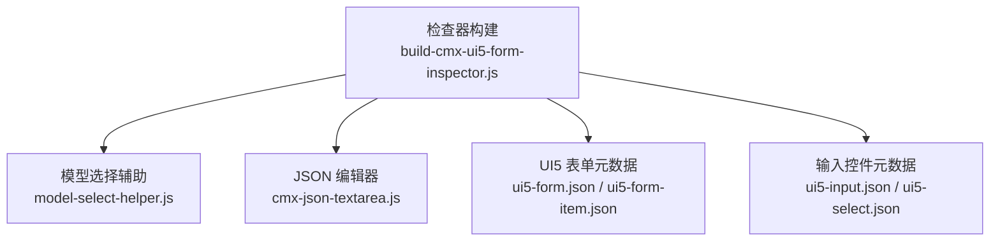
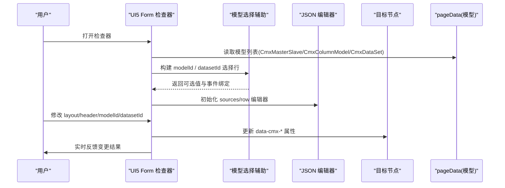
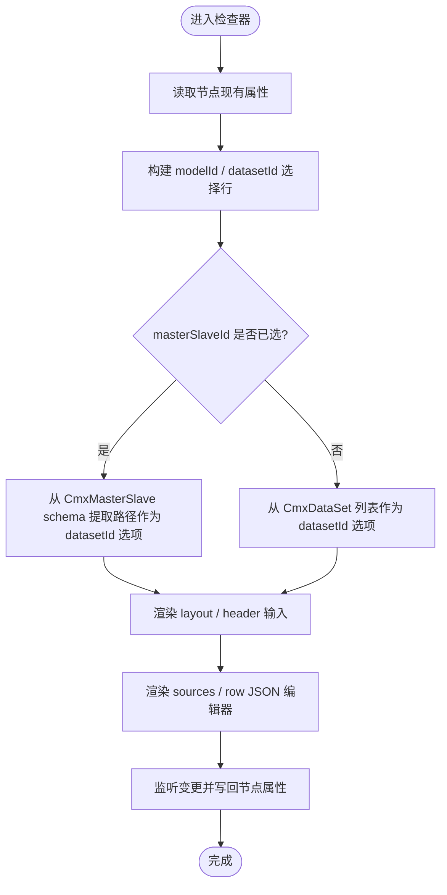
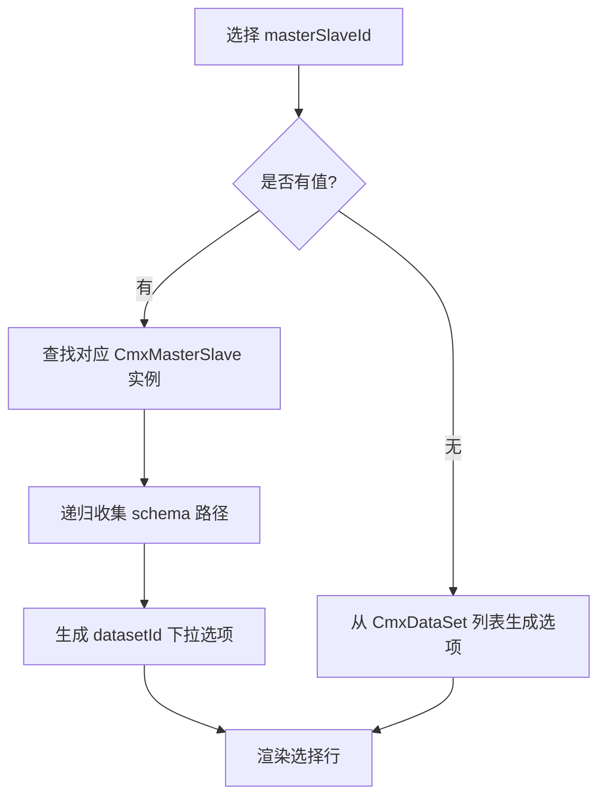
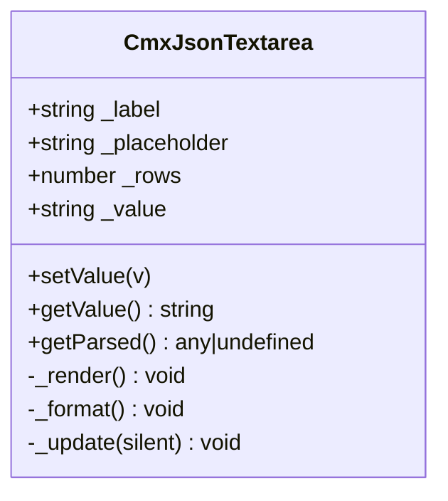
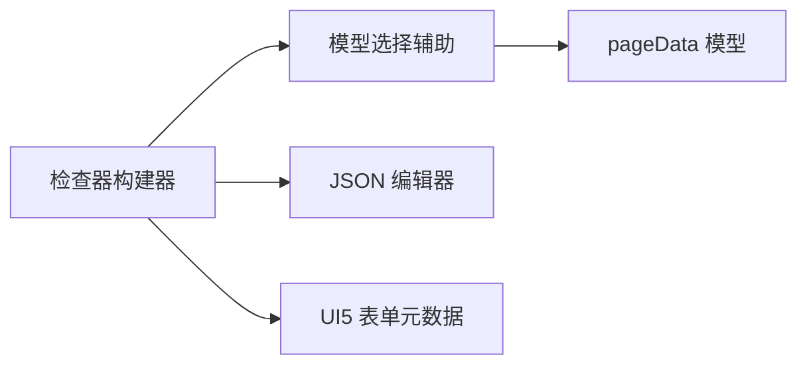

# UI5 Form 检查器开发

<cite>
**本文引用的文件**
- [build-cmx-ui5-form-inspector.js](file://CMXHTMLDesigner/src/plugins/cmx-inspector/build-cmx-ui5-form-inspector.js)
- [model-select-helper.js](file://CMXHTMLDesigner/src/plugins/cmx-inspector/model-select-helper.js)
- [cmx-json-textarea.js](file://CMXHTMLDesigner/src/plugins/cmx-inspector/cmx-json-textarea.js)
- [ui5-form.json](file://CMXHTMLDesigner/src/metadata/tags/ui5/ui5-form.json)
- [ui5-form-item.json](file://CMXHTMLDesigner/src/metadata/tags/ui5/ui5-form-item.json)
- [ui5-input.json](file://CMXHTMLDesigner/src/metadata/tags/ui5/ui5-input.json)
- [ui5-select.json](file://CMXHTMLDesigner/src/metadata/tags/ui5/ui5-select.json)
</cite>

## 目录
1. [简介](#简介)
2. [项目结构](#项目结构)
3. [核心组件](#核心组件)
4. [架构总览](#架构总览)
5. [详细组件分析](#详细组件分析)
6. [依赖关系分析](#依赖关系分析)
7. [性能考虑](#性能考虑)
8. [故障排查指南](#故障排查指南)
9. [结论](#结论)
10. [附录](#附录)

## 简介
本文件面向在 CMX HTML Designer 中开发“UI5 Form 检查器”的工程师与产品人员，系统性说明以下能力：
- 表单字段排列与分组管理：通过 CmxColumnModel 提供字段定义与分组，结合响应式布局配置实现灵活排版。
- 响应式布局设置：支持 layout 属性（如 S1 M2 L3 XL3）控制不同屏幕下的列数分布。
- 多输入类型的可视化配置：文本框、选择框、日期选择器等由元数据驱动的属性面板与事件预设。
- 表单验证规则的配置界面：必填、格式、自定义校验函数的集成方式与交互流程。
- 表单布局模板与预设样式管理：基于标签元数据与样式分组的统一配置入口。
- 表单提交事件处理机制：以 ui5Form 事件预设为基础的事件绑定与扩展点。

## 项目结构
围绕 UI5 Form 检查器的关键代码位于 CMXHTMLDesigner 插件体系内：
- 检查器构建逻辑：plugins/cmx-inspector/build-cmx-ui5-form-inspector.js
- 模型选择辅助：plugins/cmx-inspector/model-select-helper.js
- JSON 编辑器组件：plugins/cmx-inspector/cmx-json-textarea.js
- UI5 表单相关标签元数据：metadata/tags/ui5/ 下的 ui5-form.json、ui5-form-item.json、ui5-input.json、ui5-select.json

图表来源
- [build-cmx-ui5-form-inspector.js:22-145](file://CMXHTMLDesigner/src/plugins/cmx-inspector/build-cmx-ui5-form-inspector.js#L22-L145)
- [model-select-helper.js:18-130](file://CMXHTMLDesigner/src/plugins/cmx-inspector/model-select-helper.js#L18-L130)
- [cmx-json-textarea.js:20-139](file://CMXHTMLDesigner/src/plugins/cmx-inspector/cmx-json-textarea.js#L20-L139)
- [ui5-form.json:1-90](file://CMXHTMLDesigner/src/metadata/tags/ui5/ui5-form.json#L1-L90)
- [ui5-form-item.json:1-29](file://CMXHTMLDesigner/src/metadata/tags/ui5/ui5-form-item.json#L1-L29)
- [ui5-input.json:1-144](file://CMXHTMLDesigner/src/metadata/tags/ui5/ui5-input.json#L1-L144)
- [ui5-select.json:1-104](file://CMXHTMLDesigner/src/metadata/tags/ui5/ui5-select.json#L1-L104)

章节来源
- [build-cmx-ui5-form-inspector.js:22-145](file://CMXHTMLDesigner/src/plugins/cmx-inspector/build-cmx-ui5-form-inspector.js#L22-L145)
- [model-select-helper.js:18-130](file://CMXHTMLDesigner/src/plugins/cmx-inspector/model-select-helper.js#L18-L130)
- [cmx-json-textarea.js:20-139](file://CMXHTMLDesigner/src/plugins/cmx-inspector/cmx-json-textarea.js#L20-L139)
- [ui5-form.json:1-90](file://CMXHTMLDesigner/src/metadata/tags/ui5/ui5-form.json#L1-L90)
- [ui5-form-item.json:1-29](file://CMXHTMLDesigner/src/metadata/tags/ui5/ui5-form-item.json#L1-L29)
- [ui5-input.json:1-144](file://CMXHTMLDesigner/src/metadata/tags/ui5/ui5-input.json#L1-L144)
- [ui5-select.json:1-104](file://CMXHTMLDesigner/src/metadata/tags/ui5/ui5-select.json#L1-L104)

## 核心组件
- UI5 Form 检查器构建器：负责渲染检查器面板，提供 masterSlaveId/datasetId/modelId 绑定、layout/header 配置、sources/row 的 JSON 编辑等。
- 模型选择辅助：为 Inspector 提供从 pageData 中按类型筛选模型的行控件，并动态生成 datasetId 下拉选项（基于 CmxMasterSlave schema 路径或 CmxDataSet 列表）。
- JSON 文本域组件：提供带即时语法校验、格式化、状态提示的多行输入框，用于 sources/row 等复杂配置的编辑。
- UI5 表单元数据：定义 <ui5-form>、<ui5-form-item>、<ui5-input>、<ui5-select> 等标签的属性、插槽、事件预设与样式分组，驱动设计器属性面板与运行时行为。

章节来源
- [build-cmx-ui5-form-inspector.js:22-145](file://CMXHTMLDesigner/src/plugins/cmx-inspector/build-cmx-ui5-form-inspector.js#L22-L145)
- [model-select-helper.js:18-130](file://CMXHTMLDesigner/src/plugins/cmx-inspector/model-select-helper.js#L18-L130)
- [cmx-json-textarea.js:20-139](file://CMXHTMLDesigner/src/plugins/cmx-inspector/cmx-json-textarea.js#L20-L139)
- [ui5-form.json:1-90](file://CMXHTMLDesigner/src/metadata/tags/ui5/ui5-form.json#L1-L90)
- [ui5-form-item.json:1-29](file://CMXHTMLDesigner/src/metadata/tags/ui5/ui5-form-item.json#L1-L29)
- [ui5-input.json:1-144](file://CMXHTMLDesigner/src/metadata/tags/ui5/ui5-input.json#L1-L144)
- [ui5-select.json:1-104](file://CMXHTMLDesigner/src/metadata/tags/ui5/ui5-select.json#L1-L104)

## 架构总览
下图展示了 UI5 Form 检查器与模型系统、元数据之间的交互关系。检查器读取当前节点属性，联动 pageData 中的模型信息，渲染可编辑控件；变更通过 onChange 回调同步回节点属性，最终影响运行时渲染。

图表来源
- [build-cmx-ui5-form-inspector.js:22-145](file://CMXHTMLDesigner/src/plugins/cmx-inspector/build-cmx-ui5-form-inspector.js#L22-L145)
- [model-select-helper.js:18-130](file://CMXHTMLDesigner/src/plugins/cmx-inspector/model-select-helper.js#L18-L130)
- [cmx-json-textarea.js:20-139](file://CMXHTMLDesigner/src/plugins/cmx-inspector/cmx-json-textarea.js#L20-L139)

## 详细组件分析

### UI5 Form 检查器构建器
职责
- 渲染检查器头部说明与分隔线，组织各配置区域。
- 提供 masterSlaveId、datasetId、modelId 三个模型绑定选择行，其中 datasetId 根据 masterSlaveId 动态切换为 schema 路径或数据集实例。
- 提供 layout（响应式列数）与 header（表单标题）的文本输入。
- 提供 sources（字典）与 row（初始行数据）的 JSON 编辑器，使用 cmx-json-textarea 进行即时校验与格式化。
- 所有变更通过 onInput/onChange 回调写回节点属性，触发重新渲染。

关键点
- 属性映射：data-cmx-layout、data-cmx-header、data-cmx-sources、data-cmx-row、data-cmx-dataset-id、data-cmx-model-id、data-cmx-master-slave-id。
- 默认行为：form 组件默认以 kind=single 绑定（bindForm），无需手动设置 data-cmx-kind。
- 字段来源：字段定义由所选 CmxColumnModel 提供，包含分组信息。

图表来源
- [build-cmx-ui5-form-inspector.js:22-145](file://CMXHTMLDesigner/src/plugins/cmx-inspector/build-cmx-ui5-form-inspector.js#L22-L145)
- [model-select-helper.js:88-130](file://CMXHTMLDesigner/src/plugins/cmx-inspector/model-select-helper.js#L88-L130)

章节来源
- [build-cmx-ui5-form-inspector.js:22-145](file://CMXHTMLDesigner/src/plugins/cmx-inspector/build-cmx-ui5-form-inspector.js#L22-L145)

### 模型选择辅助（含 datasetId 动态行）
职责
- buildModelSelectRow：在同一行内提供“文本输入 + 可选下拉选择”，下拉项来自 pageData._models 按 modelType 过滤后的实例 ID。
- buildDatasetIdRow：根据 masterSlaveId 是否存在，动态决定 datasetId 的下拉选项来源：
  - 存在 masterSlaveId：递归收集其 schema 的所有路径作为选项。
  - 不存在 masterSlaveId：从 CmxDataSet 模型列表中选择。

复杂度与边界
- 路径收集采用递归遍历 schema 树，时间复杂度 O(N)，N 为 schema 节点总数。
- 空值与未选中时保持输入框为空，避免无效属性写入。

图表来源
- [model-select-helper.js:18-84](file://CMXHTMLDesigner/src/plugins/cmx-inspector/model-select-helper.js#L18-L84)
- [model-select-helper.js:88-130](file://CMXHTMLDesigner/src/plugins/cmx-inspector/model-select-helper.js#L88-L130)

章节来源
- [model-select-helper.js:18-130](file://CMXHTMLDesigner/src/plugins/cmx-inspector/model-select-helper.js#L18-L130)

### JSON 文本域组件（cmx-json-textarea）
职责
- 提供带标签、占位符、行数控制的 ui5-textarea。
- 实时 JSON 解析与校验，显示状态（空/有效/无效）与错误消息。
- 提供格式化按钮，将合法 JSON 美化输出。
- 暴露 setValue/getValue/getParsed 方法与 cmx-json-change 事件，供检查器消费。

交互要点
- 输入变化触发 _update，计算 parsed 与 valid，并派发事件。
- 当内容为空时，视为有效（valid=true），便于清空属性。

图表来源
- [cmx-json-textarea.js:20-139](file://CMXHTMLDesigner/src/plugins/cmx-inspector/cmx-json-textarea.js#L20-L139)

章节来源
- [cmx-json-textarea.js:20-139](file://CMXHTMLDesigner/src/plugins/cmx-inspector/cmx-json-textarea.js#L20-L139)

### 表单字段排列与分组管理
- 字段来源：由所选 CmxColumnModel 提供，包含分组信息。检查器通过提示告知“字段定义由所选 CmxColumnModel 提供（含分组）”。
- 字段展示：在设计器中，表单内的具体字段通常由 <ui5-form-item> 包裹，并通过 column-span 控制列宽；整体布局由 <ui5-form> 的 layout 属性控制响应式列数。
- 分组管理：CmxColumnModel 的分组信息在设计器侧体现为字段元数据，可在属性面板或拖拽面板中按分组呈现（此处由上层设计器能力承载）。

实践建议
- 先选定 CmxColumnModel，再调整 <ui5-form> 的 layout 与 <ui5-form-item> 的 column-span，以获得一致的响应式体验。
- 对于复杂分组，建议在 CmxColumnModel 中维护清晰的分组层级，并在设计器中以分组为单位进行批量操作。

章节来源
- [build-cmx-ui5-form-inspector.js:114-118](file://CMXHTMLDesigner/src/plugins/cmx-inspector/build-cmx-ui5-form-inspector.js#L114-L118)
- [ui5-form.json:39-43](file://CMXHTMLDesigner/src/metadata/tags/ui5/ui5-form.json#L39-L43)
- [ui5-form-item.json:16-23](file://CMXHTMLDesigner/src/metadata/tags/ui5/ui5-form-item.json#L16-L23)

### 响应式布局设置
- 通过 <ui5-form> 的 layout 属性设置响应式列数，例如 S1 M2 L3 XL3，表示在不同断点下的列数。
- 检查器提供 layout 文本输入，支持直接编辑并实时更新到节点属性。

最佳实践
- 在小屏设备优先原则下，合理设置 S/M/L/XL 的列数，保证移动端可用性。
- 对长表单可采用分段布局，配合 header 与分组提升可读性。

章节来源
- [build-cmx-ui5-form-inspector.js:74-92](file://CMXHTMLDesigner/src/plugins/cmx-inspector/build-cmx-ui5-form-inspector.js#L74-L92)
- [ui5-form.json:39-43](file://CMXHTMLDesigner/src/metadata/tags/ui5/ui5-form.json#L39-L43)

### 多输入类型的可视化配置
- 文本框：<ui5-input> 支持 placeholder、required、readonly、maxlength、value-state 等属性，以及 change/input 等事件。
- 选择框：<ui5-select> 支持 required、value-state、name 等属性，以及 change/live-change/selected-item-changed 等事件。
- 日期选择器：可通过 <ui5-date-picker>/<ui5-datetime-picker> 等 UI5 组件嵌入表单（由设计器元数据驱动），在表单中作为表单项使用。

配置要点
- 使用 value-state 表达校验状态（None/Positive/Negative/Critical/Information）。
- 使用 required 标记必填项，并结合 value-state 与 valueStateMessage 插槽展示错误信息。
- 通过 extraEvents 注册的事件预设，快速绑定业务逻辑。

章节来源
- [ui5-input.json:1-144](file://CMXHTMLDesigner/src/metadata/tags/ui5/ui5-input.json#L1-L144)
- [ui5-select.json:1-104](file://CMXHTMLDesigner/src/metadata/tags/ui5/ui5-select.json#L1-L104)

### 表单验证规则的配置界面
- 必填验证：通过 <ui5-input>/<ui5-select> 的 required 属性启用；运行时由 UI5 组件进行基础校验。
- 格式验证：通过 value-state 与 valueStateMessage 插槽展示错误；或在脚本层进行正则/长度等校验后更新 value-state。
- 自定义验证函数：在页面脚本中监听 change/input 等事件，执行自定义校验逻辑，并根据结果设置 value-state 与 valueStateMessage。

推荐流程
- 在属性面板设置 required 与默认 value-state。
- 在事件脚本中编写校验函数，调用 UI5 组件 API 更新状态。
- 使用 cmx-json-textarea 配置 sources/row 时，确保 JSON 有效，避免运行时解析失败。

章节来源
- [ui5-input.json:21-65](file://CMXHTMLDesigner/src/metadata/tags/ui5/ui5-input.json#L21-L65)
- [ui5-select.json:16-44](file://CMXHTMLDesigner/src/metadata/tags/ui5/ui5-select.json#L16-L44)
- [cmx-json-textarea.js:108-135](file://CMXHTMLDesigner/src/plugins/cmx-inspector/cmx-json-textarea.js#L108-L135)

### 表单布局模板与预设样式管理
- 模板管理：通过 CmxColumnModel 的字段定义与分组，形成可复用的表单模板；结合 <ui5-form> 的 layout 与 <ui5-form-item> 的 column-span 快速搭建一致布局。
- 样式分组：UI5 表单相关标签定义了 styleGroups（layout/flex/text/box/position），便于在设计器中集中管理样式。
- 预设样式：通过统一的样式分组与属性面板，减少重复配置，提高一致性。

章节来源
- [ui5-form.json:3-9](file://CMXHTMLDesigner/src/metadata/tags/ui5/ui5-form.json#L3-L9)
- [ui5-form-item.json:3-9](file://CMXHTMLDesigner/src/metadata/tags/ui5/ui5-form-item.json#L3-L9)
- [ui5-input.json:3-9](file://CMXHTMLDesigner/src/metadata/tags/ui5/ui5-input.json#L3-L9)
- [ui5-select.json:3-9](file://CMXHTMLDesigner/src/metadata/tags/ui5/ui5-select.json#L3-L9)

### 表单提交事件的处理机制
- 事件预设：ui5-input 与 ui5-select 均使用 ui5Form 事件预设，便于在设计器中快速绑定 change/input 等事件。
- 提交流程：在表单提交前，遍历表单项，读取值并执行校验；若存在错误，阻止提交并展示错误信息。
- 扩展点：通过 extraEvents 与 valueStateMessage 插槽，扩展更丰富的交互与提示。

章节来源
- [ui5-input.json:134-144](file://CMXHTMLDesigner/src/metadata/tags/ui5/ui5-input.json#L134-L144)
- [ui5-select.json:96-104](file://CMXHTMLDesigner/src/metadata/tags/ui5/ui5-select.json#L96-L104)

## 依赖关系分析
- 检查器构建器依赖模型选择辅助与 JSON 编辑器，同时受 UI5 表单元数据约束。
- 模型选择辅助依赖 pageData 中的模型集合，动态生成选项。
- JSON 编辑器独立封装，通过事件与外部解耦。

图表来源
- [build-cmx-ui5-form-inspector.js:22-145](file://CMXHTMLDesigner/src/plugins/cmx-inspector/build-cmx-ui5-form-inspector.js#L22-L145)
- [model-select-helper.js:18-130](file://CMXHTMLDesigner/src/plugins/cmx-inspector/model-select-helper.js#L18-L130)
- [cmx-json-textarea.js:20-139](file://CMXHTMLDesigner/src/plugins/cmx-inspector/cmx-json-textarea.js#L20-L139)
- [ui5-form.json:1-90](file://CMXHTMLDesigner/src/metadata/tags/ui5/ui5-form.json#L1-L90)

章节来源
- [build-cmx-ui5-form-inspector.js:22-145](file://CMXHTMLDesigner/src/plugins/cmx-inspector/build-cmx-ui5-form-inspector.js#L22-L145)
- [model-select-helper.js:18-130](file://CMXHTMLDesigner/src/plugins/cmx-inspector/model-select-helper.js#L18-L130)
- [cmx-json-textarea.js:20-139](file://CMXHTMLDesigner/src/plugins/cmx-inspector/cmx-json-textarea.js#L20-L139)
- [ui5-form.json:1-90](file://CMXHTMLDesigner/src/metadata/tags/ui5/ui5-form.json#L1-L90)

## 性能考虑
- 模型选择：避免频繁重建下拉选项，仅在 masterSlaveId 变化时刷新 datasetId 选项。
- JSON 编辑器：仅在输入变化时进行解析与状态更新，必要时使用防抖减少解析开销。
- 响应式布局：合理设置 layout，避免过多列导致重排与回流。
- 事件绑定：尽量复用事件处理器，减少重复绑定。

## 故障排查指南
常见问题与定位
- datasetId 为空或未生效：检查 masterSlaveId 是否正确设置；确认 CmxMasterSlave 的 schema 是否存在或 CmxDataSet 列表是否为空。
- JSON 编辑器报错：查看 cmx-json-textarea 的状态提示与错误消息，修正 JSON 格式后再保存。
- 表单校验不生效：确认 required 与 value-state 的设置；检查事件脚本是否正确更新 value-state 与 valueStateMessage。
- 字段分组不显示：确认 CmxColumnModel 是否已正确选择且包含分组信息。

章节来源
- [model-select-helper.js:111-130](file://CMXHTMLDesigner/src/plugins/cmx-inspector/model-select-helper.js#L111-L130)
- [cmx-json-textarea.js:108-135](file://CMXHTMLDesigner/src/plugins/cmx-inspector/cmx-json-textarea.js#L108-L135)
- [ui5-input.json:21-65](file://CMXHTMLDesigner/src/metadata/tags/ui5/ui5-input.json#L21-L65)
- [ui5-select.json:16-44](file://CMXHTMLDesigner/src/metadata/tags/ui5/ui5-select.json#L16-L44)

## 结论
本方案通过检查器构建器、模型选择辅助与 JSON 编辑器三者的协作，结合 UI5 表单元数据，实现了：
- 可视化的表单字段排列与分组管理。
- 灵活的响应式布局配置。
- 多输入类型的属性与事件配置。
- 完善的表单验证规则配置界面。
- 统一的模板与样式管理。
- 可扩展的表单提交事件处理机制。

该设计在保证可维护性的同时，提升了表单设计与调试效率，适用于企业级门户场景中的复杂表单需求。

## 附录
- 属性速查
  - <ui5-form>：layout、header-text、item-spacing 等。
  - <ui5-form-item>：column-span。
  - <ui5-input>：placeholder、required、readonly、maxlength、value-state、name 等。
  - <ui5-select>：required、value-state、name、text-separator 等。
- 事件速查
  - ui5Form 事件预设：change、input、select、selection-change、type-ahead、suggestion-scroll、open、close 等（依据具体组件）。

章节来源
- [ui5-form.json:16-84](file://CMXHTMLDesigner/src/metadata/tags/ui5/ui5-form.json#L16-L84)
- [ui5-form-item.json:16-23](file://CMXHTMLDesigner/src/metadata/tags/ui5/ui5-form-item.json#L16-L23)
- [ui5-input.json:21-144](file://CMXHTMLDesigner/src/metadata/tags/ui5/ui5-input.json#L21-L144)
- [ui5-select.json:16-104](file://CMXHTMLDesigner/src/metadata/tags/ui5/ui5-select.json#L16-L104)