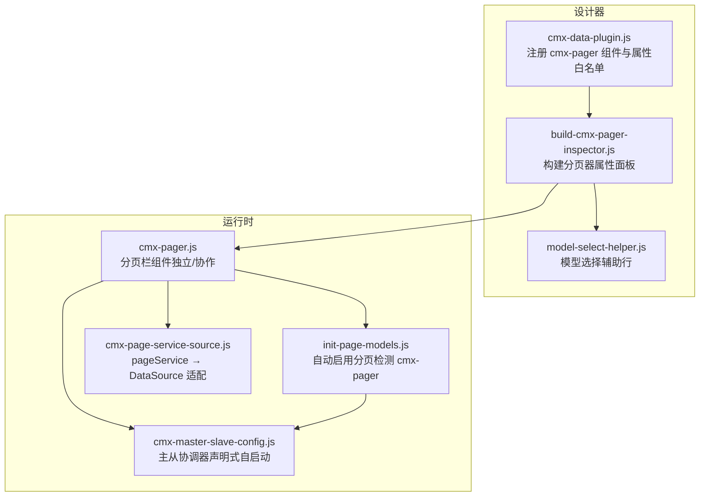
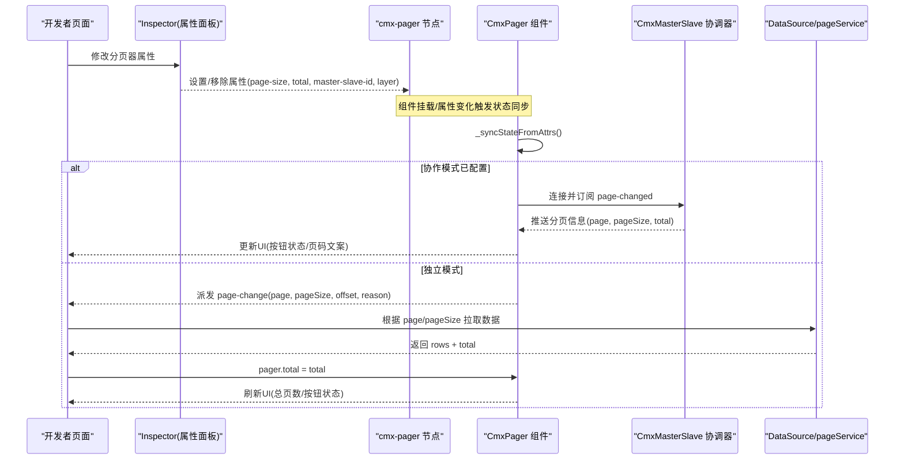
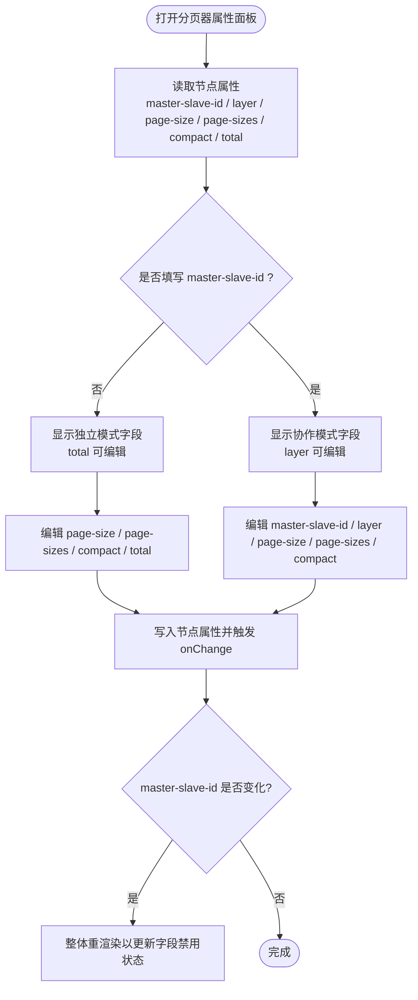
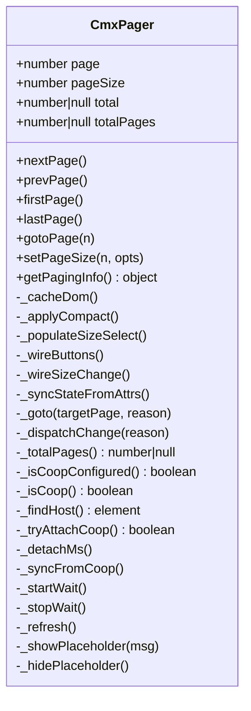
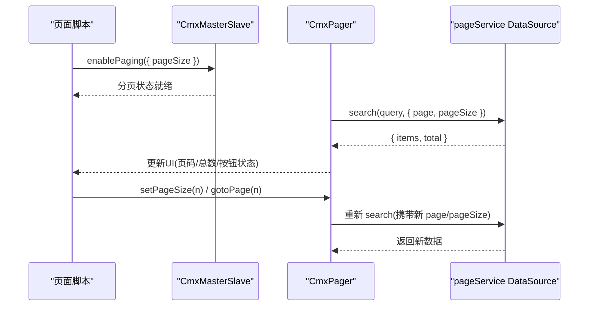
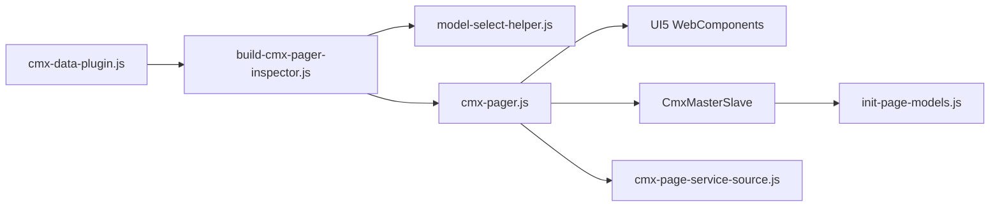

# 分页器检查器开发

<cite>
**本文引用的文件**
- [build-cmx-pager-inspector.js](file://CMXHTMLDesigner/src/plugins/cmx-inspector/build-cmx-pager-inspector.js)
- [cmx-data-plugin.js](file://CMXHTMLDesigner/src/plugins/cmx-data-plugin.js)
- [model-select-helper.js](file://CMXHTMLDesigner/src/plugins/cmx-inspector/model-select-helper.js)
- [cmx-pager.js](file://packages/cmx-data-comp/src/components/cmx-pager.js)
- [init-page-models.js](file://packages/cmx-data-comp/src/lib/init-page-models.js)
- [cmx-master-slave-config.js](file://packages/cmx-data-comp/src/components/cmx-master-slave-config.js)
- [cmx-page-service-source.js](file://packages/cmx-data-comp/src/lib/cmx-page-service-source.js)
</cite>

## 目录
1. [简介](#简介)
2. [项目结构](#项目结构)
3. [核心组件](#核心组件)
4. [架构总览](#架构总览)
5. [详细组件分析](#详细组件分析)
6. [依赖关系分析](#依赖关系分析)
7. [性能考虑](#性能考虑)
8. [故障排查指南](#故障排查指南)
9. [结论](#结论)
10. [附录](#附录)

## 简介
本文件面向“分页器检查器”的设计与实现，聚焦以下目标：
- 可视化编辑分页器配置：每页显示数量、总记录数、当前页码、紧凑模式、协作模式等。
- 分页事件处理机制：页码变化、每页条数调整、搜索条件重置等。
- 数据源绑定方式：服务端分页与客户端分页两种模式的接入方法。
- 样式定制与主题适配：基于 SAP 主题变量的内联样式与 Shadow DOM 隔离策略。

该能力由两部分组成：
- 设计器侧：为 cmx-pager 提供专用 Inspector（属性面板），支持可视化编辑并持久化到节点属性。
- 运行时侧：cmx-pager 组件实现独立/协作双模式，派发 page-change 事件或转发到协调器，驱动数据加载与刷新。

## 项目结构
与分页器检查器相关的代码主要分布在两个区域：
- 设计器插件区：负责在属性面板中渲染分页器的可视化编辑控件，并将变更写回节点属性。
- 数据组件区：提供 cmx-pager 组件及与主从协调器、数据源的集成逻辑。

**图表来源**
- [cmx-data-plugin.js:561-588](file://CMXHTMLDesigner/src/plugins/cmx-data-plugin.js#L561-L588)
- [build-cmx-pager-inspector.js:76-179](file://CMXHTMLDesigner/src/plugins/cmx-inspector/build-cmx-pager-inspector.js#L76-L179)
- [model-select-helper.js:18-84](file://CMXHTMLDesigner/src/plugins/cmx-inspector/model-select-helper.js#L18-L84)
- [cmx-pager.js:84-131](file://packages/cmx-data-comp/src/components/cmx-pager.js#L84-L131)
- [init-page-models.js:1030-1047](file://packages/cmx-data-comp/src/lib/init-page-models.js#L1030-L1047)
- [cmx-master-slave-config.js:1-24](file://packages/cmx-data-comp/src/components/cmx-master-slave-config.js#L1-L24)
- [cmx-page-service-source.js:1-22](file://packages/cmx-data-comp/src/lib/cmx-page-service-source.js#L1-L22)

**章节来源**
- [cmx-data-plugin.js:561-588](file://CMXHTMLDesigner/src/plugins/cmx-data-plugin.js#L561-L588)
- [build-cmx-pager-inspector.js:76-179](file://CMXHTMLDesigner/src/plugins/cmx-inspector/build-cmx-pager-inspector.js#L76-L179)

## 核心组件
- 分页器检查器（Inspector）：通过 buildCmxPagerInspector 动态生成属性面板，支持协作模式字段、通用字段、独立模式字段的分组展示与禁用控制。
- 分页器组件（cmx-pager）：实现 UI、状态管理、事件派发、协作模式连接与同步。
- 数据源适配：将 pageService 包装为标准 DataSource，供表格/下拉等组件进行服务端分页查询。
- 主从协调器：作为协作模式的状态中心，统一分发分页状态变更，并与 cmx-pager 双向同步。

**章节来源**
- [build-cmx-pager-inspector.js:76-179](file://CMXHTMLDesigner/src/plugins/cmx-inspector/build-cmx-pager-inspector.js#L76-L179)
- [cmx-pager.js:1-41](file://packages/cmx-data-comp/src/components/cmx-pager.js#L1-L41)
- [cmx-page-service-source.js:24-52](file://packages/cmx-data-comp/src/lib/cmx-page-service-source.js#L24-L52)
- [cmx-master-slave-config.js:1-24](file://packages/cmx-data-comp/src/components/cmx-master-slave-config.js#L1-L24)

## 架构总览
分页器检查器与运行时的交互流程如下：
- 设计时：用户在属性面板修改分页器属性（如 page-size、page-sizes、compact、total、master-slave-id、layer），这些变更被序列化到节点的属性中。
- 运行时：cmx-pager 根据属性初始化；若配置了 master-slave-id，则尝试连接协调器进入协作模式；否则以独立模式工作，监听 page-change 事件并拉取数据。
- 数据加载：独立模式下由外部监听 page-change 后调用服务获取数据；协作模式下由协调器统一调度，cmx-pager 仅做状态镜像与操作转发。

**图表来源**
- [cmx-pager.js:117-131](file://packages/cmx-data-comp/src/components/cmx-pager.js#L117-L131)
- [cmx-pager.js:344-410](file://packages/cmx-data-comp/src/components/cmx-pager.js#L344-L410)
- [cmx-pager.js:441-487](file://packages/cmx-data-comp/src/components/cmx-pager.js#L441-L487)
- [init-page-models.js:1030-1047](file://packages/cmx-data-comp/src/lib/init-page-models.js#L1030-L1047)
- [cmx-page-service-source.js:90-108](file://packages/cmx-data-comp/src/lib/cmx-page-service-source.js#L90-L108)

## 详细组件分析

### 分页器检查器（Inspector）
- 功能要点
  - 协作模式字段：协调器实例（master-slave-id）、分页层（layer）。当未填写协调器实例时，视为独立模式。
  - 通用字段：初始每页大小（page-size）、每页大小选项（page-sizes，CSV）、紧凑模式（compact）。
  - 独立模式字段：总条数（total），仅在独立模式可用；协作模式下灰显并提示由协调器覆盖。
  - 模式切换：切换 master-slave-id 会触发整体重渲染，确保字段启用/禁用状态正确。
  - 模型选择：使用 buildModelSelectRow 提供“从模型面板选择”的便捷输入行，支持 CmxMasterSlave 类型。

- 关键行为
  - 文本输入行：支持 disabled 与 hint 提示，值变化回调写入节点属性并触发 onChange。
  - 开关行：用于 compact 模式，默认未设属性为 false，勾选即设置 compact="true"。
  - 模式提示：底部显示当前模式说明，帮助开发者理解行为差异。

**图表来源**
- [build-cmx-pager-inspector.js:76-179](file://CMXHTMLDesigner/src/plugins/cmx-inspector/build-cmx-pager-inspector.js#L76-L179)
- [model-select-helper.js:18-84](file://CMXHTMLDesigner/src/plugins/cmx-inspector/model-select-helper.js#L18-L84)

**章节来源**
- [build-cmx-pager-inspector.js:76-179](file://CMXHTMLDesigner/src/plugins/cmx-inspector/build-cmx-pager-inspector.js#L76-L179)
- [model-select-helper.js:18-84](file://CMXHTMLDesigner/src/plugins/cmx-inspector/model-select-helper.js#L18-L84)

### 分页器组件（cmx-pager）
- 双模式
  - 独立模式：组件维护 page/pageSize/total，用户操作触发 page-change 事件，外部监听后拉取数据并回填 total。
  - 协作模式：设置 master-slave-id 与可选 layer 后，操作转发到协调器，状态由协调器 page-changed 事件反向同步。
- 属性与命令式 API
  - 属性：page、page-size、page-sizes、total、compact、master-slave-id、layer。
  - 命令式：nextPage()/prevPage()/firstPage()/lastPage()/gotoPage(n)/setPageSize(n)/getPagingInfo()。
- 生命周期与事件
  - connectedCallback：渲染模板、缓存 DOM、绑定事件、初始化状态、尝试协作模式连接。
  - attributeChangedCallback：按属性名分发处理（页大小列表、紧凑模式、状态同步、协作重连）。
  - 事件派发：独立模式下派发 page-change；协作模式下不派发，由协调器派发 page-changed。
- 协作模式连接
  - 定位宿主元素，查找协调器实例，校验分页 API 可用性，订阅 page-changed 并同步本地状态。
  - 轮询等待协调器就绪，超时显示占位提示。

**图表来源**
- [cmx-pager.js:84-218](file://packages/cmx-data-comp/src/components/cmx-pager.js#L84-L218)
- [cmx-pager.js:220-410](file://packages/cmx-data-comp/src/components/cmx-pager.js#L220-L410)
- [cmx-pager.js:412-576](file://packages/cmx-data-comp/src/components/cmx-pager.js#L412-L576)

**章节来源**
- [cmx-pager.js:1-41](file://packages/cmx-data-comp/src/components/cmx-pager.js#L1-L41)
- [cmx-pager.js:84-218](file://packages/cmx-data-comp/src/components/cmx-pager.js#L84-L218)
- [cmx-pager.js:220-410](file://packages/cmx-data-comp/src/components/cmx-pager.js#L220-L410)
- [cmx-pager.js:412-576](file://packages/cmx-data-comp/src/components/cmx-pager.js#L412-L576)

### 数据源绑定与服务端分页
- 设计器侧注册
  - 在 cmx-data-plugin 中声明 cmx-pager 的属性白名单，确保 inspector 编辑的属性可持久化。
  - 同时声明 extraEvents 为 page-change，便于在设计器中识别事件。
- 运行时自动启用分页
  - init-page-models 检测页面是否存在指向协调器的 cmx-pager，若有则自动调用 ms.enablePaging({ pageSize })，优先使用 pager 配置的 page-size，否则取 page-sizes 首项。
- pageService 适配
  - cmx-page-service-source 将 pageService 包装为 DataSource，支持 queryParam、pageParam、pageSizeParam、responsePath、transform 等配置，提取 total 用于分页 footer。
  - 组件可通过 setPageSize 或 gotoPage 改变分页参数，配合 pageService 实现服务端分页。

**图表来源**
- [cmx-data-plugin.js:561-588](file://CMXHTMLDesigner/src/plugins/cmx-data-plugin.js#L561-L588)
- [init-page-models.js:1030-1047](file://packages/cmx-data-comp/src/lib/init-page-models.js#L1030-L1047)
- [cmx-page-service-source.js:90-108](file://packages/cmx-data-comp/src/lib/cmx-page-service-source.js#L90-L108)
- [cmx-pager.js:240-261](file://packages/cmx-data-comp/src/components/cmx-pager.js#L240-L261)

**章节来源**
- [cmx-data-plugin.js:561-588](file://CMXHTMLDesigner/src/plugins/cmx-data-plugin.js#L561-L588)
- [init-page-models.js:1030-1047](file://packages/cmx-data-comp/src/lib/init-page-models.js#L1030-L1047)
- [cmx-page-service-source.js:24-52](file://packages/cmx-data-comp/src/lib/cmx-page-service-source.js#L24-L52)
- [cmx-page-service-source.js:90-108](file://packages/cmx-data-comp/src/lib/cmx-page-service-source.js#L90-L108)

### 客户端分页与搜索条件重置
- 客户端分页
  - 适用于本地数据集（rows 静态数据），通过组件内部计算 total 与 totalPages，按钮状态与页码文案随状态刷新。
  - 适合小数据量场景，无需后端分页接口。
- 搜索条件重置
  - 在协作模式下，页码变化通常伴随搜索条件变化；建议在上层业务逻辑中监听 page-change（独立模式）或协调器 page-changed（协作模式），在重置搜索条件后重新执行查询，并回填 total。
  - 对于内置下拉组件（如 cmx-combo-box），其内部 _goToPage 会保留当前搜索文本重新拉取，可作为参考模式。

**章节来源**
- [cmx-pager.js:517-554](file://packages/cmx-data-comp/src/components/cmx-pager.js#L517-L554)
- [cmx-pager.js:367-404](file://packages/cmx-data-comp/src/components/cmx-pager.js#L367-L404)

### 样式定制与主题适配
- 主题变量
  - 组件样式使用 SAP 主题变量（如 --sapContent_LabelColor、--sapList_HeaderBackground、--sapField_BorderColor 等），确保在不同主题下保持一致的视觉表现。
- Shadow DOM 隔离
  - 组件使用 Shadow DOM 封装样式，避免全局污染，同时通过 part 暴露根容器与信息区域，便于外部样式穿透定制。
- 紧凑模式
  - 通过 compact 属性隐藏首页/末页按钮，减少占用空间，适合复杂布局场景。
- 自定义扩展
  - 可在页面级 CSS 中针对 .cmx-pager-root、.cmx-pager-info、.cmx-pager-size 等类名进行微调；或通过 Shadow DOM part 进行更精细的样式覆盖。

**章节来源**
- [cmx-pager.js:47-82](file://packages/cmx-data-comp/src/components/cmx-pager.js#L47-L82)
- [cmx-pager.js:278-284](file://packages/cmx-data-comp/src/components/cmx-pager.js#L278-L284)

## 依赖关系分析
- 设计器依赖
  - cmx-data-plugin 注册 cmx-pager 组件元数据与属性白名单，使 Inspector 能正确渲染与持久化。
  - build-cmx-pager-inspector 依赖 model-select-helper 提供模型选择行，提升配置效率。
- 运行时依赖
  - cmx-pager 依赖 UI5 WebComponents（Button、Select、Option）实现交互控件。
  - 协作模式依赖 CmxMasterSlave 协调器，通过 page-changed 事件同步状态。
  - 数据加载依赖 DataSource 接口，pageService 通过适配器转换为标准 DataSource。

**图表来源**
- [cmx-data-plugin.js:561-588](file://CMXHTMLDesigner/src/plugins/cmx-data-plugin.js#L561-L588)
- [build-cmx-pager-inspector.js:76-179](file://CMXHTMLDesigner/src/plugins/cmx-inspector/build-cmx-pager-inspector.js#L76-L179)
- [model-select-helper.js:18-84](file://CMXHTMLDesigner/src/plugins/cmx-inspector/model-select-helper.js#L18-L84)
- [cmx-pager.js:43-45](file://packages/cmx-data-comp/src/components/cmx-pager.js#L43-L45)
- [init-page-models.js:1030-1047](file://packages/cmx-data-comp/src/lib/init-page-models.js#L1030-L1047)
- [cmx-page-service-source.js:24-52](file://packages/cmx-data-comp/src/lib/cmx-page-service-source.js#L24-L52)

**章节来源**
- [cmx-data-plugin.js:561-588](file://CMXHTMLDesigner/src/plugins/cmx-data-plugin.js#L561-L588)
- [build-cmx-pager-inspector.js:76-179](file://CMXHTMLDesigner/src/plugins/cmx-inspector/build-cmx-pager-inspector.js#L76-L179)
- [cmx-pager.js:43-45](file://packages/cmx-data-comp/src/components/cmx-pager.js#L43-L45)
- [init-page-models.js:1030-1047](file://packages/cmx-data-comp/src/lib/init-page-models.js#L1030-L1047)
- [cmx-page-service-source.js:24-52](file://packages/cmx-data-comp/src/lib/cmx-page-service-source.js#L24-L52)

## 性能考虑
- 避免频繁重渲染：Inspector 在模式切换时整体重建，但常规属性变更仅触发 onChange，减少不必要的 DOM 操作。
- 防抖与节流：页大小下拉选择通过 _syncing 标志避免 change 回环；search 请求可使用 debounceMs 降低网络压力。
- 协作模式轮询：协调器连接采用 50ms 间隔轮询，最多 40 次，避免长时间阻塞。
- 数据量控制：大列表建议使用服务端分页，减少前端内存占用与渲染开销。

[本节为通用指导，不直接分析具体文件]

## 故障排查指南
- 协调器未就绪
  - 现象：分页栏显示占位文案“正在连接协调器…”或“等待协调器超时”。
  - 排查：确认 master-slave-id 是否正确；检查协调器是否已初始化并暴露分页 API；查看 init-page-models 是否成功调用 enablePaging。
- 版本过低
  - 现象：占位文案提示“协调器版本过低（缺少分页 API）”。
  - 排查：升级协调器至支持分页的版本；确保 getPagingInfo 与 addEventListener 可用。
- 属性未生效
  - 现象：修改 page-size/total 后 UI 未更新。
  - 排查：确认属性名与值格式正确；检查组件是否已挂载；验证 attributeChangedCallback 是否触发。
- 事件未触发
  - 现象：独立模式下 page-change 未触发。
  - 排查：确认组件处于独立模式；检查外部监听是否正确绑定；验证 goto/setPageSize 调用路径。

**章节来源**
- [cmx-pager.js:489-512](file://packages/cmx-data-comp/src/components/cmx-pager.js#L489-L512)
- [cmx-pager.js:556-571](file://packages/cmx-data-comp/src/components/cmx-pager.js#L556-L571)
- [init-page-models.js:1030-1047](file://packages/cmx-data-comp/src/lib/init-page-models.js#L1030-L1047)

## 结论
分页器检查器通过设计器属性面板与运行时组件的协同，提供了灵活的分页配置与事件处理能力。独立模式适合简单场景，协作模式适合多组件联动与统一状态管理。结合 pageService 适配器，可实现高效的服务端分页。样式方面通过 SAP 主题变量与 Shadow DOM 隔离，确保一致的主题适配与可定制性。

[本节为总结，不直接分析具体文件]

## 附录
- 常用属性速查
  - page：当前页码（从 1 起）
  - page-size：每页条数
  - page-sizes：可选每页条数列表（逗号分隔）
  - total：总记录数（null 表示未知）
  - compact：紧凑模式（隐藏首页/末页）
  - master-slave-id：协作模式协调器实例
  - layer：协作模式分页层标识
- 常用事件
  - page-change：独立模式下页码/页大小变化时派发，detail 包含 page、pageSize、total、totalPages、offset、reason
- 常用命令
  - nextPage()/prevPage()/firstPage()/lastPage()/gotoPage(n)/setPageSize(n)/getPagingInfo()

[本节为补充说明，不直接分析具体文件]