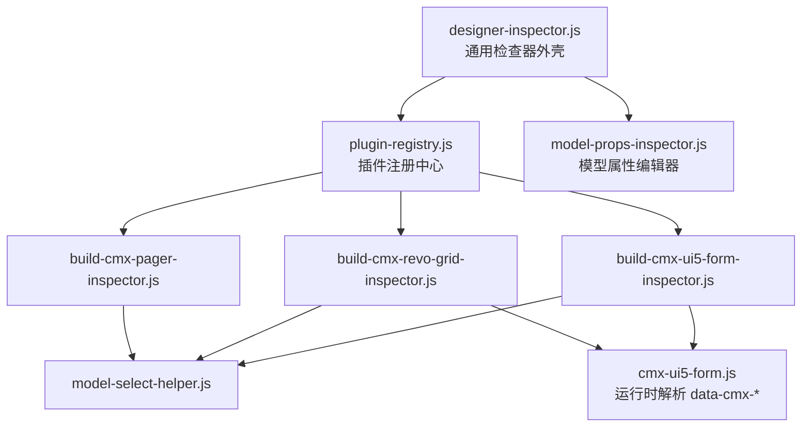
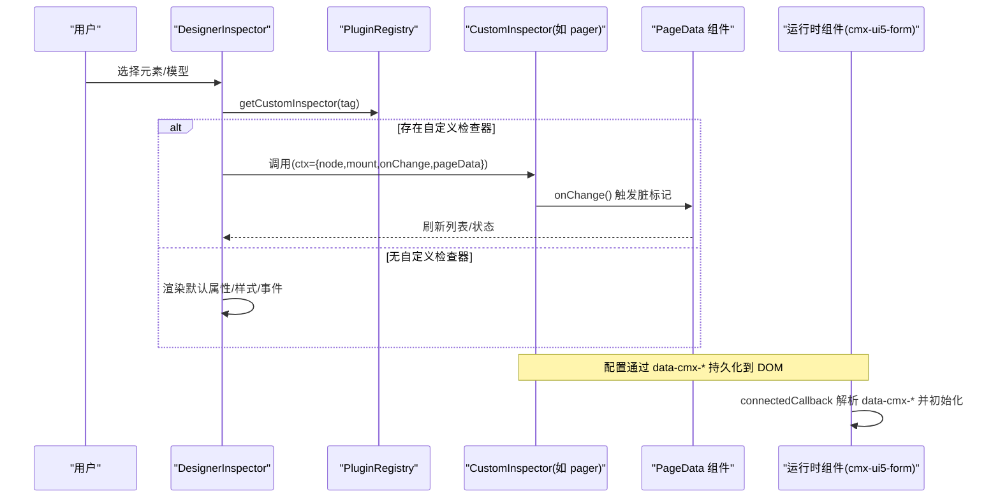
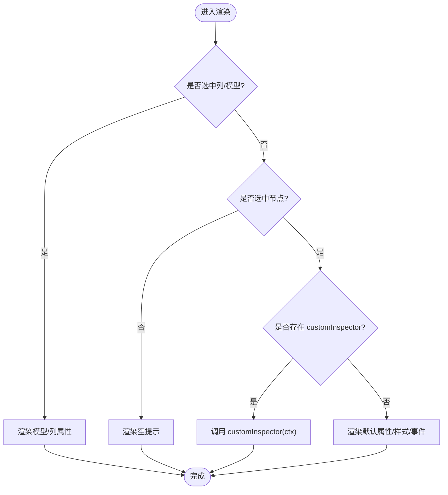
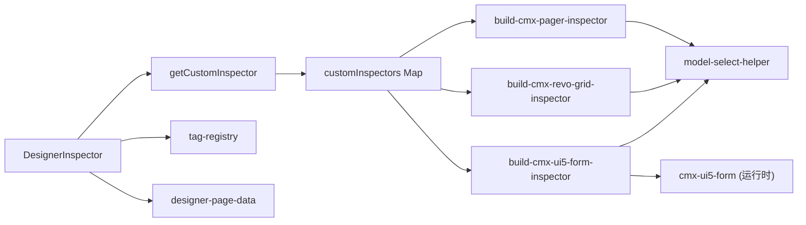

# 检查器系统架构

<cite>
**本文引用的文件**
- [designer-inspector.js](file://CMXHTMLDesigner/src/components/designer-inspector.js)
- [plugin-registry.js](file://CMXHTMLDesigner/src/lib/plugin-registry.js)
- [build-cmx-pager-inspector.js](file://CMXHTMLDesigner/src/plugins/cmx-inspector/build-cmx-pager-inspector.js)
- [build-cmx-revo-grid-inspector.js](file://CMXHTMLDesigner/src/plugins/cmx-inspector/build-cmx-revo-grid-inspector.js)
- [build-cmx-ui5-form-inspector.js](file://CMXHTMLDesigner/src/plugins/cmx-inspector/build-cmx-ui5-form-inspector.js)
- [model-select-helper.js](file://CMXHTMLDesigner/src/plugins/cmx-inspector/model-select-helper.js)
- [model-props-inspector.js](file://CMXHTMLDesigner/src/components/designer-inspector/model-props-inspector.js)
- [cmx-ui5-form.js](file://packages/cmx-data-comp/src/components/cmx-ui5-form.js)
</cite>

## 目录
1. [简介](#简介)
2. [项目结构](#项目结构)
3. [核心组件](#核心组件)
4. [架构总览](#架构总览)
5. [详细组件分析](#详细组件分析)
6. [依赖关系分析](#依赖关系分析)
7. [性能考量](#性能考量)
8. [故障排查指南](#故障排查指南)
9. [结论](#结论)
10. [附录](#附录)

## 简介
本文件系统性阐述 CMX HTML 设计器中的“检查器（Inspector）”子系统，覆盖其注册机制、生命周期管理、属性绑定与数据同步流程；详细说明检查器上下文对象 ctx 的结构与用途（node、mount、onChange、pageData 等），并解释检查器如何与页面数据模型交互，以及如何通过 data-cmx-* 属性实现配置序列化。最后给出扩展点最佳实践与性能优化建议。

## 项目结构
检查器系统由“通用检查器外壳 + 插件化自定义检查器 + 模型属性编辑器”三部分构成：
- 通用检查器外壳：负责面板渲染、事件/样式/属性编辑、调试日志、以及调用自定义检查器。
- 插件注册中心：提供 definePlugin/getCustomInspector，将 tag → 自定义检查器函数进行映射。
- 专用检查器：针对 cmx-pager、cmx-revo-grid、cmx-ui5-form 等组件的专属 Inspector。
- 模型属性编辑器：用于编辑页面级模型（DataSet/MasterSlave/ColumnModel/FlexibleCombination）。

图表来源
- [designer-inspector.js:15-40](file://CMXHTMLDesigner/src/components/designer-inspector.js#L15-L40)
- [plugin-registry.js:48-94](file://CMXHTMLDesigner/src/lib/plugin-registry.js#L48-L94)
- [build-cmx-pager-inspector.js:76-179](file://CMXHTMLDesigner/src/plugins/cmx-inspector/build-cmx-pager-inspector.js#L76-L179)
- [build-cmx-revo-grid-inspector.js:20-101](file://CMXHTMLDesigner/src/plugins/cmx-inspector/build-cmx-revo-grid-inspector.js#L20-L101)
- [build-cmx-ui5-form-inspector.js:22-145](file://CMXHTMLDesigner/src/plugins/cmx-inspector/build-cmx-ui5-form-inspector.js#L22-L145)
- [model-select-helper.js:18-132](file://CMXHTMLDesigner/src/plugins/cmx-inspector/model-select-helper.js#L18-L132)
- [cmx-ui5-form.js:196-218](file://packages/cmx-data-comp/src/components/cmx-ui5-form.js#L196-L218)

章节来源
- [designer-inspector.js:48-118](file://CMXHTMLDesigner/src/components/designer-inspector.js#L48-L118)
- [plugin-registry.js:48-94](file://CMXHTMLDesigner/src/lib/plugin-registry.js#L48-L94)

## 核心组件
- DesignerInspector（通用检查器外壳）
  - 职责：管理选中节点/模型/列，渲染属性/样式/事件/调试面板；派发 inspector-change 事件；支持自定义检查器钩子。
  - 关键方法：setNode/setModel/setModelColumn/clearNode/log。
- PluginRegistry（插件注册中心）
  - 职责：维护 tag→customInspector 映射；对外暴露 definePlugin/getCustomInspector；在注册时派发 cmx:plugin-registered。
- 专用检查器（以 cmx-pager / cmx-revo-grid / cmx-ui5-form 为例）
  - 职责：根据 node 上的 data-cmx-* 属性渲染专属 UI，并在 onChange 回调中触发脏标记与重绘。
- 模型属性编辑器
  - 职责：为页面级模型（DataSet/MasterSlave/ColumnModel/FlexibleCombination）提供可视化编辑，变更时回写模型对象并触发 pageData 刷新。

章节来源
- [designer-inspector.js:48-118](file://CMXHTMLDesigner/src/components/designer-inspector.js#L48-L118)
- [plugin-registry.js:48-94](file://CMXHTMLDesigner/src/lib/plugin-registry.js#L48-L94)
- [model-props-inspector.js:14-31](file://CMXHTMLDesigner/src/components/designer-inspector/model-props-inspector.js#L14-L31)

## 架构总览
检查器的核心工作流如下：
- 当用户在画布选择某个元素或模型时，DesignerInspector 决定渲染路径：
  - 若存在该 tag 的 customInspector，则调用它并传入 ctx。
  - 否则按默认元数据渲染属性/样式/事件。
- 自定义检查器通过 mount 挂载 UI，通过 onChange 通知上层“已修改”，从而触发 pageData 脏标记与刷新。
- 对于需要序列化的配置，检查器写入 data-cmx-* 属性；运行时组件在 connectedCallback 中读取这些属性并初始化。

图表来源
- [designer-inspector.js:270-293](file://CMXHTMLDesigner/src/components/designer-inspector.js#L270-L293)
- [plugin-registry.js:91-94](file://CMXHTMLDesigner/src/lib/plugin-registry.js#L91-L94)
- [build-cmx-pager-inspector.js:76-179](file://CMXHTMLDesigner/src/plugins/cmx-inspector/build-cmx-pager-inspector.js#L76-L179)
- [cmx-ui5-form.js:196-218](file://packages/cmx-data-comp/src/components/cmx-ui5-form.js#L196-L218)

## 详细组件分析

### 通用检查器外壳（DesignerInspector）
- 生命周期
  - setNode/setModel/setModelColumn：设置当前上下文并触发 _renderAll/_renderModelAll/_renderModelColumnAll。
  - clearNode：清空上下文并渲染空提示。
  - log：写入调试日志区，支持级别着色与长度限制。
- 属性/样式/事件面板
  - 属性面板优先尝试 customInspector；否则基于元数据渲染字段，支持文本内容、slot、数据绑定弹出层。
  - 样式面板按组渲染，支持原始 style 输入与应用。
  - 事件面板支持内置事件与自定义事件，使用 CodeMirror 编辑脚本，并通过 canvas.attachHandler/detachHandler 绑定/解绑。
- 模型编辑
  - 对页面级模型与列模型分别渲染专属编辑器，变更时调用 pageData._emitPageDataChanged 与 refreshModelsList。

图表来源
- [designer-inspector.js:182-266](file://CMXHTMLDesigner/src/components/designer-inspector.js#L182-L266)
- [designer-inspector.js:270-293](file://CMXHTMLDesigner/src/components/designer-inspector.js#L270-L293)

章节来源
- [designer-inspector.js:48-118](file://CMXHTMLDesigner/src/components/designer-inspector.js#L48-L118)
- [designer-inspector.js:171-266](file://CMXHTMLDesigner/src/components/designer-inspector.js#L171-L266)
- [designer-inspector.js:268-705](file://CMXHTMLDesigner/src/components/designer-inspector.js#L268-L705)

### 插件注册中心（PluginRegistry）
- definePlugin
  - 注册组件元数据与可选的 customInspectors（tag→函数）。
  - 重复注册时按 tag 覆盖，便于 HMR 热更新。
  - 注册完成后派发 cmx:plugin-registered 事件。
- getCustomInspector
  - 返回指定 tag 的自定义检查器函数，供 DesignerInspector 调用。

章节来源
- [plugin-registry.js:48-94](file://CMXHTMLDesigner/src/lib/plugin-registry.js#L48-L94)

### 专用检查器示例

#### cmx-pager 检查器
- 功能要点
  - 协作模式：通过 master-slave-id 切换；填写后自动进入协作模式，相关字段启用/灰显联动。
  - 通用字段：初始每页大小、每页大小选项、紧凑模式。
  - 独立模式：总条数仅在独立模式下有效。
- 数据同步
  - 所有字段变化均调用 onChange，使外层标记 dirty 并刷新。

章节来源
- [build-cmx-pager-inspector.js:76-179](file://CMXHTMLDesigner/src/plugins/cmx-inspector/build-cmx-pager-inspector.js#L76-L179)

#### cmx-revo-grid 检查器
- 功能要点
  - 绑定 CmxMasterSlave（masterSlaveId）与 CmxColumnModel（modelId）。
  - options/rows 使用 JSON 文本域编辑，校验通过后写入 data-cmx-options/data-cmx-rows。
  - datasetId 行根据 masterSlaveId 动态展示 schema 路径或 DataSet 实例。
- 数据同步
  - 每次变更调用 onChange。

章节来源
- [build-cmx-revo-grid-inspector.js:20-101](file://CMXHTMLDesigner/src/plugins/cmx-inspector/build-cmx-revo-grid-inspector.js#L20-L101)
- [model-select-helper.js:88-132](file://CMXHTMLDesigner/src/plugins/cmx-inspector/model-select-helper.js#L88-L132)

#### cmx-ui5-form 检查器
- 功能要点
  - 绑定 CmxMasterSlave（masterSlaveId）、CmxColumnModel（modelId），datasetId 随 masterSlaveId 变化而更新。
  - layout/header 文本输入直接写入 data-cmx-layout/data-cmx-header。
  - sources/row 使用 JSON 文本域编辑，校验后写入 data-cmx-sources/data-cmx-row。
- 运行时解析
  - 运行时组件在连接回调中解析 data-cmx-* 并调用对应 setter 完成初始化。

章节来源
- [build-cmx-ui5-form-inspector.js:22-145](file://CMXHTMLDesigner/src/plugins/cmx-inspector/build-cmx-ui5-form-inspector.js#L22-L145)
- [cmx-ui5-form.js:196-218](file://packages/cmx-data-comp/src/components/cmx-ui5-form.js#L196-L218)

### 模型属性编辑器
- 支持类型：CmxDataSet、CmxMasterSlave、CmxColumnModel、FlexibleCombination。
- 行为
  - 渲染对应类型的属性表单，变更时直接回写到 model.props 或 model.events。
  - 通过 onChange 触发 pageData 脏标记与列表刷新。
  - 列详情编辑器支持枚举值增删、验证规则增删、显示/录入控件切换等。

章节来源
- [model-props-inspector.js:14-31](file://CMXHTMLDesigner/src/components/designer-inspector/model-props-inspector.js#L14-L31)
- [model-props-inspector.js:140-424](file://CMXHTMLDesigner/src/components/designer-inspector/model-props-inspector.js#L140-L424)
- [model-props-inspector.js:462-518](file://CMXHTMLDesigner/src/components/designer-inspector/model-props-inspector.js#L462-L518)

## 依赖关系分析
- DesignerInspector 依赖：
  - plugin-registry.getCustomInspector：获取 tag 对应的自定义检查器。
  - metadata/tag-registry：获取标签元数据（attrs/styles/events）。
  - designer-page-data：通过 setPageData 注入 pageData 组件，用于读取/刷新模型与服务列表。
- 专用检查器依赖：
  - model-select-helper：构建“从模型面板选择”的行，支持 CmxMasterSlave/CmxDataSet/CmxColumnModel 的实例选择。
  - cmx-json-textarea：JSON 文本域，提供语法校验与变更事件。
- 运行时组件：
  - cmx-ui5-form：在 connectedCallback 中解析 data-cmx-* 并初始化。

图表来源
- [designer-inspector.js:15-40](file://CMXHTMLDesigner/src/components/designer-inspector.js#L15-L40)
- [plugin-registry.js:48-94](file://CMXHTMLDesigner/src/lib/plugin-registry.js#L48-L94)
- [model-select-helper.js:18-132](file://CMXHTMLDesigner/src/plugins/cmx-inspector/model-select-helper.js#L18-L132)
- [cmx-ui5-form.js:196-218](file://packages/cmx-data-comp/src/components/cmx-ui5-form.js#L196-L218)

章节来源
- [designer-inspector.js:15-40](file://CMXHTMLDesigner/src/components/designer-inspector.js#L15-L40)
- [plugin-registry.js:48-94](file://CMXHTMLDesigner/src/lib/plugin-registry.js#L48-L94)

## 性能考量
- 批量刷新合并
  - 应用层通过 requestAnimationFrame 合并多次 source/tree 刷新，避免拖拽与连续编辑导致的卡顿。
- 代码编辑器资源管理
  - 在切换模型/列时销毁并重建 CodeMirror 视图，同时 detach/attach 监听，防止内存泄漏与重复计算。
- 最小化 DOM 操作
  - 专用检查器采用局部 innerHTML 替换与按需创建节点，减少不必要的重排。
- 只读与禁用字段
  - 根据模式（如协作/独立）禁用无关字段，降低无效输入与重渲染。

章节来源
- [designer-inspector.js:201-266](file://CMXHTMLDesigner/src/components/designer-inspector.js#L201-L266)
- [designer-app.js:599-618](file://CMXHTMLDesigner/src/components/designer-app.js#L599-L618)

## 故障排查指南
- 自定义检查器未生效
  - 确认已通过 definePlugin 注册 customInspectors，且 tag 名称一致。
  - 检查 getCustomInspector 是否能返回函数。
- data-cmx-* 配置未生效
  - 确保检查器在变更时调用了 onChange，以便 pageData 标记脏并刷新。
  - 运行时组件需在 connectedCallback 中解析 data-cmx-*（例如 cmx-ui5-form）。
- 模型/列编辑不保存
  - 检查 renderModelPropsInspector/renderColumnDetailPropsInspector 是否正确调用 onChange。
  - 确认 pageData._emitPageDataChanged 与 refreshModelsList 被调用。
- 调试日志过多
  - 使用 log 方法的 level 控制输出，注意最大字符限制与清理逻辑。

章节来源
- [plugin-registry.js:60-89](file://CMXCMXHTMLDesigner/src/lib/plugin-registry.js#L60-L89)
- [designer-inspector.js:120-135](file://CMXHTMLDesigner/src/components/designer-inspector.js#L120-L135)
- [cmx-ui5-form.js:196-218](file://packages/cmx-data-comp/src/components/cmx-ui5-form.js#L196-L218)

## 结论
检查器系统通过“外壳 + 插件 + 模型编辑器”的分层设计，实现了高度可扩展的属性编辑能力。ctx 作为统一契约，屏蔽了不同组件的差异；data-cmx-* 作为配置序列化载体，打通了设计期与运行期。遵循本文的最佳实践与性能建议，可高效扩展新的检查器并确保稳定可靠的体验。

## 附录

### 检查器上下文对象（ctx）结构与用途
- node：当前选中的 DOM 元素，用于读取/写入属性与事件。
- mount：Inspector 属性面板根节点（已被清空），自定义检查器在此挂载 UI。
- onChange：变更回调，调用后触发 pageData 脏标记与刷新。
- pageData：designer-page-data 组件实例，可读 pageData/_models/_pageServices 等，用于下拉选择与联动。
- meta：组件元数据（attrs/styles/events），用于默认渲染。

章节来源
- [plugin-registry.js:48-58](file://CMXHTMLDesigner/src/lib/plugin-registry.js#L48-L58)
- [designer-inspector.js:270-293](file://CMXHTMLDesigner/src/components/designer-inspector.js#L270-L293)

### 属性绑定与数据同步机制
- 属性面板
  - 元数据字段：change/input 事件直接写入 node 属性，并触发 _emit('attr')。
  - 数据绑定：通过 data-bind-* 与 {{var}} 表达式双向关联，点击变量项写入对应属性。
- 事件面板
  - 绑定：将脚本写入 data-event* 并调用 canvas.attachHandler 实时绑定。
  - 移除：删除 data-event* 并调用 canvas.detachHandler。
- 模型/列编辑
  - 直接修改 model.props/model.events/column，并调用 pageData._emitPageDataChanged 与 refreshModelsList。

章节来源
- [designer-inspector.js:309-442](file://CMXHTMLDesigner/src/components/designer-inspector.js#L309-L442)
- [designer-inspector.js:601-705](file://CMXHTMLDesigner/src/components/designer-inspector.js#L601-L705)
- [model-props-inspector.js:140-424](file://CMXHTMLDesigner/src/components/designer-inspector/model-props-inspector.js#L140-L424)

### 通过 data-cmx-* 实现配置序列化
- 约定
  - 检查器将组件配置序列化为 data-cmx-* 属性（如 data-cmx-options、data-cmx-row、data-cmx-master-slave-id 等）。
- 运行时
  - 组件在 connectedCallback 中解析这些属性并调用对应 setter（如 setLayout、setDataSources、setDataSet）。
- 优势
  - 设计期与运行期共享同一份配置载体，无需额外存储；便于导出/导入与版本管理。

章节来源
- [build-cmx-revo-grid-inspector.js:12-18](file://CMXHTMLDesigner/src/plugins/cmx-inspector/build-cmx-revo-grid-inspector.js#L12-L18)
- [build-cmx-ui5-form-inspector.js:12-20](file://CMXHTMLDesigner/src/plugins/cmx-inspector/build-cmx-ui5-form-inspector.js#L12-L20)
- [cmx-ui5-form.js:196-218](file://packages/cmx-data-comp/src/components/cmx-ui5-form.js#L196-L218)

### 扩展点最佳实践
- 新增组件检查器
  - 在插件中定义 customInspectors[tag] = (ctx) => {...}。
  - 使用 mount 渲染 UI，使用 onChange 通知变更。
  - 如需引用模型，使用 model-select-helper 提供的 buildModelSelectRow/buildDatasetIdRow。
- 保持轻量与幂等
  - 每次渲染前清空 mount.innerHTML，避免残留状态。
  - 对复杂 JSON 使用 cmx-json-textarea 进行校验与格式化。
- 与运行时对齐
  - 明确哪些配置通过 data-cmx-* 传递，确保运行时组件能正确解析。
- 错误处理
  - 捕获自定义检查器执行异常并记录日志，避免阻塞主流程。

章节来源
- [plugin-registry.js:60-89](file://CMXHTMLDesigner/src/lib/plugin-registry.js#L60-L89)
- [model-select-helper.js:18-132](file://CMXHTMLDesigner/src/plugins/cmx-inspector/model-select-helper.js#L18-L132)
- [designer-inspector.js:270-293](file://CMXHTMLDesigner/src/components/designer-inspector.js#L270-L293)