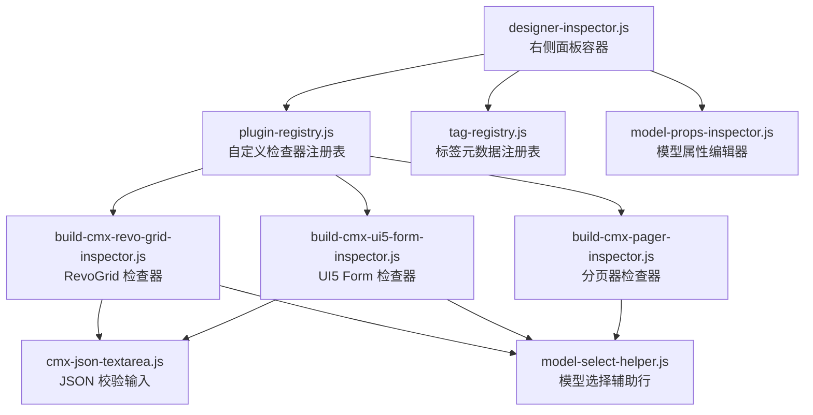
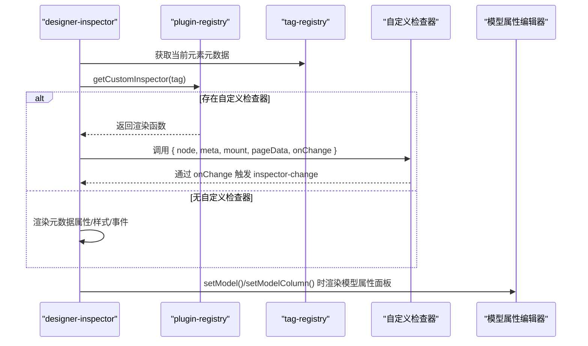
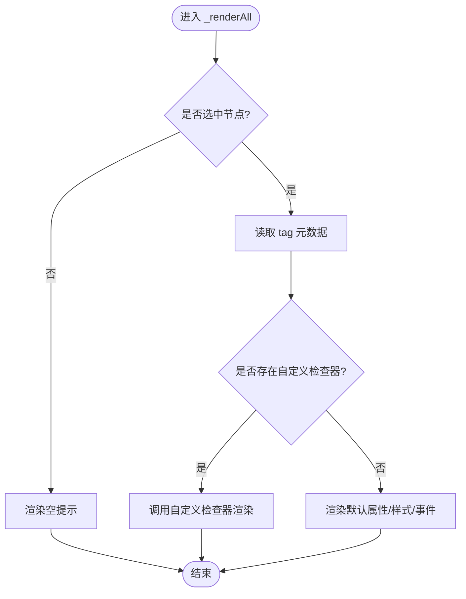
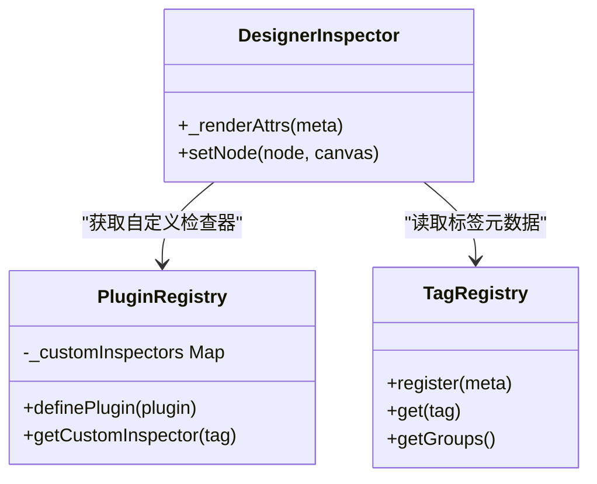
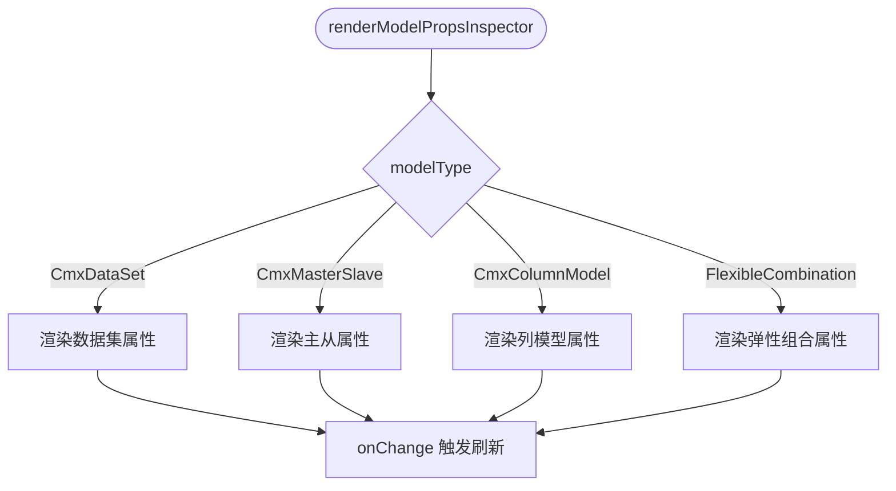
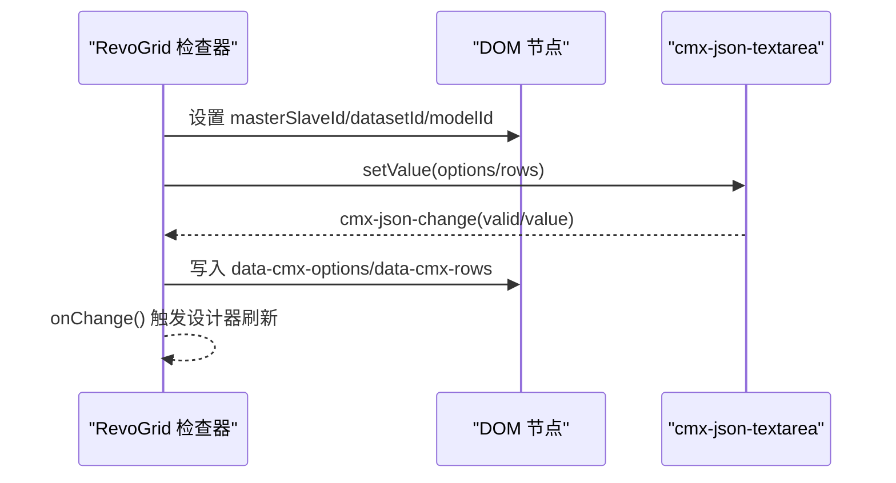
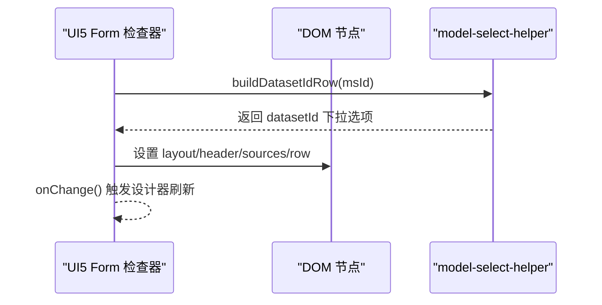
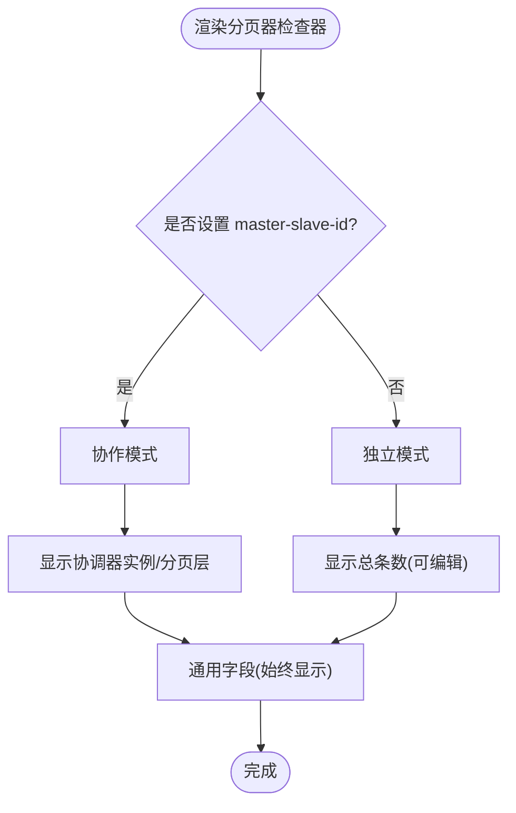
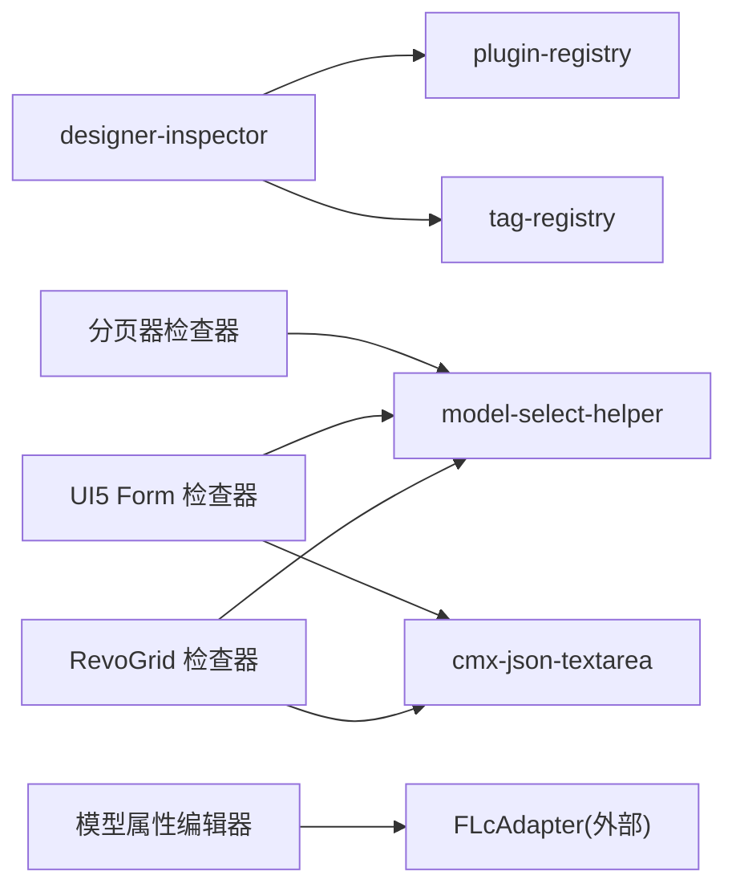

# 自定义检查器开发

<cite>
**本文引用的文件列表**
- [designer-inspector.js](file://CMXHTMLDesigner/src/components/designer-inspector.js)
- [designer-inspector-shell-template.js](file://CMXHTMLDesigner/src/components/designer-inspector/designer-inspector-shell-template.js)
- [model-props-inspector.js](file://CMXHTMLDesigner/src/components/designer-inspector/model-props-inspector.js)
- [plugin-registry.js](file://CMXHTMLDesigner/src/lib/plugin-registry.js)
- [tag-registry.js](file://CMXHTMLDesigner/src/metadata/tag-registry.js)
- [build-cmx-revo-grid-inspector.js](file://CMXHTMLDesigner/src/plugins/cmx-inspector/build-cmx-revo-grid-inspector.js)
- [build-cmx-ui5-form-inspector.js](file://CMXHTMLDesigner/src/plugins/cmx-inspector/build-cmx-ui5-form-inspector.js)
- [build-cmx-pager-inspector.js](file://CMXHTMLDesigner/src/plugins/cmx-inspector/build-cmx-pager-inspector.js)
- [cmx-json-textarea.js](file://CMXHTMLDesigner/src/plugins/cmx-inspector/cmx-json-textarea.js)
- [model-select-helper.js](file://CMXHTMLDesigner/src/plugins/cmx-inspector/model-select-helper.js)
</cite>

## 目录
1. [简介](#简介)
2. [项目结构](#项目结构)
3. [核心组件](#核心组件)
4. [架构总览](#架构总览)
5. [详细组件分析](#详细组件分析)
6. [依赖关系分析](#依赖关系分析)
7. [性能与体验优化](#性能与体验优化)
8. [故障排查指南](#故障排查指南)
9. [结论](#结论)
10. [附录：快速上手与最佳实践](#附录快速上手与最佳实践)

## 简介
本文件面向需要在设计器中为复杂组件（如 RevoGrid、UI5 Form、分页器等）创建“可视化属性编辑器”的开发者。文档从系统架构出发，解释检查器（Inspector）如何注册、渲染和交互；并给出针对复杂组件的属性面板实现范式，包括动态属性面板、条件显示、实时预览等能力。最后提供最佳实践与常见问题排查建议。

## 项目结构
检查器系统位于 CMXHTMLDesigner 前端工程内，围绕右侧属性/样式/事件/调试面板展开，并通过插件机制扩展特定组件的检查器。

图表来源
- [designer-inspector.js:15-40](file://CMXHTMLDesigner/src/components/designer-inspector.js#L15-L40)
- [plugin-registry.js:43-95](file://CMXHTMLDesigner/src/lib/plugin-registry.js#L43-L95)
- [tag-registry.js:15-110](file://CMXHTMLDesigner/src/metadata/tag-registry.js#L15-L110)
- [model-props-inspector.js:14-35](file://CMXHTMLDesigner/src/components/designer-inspector/model-props-inspector.js#L14-L35)
- [build-cmx-revo-grid-inspector.js:1-102](file://CMXHTMLDesigner/src/plugins/cmx-inspector/build-cmx-revo-grid-inspector.js#L1-L102)
- [build-cmx-ui5-form-inspector.js:1-146](file://CMXHTMLDesigner/src/plugins/cmx-inspector/build-cmx-ui5-form-inspector.js#L1-L146)
- [build-cmx-pager-inspector.js:1-180](file://CMXHTMLDesigner/src/plugins/cmx-inspector/build-cmx-pager-inspector.js#L1-L180)
- [cmx-json-textarea.js:1-139](file://CMXHTMLDesigner/src/plugins/cmx-inspector/cmx-json-textarea.js#L1-L139)
- [model-select-helper.js:1-132](file://CMXHTMLDesigner/src/plugins/cmx-inspector/model-select-helper.js#L1-L132)

章节来源
- [designer-inspector.js:15-40](file://CMXHTMLDesigner/src/components/designer-inspector.js#L15-L40)
- [designer-inspector-shell-template.js:1-45](file://CMXHTMLDesigner/src/components/designer-inspector/designer-inspector-shell-template.js#L1-L45)

## 核心组件
- 右侧检查器外壳：负责 Tab 切换、节点/模型选中态管理、通用属性/样式/事件面板渲染，以及调用自定义检查器。
- 插件注册表：提供 definePlugin/getCustomInspector，将 tag → 自定义检查器函数进行映射。
- 标签元数据注册表：集中管理标签元数据（属性、样式组、事件预设），供默认属性面板使用。
- 模型属性编辑器：为页面级模型（数据集、主从、列模型、弹性组合）提供专用编辑界面。
- 组件专用检查器：为 RevoGrid、UI5 Form、分页器等复杂组件提供可视化配置入口。
- JSON 文本域：带即时语法校验与格式化能力的多行输入控件。
- 模型选择辅助行：在 Inspector 中渲染“从模型面板选择”的下拉行，支持动态 datasetId 推导。

章节来源
- [designer-inspector.js:48-119](file://CMXHTMLDesigner/src/components/designer-inspector.js#L48-L119)
- [plugin-registry.js:48-95](file://CMXHTMLDesigner/src/lib/plugin-registry.js#L48-L95)
- [tag-registry.js:15-110](file://CMXHTMLDesigner/src/metadata/tag-registry.js#L15-L110)
- [model-props-inspector.js:14-35](file://CMXHTMLDesigner/src/components/designer-inspector/model-props-inspector.js#L14-L35)
- [cmx-json-textarea.js:20-139](file://CMXHTMLDesigner/src/plugins/cmx-inspector/cmx-json-textarea.js#L20-L139)
- [model-select-helper.js:18-132](file://CMXHTMLDesigner/src/plugins/cmx-inspector/model-select-helper.js#L18-L132)

## 架构总览
检查器的渲染流程遵循“优先使用自定义检查器，否则回退到元数据驱动”的策略。

图表来源
- [designer-inspector.js:182-293](file://CMXHTMLDesigner/src/components/designer-inspector.js#L182-L293)
- [plugin-registry.js:91-95](file://CMXHTMLDesigner/src/lib/plugin-registry.js#L91-L95)
- [model-props-inspector.js:14-35](file://CMXHTMLDesigner/src/components/designer-inspector/model-props-inspector.js#L14-L35)

## 详细组件分析

### 检查器外壳与渲染管线
- 外壳职责：维护选中节点/模型状态、Tab 切换、事件绑定、日志输出。
- 渲染优先级：
  - 若当前元素 tag 有自定义检查器，则清空属性面板并交由自定义函数渲染。
  - 否则按元数据生成属性/样式/事件面板。
- 模型模式：当选中页面级模型或列字段时，切换到模型属性编辑器。

图表来源
- [designer-inspector.js:182-293](file://CMXHTMLDesigner/src/components/designer-inspector.js#L182-L293)

章节来源
- [designer-inspector.js:182-293](file://CMXHTMLDesigner/src/components/designer-inspector.js#L182-L293)
- [designer-inspector-shell-template.js:1-45](file://CMXHTMLDesigner/src/components/designer-inspector/designer-inspector-shell-template.js#L1-L45)

### 插件注册与扩展点
- 定义插件：通过 definePlugin 注册组件元数据与自定义检查器映射。
- 获取检查器：getCustomInspector(tag) 返回渲染函数，供外壳调用。
- 重注册支持：HMR 场景下可覆盖已有 tag 的元数据与检查器。

图表来源
- [plugin-registry.js:48-95](file://CMXHTMLDesigner/src/lib/plugin-registry.js#L48-L95)
- [tag-registry.js:15-110](file://CMXHTMLDesigner/src/metadata/tag-registry.js#L15-L110)
- [designer-inspector.js:270-293](file://CMXHTMLDesigner/src/components/designer-inspector.js#L270-L293)

章节来源
- [plugin-registry.js:48-95](file://CMXHTMLDesigner/src/lib/plugin-registry.js#L48-L95)
- [designer-inspector.js:270-293](file://CMXHTMLDesigner/src/components/designer-inspector.js#L270-L293)

### 模型属性编辑器（数据集/主从/列模型/弹性组合）
- 根据 modelType 路由到对应渲染函数，统一通过 onChange 通知上层刷新。
- 支持：
  - 数据集：实例名、数据源、调用时机、初始行、子数据集。
  - 主从：自动加载、加载形态、数据源、分页/深度/过滤等。
  - 列模型：实例名、datasetId、toTitleCols、iconCol、元数据来源。
  - 弹性组合：业务场景、目标列模型绑定、取数来源、内联规则。
- 列详情：基于 FLcAdapter 渲染字段属性，支持枚举值编辑、验证规则增删、提示气泡等。

图表来源
- [model-props-inspector.js:14-35](file://CMXHTMLDesigner/src/components/designer-inspector/model-props-inspector.js#L14-L35)
- [model-props-inspector.js:140-424](file://CMXHTMLDesigner/src/components/designer-inspector/model-props-inspector.js#L140-L424)

章节来源
- [model-props-inspector.js:14-35](file://CMXHTMLDesigner/src/components/designer-inspector/model-props-inspector.js#L14-L35)
- [model-props-inspector.js:140-424](file://CMXHTMLDesigner/src/components/designer-inspector/model-props-inspector.js#L140-L424)
- [model-props-inspector.js:494-590](file://CMXHTMLDesigner/src/components/designer-inspector/model-props-inspector.js#L494-L590)

### 组件专用检查器：RevoGrid
- 绑定项：masterSlaveId、datasetId、modelId（CmxColumnModel）。
- 配置区：options、rows 使用 cmx-json-textarea 进行 JSON 校验与格式化。
- 运行时约定：配置序列化到 data-cmx-* 属性，由组件在连接生命周期读取并调用 API。

图表来源
- [build-cmx-revo-grid-inspector.js:20-102](file://CMXHTMLDesigner/src/plugins/cmx-inspector/build-cmx-revo-grid-inspector.js#L20-L102)
- [cmx-json-textarea.js:69-135](file://CMXHTMLDesigner/src/plugins/cmx-inspector/cmx-json-textarea.js#L69-L135)

章节来源
- [build-cmx-revo-grid-inspector.js:20-102](file://CMXHTMLDesigner/src/plugins/cmx-inspector/build-cmx-revo-grid-inspector.js#L20-L102)
- [cmx-json-textarea.js:20-139](file://CMXHTMLDesigner/src/plugins/cmx-inspector/cmx-json-textarea.js#L20-L139)

### 组件专用检查器：UI5 Form
- 绑定项：masterSlaveId、datasetId（随 msId 变化动态更新）、modelId（CmxColumnModel）。
- 布局与标题：layout、header 文本输入。
- 字段定义：sources（字典）、row（初始行数据）使用 cmx-json-textarea。
- 行为约定：默认以 kind=single 绑定表单，游标切换时自动刷新字段。

图表来源
- [build-cmx-ui5-form-inspector.js:22-146](file://CMXHTMLDesigner/src/plugins/cmx-inspector/build-cmx-ui5-form-inspector.js#L22-L146)
- [model-select-helper.js:111-132](file://CMXHTMLDesigner/src/plugins/cmx-inspector/model-select-helper.js#L111-L132)

章节来源
- [build-cmx-ui5-form-inspector.js:22-146](file://CMXHTMLDesigner/src/plugins/cmx-inspector/build-cmx-ui5-form-inspector.js#L22-L146)
- [model-select-helper.js:18-132](file://CMXHTMLDesigner/src/plugins/cmx-inspector/model-select-helper.js#L18-L132)

### 组件专用检查器：分页器（cmx-pager）
- 模式判定：是否填写 master-slave-id 决定独立/协作模式。
- 协作字段：协调器实例、分页层（layer）。
- 通用字段：初始每页大小、每页大小选项、紧凑模式。
- 独立字段：总条数（仅独立模式有效）。
- 交互特性：切换 master-slave-id 时整体重渲染，启用/灰显字段跟随模式变化。

图表来源
- [build-cmx-pager-inspector.js:76-180](file://CMXHTMLDesigner/src/plugins/cmx-inspector/build-cmx-pager-inspector.js#L76-L180)

章节来源
- [build-cmx-pager-inspector.js:76-180](file://CMXHTMLDesigner/src/plugins/cmx-inspector/build-cmx-pager-inspector.js#L76-L180)

### JSON 文本域与模型选择辅助
- cmx-json-textarea：提供 label、placeholder、rows 属性；setValue/getValue/getParsed；监听 cmx-json-change 事件；内置格式化按钮与状态指示。
- model-select-helper：
  - buildModelSelectRow：渲染“输入+可选下拉”的组合行，支持从 pageData._models 中筛选候选。
  - buildDatasetIdRow：根据 masterSlaveId 动态切换 datasetId 的来源（schema 路径 vs CmxDataSet 实例）。

章节来源
- [cmx-json-textarea.js:20-139](file://CMXHTMLDesigner/src/plugins/cmx-inspector/cmx-json-textarea.js#L20-L139)
- [model-select-helper.js:18-132](file://CMXHTMLDesigner/src/plugins/cmx-inspector/model-select-helper.js#L18-L132)

## 依赖关系分析
- designer-inspector 依赖 plugin-registry 获取自定义检查器，依赖 tag-registry 获取标签元数据。
- 各组件检查器依赖 model-select-helper 与 cmx-json-textarea 提升交互体验。
- 模型属性编辑器依赖 FLcAdapter（来自 cmx-data-comp）进行字段级双向绑定与上下文适配。

图表来源
- [designer-inspector.js:15-40](file://CMXHTMLDesigner/src/components/designer-inspector.js#L15-L40)
- [build-cmx-revo-grid-inspector.js:1-102](file://CMXHTMLDesigner/src/plugins/cmx-inspector/build-cmx-revo-grid-inspector.js#L1-L102)
- [build-cmx-ui5-form-inspector.js:1-146](file://CMXHTMLDesigner/src/plugins/cmx-inspector/build-cmx-ui5-form-inspector.js#L1-L146)
- [build-cmx-pager-inspector.js:1-180](file://CMXHTMLDesigner/src/plugins/cmx-inspector/build-cmx-pager-inspector.js#L1-L180)
- [model-props-inspector.js:1-14](file://CMXHTMLDesigner/src/components/designer-inspector/model-props-inspector.js#L1-L14)

章节来源
- [designer-inspector.js:15-40](file://CMXHTMLDesigner/src/components/designer-inspector.js#L15-L40)
- [plugin-registry.js:48-95](file://CMXHTMLDesigner/src/lib/plugin-registry.js#L48-L95)
- [tag-registry.js:15-110](file://CMXHTMLDesigner/src/metadata/tag-registry.js#L15-L110)

## 性能与体验优化
- 局部重渲染：在模式切换（如分页器 master-slave-id）时仅重建当前面板内容，避免全量刷新。
- 条件显示：根据上下文（如是否协作模式）启用/禁用字段，减少无效操作。
- 实时校验：JSON 文本域即时反馈有效性，降低错误配置成本。
- 联动提示：datasetId 随 masterSlaveId 变化动态更新选项，提升易用性。
- 防抖与节流：对频繁输入（如 JSON 文本域）可通过外层逻辑控制 onChange 频率（建议在业务侧按需实现）。
- 内存管理：事件监听与 CodeMirror 视图在切换时正确销毁与释放，避免泄漏。

[本节为通用指导，不直接分析具体文件]

## 故障排查指南
- 自定义检查器未生效：
  - 确认已调用 definePlugin 并包含 customInspectors 映射。
  - 检查 getCustomInspector(tag) 是否能返回函数。
  - 查看外壳 _renderAttrs 分支是否正确调用自定义函数。
- JSON 校验失败：
  - 使用 cmx-json-textarea 的状态提示定位错误信息。
  - 确保 onChange 仅在 valid=true 时写入属性。
- 模型选择为空：
  - 检查 pageData._models 是否包含对应 modelType。
  - 对于 datasetId，确认 masterSlaveId 对应的 schema 是否存在。
- 面板不刷新：
  - 确保每次属性变更后调用 onChange，触发 inspector-change 事件。
  - 模型属性编辑器需调用 refreshModelsList 保证列表同步。

章节来源
- [designer-inspector.js:270-293](file://CMXHTMLDesigner/src/components/designer-inspector.js#L270-L293)
- [cmx-json-textarea.js:108-135](file://CMXHTMLDesigner/src/plugins/cmx-inspector/cmx-json-textarea.js#L108-L135)
- [model-select-helper.js:111-132](file://CMXHTMLDesigner/src/plugins/cmx-inspector/model-select-helper.js#L111-L132)
- [model-props-inspector.js:217-227](file://CMXHTMLDesigner/src/components/designer-inspector/model-props-inspector.js#L217-L227)

## 结论
该检查器体系通过“外壳 + 插件 + 元数据”的分层设计，既保证了通用组件的快速配置，又为复杂组件提供了高度定制的可视化编辑能力。借助 JSON 文本域、模型选择辅助与条件渲染，开发者可以高效构建动态属性面板、条件显示与实时预览功能。遵循本文的最佳实践，可在保证稳定性的同时显著提升用户体验。

[本节为总结，不直接分析具体文件]

## 附录：快速上手与最佳实践

### 为复杂组件创建可视化属性编辑器
- 步骤概览：
  1) 在插件中定义 customInspectors 映射 tag → 渲染函数。
  2) 渲染函数接收 { node, meta, mount, pageData, onChange }。
  3) 使用 model-select-helper 构建模型选择行，使用 cmx-json-textarea 处理 JSON 配置。
  4) 变更时写入 data-cmx-* 属性并调用 onChange。
- 参考实现：
  - RevoGrid：[build-cmx-revo-grid-inspector.js:20-102](file://CMXHTMLDesigner/src/plugins/cmx-inspector/build-cmx-revo-grid-inspector.js#L20-L102)
  - UI5 Form：[build-cmx-ui5-form-inspector.js:22-146](file://CMXHTMLDesigner/src/plugins/cmx-inspector/build-cmx-ui5-form-inspector.js#L22-L146)
  - 分页器：[build-cmx-pager-inspector.js:76-180](file://CMXHTMLDesigner/src/plugins/cmx-inspector/build-cmx-pager-inspector.js#L76-L180)

### 动态属性面板与条件显示
- 依据上下文（如 masterSlaveId）动态渲染 datasetId 选项。
- 根据模式（独立/协作）启用或禁用字段，并提供提示文案。
- 参考：
  - datasetId 动态行：[model-select-helper.js:111-132](file://CMXHTMLDesigner/src/plugins/cmx-inspector/model-select-helper.js#L111-L132)
  - 分页器模式切换：[build-cmx-pager-inspector.js:76-180](file://CMXHTMLDesigner/src/plugins/cmx-inspector/build-cmx-pager-inspector.js#L76-L180)

### 实时预览与校验
- 使用 cmx-json-textarea 的 cmx-json-change 事件，在 valid=true 时写入配置。
- 通过 onChange 触发设计器刷新，实现所见即所得。
- 参考：
  - JSON 文本域事件：[cmx-json-textarea.js:69-135](file://CMXHTMLDesigner/src/plugins/cmx-inspector/cmx-json-textarea.js#L69-L135)
  - 检查器外壳事件派发：[designer-inspector.js:283-293](file://CMXHTMLDesigner/src/components/designer-inspector.js#L283-L293)

### 最佳实践
- 保持属性最小化：只暴露必要配置，复杂结构引导至模型面板。
- 明确数据契约：使用 data-cmx-* 属性作为组件间约定，便于运行时解析。
- 增强可发现性：提供占位符、示例值与帮助文案，降低学习成本。
- 错误友好：即时校验与清晰错误提示，避免静默失败。
- 可维护性：复用 model-select-helper 与 cmx-json-textarea，减少重复代码。

[本节为实践指导，不直接分析具体文件]