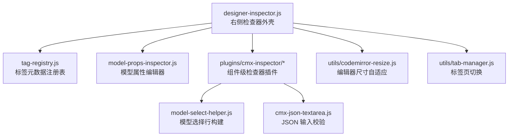
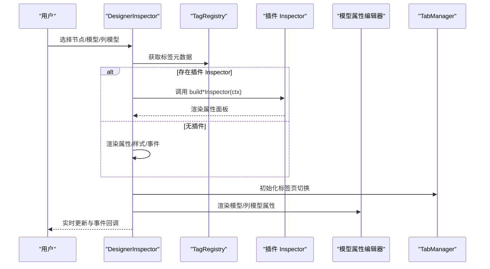
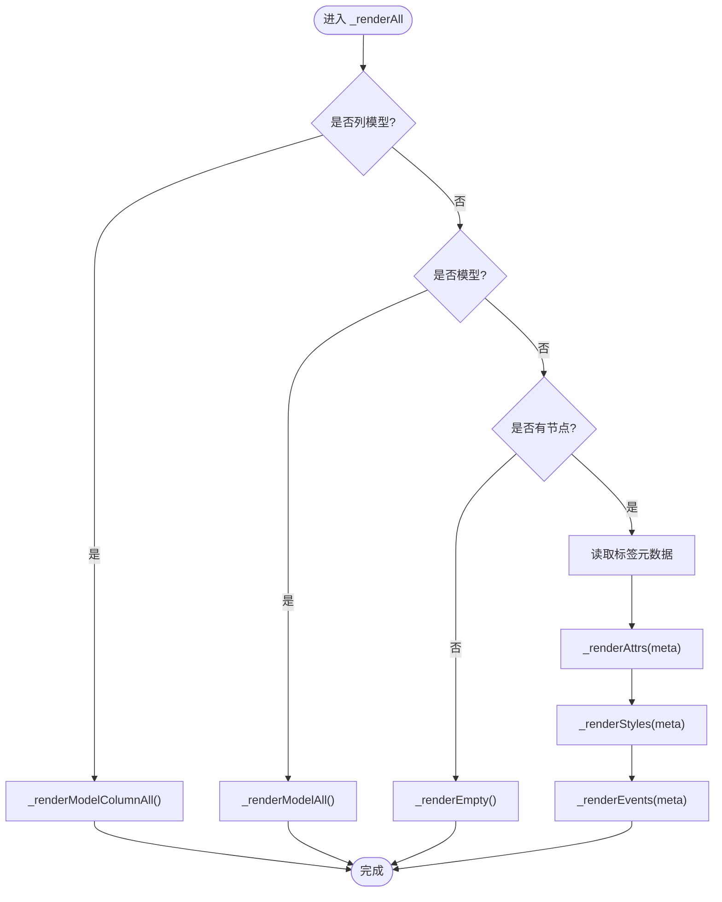
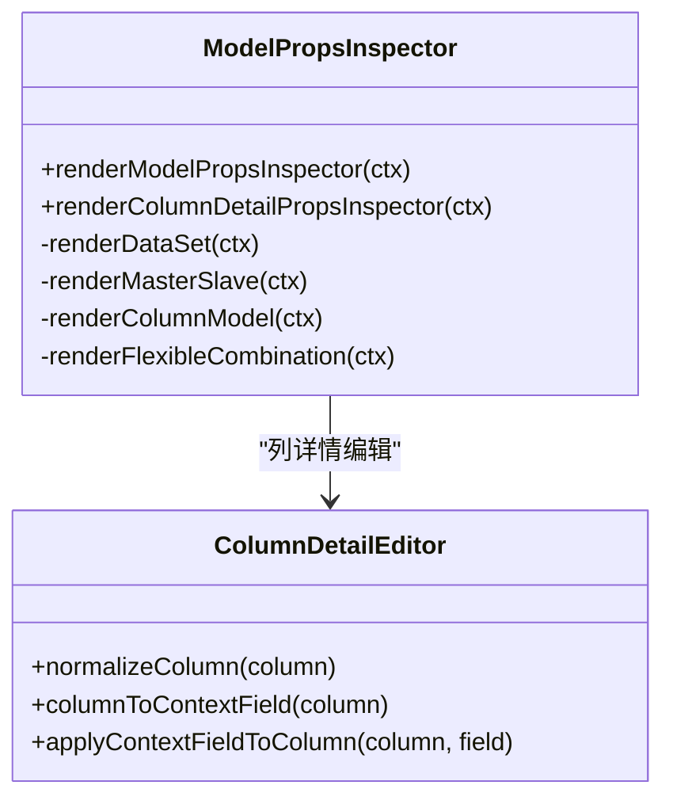
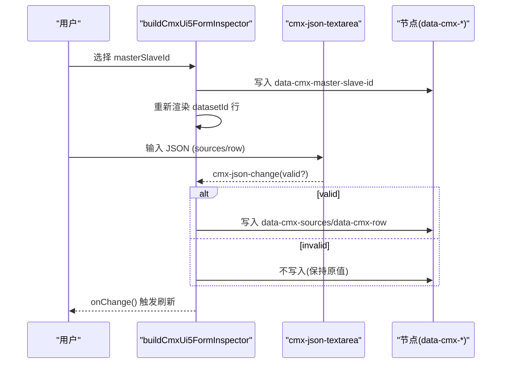
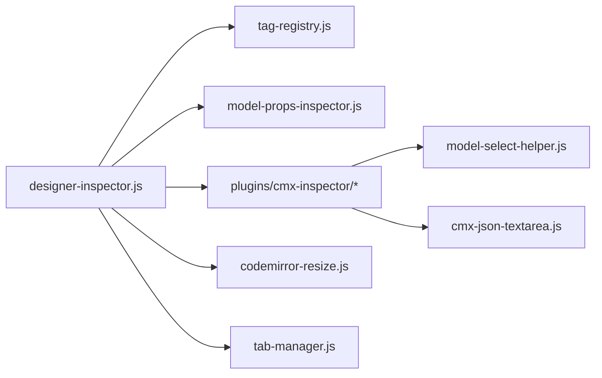

# 自定义检查器最佳实践

<cite>
**本文引用的文件**
- [designer-inspector.js](file://CMXHTMLDesigner/src/components/designer-inspector.js)
- [model-props-inspector.js](file://CMXHTMLDesigner/src/components/designer-inspector/model-props-inspector.js)
- [tag-registry.js](file://CMXHTMLDesigner/src/metadata/tag-registry.js)
- [build-cmx-ui5-form-inspector.js](file://CMXHTMLDesigner/src/plugins/cmx-inspector/build-cmx-ui5-form-inspector.js)
- [build-cmx-revo-grid-inspector.js](file://CMXHTMLDesigner/src/plugins/cmx-inspector/build-cmx-revo-grid-inspector.js)
- [model-select-helper.js](file://CMXHTMLDesigner/src/plugins/cmx-inspector/model-select-helper.js)
- [cmx-json-textarea.js](file://CMXHTMLDesigner/src/plugins/cmx-inspector/cmx-json-textarea.js)
- [codemirror-resize.js](file://CMXHTMLDesigner/src/utils/codemirror-resize.js)
- [tab-manager.js](file://CMXHTMLDesigner/src/utils/tab-manager.js)
</cite>

## 目录
1. [简介](#简介)
2. [项目结构](#项目结构)
3. [核心组件](#核心组件)
4. [架构总览](#架构总览)
5. [详细组件分析](#详细组件分析)
6. [依赖关系分析](#依赖关系分析)
7. [性能考虑](#性能考虑)
8. [故障排查指南](#故障排查指南)
9. [结论](#结论)
10. [附录](#附录)

## 简介
本文件面向在 CMX HTML Designer 中开发“自定义检查器（Inspector）”的工程师，总结属性验证、错误处理、用户体验优化、动态字段与条件渲染、实时预览、性能优化（懒加载、虚拟滚动、防抖）、测试与调试方法，以及代码复用与组件化设计建议。文档基于仓库中的检查器实现与插件体系进行提炼，确保可落地到实际工程。

## 项目结构
- 右侧检查器主容器：负责标签页切换、节点/模型/列模型的渲染调度、事件脚本编辑、调试日志输出等。
- 模型属性编辑器：针对 CmxDataSet、CmxMasterSlave、CmxColumnModel、FlexibleCombination 提供专用编辑界面。
- 标签元数据注册表：集中管理标签属性、样式分组、事件预设，支持运行时加载与扩展。
- 组件级检查器插件：为 cmx-ui5-form、cmx-revo-grid 等组件提供专属 Inspector，统一通过 data-cmx-* 属性序列化配置。
- 通用工具：Tab 切换管理器、CodeMirror 尺寸自适应、JSON 文本域校验等。

图表来源
- [designer-inspector.js:1-120](file://CMXHTMLDesigner/src/components/designer-inspector.js#L1-L120)
- [tag-registry.js:1-149](file://CMXHTMLDesigner/src/metadata/tag-registry.js#L1-L149)
- [model-props-inspector.js:1-120](file://CMXHTMLDesigner/src/components/designer-inspector/model-props-inspector.js#L1-L120)
- [build-cmx-ui5-form-inspector.js:1-146](file://CMXHTMLDesigner/src/plugins/cmx-inspector/build-cmx-ui5-form-inspector.js#L1-L146)
- [build-cmx-revo-grid-inspector.js:1-102](file://CMXHTMLDesigner/src/plugins/cmx-inspector/build-cmx-revo-grid-inspector.js#L1-L102)
- [model-select-helper.js:1-132](file://CMXHTMLDesigner/src/plugins/cmx-inspector/model-select-helper.js#L1-L132)
- [cmx-json-textarea.js:1-139](file://CMXHTMLDesigner/src/plugins/cmx-inspector/cmx-json-textarea.js#L1-L139)
- [codemirror-resize.js:1-59](file://CMXHTMLDesigner/src/utils/codemirror-resize.js#L1-L59)
- [tab-manager.js:1-55](file://CMXHTMLDesigner/src/utils/tab-manager.js#L1-L55)

章节来源
- [designer-inspector.js:1-120](file://CMXHTMLDesigner/src/components/designer-inspector.js#L1-L120)
- [tag-registry.js:1-149](file://CMXHTMLDesigner/src/metadata/tag-registry.js#L1-L149)

## 核心组件
- 右侧检查器外壳（DesignerInspector）
  - 职责：绑定选中节点/模型/列模型；渲染属性、样式、事件面板；集成 CodeMirror 事件脚本编辑器；输出调试日志；派发 inspector-change 等事件。
  - 关键点：优先使用插件 hook 渲染特定组件的属性；UI5 元素支持 slot 设置；事件脚本支持 debugger 插入与提示。
- 模型属性编辑器（renderModelPropsInspector / renderColumnDetailPropsInspector）
  - 职责：按模型类型渲染不同编辑区；将用户输入写回 model.props/column；对 JSON 输入做即时校验并反馈错误。
  - 关键点：CmxMasterSlave 自动加载开关与加载形态联动；FlexibleCombination 多表绑定行编辑；列详情编辑支持枚举值与校验规则增删。
- 标签元数据注册表（TagRegistry）
  - 职责：集中管理标签属性、样式分组、事件预设；支持组扩展与默认行为；异步加载元数据。
  - 关键点：get(tag) 提供兜底元信息；ensureTagRegistryLoaded 一次性加载并缓存 Promise。
- 组件级检查器插件
  - 职责：为具体组件（如 cmx-ui5-form、cmx-revo-grid）提供专属属性编辑界面，统一通过 data-cmx-* 属性序列化配置。
  - 关键点：动态 datasetId 行根据 masterSlaveId 变化更新；JSON 文本域提供格式化与即时校验。
- 通用工具
  - TabManager：封装标签页激活逻辑，消除重复状态切换。
  - CodeMirror 尺寸自适应：ResizeObserver + requestMeasure 保证编辑器尺寸变化后正确重排。
  - cmx-json-textarea：JSON 输入框，提供格式化、状态提示与 cmx-json-change 事件。

章节来源
- [designer-inspector.js:120-800](file://CMXHTMLDesigner/src/components/designer-inspector.js#L120-L800)
- [model-props-inspector.js:140-424](file://CMXHTMLDesigner/src/components/designer-inspector/model-props-inspector.js#L140-L424)
- [tag-registry.js:15-149](file://CMXHTMLDesigner/src/metadata/tag-registry.js#L15-L149)
- [build-cmx-ui5-form-inspector.js:22-146](file://CMXHTMLDesigner/src/plugins/cmx-inspector/build-cmx-ui5-form-inspector.js#L22-L146)
- [build-cmx-revo-grid-inspector.js:20-102](file://CMXHTMLDesigner/src/plugins/cmx-inspector/build-cmx-revo-grid-inspector.js#L20-L102)
- [model-select-helper.js:18-132](file://CMXHTMLDesigner/src/plugins/cmx-inspector/model-select-helper.js#L18-L132)
- [cmx-json-textarea.js:20-139](file://CMXHTMLDesigner/src/plugins/cmx-inspector/cmx-json-textarea.js#L20-L139)
- [codemirror-resize.js:1-59](file://CMXHTMLDesigner/src/utils/codemirror-resize.js#L1-L59)
- [tab-manager.js:1-55](file://CMXHTMLDesigner/src/utils/tab-manager.js#L1-L55)

## 架构总览
检查器采用“外壳 + 插件 + 元数据驱动”的架构：
- 外壳负责生命周期、路由渲染、事件脚本编辑与调试。
- 插件通过 getCustomInspector 钩子接管特定组件的属性渲染。
- 元数据驱动属性/样式/事件面板生成，减少硬编码。

图表来源
- [designer-inspector.js:171-266](file://CMXHTMLDesigner/src/components/designer-inspector.js#L171-L266)
- [tag-registry.js:57-109](file://CMXHTMLDesigner/src/metadata/tag-registry.js#L57-L109)
- [model-props-inspector.js:14-31](file://CMXHTMLDesigner/src/components/designer-inspector/model-props-inspector.js#L14-L31)
- [tab-manager.js:24-55](file://CMXHTMLDesigner/src/utils/tab-manager.js#L24-L55)

## 详细组件分析

### 右侧检查器外壳（DesignerInspector）
- 渲染流程
  - setNode/setModel/setModelColumn 触发 _renderAll，按优先级渲染列模型、模型或节点。
  - 节点渲染时优先查询插件 Inspector，否则走元数据驱动的通用渲染。
  - 事件面板使用 CodeMirror，支持 debugger 插入、事件脚本提示、绑定/移除事件。
- 属性与样式
  - 属性：支持布尔、选择、文本/数字/URL 类型；支持数据绑定弹出层；支持 UI5 slot 设置。
  - 样式：按样式分组渲染，支持颜色、选择、数值；原始 style 文本区一键应用。
- 调试与交互
  - 内置调试日志，限制长度与时间戳截取；控制台镜像开关通过事件通知上层。
  - 标签页由 TabManager 统一管理。

图表来源
- [designer-inspector.js:182-266](file://CMXHTMLDesigner/src/components/designer-inspector.js#L182-L266)
- [designer-inspector.js:270-598](file://CMXHTMLDesigner/src/components/designer-inspector.js#L270-L598)
- [designer-inspector.js:601-705](file://CMXHTMLDesigner/src/components/designer-inspector.js#L601-L705)

章节来源
- [designer-inspector.js:182-800](file://CMXHTMLDesigner/src/components/designer-inspector.js#L182-L800)

### 模型属性编辑器（renderModelPropsInspector）
- 分发策略：根据 modelType 选择对应渲染函数（DataSet/MasterSlave/ColumnModel/FlexibleCombination）。
- 关键特性：
  - CmxMasterSlave：自动加载开关、加载形态（list/detail）联动显示分页/过滤/深度等字段。
  - FlexibleCombination：多表绑定行编辑，状态提示；内联规则 JSON 校验。
  - 列详情编辑：视图归一化、上下文字段映射、枚举值与校验规则增删。
- 输入校验：JSON 文本区即时解析，错误消息直接展示。

图表来源
- [model-props-inspector.js:14-31](file://CMXHTMLDesigner/src/components/designer-inspector/model-props-inspector.js#L14-L31)
- [model-props-inspector.js:140-424](file://CMXHTMLDesigner/src/components/designer-inspector/model-props-inspector.js#L140-L424)
- [model-props-inspector.js:541-590](file://CMXHTMLDesigner/src/components/designer-inspector/model-props-inspector.js#L541-L590)

章节来源
- [model-props-inspector.js:14-424](file://CMXHTMLDesigner/src/components/designer-inspector/model-props-inspector.js#L14-L424)
- [model-props-inspector.js:541-590](file://CMXHTMLDesigner/src/components/designer-inspector/model-props-inspector.js#L541-L590)

### 组件级检查器插件（以 cmx-ui5-form 为例）
- 功能要点：
  - 模型选择行：masterSlaveId、datasetId（响应式）、modelId（CmxColumnModel）。
  - layout/header 文本输入，实时写入 data-cmx-* 属性。
  - sources/row 使用 cmx-json-textarea 进行 JSON 校验与格式化。
- 交互流程：

图表来源
- [build-cmx-ui5-form-inspector.js:22-146](file://CMXHTMLDesigner/src/plugins/cmx-inspector/build-cmx-ui5-form-inspector.js#L22-L146)
- [cmx-json-textarea.js:69-139](file://CMXHTMLDesigner/src/plugins/cmx-inspector/cmx-json-textarea.js#L69-L139)

章节来源
- [build-cmx-ui5-form-inspector.js:22-146](file://CMXHTMLDesigner/src/plugins/cmx-inspector/build-cmx-ui5-form-inspector.js#L22-L146)
- [cmx-json-textarea.js:20-139](file://CMXHTMLDesigner/src/plugins/cmx-inspector/cmx-json-textarea.js#L20-L139)

### 标签元数据注册表（TagRegistry）
- 作用：集中管理标签属性、样式分组、事件预设；提供默认行为与扩展点。
- 关键点：
  - ensureTagRegistryLoaded 一次性加载 common-attrs、style-groups、event-presets、tag-index。
  - get(tag) 返回合并后的元数据，包含 attrs/styles/events/defaultSetup。
  - registerGroup 支持插件扩展样式分组。

章节来源
- [tag-registry.js:15-149](file://CMXHTMLDesigner/src/metadata/tag-registry.js#L15-L149)

### 通用工具
- TabManager：统一按钮与面板激活逻辑，支持外部 activate(id)。
- CodeMirror 尺寸自适应：ResizeObserver 监听宿主尺寸变化，调用 view.requestMeasure() 重算布局。
- 模型选择辅助：buildModelSelectRow 提供输入+下拉选择；buildDatasetIdRow 根据 masterSlaveId 动态切换选项源。

章节来源
- [tab-manager.js:1-55](file://CMXHTMLDesigner/src/utils/tab-manager.js#L1-L55)
- [codemirror-resize.js:1-59](file://CMXHTMLDesigner/src/utils/codemirror-resize.js#L1-L59)
- [model-select-helper.js:18-132](file://CMXHTMLDesigner/src/plugins/cmx-inspector/model-select-helper.js#L18-L132)

## 依赖关系分析
- 耦合度
  - designer-inspector.js 与 tag-registry.js 松耦合，通过 registry.get(tag) 解耦标签元数据。
  - 插件通过 getCustomInspector 钩子接入，避免修改外壳逻辑。
  - 模型属性编辑器与 pageData 通过回调 onChange 通信，降低直接依赖。
- 外部依赖
  - SAP UI5 Web Components 用于表单控件。
  - CodeMirror 6 用于事件脚本编辑。
  - ResizeObserver 用于尺寸自适应。

图表来源
- [designer-inspector.js:15-39](file://CMXHTMLDesigner/src/components/designer-inspector.js#L15-L39)
- [build-cmx-ui5-form-inspector.js:9-11](file://CMXHTMLDesigner/src/plugins/cmx-inspector/build-cmx-ui5-form-inspector.js#L9-L11)
- [build-cmx-revo-grid-inspector.js:9-11](file://CMXHTMLDesigner/src/plugins/cmx-inspector/build-cmx-revo-grid-inspector.js#L9-L11)

章节来源
- [designer-inspector.js:15-39](file://CMXHTMLDesigner/src/components/designer-inspector.js#L15-L39)
- [build-cmx-ui5-form-inspector.js:9-11](file://CMXHTMLDesigner/src/plugins/cmx-inspector/build-cmx-ui5-form-inspector.js#L9-L11)
- [build-cmx-revo-grid-inspector.js:9-11](file://CMXHTMLDesigner/src/plugins/cmx-inspector/build-cmx-revo-grid-inspector.js#L9-L11)

## 性能考虑
- 懒加载与按需渲染
  - 标签元数据异步加载，避免阻塞首屏；ensureTagRegistryLoaded 返回同一 Promise，防止重复请求。
  - 事件脚本编辑器仅在打开对应事件时创建，关闭时销毁并 detach ResizeObserver，避免内存泄漏。
- 虚拟滚动与大数据集
  - 检查器侧未直接实现虚拟滚动；建议在数据面板或网格组件中使用虚拟化方案，检查器仅负责配置编辑。
- 防抖与节流
  - JSON 文本域即时校验，但只在有效时写入属性，减少无效重绘。
  - 模型属性变更通过 onChange 聚合更新，避免频繁触发页面数据刷新。
- 资源释放
  - CodeMirror 实例在切换模型/列模型时显式 destroy，并 detach 尺寸监听，避免残留监听器。

[本节为通用指导，不直接分析具体文件]

## 故障排查指南
- 常见问题定位
  - 属性未生效：确认 data-cmx-* 属性是否正确写入；检查 cmx-json-textarea 的 valid 状态。
  - 事件脚本不执行：确认 data-event* 属性是否存在；检查 canvas.attachHandler/detachHandler 调用。
  - 样式不更新：确认 ui5-input/ui5-select 的事件绑定；检查原始 style 文本区与应用按钮。
- 调试技巧
  - 使用检查器内置 log 方法输出关键步骤；开启控制台镜像开关同步日志级别。
  - 在事件脚本中插入 debugger，配合浏览器调试器断点。
  - 使用 TagRegistry 的 getGroups/getByGroup 检查样式分组与事件预设是否正确加载。
- 回归与测试
  - 针对 JSON 文本域：覆盖空值、合法 JSON、非法 JSON、格式化前后一致性。
  - 针对模型属性：覆盖自动加载开关、加载形态切换、多表绑定行增删、枚举值增删。
  - 针对事件面板：覆盖绑定/移除事件、自定义事件名、debugger 插入。

章节来源
- [designer-inspector.js:120-169](file://CMXHTMLDesigner/src/components/designer-inspector.js#L120-L169)
- [designer-inspector.js:673-705](file://CMXHTMLDesigner/src/components/designer-inspector.js#L673-L705)
- [cmx-json-textarea.js:108-139](file://CMXHTMLDesigner/src/plugins/cmx-inspector/cmx-json-textarea.js#L108-L139)
- [model-props-inspector.js:166-186](file://CMXHTMLDesigner/src/components/designer-inspector/model-props-inspector.js#L166-L186)

## 结论
自定义检查器的最佳实践围绕“元数据驱动 + 插件钩子 + 严格输入校验 + 资源管理”展开。通过 TagRegistry 抽象标签能力，通过插件隔离组件差异，通过 JSON 文本域与模型属性编辑器保障配置正确性，通过 CodeMirror 尺寸自适应与实例销毁保障性能与稳定性。遵循本文模式，可快速构建直观、可靠、易维护的检查器。

[本节为总结，不直接分析具体文件]

## 附录
- 设计模式建议
  - 插件化：为新组件添加 Inspector 时，新增 build*Inspector 并通过注册机制接入，避免修改外壳。
  - 元数据驱动：尽量通过 meta.attrs/meta.styles/meta.events 描述属性与样式，减少硬编码。
  - 单向数据流：输入 → 校验 → 写回属性 → 触发 onChange → 上层刷新。
- 用户体验优化
  - 动态字段：根据 masterSlaveId 动态切换 datasetId 选项源。
  - 条件渲染：根据加载形态切换分页/过滤/深度等字段。
  - 实时预览：JSON 文本域即时校验并给出状态提示。
- 代码复用与组件化
  - 复用 model-select-helper 构建模型选择行。
  - 复用 cmx-json-textarea 提供 JSON 输入能力。
  - 复用 TabManager 与 CodeMirror 尺寸自适应工具。

[本节为补充建议，不直接分析具体文件]