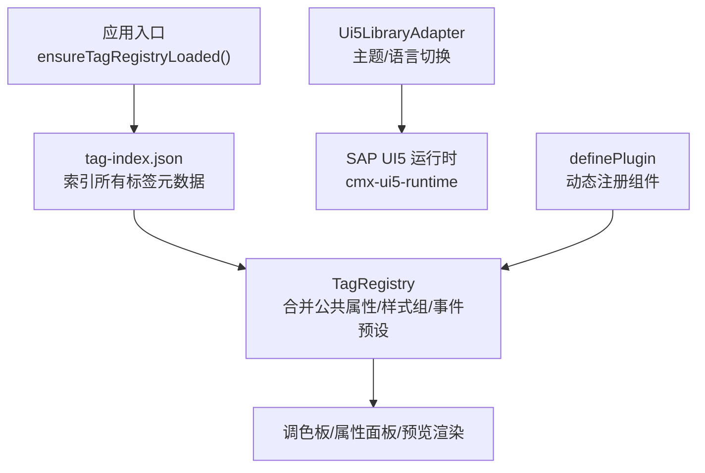
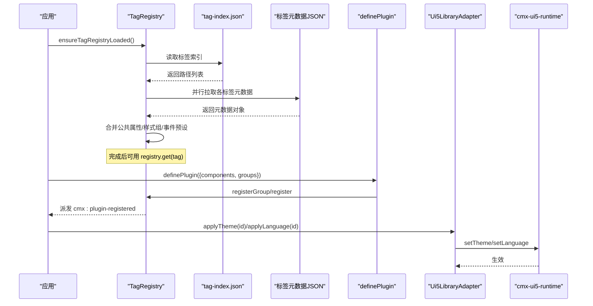
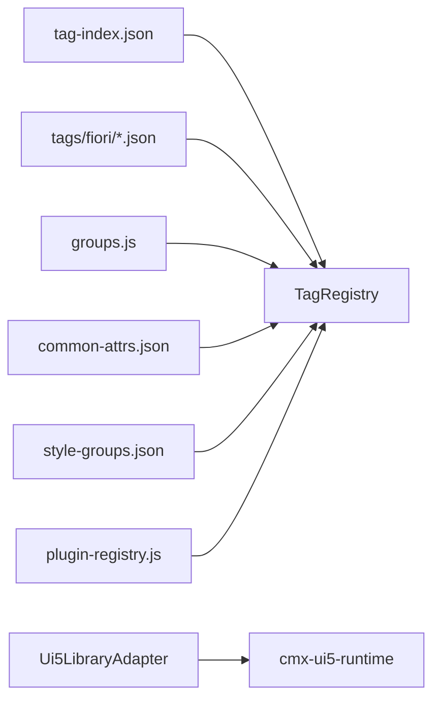

# Fiori设计规范组件插件

<cite>
**本文引用的文件**
- [ui5-library-adapter.js](file://CMXHTMLDesigner/src/lib/ui5-library-adapter.js)
- [component-library-adapter.js](file://CMXHTMLDesigner/src/lib/component-library-adapter.js)
- [tag-registry.js](file://CMXHTMLDesigner/src/metadata/tag-registry.js)
- [groups.js](file://CMXHTMLDesigner/src/metadata/groups.js)
- [common-attrs.json](file://CMXHTMLDesigner/src/metadata/common-attrs.json)
- [style-groups.json](file://CMXHTMLDesigner/src/metadata/style-groups.json)
- [plugin-registry.js](file://CMXHTMLDesigner/src/lib/plugin-registry.js)
- [cmx-ignite-plugin.js](file://CMXHTMLDesigner/src/plugins/cmx-ignite-plugin.js)
- [ui5-shellbar.json](file://CMXHTMLDesigner/src/metadata/tags/fiori/ui5-shellbar.json)
- [ui5-navigation-layout.json](file://CMXHTMLDesigner/src/metadata/tags/fiori/ui5-navigation-layout.json)
- [ui5-dynamic-page.json](file://CMXHTMLDesigner/src/metadata/tags/fiori/ui5-dynamic-page.json)
- [ui5-side-navigation.json](file://CMXHTMLDesigner/src/metadata/tags/fiori/ui5-side-navigation.json)
- [tag-index.json](file://CMXHTMLDesigner/src/metadata/tag-index.json)
</cite>

## 目录
1. [简介](#简介)
2. [项目结构](#项目结构)
3. [核心组件](#核心组件)
4. [架构总览](#架构总览)
5. [详细组件分析](#详细组件分析)
6. [依赖关系分析](#依赖关系分析)
7. [性能考虑](#性能考虑)
8. [故障排查指南](#故障排查指南)
9. [结论](#结论)
10. [附录](#附录)

## 简介
本文件面向希望为遵循 SAP Fiori 设计规范的组件（如 ShellBar、NavigationLayout、DynamicPage、SideNavigation 等）开发“设计器插件”的工程师与设计师。文档从仓库现有实现出发，说明如何在 CMX HTML Designer 中注册、配置和扩展这些组件，涵盖：
- 设计器元数据驱动的组件注册机制
- 主题与语言适配（Horizon/Quartz、暗色/高对比度）
- 事件预设与属性面板生成
- 可访问性与移动端友好的布局模式建议
- 典型组件（导航容器、页面容器、工具栏）的配置方法

## 项目结构
CMX HTML Designer 将“标签元数据”与“运行时适配器”解耦：
- 标签元数据：以 JSON 描述每个自定义元素（包括 ui5-* 系列），包含标签名、分组、属性、插槽、事件、默认值、样式组等。
- 标签注册表：在应用启动时加载 tag-index.json 并拉取各标签元数据，统一注册到 TagRegistry。
- 组件库适配器：抽象出主题/语言切换能力，Ui5LibraryAdapter 提供 SAP UI5/Fiori 的具体实现。
- 插件系统：通过 definePlugin 动态注册新组件或覆盖已有组件元数据，支持 HMR 重注册。

图表来源
- [tag-registry.js:123-145](file://CMXHTMLDesigner/src/metadata/tag-registry.js#L123-L145)
- [ui5-library-adapter.js:25-38](file://CMXHTMLDesigner/src/lib/ui5-library-adapter.js#L25-L38)
- [plugin-registry.js:60-88](file://CMXHTMLDesigner/src/lib/plugin-registry.js#L60-L88)

章节来源
- [tag-registry.js:1-149](file://CMXHTMLDesigner/src/metadata/tag-registry.js#L1-L149)
- [groups.js:1-32](file://CMXHTMLDesigner/src/metadata/groups.js#L1-L32)
- [common-attrs.json:1-37](file://CMXHTMLDesigner/src/metadata/common-attrs.json#L1-L37)
- [style-groups.json:1-407](file://CMXHTMLDesigner/src/metadata/style-groups.json#L1-L407)
- [ui5-library-adapter.js:1-40](file://CMXHTMLDesigner/src/lib/ui5-library-adapter.js#L1-L40)
- [plugin-registry.js:1-95](file://CMXHTMLDesigner/src/lib/plugin-registry.js#L1-L95)

## 核心组件
- 标签注册表（TagRegistry）
  - 负责加载公共属性、样式组、事件预设，以及按 tag-index 批量注册标签元数据。
  - 对未知标签提供兜底元数据，保证拖拽与编辑可用。
- 组件库适配器（ComponentLibraryAdapter / Ui5LibraryAdapter）
  - 暴露 themes、languages、defaultTheme 及 applyTheme/applyLanguage/themeInfo。
  - 当前实现聚焦 Horizon/Quartz 主题族与 zh_CN/en_US 语言。
- 插件注册（definePlugin）
  - 允许在运行时新增分组与组件元数据，支持覆盖与 HMR 热更新。
  - 触发 cmx:plugin-registered 事件，驱动调色板刷新。

章节来源
- [tag-registry.js:15-110](file://CMXHTMLDesigner/src/metadata/tag-registry.js#L15-L110)
- [tag-registry.js:123-145](file://CMXHTMLDesigner/src/metadata/tag-registry.js#L123-L145)
- [component-library-adapter.js:1-40](file://CMXHTMLDesigner/src/lib/component-library-adapter.js#L1-L40)
- [ui5-library-adapter.js:1-40](file://CMXHTMLDesigner/src/lib/ui5-library-adapter.js#L1-L40)
- [plugin-registry.js:1-95](file://CMXHTMLDesigner/src/lib/plugin-registry.js#L1-L95)

## 架构总览
下图展示了“Fiori 组件在设计器中的注册与渲染流程”，包括元数据加载、插件扩展、主题/语言切换。

图表来源
- [tag-registry.js:123-145](file://CMXHTMLDesigner/src/metadata/tag-registry.js#L123-L145)
- [plugin-registry.js:60-88](file://CMXHTMLDesigner/src/lib/plugin-registry.js#L60-L88)
- [ui5-library-adapter.js:25-38](file://CMXHTMLDesigner/src/lib/ui5-library-adapter.js#L25-L38)

## 详细组件分析

### ShellBar（工具栏）
- 元数据要点
  - 标签：ui5-shellbar
  - 分组：fiori
  - 属性：通知计数、搜索开关、产品切换、标题文本等
  - 插槽：startButton、branding、content、searchField、assistant、profile、logo、menuItems、midContent
  - 事件：notifications-click、profile-click、product-switch-click、logo-click、menu-item-click、search-button-click、search-field-toggle、search-field-clear、content-item-visibility-change
  - 默认值：primary-title、secondary-title
- 设计原则与体验
  - 作为应用级顶部导航，承载品牌、搜索、用户菜单与全局操作。
  - 响应式：在小屏隐藏次要内容，保留关键操作；搜索区域可折叠。
  - 可访问性：为交互项提供语义化名称与键盘可达性（由底层 UI5 组件保障）。
- 设计器配置
  - 通过元数据自动出现在“Fiori标签”分组，属性面板由 attrs 自动生成。
  - 可通过插件覆盖或扩展属性与事件。

章节来源
- [ui5-shellbar.json:1-91](file://CMXHTMLDesigner/src/metadata/tags/fiori/ui5-shellbar.json#L1-L91)

### NavigationLayout（侧边导航布局）
- 元数据要点
  - 标签：ui5-navigation-layout
  - 分组：fiori
  - 属性：mode（Auto/Collapsed/Expanded）
  - 插槽：header、sideContent、默认插槽
  - 事件：item-click
- 设计原则与体验
  - 用于构建带侧边导航的主布局，适合复杂业务应用。
  - 响应式：根据屏幕宽度自动切换侧栏展开/收起。
  - 可访问性：侧栏与主内容区域职责清晰，便于屏幕阅读器识别。
- 设计器配置
  - 在“Fiori标签”分组可见；mode 使用 select 类型选项。

章节来源
- [ui5-navigation-layout.json:1-36](file://CMXHTMLDesigner/src/metadata/tags/fiori/ui5-navigation-layout.json#L1-L36)

### DynamicPage（动态页面）
- 元数据要点
  - 标签：ui5-dynamic-page
  - 分组：fiori
  - 属性：hide-pin-button、header-pinned、show-footer
  - 插槽：默认插槽、titleArea、headerArea、footerArea
  - 事件：pin-button-toggle、title-toggle
- 设计原则与体验
  - 支持可折叠标题区与固定头部，适合长表单/详情页。
  - 响应式：标题区在滚动时可折叠，提升信息密度。
  - 可访问性：标题与内容区域分离，利于导航与朗读。
- 设计器配置
  - 通过 slots 组织标题与页脚；事件可用于联动状态。

章节来源
- [ui5-dynamic-page.json:1-43](file://CMXHTMLDesigner/src/metadata/tags/fiori/ui5-dynamic-page.json#L1-L43)

### SideNavigation（侧边导航）
- 元数据要点
  - 标签：ui5-side-navigation
  - 分组：fiori
  - 属性：collapsed、accessible-name
  - 插槽：默认插槽、fixedItems、header
  - 事件：selection-change、item-click
- 设计原则与体验
  - 提供层级导航，适合多模块应用。
  - 响应式：小屏可折叠为抽屉式；collapsed 控制初始状态。
  - 可访问性：accessible-name 增强读屏体验。
- 设计器配置
  - 通过 fixedItems/header 放置固定项与头部；事件驱动选中态。

章节来源
- [ui5-side-navigation.json:1-38](file://CMXHTMLDesigner/src/metadata/tags/fiori/ui5-side-navigation.json#L1-L38)

### 主题与语言适配（最佳实践）
- 主题
  - 支持 Horizon（亮/暗/高对比）、Quartz（亮/暗/高对比）。
  - 通过 Ui5LibraryAdapter.applyTheme 切换主题，默认主题为 Horizon 暗色。
- 语言
  - 支持中文简体与美式英语，通过 applyLanguage 切换。
- 设计器集成
  - 主题/语言选择会调用 cmx-ui5-runtime 的 API 进行运行时切换。
- 最佳实践
  - 在页面初始化时设置默认主题与语言。
  - 针对高对比度主题测试关键对比度与图标可读性。
  - 避免硬编码颜色，优先使用主题变量。

章节来源
- [ui5-library-adapter.js:9-38](file://CMXHTMLDesigner/src/lib/ui5-library-adapter.js#L9-L38)

### 可访问性与移动端优化
- 可访问性
  - 为导航与交互控件提供 accessible-name/title 等语义信息。
  - 确保键盘可达与焦点顺序合理。
- 移动端
  - 合理使用 mode/collapsed 等属性控制布局。
  - 在小屏下减少冗余信息，突出主要操作。
- 设计器层面
  - 通过 style-groups 提供的布局/弹性盒/定位等样式组，快速构建响应式界面。

章节来源
- [style-groups.json:1-407](file://CMXHTMLDesigner/src/metadata/style-groups.json#L1-L407)
- [ui5-side-navigation.json:16-28](file://CMXHTMLDesigner/src/metadata/tags/fiori/ui5-side-navigation.json#L16-L28)

## 依赖关系分析
- 元数据依赖
  - 所有 ui5-* 组件的元数据集中在 tags/fiori 目录下，并通过 tag-index.json 索引。
- 运行时依赖
  - 实际 <ui5-*> 自定义元素由 cmx-ui5-runtime 提供；设计器仅持有元数据。
- 插件依赖
  - 插件通过 definePlugin 向 TagRegistry 注入组件元数据，不影响内置元数据。

图表来源
- [tag-index.json:649-838](file://CMXHTMLDesigner/src/metadata/tag-index.json#L649-L838)
- [tag-registry.js:123-145](file://CMXHTMLDesigner/src/metadata/tag-registry.js#L123-L145)
- [groups.js:1-32](file://CMXHTMLDesigner/src/metadata/groups.js#L1-L32)
- [common-attrs.json:1-37](file://CMXHTMLDesigner/src/metadata/common-attrs.json#L1-L37)
- [style-groups.json:1-407](file://CMXHTMLDesigner/src/metadata/style-groups.json#L1-L407)
- [plugin-registry.js:60-88](file://CMXHTMLDesigner/src/lib/plugin-registry.js#L60-L88)
- [ui5-library-adapter.js:25-38](file://CMXHTMLDesigner/src/lib/ui5-library-adapter.js#L25-L38)

章节来源
- [tag-index.json:649-838](file://CMXHTMLDesigner/src/metadata/tag-index.json#L649-L838)
- [tag-registry.js:1-149](file://CMXHTMLDesigner/src/metadata/tag-registry.js#L1-L149)
- [plugin-registry.js:1-95](file://CMXHTMLDesigner/src/lib/plugin-registry.js#L1-L95)

## 性能考虑
- 元数据按需加载
  - 通过 tag-index.json 与 fetchDesignerMetadataJson 并行拉取，减少首屏体积。
- 插件重注册
  - 支持 HMR 场景下的重复注册，避免全量刷新。
- 主题切换
  - 通过运行时 API 切换主题，避免重建 DOM。

[本节为通用指导，不直接分析具体文件]

## 故障排查指南
- 组件未出现在调色板
  - 检查 ensureTagRegistryLoaded 是否已调用。
  - 确认 tag-index.json 包含对应路径。
  - 若使用插件注册，确认 definePlugin 成功且触发了 cmx:plugin-registered。
- 属性面板不显示或错误
  - 检查 attrs 定义是否与目标组件一致。
  - 确认 eventPreset 与 extraEvents 组合后无冲突。
- 主题/语言无效
  - 确认 Ui5LibraryAdapter 的 applyTheme/applyLanguage 被调用。
  - 检查 cmx-ui5-runtime 是否可用。

章节来源
- [tag-registry.js:123-145](file://CMXHTMLDesigner/src/metadata/tag-registry.js#L123-L145)
- [plugin-registry.js:60-88](file://CMXHTMLDesigner/src/lib/plugin-registry.js#L60-L88)
- [ui5-library-adapter.js:25-38](file://CMXHTMLDesigner/src/lib/ui5-library-adapter.js#L25-L38)

## 结论
本项目通过“元数据 + 适配器 + 插件”的三层架构，为 SAP Fiori 组件提供了可扩展的设计器支持。借助 JSON 元数据与 definePlugin，开发者可以快速注册与定制 ShellBar、NavigationLayout、DynamicPage、SideNavigation 等组件，同时获得主题/语言切换、事件预设与样式组的完整能力。遵循可访问性与响应式设计原则，可在不同设备上提供一致的用户体验。

[本节为总结性内容，不直接分析具体文件]

## 附录

### 如何为新的 Fiori 组件创建设计器插件
- 步骤概览
  - 在 src/metadata/tags/fiori 下新增组件元数据 JSON（参考 shellbar/navigation-layout/dynamic-page/side-navigation）。
  - 在 tag-index.json 中添加该组件的路径映射。
  - 如需运行时行为或自定义属性面板，使用 definePlugin 注册组件元数据与可选 customInspectors。
  - 在应用启动前调用 ensureTagRegistryLoaded，确保元数据加载完成。
- 示例参考
  - 参考现有插件 cmx-ignite-plugin.js 的结构与字段约定。

章节来源
- [cmx-ignite-plugin.js:1-125](file://CMXHTMLDesigner/src/plugins/cmx-ignite-plugin.js#L1-L125)
- [plugin-registry.js:1-95](file://CMXHTMLDesigner/src/lib/plugin-registry.js#L1-L95)
- [tag-index.json:649-838](file://CMXHTMLDesigner/src/metadata/tag-index.json#L649-L838)

### 常用样式组速查
- 布局（layout）：display、width、height、padding、margin、overflow、boxSizing
- 弹性盒（flex）：flexDirection、justifyContent、alignItems、flexWrap、gap、flex、alignSelf
- 文字（text）：color、fontSize、fontFamily、fontWeight、textAlign、lineHeight、whiteSpace
- 盒模型（box）：background、border、borderRadius、boxShadow、opacity、cursor
- 定位（position）：position、top/right/bottom/left、zIndex、transform

章节来源
- [style-groups.json:1-407](file://CMXHTMLDesigner/src/metadata/style-groups.json#L1-L407)