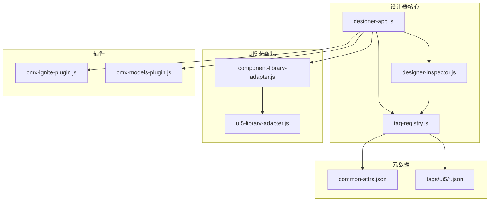
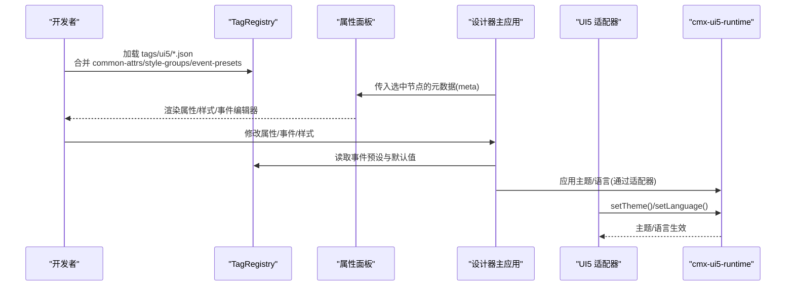
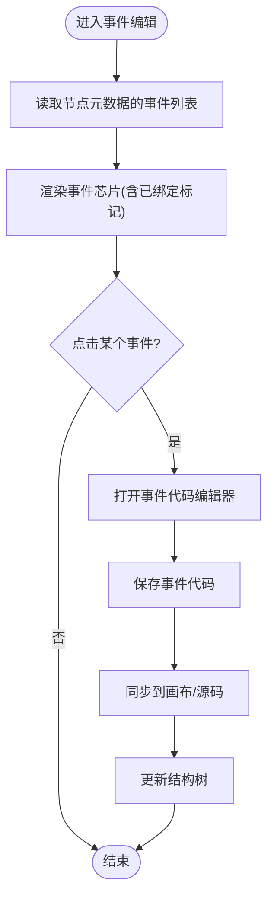
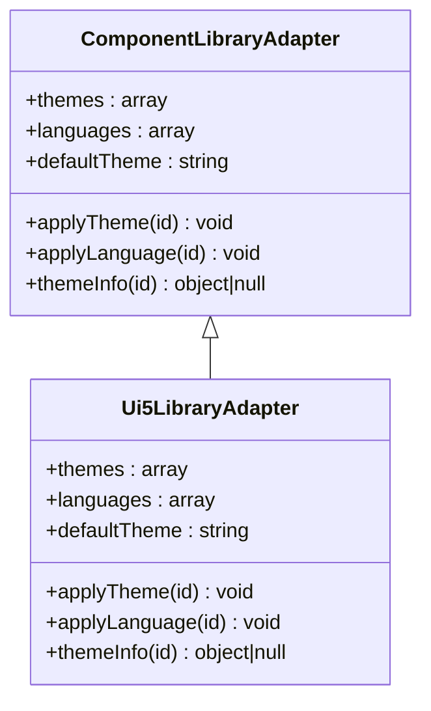
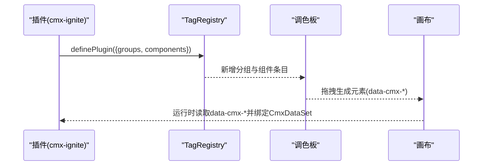
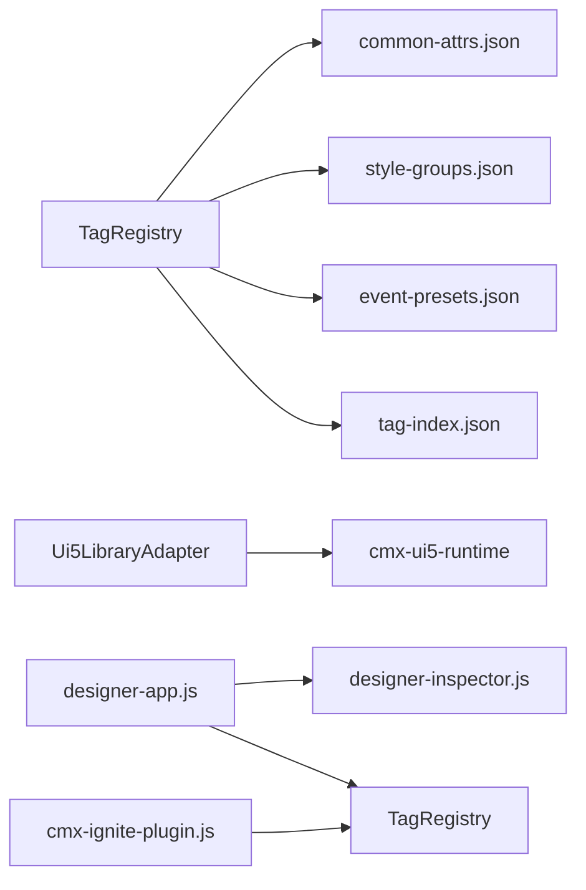

# UI5企业级组件插件

<cite>
**本文引用的文件**
- [ui5-library-adapter.js](file://CMXHTMLDesigner/src/lib/ui5-library-adapter.js)
- [component-library-adapter.js](file://CMXHTMLDesigner/src/lib/component-library-adapter.js)
- [tag-registry.js](file://CMXHTMLDesigner/src/metadata/tag-registry.js)
- [cmx-ignite-plugin.js](file://CMXHTMLDesigner/src/plugins/cmx-ignite-plugin.js)
- [cmx-models-plugin.js](file://CMXHTMLDesigner/src/plugins/cmx-models-plugin.js)
- [designer-app.js](file://CMXHTMLDesigner/src/components/designer-app.js)
- [designer-inspector.js](file://CMXHTMLDesigner/src/components/designer-inspector.js)
- [common-attrs.json](file://CMXHTMLDesigner/src/metadata/common-attrs.json)
- [ui5-button.json](file://CMXHTMLDesigner/src/metadata/tags/ui5/ui5-button.json)
- [ui5-table.json](file://CMXHTMLDesigner/src/metadata/tags/ui5/ui5-table.json)
- [ui5-form.json](file://CMXHTMLDesigner/src/metadata/tags/ui5/ui5-form.json)
- [ui5-dialog.json](file://CMXHTMLDesigner/src/metadata/tags/ui5/ui5-dialog.json)
</cite>

## 目录
1. [简介](#简介)
2. [项目结构](#项目结构)
3. [核心组件](#核心组件)
4. [架构总览](#架构总览)
5. [详细组件分析](#详细组件分析)
6. [依赖关系分析](#依赖关系分析)
7. [性能考虑](#性能考虑)
8. [故障排查指南](#故障排查指南)
9. [结论](#结论)
10. [附录](#附录)

## 简介
本文件面向在企业级门户中为 SAP UI5 组件（如 Button、Table、Form、Dialog 等）开发“设计器插件”的工程师与产品技术负责人，系统说明如何在 CMX HTML Designer 中注册 UI5 组件元数据、配置属性映射、事件绑定、样式分组与国际化/主题切换，并给出与 Ignite UI 组件集成的最佳实践。文档同时覆盖复杂组件（表格、表单、对话框）的配置要点，以及运行时与主题/语言 API 的集成方式。

## 项目结构
CMX HTML Designer 将 UI5/Fiori/HTML 标签的调色板元数据以 JSON 形式组织在 src/metadata/tags 下，并通过 TagRegistry 在运行时动态加载；UI5 主题与语言通过 Ui5LibraryAdapter 适配层对接 cmx-ui5-runtime；Ignite 相关组件通过插件机制注册到调色板；设计器主应用协调画布、源码、属性面板与页面数据。

图表来源
- [designer-app.js:1-636](file://CMXHTMLDesigner/src/components/designer-app.js#L1-L636)
- [designer-inspector.js:600-742](file://CMXHTMLDesigner/src/components/designer-inspector.js#L600-L742)
- [tag-registry.js:1-149](file://CMXHTMLDesigner/src/metadata/tag-registry.js#L1-L149)
- [component-library-adapter.js:1-40](file://CMXHTMLDesigner/src/lib/component-library-adapter.js#L1-L40)
- [ui5-library-adapter.js:1-40](file://CMXHTMLDesigner/src/lib/ui5-library-adapter.js#L1-L40)
- [cmx-ignite-plugin.js:1-125](file://CMXHTMLDesigner/src/plugins/cmx-ignite-plugin.js#L1-L125)
- [cmx-models-plugin.js:1-118](file://CMXHTMLDesigner/src/plugins/cmx-models-plugin.js#L1-L118)
- [common-attrs.json:1-37](file://CMXHTMLDesigner/src/metadata/common-attrs.json#L1-L37)
- [ui5-button.json:1-116](file://CMXHTMLDesigner/src/metadata/tags/ui5/ui5-button.json#L1-L116)
- [ui5-table.json:1-79](file://CMXHTMLDesigner/src/metadata/tags/ui5/ui5-table.json#L1-L79)
- [ui5-form.json:1-90](file://CMXHTMLDesigner/src/metadata/tags/ui5/ui5-form.json#L1-L90)
- [ui5-dialog.json:1-67](file://CMXHTMLDesigner/src/metadata/tags/ui5/ui5-dialog.json#L1-L67)

章节来源
- [designer-app.js:1-636](file://CMXHTMLDesigner/src/components/designer-app.js#L1-L636)
- [tag-registry.js:1-149](file://CMXHTMLDesigner/src/metadata/tag-registry.js#L1-L149)
- [ui5-library-adapter.js:1-40](file://CMXHTMLDesigner/src/lib/ui5-library-adapter.js#L1-L40)
- [cmx-ignite-plugin.js:1-125](file://CMXHTMLDesigner/src/plugins/cmx-ignite-plugin.js#L1-L125)
- [cmx-models-plugin.js:1-118](file://CMXHTMLDesigner/src/plugins/cmx-models-plugin.js#L1-L118)

## 核心组件
- 标签元数据注册表：集中管理 UI5/Fiori/HTML 标签的组、属性、样式分组、事件预设与默认初始化逻辑，支持从 dist/metadata 异步加载全部标签元数据。
- UI5 库适配器：抽象出主题与语言的统一接口，Ui5LibraryAdapter 提供可用主题、语言列表及 applyTheme/applyLanguage 实现，对接 cmx-ui5-runtime。
- 设计器主应用：编排画布、源码、属性面板、页面数据与导入导出流程，处理事件联动与刷新调度。
- 属性面板事件编辑：基于元数据的事件列表渲染与代码编辑器交互，支持预设事件与自定义事件。
- 插件体系：通过 definePlugin 注册调色板分组与组件元数据，包括 Ignite 封装组件与 CMX 数据模型类。

章节来源
- [tag-registry.js:1-149](file://CMXHTMLDesigner/src/metadata/tag-registry.js#L1-L149)
- [component-library-adapter.js:1-40](file://CMXHTMLDesigner/src/lib/component-library-adapter.js#L1-L40)
- [ui5-library-adapter.js:1-40](file://CMXHTMLDesigner/src/lib/ui5-library-adapter.js#L1-L40)
- [designer-app.js:1-636](file://CMXHTMLDesigner/src/components/designer-app.js#L1-L636)
- [designer-inspector.js:600-742](file://CMXHTMLDesigner/src/components/designer-inspector.js#L600-L742)
- [cmx-ignite-plugin.js:1-125](file://CMXHTMLDesigner/src/plugins/cmx-ignite-plugin.js#L1-L125)
- [cmx-models-plugin.js:1-118](file://CMXHTMLDesigner/src/plugins/cmx-models-plugin.js#L1-L118)

## 架构总览
下图展示 UI5 组件在设计器中的注册、配置与运行时的关键路径：元数据驱动属性面板与事件编辑，插件扩展调色板分组与组件定义，UI5 主题/语言通过适配器注入运行时。

图表来源
- [tag-registry.js:120-149](file://CMXHTMLDesigner/src/metadata/tag-registry.js#L120-L149)
- [designer-inspector.js:600-742](file://CMXHTMLDesigner/src/components/designer-inspector.js#L600-L742)
- [ui5-library-adapter.js:25-39](file://CMXHTMLDesigner/src/lib/ui5-library-adapter.js#L25-L39)
- [component-library-adapter.js:17-39](file://CMXHTMLDesigner/src/lib/component-library-adapter.js#L17-L39)

## 详细组件分析

### UI5 组件元数据与属性映射
- 每个 UI5 组件对应一个 JSON 文件，声明 tag、label、description、isVoid、canNest、group、styleGroups、defaults、attrs、slots、extraEvents 等字段。
- 公共属性来自 common-attrs.json，会被自动合并到各组件的属性列表中。
- 事件采用 eventPreset 指定基础事件集合，再通过 extraEvents 追加组件特有事件。
- 默认值 defaults 可设置 attributes、text/html、style，用于拖入画布时自动生成初始 DOM。

示例参考
- ui5-button.json：按钮设计类型、图标、无障碍属性、加载状态等属性与 active-state-change 事件。
- ui5-table.json：表格无数据文本、溢出模式、加载、行操作计数、交替行色等属性与 row-click/row-action-click 等事件。
- ui5-form.json：表单布局、标题层级、项间距等属性。
- ui5-dialog.json：对话框头部文本、拉伸/拖拽/缩放、状态与 open/close 生命周期事件。

章节来源
- [ui5-button.json:1-116](file://CMXHTMLDesigner/src/metadata/tags/ui5/ui5-button.json#L1-L116)
- [ui5-table.json:1-79](file://CMXHTMLDesigner/src/metadata/tags/ui5/ui5-table.json#L1-L79)
- [ui5-form.json:1-90](file://CMXHTMLDesigner/src/metadata/tags/ui5/ui5-form.json#L1-L90)
- [ui5-dialog.json:1-67](file://CMXHTMLDesigner/src/metadata/tags/ui5/ui5-dialog.json#L1-L67)
- [common-attrs.json:1-37](file://CMXHTMLDesigner/src/metadata/common-attrs.json#L1-L37)
- [tag-registry.js:43-109](file://CMXHTMLDesigner/src/metadata/tag-registry.js#L43-L109)

### 事件系统与绑定流程
- 属性面板根据 meta.events 渲染事件芯片，点击后打开代码编辑器进行绑定。
- 事件变更会触发设计器刷新与源码同步，确保画布与源码一致。
- 对于模型节点，属性面板同样支持事件编辑，区分内置事件与自定义事件。

图表来源
- [designer-inspector.js:600-742](file://CMXHTMLDesigner/src/components/designer-inspector.js#L600-L742)
- [designer-app.js:402-431](file://CMXHTMLDesigner/src/components/designer-app.js#L402-L431)

章节来源
- [designer-inspector.js:600-742](file://CMXHTMLDesigner/src/components/designer-inspector.js#L600-L742)
- [designer-app.js:402-431](file://CMXHTMLDesigner/src/components/designer-app.js#L402-L431)

### 主题与国际化集成
- 通过 ComponentLibraryAdapter 抽象主题/语言能力，Ui5LibraryAdapter 提供具体实现。
- 可用主题包含 Horizon 亮/暗/高对比与 Quartz 亮/暗/高对比，默认主题为 Horizon 暗色。
- 语言支持中文简体与美式英语，可通过 applyLanguage 切换。
- 运行时通过 cmx-ui5-runtime 的 setTheme/setLanguage 生效。

图表来源
- [component-library-adapter.js:17-39](file://CMXHTMLDesigner/src/lib/component-library-adapter.js#L17-L39)
- [ui5-library-adapter.js:25-39](file://CMXHTMLDesigner/src/lib/ui5-library-adapter.js#L25-L39)

章节来源
- [ui5-library-adapter.js:1-40](file://CMXHTMLDesigner/src/lib/ui5-library-adapter.js#L1-L40)
- [component-library-adapter.js:1-40](file://CMXHTMLDesigner/src/lib/component-library-adapter.js#L1-L40)

### 插件注册与调色板扩展
- 使用 definePlugin 注册分组与组件元数据，支持额外事件、属性、默认样式与样式分组。
- Ignite 插件注册了组合框、列表、电子表格等封装组件，并通过 data-cmx-* 属性与 CmxDataSet 绑定。
- 模型插件将不可视数据类注册到 Models 面板，供页面数据与脚本引用。

图表来源
- [cmx-ignite-plugin.js:18-124](file://CMXHTMLDesigner/src/plugins/cmx-ignite-plugin.js#L18-L124)
- [tag-registry.js:30-55](file://CMXHTMLDesigner/src/metadata/tag-registry.js#L30-L55)

章节来源
- [cmx-ignite-plugin.js:1-125](file://CMXHTMLDesigner/src/plugins/cmx-ignite-plugin.js#L1-L125)
- [cmx-models-plugin.js:1-118](file://CMXHTMLDesigner/src/plugins/cmx-models-plugin.js#L1-L118)
- [tag-registry.js:1-149](file://CMXHTMLDesigner/src/metadata/tag-registry.js#L1-L149)

### 复杂组件配置要点
- 表格（ui5-table）：配置 no-data-text、overflow-mode、loading、row-action-count、alternate-row-colors；通过 slots 插入列与特性；事件支持行点击与行操作。
- 表单（ui5-form）：配置 accessible-mode、layout、label-span、header-level、item-spacing；通过 slots 放置表单项。
- 对话框（ui5-dialog）：配置 header-text、stretch、draggable、resizable、state；事件支持 before-open/open/before-close/close/scroll。

章节来源
- [ui5-table.json:1-79](file://CMXHTMLDesigner/src/metadata/tags/ui5/ui5-table.json#L1-L79)
- [ui5-form.json:1-90](file://CMXHTMLDesigner/src/metadata/tags/ui5/ui5-form.json#L1-L90)
- [ui5-dialog.json:1-67](file://CMXHTMLDesigner/src/metadata/tags/ui5/ui5-dialog.json#L1-L67)

### 与 Ignite UI 的集成方法与最佳实践
- 通过 cmx-ignite-plugin 注册封装组件，暴露 data-cmx-field/data-cmx-items/data-cmx-row 等属性，便于与设计时数据模型（CmxDataSet）绑定。
- 列表组件支持 layout=card 与 style-id 注入皮肤 CSS，density 控制紧凑度。
- 电子表格组件支持 report 驱动报表模板，并提供公式栏开关与单元格选择事件。
- 最佳实践：
  - 使用 data-cmx-* 属性承载业务配置，保持运行时解耦。
  - 在 extraEvents 中声明组件特有的事件，以便属性面板识别与编辑。
  - 为复杂组件提供 defaults.attributes.style 默认尺寸，提升拖入体验。

章节来源
- [cmx-ignite-plugin.js:18-124](file://CMXHTMLDesigner/src/plugins/cmx-ignite-plugin.js#L18-L124)

## 依赖关系分析
- TagRegistry 依赖 common-attrs、style-groups、event-presets 与 tag-index，并在 ensureTagRegistryLoaded 中并发拉取与注册。
- Ui5LibraryAdapter 依赖 cmx-ui5-runtime 客户端 API 进行主题/语言切换。
- 设计器主应用依赖属性面板、画布、源码面板与页面数据模块，协调事件与刷新。
- 插件通过 definePlugin 向 TagRegistry 注入分组与组件元数据。

图表来源
- [tag-registry.js:120-149](file://CMXHTMLDesigner/src/metadata/tag-registry.js#L120-L149)
- [ui5-library-adapter.js:6-39](file://CMXHTMLDesigner/src/lib/ui5-library-adapter.js#L6-L39)
- [designer-app.js:1-636](file://CMXHTMLDesigner/src/components/designer-app.js#L1-L636)
- [cmx-ignite-plugin.js:1-125](file://CMXHTMLDesigner/src/plugins/cmx-ignite-plugin.js#L1-L125)

章节来源
- [tag-registry.js:1-149](file://CMXHTMLDesigner/src/metadata/tag-registry.js#L1-L149)
- [ui5-library-adapter.js:1-40](file://CMXHTMLDesigner/src/lib/ui5-library-adapter.js#L1-L40)
- [designer-app.js:1-636](file://CMXHTMLDesigner/src/components/designer-app.js#L1-L636)
- [cmx-ignite-plugin.js:1-125](file://CMXHTMLDesigner/src/plugins/cmx-ignite-plugin.js#L1-L125)

## 性能考虑
- 设计器主应用对源码与结构树刷新使用 requestAnimationFrame 合并多次变更，避免频繁重绘导致的卡顿。
- 元数据加载采用 Promise.all 并发拉取，减少首屏等待时间。
- 属性面板事件编辑与画布/源码联动时，仅增量更新必要区域，降低整体渲染成本。

章节来源
- [designer-app.js:604-618](file://CMXHTMLDesigner/src/components/designer-app.js#L604-L618)
- [tag-registry.js:126-143](file://CMXHTMLDesigner/src/metadata/tag-registry.js#L126-L143)

## 故障排查指南
- 事件未显示或无法编辑：检查组件元数据的 eventPreset 与 extraEvents 是否正确声明；确认 TagRegistry 已加载完成。
- 主题/语言不生效：确认 Ui5LibraryAdapter.applyTheme/applyLanguage 被调用且 cmx-ui5-runtime 可用；检查主题 id 是否在 themes 列表中。
- 插件组件未出现在调色板：确认 definePlugin 的 groups 与 components 配置正确；确保插件模块已被引入。
- 画布与源码不同步：检查 inspector-change 事件是否触发，以及 _scheduleRefresh 是否执行；确认 _getDesignSourceViewHtml 与 _buildSourceBundle 生成的源码完整。

章节来源
- [designer-inspector.js:600-742](file://CMXHTMLDesigner/src/components/designer-inspector.js#L600-L742)
- [ui5-library-adapter.js:25-39](file://CMXHTMLDesigner/src/lib/ui5-library-adapter.js#L25-L39)
- [cmx-ignite-plugin.js:18-124](file://CMXHTMLDesigner/src/plugins/cmx-ignite-plugin.js#L18-L124)
- [designer-app.js:367-399](file://CMXHTMLDesigner/src/components/designer-app.js#L367-L399)

## 结论
通过在 CMX HTML Designer 中为 UI5 组件建立完善的元数据定义、插件化注册与主题/语言适配，可以在设计器中高效地可视化配置企业级界面，并与 Ignite UI 等第三方组件无缝集成。结合事件系统、样式分组与默认值机制，能够显著降低复杂组件（表格、表单、对话框）的配置门槛，提升设计与开发效率。

## 附录
- 常用元数据字段说明：
  - tag：组件标签名（如 ui5-button）。
  - group：调色板分组标识。
  - label/description：显示名称与描述。
  - isVoid/canNest：是否为空标签、是否允许嵌套。
  - attrs：属性数组，name/type/options/placeholder 等。
  - slots：插槽名称数组。
  - defaults：默认 attributes/text/html/style。
  - styleGroups：允许的样式分组。
  - eventPreset/extraEvents：事件预设与扩展事件。
- 运行时约定：
  - 插件组件通过 data-cmx-* 属性传递配置，运行时由组件 connectedCallback 读取并绑定数据。
  - 主题/语言切换通过 cmx-ui5-runtime 的 setTheme/setLanguage 生效。