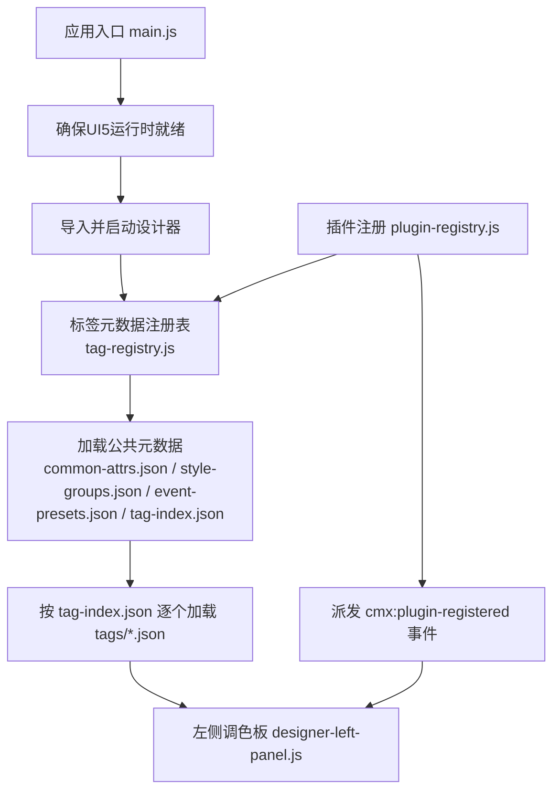
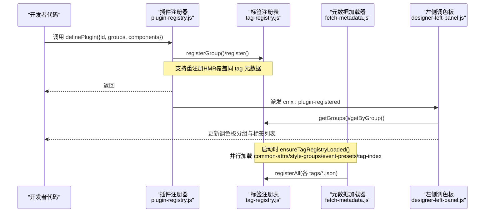
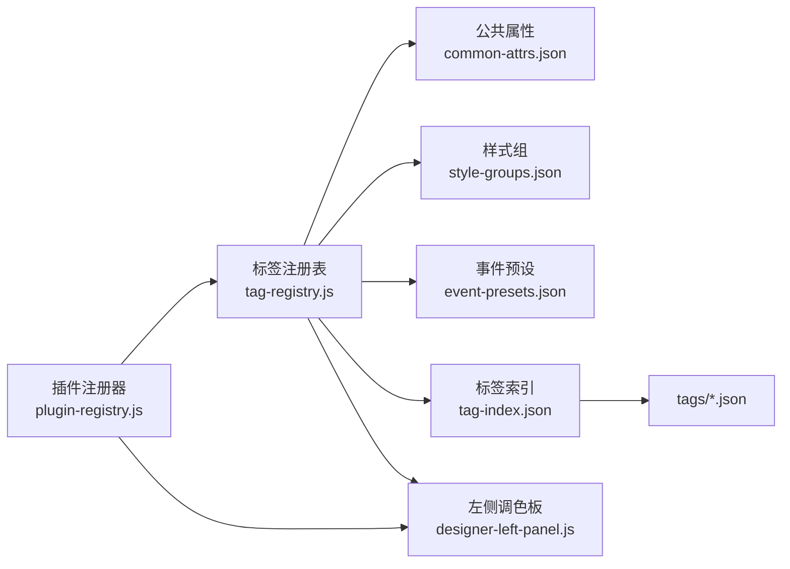

# 基础HTML组件插件

<cite>
**本文引用的文件**
- [tag-registry.js](file://CMXHTMLDesigner/src/metadata/tag-registry.js)
- [plugin-registry.js](file://CMXHTMLDesigner/src/lib/plugin-registry.js)
- [fetch-metadata.js](file://CMXHTMLDesigner/src/metadata/fetch-metadata.js)
- [groups.js](file://CMXHTMLDesigner/src/metadata/groups.js)
- [common-attrs.json](file://CMXHTMLDesigner/src/metadata/common-attrs.json)
- [event-presets.json](file://CMXHTMLDesigner/src/metadata/event-presets.json)
- [style-groups.json](file://CMXHTMLDesigner/src/metadata/style-groups.json)
- [tag-index.json](file://CMXHTMLDesigner/src/metadata/tag-index.json)
- [button.json](file://CMXHTMLDesigner/src/metadata/tags/button.json)
- [div.json](file://CMXHTMLDesigner/src/metadata/tags/div.json)
- [input.json](file://CMXHTMLDesigner/src/metadata/tags/input.json)
- [designer-left-panel.js](file://CMXHTMLDesigner/src/components/designer-left-panel.js)
- [main.js](file://CMXHTMLDesigner/src/main.js)
</cite>

## 目录
1. [简介](#简介)
2. [项目结构](#项目结构)
3. [核心组件](#核心组件)
4. [架构总览](#架构总览)
5. [详细组件分析](#详细组件分析)
6. [依赖关系分析](#依赖关系分析)
7. [性能考虑](#性能考虑)
8. [故障排查指南](#故障排查指南)
9. [结论](#结论)
10. [附录](#附录)

## 简介
本文档面向希望为原生 HTML 元素（如 div、button、input、form 等）开发“设计器插件”的工程师，系统说明如何定义元数据、配置属性与事件、组织样式分组，并通过注册机制将自定义或扩展的 HTML 组件接入 CMX HTML 设计器的调色板与属性面板。文档重点解释 ComponentMeta 的关键字段（tag、group、label、description、attrs、styleGroups、eventPreset 等），并提供完整的注册流程示例、测试与调试技巧。

## 项目结构
CMX HTML 设计器通过“标签元数据注册表”集中管理所有可拖拽到画布的组件元信息。运行时从 dist/metadata 加载 JSON 元数据，构建调色板与属性面板；同时支持通过插件 API 动态注册新的组件与分组。

图表来源
- [main.js:16-23](file://CMXHTMLDesigner/src/main.js#L16-L23)
- [tag-registry.js:120-146](file://CMXHTMLDesigner/src/metadata/tag-registry.js#L120-L146)
- [plugin-registry.js:60-89](file://CMXHTMLDesigner/src/lib/plugin-registry.js#L60-L89)
- [designer-left-panel.js:1-200](file://CMXHTMLDesigner/src/components/designer-left-panel.js#L1-L200)

章节来源
- [main.js:1-29](file://CMXHTMLDesigner/src/main.js#L1-L29)
- [tag-registry.js:1-149](file://CMXHTMLDesigner/src/metadata/tag-registry.js#L1-L149)
- [plugin-registry.js:1-94](file://CMXHTMLDesigner/src/lib/plugin-registry.js#L1-L94)

## 核心组件
- 标签元数据注册表：负责聚合公共属性、样式组、事件预设与标签索引，提供注册、查询、分组能力。
- 插件注册器：对外暴露 definePlugin，允许在运行时动态注册新组件、新增分组、覆盖已有组件元数据，并触发刷新事件。
- 左侧调色板：消费注册表数据，渲染可折叠分组与可拖拽标签项，监听插件注册事件以刷新显示。
- 元数据加载器：统一从静态路径拉取 metadata JSON，保证生产环境 base 路径正确。

章节来源
- [tag-registry.js:15-110](file://CMXHTMLDesigner/src/metadata/tag-registry.js#L15-L110)
- [plugin-registry.js:1-94](file://CMXHTMLDesigner/src/lib/plugin-registry.js#L1-L94)
- [designer-left-panel.js:1-200](file://CMXHTMLDesigner/src/components/designer-left-panel.js#L1-L200)
- [fetch-metadata.js:1-21](file://CMXHTMLDesigner/src/metadata/fetch-metadata.js#L1-L21)

## 架构总览
下图展示了“插件 → 注册表 → 调色板”的数据流与控制流。

图表来源
- [plugin-registry.js:60-89](file://CMXHTMLDesigner/src/lib/plugin-registry.js#L60-L89)
- [tag-registry.js:120-146](file://CMXHTMLDesigner/src/metadata/tag-registry.js#L120-L146)
- [designer-left-panel.js:1-200](file://CMXHTMLDesigner/src/components/designer-left-panel.js#L1-L200)

## 详细组件分析

### 标签元数据注册表（TagRegistry）
- 职责
  - 维护已注册标签集合、公共属性、样式组、事件预设与分组列表。
  - 提供 register/registerAll/get/getByGroup/getByGroups 等方法。
  - 根据 meta 计算 styles、events、defaultSetup，并合并公共属性。
- 关键行为
  - register(meta)：若未提供 attrs，则自动拼接 common-attrs；根据 styleGroups 过滤可用样式组；根据 eventPreset/extraEvents 合并事件集；生成 defaultSetup 用于插入默认文本/属性/样式。
  - get(tag)：未注册的 tag 会返回一个最小化兜底元数据，包含默认事件与默认内容设置。
  - ensureTagRegistryLoaded()：并发加载 common-attrs.json、style-groups.json、event-presets.json、tag-index.json，再逐一加载 tags/*.json 并批量注册。
- 复杂度
  - register 为 O(1) 哈希写入；getByGroups 为 O(N) 遍历；ensureTagRegistryLoaded 为 N 次并发 fetch + 解析。

章节来源
- [tag-registry.js:15-110](file://CMXHTMLDesigner/src/metadata/tag-registry.js#L15-L110)
- [tag-registry.js:120-146](file://CMXHTMLDesigner/src/metadata/tag-registry.js#L120-L146)

### 插件注册器（definePlugin）
- 职责
  - 接收插件对象 { id, groups?, components }，校验必填字段。
  - 调用注册表注册分组与组件元数据，支持重复注册（HMR）。
  - 可选注册 customInspectors（用于自定义属性面板渲染）。
  - 派发 cmx:plugin-registered 事件，通知 UI 刷新。
- 使用要点
  - components 数组中每个元素即为 ComponentMeta，结构与 tags/*.json 一致。
  - 可通过 groups 新增自定义分组，并在组件 meta 中使用该 group id。

章节来源
- [plugin-registry.js:1-94](file://CMXHTMLDesigner/src/lib/plugin-registry.js#L1-L94)

### 左侧调色板（designer-left-panel）
- 职责
  - 读取注册表的分组与标签，渲染可折叠分组与可拖拽标签项。
  - 监听 cmx:plugin-registered 事件，重新获取分组与标签列表并刷新界面。
  - 支持搜索框过滤、图标解析、空状态提示等交互细节。
- 与注册表的关系
  - 通过 registry.getGroups()/getByGroup() 获取分组与对应标签。
  - 对每个标签项渲染其 label、描述、图标等元信息。

章节来源
- [designer-left-panel.js:1-200](file://CMXHTMLDesigner/src/components/designer-left-panel.js#L1-L200)

### 元数据加载器（fetch-metadata）
- 职责
  - 基于 import.meta.env.BASE_URL 计算 metadata 根路径。
  - 提供 fetchDesignerMetadataJson(relativePath)，统一处理请求与错误。
- 注意事项
  - 生产部署需确保 /metadata 路径可访问，否则加载失败会抛出错误。

章节来源
- [fetch-metadata.js:1-21](file://CMXHTMLDesigner/src/metadata/fetch-metadata.js#L1-L21)

### 元数据模型与字段说明（ComponentMeta）
- tag：字符串，唯一标识标签名（如 button、div、input）。
- group：字符串，所属分组 id（如 default、ui5、fiori 或自定义）。
- label：字符串，调色板显示的标签名（通常带尖括号）。
- description：字符串，组件简短描述。
- isVoid：布尔值，是否自闭合标签。
- canNest：布尔值，是否允许嵌套子节点。
- attrs：数组，属性定义项。每项包含 name、label、type、placeholder/options 等。
- defaults：对象，包含 attributes、text/html、style 等默认值。
- styleGroups：数组，允许的样式分组 id（如 layout、flex、text、box、position）。
- eventPreset：字符串，事件预设名（如 common、form、media、ui5、ui5Form）。
- extraEvents：数组，额外事件名，会与预设合并去重。

章节来源
- [tag-registry.js:43-109](file://CMXHTMLDesigner/src/metadata/tag-registry.js#L43-L109)
- [common-attrs.json:1-37](file://CMXHTMLDesigner/src/metadata/common-attrs.json#L1-L37)
- [event-presets.json:1-72](file://CMXHTMLDesigner/src/metadata/event-presets.json#L1-L72)
- [style-groups.json:1-407](file://CMXHTMLDesigner/src/metadata/style-groups.json#L1-L407)

### 内置标签示例
- button.json：表单类按钮，启用 form 事件预设，限定样式分组。
- div.json：通用容器，启用 common 事件预设，并扩展 drag/drop 相关事件。
- input.json：输入控件，丰富的 type 选项与表单事件预设。

章节来源
- [button.json:1-39](file://CMXHTMLDesigner/src/metadata/tags/button.json#L1-L39)
- [div.json:1-34](file://CMXHTMLDesigner/src/metadata/tags/div.json#L1-L34)
- [input.json:1-81](file://CMXHTMLDesigner/src/metadata/tags/input.json#L1-L81)

### 分组与索引
- groups.js：内置分组 ui5、fiori、default，含排序与折叠状态。
- tag-index.json：全量标签清单，指向 tags 目录下具体 JSON 文件路径。

章节来源
- [groups.js:1-32](file://CMXHTMLDesigner/src/metadata/groups.js#L1-L32)
- [tag-index.json:1-800](file://CMXHTMLDesigner/src/metadata/tag-index.json#L1-L800)

## 依赖关系分析

图表来源
- [plugin-registry.js:60-89](file://CMXHTMLDesigner/src/lib/plugin-registry.js#L60-L89)
- [tag-registry.js:120-146](file://CMXHTMLDesigner/src/metadata/tag-registry.js#L120-L146)
- [designer-left-panel.js:1-200](file://CMXHTMLDesigner/src/components/designer-left-panel.js#L1-L200)

章节来源
- [plugin-registry.js:1-94](file://CMXHTMLDesigner/src/lib/plugin-registry.js#L1-L94)
- [tag-registry.js:1-149](file://CMXHTMLDesigner/src/metadata/tag-registry.js#L1-L149)

## 性能考虑
- 并发加载：ensureTagRegistryLoaded 使用 Promise.all 并发加载四个基础元数据文件，显著降低首屏等待时间。
- 按需注册：插件仅在 definePlugin 调用时注册，避免不必要的初始化开销。
- 去重与缓存：注册表内部 Map 存储，get 操作 O(1)；多次 ensureTagRegistryLoaded 返回同一 Promise，避免重复网络请求。
- 样式与事件合并：在注册阶段一次性计算 styles/events/defaultSetup，减少运行时计算成本。

[本节为通用性能建议，不直接分析具体文件]

## 故障排查指南
- 元数据加载失败
  - 现象：控制台报错提示加载失败及 HTTP 状态码。
  - 原因：生产环境下 /metadata 路径不可达或构建产物未输出。
  - 处理：检查 BASE_URL 与部署路径，确认 dist/metadata 存在且可访问。
- 插件未生效
  - 现象：调色板未出现新组件或分组。
  - 原因：未调用 definePlugin；组件元数据缺少必填字段；重复注册未覆盖。
  - 处理：确保调用 definePlugin 并传入有效 id 与 components；检查 tag/group 是否存在；利用 HMR 重注册覆盖。
- 事件未出现在属性面板
  - 现象：期望的事件不在下拉列表中。
  - 原因：eventPreset 未匹配或 extraEvents 未声明。
  - 处理：在组件 meta 中设置正确的 eventPreset，或在 extraEvents 追加事件名。
- 样式分组不显示
  - 原因：styleGroups 未指定或为空，导致继承全局但无可见分组。
  - 处理：在组件 meta 中显式声明 styleGroups 数组。

章节来源
- [fetch-metadata.js:10-20](file://CMXHTMLDesigner/src/metadata/fetch-metadata.js#L10-L20)
- [plugin-registry.js:60-89](file://CMXHTMLDesigner/src/lib/plugin-registry.js#L60-L89)
- [tag-registry.js:43-109](file://CMXHTMLDesigner/src/metadata/tag-registry.js#L43-L109)

## 结论
通过“标签元数据注册表 + 插件注册器 + 左侧调色板”的分层设计，CMX HTML 设计器实现了高度可扩展的组件体系。开发者只需遵循 ComponentMeta 规范，即可快速为原生 HTML 元素或自定义标签添加设计期能力（属性编辑、事件绑定、样式分组），并以插件形式热插拔集成。结合并发加载与去重策略，系统在易用性与性能之间取得良好平衡。

[本节为总结性内容，不直接分析具体文件]

## 附录

### 完整注册示例（步骤与要点）
- 准备组件元数据
  - 在插件 components 数组中定义 ComponentMeta，至少包含 tag、group、label、description、attrs、styleGroups、eventPreset。
  - 如需默认内容或属性，填写 defaults（attributes/text/html/style）。
- 注册插件
  - 调用 definePlugin({ id, groups?, components })。
  - 如需自定义分组，先在 groups 中声明 id、label、order 等。
- 刷新调色板
  - 插件注册成功后会自动派发 cmx:plugin-registered，左侧调色板监听后刷新。
- 验证
  - 在调色板中查看新分组与标签；拖入画布后检查属性面板是否显示预期属性与事件。

章节来源
- [plugin-registry.js:1-94](file://CMXHTMLDesigner/src/lib/plugin-registry.js#L1-L94)
- [designer-left-panel.js:1-200](file://CMXHTMLDesigner/src/components/designer-left-panel.js#L1-L200)

### 常见字段对照表
- tag：组件标签名（如 button、div、input）。
- group：分组 id（如 default、ui5、fiori 或自定义）。
- label：调色板显示名称。
- description：组件描述。
- isVoid/canNest：是否自闭合/是否可嵌套。
- attrs：属性定义数组（name、label、type、placeholder/options）。
- defaults：默认值（attributes/text/html/style）。
- styleGroups：允许的样式分组 id。
- eventPreset：事件预设名（common/form/media/ui5/ui5Form）。
- extraEvents：额外事件名数组。

章节来源
- [tag-registry.js:43-109](file://CMXHTMLDesigner/src/metadata/tag-registry.js#L43-L109)
- [common-attrs.json:1-37](file://CMXHTMLDesigner/src/metadata/common-attrs.json#L1-L37)
- [event-presets.json:1-72](file://CMXHTMLDesigner/src/metadata/event-presets.json#L1-L72)
- [style-groups.json:1-407](file://CMXHTMLDesigner/src/metadata/style-groups.json#L1-L407)

### 调试技巧
- 浏览器控制台
  - 观察 ensureTagRegistryLoaded 的网络请求与响应，确认元数据加载成功。
  - 监听 window 上的 cmx:plugin-registered 事件，确认插件注册完成。
- 本地开发
  - 修改插件文件后，利用 HMR 重注册能力即时生效，无需刷新页面。
- 问题定位
  - 若属性面板不显示，检查 attrs 与 defaults 是否正确；若事件缺失，检查 eventPreset 与 extraEvents。

章节来源
- [plugin-registry.js:60-89](file://CMXHTMLDesigner/src/lib/plugin-registry.js#L60-L89)
- [tag-registry.js:120-146](file://CMXHTMLDesigner/src/metadata/tag-registry.js#L120-L146)