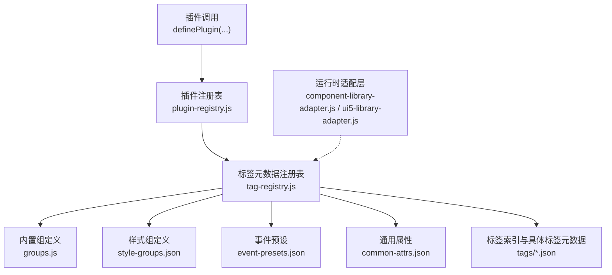
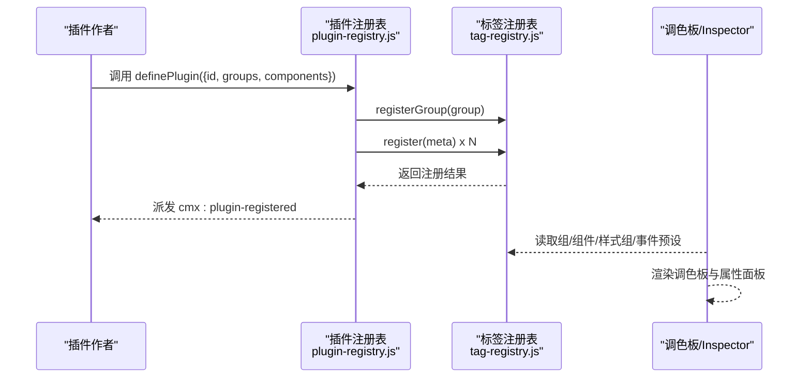
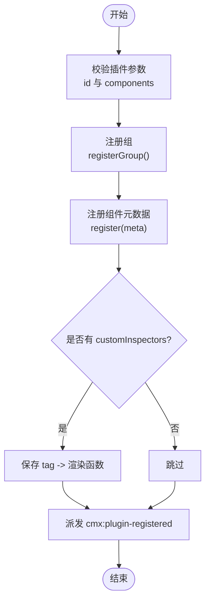
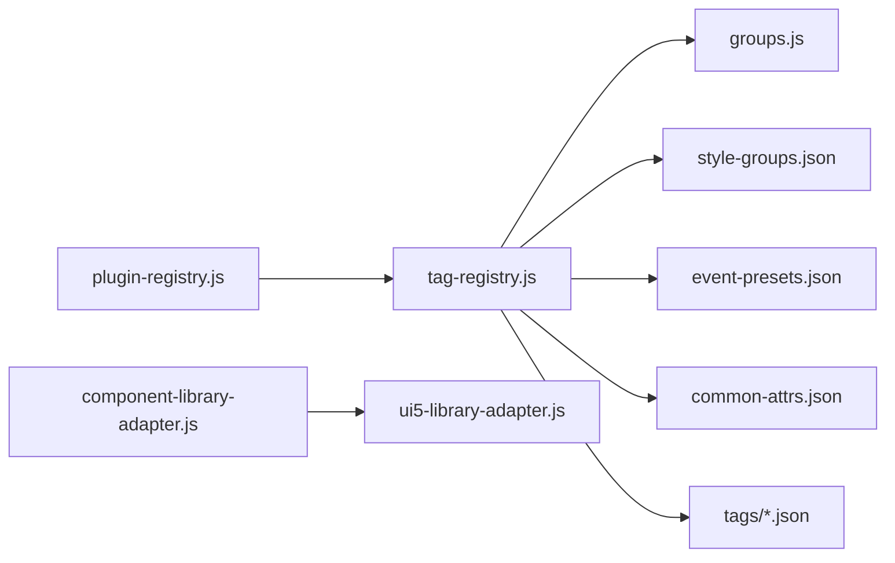

# 组件插件开发

<cite>
**本文引用的文件**
- [tag-registry.js](file://CMXHTMLDesigner/src/metadata/tag-registry.js)
- [plugin-registry.js](file://CMXHTMLDesigner/src/lib/plugin-registry.js)
- [groups.js](file://CMXHTMLDesigner/src/metadata/groups.js)
- [style-groups.json](file://CMXHTMLDesigner/src/metadata/style-groups.json)
- [event-presets.json](file://CMXHTMLDesigner/src/metadata/event-presets.json)
- [common-attrs.json](file://CMXHTMLDesigner/src/metadata/common-attrs.json)
- [button.json](file://CMXHTMLDesigner/src/metadata/tags/button.json)
- [ui5-dialog.json](file://CMXHTMLDesigner/src/metadata/tags/ui5/ui5-dialog.json)
- [ui5-user-settings-dialog.json](file://CMXHTMLDesigner/src/metadata/tags/fiori/ui5-user-settings-dialog.json)
- [cmx-data-plugin.js](file://CMXHTMLDesigner/src/plugins/cmx-data-plugin.js)
- [cmx-models-plugin.js](file://CMXHTMLDesigner/src/plugins/cmx-models-plugin.js)
- [component-library-adapter.js](file://CMXHTMLDesigner/src/lib/component-library-adapter.js)
- [ui5-library-adapter.js](file://CMXHTMLDesigner/src/lib/ui5-library-adapter.js)
</cite>

## 目录
1. [简介](#简介)
2. [项目结构](#项目结构)
3. [核心组件](#核心组件)
4. [架构总览](#架构总览)
5. [详细组件分析](#详细组件分析)
6. [依赖关系分析](#依赖关系分析)
7. [性能考虑](#性能考虑)
8. [故障排查指南](#故障排查指南)
9. [结论](#结论)
10. [附录](#附录)

## 简介
本文件面向需要在 CMX HTML 设计器中扩展自定义 UI 组件的开发者，系统性说明如何开发“组件插件”，包括：
- 组件元数据定义（ComponentMeta）字段与含义
- 属性配置、事件绑定、样式分组
- 组管理与调色板展示
- 完整示例：基础 HTML 组件与企业级 UI5 组件注册
- 调试与测试技巧

## 项目结构
设计器的组件插件体系由“元数据注册表 + 插件注册入口 + 运行时适配器”构成：
- 元数据注册表负责聚合所有标签（HTML/UI5/Fiori/自定义）的元信息，并计算默认行为、可用样式组、可用事件等。
- 插件注册入口提供 definePlugin API，供外部插件一次性注入组、组件元数据和可选的自定义 Inspector。
- 运行时适配器抽象主题/语言切换能力，当前实现为 SAP UI5 适配器。

图表来源
- [plugin-registry.js:1-94](file://CMXHTMLDesigner/src/lib/plugin-registry.js#L1-L94)
- [tag-registry.js:1-149](file://CMXHTMLDesigner/src/metadata/tag-registry.js#L1-L149)
- [groups.js:1-32](file://CMXHTMLDesigner/src/metadata/groups.js#L1-L32)
- [style-groups.json:1-407](file://CMXHTMLDesigner/src/metadata/style-groups.json#L1-L407)
- [event-presets.json:1-72](file://CMXHTMLDesigner/src/metadata/event-presets.json#L1-L72)
- [common-attrs.json:1-37](file://CMXHTMLDesigner/src/metadata/common-attrs.json#L1-L37)

章节来源
- [plugin-registry.js:1-94](file://CMXHTMLDesigner/src/lib/plugin-registry.js#L1-L94)
- [tag-registry.js:1-149](file://CMXHTMLDesigner/src/metadata/tag-registry.js#L1-L149)

## 核心组件
- 标签元数据注册表 TagRegistry
  - 维护已注册的标签元数据 Map，合并通用属性、样式组、事件预设，并提供按组查询、全部查询等方法。
  - 负责生成每个标签的默认初始化逻辑（文本/HTML/内联样式/属性）。
- 插件注册 definePlugin
  - 接收插件对象，包含 id、groups、components、customInspectors。
  - 将 groups 和 components 分别写入注册表；支持重注册（HMR）。
  - 派发 cmx:plugin-registered 事件，驱动调色板刷新。
- 运行时适配器 ComponentLibraryAdapter
  - 抽象主题/语言列表与切换方法，当前由 Ui5LibraryAdapter 实现。

章节来源
- [tag-registry.js:15-110](file://CMXHTMLDesigner/src/metadata/tag-registry.js#L15-L110)
- [plugin-registry.js:1-94](file://CMXHTMLDesigner/src/lib/plugin-registry.js#L1-L94)
- [component-library-adapter.js:1-39](file://CMXHTMLDesigner/src/lib/component-library-adapter.js#L1-L39)
- [ui5-library-adapter.js:1-39](file://CMXHTMLDesigner/src/lib/ui5-library-adapter.js#L1-L39)

## 架构总览
下图展示了从插件注册到调色板渲染的关键流程，以及元数据的装配过程。

图表来源
- [plugin-registry.js:60-89](file://CMXHTMLDesigner/src/lib/plugin-registry.js#L60-L89)
- [tag-registry.js:30-55](file://CMXHTMLDesigner/src/metadata/tag-registry.js#L30-L55)
- [tag-registry.js:96-109](file://CMXHTMLDesigner/src/metadata/tag-registry.js#L96-L109)

## 详细组件分析

### ComponentMeta 接口详解
ComponentMeta 是单个组件在调色板中的“说明书”，用于控制：
- tag：组件标签名（如 button、ui5-dialog、cmx-revo-grid）
- group：所属组（如 default、ui5、fiori、自定义）
- label/description：显示名称与描述
- canNest/isVoid：是否允许嵌套、是否为空元素
- attrs：属性定义数组（name、label、type、options、placeholder 等）
- styleGroups：启用的样式分组（layout、flex、text、box、position 等）
- eventPreset：事件预设（common、form、media、ui5、ui5Form），可叠加 extraEvents
- defaults：默认属性、默认文本/HTML、默认内联样式
- modelOnly：仅模型类不可视（如 CmxDataSet）
- slots：插槽声明（部分 UI5/Fiori 组件使用）

这些字段在注册时会被 TagRegistry 合并：
- 自动追加 common-attrs.json 中的通用属性
- 根据 styleGroups 过滤可用的样式组
- 根据 eventPreset 与 extraEvents 合并可用事件集
- 生成默认初始化函数（设置 attributes/text/html/style）

章节来源
- [tag-registry.js:43-109](file://CMXHTMLDesigner/src/metadata/tag-registry.js#L43-L109)
- [common-attrs.json:1-37](file://CMXHTMLDesigner/src/metadata/common-attrs.json#L1-L37)
- [style-groups.json:1-407](file://CMXHTMLDesigner/src/metadata/style-groups.json#L1-L407)
- [event-presets.json:1-72](file://CMXHTMLDesigner/src/metadata/event-presets.json#L1-L72)

### 样式分组机制
- 全局样式组定义位于 style-groups.json，包含 layout、flex、text、box、position 等分组，每组内有多个 CSS 属性编辑器（类型可为 text、select、color、number 等）。
- 组件通过 styleGroups 指定启用哪些分组；未指定时回退到注册表的全量样式组集合。
- 该机制确保不同组件暴露合适的样式编辑能力，避免无关属性干扰。

章节来源
- [tag-registry.js:96-102](file://CMXHTMLDesigner/src/metadata/tag-registry.js#L96-L102)
- [style-groups.json:1-407](file://CMXHTMLDesigner/src/metadata/style-groups.json#L1-L407)

### 事件绑定与预设
- 事件预设 event-presets.json 定义了 common、form、media、ui5、ui5Form 等常用事件集合。
- 组件可通过 eventPreset 选择基础事件集，并通过 extraEvents 追加自定义事件。
- 注册表会去重合并后作为该组件的可用事件列表，供设计器事件脚本提示与绑定。

章节来源
- [tag-registry.js:104-109](file://CMXHTMLDesigner/src/metadata/tag-registry.js#L104-L109)
- [event-presets.json:1-72](file://CMXHTMLDesigner/src/metadata/event-presets.json#L1-L72)

### 组管理
- 内置组定义在 groups.js，包含 ui5、fiori、default 等。
- 插件可通过 definePlugin.groups 新增自定义组（id、label、icon、order、collapsed），注册表会忽略重复 id。
- 调色板按 order 升序展示组，支持折叠状态。

章节来源
- [groups.js:1-32](file://CMXHTMLDesigner/src/metadata/groups.js#L1-L32)
- [tag-registry.js:30-41](file://CMXHTMLDesigner/src/metadata/tag-registry.js#L30-L41)
- [plugin-registry.js:71-75](file://CMXHTMLDesigner/src/lib/plugin-registry.js#L71-L75)

### 插件注册流程与生命周期
- 调用 definePlugin 完成：
  - 注册自定义组
  - 注册组件元数据（按 tag 覆盖）
  - 注册 customInspectors（可选，用于复杂属性的可视化编辑）
  - 派发 cmx:plugin-registered 事件，触发调色板刷新
- 支持 HMR 重注册：同一 id 插件再次注册会覆盖已有元数据与 Inspector。

图表来源
- [plugin-registry.js:60-89](file://CMXHTMLDesigner/src/lib/plugin-registry.js#L60-L89)

章节来源
- [plugin-registry.js:1-94](file://CMXHTMLDesigner/src/lib/plugin-registry.js#L1-L94)

### 示例一：基础 HTML 组件（以 button 为例）
- 元数据位置：button.json
- 关键字段：
  - tag: button
  - group: default
  - isVoid: false，canNest: false
  - attrs: type、disabled
  - defaults: 默认文本与属性
  - styleGroups: 布局/弹性/文字/盒模型/定位
  - eventPreset: form（表单相关事件）
- 该组件演示了标准 HTML 元素的元数据定义方式，可直接被设计器识别并在调色板中拖拽使用。

章节来源
- [button.json:1-39](file://CMXHTMLDesigner/src/metadata/tags/button.json#L1-L39)

### 示例二：企业级 UI5 组件（以 ui5-dialog 为例）
- 元数据位置：ui5-dialog.json
- 关键字段：
  - tag: ui5-dialog
  - group: ui5
  - eventPreset: ui5
  - styleGroups: 布局/弹性/文字/盒模型/定位
  - attrs: header-text、stretch、draggable、resizable、state 等
  - slots: header、footer
  - extraEvents: before-open、open、before-close、close、scroll
- 该组件展示了企业级 UI5 对话框的元数据定义，包括插槽与 UI5 专属事件。

章节来源
- [ui5-dialog.json:1-67](file://CMXHTMLDesigner/src/metadata/tags/ui5/ui5-dialog.json#L1-L67)

### 示例三：Fiori 组件（以 ui5-user-settings-dialog 为例）
- 元数据位置：ui5-user-settings-dialog.json
- 关键字段：
  - tag: ui5-user-settings-dialog
  - group: fiori
  - eventPreset: ui5
  - styleGroups: 布局/弹性/文字/盒模型/定位
  - attrs: open、header-text、show-search-field
  - slots: 空插槽、fixedItems
  - extraEvents: selection-change、open、before-close、close
- 该组件演示了 Fiori 用户设置对话框的元数据定义。

章节来源
- [ui5-user-settings-dialog.json:1-44](file://CMXHTMLDesigner/src/metadata/tags/fiori/ui5-user-settings-dialog.json#L1-L44)

### 示例四：CMX 数据组件插件（cmx-data-plugin）
- 插件位置：cmx-data-plugin.js
- 功能：
  - 引入一系列 cmx-data-comp 组件（网格、表单、树视图、分割面板、分页器等）
  - 通过 definePlugin 注册大量组件元数据，包含 data-cmx-* 属性、默认样式、额外事件
  - 提供 customInspectors 为复杂组件（如 cmx-revo-grid、cmx-ui5-form、cmx-web-treeview、cmx-pager）提供可视化属性面板
- 该插件是企业级数据组件在设计器中的统一注册入口，体现了“元数据 + 自定义 Inspector”的组合模式。

章节来源
- [cmx-data-plugin.js:1-747](file://CMXHTMLDesigner/src/plugins/cmx-data-plugin.js#L1-L747)

### 示例五：CMX 模型插件（cmx-models-plugin）
- 插件位置：cmx-models-plugin.js
- 功能：
  - 注册不可视数据层类（CmxDataSet、CmxMasterSlave、CmxColumnModel 等）到调色板的“CMX 模型”分组
  - 通过 modelOnly:true 限制只能拖入 Models 面板，不渲染为 DOM
- 该插件展示了“非可视模型”的插件化注册方式。

章节来源
- [cmx-models-plugin.js:1-77](file://CMXHTMLDesigner/src/plugins/cmx-models-plugin.js#L1-L77)

### 运行时主题与语言适配
- 组件库适配器抽象了主题/语言能力，Ui5LibraryAdapter 提供 SAP UI5 的具体实现。
- 设计器通过 library.applyTheme / applyLanguage 通知 UI5 运行时切换主题与语言。

章节来源
- [component-library-adapter.js:1-39](file://CMXHTMLDesigner/src/lib/component-library-adapter.js#L1-L39)
- [ui5-library-adapter.js:1-39](file://CMXHTMLDesigner/src/lib/ui5-library-adapter.js#L1-L39)

## 依赖关系分析
- 插件注册表依赖标签注册表进行元数据持久化与查询。
- 标签注册表依赖：
  - 组定义（groups.js）
  - 样式组（style-groups.json）
  - 事件预设（event-presets.json）
  - 通用属性（common-attrs.json）
  - 标签索引与具体标签元数据（tags/*.json）
- 运行时适配器与 UI5 运行时解耦，便于替换其他组件库。

图表来源
- [plugin-registry.js:1-94](file://CMXHTMLDesigner/src/lib/plugin-registry.js#L1-L94)
- [tag-registry.js:1-149](file://CMXHTMLDesigner/src/metadata/tag-registry.js#L1-L149)
- [groups.js:1-32](file://CMXHTMLDesigner/src/metadata/groups.js#L1-L32)
- [style-groups.json:1-407](file://CMXHTMLDesigner/src/metadata/style-groups.json#L1-L407)
- [event-presets.json:1-72](file://CMXHTMLDesigner/src/metadata/event-presets.json#L1-L72)
- [common-attrs.json:1-37](file://CMXHTMLDesigner/src/metadata/common-attrs.json#L1-L37)

章节来源
- [plugin-registry.js:1-94](file://CMXHTMLDesigner/src/lib/plugin-registry.js#L1-L94)
- [tag-registry.js:1-149](file://CMXHTMLDesigner/src/metadata/tag-registry.js#L1-L149)

## 性能考虑
- 元数据按需加载：标签元数据通过 fetch 从 dist/metadata 加载，不打入 JS bundle，减少初始包体。
- 去重与缓存：TagRegistry 对事件与样式组进行去重处理；ensureTagRegistryLoaded 保证多次调用返回同一 Promise。
- 插件重注册：HMR 场景下支持同 id 插件覆盖注册，避免全量重建。
- 建议：
  - 合理拆分 large components 的元数据，避免一次性注册过多复杂组件。
  - 谨慎使用 extraEvents，仅暴露必要事件以减少设计器事件面板负担。
  - 使用 defaults 预置常用属性，降低设计师配置成本。

[本节为通用指导，无需特定文件引用]

## 故障排查指南
- 常见问题与定位：
  - 插件未生效：检查 definePlugin 的 id 与 components 是否合法；确认 cmx:plugin-registered 事件是否派发。
  - 组未显示：确认 registerGroup 的 id 唯一且 order 合理；查看 getGroups 排序结果。
  - 样式组不生效：检查 styleGroups 是否在 style-groups.json 中存在；确认 _stylesFromMeta 过滤逻辑。
  - 事件缺失：核对 eventPreset 与 extraEvents；查看 _eventsFromMeta 合并结果。
  - 默认内容未显示：检查 defaults.attributes/text/html/style；确认 isVoid/canNest 影响。
- 调试技巧：
  - 在浏览器控制台监听 cmx:plugin-registered 事件，确认插件注册成功。
  - 打开设计器属性面板，验证 attrs/styleGroups/events 是否正确渲染。
  - 对于复杂组件，优先通过 customInspectors 提供可视化编辑，减少 JSON 字符串输入错误。

章节来源
- [plugin-registry.js:60-89](file://CMXHTMLDesigner/src/lib/plugin-registry.js#L60-L89)
- [tag-registry.js:30-55](file://CMXHTMLDesigner/src/metadata/tag-registry.js#L30-L55)
- [tag-registry.js:96-109](file://CMXHTMLDesigner/src/metadata/tag-registry.js#L96-L109)

## 结论
通过 TagRegistry 与 definePlugin 的配合，CMX HTML 设计器提供了统一的组件插件机制。开发者只需关注 ComponentMeta 的定义与必要的 customInspectors，即可将基础 HTML、企业级 UI5/Fiori 或自研组件无缝集成到设计器调色板与属性面板中。结合样式分组与事件预设，既能保证一致性，又能灵活扩展。

[本节为总结性内容，无需特定文件引用]

## 附录
- 快速上手清单：
  - 创建插件文件，调用 definePlugin，传入 id、groups、components
  - 在 components 中定义每个组件的 tag、group、label、description、attrs、styleGroups、eventPreset、extraEvents、defaults
  - 如需复杂属性编辑，提供 customInspectors
  - 启动设计器后，观察 cmx:plugin-registered 事件与调色板刷新
- 参考路径：
  - 基础 HTML 组件元数据：button.json
  - UI5 组件元数据：ui5-dialog.json、ui5-user-settings-dialog.json
  - 企业级数据组件插件：cmx-data-plugin.js
  - 模型类插件：cmx-models-plugin.js

[本节为补充信息，无需特定文件引用]