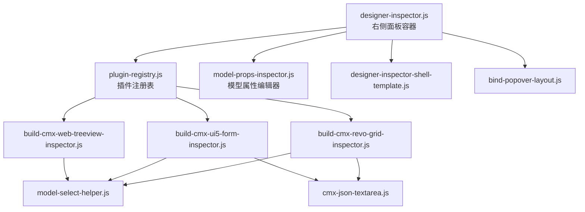
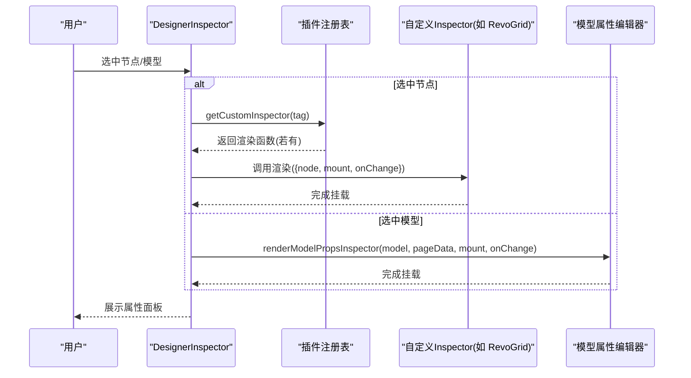
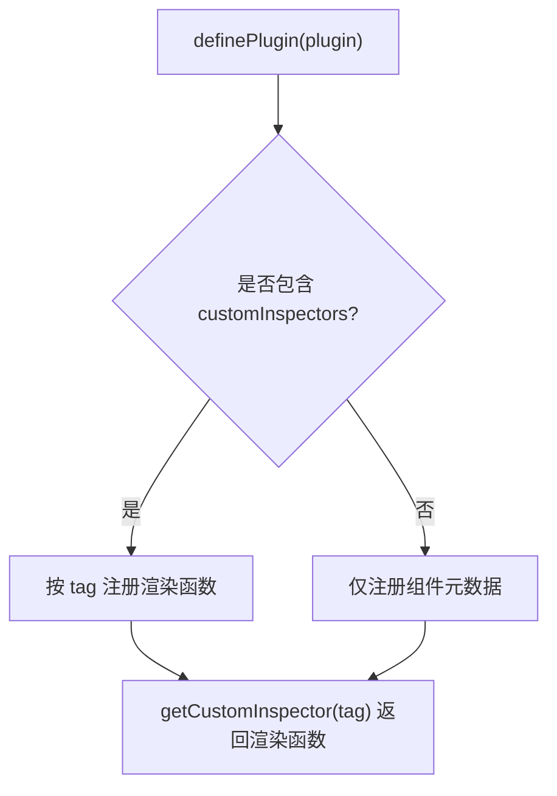
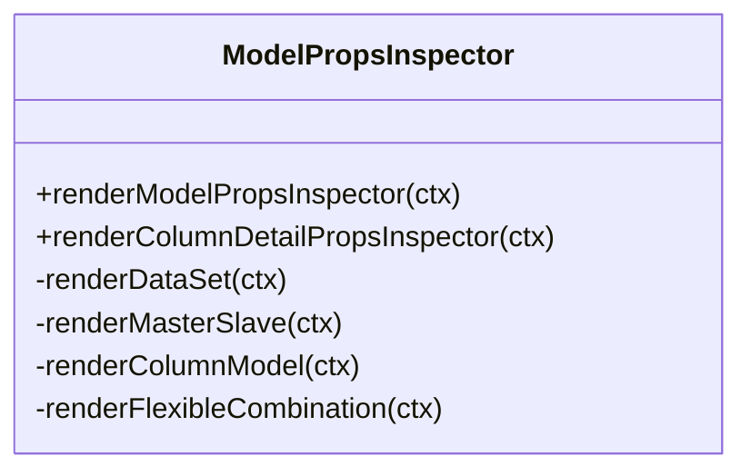
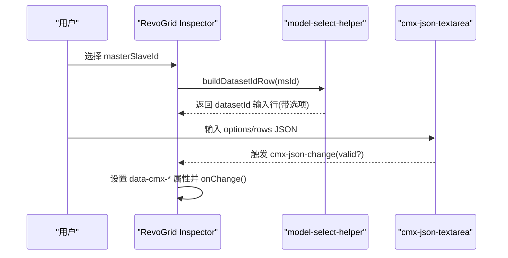
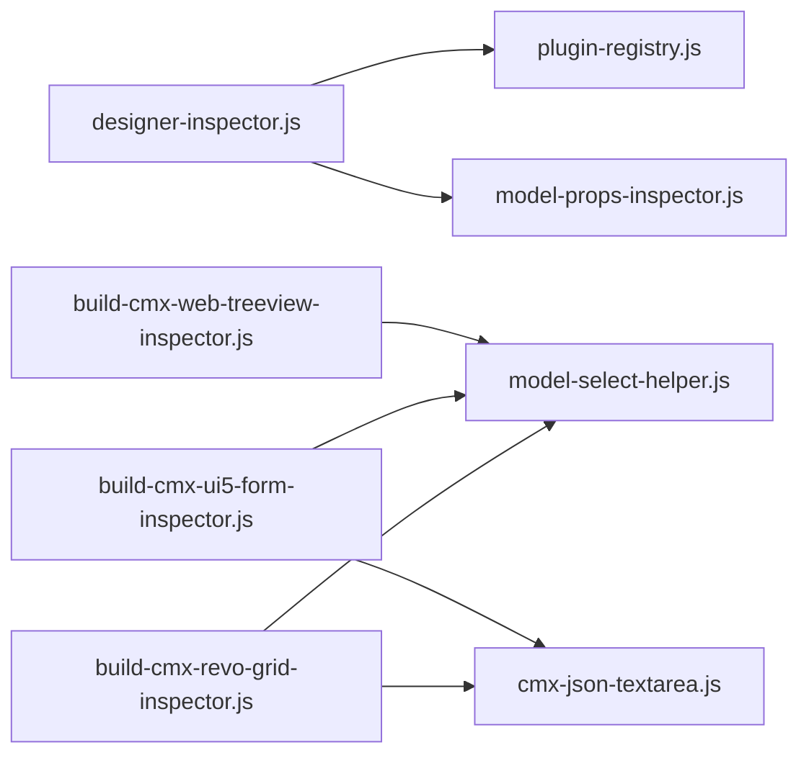

# 自定义属性面板开发

<cite>
**本文引用的文件**
- [designer-inspector.js](file://CMXHTMLDesigner/src/components/designer-inspector.js)
- [designer-inspector-shell-template.js](file://CMXHTMLDesigner/src/components/designer-inspector/designer-inspector-shell-template.js)
- [model-props-inspector.js](file://CMXHTMLDesigner/src/components/designer-inspector/model-props-inspector.js)
- [plugin-registry.js](file://CMXHTMLDesigner/src/lib/plugin-registry.js)
- [build-cmx-revo-grid-inspector.js](file://CMXHTMLDesigner/src/plugins/cmx-inspector/build-cmx-revo-grid-inspector.js)
- [build-cmx-ui5-form-inspector.js](file://CMXHTMLDesigner/src/plugins/cmx-inspector/build-cmx-ui5-form-inspector.js)
- [build-cmx-web-treeview-inspector.js](file://CMXHTMLDesigner/src/plugins/cmx-inspector/build-cmx-web-treeview-inspector.js)
- [model-select-helper.js](file://CMXHTMLDesigner/src/plugins/cmx-inspector/model-select-helper.js)
- [cmx-json-textarea.js](file://CMXHTMLDesigner/src/plugins/cmx-inspector/cmx-json-textarea.js)
- [bind-popover-layout.js](file://CMXHTMLDesigner/src/components/designer-inspector/bind-popover-layout.js)
</cite>

## 目录
1. [简介](#简介)
2. [项目结构](#项目结构)
3. [核心组件](#核心组件)
4. [架构总览](#架构总览)
5. [详细组件分析](#详细组件分析)
6. [依赖关系分析](#依赖关系分析)
7. [性能考虑](#性能考虑)
8. [故障排查指南](#故障排查指南)
9. [结论](#结论)
10. [附录](#附录)

## 简介
本文件面向需要在设计器中为复杂组件（如 RevoGrid、UI5 Form、Web Treeview）开发“专用属性编辑面板”的工程师，系统性说明：
- 如何基于 Inspector 接口实现自定义属性面板
- 如何实现动态属性生成、表单验证与实时预览
- 属性面板的架构设计：属性分组、条件显示、联动更新、数据绑定
- 提供完整示例与最佳实践，覆盖验证、错误处理与用户体验优化

## 项目结构
设计器的右侧属性/样式/事件/调试面板由 DesignerInspector 管理，并通过插件机制支持“标签级”的自定义 Inspector。针对复杂组件，采用“构建函数式”的 Inspector（以 build-* 命名），统一通过插件注册表挂载到对应标签上。

图表来源
- [designer-inspector.js:15-40](file://CMXHTMLDesigner/src/components/designer-inspector.js#L15-L40)
- [plugin-registry.js:48-94](file://CMXHTMLDesigner/src/lib/plugin-registry.js#L48-L94)
- [designer-inspector-shell-template.js:1-45](file://CMXHTMLDesigner/src/components/designer-inspector/designer-inspector-shell-template.js#L1-L45)

章节来源
- [designer-inspector.js:1-120](file://CMXHTMLDesigner/src/components/designer-inspector.js#L1-L120)
- [plugin-registry.js:1-95](file://CMXHTMLDesigner/src/lib/plugin-registry.js#L1-L95)

## 核心组件
- DesignerInspector：右侧面板容器，负责 Tab 切换、渲染属性/样式/事件/调试区，并调用插件提供的自定义 Inspector。
- 插件注册表：维护 tag → customInspector 映射，供 DesignerInspector 在渲染属性时优先使用。
- 模型属性编辑器：用于页面级模型（CmxDataSet/CmxMasterSlave/CmxColumnModel/FlexibleCombination）的属性编辑。
- 组件专用 Inspector：RevoGrid、UI5 Form、Web Treeview 的专用属性面板构建函数，封装了模型选择、JSON 校验、联动逻辑等。

章节来源
- [designer-inspector.js:48-119](file://CMXHTMLDesigner/src/components/designer-inspector.js#L48-L119)
- [plugin-registry.js:48-94](file://CMXHTMLDesigner/src/lib/plugin-registry.js#L48-L94)
- [model-props-inspector.js:14-31](file://CMXHTMLDesigner/src/components/designer-inspector/model-props-inspector.js#L14-L31)

## 架构总览
自定义属性面板的核心流程如下：
- 当选中某个节点或模型时，DesignerInspector 决定渲染路径：
  - 若存在该标签的自定义 Inspector，则调用其渲染函数，将 DOM 挂载到属性面板区域。
  - 否则渲染通用元数据属性、样式、事件等。
- 对于页面级模型，调用 renderModelPropsInspector 渲染对应模型的属性编辑界面。
- 对于列详情，调用 renderColumnDetailPropsInspector 渲染字段级编辑界面。

图表来源
- [designer-inspector.js:182-232](file://CMXHTMLDesigner/src/components/designer-inspector.js#L182-L232)
- [plugin-registry.js:91-94](file://CMXHTMLDesigner/src/lib/plugin-registry.js#L91-L94)
- [model-props-inspector.js:14-31](file://CMXHTMLDesigner/src/components/designer-inspector/model-props-inspector.js#L14-L31)

## 详细组件分析

### 插件系统与 Inspector 接口
- 插件定义：通过 definePlugin 注册组件元数据与可选的 customInspectors。
- 渲染上下文：ctx = { node, meta, mount, pageData, onChange }
  - node：当前选中的 DOM 元素
  - meta：组件元信息
  - mount：属性面板根节点（清空后供自定义面板挂载）
  - pageData：设计器页面数据（可读取 models/services 等）
  - onChange：触发 inspector-change，标记脏状态并刷新

图表来源
- [plugin-registry.js:60-89](file://CMXHTMLDesigner/src/lib/plugin-registry.js#L60-L89)
- [plugin-registry.js:91-94](file://CMXJSONDesigner/src/lib/plugin-registry.js#L91-L94)

章节来源
- [plugin-registry.js:1-95](file://CMXHTMLDesigner/src/lib/plugin-registry.js#L1-L95)

### 通用属性面板容器（DesignerInspector）
- 职责：
  - 管理四个面板（属性/样式/事件/调试）
  - 根据选中项类型路由到不同渲染逻辑
  - 对 UI5 组件提供 slot 编辑能力
  - 提供数据绑定浮层（Popover）和事件脚本编辑器
- 关键点：
  - 优先使用自定义 Inspector；若无则渲染通用元数据属性
  - 模型/列详情分别走 renderModelPropsInspector / renderColumnDetailPropsInspector
  - 事件面板集成 CodeMirror 编辑器，支持插入 debugger、绑定/移除事件

章节来源
- [designer-inspector.js:48-119](file://CMXHTMLDesigner/src/components/designer-inspector.js#L48-L119)
- [designer-inspector.js:182-266](file://CMXHTMLDesigner/src/components/designer-inspector.js#L182-L266)
- [designer-inspector.js:268-442](file://CMXHTMLDesigner/src/components/designer-inspector.js#L268-L442)
- [designer-inspector.js:523-705](file://CMXHTMLDesigner/src/components/designer-inspector.js#L523-L705)

### 模型属性编辑器（页面级模型）
- 支持的模型类型：CmxDataSet、CmxMasterSlave、CmxColumnModel、FlexibleCombination
- 功能要点：
  - 实例名、数据来源、加载形态、分页/深度、过滤等配置
  - 子数据集绑定、目标列模型绑定（多表→列模型映射）
  - 内联规则 JSON 校验与提示
  - 列详情编辑：FLC 字段面板、枚举值编辑、校验规则增删、提示气泡

图表来源
- [model-props-inspector.js:14-31](file://CMXHTMLDesigner/src/components/designer-inspector/model-props-inspector.js#L14-L31)
- [model-props-inspector.js:140-424](file://CMXHTMLDesigner/src/components/designer-inspector/model-props-inspector.js#L140-L424)

章节来源
- [model-props-inspector.js:14-424](file://CMXHTMLDesigner/src/components/designer-inspector/model-props-inspector.js#L14-L424)

### RevoGrid 专用属性面板
- 绑定项：
  - masterSlaveId（绑定的 CmxMasterSlave）
  - datasetId（响应式：随 masterSlaveId 变化而更新选项）
  - modelId（绑定的 CmxColumnModel）
- 其他属性：
  - options（JSON 校验）
  - rows（初始数据 JSON 校验）
- 交互：
  - 使用 cmx-json-textarea 进行 JSON 输入与即时校验
  - 使用 model-select-helper 提供模型选择行与 datasetId 动态行

图表来源
- [build-cmx-revo-grid-inspector.js:20-101](file://CMXHTMLDesigner/src/plugins/cmx-inspector/build-cmx-revo-grid-inspector.js#L20-L101)
- [model-select-helper.js:88-130](file://CMXHTMLDesigner/src/plugins/cmx-inspector/model-select-helper.js#L88-L130)
- [cmx-json-textarea.js:20-139](file://CMXHTMLDesigner/src/plugins/cmx-inspector/cmx-json-textarea.js#L20-L139)

章节来源
- [build-cmx-revo-grid-inspector.js:1-102](file://CMXHTMLDesigner/src/plugins/cmx-inspector/build-cmx-revo-grid-inspector.js#L1-L102)
- [model-select-helper.js:1-132](file://CMXHTMLDesigner/src/plugins/cmx-inspector/model-select-helper.js#L1-L132)
- [cmx-json-textarea.js:1-139](file://CMXHTMLDesigner/src/plugins/cmx-inspector/cmx-json-textarea.js#L1-L139)

### UI5 Form 专用属性面板
- 绑定项：
  - masterSlaveId（自动 bindForm 模式）
  - datasetId（响应式）
  - modelId（CmxColumnModel）
- 其他属性：
  - layout（响应式布局字符串）
  - header（表单标题）
  - sources（字典 JSON）
  - row（初始行数据 JSON）
- 交互：
  - 同样使用 cmx-json-textarea 进行 JSON 校验
  - 使用 model-select-helper 提供模型选择行与 datasetId 动态行

章节来源
- [build-cmx-ui5-form-inspector.js:1-146](file://CMXHTMLDesigner/src/plugins/cmx-inspector/build-cmx-ui5-form-inspector.js#L1-L146)

### Web Treeview 专用属性面板
- 绑定项：
  - masterSlaveId（响应式 datasetId）
  - modelId（CmxColumnModel）
- 常用属性：
  - idMember、pathMember、displayValueMember、iconMember、badgeMember
  - expandLevel、treePathSeparator、shouldToggleOnNodeClick
  - isLoading、virtualScroll、virtualRowHeight
  - expandIconClass、collapseIconClass、leafIconClass、dragDropMode
- 交互：
  - 文本输入行直接写入 data-* 属性并 onChange

章节来源
- [build-cmx-web-treeview-inspector.js:1-111](file://CMXHTMLDesigner/src/plugins/cmx-inspector/build-cmx-web-treeview-inspector.js#L1-L111)

### 动态属性生成与表单验证
- 动态属性生成：
  - 通过 model-select-helper 的 buildModelSelectRow 与 buildDatasetIdRow，根据 pageData._models 动态生成下拉选项与输入行
  - 当 masterSlaveId 变化时，datasetId 选项从对应 schema 路径中提取，实现联动
- 表单验证：
  - cmx-json-textarea 提供 JSON 即时校验，输出 valid/parsed/value，并在 UI 上给出正/负反馈
  - 模型属性编辑器中对 JSON 数组/对象进行解析与错误提示（如初始行数据、内联规则）

章节来源
- [model-select-helper.js:18-84](file://CMXHTMLDesigner/src/plugins/cmx-inspector/model-select-helper.js#L18-L84)
- [model-select-helper.js:88-130](file://CMXHTMLDesigner/src/plugins/cmx-inspector/model-select-helper.js#L88-L130)
- [cmx-json-textarea.js:108-135](file://CMXHTMLDesigner/src/plugins/cmx-inspector/cmx-json-textarea.js#L108-L135)
- [model-props-inspector.js:166-186](file://CMXHTMLDesigner/src/components/designer-inspector/model-props-inspector.js#L166-L186)
- [model-props-inspector.js:402-423](file://CMXHTMLDesigner/src/components/designer-inspector/model-props-inspector.js#L402-L423)

### 属性分组、条件显示、联动更新与数据绑定
- 属性分组：
  - 模型属性编辑器通过 section 标题划分“初始数据来源”“初始行数据”“子数据集”等区块
  - UI5 Form 与 RevoGrid 的 Inspector 通过分隔线与标题区分“绑定项”“JSON 配置”等
- 条件显示：
  - MasterSlave 的 loadKind 切换会重新渲染，显示 list/detail 专属字段
  - datasetId 行根据 masterSlaveId 动态切换选项来源（schema 路径 vs DataSet 列表）
- 联动更新：
  - 所有输入均通过 onChange 回调通知上层，触发 dirty 标记与刷新
  - 列详情编辑中 edit.mode 切换会重渲染面板，保证录入控件属性分区跟随新 mode
- 数据绑定：
  - 通用属性面板支持数据变量绑定（Popover 弹出选择 $data.*）
  - 组件属性通过 data-cmx-* 属性持久化，运行时由组件初始化读取

章节来源
- [model-props-inspector.js:222-290](file://CMXHTMLDesigner/src/components/designer-inspector/model-props-inspector.js#L222-L290)
- [model-props-inspector.js:325-424](file://CMXHTMLDesigner/src/components/designer-inspector/model-props-inspector.js#L325-L424)
- [designer-inspector.js:353-405](file://CMXHTMLDesigner/src/components/designer-inspector.js#L353-L405)
- [build-cmx-revo-grid-inspector.js:29-66](file://CMXHTMLDesigner/src/plugins/cmx-inspector/build-cmx-revo-grid-inspector.js#L29-L66)
- [build-cmx-ui5-form-inspector.js:31-68](file://CMXHTMLDesigner/src/plugins/cmx-inspector/build-cmx-ui5-form-inspector.js#L31-L68)
- [build-cmx-web-treeview-inspector.js:46-83](file://CMXHTMLDesigner/src/plugins/cmx-inspector/build-cmx-web-treeview-inspector.js#L46-L83)

### 实时预览与用户体验优化
- 实时预览：
  - 所有输入变更立即写回节点属性或模型 props，并触发 onChange，使画布/预览同步更新
  - JSON 输入框提供格式化按钮与即时语法高亮/校验状态
- 用户体验优化：
  - 使用 SAP UI5 风格输入控件，保持设计器一致性
  - 提供占位符、帮助文案、错误提示与成功状态
  - 对复杂配置（如多表绑定）提供状态提示与完整性检查

章节来源
- [cmx-json-textarea.js:40-74](file://CMXHTMLDesigner/src/plugins/cmx-inspector/cmx-json-textarea.js#L40-L74)
- [cmx-json-textarea.js:100-135](file://CMXHTMLDesigner/src/plugins/cmx-inspector/cmx-json-textarea.js#L100-L135)
- [model-props-inspector.js:365-400](file://CMXHTMLDesigner/src/components/designer-inspector/model-props-inspector.js#L365-L400)

## 依赖关系分析
- DesignerInspector 依赖插件注册表获取自定义 Inspector
- 组件专用 Inspector 依赖 model-select-helper 与 cmx-json-textarea
- 模型属性编辑器依赖 FLC 字段面板与工具函数

图表来源
- [designer-inspector.js:15-40](file://CMXHTMLDesigner/src/components/designer-inspector.js#L15-L40)
- [plugin-registry.js:48-94](file://CMXHTMLDesigner/src/lib/plugin-registry.js#L48-L94)
- [build-cmx-revo-grid-inspector.js:9-10](file://CMXHTMLDesigner/src/plugins/cmx-inspector/build-cmx-revo-grid-inspector.js#L9-L10)
- [build-cmx-ui5-form-inspector.js:9-10](file://CMXHTMLDesigner/src/plugins/cmx-inspector/build-cmx-ui5-form-inspector.js#L9-L10)
- [build-cmx-web-treeview-inspector.js:6-6](file://CMXHTMLDesigner/src/plugins/cmx-inspector/build-cmx-web-treeview-inspector.js#L6-L6)

章节来源
- [designer-inspector.js:15-40](file://CMXHTMLDesigner/src/components/designer-inspector.js#L15-L40)
- [plugin-registry.js:48-94](file://CMXHTMLDesigner/src/lib/plugin-registry.js#L48-L94)

## 性能考虑
- 避免频繁重渲染：仅在必要字段变化时调用 onChange，减少整体刷新
- JSON 校验延迟：cmx-json-textarea 在 input 时即时校验，但只在非静默模式下派发事件，避免过度开销
- 大数据集场景：Treeview 支持虚拟滚动与展开层级控制，降低渲染压力
- 模型属性编辑：对大对象（如 inlineData）提供 JSON 解析状态提示，避免阻塞主线程

[本节为通用指导，不直接分析具体文件]

## 故障排查指南
- JSON 格式错误：
  - cmx-json-textarea 会在状态栏显示错误信息，并标记输入为无效状态
  - 模型属性编辑器中对 JSON 数组/对象解析失败时，显示错误消息并阻止提交
- 绑定失效：
  - 检查 data-cmx-* 属性是否正确设置
  - 确认 masterSlaveId/datasetId/modelId 三者关系是否符合预期
- 联动未生效：
  - 确认 onChange 是否被调用
  - 检查 model-select-helper 的选项生成逻辑是否与当前模型一致

章节来源
- [cmx-json-textarea.js:108-135](file://CMXHTMLDesigner/src/plugins/cmx-inspector/cmx-json-textarea.js#L108-L135)
- [model-props-inspector.js:166-186](file://CMXHTMLDesigner/src/components/designer-inspector/model-props-inspector.js#L166-L186)
- [model-props-inspector.js:402-423](file://CMXHTMLDesigner/src/components/designer-inspector/model-props-inspector.js#L402-L423)

## 结论
通过插件化的 Inspector 架构，设计器能够灵活地为复杂组件提供专用的属性编辑面板。结合动态属性生成、表单验证、联动更新与数据绑定，开发者可以快速构建高质量的设计体验。建议在新增组件时：
- 遵循统一的 Inspector 上下文约定
- 复用 model-select-helper 与 cmx-json-textarea
- 提供清晰的分组、提示与错误反馈
- 确保 onChange 及时触发，保障实时预览

[本节为总结性内容，不直接分析具体文件]

## 附录
- 属性面板模板：
  - 右侧面板 HTML 模板位于 designer-inspector-shell-template.js，定义了属性/样式/事件/调试四个面板的结构
- 数据绑定浮层几何：
  - bind-popover-layout.js 定义了 Popover 的定位参数，确保弹出层位置合理

章节来源
- [designer-inspector-shell-template.js:1-45](file://CMXHTMLDesigner/src/components/designer-inspector/designer-inspector-shell-template.js#L1-L45)
- [bind-popover-layout.js:1-7](file://CMXHTMLDesigner/src/components/designer-inspector/bind-popover-layout.js#L1-L7)