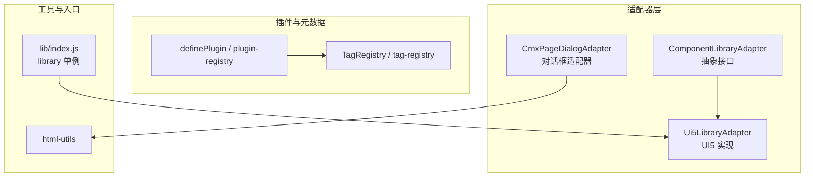
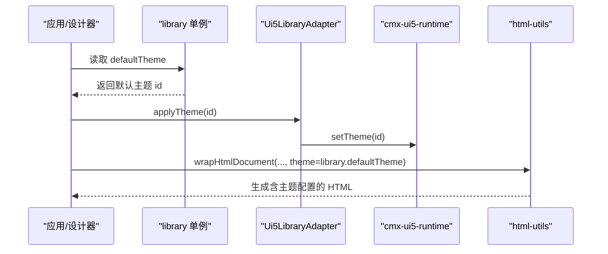
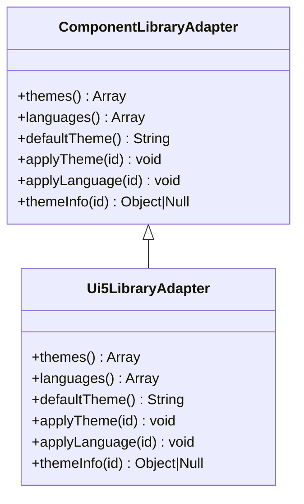
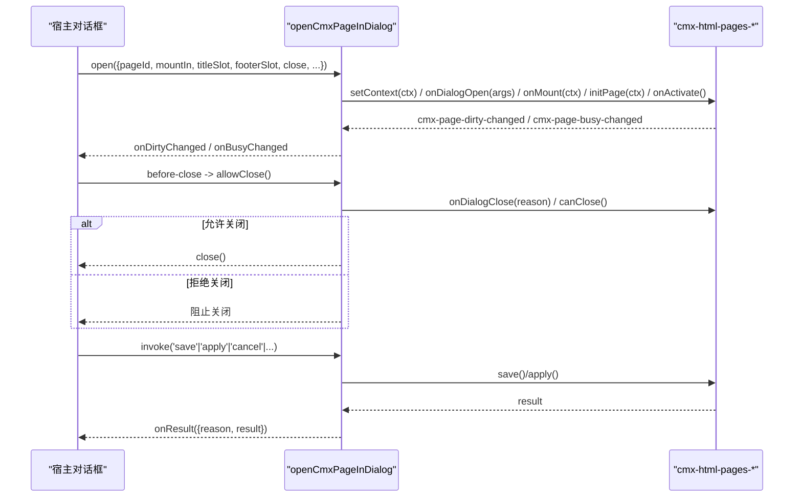
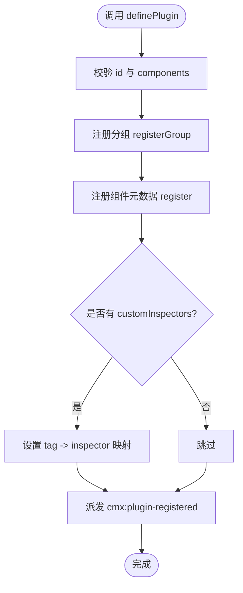
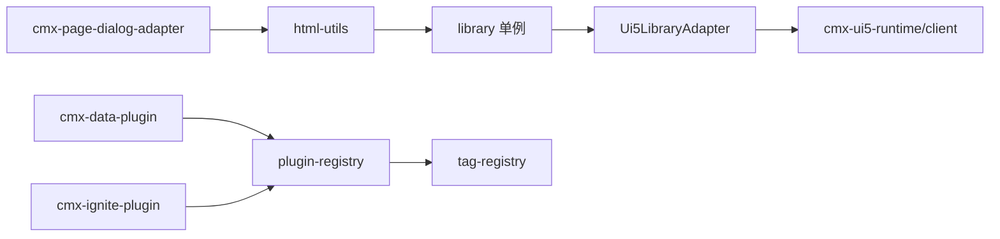

# 适配器插件开发

<cite>
**本文引用的文件**
- [component-library-adapter.js](file://CMXHTMLDesigner/src/lib/component-library-adapter.js)
- [ui5-library-adapter.js](file://CMXHTMLDesigner/src/lib/ui5-library-adapter.js)
- [index.js（库适配器单例）](file://CMXHTMLDesigner/src/lib/index.js)
- [cmx-page-dialog-adapter.js](file://CMXHTMLDesigner/src/adapters/cmx-page-dialog-adapter.js)
- [plugin-registry.js](file://CMXHTMLDesigner/src/lib/plugin-registry.js)
- [tag-registry.js](file://CMXHTMLDesigner/src/metadata/tag-registry.js)
- [html-utils.js](file://CMXHTMLDesigner/src/utils/html-utils.js)
- [cmx-data-plugin.js](file://CMXHTMLDesigner/src/plugins/cmx-data-plugin.js)
- [cmx-ignite-plugin.js](file://CMXHTMLDesigner/src/plugins/cmx-ignite-plugin.js)
</cite>

## 目录
1. [简介](#简介)
2. [项目结构](#项目结构)
3. [核心组件](#核心组件)
4. [架构总览](#架构总览)
5. [详细组件分析](#详细组件分析)
6. [依赖关系分析](#依赖关系分析)
7. [性能考虑](#性能考虑)
8. [故障排查指南](#故障排查指南)
9. [结论](#结论)
10. [附录：接口与实现规范](#附录接口与实现规范)

## 简介
本文件面向“适配器插件”的二次开发者，系统性说明适配器的作用、工作原理与实现方法。内容覆盖两类关键适配器：
- 组件库适配器：将设计器对具体 UI 组件库（如 SAP UI5）的运行时依赖抽象为统一接口，便于替换或扩展主题/语言等能力。
- 页面对话框适配器：将页面宿主元素（cmx-html-pages-*）以对话框形式承载，统一处理标题、按钮、关闭拦截、脏态/忙碌态同步等交互。

同时给出插件注册机制、版本兼容策略与错误处理建议，并提供第三方组件库适配示例（UI5 组件适配、Dialog 适配器使用）。

## 项目结构
与适配器相关的代码主要位于 CMXHTMLDesigner 前端工程内：
- lib：组件库适配器抽象与 UI5 实现、插件注册表
- adapters：页面对话框适配器
- plugins：内置组件插件（数据组件、Ignite 组件），展示如何通过 definePlugin 注册自定义组件元数据与 Inspector
- metadata：标签元数据注册表，负责加载与合并组、事件、样式等元信息
- utils：HTML 工具函数，包含导出、脚本注入、元素名推导等

图表来源
- [component-library-adapter.js:1-39](file://CMXHTMLDesigner/src/lib/component-library-adapter.js#L1-L39)
- [ui5-library-adapter.js:1-39](file://CMXHTMLDesigner/src/lib/ui5-library-adapter.js#L1-L39)
- [index.js（库适配器单例）:1-8](file://CMXHTMLDesigner/src/lib/index.js#L1-L8)
- [cmx-page-dialog-adapter.js:1-211](file://CMXHTMLDesigner/src/adapters/cmx-page-dialog-adapter.js#L1-L211)
- [plugin-registry.js:1-95](file://CMXHTMLDesigner/src/lib/plugin-registry.js#L1-L95)
- [tag-registry.js:1-149](file://CMXHTMLDesigner/src/metadata/tag-registry.js#L1-L149)
- [html-utils.js:1-490](file://CMXHTMLDesigner/src/utils/html-utils.js#L1-L490)

章节来源
- [component-library-adapter.js:1-39](file://CMXHTMLDesigner/src/lib/component-library-adapter.js#L1-L39)
- [ui5-library-adapter.js:1-39](file://CMXHTMLDesigner/src/lib/ui5-library-adapter.js#L1-L39)
- [cmx-page-dialog-adapter.js:1-211](file://CMXHTMLDesigner/src/adapters/cmx-page-dialog-adapter.js#L1-L211)
- [plugin-registry.js:1-95](file://CMXHTMLDesigner/src/lib/plugin-registry.js#L1-L95)
- [tag-registry.js:1-149](file://CMXHTMLDesigner/src/metadata/tag-registry.js#L1-L149)
- [html-utils.js:1-490](file://CMXHTMLDesigner/src/utils/html-utils.js#L1-L490)

## 核心组件
- 组件库适配器（ComponentLibraryAdapter）：定义主题/语言切换的统一接口，屏蔽底层组件库差异。
- UI5 组件库适配器（Ui5LibraryAdapter）：基于 cmx-ui5-runtime 提供主题/语言切换的具体实现。
- 页面对话框适配器（openCmxPageInDialog）：将 cmx-html-pages-* 页面嵌入对话框，统一处理标题、按钮、关闭拦截、脏态/忙碌态同步。
- 插件注册（definePlugin + TagRegistry）：动态注册自定义组件元数据、分组、Inspector，驱动设计器调色板刷新。

章节来源
- [component-library-adapter.js:1-39](file://CMXHTMLDesigner/src/lib/component-library-adapter.js#L1-L39)
- [ui5-library-adapter.js:1-39](file://CMXHTMLDesigner/src/lib/ui5-library-adapter.js#L1-L39)
- [cmx-page-dialog-adapter.js:1-211](file://CMXHTMLDesigner/src/adapters/cmx-page-dialog-adapter.js#L1-L211)
- [plugin-registry.js:1-95](file://CMXHTMLDesigner/src/lib/plugin-registry.js#L1-L95)
- [tag-registry.js:1-149](file://CMXHTMLDesigner/src/metadata/tag-registry.js#L1-L149)

## 架构总览
适配器体系通过“抽象接口 + 具体实现 + 注册中心”解耦业务与第三方库：
- 抽象接口：ComponentLibraryAdapter 暴露 themes/languages/defaultTheme/applyTheme/applyLanguage/themeInfo。
- 具体实现：Ui5LibraryAdapter 调用 cmx-ui5-runtime 的 setTheme/setLanguage。
- 全局单例：lib/index.js 导出 library 单例，供 html-utils 等模块读取默认主题。
- 对话框适配器：openCmxPageInDialog 通过 DOM 钩子与事件桥接，将页面生命周期与对话框行为对齐。
- 插件系统：definePlugin 将组件元数据注册到 TagRegistry，触发调色板刷新。

图表来源
- [index.js（库适配器单例）:1-8](file://CMXHTMLDesigner/src/lib/index.js#L1-L8)
- [ui5-library-adapter.js:1-39](file://CMXHTMLDesigner/src/lib/ui5-library-adapter.js#L1-L39)
- [html-utils.js:237-316](file://CMXHTMLDesigner/src/utils/html-utils.js#L237-L316)

章节来源
- [index.js（库适配器单例）:1-8](file://CMXHTMLDesigner/src/lib/index.js#L1-L8)
- [ui5-library-adapter.js:1-39](file://CMXHTMLDesigner/src/lib/ui5-library-adapter.js#L1-L39)
- [html-utils.js:237-316](file://CMXHTMLDesigner/src/utils/html-utils.js#L237-L316)

## 详细组件分析

### 组件库适配器（ComponentLibraryAdapter）
- 职责：抽象主题/语言列表、默认主题、切换 API、主题信息查询。
- 关键点：
  - themes/languages 用于 UI 下拉选择；defaultTheme 作为导出/运行时的初始主题。
  - applyTheme/applyLanguage 由具体实现对接运行时。
  - themeInfo 支持按 id 查询主题元数据，便于 UI 渲染高亮当前主题。

图表来源
- [component-library-adapter.js:1-39](file://CMXHTMLDesigner/src/lib/component-library-adapter.js#L1-L39)
- [ui5-library-adapter.js:1-39](file://CMXHTMLDesigner/src/lib/ui5-library-adapter.js#L1-L39)

章节来源
- [component-library-adapter.js:1-39](file://CMXHTMLDesigner/src/lib/component-library-adapter.js#L1-L39)
- [ui5-library-adapter.js:1-39](file://CMXHTMLDesigner/src/lib/ui5-library-adapter.js#L1-L39)

### UI5 组件库适配器（Ui5LibraryAdapter）
- 职责：提供 UI5 Web Components 的主题/语言切换实现。
- 关键点：
  - 主题/语言常量数组，供 UI 展示。
  - 通过 getCmxUi5RuntimeSync().setTheme/setLanguage 切换运行时主题与语言。
  - themeInfo 根据 value 查找对应主题元数据。

章节来源
- [ui5-library-adapter.js:1-39](file://CMXHTMLDesigner/src/lib/ui5-library-adapter.js#L1-L39)

### 页面对话框适配器（openCmxPageInDialog）
- 职责：将 cmx-html-pages-* 页面嵌入对话框，统一处理：
  - 标题渲染：调用 host.getDialogTitle() 并写入 titleSlot。
  - 底部按钮：调用 host.getDialogButtons()，缺省时提供确定/取消；点击分派到 save/apply/cancel/close。
  - 关闭拦截：先调用 onDialogClose(reason)，再调用 canClose()，任一拒绝则阻止关闭。
  - 状态同步：监听 cmx-page-dirty-changed / cmx-page-busy-changed / cmx-page-request-close / cmx-page-request-save。
  - 生命周期：挂载后调用 setContext/onDialogOpen/onMount/initPage/onActivate。
- 返回值：提供 refresh/invoke/allowClose/requestClose/dispose 等方法，便于宿主控制。

图表来源
- [cmx-page-dialog-adapter.js:1-211](file://CMXHTMLDesigner/src/adapters/cmx-page-dialog-adapter.js#L1-L211)

章节来源
- [cmx-page-dialog-adapter.js:1-211](file://CMXHTMLDesigner/src/adapters/cmx-page-dialog-adapter.js#L1-L211)

### 插件注册机制（definePlugin + TagRegistry）
- definePlugin：接收插件对象（id、groups、components、customInspectors），完成：
  - 注册自定义分组（registerGroup）。
  - 注册组件元数据（register），支持覆盖式重注册（HMR 友好）。
  - 注册 customInspectors（可选），为特定 tag 提供属性面板渲染函数。
  - 派发 cmx:plugin-registered 事件，驱动左侧面板刷新。
- TagRegistry：维护 tags Map、commonAttrs/styleGroups/eventPresets，提供 get/getByGroup/getAll 等查询；ensureTagRegistryLoaded 异步加载 JSON 元数据并注册。

图表来源
- [plugin-registry.js:1-95](file://CMXHTMLDesigner/src/lib/plugin-registry.js#L1-L95)
- [tag-registry.js:1-149](file://CMXHTMLDesigner/src/metadata/tag-registry.js#L1-L149)

章节来源
- [plugin-registry.js:1-95](file://CMXHTMLDesigner/src/lib/plugin-registry.js#L1-L95)
- [tag-registry.js:1-149](file://CMXHTMLDesigner/src/metadata/tag-registry.js#L1-L149)

### 第三方组件库适配示例（UI5 组件适配）
- 通过 cmx-data-plugin.js 与 cmx-ignite-plugin.js 展示如何注册一组 UI5/Ignite 封装组件：
  - 导入实际组件实现（如 cmx-revo-grid、cmx-ui5-form、cmx-spreadsheet 等）。
  - 在 definePlugin 中声明组件元数据（tag、group、attrs、extraEvents、defaults、styleGroups）。
  - 可附加 customInspectors 为复杂组件提供属性面板。
- 该模式可直接复用到其他第三方组件库：只需提供组件实现与对应的元数据描述。

章节来源
- [cmx-data-plugin.js:1-747](file://CMXHTMLDesigner/src/plugins/cmx-data-plugin.js#L1-L747)
- [cmx-ignite-plugin.js:1-125](file://CMXHTMLDesigner/src/plugins/cmx-ignite-plugin.js#L1-L125)

## 依赖关系分析
- 组件库适配器依赖：
  - ui5-library-adapter 依赖 cmx-ui5-runtime/client 获取运行时实例。
  - html-utils 依赖 library 单例读取默认主题，并在导出文档时注入主题配置与样式。
- 对话框适配器依赖：
  - html-utils.cmxHtmlPagesElementLocalName 推导宿主元素 tag。
  - 通过事件与 DOM 钩子与 cmx-html-pages-* 页面通信。
- 插件系统依赖：
  - plugin-registry 依赖 tag-registry 进行元数据注册与查询。
  - 内置插件（cmx-data-plugin、cmx-ignite-plugin）通过 definePlugin 注册组件元数据。

图表来源
- [ui5-library-adapter.js:1-39](file://CMXHTMLDesigner/src/lib/ui5-library-adapter.js#L1-L39)
- [index.js（库适配器单例）:1-8](file://CMXHTMLDesigner/src/lib/index.js#L1-L8)
- [html-utils.js:1-490](file://CMXHTMLDesigner/src/utils/html-utils.js#L1-L490)
- [cmx-page-dialog-adapter.js:1-211](file://CMXHTMLDesigner/src/adapters/cmx-page-dialog-adapter.js#L1-L211)
- [plugin-registry.js:1-95](file://CMXHTMLDesigner/src/lib/plugin-registry.js#L1-L95)
- [tag-registry.js:1-149](file://CMXHTMLDesigner/src/metadata/tag-registry.js#L1-L149)
- [cmx-data-plugin.js:1-747](file://CMXHTMLDesigner/src/plugins/cmx-data-plugin.js#L1-L747)
- [cmx-ignite-plugin.js:1-125](file://CMXHTMLDesigner/src/plugins/cmx-ignite-plugin.js#L1-L125)

章节来源
- [ui5-library-adapter.js:1-39](file://CMXHTMLDesigner/src/lib/ui5-library-adapter.js#L1-L39)
- [index.js（库适配器单例）:1-8](file://CMXHTMLDesigner/src/lib/index.js#L1-L8)
- [html-utils.js:1-490](file://CMXHTMLDesigner/src/utils/html-utils.js#L1-L490)
- [cmx-page-dialog-adapter.js:1-211](file://CMXHTMLDesigner/src/adapters/cmx-page-dialog-adapter.js#L1-L211)
- [plugin-registry.js:1-95](file://CMXHTMLDesigner/src/lib/plugin-registry.js#L1-L95)
- [tag-registry.js:1-149](file://CMXHTMLDesigner/src/metadata/tag-registry.js#L1-L149)
- [cmx-data-plugin.js:1-747](file://CMXHTMLDesigner/src/plugins/cmx-data-plugin.js#L1-L747)
- [cmx-ignite-plugin.js:1-125](file://CMXHTMLDesigner/src/plugins/cmx-ignite-plugin.js#L1-L125)

## 性能考虑
- 主题/语言切换：
  - 通过运行时一次性切换，避免频繁 DOM 操作；建议在用户选择后批量应用。
- 对话框适配器：
  - 使用 tryCall 包装宿主方法调用，减少异常对主流程影响；busy 状态及时恢复，避免阻塞。
- 插件注册：
  - TagRegistry 支持覆盖式注册，适合 HMR 场景；避免重复注册导致内存增长。
- 导出 HTML：
  - html-utils.wrapHtmlDocument 仅注入必要依赖与主题 CSS，减少包体大小；importmap 固定版本，确保兼容性。

[本节为通用指导，不直接分析具体文件]

## 故障排查指南
- 对话框无法关闭：
  - 检查 onDialogClose 与 canClose 是否返回 false；确认 allowClose 在 before-close 中被正确调用。
  - 参考路径：[cmx-page-dialog-adapter.js:165-186](file://CMXHTMLDesigner/src/adapters/cmx-page-dialog-adapter.js#L165-L186)
- 保存/应用失败：
  - 检查 action 执行时 setBusy 是否正确设置与清除；查看 console.warn 输出。
  - 参考路径：[cmx-page-dialog-adapter.js:140-163](file://CMXHTMLDesigner/src/adapters/cmx-page-dialog-adapter.js#L140-L163)
- 主题未生效：
  - 确认 library.defaultTheme 与 applyTheme 调用链正常；检查 cmx-ui5-runtime 是否可用。
  - 参考路径：[ui5-library-adapter.js:30-36](file://CMXHTMLDesigner/src/lib/ui5-library-adapter.js#L30-L36)、[html-utils.js:299-305](file://CMXHTMLDesigner/src/utils/html-utils.js#L299-L305)
- 插件未显示：
  - 确认 definePlugin 已调用且组件元数据完整；检查 cmx:plugin-registered 事件是否触发。
  - 参考路径：[plugin-registry.js:60-89](file://CMXHTMLDesigner/src/lib/plugin-registry.js#L60-L89)

章节来源
- [cmx-page-dialog-adapter.js:140-186](file://CMXHTMLDesigner/src/adapters/cmx-page-dialog-adapter.js#L140-L186)
- [ui5-library-adapter.js:30-36](file://CMXHTMLDesigner/src/lib/ui5-library-adapter.js#L30-L36)
- [html-utils.js:299-305](file://CMXHTMLDesigner/src/utils/html-utils.js#L299-L305)
- [plugin-registry.js:60-89](file://CMXHTMLDesigner/src/lib/plugin-registry.js#L60-L89)

## 结论
本项目通过清晰的适配器分层与插件注册机制，实现了：
- 组件库无关的主题/语言切换能力，便于替换或扩展 UI 框架。
- 统一的页面对话框承载方案，简化页面嵌入与交互管理。
- 灵活的插件系统，支持快速接入第三方组件并定制属性面板。
遵循本文档的接口规范与实践建议，可高效完成第三方组件库适配与对话框集成。

[本节为总结性内容，不直接分析具体文件]

## 附录：接口与实现规范

### 组件库适配器接口规范
- 必须实现：
  - themes：返回可用主题列表。
  - languages：返回可用语言列表。
  - defaultTheme：返回默认主题 id。
  - applyTheme(id)：通知运行时切换主题。
  - applyLanguage(id)：通知运行时切换语言。
  - themeInfo(id)：返回主题元数据或 null。
- 推荐实践：
  - 保持主题/语言列表稳定，新增项需向后兼容。
  - 切换 API 应幂等，避免重复切换引发副作用。
  - 在导出/运行环境中，通过 library.defaultTheme 保证一致性。

章节来源
- [component-library-adapter.js:1-39](file://CMXHTMLDesigner/src/lib/component-library-adapter.js#L1-L39)
- [ui5-library-adapter.js:1-39](file://CMXHTMLDesigner/src/lib/ui5-library-adapter.js#L1-L39)
- [index.js（库适配器单例）:1-8](file://CMXHTMLDesigner/src/lib/index.js#L1-L8)

### 页面对话框适配器使用规范
- 必需参数：
  - pageId：用于推导宿主元素 tag。
  - mountIn：承载页面的容器。
- 可选参数：
  - args/ctx：传递给 onDialogOpen/onMount/setContext。
  - titleSlot/footerSlot：用于渲染标题与按钮。
  - onResult/close：结果回调与关闭请求。
  - onDirtyChanged/onBusyChanged：状态同步回调。
- 关闭流程：
  - 先调用 onDialogClose(reason)，再调用 canClose()，任一拒绝则阻止关闭。
  - 外部应在 before-close 中调用 allowClose() 决定是否阻止关闭。
- 动作分派：
  - save/apply：设置 busy，调用宿主方法，成功后 onResult 并自动关闭（save）。
  - cancel/close：直接关闭或触发关闭流程。

章节来源
- [cmx-page-dialog-adapter.js:1-211](file://CMXHTMLDesigner/src/adapters/cmx-page-dialog-adapter.js#L1-L211)

### 插件注册与版本兼容
- 插件对象结构：
  - id：唯一标识，防止重复注册。
  - groups：自定义分组，支持 order/collapsed 等。
  - components：组件元数据数组，与静态 JSON 格式一致。
  - customInspectors：可选，为特定 tag 提供属性面板渲染函数。
- 版本兼容：
  - TagRegistry.register 支持覆盖式注册，适合 HMR 与热更新。
  - ensureTagRegistryLoaded 多次调用返回同一 Promise，避免重复加载。
- 错误处理：
  - definePlugin 对必填字段进行校验，抛出明确错误。
  - TagRegistry.registerGroup/register 对非法输入进行保护。

章节来源
- [plugin-registry.js:1-95](file://CMXHTMLDesigner/src/lib/plugin-registry.js#L1-L95)
- [tag-registry.js:1-149](file://CMXHTMLDesigner/src/metadata/tag-registry.js#L1-L149)

### 第三方组件库适配示例（UI5 组件）
- 步骤：
  - 导入第三方组件实现（如 cmx-revo-grid、cmx-ui5-form 等）。
  - 在 definePlugin 中声明组件元数据（tag、group、attrs、extraEvents、defaults、styleGroups）。
  - 如需复杂属性面板，提供 customInspectors。
- 参考：
  - 数据组件插件：[cmx-data-plugin.js:1-747](file://CMXHTMLDesigner/src/plugins/cmx-data-plugin.js#L1-L747)
  - Ignite 组件插件：[cmx-ignite-plugin.js:1-125](file://CMXHTMLDesigner/src/plugins/cmx-ignite-plugin.js#L1-L125)

章节来源
- [cmx-data-plugin.js:1-747](file://CMXHTMLDesigner/src/plugins/cmx-data-plugin.js#L1-L747)
- [cmx-ignite-plugin.js:1-125](file://CMXHTMLDesigner/src/plugins/cmx-ignite-plugin.js#L1-L125)