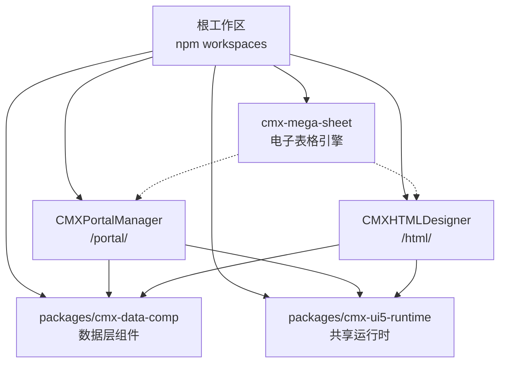
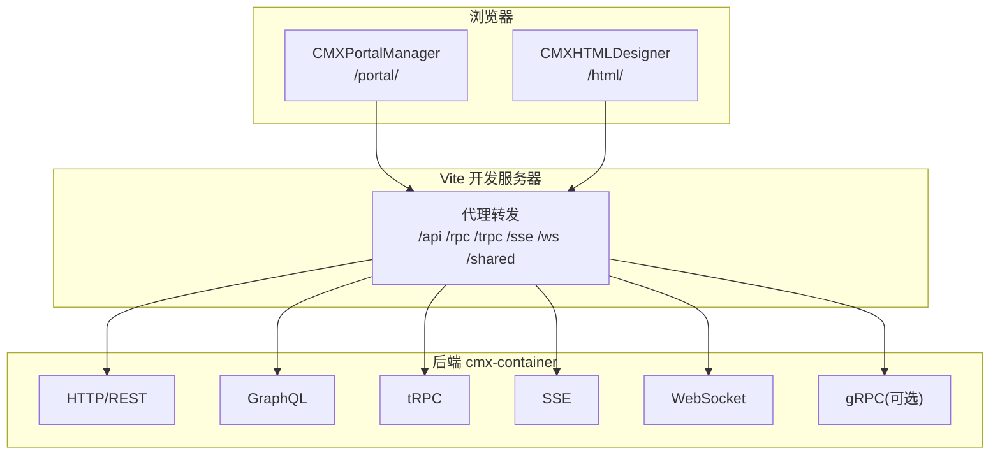
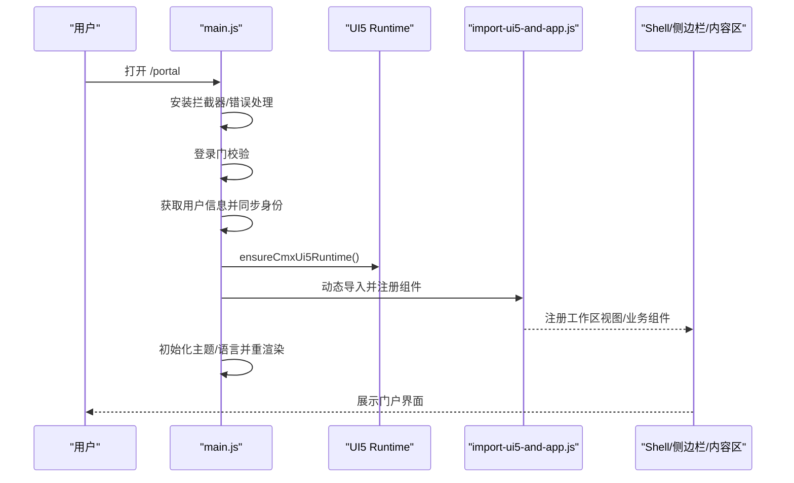
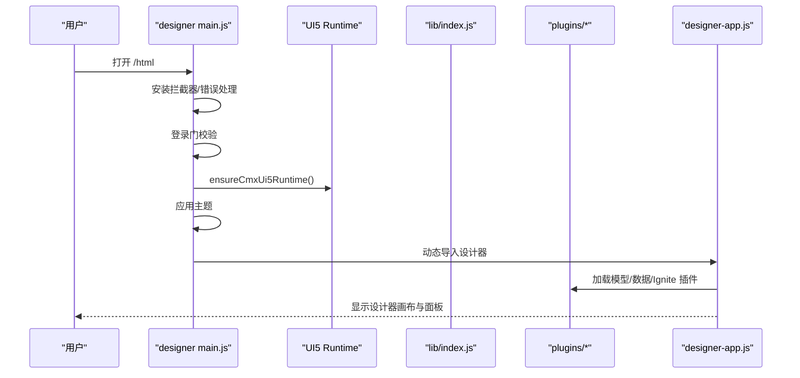
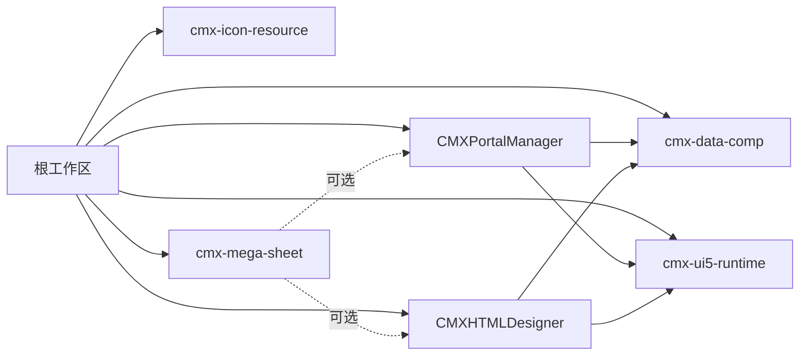
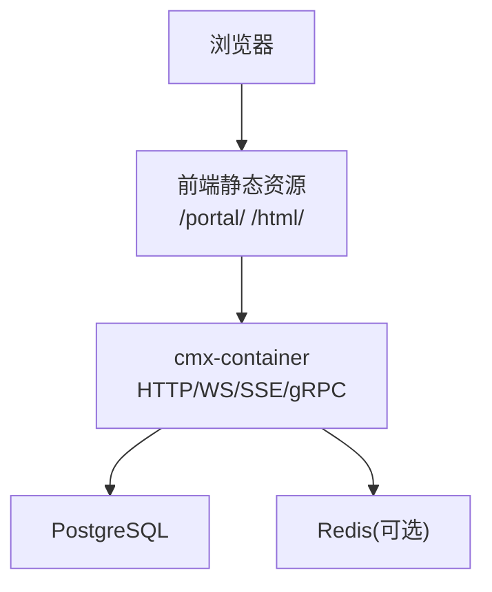

# 整体架构概览

<cite>
**本文引用的文件**
- [README.md](file://README.md)
- [package.json](file://package.json)
- [CMXPortalManager/package.json](file://CMXPortalManager/package.json)
- [CMXHTMLDesigner/package.json](file://CMXHTMLDesigner/package.json)
- [cmx-mega-sheet/package.json](file://cmx-mega-sheet/package.json)
- [CMXPortalManager/src/main.js](file://CMXPortalManager/src/main.js)
- [CMXHTMLDesigner/src/main.js](file://CMXHTMLDesigner/src/main.js)
- [CMXPortalManager/vite.config.js](file://CMXPortalManager/vite.config.js)
- [CMXHTMLDesigner/vite.config.js](file://CMXHTMLDesigner/vite.config.js)
- [CMXPortalManager/src/import-ui5-and-app.js](file://CMXPortalManager/src/import-ui5-and-app.js)
- [CMXHTMLDesigner/src/import-ui5-and-app.js](file://CMXHTMLDesigner/src/import-ui5-and-app.js)
- [docker命令.txt](file://docker命令.txt)
</cite>

## 目录
1. [简介](#简介)
2. [项目结构](#项目结构)
3. [核心组件](#核心组件)
4. [架构总览](#架构总览)
5. [详细组件分析](#详细组件分析)
6. [依赖关系分析](#依赖关系分析)
7. [性能与构建优化](#性能与构建优化)
8. [部署拓扑与容器化](#部署拓扑与容器化)
9. [故障排查指南](#故障排查指南)
10. [结论](#结论)

## 简介
本仓库是 CMX 企业门户平台的前端 monorepo，提供“元数据驱动”的企业级应用前端能力：门户运行时（CMXPortalManager）、可视化页面设计器（CMXHTMLDesigner）、数据层 Web Components（packages/cmx-data-comp）以及共享 UI5/Tabler 运行时（packages/cmx-ui5-runtime）。同时包含自研电子表格引擎 cmx-mega-sheet。后端由 Rust 实现的 cmx-container 提供单据、字典、报表、流程、异步任务等能力，并通过 HTTP/WebSocket/SSE/gRPC 等协议与前端交互。

## 项目结构
- 根 package.json 使用 npm workspaces 管理多子项目，统一脚本与依赖覆盖。
- 两个应用入口：
  - CMXPortalManager：门户运行时，生产路由 /portal/
  - CMXHTMLDesigner：可视化设计器，生产路由 /html/
- packages：
  - cmx-data-comp：数据层 Web Components（主从、列模型、数据集、表单/表格/树等）
  - cmx-ui5-runtime：UI5/Tabler 运行时与 Vite 插件
  - cmx-icon-resource：图标资源包
- cmx-mega-sheet：自研电子表格引擎（TypeScript + Web Components），可独立发布与复用
- docs/documents：架构方案、落地设计与问题复盘文档

图表来源
- [package.json:6-10](file://package.json#L6-L10)
- [README.md:10-17](file://README.md#L10-L17)

章节来源
- [package.json:1-39](file://package.json#L1-L39)
- [README.md:1-73](file://README.md#L1-L73)

## 核心组件
- CMXPortalManager（门户运行时）
  - 职责：登录鉴权、主题/语言初始化、领域-应用-模块导航、工作区与标签页、菜单与活动加载、定义管理与配置面板、AI 工作台集成等
  - 启动顺序：全局错误与拦截器安装 → 登录门 → 用户信息获取 → 共用 UI5 runtime → 主题/语言 → 注册业务组件 → 渲染
- CMXHTMLDesigner（可视化设计器）
  - 职责：HTML/JS 页面可视化编辑、标签与属性面板、模型与数据绑定、预览与导出、插件体系（模型/数据/Ignite 等）
  - 启动顺序：全局错误与拦截器安装 → 登录门 → 共用 UI5 runtime → 主题 → 注册标签与插件 → 启动设计器
- cmx-data-comp（数据层组件库）
  - 职责：CmxDataSet、CmxColumnModel、CmxMasterSlave、FlexibleCombination、表单/表格/树/对话框等 Web Components；页面模型初始化与事件总线
- cmx-ui5-runtime（共享运行时）
  - 职责：UI5/Tabler 运行时注入、Vite 插件（副作用垫片、locale 白名单、应用插件）、多应用共享同一份运行时实例
- cmx-mega-sheet（电子表格引擎）
  - 职责：自研纯 Web Components 的表格引擎，提供单元格、公式、依赖图、渲染、导入导出等能力，用于报表场景替代商业内核

章节来源
- [CMXPortalManager/src/main.js:1-49](file://CMXPortalManager/src/main.js#L1-L49)
- [CMXHTMLDesigner/src/main.js:1-29](file://CMXHTMLDesigner/src/main.js#L1-L29)
- [CMXPortalManager/src/import-ui5-and-app.js:1-45](file://CMXPortalManager/src/import-ui5-and-app.js#L1-L45)
- [CMXHTMLDesigner/src/import-ui5-and-app.js:1-12](file://CMXHTMLDesigner/src/import-ui5-and-app.js#L1-L12)
- [cmx-mega-sheet/package.json:1-31](file://cmx-mega-sheet/package.json#L1-L31)

## 架构总览
- 前后端分离：前端通过 Vite 开发服务器代理到后端 cmx-container（默认 :8080），生产环境同源托管于 web-server
- 微服务集成模式：HTTP REST、GraphQL、tRPC、WebSocket、SSE、gRPC（部分功能）等多协议接入后端
- 模块加载机制：应用入口先完成鉴权与环境准备，再动态 import 业务组件与运行时；UI5 组件在共享运行时中统一注册与渲染
- 依赖管理策略：workspaces 统一管理版本；vite.config 中 dedupe 关键 UI 库避免多实例；按需拆分 vendor chunk；dev 模式 alias 指向源码提升调试体验

图表来源
- [CMXPortalManager/vite.config.js:84-96](file://CMXPortalManager/vite.config.js#L84-L96)
- [CMXHTMLDesigner/vite.config.js:72-84](file://CMXHTMLDesigner/vite.config.js#L72-L84)
- [README.md:45-55](file://README.md#L45-L55)

章节来源
- [CMXPortalManager/vite.config.js:1-184](file://CMXPortalManager/vite.config.js#L1-L184)
- [CMXHTMLDesigner/vite.config.js:1-118](file://CMXHTMLDesigner/vite.config.js#L1-L118)
- [README.md:45-55](file://README.md#L45-L55)

## 详细组件分析

### 门户运行时（CMXPortalManager）
- 启动流程
  - 安装控制台桥接、全局 fetch 拦截器、全局错误提示
  - 登录门校验，未登录跳转 /login
  - 获取当前用户并同步身份标识
  - 确保共享 UI5 runtime 就绪
  - 动态导入并注册 Portal 业务组件
  - 初始化主题与语言，触发 UI5 元素重渲染
- 模块加载
  - 通过 import-ui5-and-app 注册工作区视图类型、数据组件与业务组件
  - 首屏按需加载 AI 工作台、代码规则、定义管理等模块
- 路由与上下文
  - 基于域-应用-模块树加载活动列表，恢复上次选择并应用首个活动
  - DAM 上下文合并：将 domain/application/module 注入页面初始上下文

图表来源
- [CMXPortalManager/src/main.js:16-43](file://CMXPortalManager/src/main.js#L16-L43)
- [CMXPortalManager/src/import-ui5-and-app.js:7-44](file://CMXPortalManager/src/import-ui5-and-app.js#L7-L44)

章节来源
- [CMXPortalManager/src/main.js:1-49](file://CMXPortalManager/src/main.js#L1-L49)
- [CMXPortalManager/src/import-ui5-and-app.js:1-45](file://CMXPortalManager/src/import-ui5-and-app.js#L1-L45)

### 可视化设计器（CMXHTMLDesigner）
- 启动流程
  - 安装全局拦截器与错误处理
  - 登录门校验
  - 确保 UI5 runtime 就绪
  - 读取主题并应用
  - 动态导入并注册标签注册表与设计器插件
  - 启动设计器应用
- 插件体系
  - 模型插件、数据插件、Ignite/Ignite Thin 插件，扩展设计期能力
- 元数据与标签
  - 通过 vite 插件生成/同步标签索引，支持拖拽与属性编辑

图表来源
- [CMXHTMLDesigner/src/main.js:11-23](file://CMXHTMLDesigner/src/main.js#L11-L23)
- [CMXHTMLDesigner/src/import-ui5-and-app.js:4-11](file://CMXHTMLDesigner/src/import-ui5-and-app.js#L4-L11)

章节来源
- [CMXHTMLDesigner/src/main.js:1-29](file://CMXHTMLDesigner/src/main.js#L1-L29)
- [CMXHTMLDesigner/src/import-ui5-and-app.js:1-12](file://CMXHTMLDesigner/src/import-ui5-and-app.js#L1-L12)

### 数据层组件（cmx-data-comp）
- 职责边界
  - 提供页面模型初始化（initPageModels）与运行时数据流（数据集、列模型、主从协调、弹性组合）
  - 提供通用 UI 组件（表单、表格、树、对话框、状态条等）
- 与应用的集成
  - 门户与应用通过 globalThis.__cmxDataComp 暴露能力
  - 设计器通过插件体系消费数据模型与组件能力
- 复杂度与性能
  - 采用增量 changeset、懒加载与事件驱动更新，减少重绘与网络开销

章节来源
- [CMXPortalManager/src/import-ui5-and-app.js:11-27](file://CMXPortalManager/src/import-ui5-and-app.js#L11-L27)
- [CMXHTMLDesigner/src/import-ui5-and-app.js:7-10](file://CMXHTMLDesigner/src/import-ui5-and-app.js#L7-L10)

### 共享运行时（cmx-ui5-runtime）
- 职责边界
  - 提供 UI5/Tabler 运行时注入、locale 白名单、副作用垫片
  - 为多应用提供统一的 UI 基础能力，避免重复实例
- 与构建系统的集成
  - 通过 Vite 插件在 dev/build 阶段注入必要逻辑，保证跨应用一致性

章节来源
- [CMXPortalManager/vite.config.js:5-6](file://CMXPortalManager/vite.config.js#L5-L6)
- [CMXHTMLDesigner/vite.config.js:5-7](file://CMXHTMLDesigner/vite.config.js#L5-L7)

### 电子表格引擎（cmx-mega-sheet）
- 职责边界
  - 自研表格引擎，提供单元格、公式解析与求值、依赖图、渲染、导入导出（xlsx/csv/pdf/html）
- 与上层应用的关系
  - 作为可独立发布的 npm 包，被报表场景引用；在门户/设计器中通过组件封装使用
- 技术特点
  - 纯 Web Components/TypeScript，零框架依赖，Apache-2.0 许可

章节来源
- [cmx-mega-sheet/package.json:1-31](file://cmx-mega-sheet/package.json#L1-L31)

## 依赖关系分析
- 工作区依赖
  - 根 package.json 声明 workspaces 与公共脚本，统一测试、构建与 lint
  - 各子项目通过 workspace 引用 cmx-data-comp、cmx-ui5-runtime、cmx-icon-resource
- 运行时依赖
  - UI5 WebComponents 系列在两个应用中均被引入，通过 dedupe 避免多实例
  - 编辑器（CodeMirror/Shiki）、Markdown、浮动 UI 等按模块拆分至独立 vendor chunk
- 外部服务
  - 开发时通过 Vite 代理转发到后端 cmx-container（/api、/rpc、/trpc、/sse、/ws、/shared）
  - 生产环境同源托管，静态资源由 web-server 提供

图表来源
- [package.json:6-10](file://package.json#L6-L10)
- [CMXPortalManager/package.json:45-47](file://CMXPortalManager/package.json#L45-L47)
- [CMXHTMLDesigner/package.json:26-28](file://CMXHTMLDesigner/package.json#L26-L28)

章节来源
- [package.json:1-39](file://package.json#L1-L39)
- [CMXPortalManager/package.json:1-62](file://CMXPortalManager/package.json#L1-L62)
- [CMXHTMLDesigner/package.json:1-39](file://CMXHTMLDesigner/package.json#L1-L39)

## 性能与构建优化
- 多入口与分包
  - 门户与应用分别构建 index.html 与 login.html（设计器还包含 preview/debug）
  - 通过 manualChunks/codeSplitting.groups 将重型第三方库拆分为独立 chunk（如 ignite-spreadsheet/grids/gauges、tabulator、revogrid、lit、markdown、shiki、floating-ui）
- 预加载优化
  - modulePreload 过滤掉仅在动态路径上的重型 vendor chunk，避免首屏阻塞
- 依赖去重
  - dedupe UI5 相关库与 lit 系列，确保全应用只有一份实例，避免响应式失效
- 开发体验
  - dev 模式 alias 指向源码，便于调试 UI5 runtime 与数据组件
  - 环境变量分层（.env/.env.production/shell），支持多环境构建

章节来源
- [CMXPortalManager/vite.config.js:97-168](file://CMXPortalManager/vite.config.js#L97-L168)
- [CMXHTMLDesigner/vite.config.js:90-103](file://CMXHTMLDesigner/vite.config.js#L90-L103)
- [CMXPortalManager/vite.config.js:42-82](file://CMXPortalManager/vite.config.js#L42-L82)
- [CMXHTMLDesigner/vite.config.js:37-71](file://CMXHTMLDesigner/vite.config.js#L37-L71)

## 部署拓扑与容器化
- 开发环境
  - 本地运行 Vite 开发服务器，代理 /api、/rpc、/trpc、/sse、/ws、/shared 到后端 cmx-container（默认 http://127.0.0.1:8080）
- 生产环境
  - 前端产物 dist/ 由后端 web-server 同源托管，路径分别为 /portal/ 与 /html/
- 容器化
  - 数据库与缓存可通过 Docker 运行（Postgres、Redis），配合编排工具进行部署
  - 前端与后端可在同一容器或不同容器中部署，依据规模选择共用宿主或独立宿主

图表来源
- [CMXPortalManager/vite.config.js:27-33](file://CMXPortalManager/vite.config.js#L27-L33)
- [CMXHTMLDesigner/vite.config.js:26-31](file://CMXHTMLDesigner/vite.config.js#L26-L31)
- [docker命令.txt:1-21](file://docker命令.txt#L1-L21)

章节来源
- [CMXPortalManager/vite.config.js:15-33](file://CMXPortalManager/vite.config.js#L15-L33)
- [CMXHTMLDesigner/vite.config.js:15-31](file://CMXHTMLDesigner/vite.config.js#L15-L31)
- [docker命令.txt:1-21](file://docker命令.txt#L1-L21)

## 故障排查指南
- 启动失败兜底
  - 门户与设计器均在 bootstrap 失败时捕获异常并展示致命错误屏幕，便于快速定位
- 鉴权与接口
  - 全局 fetch 拦截器统一附加 Bearer token 并处理 401；若出现反复 401，检查代理目标与登录态
- 首屏性能
  - 若首屏过大，检查 vendor chunk 拆分是否生效，确认 modulePreload 过滤了重型依赖
- 多实例问题
  - 若 UI5/lit 行为异常，检查 dedupe 配置是否生效，避免多份实例导致的事件/状态不一致
- 代理与后端连通性
  - 确认 Vite server.proxy 目标地址正确，必要时调整 CMX_VITE_BACKEND 环境变量

章节来源
- [CMXPortalManager/src/main.js:45-48](file://CMXPortalManager/src/main.js#L45-L48)
- [CMXHTMLDesigner/src/main.js:25-28](file://CMXHTMLDesigner/src/main.js#L25-L28)
- [CMXPortalManager/vite.config.js:84-96](file://CMXPortalManager/vite.config.js#L84-L96)
- [CMXHTMLDesigner/vite.config.js:72-84](file://CMXHTMLDesigner/vite.config.js#L72-L84)

## 结论
CMX 企业门户平台以 monorepo 为核心组织方式，清晰划分门户运行时、可视化设计器、数据层组件与共享运行时四大职责域，并通过 Vite 的多入口与精细化分包实现高性能首屏与按需加载。前后端分离结合多种通信协议，满足复杂企业场景的微服务集成需求。cmx-mega-sheet 作为自研电子表格引擎，进一步降低对商业内核的依赖。整体架构兼顾可维护性、可扩展性与部署灵活性，适合中小团队快速迭代与大厂规模化交付。