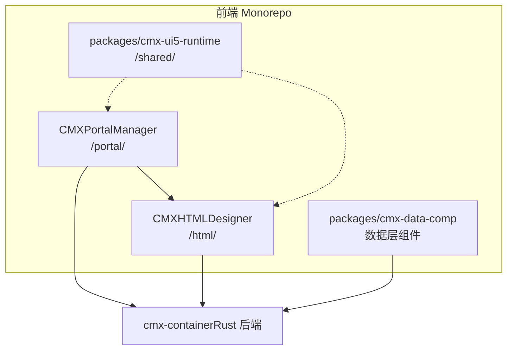
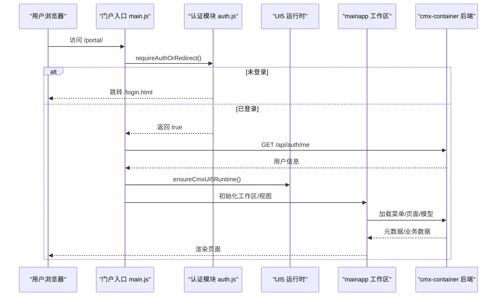
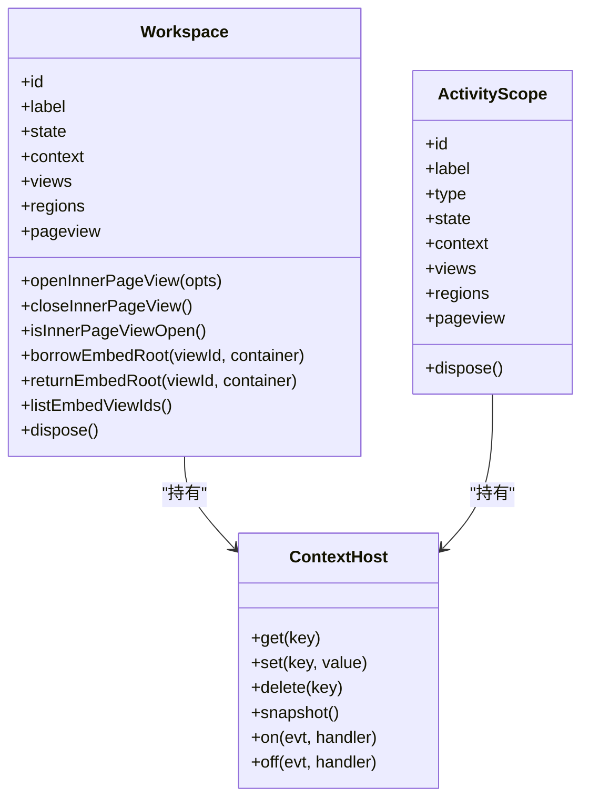
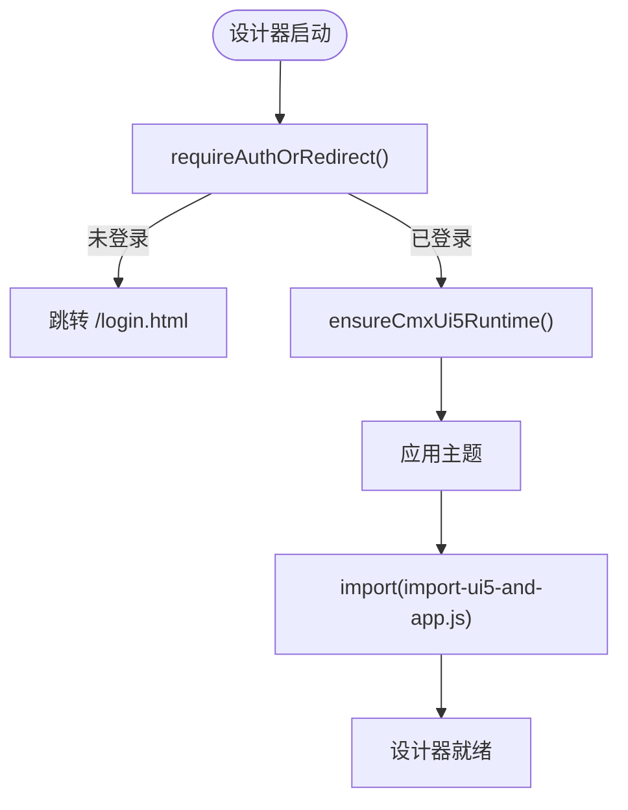
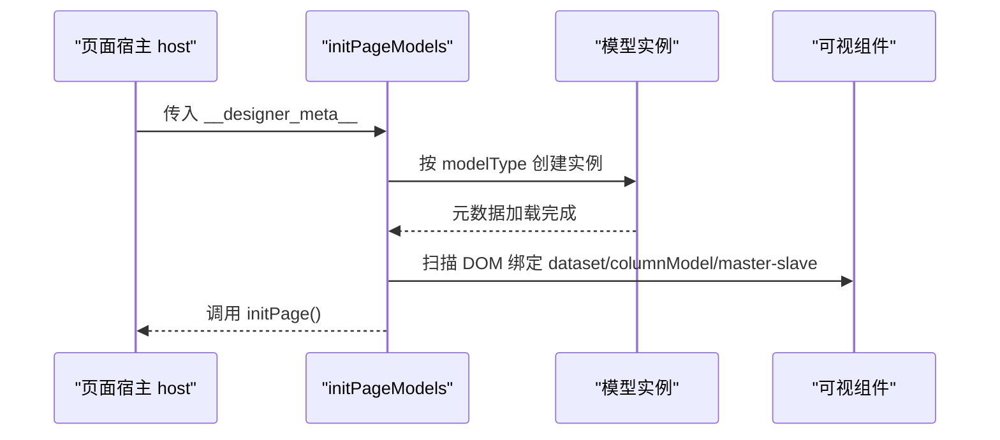
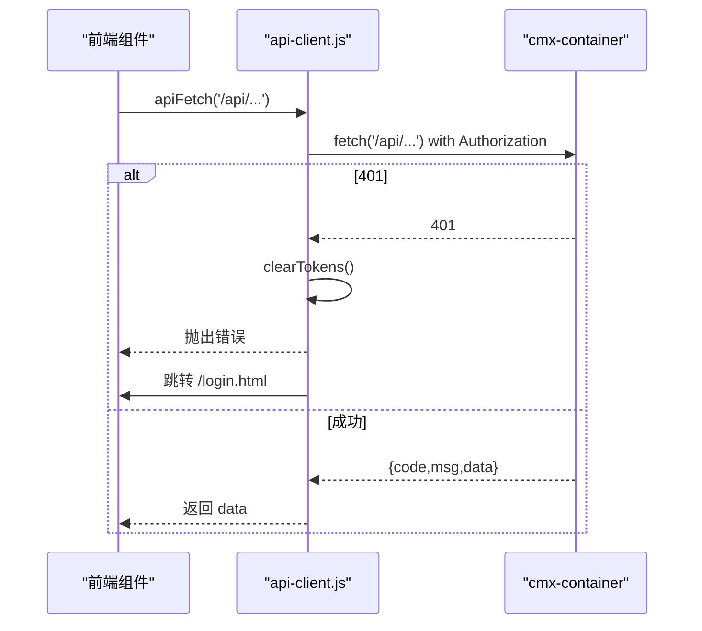
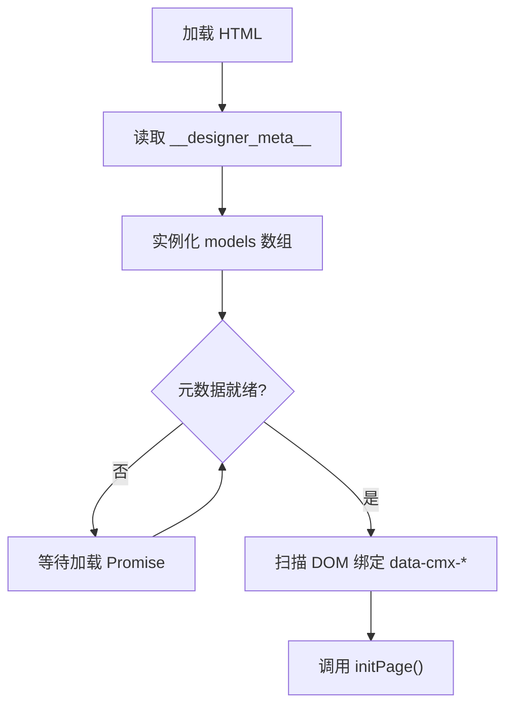
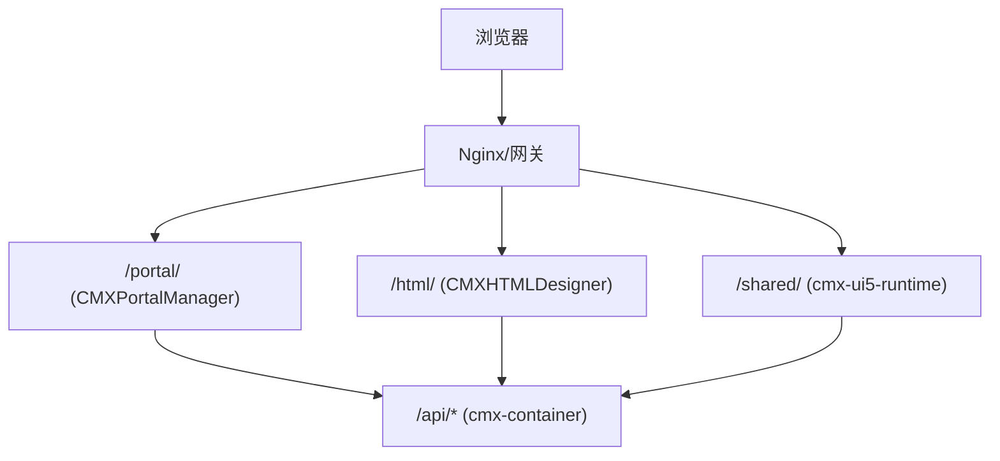
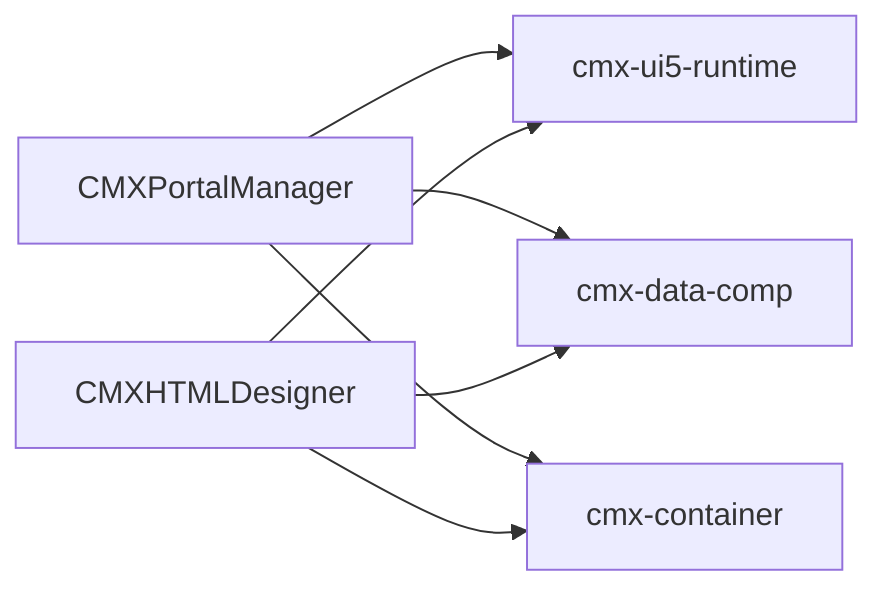

# 架构设计

<cite>
**本文引用的文件**
- [README.md](file://README.md)
- [CMXPortalManager/src/main.js](file://CMXPortalManager/src/main.js)
- [CMXHTMLDesigner/src/main.js](file://CMXHTMLDesigner/src/main.js)
- [CMXPortalManager/package.json](file://CMXPortalManager/package.json)
- [CMXHTMLDesigner/package.json](file://CMXHTMLDesigner/package.json)
- [CMXPortalManager/src/lib/mainapp.js](file://CMXPortalManager/src/lib/mainapp.js)
- [CMXHTMLDesigner/src/lib/index.js](file://CMXHTMLDesigner/src/lib/index.js)
- [packages/cmx-data-comp/src/index.js](file://packages/cmx-data-comp/src/index.js)
- [CMXHTMLDesigner/src/utils/html-utils.js](file://CMXHTMLDesigner/src/utils/html-utils.js)
- [CMXHTMLDesigner/src/lib/plugin-registry.js](file://CMXHTMLDesigner/src/lib/plugin-registry.js)
- [CMXHTMLDesigner/src/lib/api-client.js](file://CMXHTMLDesigner/src/lib/api-client.js)
- [CMXPortalManager/src/lib/auth.js](file://CMXPortalManager/src/lib/auth.js)
- [CMXPortalManager/sap_btp.md](file://CMXPortalManager/sap_btp.md)
- [CMXPortalManager/docs/software-quality-assessment-report.html](file://CMXPortalManager/docs/software-quality-assessment-report.html)
- [packages/cmx-data-comp/src/lib/init-page-models.js](file://packages/cmx-data-comp/src/lib/init-page-models.js)
- [.agents/skills/html-page-generator/references/page-assembly.md](file://.agents/skills/html-page-generator/references/page-assembly.md)
</cite>

## 目录
1. [简介](#简介)
2. [项目结构](#项目结构)
3. [核心组件](#核心组件)
4. [架构总览](#架构总览)
5. [详细组件分析](#详细组件分析)
6. [依赖关系分析](#依赖关系分析)
7. [性能考虑](#性能考虑)
8. [故障排查指南](#故障排查指南)
9. [结论](#结论)
10. [附录](#附录)

## 简介
本架构设计文档面向 CMX 企业门户平台，聚焦前后端分离、元数据驱动与 Web Components 的运行时体系。平台由“门户运行时（CMXPortalManager）”“可视化设计器（CMXHTMLDesigner）”“数据层 Web Components（cmx-data-comp）”“共享 UI5 运行时（cmx-ui5-runtime）”组成，并与 Rust 后端 cmx-container 协同工作，提供单据/字典/报表/流程等能力。

## 项目结构
仓库采用 monorepo 组织：
- CMXPortalManager：门户运行时，负责登录门、主题/语言初始化、工作区与视图管理、路由与内容区域渲染。
- CMXHTMLDesigner：可视化设计器，负责页面 HTML/元数据编辑、事件脚本注入、插件扩展与预览运行。
- packages/cmx-data-comp：数据层 Web Components，提供表格、表单、树、组合框、对话框、分页等可复用组件，以及模型与数据集运行时。
- packages/cmx-ui5-runtime：共享 UI5/Tabler 运行时，统一主题、国际化与元素重渲染。

图表来源
- [README.md:45-55](file://README.md#L45-L55)
- [CMXPortalManager/package.json:24-53](file://CMXPortalManager/package.json#L24-L53)
- [CMXHTMLDesigner/package.json:14-30](file://CMXHTMLDesigner/package.json#L14-L30)

章节来源
- [README.md:1-73](file://README.md#L1-L73)
- [CMXPortalManager/package.json:1-62](file://CMXPortalManager/package.json#L1-L62)
- [CMXHTMLDesigner/package.json:1-39](file://CMXHTMLDesigner/package.json#L1-L39)

## 核心组件
- 门户启动壳：统一安装全局错误处理、认证拦截、UI5 运行时、主题与语言，再渲染应用。
- 设计器启动壳：安装认证拦截与全局错误处理，加载 UI5 运行时并应用主题后启动设计器。
- 工作区与作用域：跨视图互通的 mainapp 对象，维护 Workspace/ActivityScope、上下文 ContextHost、视图注册与区域编排。
- 数据层组件：以 Web Components 形式提供表格、表单、树、组合框、对话框、分页等；支持懒加载重型组件（如 SpreadJS）。
- 元数据驱动：页面通过 __designer_meta__ JSON 声明 models/dataFlow/services，运行时实例化模型并绑定 DOM。
- API 客户端：统一封装 /api/* 请求，自动注入 Authorization、解析 ApiResp 信封、处理 401 跳转。
- 插件机制：设计器侧通过插件注册表动态扩展调色板与组件元数据。

章节来源
- [CMXPortalManager/src/main.js:1-49](file://CMXPortalManager/src/main.js#L1-L49)
- [CMXHTMLDesigner/src/main.js:1-29](file://CMXHTMLDesigner/src/main.js#L1-L29)
- [CMXPortalManager/src/lib/mainapp.js:1-556](file://CMXPortalManager/src/lib/mainapp.js#L1-L556)
- [packages/cmx-data-comp/src/index.js:1-195](file://packages/cmx-data-comp/src/index.js#L1-L195)
- [CMXHTMLDesigner/src/lib/api-client.js:1-245](file://CMXHTMLDesigner/src/lib/api-client.js#L1-L245)
- [CMXHTMLDesigner/src/lib/plugin-registry.js:1-40](file://CMXHTMLDesigner/src/lib/plugin-registry.js#L1-L40)
- [.agents/skills/html-page-generator/references/page-assembly.md:1-46](file://.agents/skills/html-page-generator/references/page-assembly.md#L1-L46)

## 架构总览
平台采用前后端分离与元数据驱动的运行时模式：
- 前端以 Vite 构建，门户与设计器分别作为独立 SPA，共享 cmx-ui5-runtime 与 cmx-data-comp。
- 后端为 Rust 实现的 cmx-container，提供 REST/JSON-RPC/gRPC/SSE/WebSocket 等多协议能力。
- 页面以 HTML + __designer_meta__ JSON 描述，运行时按模型类型实例化并扫描 DOM 进行声明式绑定。
- 工作区/作用域承载多视图生命周期与上下文共享，支持 inner/embed 区域与浮动窗口。

图表来源
- [CMXPortalManager/src/main.js:16-43](file://CMXPortalManager/src/main.js#L16-L43)
- [CMXPortalManager/src/lib/auth.js:33-98](file://CMXPortalManager/src/lib/auth.js#L33-L98)
- [CMXPortalManager/src/lib/mainapp.js:389-556](file://CMXPortalManager/src/lib/mainapp.js#L389-L556)

## 详细组件分析

### 门户运行时（CMXPortalManager）
- 启动顺序：安装控制台桥接、全局错误 Toast、认证拦截 → 登录门 → 获取当前用户 → 确保 UI5 运行时 → 导入应用 → 主题/语言 → 重渲染 UI5 元素。
- 工作区与作用域：
  - ContextHost：键值上下文，仅 set/delete 触发 change 事件，支持快照与监听。
  - Workspace：维护 context/views/regions/pageview，支持 inner 对话框、embed 区域借出/归还、actions 注册表。
  - ActivityScope：活动侧栏作用域，结构与 Workspace 精简版一致。
  - 视图注册/注销：registerView/unregisterView 冻结用户 API 并附加系统字段，避免 dock 拖动导致的时序问题。
- 路由与内容区域：content/explorer/property/bottom/floatview/model/inner/embed 等区域编排视图。

图表来源
- [CMXPortalManager/src/lib/mainapp.js:31-99](file://CMXPortalManager/src/lib/mainapp.js#L31-L99)
- [CMXPortalManager/src/lib/mainapp.js:141-358](file://CMXPortalManager/src/lib/mainapp.js#L141-L358)
- [CMXPortalManager/src/lib/mainapp.js:363-387](file://CMXPortalManager/src/lib/mainapp.js#L363-L387)

章节来源
- [CMXPortalManager/src/main.js:16-43](file://CMXPortalManager/src/main.js#L16-L43)
- [CMXPortalManager/src/lib/mainapp.js:1-556](file://CMXPortalManager/src/lib/mainapp.js#L1-L556)

### 设计器（CMXHTMLDesigner）
- 启动流程：安装认证拦截与全局错误 Toast → 登录门 → 确保 UI5 运行时 → 应用主题 → 导入应用。
- 事件脚本注入：扫描 data-event* 属性，编译为函数并绑定到对应事件，支持 host 上下文捕获。
- 插件扩展：definePlugin 动态注册组与组件元数据，刷新调色板。
- 组件库适配：通过 library 适配器切换 UI5 组件库实现。

图表来源
- [CMXHTMLDesigner/src/main.js:11-23](file://CMXHTMLDesigner/src/main.js#L11-L23)
- [CMXHTMLDesigner/src/utils/html-utils.js:329-349](file://CMXHTMLDesigner/src/utils/html-utils.js#L329-L349)
- [CMXHTMLDesigner/src/lib/plugin-registry.js:1-40](file://CMXHTMLDesigner/src/lib/plugin-registry.js#L1-L40)
- [CMXHTMLDesigner/src/lib/index.js:1-8](file://CMXHTMLDesigner/src/lib/index.js#L1-L8)

章节来源
- [CMXHTMLDesigner/src/main.js:1-29](file://CMXHTMLDesigner/src/main.js#L1-L29)
- [CMXHTMLDesigner/src/utils/html-utils.js:329-349](file://CMXHTMLDesigner/src/utils/html-utils.js#L329-L349)
- [CMXHTMLDesigner/src/lib/plugin-registry.js:1-40](file://CMXHTMLDesigner/src/lib/plugin-registry.js#L1-L40)
- [CMXHTMLDesigner/src/lib/index.js:1-8](file://CMXHTMLDesigner/src/lib/index.js#L1-L8)

### 数据层 Web Components（cmx-data-comp）
- 组件注册：barrel 自动 import 常用组件并注册自定义元素；重型组件（SpreadJS）通过 MutationObserver 懒加载。
- 模型与数据：
  - 列模型/数据集/主从协调：CmxColumnModel/CmxDataSet/CmxMasterSlave。
  - 元数据模型：CmxDCTMeta/CmxDOCMeta/FlexibleCombination。
  - 页面模型初始化：initPageModels 按 models 数组创建实例，等待元数据就绪后扫描 Shadow DOM 绑定可视组件，再调用 initPage。
- 工具与交互：消息/Toast、坐标解析、公式计算、字段类型注册、异步数据源等。

图表来源
- [packages/cmx-data-comp/src/index.js:1-195](file://packages/cmx-data-comp/src/index.js#L1-L195)
- [packages/cmx-data-comp/src/lib/init-page-models.js:700-724](file://packages/cmx-data-comp/src/lib/init-page-models.js#L700-L724)
- [.agents/skills/html-page-generator/references/page-assembly.md:8-46](file://.agents/skills/html-page-generator/references/page-assembly.md#L8-L46)

章节来源
- [packages/cmx-data-comp/src/index.js:1-195](file://packages/cmx-data-comp/src/index.js#L1-L195)
- [packages/cmx-data-comp/src/lib/init-page-models.js:700-724](file://packages/cmx-data-comp/src/lib/init-page-models.js#L700-L724)
- [.agents/skills/html-page-generator/references/page-assembly.md:1-46](file://.agents/skills/html-page-generator/references/page-assembly.md#L1-L46)

### API 设计与安全策略
- 统一响应信封：ApiResp = { code, msg, data }，code=0 表示成功；失败抛错或降级为 HTTP 非 2xx。
- 认证拦截：installAuthFetchInterceptor 为所有同源 /api/* 请求注入 Authorization: Bearer token；401 时清除本地令牌并重定向登录页。
- 登录流程：/api/auth/login 写入 access/refresh token；/api/auth/me 获取当前用户；/api/auth/logout 失效令牌并清理本地状态。
- 跨域与 Base：API_BASE 环境变量用于不同源部署时的路径重写；LOGIN_PATH 基于 BASE_URL 构造，避免 base-aware 场景下的白屏。

图表来源
- [CMXHTMLDesigner/src/lib/api-client.js:75-122](file://CMXHTMLDesigner/src/lib/api-client.js#L75-L122)
- [CMXHTMLDesigner/src/lib/api-client.js:167-245](file://CMXHTMLDesigner/src/lib/api-client.js#L167-L245)
- [CMXPortalManager/src/lib/auth.js:33-98](file://CMXPortalManager/src/lib/auth.js#L33-L98)

章节来源
- [CMXHTMLDesigner/src/lib/api-client.js:1-245](file://CMXHTMLDesigner/src/lib/api-client.js#L1-L245)
- [CMXPortalManager/src/lib/auth.js:1-121](file://CMXPortalManager/src/lib/auth.js#L1-L121)

### 元数据驱动架构
- 页面元数据：HTML 中嵌入 <script id="__designer_meta__">，包含 pageData/pageFns/pageServices/models/dataFlow 等。
- 模型体系：CmxDataSet、CmxColumnModel、CmxMasterSlave、CmxDCTMeta、CmxDOCMeta、FlexibleCombination。
- 绑定机制：运行时扫描 DOM 上的 data-cmx-* 属性，将模型与可视组件关联；跨 ShadowRoot 场景使用命令式 setColumnModel/setDataSet。
- 初始化流程：initPageModels 收集并 await 元数据加载，完成后执行页面 initPage。

图表来源
- [.agents/skills/html-page-generator/references/page-assembly.md:8-46](file://.agents/skills/html-page-generator/references/page-assembly.md#L8-L46)
- [packages/cmx-data-comp/src/lib/init-page-models.js:700-724](file://packages/cmx-data-comp/src/lib/init-page-models.js#L700-L724)

章节来源
- [.agents/skills/html-page-generator/references/page-assembly.md:1-46](file://.agents/skills/html-page-generator/references/page-assembly.md#L1-L46)
- [packages/cmx-data-comp/src/lib/init-page-models.js:700-724](file://packages/cmx-data-comp/src/lib/init-page-models.js#L700-L724)

### Web Components 架构模式与事件通信
- 无框架 CE：组件不依赖 React/Vue/Angular，可在任意宿主中使用。
- 事件驱动：data-event* 属性在运行时编译为事件处理器，支持 host 上下文；组件间通过 CustomEvent 与 mainapp 上下文协作。
- 插件扩展：设计器侧 definePlugin 动态注册组件元数据与组，刷新调色板；运行时按需加载重型组件。

章节来源
- [CMXHTMLDesigner/src/utils/html-utils.js:329-349](file://CMXHTMLDesigner/src/utils/html-utils.js#L329-L349)
- [CMXHTMLDesigner/src/lib/plugin-registry.js:1-40](file://CMXHTMLDesigner/src/lib/plugin-registry.js#L1-L40)
- [packages/cmx-data-comp/src/index.js:25-57](file://packages/cmx-data-comp/src/index.js#L25-L57)

### 前后端分离与部署拓扑
- 前端：Vite 构建产物由后端 web-server 同源托管或通过 Nginx 反代；BASE_URL 与 API_BASE 控制路由与跨域。
- 后端：cmx-container 提供 REST/JSON-RPC/gRPC/SSE/WebSocket 等接口；BFF 模式聚合领域微服务。
- 部署建议：门户与设计器同域部署，后端通过反向代理统一 /api/* 与静态资源。

图表来源
- [CMXPortalManager/sap_btp.md:38-51](file://CMXPortalManager/sap_btp.md#L38-L51)
- [CMXPortalManager/docs/software-quality-assessment-report.html:223-239](file://CMXPortalManager/docs/software-quality-assessment-report.html#L223-L239)

章节来源
- [CMXPortalManager/sap_btp.md:38-51](file://CMXPortalManager/sap_btp.md#L38-L51)
- [CMXPortalManager/docs/software-quality-assessment-report.html:223-239](file://CMXPortalManager/docs/software-quality-assessment-report.html#L223-L239)

## 依赖关系分析
- 构建与运行时依赖：
  - 门户与设计器均依赖 @ui5/webcomponents 系列、lit、codemirror、zod。
  - 数据层组件暴露丰富 API，供门户与设计器按需引入。
  - 共享运行时 cmx-ui5-runtime 被两者共同消费。
- 外部依赖：
  - 商业组件（SpreadJS/Ignite）隔离在特定组件内，默认不进入首屏，按需懒加载。
  - 后端 cmx-container 提供核心业务能力，前端通过统一 API 客户端访问。

图表来源
- [CMXPortalManager/package.json:24-53](file://CMXPortalManager/package.json#L24-L53)
- [CMXHTMLDesigner/package.json:14-30](file://CMXHTMLDesigner/package.json#L14-L30)
- [packages/cmx-data-comp/src/index.js:1-195](file://packages/cmx-data-comp/src/index.js#L1-L195)
- [README.md:45-55](file://README.md#L45-L55)

章节来源
- [CMXPortalManager/package.json:1-62](file://CMXPortalManager/package.json#L1-L62)
- [CMXHTMLDesigner/package.json:1-39](file://CMXHTMLDesigner/package.json#L1-L39)
- [packages/cmx-data-comp/src/index.js:1-195](file://packages/cmx-data-comp/src/index.js#L1-L195)
- [README.md:45-55](file://README.md#L45-L55)

## 性能考虑
- 首屏优化：
  - 重型组件（SpreadJS/Ignite Spreadsheet）懒加载，仅在首次出现相关标签时动态 import。
  - 共享运行时按需加载，避免重复初始化。
- 网络优化：
  - 统一 API 客户端减少样板代码，集中处理认证与错误。
  - 后端同源托管或反向代理减少跨域开销。
- 渲染优化：
  - UI5 元素主题/语言变更后统一 reRenderAllUI5Elements，减少重复渲染。
  - 工作区上下文变更通过 ContextHost 精确派发 change，降低无关更新。

[本节为通用指导，无需具体文件引用]

## 故障排查指南
- 登录与鉴权：
  - 401 未授权：检查 installAuthFetchInterceptor 是否安装、token 是否存在、API_BASE 是否正确。
  - 登录失败：查看 /api/auth/login 响应信封中的 code/msg。
- 页面无法加载：
  - 检查 __designer_meta__ 是否完整、models 是否就绪、initPage 是否被调用。
  - 确认 data-cmx-* 绑定属性与组件 ID 匹配。
- 事件脚本无效：
  - 检查 data-event* 属性语法与 host 上下文是否可用。
- 插件未生效：
  - 确认 definePlugin 调用时机与 'cmx:plugin-registered' 事件是否触发。

章节来源
- [CMXHTMLDesigner/src/lib/api-client.js:167-245](file://CMXHTMLDesigner/src/lib/api-client.js#L167-L245)
- [CMXPortalManager/src/lib/auth.js:33-98](file://CMXPortalManager/src/lib/auth.js#L33-L98)
- [CMXHTMLDesigner/src/utils/html-utils.js:329-349](file://CMXHTMLDesigner/src/utils/html-utils.js#L329-L349)
- [CMXHTMLDesigner/src/lib/plugin-registry.js:1-40](file://CMXHTMLDesigner/src/lib/plugin-registry.js#L1-L40)

## 结论
CMX 企业门户平台通过前后端分离、元数据驱动与 Web Components 的运行时体系，实现了高可扩展的企业级门户与可视化设计器。工作区与作用域提供了灵活的视图编排与上下文共享；统一 API 客户端与认证拦截保障了安全性与一致性；懒加载与共享运行时提升了性能。建议在后续演进中持续完善插件生态、增强元数据校验与监控告警能力。

[本节为总结性内容，无需具体文件引用]

## 附录
- 技术栈概览：Vite、Lit、UI5 Web Components、Fastify、REST/JSON-RPC/gRPC/SSE/WebSocket、Zod。
- 部署要点：BASE_URL 与 API_BASE 配置、同源托管与反向代理策略、商业组件授权与隔离。

章节来源
- [CMXPortalManager/docs/software-quality-assessment-report.html:223-239](file://CMXPortalManager/docs/software-quality-assessment-report.html#L223-L239)
- [README.md:57-67](file://README.md#L57-L67)