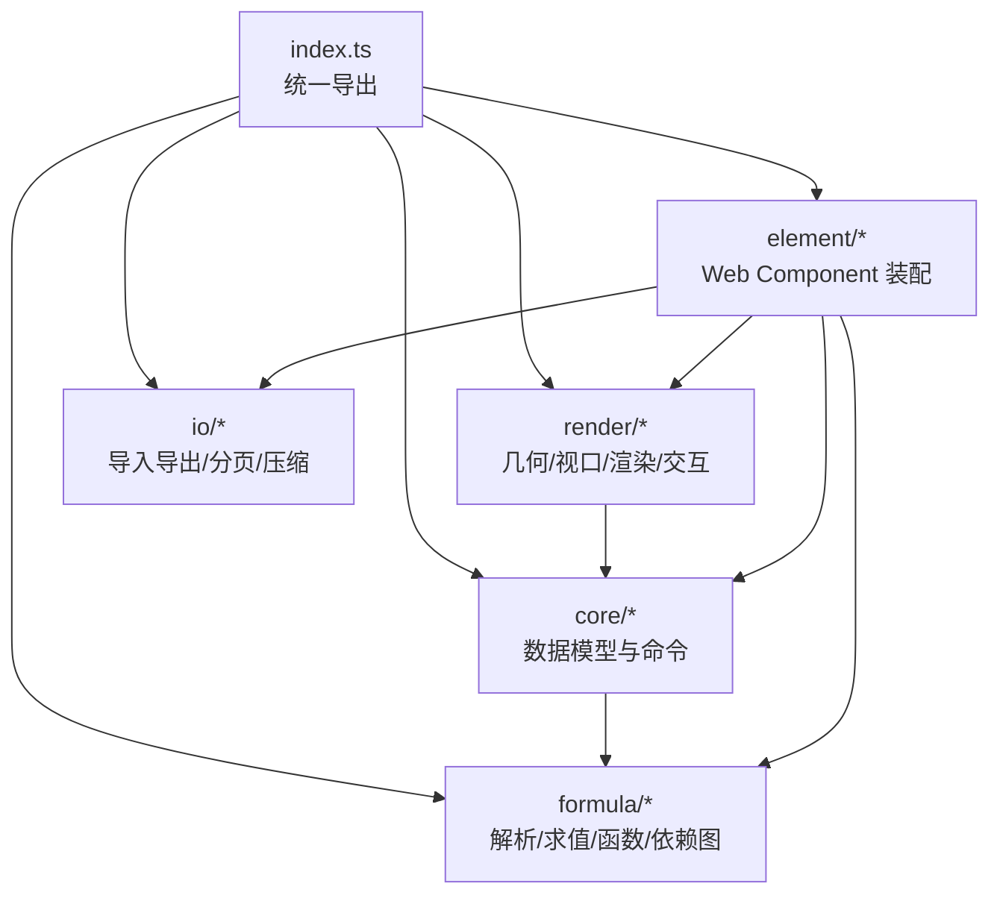
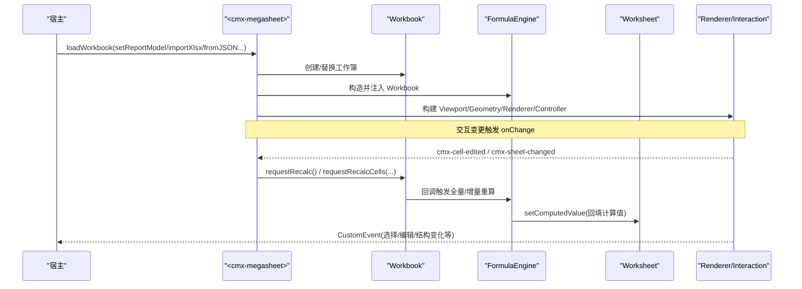
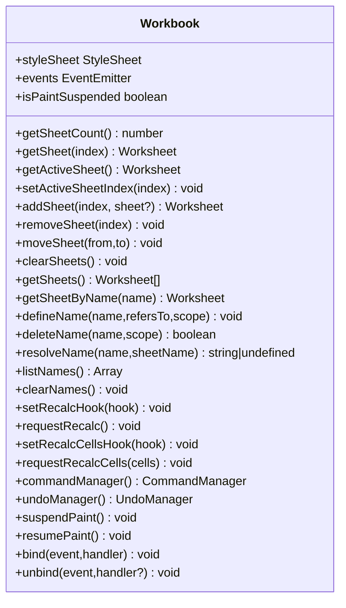
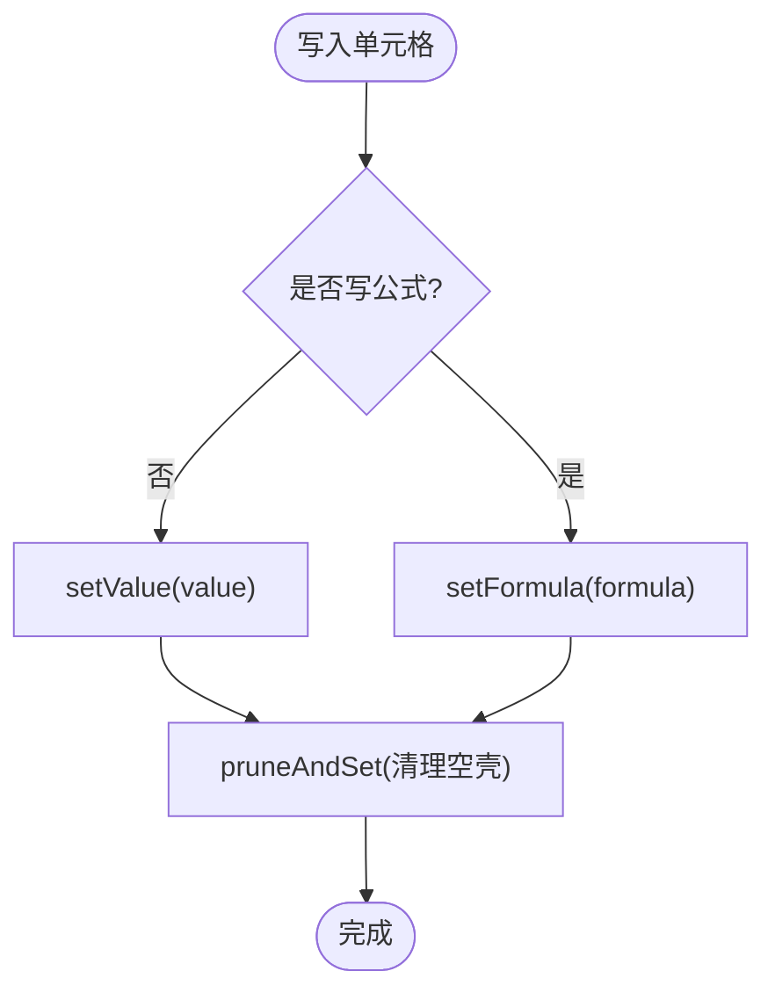
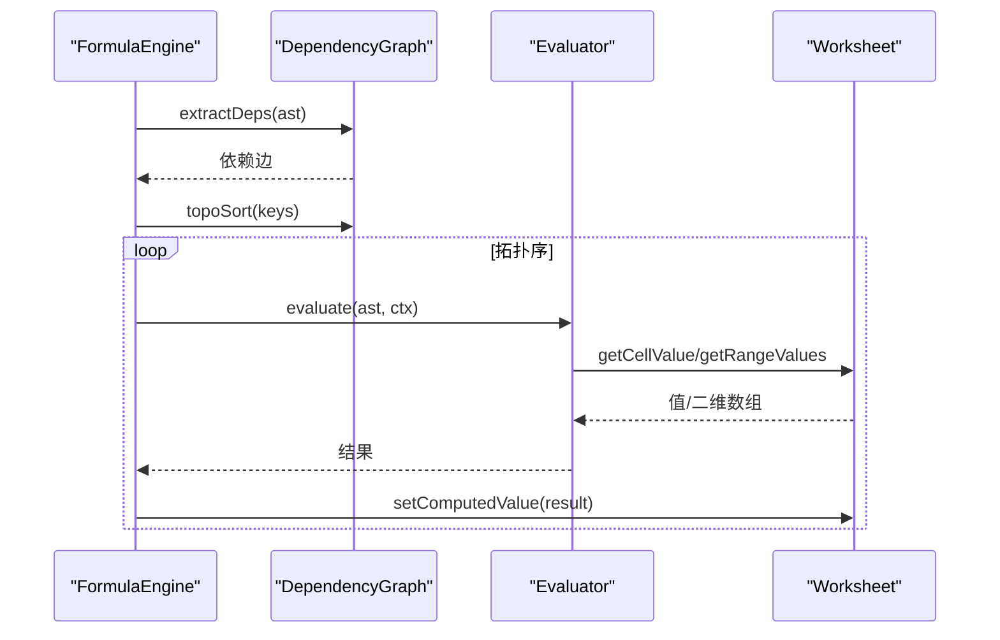
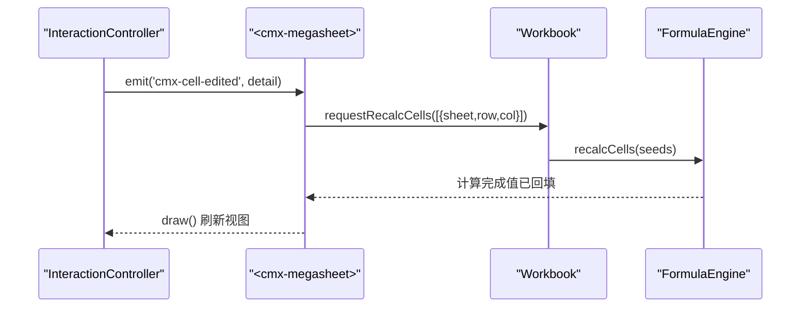
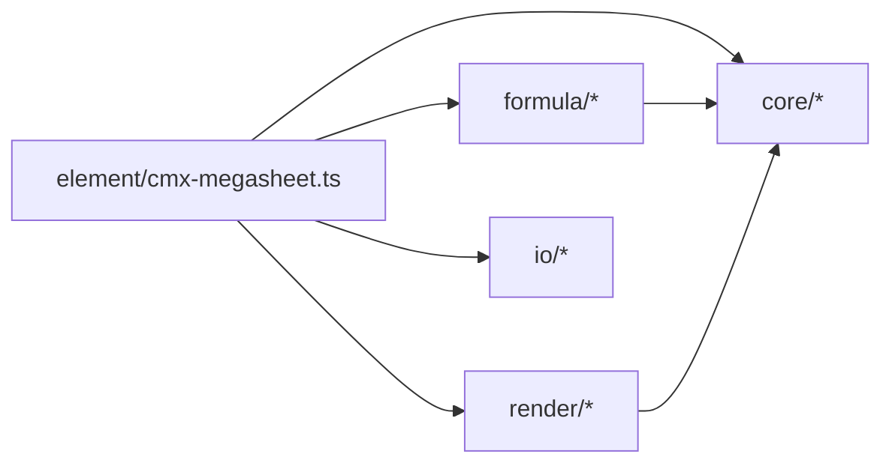

# API 参考文档

<cite>
**本文引用的文件**
- [index.ts](file://cmx-mega-sheet/src/index.ts)
- [Workbook.ts](file://cmx-mega-sheet/src/core/Workbook.ts)
- [Worksheet.ts](file://cmx-mega-sheet/src/core/Worksheet.ts)
- [Cell.ts](file://cmx-mega-sheet/src/core/Cell.ts)
- [Range.ts](file://cmx-mega-sheet/src/core/Range.ts)
- [EventEmitter.ts](file://cmx-mega-sheet/src/core/EventEmitter.ts)
- [EditCommands.ts](file://cmx-mega-sheet/src/core/EditCommands.ts)
- [Evaluator.ts](file://cmx-mega-sheet/src/formula/Evaluator.ts)
- [FormulaEngine.ts](file://cmx-mega-sheet/src/formula/FormulaEngine.ts)
- [functions.ts](file://cmx-mega-sheet/src/formula/functions.ts)
- [cmx-megasheet.ts](file://cmx-mega-sheet/src/element/cmx-megasheet.ts)
- [package.json](file://cmx-mega-sheet/package.json)
</cite>

## 目录
1. [简介](#简介)
2. [项目结构](#项目结构)
3. [核心组件](#核心组件)
4. [架构总览](#架构总览)
5. [详细组件分析](#详细组件分析)
6. [依赖关系分析](#依赖关系分析)
7. [性能与扩展性](#性能与扩展性)
8. [故障排查指南](#故障排查指南)
9. [结论](#结论)
10. [附录：类型、事件与迁移](#附录类型事件与迁移)

## 简介
本参考文档面向 cmx-mega-sheet 电子表格引擎，覆盖主入口导出、工作簿与工作表 API、单元格与范围操作、公式计算、事件系统、插件与扩展点、版本兼容与迁移建议。文档以 TypeScript 类型和 JSDoc 风格说明为主，并附带流程图与时序图帮助理解数据流与控制流。

## 项目结构
- 公共出口集中在 index.ts，按模块分层导出 core / render / formula / io / element。
- core 提供无渲染的数据模型（Workbook、Worksheet、Cell、Range、Style、SelectionModel、EditCommands、Clipboard、Find、Sort、Validation）。
- formula 提供解析器、求值器、函数注册表、依赖图与增量重算。
- element 提供 Web Component <cmx-megasheet>，封装装配、交互、渲染与主题。
- io 提供快照、XLSX、CSV、PDF/HTML 导出等。

图表来源
- [index.ts:8-298](file://cmx-mega-sheet/src/index.ts#L8-L298)

章节来源
- [index.ts:8-298](file://cmx-mega-sheet/src/index.ts#L8-L298)

## 核心组件
- 工作簿 Workbook：工作表集合、活动表切换、命名区域、撤销/命令管理、重算钩子、绘制抑制。
- 工作表 Worksheet：单元格值/公式/样式/富文本、合并区、行列结构与可见性、大纲分组、筛选、验证、超链接、条件格式、批注、浮动对象、迷你图、页面设置、保护。
- 单元格 Cell：值、公式、样式、富文本及工具函数。
- 范围 Range：矩形区域代数（包含、相交、并集、遍历）。
- 事件 EventEmitter：类型化事件总线，绑定/解绑/派发。
- 编辑命令 EditCommands：可撤销的单元格/样式/结构/填充/粘贴/排序/去重/分列/合并等操作。
- 公式引擎 FormulaEngine：全量/增量重算、依赖图、上下文敏感函数、报表取数映射。
- 自定义元素 CmxMegasheet：装配 Workbook/FormulaEngine/Viewport/SheetGeometry/Renderer/InteractionController，暴露宿主 API。

章节来源
- [Workbook.ts:174-397](file://cmx-mega-sheet/src/core/Workbook.ts#L174-L397)
- [Worksheet.ts:435-800](file://cmx-mega-sheet/src/core/Worksheet.ts#L435-L800)
- [Cell.ts:14-74](file://cmx-mega-sheet/src/core/Cell.ts#L14-L74)
- [Range.ts:16-166](file://cmx-mega-sheet/src/core/Range.ts#L16-L166)
- [EventEmitter.ts:11-60](file://cmx-mega-sheet/src/core/EventEmitter.ts#L11-L60)
- [EditCommands.ts:1-200](file://cmx-mega-sheet/src/core/EditCommands.ts#L1-L200)
- [FormulaEngine.ts:36-289](file://cmx-mega-sheet/src/formula/FormulaEngine.ts#L36-L289)
- [cmx-megasheet.ts:197-800](file://cmx-mega-sheet/src/element/cmx-megasheet.ts#L197-L800)

## 架构总览
下图展示从宿主到数据层与公式层的调用链，以及渲染与交互的闭环。

图表来源
- [cmx-megasheet.ts:238-384](file://cmx-mega-sheet/src/element/cmx-megasheet.ts#L238-L384)
- [FormulaEngine.ts:47-67](file://cmx-mega-sheet/src/formula/FormulaEngine.ts#L47-L67)
- [Workbook.ts:231-261](file://cmx-mega-sheet/src/core/Workbook.ts#L231-L261)

## 详细组件分析

### 工作簿 Workbook
- 构造函数参数
  - opts.sheetCount：初始工作表数量（默认 1）。
- 关键能力
  - 工作表集合：getSheetCount/getSheet/getActiveSheet/setActiveSheetIndex/addSheet/appendSheet/removeSheet/moveSheet/clearSheets/getSheets/getSheetByName。
  - 命名区域：defineName/deleteName/resolveName/listNames/clearNames。
  - 重算钩子：setRecalcHook/requestRecalc；增量重算：setRecalcCellsHook/requestRecalcCells。
  - 撤销/命令：undoManager()/commandManager()。
  - 绘制抑制：suspendPaint/resumePaint/isPaintSuspended。
  - 事件：bind/unbind（ActiveSheetChanged、SheetAdded、SheetRemoved）。

图表来源
- [Workbook.ts:174-397](file://cmx-mega-sheet/src/core/Workbook.ts#L174-L397)

章节来源
- [Workbook.ts:174-397](file://cmx-mega-sheet/src/core/Workbook.ts#L174-L397)

### 工作表 Worksheet
- 构造与基础
  - 名称 name(name?)。
  - 行列数 getRowCount/setRowCount/getColumnCount/setColumnCount。
  - 行高/列宽/可见性：getRowHeight/setRowHeight/getColumnWidth/setColumnWidth/isRowVisible/setRowVisible/isColumnVisible/setColumnVisible。
- 单元格读写
  - getValue/setValue/getFormula/setFormula/getStyle/setStyle/getResolvedStyle。
  - 富文本：getRichText/setRichText。
  - 计算值回填：setComputedValue。
  - 链式句柄：getCell(row,col).value/formula/style；getRange(r,c,h,w)。
- 合并区
  - addSpan/removeSpan/getSpan/getSpans；expandRangeToSpans。
- 大纲分组
  - rowOutlines/columnOutlines.group/ungroup/setCollapsed/collapseToLevel/expandAll/hiddenIndices；applyOutlineVisibility。
- 自动筛选
  - autoFilter: AutoFilterState；applyFilterVisibility。
- 数据验证/超链接/条件格式/批注/浮动对象/迷你图/页面设置/保护
  - _validations/_hyperlinks/_conditionalRules/_comments/_floatingObjects/_sparklines/pageSetup/protection 及其查询/设置方法。
- 选区与活动格
  - selections/activeRow/activeCol 由交互层维护，对外通过 Worksheet 暴露读取接口（见导出类型）。

图表来源
- [Worksheet.ts:530-621](file://cmx-mega-sheet/src/core/Worksheet.ts#L530-L621)

章节来源
- [Worksheet.ts:435-800](file://cmx-mega-sheet/src/core/Worksheet.ts#L435-L800)

### 单元格与范围
- 单元格 Cell
  - 值类型 CellValue；富文本 RichText/RichRun；工具 toCellValue/richToPlain/normalizeFormula/sanitizeImportedFormula。
- 范围 Range
  - 不可变矩形区域，支持 fromA1/toA1、contains/intersects/boundingUnion、forEachCell/cells 迭代。

章节来源
- [Cell.ts:14-74](file://cmx-mega-sheet/src/core/Cell.ts#L14-L74)
- [Range.ts:16-166](file://cmx-mega-sheet/src/core/Range.ts#L16-L166)

### 公式引擎与计算
- 解析与求值
  - Parser 生成 AST；Evaluator 执行表达式（标量/区域/数组/函数调用）；BuiltinRegistry 内置函数。
- 依赖图与重算
  - DependencyGraph 提取依赖；FormulaEngine 全量 recalcAll 与增量 recalcCells；环检测标记 #CIRC!。
- 上下文敏感函数
  - EvalContext 提供当前格坐标与 sheetName；QM/QC/JE/FS/REF 通过 ReportValueMap 取值。
- 直接求值
  - evaluateFormula(sheetName, formula, row, col) 不落格求值。

图表来源
- [FormulaEngine.ts:145-198](file://cmx-mega-sheet/src/formula/FormulaEngine.ts#L145-L198)
- [Evaluator.ts:59-158](file://cmx-mega-sheet/src/formula/Evaluator.ts#L59-L158)

章节来源
- [FormulaEngine.ts:36-289](file://cmx-mega-sheet/src/formula/FormulaEngine.ts#L36-L289)
- [Evaluator.ts:21-199](file://cmx-mega-sheet/src/formula/Evaluator.ts#L21-L199)
- [functions.ts:63-200](file://cmx-mega-sheet/src/formula/functions.ts#L63-L200)

### 事件系统与宿主集成
- 工作簿事件：ActiveSheetChanged、SheetAdded、SheetRemoved。
- 自定义元素事件：cmx-cell-edited、cmx-sheet-changed、cmx-structural-changed（插删行列时携带 StructuralEditMeta）。
- 事件总线：EventEmitter 提供 bind/unbind/emit/hasListeners。

图表来源
- [cmx-megasheet.ts:354-384](file://cmx-mega-sheet/src/element/cmx-megasheet.ts#L354-L384)
- [Workbook.ts:231-261](file://cmx-mega-sheet/src/core/Workbook.ts#L231-L261)
- [FormulaEngine.ts:200-243](file://cmx-mega-sheet/src/formula/FormulaEngine.ts#L200-L243)

章节来源
- [EventEmitter.ts:11-60](file://cmx-mega-sheet/src/core/EventEmitter.ts#L11-L60)
- [Workbook.ts:360-373](file://cmx-mega-sheet/src/core/Workbook.ts#L360-L373)
- [cmx-megasheet.ts:566-590](file://cmx-mega-sheet/src/element/cmx-megasheet.ts#L566-L590)

### 插件接口与扩展点
- 自定义函数扩展
  - 通过 BuiltinRegistry 注册新函数名与实现 FunctionImpl；可通过 isVolatile 声明易失函数。
  - 使用 Evaluator 提供的 flattenArg/flattenArgs/scalarArg/firstError 等工具处理参数。
- 报表取数扩展
  - ReportValueMap 注入键值对，配合 registerReportFetchFunctions 将 QM/QC/JE/FS/REF 等函数接入外部数据源。
- 命令扩展
  - 通过 CommandManager.register 注册命名命令，支持 canUndo/undo 实现可撤销命令；或通过 EditCommands 中的 runUndoableCommand 包裹任意 mutator。
- 结构编辑事件
  - 插删行列命令携带 StructuralEditMeta，元素层派发 cmx-structural-changed，供消费方同步地址映射。

章节来源
- [functions.ts:1-200](file://cmx-mega-sheet/src/formula/functions.ts#L1-L200)
- [FormulaEngine.ts:36-67](file://cmx-mega-sheet/src/formula/FormulaEngine.ts#L36-L67)
- [EditCommands.ts:105-200](file://cmx-mega-sheet/src/core/EditCommands.ts#L105-L200)
- [Workbook.ts:125-172](file://cmx-mega-sheet/src/core/Workbook.ts#L125-L172)
- [cmx-megasheet.ts:576-590](file://cmx-mega-sheet/src/element/cmx-megasheet.ts#L576-L590)

### 自定义元素 <cmx-megasheet> 公共 API
- 初始化与装配
  - connectedCallback 中创建 Workbook/FormulaEngine，构建视图（AxisMetrics/Viewport/SheetGeometry/Renderer/InteractionController），设置主题与公式栏。
- 数据加载
  - loadWorkbook(fill)、importSSJSON、fromSnapshot/fromJSON、importXlsx/exportXlsx、exportCsv/importCsv。
- 报表模型
  - setReportModel(getReportModel) 按 ReportModel 铺格、样式、合并与取数占位。
- 滚动与视口
  - scrollToPixel、getScrollTop/Left、getScrollbarState。
- 工作表控制
  - getActiveSheetObject、getActiveSheetIndex、setActiveSheet。
- 导出与快照
  - toSnapshot、toJSON、fromSnapshot、fromJSON。
- 主题与公式栏
  - setTheme、showFormulaBar（内部通过属性 data-theme/data-formula-bar 控制）。

章节来源
- [cmx-megasheet.ts:197-800](file://cmx-mega-sheet/src/element/cmx-megasheet.ts#L197-L800)

## 依赖关系分析
- 模块耦合
  - element 依赖 core（Workbook/Worksheet/Range/Style）、formula（FormulaEngine）、render（Viewport/Geometry/Renderer/InteractionController）、io（导入导出）。
  - formula 依赖 core（address/dateSerial/Cell 类型）与 render（numFmt 格式化）。
  - core 之间低耦合：Worksheet 依赖 SparseMatrix/Range/Style/Cell/address；Workbook 依赖 Worksheet/EventEmitter/Style。
- 外部依赖
  - 浏览器环境：CanvasRenderingContext2D、ResizeObserver、IntersectionObserver、requestAnimationFrame。
  - Node/测试：纯逻辑模块可在无 DOM 环境运行（如 jsdom 或 Node）。

图表来源
- [cmx-megasheet.ts:16-85](file://cmx-mega-sheet/src/element/cmx-megasheet.ts#L16-L85)
- [FormulaEngine.ts:15-28](file://cmx-mega-sheet/src/formula/FormulaEngine.ts#L15-L28)

章节来源
- [cmx-megasheet.ts:16-85](file://cmx-mega-sheet/src/element/cmx-megasheet.ts#L16-L85)
- [FormulaEngine.ts:15-28](file://cmx-mega-sheet/src/formula/FormulaEngine.ts#L15-L28)

## 性能与扩展性
- 增量重算
  - 首次 recalcAll 建立依赖图后，recalcCells 仅重算受影响闭包，显著降低大表编辑成本。
- 稀疏存储
  - Worksheet 使用 SparseMatrix 存储单元格，避免密集矩阵内存浪费。
- 视口与渲染
  - Viewport/SheetGeometry 仅渲染可视区域；rAF 节流绘制；HiDPI 自适应。
- 结构编辑优化
  - 插删行列时调整公式引用（adjustForStructural），保证跨表引用一致性。
- 可扩展性
  - 自定义函数、报表取数、命令均可在不改动核心逻辑的前提下扩展。

[本节为通用性能讨论，不直接分析具体文件]

## 故障排查指南
- 公式错误
  - #NAME?：未找到函数或命名区域；检查 BuiltinRegistry 与 resolveNameRef。
  - #DIV/0!：除零；检查公式逻辑。
  - #NUM!：数值溢出或非法参数；检查幂次/开根等。
  - #VALUE!：类型不匹配或函数抛错；检查参数类型。
  - #CIRC!：循环依赖；检查依赖图环。
- 重算未生效
  - 确认 workbook.requestRecalc() 或 requestRecalcCells() 被调用；确认 FormulaEngine 已注入 Workbook。
- 结构编辑后引用错位
  - 确保使用 EditCommands 中的 insertRowsCommand/deleteColumnsCommand 等命令，以便 adjustForStructural 重写公式。
- 渲染异常
  - 检查 Canvas 上下文是否存在；在 jsdom 环境下跳过文本度量；确保 ResizeObserver/IntersectionObserver 可用。

章节来源
- [FormulaEngine.ts:259-289](file://cmx-mega-sheet/src/formula/FormulaEngine.ts#L259-L289)
- [Evaluator.ts:116-158](file://cmx-mega-sheet/src/formula/Evaluator.ts#L116-L158)
- [EditCommands.ts:54-83](file://cmx-mega-sheet/src/core/EditCommands.ts#L54-L83)

## 结论
cmx-mega-sheet 提供了完整的电子表格引擎能力：清晰的数据模型、强大的公式计算、可撤销的命令体系、灵活的扩展点与完善的导入导出。通过 <cmx-megasheet> 自定义元素，宿主可以以最小代价集成高性能、可扩展的电子表格能力。建议在大规模数据场景优先采用增量重算与稀疏存储策略，并通过自定义函数与报表取数机制对接业务数据源。

[本节为总结，不直接分析具体文件]

## 附录：类型、事件与迁移

### 版本与兼容性
- 版本号：7.5.2（导出常量 VERSION）。
- 包元信息：name @cmx/megasheet，类型定义 dist/index.d.ts，ESM 入口 dist/index.js。

章节来源
- [index.ts:296-298](file://cmx-mega-sheet/src/index.ts#L296-L298)
- [package.json:1-31](file://cmx-mega-sheet/package.json#L1-L31)

### 主要类型速览
- 单元格：CellValue、CellData、RichText、RichRun。
- 工作表：Span、AutoFilterState、DataValidation、Hyperlink、ConditionalRule、CellComment、ChartSpec、Sparkline、FloatingObject、PageSetup、SheetProtection。
- 范围：RangeCoord、Range。
- 事件：EventHandler、WorkbookEventMap。
- 命令：UndoableAction、Command、StructuralEditMeta。
- 公式：FormulaValue、FormulaError、EvaluatedArg、FunctionImpl、EvalContext、CellAccessor。

章节来源
- [Cell.ts:14-36](file://cmx-mega-sheet/src/core/Cell.ts#L14-L36)
- [Worksheet.ts:29-227](file://cmx-mega-sheet/src/core/Worksheet.ts#L29-L227)
- [Range.ts:10-15](file://cmx-mega-sheet/src/core/Range.ts#L10-L15)
- [EventEmitter.ts:11-15](file://cmx-mega-sheet/src/core/EventEmitter.ts#L11-L15)
- [Workbook.ts:18-51](file://cmx-mega-sheet/src/core/Workbook.ts#L18-L51)
- [Evaluator.ts:21-55](file://cmx-mega-sheet/src/formula/Evaluator.ts#L21-L55)

### 事件清单
- 工作簿：ActiveSheetChanged、SheetAdded、SheetRemoved。
- 元素：cmx-cell-edited、cmx-sheet-changed、cmx-structural-changed。

章节来源
- [Workbook.ts:18-23](file://cmx-mega-sheet/src/core/Workbook.ts#L18-L23)
- [cmx-megasheet.ts:566-590](file://cmx-mega-sheet/src/element/cmx-megasheet.ts#L566-L590)

### 废弃 API 与迁移建议
- 旧内核 SSJSON 迁移
  - 使用 importSSJSON 整体替换工作簿，随后重建视图与页签。
- XLSX 导入导出
  - 使用 importXlsx/exportXlsx；冻结窗格随快照恢复。
- 命令迁移
  - 所有编辑走 EditCommands 工厂函数，确保撤销栈一致性与结构编辑后的公式引用修正。
- 公式前缀清洗
  - 导入公式经 sanitizeImportedFormula 去除 Excel 伪前缀，避免 #NAME?。

章节来源
- [cmx-megasheet.ts:707-708](file://cmx-mega-sheet/src/element/cmx-megasheet.ts#L707-L708)
- [cmx-megasheet.ts:701-705](file://cmx-mega-sheet/src/element/cmx-megasheet.ts#L701-L705)
- [EditCommands.ts:54-83](file://cmx-mega-sheet/src/core/EditCommands.ts#L54-L83)
- [Cell.ts:57-74](file://cmx-mega-sheet/src/core/Cell.ts#L57-L74)