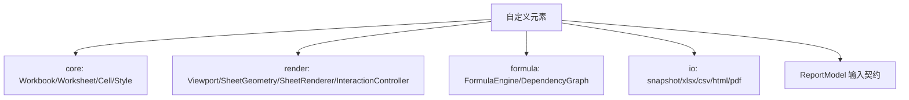
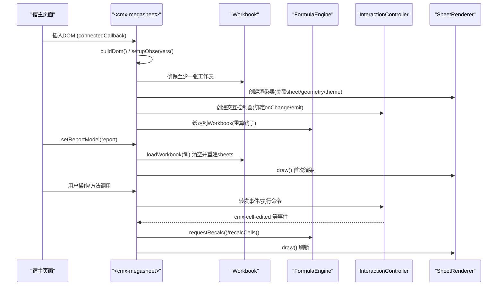
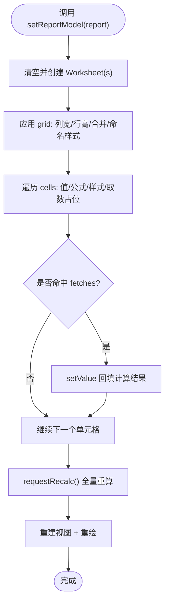
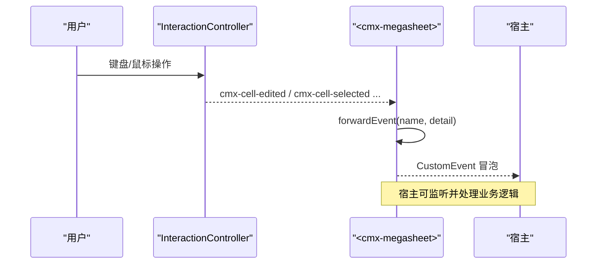
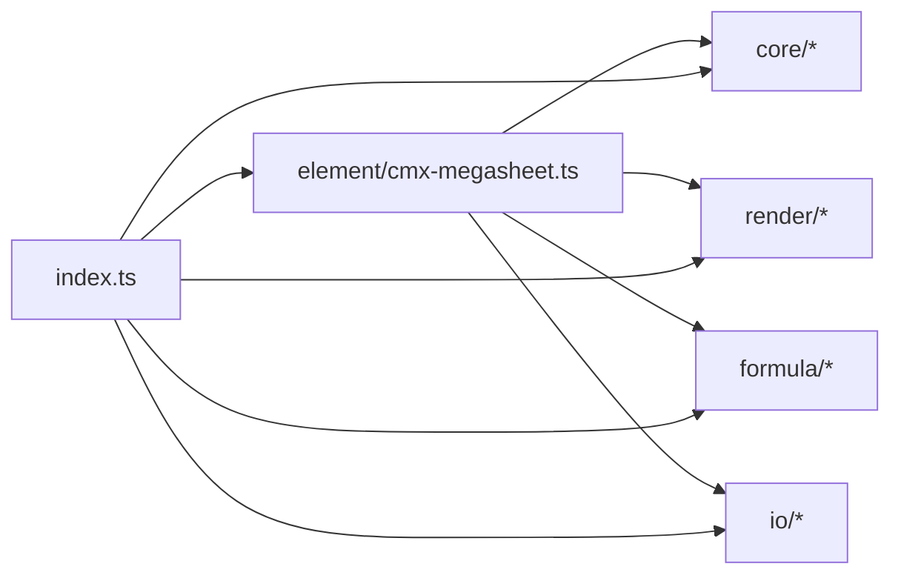

# Web Components API

<cite>
**本文引用的文件**
- [cmx-megasheet.ts](file://cmx-mega-sheet/src/element/cmx-megasheet.ts)
- [ReportModel.ts](file://cmx-mega-sheet/src/element/ReportModel.ts)
- [index.ts](file://cmx-mega-sheet/src/index.ts)
- [README.md](file://cmx-mega-sheet/README.md)
</cite>

## 目录
1. [简介](#简介)
2. [项目结构](#项目结构)
3. [核心组件](#核心组件)
4. [架构总览](#架构总览)
5. [详细组件分析](#详细组件分析)
6. [依赖关系分析](#依赖关系分析)
7. [性能与内存管理](#性能与内存管理)
8. [故障排查指南](#故障排查指南)
9. [结论](#结论)
10. [附录：集成示例与最佳实践](#附录集成示例与最佳实践)

## 简介
本文件面向 <cmx-megasheet> 自定义元素及其数据契约 ReportModel，系统性说明其属性配置、事件系统、生命周期管理、数据绑定机制、表单集成方式、样式定制、组合模式，以及与主流框架的集成要点。该组件是一个自研、零运行时依赖的电子表格引擎，以 Web Component 形式提供“公式栏 + 画布 + 页签栏 + 主题”的完整界面，并通过稳定的公共方法集暴露能力，便于宿主（如设计器或报表应用）进行编排与控制。

## 项目结构
- element 层：<cmx-megasheet> 自定义元素实现与 ReportModel 输入契约
- core 层：工作簿/工作表/单元格/样式/选区/命令等数据模型与编辑命令
- render 层：几何、视口、渲染、交互控制器、标签条等
- formula 层：公式解析、求值、依赖图与增量重算
- io 层：快照、XLSX、CSV、HTML/PDF 导出等
- index.ts：统一导出入口，包含类型与版本信息

图表来源
- [cmx-megasheet.ts:1-86](file://cmx-mega-sheet/src/element/cmx-megasheet.ts#L1-L86)
- [index.ts:8-298](file://cmx-mega-sheet/src/index.ts#L8-L298)

章节来源
- [README.md:98-120](file://cmx-mega-sheet/README.md#L98-L120)
- [index.ts:1-298](file://cmx-mega-sheet/src/index.ts#L1-L298)

## 核心组件
- <cmx-megasheet>：Web Component，封装工作簿、视图、交互、主题与 UI chrome（公式栏、页签栏），对外暴露约百余个方法用于数据装载、编辑、样式、窗格、验证、浮动对象、导出打印等。
- ReportModel：描述报表定义的输入契约，包括网格尺寸、列宽行高、合并区域、命名样式类、单元格定义（值/公式/样式/取数键）、取数值映射等。

章节来源
- [cmx-megasheet.ts:197-251](file://cmx-mega-sheet/src/element/cmx-megasheet.ts#L197-L251)
- [ReportModel.ts:1-62](file://cmx-mega-sheet/src/element/ReportModel.ts#L1-L62)

## 架构总览
<cmx-megasheet> 在 connectedCallback 中构建 Shadow DOM、初始化内核对象（Workbook、FormulaEngine）、装配当前活动工作表的视图（AxisMetrics、Viewport、SheetGeometry、SheetRenderer、InteractionController、SheetTabStrip），并设置主题与可见性。disconnectedCallback 中释放资源（动画帧、交互控制器、公式引擎、观察者）。

图表来源
- [cmx-megasheet.ts:238-251](file://cmx-mega-sheet/src/element/cmx-megasheet.ts#L238-L251)
- [cmx-megasheet.ts:341-384](file://cmx-mega-sheet/src/element/cmx-megasheet.ts#L341-L384)
- [cmx-megasheet.ts:639-661](file://cmx-mega-sheet/src/element/cmx-megasheet.ts#L639-L661)
- [cmx-megasheet.ts:746-770](file://cmx-mega-sheet/src/element/cmx-megasheet.ts#L746-L770)

## 详细组件分析

### <cmx-megasheet> 自定义元素
- 生命周期
  - connectedCallback：构建 Shadow DOM、默认空表、装配视图、设置主题、显示公式栏、注册 ResizeObserver/IntersectionObserver。
  - disconnectedCallback：取消 rAF、释放 InteractionController、FormulaEngine、断开观察器。
- 主题与可见性
  - setTheme('light'|'dark'|'auto')：支持跟随 prefers-color-scheme；自动切换 renderer 主题并重绘。
  - showFormulaBar(on)、showTabs(on)：控制公式栏与页签栏显隐。
- 数据装载与替换
  - loadWorkbook(fill)：回调式填充工作簿，完成后重建视图并触发全量重算。
  - setReportModel(report)：按 ReportModel 清空并重建 sheets，铺格、样式、合并、取数占位。
  - setWorkbookJson(json)/getWorkbookJson()：中性快照 JSON 往返，恢复冻结/尾冻结/拆分等视口态。
  - importXlsx/exportXlsx、importCsv/exportCsv、exportHtml/exportPdf/print：IO 能力。
- 编辑与撤销
  - undo/redo/undoSteps/redoSteps：基于命令模式的撤销栈。
  - runUndoable(fn, label)：将任意 sheet 变更包成可撤销命令。
  - applySelectionStyle/applySelectionBorder/applySelectionFill：对选区批量样式/边框/填充。
  - merge/unmergeSelection、clearSelection、insert/deleteRows/Columns、group/ungroup、setOutlineLevel、expandAll 等。
- 窗格与滚动
  - freezePanes/unfreezePanes、freezeTrailing/unfreezeTrailing、splitPanes/removeSplit、scrollToPixel、showCell、zoom/getZoom。
- 查找/排序/筛选
  - find/findAndSelect、replaceAll、sortRange、setAutoFilter/applyFilter/clearFilter、showFindBox。
- 类型/验证/富文本/条件格式
  - setDataValidation/getDataValidation/clearDataValidation、setCheckbox、setHyperlink/getHyperlink、setRichText/getRichText、addConditionalRule/list/remove/clear。
- 浮动对象与迷你图
  - insertImage/insertChart/insertShape/addComment/removeFloatingObject/listFloatingObjects、setSparkline/getSparkline/clearSparkline。
- 保护与锁定
  - protectSheet/unprotectSheet/isSheetProtected、setCellsLocked、canEditCell。
- 事件系统
  - 通过 forwardEvent 派发 CustomEvent（bubbles + composed），包括 cmx-cell-selected、cmx-cell-edited、cmx-sheet-changed、cmx-col-resized、cmx-row-resized、cmx-edit-rejected、cmx-hyperlink、cmx-structural-changed 等。
- 几何直通
  - getCellRect、getViewportTopRow/BottomRow/LeftColumn/RightColumn、hitTestPoint、showCell、zoom。

```mermaid
classDiagram
class CmxMegasheet {
+loadWorkbook(fill)
+setReportModel(report)
+setWorkbookJson(json)
+getWorkbookJson()
+exportXlsx()
+importXlsx(bytes)
+exportCsv(opts)
+importCsv(text, opts)
+exportHtml(opts)
+exportPdf()
+print()
+setTheme(mode)
+showFormulaBar(on)
+showTabs(on)
+setEditable(editable)
+isEditable()
+freezePanes(rows, cols)
+unfreezePanes()
+freezeTrailing(rows, cols)
+unfreezeTrailing()
+splitPanes(row, col)
+removeSplit()
+setZoom(z)
+getZoom()
+setSelection(row, col, rowCount, colCount)
+applySelectionStyle(patch)
+applySelectionBorder(kind, color, lineStyle)
+applySelectionFill(fill)
+pasteSpecial(options)
+copySelection()
+mergeSelection()
+unmergeSelection()
+clearSelection(mode)
+insertRows(count)
+deleteRows(count)
+insertColumns(count)
+deleteColumns(count)
+undo()
+redo()
+undoSteps(count)
+redoSteps(count)
+find(query, opts)
+findAndSelect(query, index, opts)
+replaceAll(search, replace, opts)
+sortRange(range, keys, hasHeader)
+setAutoFilter(range)
+applyFilter(col, criterion)
+clearFilter()
+setDataValidation(rule)
+getDataValidation(row, col)
+clearDataValidation(range)
+setCheckbox(range, on)
+setHyperlink(row, col, link)
+getHyperlink(row, col)
+setRichText(row, col, rich)
+getRichText(row, col)
+addConditionalRule(rule)
+removeConditionalRule(index)
+listConditionalRules()
+clearConditionalRules()
+insertImage(anchor, src, id)
+insertChart(anchor, chart, id)
+insertShape(anchor, shape, id)
+addComment(row, col, comment)
+getComment(row, col)
+removeFloatingObject(id)
+listFloatingObjects()
+setSparkline(row, col, spec)
+getSparkline(row, col)
+clearSparkline(row, col)
+protectSheet(opts)
+unprotectSheet()
+isSheetProtected()
+setCellsLocked(locked)
+canEditCell(row, col)
+defineName(name, refersTo, scope)
+getName(name)
+deleteName(name, scope)
+listNames()
+groupRows(start, count)
+groupColumns(start, count)
+ungroupRows(index)
+ungroupColumns(index)
+collapseGroup(axis, groupIndex, collapsed)
+setOutlineLevel(axis, level)
+expandAll(axis)
+setSummaryBelow(below)
+setSummaryRight(right)
+refreshOutlines()
+getCellRect(row, col, rowCount, colCount)
+getViewportTopRow()
+getViewportBottomRow()
+getViewportLeftColumn()
+getViewportRightColumn()
+showCell(row, col, align)
+hitTestPoint(x, y)
+evaluateFormula(formula, row, col)
+setReportValueMap(map)
+getReportValueMap()
+recalc()
+recalcCells(cells)
+runUndoable(fn, label)
+readSelection()
+getActiveAddr()
+getSelectionState()
+refresh()
}
```

图表来源
- [cmx-megasheet.ts:596-1934](file://cmx-mega-sheet/src/element/cmx-megasheet.ts#L596-L1934)

章节来源
- [cmx-megasheet.ts:238-251](file://cmx-mega-sheet/src/element/cmx-megasheet.ts#L238-L251)
- [cmx-megasheet.ts:1862-1893](file://cmx-mega-sheet/src/element/cmx-megasheet.ts#L1862-L1893)
- [cmx-megasheet.ts:639-709](file://cmx-mega-sheet/src/element/cmx-megasheet.ts#L639-L709)
- [cmx-megasheet.ts:746-817](file://cmx-mega-sheet/src/element/cmx-megasheet.ts#L746-L817)
- [cmx-megasheet.ts:856-905](file://cmx-mega-sheet/src/element/cmx-megasheet.ts#L856-L905)
- [cmx-megasheet.ts:1028-1084](file://cmx-mega-sheet/src/element/cmx-megasheet.ts#L1028-L1084)
- [cmx-megasheet.ts:1171-1226](file://cmx-mega-sheet/src/element/cmx-megasheet.ts#L1171-L1226)
- [cmx-megasheet.ts:1339-1434](file://cmx-mega-sheet/src/element/cmx-megasheet.ts#L1339-L1434)
- [cmx-megasheet.ts:1499-1522](file://cmx-mega-sheet/src/element/cmx-megasheet.ts#L1499-L1522)
- [cmx-megasheet.ts:1524-1577](file://cmx-mega-sheet/src/element/cmx-megasheet.ts#L1524-L1577)
- [cmx-megasheet.ts:1617-1649](file://cmx-mega-sheet/src/element/cmx-megasheet.ts#L1617-L1649)
- [cmx-megasheet.ts:1651-1667](file://cmx-mega-sheet/src/element/cmx-megasheet.ts#L1651-L1667)
- [cmx-megasheet.ts:1690-1730](file://cmx-mega-sheet/src/element/cmx-megasheet.ts#L1690-L1730)
- [cmx-megasheet.ts:1732-1796](file://cmx-mega-sheet/src/element/cmx-megasheet.ts#L1732-L1796)
- [cmx-megasheet.ts:1798-1850](file://cmx-mega-sheet/src/element/cmx-megasheet.ts#L1798-L1850)
- [cmx-megasheet.ts:1851-1934](file://cmx-mega-sheet/src/element/cmx-megasheet.ts#L1851-L1934)

### ReportModel 数据绑定机制
- 作用：作为 setReportModel 的入参契约，描述报表布局与内容，使 megasheet 能清空并重建 sheets，铺格、样式、合并、取数占位。
- 关键结构
  - GridModel：行列数、列宽（列字母→px）、行高（1-based 行号→px）、合并区列表（A1:C1 字符串）、命名样式表。
  - CellModel：value/formula/style/styleName/fetchKey/type。
  - SheetModel：id/name/grid/cells。
  - ReportModel：meta/moduleMeta/sheets（或顶层 grid/cells）、fetches（取数值表）。
- 绑定流程
  - setReportModel → loadWorkbook(fill) → 清空 sheets → 为每个 SheetModel 创建 Worksheet → applySheetModel 铺 grid/cells → 设置活动表 → 请求重算 → 重建视图并重绘。
  - applySheetModel 内部：列宽/行高、合并、命名样式类、单元格值/公式/样式、取数占位（fetchKey 命中 fetches 则回填值）。

图表来源
- [cmx-megasheet.ts:746-817](file://cmx-mega-sheet/src/element/cmx-megasheet.ts#L746-L817)
- [ReportModel.ts:15-62](file://cmx-mega-sheet/src/element/ReportModel.ts#L15-L62)

章节来源
- [ReportModel.ts:1-62](file://cmx-mega-sheet/src/element/ReportModel.ts#L1-L62)
- [cmx-megasheet.ts:746-817](file://cmx-mega-sheet/src/element/cmx-megasheet.ts#L746-L817)

### 事件系统与生命周期
- 生命周期
  - connectedCallback：构建 DOM、默认空表、装配视图、设置主题/公式栏、注册观察者。
  - disconnectedCallback：释放 rAF、控制器、引擎、观察者。
- 事件
  - 由 InteractionController 触发的 cmx-* 事件经 forwardEvent 转发（bubbles + composed），供宿主监听。
  - 结构变更事件 cmx-structural-changed：插删行列时派发，含 axis/op/index/count/sheet/seq/phase，供消费方同步地址映射。
  - 超链接事件 cmx-hyperlink：可拦截默认打开行为。
  - 编辑拒绝事件 cmx-edit-rejected：保护态下尝试编辑被拒。

图表来源
- [cmx-megasheet.ts:567-590](file://cmx-mega-sheet/src/element/cmx-megasheet.ts#L567-L590)
- [cmx-megasheet.ts:1662-1667](file://cmx-mega-sheet/src/element/cmx-megasheet.ts#L1662-L1667)

章节来源
- [cmx-megasheet.ts:238-263](file://cmx-mega-sheet/src/element/cmx-megasheet.ts#L238-L263)
- [cmx-megasheet.ts:567-590](file://cmx-mega-sheet/src/element/cmx-megasheet.ts#L567-L590)
- [cmx-megasheet.ts:1662-1667](file://cmx-mega-sheet/src/element/cmx-megasheet.ts#L1662-L1667)

### 插槽与样式定制
- 插槽：组件使用 Shadow DOM 组织内部 UI（公式栏、画布、页签栏），未暴露 slot 给宿主注入内容；宿主通过方法控制行为与外观。
- 样式定制：通过 CSS 变量（--cmx-*）与 .cmx-dark 类切换深浅色；renderer 主题随 setTheme 切换；可通过 showGridlines/showHeaders 控制网格线与头显隐。

章节来源
- [cmx-megasheet.ts:90-186](file://cmx-mega-sheet/src/element/cmx-megasheet.ts#L90-L186)
- [cmx-megasheet.ts:1851-1893](file://cmx-mega-sheet/src/element/cmx-megasheet.ts#L1851-L1893)

### 组件组合模式
- 组合方式：宿主通过 loadWorkbook/setReportModel 注入数据，通过方法驱动编辑/样式/窗格/导出等；通过事件订阅用户交互与状态变化。
- 逃生舱：getWorkbook() 暴露底层 Workbook，允许高级场景直接操作，但需配合 runUndoable 进入撤销栈。

章节来源
- [cmx-megasheet.ts:596-600](file://cmx-mega-sheet/src/element/cmx-megasheet.ts#L596-L600)
- [cmx-megasheet.ts:892-905](file://cmx-mega-sheet/src/element/cmx-megasheet.ts#L892-L905)

## 依赖关系分析
- 模块耦合
  - element 依赖 core（Workbook/Worksheet/Style/Commands）、render（Viewport/Geometry/Renderer/InteractionController）、formula（FormulaEngine）、io（snapshot/xlsx/csv/html/pdf）。
  - index.ts 聚合导出各层能力与类型，便于外部按需引入。
- 外部依赖
  - 运行时零依赖；仅依赖浏览器标准 API（Canvas 2D、Web Components、ResizeObserver、IntersectionObserver、matchMedia）。

图表来源
- [cmx-megasheet.ts:16-86](file://cmx-mega-sheet/src/element/cmx-megasheet.ts#L16-L86)
- [index.ts:8-298](file://cmx-mega-sheet/src/index.ts#L8-L298)

章节来源
- [index.ts:8-298](file://cmx-mega-sheet/src/index.ts#L8-L298)

## 性能与内存管理
- 渲染优化
  - HiDPI 适配：根据 devicePixelRatio 设置 canvas 宽高与 ctx 变换。
  - rAF 节流：draw 使用 requestAnimationFrame 避免重复绘制。
  - 增量重算：编辑单格触发 requestRecalcCells，仅重算受影响闭包。
  - 虚拟化：Viewport/AxisMetrics/SheetGeometry 负责可见范围与几何计算。
- 内存管理
  - disconnectedCallback 中释放 InteractionController、FormulaEngine、ResizeObserver、IntersectionObserver、媒体查询监听，避免泄漏。
  - 图片缓存 Map 复用加载的图片实例，减少重复网络请求。
- 建议
  - 大数据量场景优先使用 setReportModel 一次性构建，再使用 setCellValues 回填显示值，避免频繁全量重算。
  - 使用 freezePanes/freezeTrailing/splitPanes 合理划分可视区域，提升滚动体验。
  - 谨慎使用大量条件格式与浮动对象，必要时分批添加并配合 refresh。

章节来源
- [cmx-megasheet.ts:457-497](file://cmx-mega-sheet/src/element/cmx-megasheet.ts#L457-L497)
- [cmx-megasheet.ts:548-564](file://cmx-mega-sheet/src/element/cmx-megasheet.ts#L548-L564)
- [cmx-megasheet.ts:1096-1112](file://cmx-mega-sheet/src/element/cmx-megasheet.ts#L1096-L1112)
- [cmx-megasheet.ts:1579-1590](file://cmx-mega-sheet/src/element/cmx-megasheet.ts#L1579-L1590)

## 故障排查指南
- 常见现象
  - 公式不更新：确认是否通过 runUndoable 包裹修改，或调用 recalc/recalcCells。
  - 只读模式下无法编辑：检查 setEditable(false) 或工作表保护状态。
  - 超链接未打开：监听 cmx-hyperlink 事件并阻止默认行为后自行处理。
  - 结构变更后地址错位：监听 cmx-structural-changed 事件，同步地址映射。
- 调试建议
  - 使用 getSelectionState/readSelection/getActiveAddr 获取当前选择与值。
  - 使用 exportHtml/exportPdf 输出当前状态辅助定位。
  - 使用 demo 自检页与 verify 脚本在真机环境验证功能。

章节来源
- [cmx-megasheet.ts:872-879](file://cmx-mega-sheet/src/element/cmx-megasheet.ts#L872-L879)
- [cmx-megasheet.ts:1096-1112](file://cmx-mega-sheet/src/element/cmx-megasheet.ts#L1096-L1112)
- [cmx-megasheet.ts:1662-1667](file://cmx-mega-sheet/src/element/cmx-megasheet.ts#L1662-L1667)
- [cmx-megasheet.ts:576-590](file://cmx-mega-sheet/src/element/cmx-megasheet.ts#L576-L590)

## 结论
<cmx-megasheet> 提供了稳定、完整的电子表格能力，并以 Web Component 形式解耦宿主与内核。通过 ReportModel 契约与丰富的公共方法，可实现从报表建模、数据绑定、交互编辑到导出打印的全流程。其零依赖、可撤销、增量重算与完善的 IO 能力，使其在企业级场景中具备高可用性与可维护性。

## 附录：集成示例与最佳实践

### 与 React 集成
- 基本用法
  - 在 useEffect 中导入并注册 <cmx-megasheet>，创建 ref 引用元素，调用 setReportModel/loadWorkbook 初始化。
  - 使用 addEventListener 监听 cmx-* 事件，更新 React 状态。
  - 在清理函数中移除事件监听，避免内存泄漏。
- 参考路径
  - 组件方法与事件：[cmx-megasheet.ts:567-590](file://cmx-mega-sheet/src/element/cmx-megasheet.ts#L567-L590)
  - 数据装载：[cmx-megasheet.ts:639-709](file://cmx-mega-sheet/src/element/cmx-megasheet.ts#L639-L709)

### 与 Vue 集成
- 基本用法
  - 在 onMounted 中注册组件并初始化，使用 $refs 获取元素实例。
  - 通过 el.addEventListener 监听事件，使用响应式数据驱动 UI。
  - 在 onUnmounted 中移除监听，确保资源释放。
- 参考路径
  - 主题与可见性控制：[cmx-megasheet.ts:1851-1893](file://cmx-mega-sheet/src/element/cmx-megasheet.ts#L1851-L1893)
  - 窗格与滚动：[cmx-megasheet.ts:1171-1226](file://cmx-mega-sheet/src/element/cmx-megasheet.ts#L1171-L1226)

### 与 Angular 集成
- 基本用法
  - 在 ngAfterViewInit 中注册并初始化，使用 ViewChild 获取元素。
  - 通过 @HostListener 或直接 addEventListener 监听事件，结合服务层管理状态。
  - 在 ngOnDestroy 中清理监听与资源。
- 参考路径
  - 导出与打印：[cmx-megasheet.ts:1617-1649](file://cmx-mega-sheet/src/element/cmx-megasheet.ts#L1617-L1649)
  - 数据工具：[cmx-megasheet.ts:1375-1410](file://cmx-mega-sheet/src/element/cmx-megasheet.ts#L1375-L1410)

### 最佳实践
- 数据装载
  - 优先使用 setReportModel 构建模板，再用 setCellValues 回填显示值，减少重算开销。
  - 使用中性快照 JSON 持久化与恢复，保证一致性。
- 交互与事件
  - 统一通过事件总线订阅 cmx-* 事件，避免紧耦合。
  - 对结构变更（插删行列）使用 cmx-structural-changed 同步地址映射。
- 性能
  - 合理使用冻结/尾冻结/拆分，限制可视区域。
  - 批量样式/编辑操作尽量合并，减少 draw 次数。
- 安全与保护
  - 启用 protectSheet 并设置 locked，防止非法编辑；监听 cmx-edit-rejected 提示用户。

章节来源
- [cmx-megasheet.ts:746-817](file://cmx-mega-sheet/src/element/cmx-megasheet.ts#L746-L817)
- [cmx-megasheet.ts:856-905](file://cmx-mega-sheet/src/element/cmx-megasheet.ts#L856-L905)
- [cmx-megasheet.ts:977-1006](file://cmx-mega-sheet/src/element/cmx-megasheet.ts#L977-L1006)
- [cmx-megasheet.ts:1171-1226](file://cmx-mega-sheet/src/element/cmx-megasheet.ts#L1171-L1226)
- [cmx-megasheet.ts:1617-1649](file://cmx-mega-sheet/src/element/cmx-megasheet.ts#L1617-L1649)