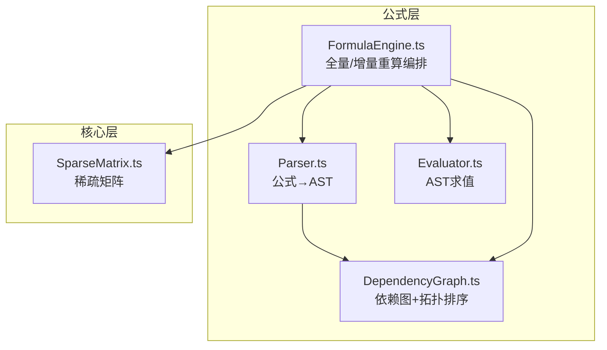
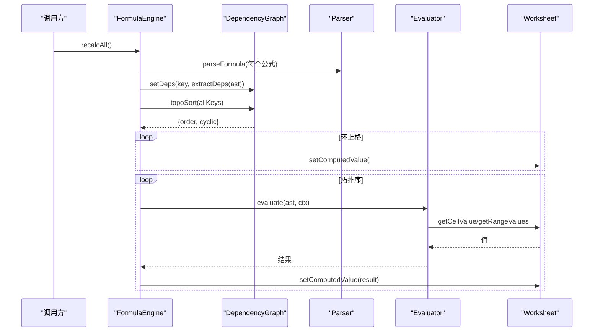
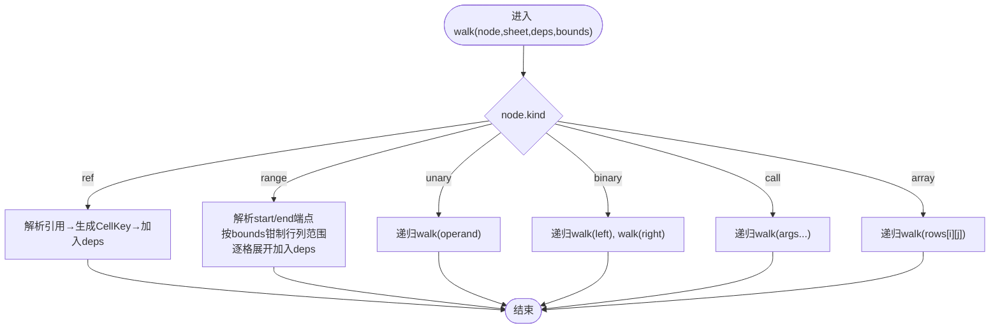
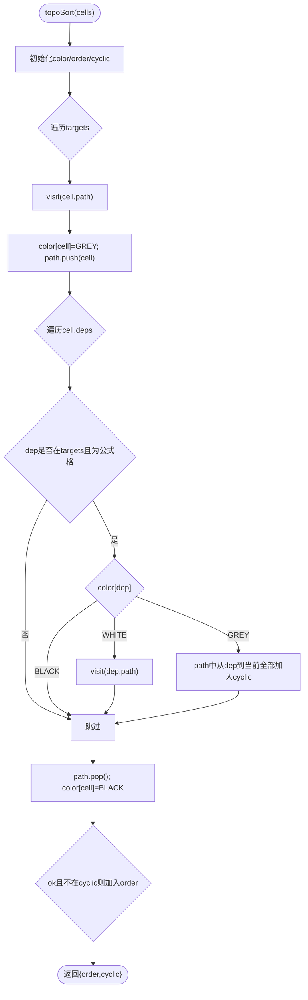
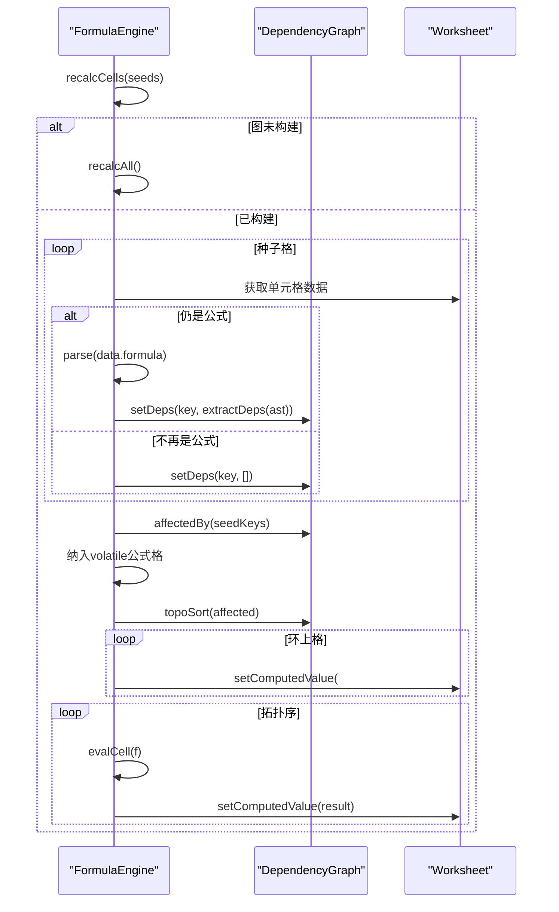
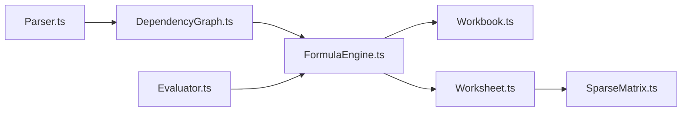

# 依赖图管理

<cite>
**本文引用的文件**
- [DependencyGraph.ts](file://cmx-mega-sheet/src/formula/DependencyGraph.ts)
- [Parser.ts](file://cmx-mega-sheet/src/formula/Parser.ts)
- [Evaluator.ts](file://cmx-mega-sheet/src/formula/Evaluator.ts)
- [FormulaEngine.ts](file://cmx-mega-sheet/src/formula/FormulaEngine.ts)
- [SparseMatrix.ts](file://cmx-mega-sheet/src/core/SparseMatrix.ts)
- [DependencyGraph.test.ts](file://cmx-mega-sheet/test/DependencyGraph.test.ts)
</cite>

## 目录
1. [简介](#简介)
2. [项目结构](#项目结构)
3. [核心组件](#核心组件)
4. [架构总览](#架构总览)
5. [详细组件分析](#详细组件分析)
6. [依赖关系分析](#依赖关系分析)
7. [性能考虑](#性能考虑)
8. [故障排查指南](#故障排查指南)
9. [结论](#结论)
10. [附录](#附录)

## 简介
本文件面向“依赖图管理系统”，围绕 DependencyGraph 类及其在公式引擎中的使用，系统阐述：
- 数据结构设计：节点表示、边存储与索引优化
- 依赖提取算法 extractDeps：从 AST 识别单元格引用与区域引用
- 拓扑排序与环检测：三色 DFS 实现及循环依赖处理策略
- 受影响单元格闭包计算：增量重算的性能优化原理
- 维护与更新接口：节点增删、边修改、批量操作
- 性能调优技巧：稀疏矩阵优化、内存控制、并发安全建议

## 项目结构
依赖图相关代码位于 cmx-mega-sheet 的 formula 与 core 子模块中。核心文件职责如下：
- Parser.ts：将公式字符串解析为 AST（包含 ref/range/call/unary/binary/array/name 等节点）
- DependencyGraph.ts：依赖图构建、维护、拓扑排序、环检测、受影响闭包计算
- Evaluator.ts：AST 求值器，提供 CellAccessor/EvalContext/FunctionRegistry 抽象
- FormulaEngine.ts：编排层，串联 Parser/Evaluator/DependencyGraph，提供全量/增量重算
- SparseMatrix.ts：稀疏二维存储，支撑行列增删时的坐标搬移与内存优化



图表来源
- [DependencyGraph.ts:1-201](file://cmx-mega-sheet/src/formula/DependencyGraph.ts#L1-L201)
- [Parser.ts:1-199](file://cmx-mega-sheet/src/formula/Parser.ts#L1-L199)
- [Evaluator.ts:1-199](file://cmx-mega-sheet/src/formula/Evaluator.ts#L1-L199)
- [FormulaEngine.ts:1-289](file://cmx-mega-sheet/src/formula/FormulaEngine.ts#L1-L289)
- [SparseMatrix.ts:1-175](file://cmx-mega-sheet/src/core/SparseMatrix.ts#L1-L175)

章节来源
- [DependencyGraph.ts:1-201](file://cmx-mega-sheet/src/formula/DependencyGraph.ts#L1-L201)
- [Parser.ts:1-199](file://cmx-mega-sheet/src/formula/Parser.ts#L1-L199)
- [Evaluator.ts:1-199](file://cmx-mega-sheet/src/formula/Evaluator.ts#L1-L199)
- [FormulaEngine.ts:1-289](file://cmx-mega-sheet/src/formula/FormulaEngine.ts#L1-L289)
- [SparseMatrix.ts:1-175](file://cmx-mega-sheet/src/core/SparseMatrix.ts#L1-L175)

## 核心组件
- DependencyGraph：维护公式格与其依赖的双向映射，提供 setDeps/clearDeps/getDependents/affectedBy/topoSort 等操作
- extractDeps：遍历 AST，收集所有单元格键（含区域展开），去重并返回
- FormulaEngine：负责扫描工作簿、重建依赖图、拓扑排序、标记环上格、回填计算值；支持增量重算
- Evaluator：基于 AST 求值，通过 CellAccessor 读取单元格/区域值，支持函数注册与上下文敏感函数
- SparseMatrix：以 Map 存储非空槽位，支持行列插入/删除时的坐标平移，避免稠密数组浪费

章节来源
- [DependencyGraph.ts:100-201](file://cmx-mega-sheet/src/formula/DependencyGraph.ts#L100-L201)
- [DependencyGraph.ts:26-94](file://cmx-mega-sheet/src/formula/DependencyGraph.ts#L26-L94)
- [FormulaEngine.ts:36-289](file://cmx-mega-sheet/src/formula/FormulaEngine.ts#L36-L289)
- [Evaluator.ts:21-55](file://cmx-mega-sheet/src/formula/Evaluator.ts#L21-L55)
- [SparseMatrix.ts:12-175](file://cmx-mega-sheet/src/core/SparseMatrix.ts#L12-L175)

## 架构总览
依赖图在公式引擎中的角色是“影响传播”和“计算顺序保证”。整体流程如下：
- 全量重算：扫描所有公式格 → 解析 AST → 抽取依赖 → 建图 → 拓扑排序 → 标记环 → 按序求值回填
- 增量重算：编辑种子格 → 更新其出边（若仍为公式）→ 计算 affectedBy 闭包 → 对子集拓扑排序 → 仅重算受影响格



图表来源
- [FormulaEngine.ts:149-198](file://cmx-mega-sheet/src/formula/FormulaEngine.ts#L149-L198)
- [DependencyGraph.ts:163-199](file://cmx-mega-sheet/src/formula/DependencyGraph.ts#L163-L199)
- [Evaluator.ts:62-84](file://cmx-mega-sheet/src/formula/Evaluator.ts#L62-L84)

章节来源
- [FormulaEngine.ts:149-198](file://cmx-mega-sheet/src/formula/FormulaEngine.ts#L149-L198)
- [DependencyGraph.ts:163-199](file://cmx-mega-sheet/src/formula/DependencyGraph.ts#L163-L199)
- [Evaluator.ts:62-84](file://cmx-mega-sheet/src/formula/Evaluator.ts#L62-L84)

## 详细组件分析

### 数据结构设计：节点、边与索引
- 节点表示：CellKey = `${sheet}!${row},${col}`，用于唯一标识一个单元格
- 正向边：deps Map<CellKey, Set<CellKey>>，记录某公式格依赖哪些单元格
- 反向边：dependents Map<CellKey, Set<CellKey>>，记录哪些公式格依赖该单元格（脏传播用）
- 索引优化：双向 Map + Set 提供 O(1) 查找与去重；受影响的传递闭包通过 BFS/DFS 沿 dependents 快速扩散

```mermaid
classDiagram
class DependencyGraph {
-Map~CellKey,Set~CellKey~~ deps
-Map~CellKey,Set~CellKey~~ dependents
+setDeps(cell, deps) void
+clearDeps(cell) void
+hasFormula(cell) bool
+getDependents(cell) CellKey[]
+affectedBy(seeds) Set~CellKey~
+topoSort(cells) {order, cyclic}
}
```

图表来源
- [DependencyGraph.ts:100-156](file://cmx-mega-sheet/src/formula/DependencyGraph.ts#L100-L156)

章节来源
- [DependencyGraph.ts:100-156](file://cmx-mega-sheet/src/formula/DependencyGraph.ts#L100-L156)

### 依赖提取算法 extractDeps：从 AST 识别引用
- 单格引用：ref 节点解析 sheet 前缀与地址，生成 CellKey
- 区域引用：range 节点拆分为 start/end 端点，支持整列/整行（-1 表示未指定），结合 bounds 钳制到 sheet 维度，逐格展开为依赖
- 表达式节点：unary/binary/call/array 递归遍历子节点，忽略字面量与函数名
- 去重：使用 Set 收集依赖，最终转为数组返回



图表来源
- [DependencyGraph.ts:26-94](file://cmx-mega-sheet/src/formula/DependencyGraph.ts#L26-L94)
- [Parser.ts:18-27](file://cmx-mega-sheet/src/formula/Parser.ts#L18-L27)

章节来源
- [DependencyGraph.ts:26-94](file://cmx-mega-sheet/src/formula/DependencyGraph.ts#L26-L94)
- [Parser.ts:18-27](file://cmx-mega-sheet/src/formula/Parser.ts#L18-L27)

### 拓扑排序与环检测：三色 DFS 与循环依赖处理
- 三色标记：WHITE=未访问，GREY=在栈中，BLACK=已完成
- 环检测：当遇到 GREY 节点时，说明存在环；从路径中 dep 位置到当前节点的所有节点均标记为环上
- 输出：返回无环部分的拓扑序 order 与环上节点集合 cyclic
- 策略：环上格不参与正常求值，由上层写 #CIRC! 错误标记



图表来源
- [DependencyGraph.ts:163-199](file://cmx-mega-sheet/src/formula/DependencyGraph.ts#L163-L199)

章节来源
- [DependencyGraph.ts:163-199](file://cmx-mega-sheet/src/formula/DependencyGraph.ts#L163-L199)

### 受影响单元格闭包与增量重算
- 闭包计算：affectedBy(seeds) 沿 dependents 进行 BFS/DFS，得到所有受影响的公式格集合（含种子自身若是公式）
- 增量重算流程：
  1) 对每个种子格，若仍为公式，则重新解析 AST 并更新其出边（setDeps）
  2) 计算 affectedBy 闭包，并纳入 volatile 公式格（每次可能变化）
  3) 对闭包子集执行拓扑排序，仅重算 order 中的格，环上格标记 #CIRC!
- 性能优化：从 O(全簿) 降到 O(受影响)，避免大表全量重算



图表来源
- [FormulaEngine.ts:206-243](file://cmx-mega-sheet/src/formula/FormulaEngine.ts#L206-L243)
- [DependencyGraph.ts:146-156](file://cmx-mega-sheet/src/formula/DependencyGraph.ts#L146-L156)

章节来源
- [FormulaEngine.ts:206-243](file://cmx-mega-sheet/src/formula/FormulaEngine.ts#L206-L243)
- [DependencyGraph.ts:146-156](file://cmx-mega-sheet/src/formula/DependencyGraph.ts#L146-L156)

### 维护与更新接口
- 节点增删：
  - setDeps(cell, deps)：设置或更新某公式格的依赖集，同时维护反向 dependents
  - clearDeps(cell)：移除某公式格及其反向边
  - hasFormula(cell)：判断是否为公式格
  - clearAll()：清空整张图（全量重算前重建）
- 边关系查询：
  - getDependents(cell)：直接依赖者列表
  - affectedBy(seeds)：传递闭包（受影响集合）
- 批量操作：
  - 全量重算：recalcAll() 扫描所有公式格，重建图并求值
  - 增量重算：recalcCells(seeds) 仅对受影响子集重算

章节来源
- [DependencyGraph.ts:107-156](file://cmx-mega-sheet/src/formula/DependencyGraph.ts#L107-L156)
- [FormulaEngine.ts:149-198](file://cmx-mega-sheet/src/formula/FormulaEngine.ts#L149-L198)
- [FormulaEngine.ts:206-243](file://cmx-mega-sheet/src/formula/FormulaEngine.ts#L206-L243)

### 与解析器、求值器的集成
- Parser：提供 AstNode 类型定义与解析能力，供 extractDeps 与 Evaluator 使用
- Evaluator：通过 CellAccessor 读取单元格/区域值，支持函数注册与上下文敏感函数；在 FormulaEngine 中被调用以完成求值
- FormulaEngine：协调 Parser/Evaluator/DependencyGraph，提供 evaluateFormula 直接求值与 setReportValueMap 报表取数

章节来源
- [Parser.ts:18-27](file://cmx-mega-sheet/src/formula/Parser.ts#L18-L27)
- [Evaluator.ts:21-55](file://cmx-mega-sheet/src/formula/Evaluator.ts#L21-L55)
- [FormulaEngine.ts:15-28](file://cmx-mega-sheet/src/formula/FormulaEngine.ts#L15-L28)

## 依赖关系分析
- 模块耦合：
  - DependencyGraph 依赖 Parser 的 AstNode 类型与 address 工具
  - FormulaEngine 依赖 DependencyGraph、Parser、Evaluator、Workbook/Worksheet
  - Evaluator 依赖 value 类型与 FunctionRegistry
  - SparseMatrix 独立于 formula 层，被 Worksheet 使用以支持行列操作
- 外部依赖：
  - Workbook/Worksheet：提供工作簿与工作表的数据访问与计算值写入
  - ReportValueMap：报表取数值的映射，配合自定义函数



图表来源
- [DependencyGraph.ts:12-13](file://cmx-mega-sheet/src/formula/DependencyGraph.ts#L12-L13)
- [FormulaEngine.ts:15-28](file://cmx-mega-sheet/src/formula/FormulaEngine.ts#L15-L28)
- [Evaluator.ts:11-19](file://cmx-mega-sheet/src/formula/Evaluator.ts#L11-L19)
- [SparseMatrix.ts:1-10](file://cmx-mega-sheet/src/core/SparseMatrix.ts#L1-L10)

章节来源
- [DependencyGraph.ts:12-13](file://cmx-mega-sheet/src/formula/DependencyGraph.ts#L12-L13)
- [FormulaEngine.ts:15-28](file://cmx-mega-sheet/src/formula/FormulaEngine.ts#L15-L28)
- [Evaluator.ts:11-19](file://cmx-mega-sheet/src/formula/Evaluator.ts#L11-L19)
- [SparseMatrix.ts:1-10](file://cmx-mega-sheet/src/core/SparseMatrix.ts#L1-L10)

## 性能考虑
- 稀疏矩阵优化：
  - 使用 Map 存储非空槽位，避免稠密数组的内存浪费
  - 行列插入/删除时通过 shiftRows/shiftCols 批量平移坐标，减少重复计算
- 内存使用控制：
  - 依赖图使用双向 Map+Set，确保 O(1) 查找与去重
  - 区域依赖展开时结合 bounds 钳制到 sheet 维度，避免遍历百万格
  - 解析缓存 parseCache 减少重复解析开销
- 并发安全建议：
  - 当前实现为单线程同步逻辑，未内置锁机制
  - 建议在调用层（如 UI 事件或后台任务）串行化重算请求，或使用队列避免竞态
  - 对于多用户场景，可在 Worksheet/Workbook 层引入读写锁或版本戳，确保依赖图一致性

章节来源
- [SparseMatrix.ts:12-175](file://cmx-mega-sheet/src/core/SparseMatrix.ts#L12-L175)
- [FormulaEngine.ts:69-80](file://cmx-mega-sheet/src/formula/FormulaEngine.ts#L69-L80)
- [DependencyGraph.ts:100-156](file://cmx-mega-sheet/src/formula/DependencyGraph.ts#L100-L156)

## 故障排查指南
- 环检测与错误标记：
  - 拓扑排序返回 cyclic 集合，上层将其写为 #CIRC!，便于定位循环依赖
- 解析错误：
  - 解析失败时 AST 为 null，上层写 #NAME? 或具体错误信息
- 求值异常：
  - 求值过程中捕获异常，返回 #VALUE!；除零返回 #DIV/0!，数值溢出返回 #NUM!
- 测试用例参考：
  - 单测覆盖 extractDeps、依赖跟踪、受影响闭包、拓扑排序与环检测

章节来源
- [FormulaEngine.ts:183-194](file://cmx-mega-sheet/src/formula/FormulaEngine.ts#L183-L194)
- [FormulaEngine.ts:259-272](file://cmx-mega-sheet/src/formula/FormulaEngine.ts#L259-L272)
- [DependencyGraph.test.ts:9-128](file://cmx-mega-sheet/test/DependencyGraph.test.ts#L9-L128)

## 结论
依赖图管理系统通过清晰的数据结构与高效的算法，实现了公式依赖的精确建模与高性能重算：
- 数据结构：双向 Map+Set 提供高效边管理与反向传播
- 依赖提取：AST 遍历与区域展开，支持跨表与整列/整行
- 拓扑排序：三色 DFS 检测环，隔离环上格并标记错误
- 增量重算：affectedBy 闭包与 volatile 处理，显著降低大表重算成本
- 性能优化：稀疏矩阵、解析缓存、边界钳制，兼顾内存与速度
- 可扩展性：抽象 CellAccessor/FunctionRegistry，便于扩展函数与数据源

## 附录
- 关键 API 速查：
  - extractDeps(node, defaultSheet, bounds?)：从 AST 抽取依赖
  - DependencyGraph.setDeps/clearDeps/getDependents/affectedBy/topoSort：依赖图维护与查询
  - FormulaEngine.recalcAll/recalcCells/effectuateFormula：全量/增量重算与直接求值
- 最佳实践：
  - 大表编辑优先使用 recalcCells，避免全量重算
  - 合理使用区域引用，结合 bounds 限制展开范围
  - 对 volatile 函数保持谨慎，避免频繁触发重算