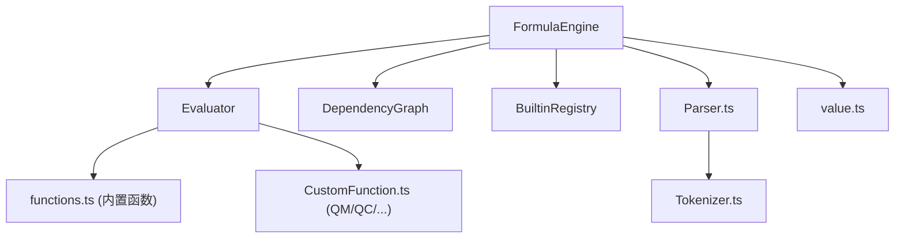
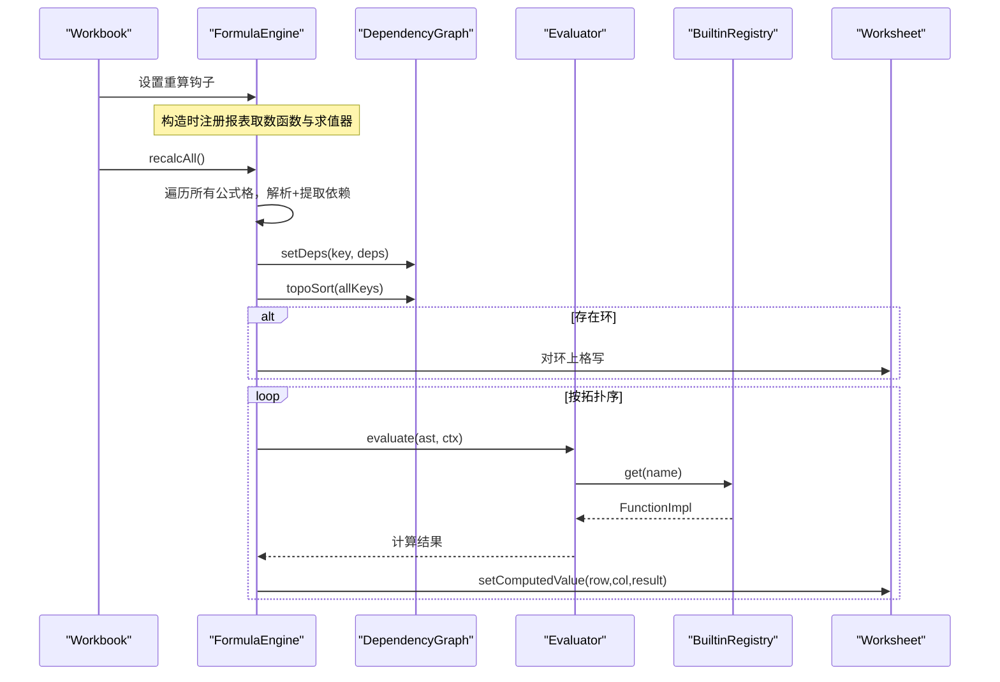
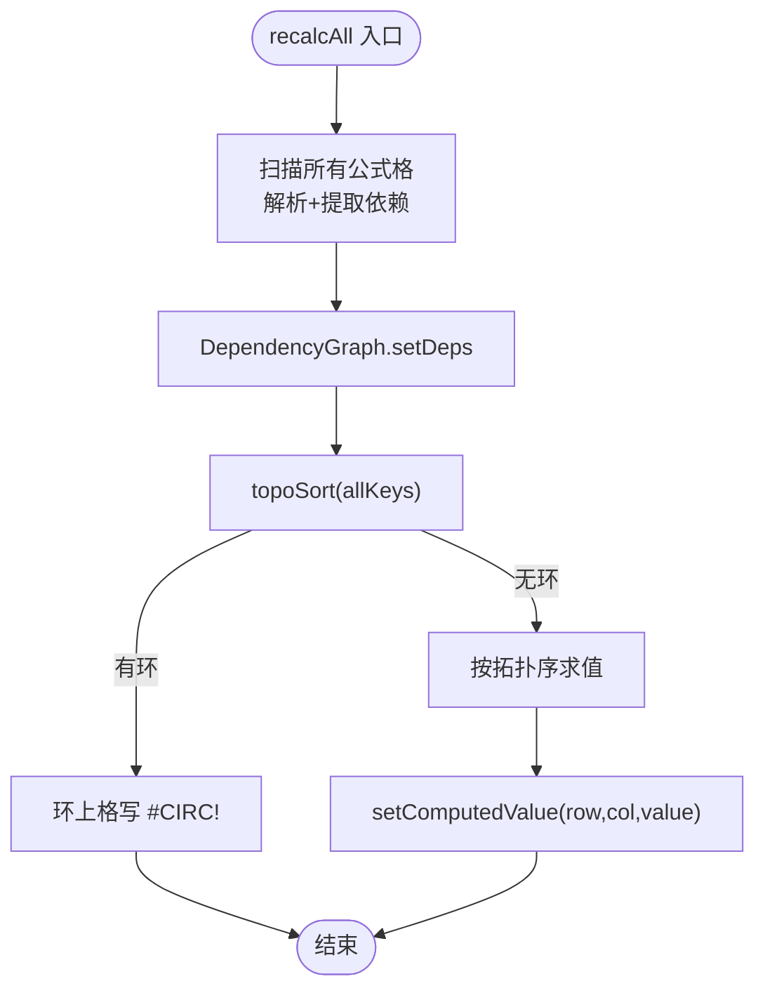
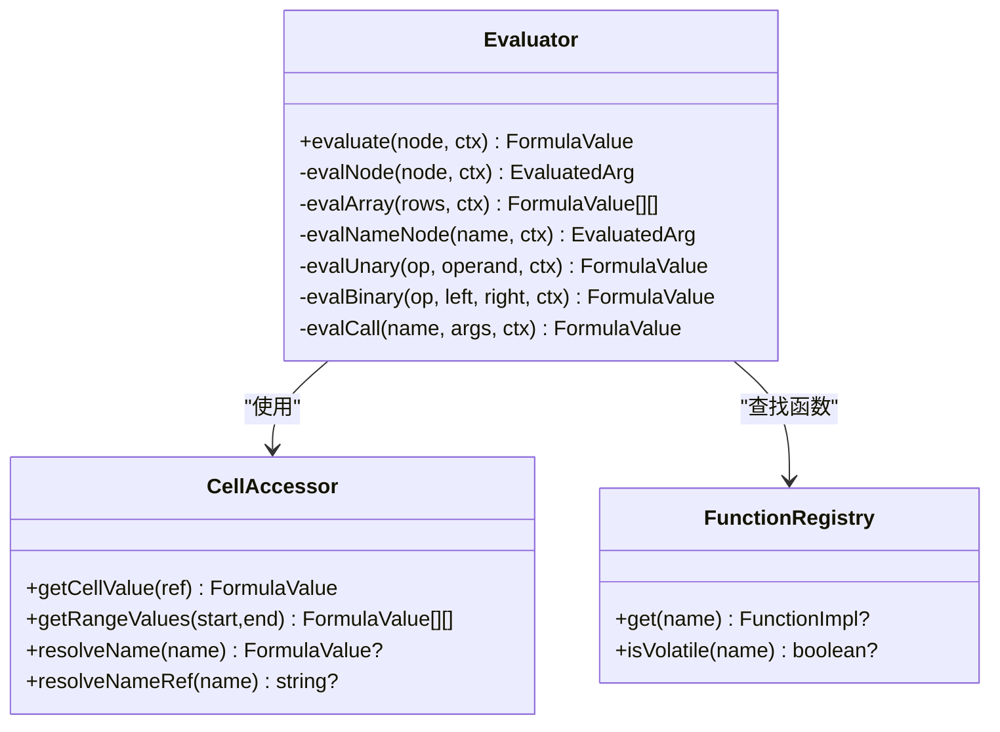
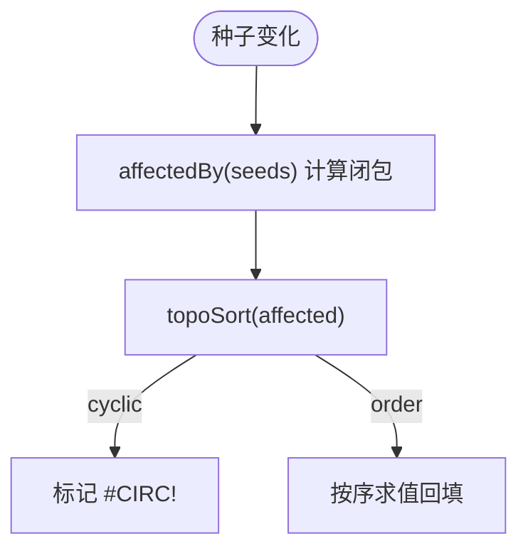
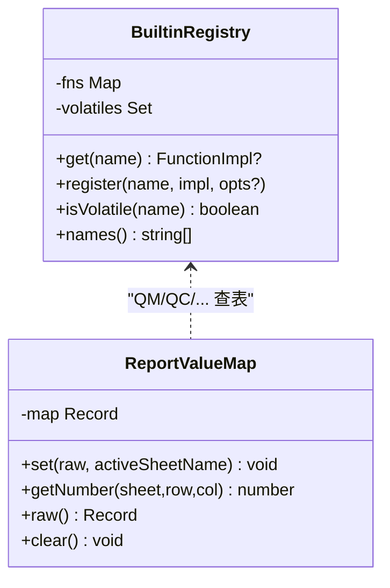
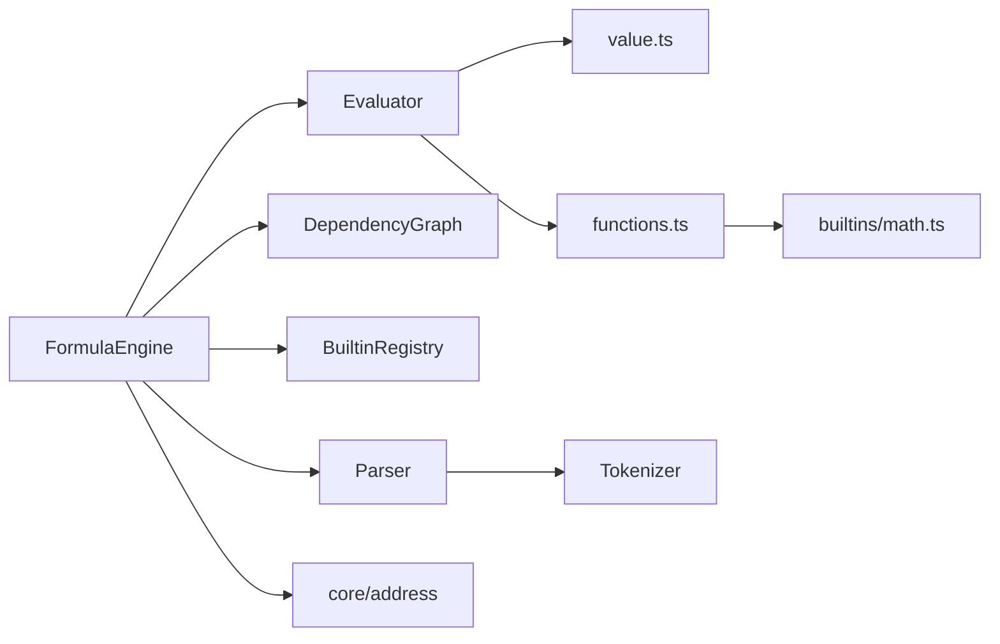

# 公式引擎 API

<cite>
**本文引用的文件**
- [FormulaEngine.ts](file://cmx-mega-sheet/src/formula/FormulaEngine.ts)
- [Evaluator.ts](file://cmx-mega-sheet/src/formula/Evaluator.ts)
- [DependencyGraph.ts](file://cmx-mega-sheet/src/formula/DependencyGraph.ts)
- [Parser.ts](file://cmx-mega-sheet/src/formula/Parser.ts)
- [Tokenizer.ts](file://cmx-mega-sheet/src/formula/Tokenizer.ts)
- [functions.ts](file://cmx-mega-sheet/src/formula/functions.ts)
- [CustomFunction.ts](file://cmx-mega-sheet/src/formula/CustomFunction.ts)
- [value.ts](file://cmx-mega-sheet/src/formula/value.ts)
- [math.ts](file://cmx-mega-sheet/src/formula/builtins/math.ts)
</cite>

## 目录
1. [简介](#简介)
2. [项目结构](#项目结构)
3. [核心组件](#核心组件)
4. [架构总览](#架构总览)
5. [详细组件分析](#详细组件分析)
6. [依赖关系分析](#依赖关系分析)
7. [性能与优化](#性能与优化)
8. [调试与错误处理](#调试与错误处理)
9. [最佳实践](#最佳实践)
10. [结论](#结论)

## 简介
本 API 文档面向公式引擎（M3），围绕 FormulaEngine 的初始化、解析与执行流程，深入说明 Evaluator 接口、函数注册机制与依赖图管理。文档同时覆盖内置函数库使用指南、自定义函数开发规范、性能调优策略、调试工具与错误处理模式，并解释公式缓存、增量计算与内存优化技术。

## 项目结构
公式引擎位于 cmx-mega-sheet/src/formula，采用分层设计：
- 词法与语法：Tokenizer → Parser → AST
- 求值器：Evaluator 消费 AST，调用函数注册表
- 依赖图：DependencyGraph 负责拓扑排序与环检测
- 函数注册：BuiltinRegistry + builtins/* 族函数
- 报表取数：CustomFunction.ts 提供 QM/QC/JE/FS/REF 等易变函数
- 类型与工具：value.ts 定义 FormulaValue/错误与转换

图表来源
- [FormulaEngine.ts:15-54](file://cmx-mega-sheet/src/formula/FormulaEngine.ts#L15-L54)
- [Evaluator.ts:11-55](file://cmx-mega-sheet/src/formula/Evaluator.ts#L11-L55)
- [DependencyGraph.ts:12-20](file://cmx-mega-sheet/src/formula/DependencyGraph.ts#L12-L20)
- [functions.ts:11-42](file://cmx-mega-sheet/src/formula/functions.ts#L11-L42)
- [CustomFunction.ts:15-18](file://cmx-mega-sheet/src/formula/CustomFunction.ts#L15-L18)
- [Parser.ts:15-27](file://cmx-mega-sheet/src/formula/Parser.ts#L15-L27)
- [Tokenizer.ts:11-36](file://cmx-mega-sheet/src/formula/Tokenizer.ts#L11-L36)
- [value.ts:13-28](file://cmx-mega-sheet/src/formula/value.ts#L13-L28)

章节来源
- [FormulaEngine.ts:1-54](file://cmx-mega-sheet/src/formula/FormulaEngine.ts#L1-L54)
- [Evaluator.ts:1-55](file://cmx-mega-sheet/src/formula/Evaluator.ts#L1-L55)
- [DependencyGraph.ts:1-20](file://cmx-mega-sheet/src/formula/DependencyGraph.ts#L1-L20)
- [Parser.ts:1-27](file://cmx-mega-sheet/src/formula/Parser.ts#L1-L27)
- [Tokenizer.ts:1-36](file://cmx-mega-sheet/src/formula/Tokenizer.ts#L1-L36)
- [functions.ts:1-42](file://cmx-mega-sheet/src/formula/functions.ts#L1-L42)
- [CustomFunction.ts:1-18](file://cmx-mega-sheet/src/formula/CustomFunction.ts#L1-L18)
- [value.ts:1-28](file://cmx-mega-sheet/src/formula/value.ts#L1-L28)

## 核心组件
- FormulaEngine：编排层，负责全量/增量重算、解析缓存、依赖图维护、报表值映射注入与直接求值入口。
- Evaluator：AST 求值器，实现标量/区域/数组/一元/二元/函数调用求值，统一错误传播。
- DependencyGraph：依赖图与拓扑排序，三色 DFS 环检测，受影响闭包计算。
- Parser/Tokenizer：将公式字符串转为 token 流，再构建 AST。
- functions.ts/BuiltinRegistry：内置函数注册表与函数实现集合，支持扩展。
- CustomFunction.ts：报表取数函数（QM/QC/JE/FS/REF）及 ReportValueMap。
- value.ts：FormulaValue、错误类型、类型转换与比较。

章节来源
- [FormulaEngine.ts:36-54](file://cmx-mega-sheet/src/formula/FormulaEngine.ts#L36-L54)
- [Evaluator.ts:59-83](file://cmx-mega-sheet/src/formula/Evaluator.ts#L59-L83)
- [DependencyGraph.ts:100-135](file://cmx-mega-sheet/src/formula/DependencyGraph.ts#L100-L135)
- [Parser.ts:18-27](file://cmx-mega-sheet/src/formula/Parser.ts#L18-L27)
- [Tokenizer.ts:11-36](file://cmx-mega-sheet/src/formula/Tokenizer.ts#L11-L36)
- [functions.ts:1118-1145](file://cmx-mega-sheet/src/formula/functions.ts#L1118-L1145)
- [CustomFunction.ts:27-79](file://cmx-mega-sheet/src/formula/CustomFunction.ts#L27-L79)
- [value.ts:13-28](file://cmx-mega-sheet/src/formula/value.ts#L13-L28)

## 架构总览
公式引擎以 Workbook 为宿主，FormulaEngine 在构造时完成：
- 注册报表取数函数到 BuiltinRegistry
- 创建 Evaluator
- 绑定 Workbook 的重算钩子（全量/增量）

运行时关键路径：
- 编辑触发 wb.requestRecalc() → FormulaEngine.recalcAll()
- 单格编辑触发 wb.setRecalcCellsHook(...) → FormulaEngine.recalcCells(seeds)
- 解析缓存 parseCache 避免重复解析
- 依赖图提取 extractDeps(AST, sheetName, bounds) 建立依赖关系
- 拓扑排序 topoSort 得到无环顺序，依次求值回填 setComputedValue
- 环上单元格标记 #CIRC!

图表来源
- [FormulaEngine.ts:47-54](file://cmx-mega-sheet/src/formula/FormulaEngine.ts#L47-L54)
- [FormulaEngine.ts:149-198](file://cmx-mega-sheet/src/formula/FormulaEngine.ts#L149-L198)
- [DependencyGraph.ts:163-199](file://cmx-mega-sheet/src/formula/DependencyGraph.ts#L163-L199)
- [Evaluator.ts:62-83](file://cmx-mega-sheet/src/formula/Evaluator.ts#L62-L83)
- [functions.ts:1118-1145](file://cmx-mega-sheet/src/formula/functions.ts#L1118-L1145)

章节来源
- [FormulaEngine.ts:47-54](file://cmx-mega-sheet/src/formula/FormulaEngine.ts#L47-L54)
- [FormulaEngine.ts:149-198](file://cmx-mega-sheet/src/formula/FormulaEngine.ts#L149-L198)
- [DependencyGraph.ts:163-199](file://cmx-mega-sheet/src/formula/DependencyGraph.ts#L163-L199)
- [Evaluator.ts:62-83](file://cmx-mega-sheet/src/formula/Evaluator.ts#L62-L83)
- [functions.ts:1118-1145](file://cmx-mega-sheet/src/formula/functions.ts#L1118-L1145)

## 详细组件分析

### FormulaEngine 类
- 初始化配置
  - 注册报表取数函数（QM/QC/JE/FS/REF）到 BuiltinRegistry
  - 创建 Evaluator 实例
  - 绑定 Workbook 的全量与增量重算钩子
- 解析缓存
  - parseCache 存储 AST 或解析错误，避免重复解析
- 单元格访问器
  - 提供 getCellValue/getRangeValues/resolveName 抽象，屏蔽 Worksheet 细节
- 全量重算 recalcAll
  - 扫描所有公式格，重建依赖图，拓扑排序，环检测，逐格求值回填
- 增量重算 recalcCells
  - 仅更新受影响的种子格及其依赖者闭包，含 volatile 公式格每次纳入
- 直接求值 evaluateFormula
  - 不写入单元格，供预览/聚合场景

图表来源
- [FormulaEngine.ts:149-198](file://cmx-mega-sheet/src/formula/FormulaEngine.ts#L149-L198)
- [DependencyGraph.ts:163-199](file://cmx-mega-sheet/src/formula/DependencyGraph.ts#L163-L199)

章节来源
- [FormulaEngine.ts:36-54](file://cmx-mega-sheet/src/formula/FormulaEngine.ts#L36-L54)
- [FormulaEngine.ts:69-80](file://cmx-mega-sheet/src/formula/FormulaEngine.ts#L69-L80)
- [FormulaEngine.ts:82-143](file://cmx-mega-sheet/src/formula/FormulaEngine.ts#L82-L143)
- [FormulaEngine.ts:149-198](file://cmx-mega-sheet/src/formula/FormulaEngine.ts#L149-L198)
- [FormulaEngine.ts:206-243](file://cmx-mega-sheet/src/formula/FormulaEngine.ts#L206-L243)
- [FormulaEngine.ts:278-287](file://cmx-mega-sheet/src/formula/FormulaEngine.ts#L278-L287)

### Evaluator 接口与求值流程
- 接口定义
  - CellAccessor：getCellValue/getRangeValues/resolveName/resolveNameRef
  - EvalContext：当前所在格与 sheet 名
  - FunctionRegistry：get/isVolatile
- 求值逻辑
  - 节点类型：number/string/ref/range/array/unary/binary/call/name
  - 区域落到标量上下文取左上角
  - 名称解析优先 resolveNameRef（命名区域→引用文本），再 resolveName（标量）
  - 二元运算：比较/连接/算术，错误短路
  - 函数调用：registry.get(name)，参数已求值（EvaluatedArg），异常返回 #VALUE!

图表来源
- [Evaluator.ts:21-55](file://cmx-mega-sheet/src/formula/Evaluator.ts#L21-L55)
- [Evaluator.ts:59-157](file://cmx-mega-sheet/src/formula/Evaluator.ts#L59-L157)

章节来源
- [Evaluator.ts:21-55](file://cmx-mega-sheet/src/formula/Evaluator.ts#L21-L55)
- [Evaluator.ts:59-157](file://cmx-mega-sheet/src/formula/Evaluator.ts#L59-L157)

### 依赖图管理与拓扑排序
- 依赖抽取
  - extractDeps 遍历 AST，ref 加入依赖；range 展开为逐格依赖（整列/整行钳制到 sheet 维度）
- 图结构
  - deps：公式格→其依赖集合
  - dependents：反向索引，用于脏传播
- 拓扑排序
  - 三色 DFS（白/灰/黑），灰→灰即环，收集环上格
  - 返回 order（无环拓扑序）与 cyclic（环上格集合）
- 受影响闭包
  - affectedBy(seeds) 通过 dependents 传递闭包计算受影响公式格集合

图表来源
- [DependencyGraph.ts:26-94](file://cmx-mega-sheet/src/formula/DependencyGraph.ts#L26-L94)
- [DependencyGraph.ts:100-156](file://cmx-mega-sheet/src/formula/DependencyGraph.ts#L100-L156)
- [DependencyGraph.ts:163-199](file://cmx-mega-sheet/src/formula/DependencyGraph.ts#L163-L199)

章节来源
- [DependencyGraph.ts:26-94](file://cmx-mega-sheet/src/formula/DependencyGraph.ts#L26-L94)
- [DependencyGraph.ts:100-156](file://cmx-mega-sheet/src/formula/DependencyGraph.ts#L100-L156)
- [DependencyGraph.ts:163-199](file://cmx-mega-sheet/src/formula/DependencyGraph.ts#L163-L199)

### 解析与词法
- Tokenizer
  - 识别数字、字符串、引用、区域、标识符、运算符、括号、逗号、分号、冒号、百分号
  - 特殊处理整列/整行区域 token，避免歧义
- Parser
  - Pratt/优先级爬升解析中缀表达式
  - 支持一元 +/-、后缀 %、函数调用、数组字面量、引用/区域、命名/布尔
  - 错误定位：FormulaParseError 携带位置信息

章节来源
- [Tokenizer.ts:11-36](file://cmx-mega-sheet/src/formula/Tokenizer.ts#L11-L36)
- [Tokenizer.ts:61-188](file://cmx-mega-sheet/src/formula/Tokenizer.ts#L61-L188)
- [Parser.ts:18-27](file://cmx-mega-sheet/src/formula/Parser.ts#L18-L27)
- [Parser.ts:46-193](file://cmx-mega-sheet/src/formula/Parser.ts#L46-L193)

### 函数注册机制与内置函数库
- BuiltinRegistry
  - 内部 Map 存储函数实现，Set 存储易变函数名
  - register(name, impl, opts?) 支持覆盖与标记 volatile
  - isVolatile(name) 供依赖图判断是否每次纳入
- 内置函数族
  - math.ts：三角、对数、组合、进制、SERIESSUM 等
  - financial/statistical/database/textref/engineering：按族模块化
  - functions.ts：聚合、逻辑、文本、日期时间、查找引用等
- 报表取数函数
  - QM/QC/JE/FS/REF 注册为易变函数，从 ReportValueMap 按「所在格」取值

图表来源
- [functions.ts:1118-1145](file://cmx-mega-sheet/src/formula/functions.ts#L1118-L1145)
- [CustomFunction.ts:27-79](file://cmx-mega-sheet/src/formula/CustomFunction.ts#L27-L79)

章节来源
- [functions.ts:1118-1145](file://cmx-mega-sheet/src/formula/functions.ts#L1118-L1145)
- [CustomFunction.ts:27-79](file://cmx-mega-sheet/src/formula/CustomFunction.ts#L27-L79)
- [math.ts:127-200](file://cmx-mega-sheet/src/formula/builtins/math.ts#L127-L200)

### 数据类型与错误模型
- FormulaValue：number | string | boolean | FormulaError | null
- FormulaError：#DIV/0!, #VALUE!, #REF!, #NAME?, #NUM!, #N/A, #SPILL!, #CIRC!
- 转换与比较
  - toNumber/toText/toBoolean 对齐 Excel 语义
  - compareValues 支持 = <> < > <= >=，类型排序数字<文本<布尔

章节来源
- [value.ts:13-28](file://cmx-mega-sheet/src/formula/value.ts#L13-L28)
- [value.ts:42-75](file://cmx-mega-sheet/src/formula/value.ts#L42-L75)
- [value.ts:90-130](file://cmx-mega-sheet/src/formula/value.ts#L90-L130)

## 依赖关系分析
- 耦合与内聚
  - FormulaEngine 高内聚于编排职责，低耦合于 Worksheet（通过 accessor）
  - Evaluator 纯逻辑，依赖抽象 CellAccessor/FunctionRegistry
  - DependencyGraph 独立于 UI/DOM，可单测
- 外部依赖
  - core/address.js：地址解析与行列转换
  - render/numFmt：TEXT(value, format) 复用渲染格式
- 循环依赖
  - 无循环导入；模块间通过接口解耦

图表来源
- [FormulaEngine.ts:15-28](file://cmx-mega-sheet/src/formula/FormulaEngine.ts#L15-L28)
- [Evaluator.ts:11-19](file://cmx-mega-sheet/src/formula/Evaluator.ts#L11-L19)
- [functions.ts:11-42](file://cmx-mega-sheet/src/formula/functions.ts#L11-L42)
- [math.ts:12-23](file://cmx-mega-sheet/src/formula/builtins/math.ts#L12-L23)

章节来源
- [FormulaEngine.ts:15-28](file://cmx-mega-sheet/src/formula/FormulaEngine.ts#L15-L28)
- [Evaluator.ts:11-19](file://cmx-mega-sheet/src/formula/Evaluator.ts#L11-L19)
- [functions.ts:11-42](file://cmx-mega-sheet/src/formula/functions.ts#L11-L42)
- [math.ts:12-23](file://cmx-mega-sheet/src/formula/builtins/math.ts#L12-L23)

## 性能与优化
- 解析缓存
  - parseCache 避免重复解析相同公式串，降低 CPU 开销
- 依赖图增量维护
  - recalcCells 仅更新种子格的依赖边，减少建图成本
- 受影响闭包计算
  - affectedBy 基于 dependents 快速传播，避免全簿遍历
- 范围钳制
  - 整列/整行依赖与取值均钳制到 sheet 维度，防止百万格遍历
- 易变函数策略
  - volatile 函数（QM/QC/…）每次纳入受影响集，保证正确性
- 内存优化建议
  - 大表编辑后及时清理无用解析缓存（可按业务周期重置）
  - 控制 ReportValueMap 规模，避免过大键空间
  - 合理使用区域引用，避免超大区域展开

章节来源
- [FormulaEngine.ts:69-80](file://cmx-mega-sheet/src/formula/FormulaEngine.ts#L69-L80)
- [FormulaEngine.ts:206-243](file://cmx-mega-sheet/src/formula/FormulaEngine.ts#L206-L243)
- [DependencyGraph.ts:146-156](file://cmx-mega-sheet/src/formula/DependencyGraph.ts#L146-L156)
- [DependencyGraph.ts:76-86](file://cmx-mega-sheet/src/formula/DependencyGraph.ts#L76-L86)

## 调试与错误处理
- 错误类型
  - 解析期：FormulaLexError/FormulaParseError 带位置信息
  - 运行期：FormulaError 枚举（#DIV/0!, #VALUE!, #REF!, #NAME?, #NUM!, #N/A, #SPILL!, #CIRC!）
- 错误传播
  - Evaluator 在二元/一元/函数调用中短路错误，保持错误透传
- 环检测
  - 依赖图三色 DFS 标记环上格为 #CIRC!
- 调试工具
  - ReportValueMap.raw() 查看取数映射
  - BuiltinRegistry.names() 查看已注册函数
  - 利用 evaluateFormula 直接求值测试公式片段

章节来源
- [Parser.ts:29-34](file://cmx-mega-sheet/src/formula/Parser.ts#L29-L34)
- [Tokenizer.ts:50-55](file://cmx-mega-sheet/src/formula/Tokenizer.ts#L50-L55)
- [value.ts:13-28](file://cmx-mega-sheet/src/formula/value.ts#L13-L28)
- [Evaluator.ts:116-157](file://cmx-mega-sheet/src/formula/Evaluator.ts#L116-L157)
- [DependencyGraph.ts:163-199](file://cmx-mega-sheet/src/formula/DependencyGraph.ts#L163-L199)
- [CustomFunction.ts:57-60](file://cmx-mega-sheet/src/formula/CustomFunction.ts#L57-L60)
- [functions.ts:1141-1144](file://cmx-mega-sheet/src/formula/functions.ts#L1141-L1144)
- [FormulaEngine.ts:278-287](file://cmx-mega-sheet/src/formula/FormulaEngine.ts#L278-L287)

## 最佳实践
- 初始化与配置
  - 在应用启动时创建 FormulaEngine，并注入 ReportValueMap（setReportValueMap）
  - 确保 Workbook 的 recalc 钩子已绑定
- 公式编写
  - 避免超大区域引用；必要时拆分计算或使用中间列
  - 合理使用 IFERROR/IFNA 捕获错误，提升健壮性
  - 谨慎使用易变函数（QM/QC/…），因其每次重算都会纳入
- 自定义函数开发
  - 实现 FunctionImpl，遵循参数求值约定（EvaluatedArg）
  - 通过 BuiltinRegistry.register 注册，必要时标记 volatile
  - 参考 builtins/* 族的错误处理与类型转换模式
- 性能调优
  - 优先使用增量重算（recalcCells），减少全量重算频率
  - 控制 ReportValueMap 大小与更新粒度
  - 避免在热点路径中频繁创建临时对象
- 调试与验证
  - 使用 evaluateFormula 进行单元测试与回归验证
  - 借助 names()/raw() 检查注册状态与取数映射
  - 关注 #CIRC! 与 #NAME?，排查环路与未定义名称

章节来源
- [FormulaEngine.ts:47-67](file://cmx-mega-sheet/src/formula/FormulaEngine.ts#L47-L67)
- [CustomFunction.ts:71-79](file://cmx-mega-sheet/src/formula/CustomFunction.ts#L71-L79)
- [functions.ts:1118-1145](file://cmx-mega-sheet/src/formula/functions.ts#L1118-L1145)
- [Evaluator.ts:148-157](file://cmx-mega-sheet/src/formula/Evaluator.ts#L148-L157)

## 结论
公式引擎通过清晰的层次化设计与抽象接口，实现了高性能、可扩展的公式解析与执行能力。FormulaEngine 作为编排层，结合 Evaluator、DependencyGraph 与 BuiltinRegistry，提供了稳定的全量/增量重算、环检测与错误处理机制。配合内置函数族与自定义函数扩展点，可满足复杂报表与电子表格场景需求。通过解析缓存、依赖图增量维护与范围钳制等技术，系统在大规模数据下仍保持良好性能。建议在工程中遵循最佳实践，合理配置与使用引擎能力，以获得稳定高效的公式计算体验。