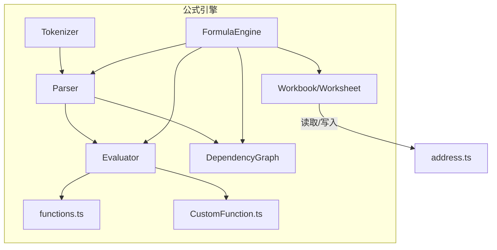
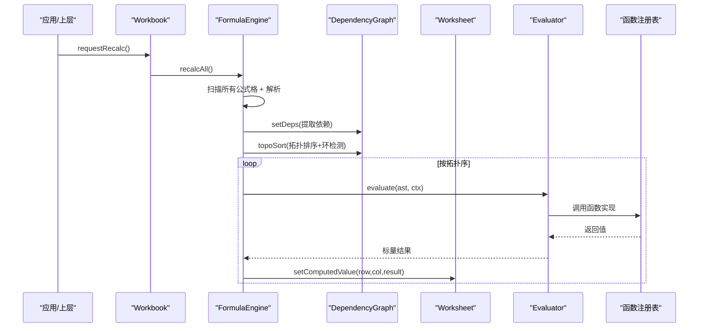
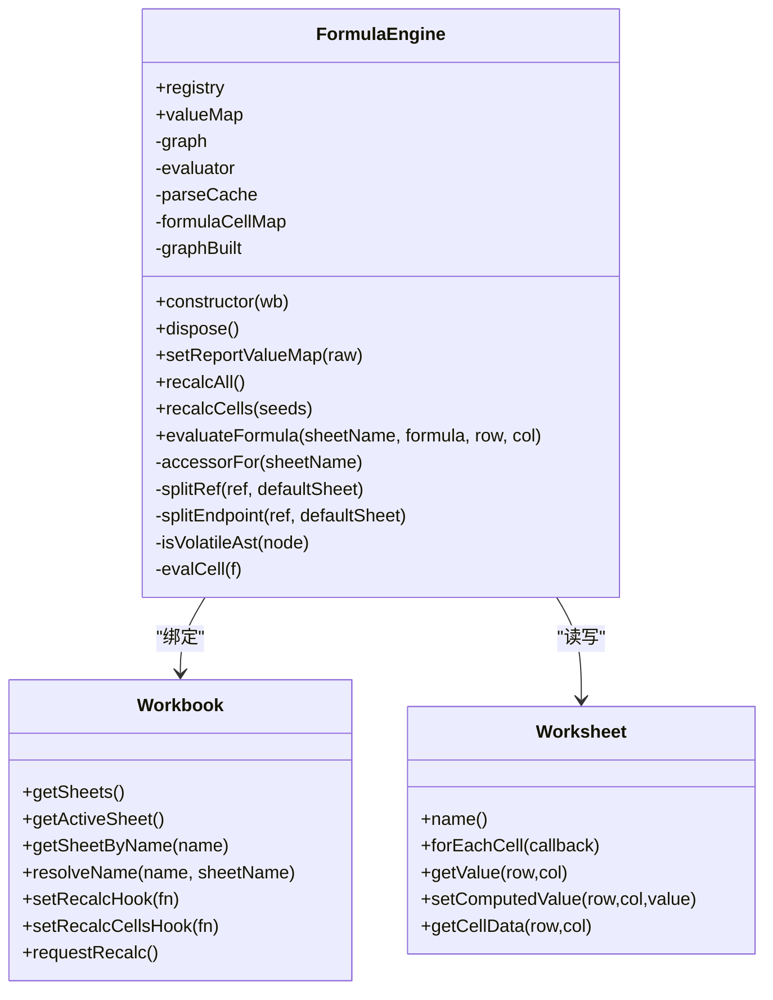
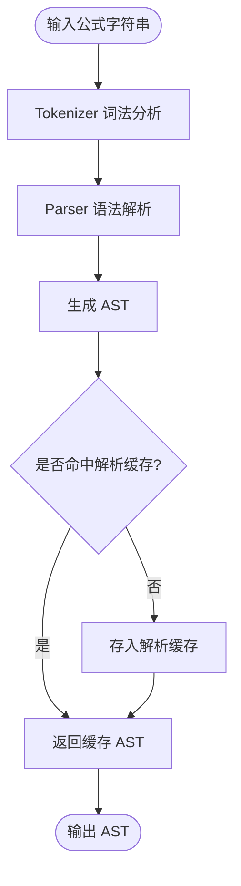
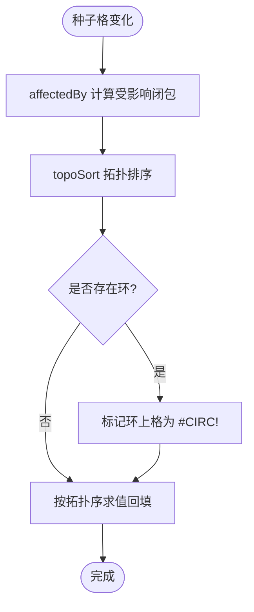
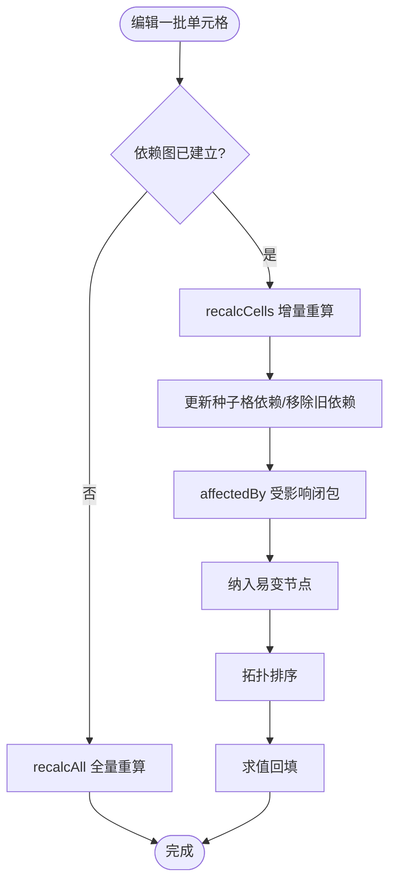
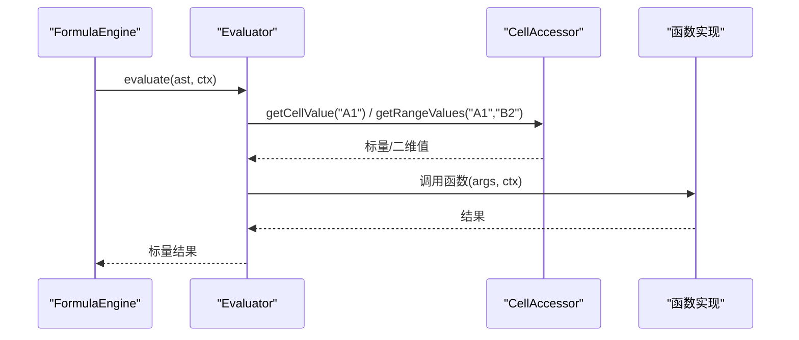
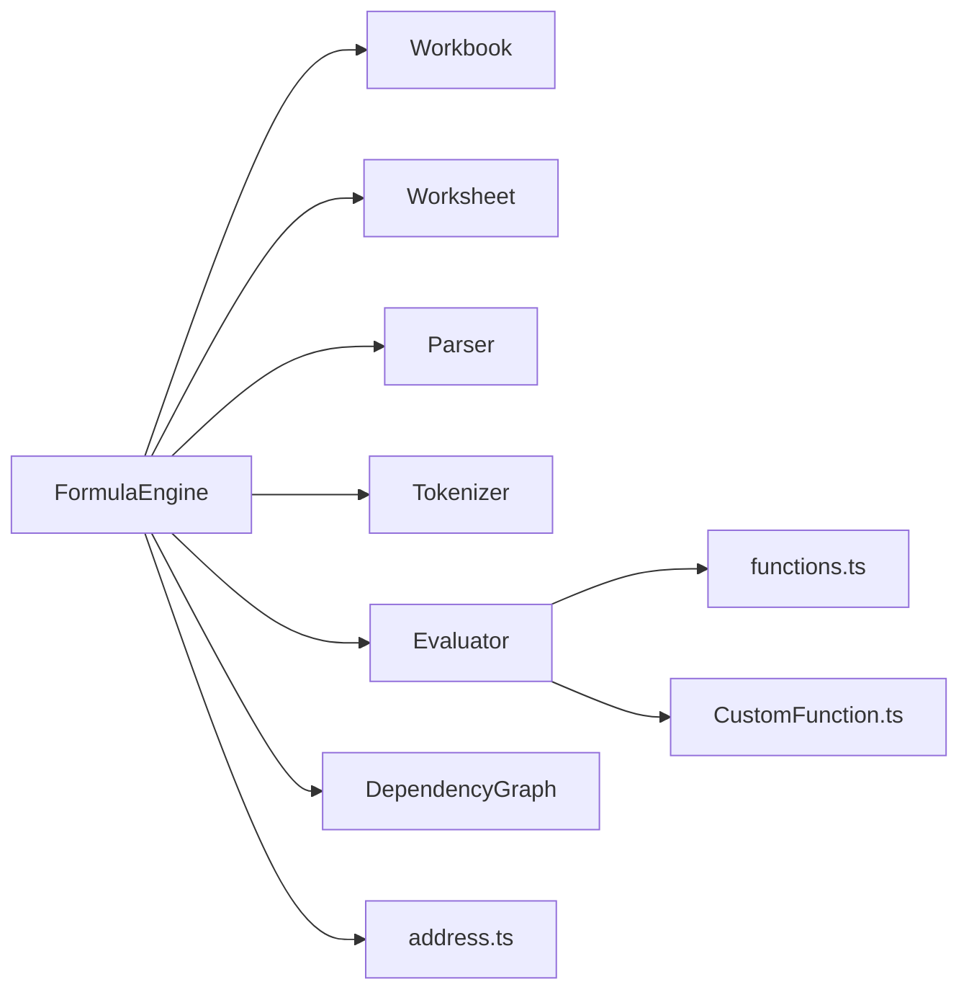

# 公式引擎核心

<cite>
**本文引用的文件**
- [FormulaEngine.ts](file://cmx-mega-sheet/src/formula/FormulaEngine.ts)
- [Parser.ts](file://cmx-mega-sheet/src/formula/Parser.ts)
- [Evaluator.ts](file://cmx-mega-sheet/src/formula/Evaluator.ts)
- [DependencyGraph.ts](file://cmx-mega-sheet/src/formula/DependencyGraph.ts)
- [Tokenizer.ts](file://cmx-mega-sheet/src/formula/Tokenizer.ts)
- [functions.ts](file://cmx-mega-sheet/src/formula/functions.ts)
- [CustomFunction.ts](file://cmx-mega-sheet/src/formula/CustomFunction.ts)
- [value.ts](file://cmx-mega-sheet/src/formula/value.ts)
- [Workbook.ts](file://cmx-mega-sheet/src/core/Workbook.ts)
- [Worksheet.ts](file://cmx-mega-sheet/src/core/Worksheet.ts)
- [address.ts](file://cmx-mega-sheet/src/core/address.ts)
- [FormulaEngine.test.ts](file://cmx-mega-sheet/test/FormulaEngine.test.ts)
- [FormulaEval.test.ts](file://cmx-mega-sheet/test/FormulaEval.test.ts)
</cite>

## 目录
1. [简介](#简介)
2. [项目结构](#项目结构)
3. [核心组件](#核心组件)
4. [架构总览](#架构总览)
5. [详细组件分析](#详细组件分析)
6. [依赖关系分析](#依赖关系分析)
7. [性能考量](#性能考量)
8. [故障排查指南](#故障排查指南)
9. [结论](#结论)
10. [附录](#附录)

## 简介
本文件面向公式引擎核心模块，围绕 FormulaEngine 类展开，系统阐述其初始化配置、工作簿绑定机制与生命周期管理；深入解析从字符串到 AST 的转换流程与解析缓存；对比全量重算（recalcAll）与增量重算（recalcCells）的执行策略差异，涵盖依赖图重建、拓扑排序与循环检测；说明求值上下文 EvalContext 的构建与使用，以及单元格访问器 CellAccessor 的工作原理；并提供范围钳制、内存管理与错误处理等性能优化实践。

## 项目结构
公式引擎位于 cmx-mega-sheet/src/formula 目录，采用分层设计：
- 词法分析：Tokenizer 将公式源串切分为 token 流
- 语法解析：Parser 基于 Pratt 优先级爬升将 token 流转换为 AST
- 求值执行：Evaluator 遍历 AST 并调用函数注册表进行求值
- 依赖管理：DependencyGraph 维护公式格之间的依赖关系，提供拓扑排序与环检测
- 函数库：functions.ts 集中注册内置函数；CustomFunction.ts 注册报表取数函数（QM/QC/JE/FS/REF）
- 编排层：FormulaEngine 将上述能力接入 Workbook/Worksheet，提供全量/增量重算与直接求值

图表来源
- [FormulaEngine.ts:15-28](file://cmx-mega-sheet/src/formula/FormulaEngine.ts#L15-L28)
- [Parser.ts:15-199](file://cmx-mega-sheet/src/formula/Parser.ts#L15-L199)
- [Evaluator.ts:11-55](file://cmx-mega-sheet/src/formula/Evaluator.ts#L11-L55)
- [DependencyGraph.ts:12-14](file://cmx-mega-sheet/src/formula/DependencyGraph.ts#L12-L14)
- [Tokenizer.ts:1-36](file://cmx-mega-sheet/src/formula/Tokenizer.ts#L1-L36)
- [functions.ts:1-43](file://cmx-mega-sheet/src/formula/functions.ts#L1-L43)
- [CustomFunction.ts:15-18](file://cmx-mega-sheet/src/formula/CustomFunction.ts#L15-L18)
- [address.ts](file://cmx-mega-sheet/src/core/address.ts)

章节来源
- [FormulaEngine.ts:1-54](file://cmx-mega-sheet/src/formula/FormulaEngine.ts#L1-L54)
- [Parser.ts:1-199](file://cmx-mega-sheet/src/formula/Parser.ts#L1-L199)
- [Evaluator.ts:1-55](file://cmx-mega-sheet/src/formula/Evaluator.ts#L1-L55)
- [DependencyGraph.ts:1-201](file://cmx-mega-sheet/src/formula/DependencyGraph.ts#L1-L201)
- [Tokenizer.ts:1-200](file://cmx-mega-sheet/src/formula/Tokenizer.ts#L1-L200)
- [functions.ts:1-355](file://cmx-mega-sheet/src/formula/functions.ts#L1-L355)
- [CustomFunction.ts:1-79](file://cmx-mega-sheet/src/formula/CustomFunction.ts#L1-L79)
- [value.ts:1-131](file://cmx-mega-sheet/src/formula/value.ts#L1-L131)

## 核心组件
- FormulaEngine：编排层，负责与工作簿绑定、扫描公式格、构建依赖图、拓扑重算、回填计算值、提供直接求值接口
- Parser：将公式字符串解析为 AST，支持中缀运算符、一元操作、数组字面量、引用与区域、命名标识
- Evaluator：AST 求值器，通过 CellAccessor 访问单元格/区域，通过 FunctionRegistry 调用函数实现
- DependencyGraph：维护公式格依赖关系，提供拓扑排序与三色 DFS 环检测，支持受影响闭包计算
- Tokenizer：词法分析，识别数字、字符串、引用、区域、运算符、括号、逗号等
- functions.ts：内置函数注册表，覆盖数学、统计、文本、查找、日期时间等常用函数族
- CustomFunction.ts：报表取数函数 QM/QC/JE/FS/REF，按所在格查 ReportValueMap，标记易变
- value.ts：公式值类型、错误值、强制转换与比较逻辑

章节来源
- [FormulaEngine.ts:36-54](file://cmx-mega-sheet/src/formula/FormulaEngine.ts#L36-L54)
- [Parser.ts:17-28](file://cmx-mega-sheet/src/formula/Parser.ts#L17-L28)
- [Evaluator.ts:21-55](file://cmx-mega-sheet/src/formula/Evaluator.ts#L21-L55)
- [DependencyGraph.ts:15-201](file://cmx-mega-sheet/src/formula/DependencyGraph.ts#L15-L201)
- [Tokenizer.ts:11-36](file://cmx-mega-sheet/src/formula/Tokenizer.ts#L11-L36)
- [functions.ts:63-355](file://cmx-mega-sheet/src/formula/functions.ts#L63-L355)
- [CustomFunction.ts:20-79](file://cmx-mega-sheet/src/formula/CustomFunction.ts#L20-L79)
- [value.ts:13-131](file://cmx-mega-sheet/src/formula/value.ts#L13-L131)

## 架构总览
FormulaEngine 作为编排层，将 Parser、Evaluator、DependencyGraph 与 Workbook/Worksheet 连接起来：
- 初始化时注册报表取数函数，创建 Evaluator，并在工作簿上设置重算钩子
- 全量重算时扫描所有工作表的公式格，解析并提取依赖，构建依赖图，拓扑排序后求值回填
- 增量重算时仅对受影响的种子格及其依赖者子集进行拓扑排序与求值
- 直接求值 evaluateFormula 用于预览或聚合场景，不写回单元格

图表来源
- [FormulaEngine.ts:47-54](file://cmx-mega-sheet/src/formula/FormulaEngine.ts#L47-L54)
- [FormulaEngine.ts:149-198](file://cmx-mega-sheet/src/formula/FormulaEngine.ts#L149-L198)
- [DependencyGraph.ts:163-199](file://cmx-mega-sheet/src/formula/DependencyGraph.ts#L163-L199)
- [Evaluator.ts:62-83](file://cmx-mega-sheet/src/formula/Evaluator.ts#L62-L83)
- [functions.ts:63-355](file://cmx-mega-sheet/src/formula/functions.ts#L63-L355)

## 详细组件分析

### FormulaEngine：初始化、绑定与生命周期
- 构造函数：注册报表取数函数，创建 Evaluator，设置 Workbook 的全量与增量重算钩子
- 生命周期：dispose 解除钩子，避免内存泄漏
- 报表值映射：setReportValueMap 注入 QM/QC/… 的值表并触发全量重算
- 单元格访问器：accessorFor 封装 getCellValue/getRangeValues/resolveNameRef，跨表引用解析与整列/整行范围钳制
- 解析缓存：parseCache 缓存 AST 或解析错误，减少重复解析开销
- 持久公式格注册表：formulaCellMap 记录每个公式格的 sheet、行列、AST，供增量重算快速定位
- 全量重算：recalcAll 扫描、建图、拓扑排序、环标记、求值回填
- 增量重算：recalcCells 维护图、计算受影响闭包、纳入易变节点、拓扑排序与求值
- 直接求值：evaluateFormula 构造 EvalContext 并求值，不落格

图表来源
- [FormulaEngine.ts:36-54](file://cmx-mega-sheet/src/formula/FormulaEngine.ts#L36-L54)
- [FormulaEngine.ts:62-143](file://cmx-mega-sheet/src/formula/FormulaEngine.ts#L62-L143)
- [FormulaEngine.ts:149-287](file://cmx-mega-sheet/src/formula/FormulaEngine.ts#L149-L287)
- [Workbook.ts](file://cmx-mega-sheet/src/core/Workbook.ts)
- [Worksheet.ts](file://cmx-mega-sheet/src/core/Worksheet.ts)

章节来源
- [FormulaEngine.ts:47-54](file://cmx-mega-sheet/src/formula/FormulaEngine.ts#L47-L54)
- [FormulaEngine.ts:62-143](file://cmx-mega-sheet/src/formula/FormulaEngine.ts#L62-L143)
- [FormulaEngine.ts:149-287](file://cmx-mega-sheet/src/formula/FormulaEngine.ts#L149-L287)

### 公式解析流程：字符串 → AST 与解析缓存
- Tokenizer：识别数字、字符串、引用、区域、运算符、括号、逗号、分号、冒号、百分号等
- Parser：Pratt 优先级爬升，支持中缀运算符、一元正负、尾随百分号、函数调用、引用/区域、数组字面量、命名标识
- AST 节点：number/string/ref/range/array/name/unary/binary/call
- 解析缓存：FormulaEngine.parse 将相同公式字符串的 AST 或错误缓存到 Map，避免重复解析

图表来源
- [Tokenizer.ts:61-188](file://cmx-mega-sheet/src/formula/Tokenizer.ts#L61-L188)
- [Parser.ts:58-199](file://cmx-mega-sheet/src/formula/Parser.ts#L58-L199)
- [FormulaEngine.ts:69-80](file://cmx-mega-sheet/src/formula/FormulaEngine.ts#L69-L80)

章节来源
- [Tokenizer.ts:1-200](file://cmx-mega-sheet/src/formula/Tokenizer.ts#L1-L200)
- [Parser.ts:1-199](file://cmx-mega-sheet/src/formula/Parser.ts#L1-L199)
- [FormulaEngine.ts:69-80](file://cmx-mega-sheet/src/formula/FormulaEngine.ts#L69-L80)

### 依赖图、拓扑排序与循环检测
- 依赖抽取：extractDeps 遍历 AST，收集 ref 与 range 依赖，整列/整行按 bounds 钳制到 sheet 维度
- 依赖图：DependencyGraph 维护 deps 与 dependents，支持 setDeps/clearDeps/affectedBy/topoSort
- 拓扑排序：topoSort 使用三色 DFS（白/灰/黑），在目标集合内排序，环上节点收集到 cyclic
- 环检测：灰→灰即环，path 中从 dep 到当前节点的所有格标记为环上，最终写 #CIRC!

图表来源
- [DependencyGraph.ts:26-94](file://cmx-mega-sheet/src/formula/DependencyGraph.ts#L26-L94)
- [DependencyGraph.ts:146-199](file://cmx-mega-sheet/src/formula/DependencyGraph.ts#L146-L199)
- [FormulaEngine.ts:149-198](file://cmx-mega-sheet/src/formula/FormulaEngine.ts#L149-L198)
- [FormulaEngine.ts:206-243](file://cmx-mega-sheet/src/formula/FormulaEngine.ts#L206-L243)

章节来源
- [DependencyGraph.ts:15-201](file://cmx-mega-sheet/src/formula/DependencyGraph.ts#L15-L201)
- [FormulaEngine.ts:149-243](file://cmx-mega-sheet/src/formula/FormulaEngine.ts#L149-L243)

### 全量重算 vs 增量重算
- 全量重算（recalcAll）：
  - 扫描所有工作表公式格，清空并重建依赖图
  - 对所有公式格拓扑排序，环上格标记 #CIRC!
  - 按拓扑序求值并回填计算值
- 增量重算（recalcCells）：
  - 若图未建立则退化全量
  - 对种子格进行图增量维护：更新解析与出边，或移除旧公式
  - 计算受影响闭包（含种子自身若是公式），并纳入易变节点
  - 对受影响子集拓扑排序、环标记、求值回填
- 复杂度差异：全量为 O(全簿公式格)，增量为 O(受影响子集)

图表来源
- [FormulaEngine.ts:149-198](file://cmx-mega-sheet/src/formula/FormulaEngine.ts#L149-L198)
- [FormulaEngine.ts:206-243](file://cmx-mega-sheet/src/formula/FormulaEngine.ts#L206-L243)
- [DependencyGraph.ts:146-199](file://cmx-mega-sheet/src/formula/DependencyGraph.ts#L146-L199)

章节来源
- [FormulaEngine.ts:149-243](file://cmx-mega-sheet/src/formula/FormulaEngine.ts#L149-L243)
- [DependencyGraph.ts:146-199](file://cmx-mega-sheet/src/formula/DependencyGraph.ts#L146-L199)

### 求值上下文 EvalContext 与单元格访问器 CellAccessor
- EvalContext：包含 accessor、当前行/列、sheetName，供上下文敏感函数（如 ROW/COLUMN、QM/QC/…）使用
- CellAccessor：
  - getCellValue：解析引用（含跨表），越界/无效返回 #REF!
  - getRangeValues：解析区域端点，整列/整行钳到 sheet 维度，避免遍历百万格
  - resolveNameRef：命名区域解析为引用文本，再按 ref/range 求值
- 示例：测试中使用 makeAccessor 模拟单元格访问，验证 Evaluator 的行为

图表来源
- [Evaluator.ts:21-41](file://cmx-mega-sheet/src/formula/Evaluator.ts#L21-L41)
- [Evaluator.ts:62-83](file://cmx-mega-sheet/src/formula/Evaluator.ts#L62-L83)
- [FormulaEngine.ts:82-115](file://cmx-mega-sheet/src/formula/FormulaEngine.ts#L82-L115)
- [FormulaEval.test.ts:8-40](file://cmx-mega-sheet/test/FormulaEval.test.ts#L8-L40)

章节来源
- [Evaluator.ts:21-83](file://cmx-mega-sheet/src/formula/Evaluator.ts#L21-L83)
- [FormulaEngine.ts:82-115](file://cmx-mega-sheet/src/formula/FormulaEngine.ts#L82-L115)
- [FormulaEval.test.ts:8-40](file://cmx-mega-sheet/test/FormulaEval.test.ts#L8-L40)

### 内置函数与报表取数函数
- 内置函数：functions.ts 注册大量函数，覆盖数学、统计、文本、查找、日期时间等族，支持多条件聚合、SUBTOTAL、TEXT 格式化等
- 报表取数函数：CustomFunction.ts 注册 QM/QC/JE/FS/REF，按所在格查 ReportValueMap，标记易变，缺/空/非数值返回 0
- 易变性：isVolatileAst 递归检查 AST 是否包含易变函数，增量重算时每次纳入

章节来源
- [functions.ts:63-355](file://cmx-mega-sheet/src/formula/functions.ts#L63-L355)
- [CustomFunction.ts:20-79](file://cmx-mega-sheet/src/formula/CustomFunction.ts#L20-L79)
- [FormulaEngine.ts:245-257](file://cmx-mega-sheet/src/formula/FormulaEngine.ts#L245-L257)

## 依赖关系分析
- FormulaEngine 依赖：
  - Workbook/Worksheet：获取工作表、名称解析、重算钩子、单元格读写
  - Parser/Tokenizer：公式解析与词法分析
  - Evaluator：AST 求值
  - DependencyGraph：依赖图、拓扑排序、环检测
  - functions.ts/CustomFunction.ts：函数实现与报表取数
  - address.ts：地址解析与列标签转换
- 耦合与内聚：
  - FormulaEngine 高内聚于编排职责，低耦合于具体实现（通过抽象接口 CellAccessor/FunctionRegistry）
  - Evaluator 与函数解耦，便于扩展与测试
  - DependencyGraph 纯逻辑，可独立单测

图表来源
- [FormulaEngine.ts:15-28](file://cmx-mega-sheet/src/formula/FormulaEngine.ts#L15-L28)
- [Evaluator.ts:11-55](file://cmx-mega-sheet/src/formula/Evaluator.ts#L11-L55)
- [DependencyGraph.ts:12-14](file://cmx-mega-sheet/src/formula/DependencyGraph.ts#L12-L14)
- [functions.ts:1-43](file://cmx-mega-sheet/src/formula/functions.ts#L1-L43)
- [CustomFunction.ts:15-18](file://cmx-mega-sheet/src/formula/CustomFunction.ts#L15-L18)
- [address.ts](file://cmx-mega-sheet/src/core/address.ts)

章节来源
- [FormulaEngine.ts:15-28](file://cmx-mega-sheet/src/formula/FormulaEngine.ts#L15-L28)
- [Evaluator.ts:11-55](file://cmx-mega-sheet/src/formula/Evaluator.ts#L11-L55)
- [DependencyGraph.ts:12-14](file://cmx-mega-sheet/src/formula/DependencyGraph.ts#L12-L14)
- [functions.ts:1-43](file://cmx-mega-sheet/src/formula/functions.ts#L1-L43)
- [CustomFunction.ts:15-18](file://cmx-mega-sheet/src/formula/CustomFunction.ts#L15-L18)

## 性能考量
- 范围钳制：
  - 整列/整行区域在 getRangeValues 与 extractDeps 中钳到 sheet 维度，避免遍历百万格
  - 参考路径：[FormulaEngine.ts:93-112](file://cmx-mega-sheet/src/formula/FormulaEngine.ts#L93-L112)、[DependencyGraph.ts:75-86](file://cmx-mega-sheet/src/formula/DependencyGraph.ts#L75-L86)
- 解析缓存：
  - parseCache 缓存 AST 或解析错误，减少重复解析开销
  - 参考路径：[FormulaEngine.ts:69-80](file://cmx-mega-sheet/src/formula/FormulaEngine.ts#L69-L80)
- 内存管理：
  - dispose 解除 Workbook 重算钩子，避免内存泄漏
  - 依赖图 clearAll 在全量重算前清空，避免累积
  - 参考路径：[FormulaEngine.ts:56-60](file://cmx-mega-sheet/src/formula/FormulaEngine.ts#L56-L60)、[DependencyGraph.ts:131-135](file://cmx-mega-sheet/src/formula/DependencyGraph.ts#L131-L135)
- 错误处理最佳实践：
  - 算术运算中除零返回 #DIV/0!，幂溢出返回 #NUM!
  - 未知函数返回 #NAME?，求值异常捕获返回 #VALUE!
  - 环检测标记 #CIRC!
  - 参考路径：[Evaluator.ts:116-157](file://cmx-mega-sheet/src/formula/Evaluator.ts#L116-L157)、[value.ts:13-32](file://cmx-mega-sheet/src/formula/value.ts#L13-L32)
- 增量重算优化：
  - 仅重算受影响闭包，降低大表编辑成本
  - 易变节点每次纳入，保证 QM/QC/… 实时性
  - 参考路径：[FormulaEngine.ts:206-243](file://cmx-mega-sheet/src/formula/FormulaEngine.ts#L206-L243)

章节来源
- [FormulaEngine.ts:56-80](file://cmx-mega-sheet/src/formula/FormulaEngine.ts#L56-L80)
- [FormulaEngine.ts:93-112](file://cmx-mega-sheet/src/formula/FormulaEngine.ts#L93-L112)
- [DependencyGraph.ts:75-86](file://cmx-mega-sheet/src/formula/DependencyGraph.ts#L75-L86)
- [Evaluator.ts:116-157](file://cmx-mega-sheet/src/formula/Evaluator.ts#L116-L157)
- [value.ts:13-32](file://cmx-mega-sheet/src/formula/value.ts#L13-L32)
- [FormulaEngine.ts:206-243](file://cmx-mega-sheet/src/formula/FormulaEngine.ts#L206-L243)

## 故障排查指南
- 循环引用：
  - 现象：单元格显示 #CIRC!
  - 原因：依赖图中存在环，topoSort 检测到灰→灰
  - 排查：检查相互引用的公式格，调整依赖关系
  - 参考路径：[DependencyGraph.ts:163-199](file://cmx-mega-sheet/src/formula/DependencyGraph.ts#L163-L199)、[FormulaEngine.ts:183-187](file://cmx-mega-sheet/src/formula/FormulaEngine.ts#L183-L187)
- 除零错误：
  - 现象：#DIV/0!
  - 原因：除法运算分母为 0
  - 排查：检查被除数与除数，必要时用 IFERROR 包裹
  - 参考路径：[Evaluator.ts:135-143](file://cmx-mega-sheet/src/formula/Evaluator.ts#L135-L143)
- 未知函数：
  - 现象：#NAME?
  - 原因：函数名未注册或拼写错误
  - 排查：确认函数是否在 functions.ts 或 CustomFunction.ts 中注册
  - 参考路径：[Evaluator.ts:148-157](file://cmx-mega-sheet/src/formula/Evaluator.ts#L148-L157)
- 引用无效：
  - 现象：#REF!
  - 原因：跨表引用不存在或行列越界
  - 排查：检查工作表名称与行列索引
  - 参考路径：[FormulaEngine.ts:87-92](file://cmx-mega-sheet/src/formula/FormulaEngine.ts#L87-L92)

章节来源
- [DependencyGraph.ts:163-199](file://cmx-mega-sheet/src/formula/DependencyGraph.ts#L163-L199)
- [FormulaEngine.ts:183-187](file://cmx-mega-sheet/src/formula/FormulaEngine.ts#L183-L187)
- [Evaluator.ts:135-157](file://cmx-mega-sheet/src/formula/Evaluator.ts#L135-L157)
- [FormulaEngine.ts:87-92](file://cmx-mega-sheet/src/formula/FormulaEngine.ts#L87-L92)

## 结论
FormulaEngine 以清晰的编排职责将公式解析、求值、依赖管理与工作簿交互整合，提供高效的全量与增量重算能力。通过 AST 解析缓存、范围钳制、易变节点识别与三色 DFS 环检测，系统在正确性与性能之间取得平衡。结合丰富的内置函数与报表取数函数，满足复杂业务场景下的公式计算需求。

## 附录
- 端到端测试用例：
  - 基础求值、链式传播、循环引用、IF/ROUND 嵌套、除零错误、跨表引用、命名区域与整列聚合、数组字面量
  - 参考路径：[FormulaEngine.test.ts:14-161](file://cmx-mega-sheet/test/FormulaEngine.test.ts#L14-L161)
- 求值器单元测试：
  - 值转换、算术、引用与区域、内置函数、易变函数注册
  - 参考路径：[FormulaEval.test.ts:42-173](file://cmx-mega-sheet/test/FormulaEval.test.ts#L42-L173)

章节来源
- [FormulaEngine.test.ts:14-161](file://cmx-mega-sheet/test/FormulaEngine.test.ts#L14-L161)
- [FormulaEval.test.ts:42-173](file://cmx-mega-sheet/test/FormulaEval.test.ts#L42-L173)