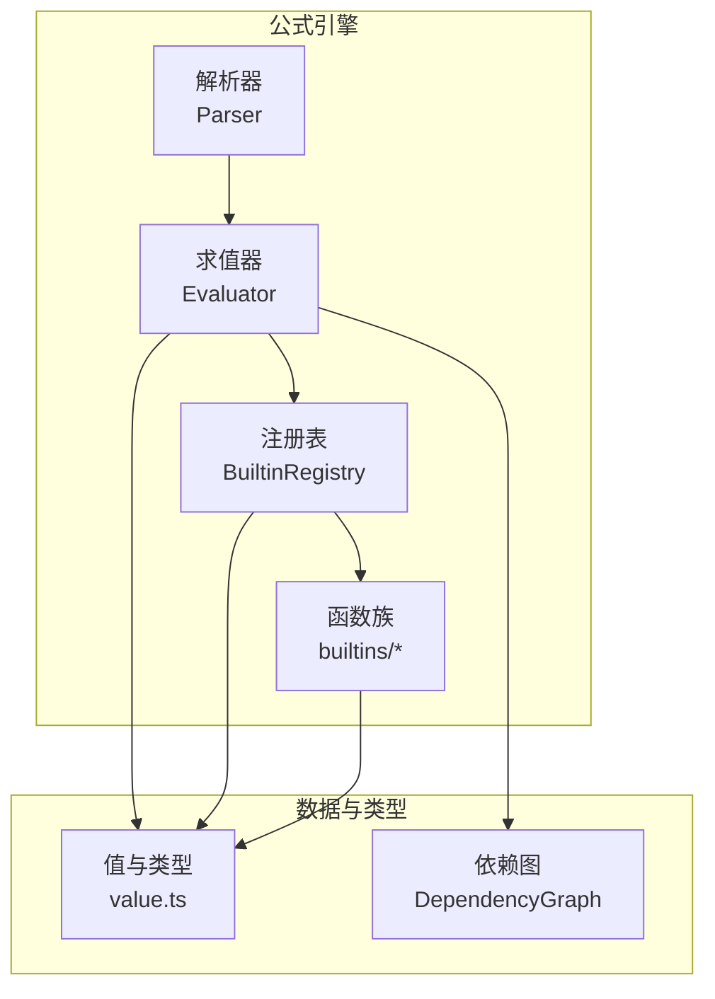
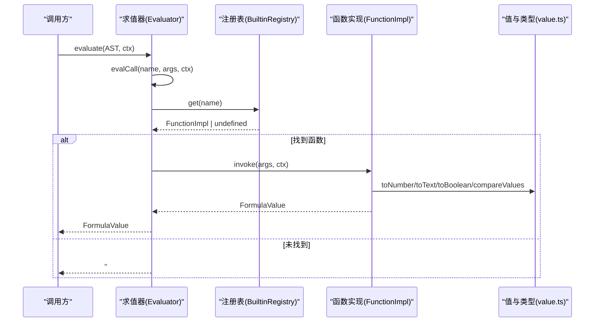
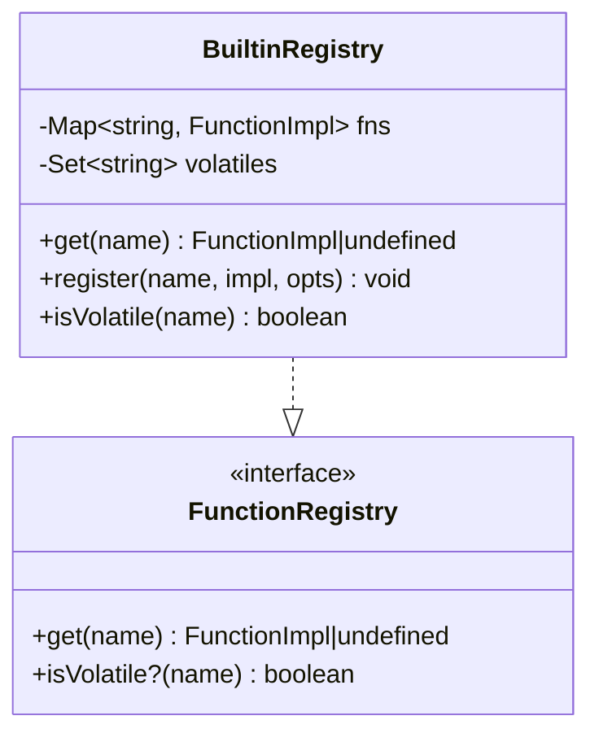
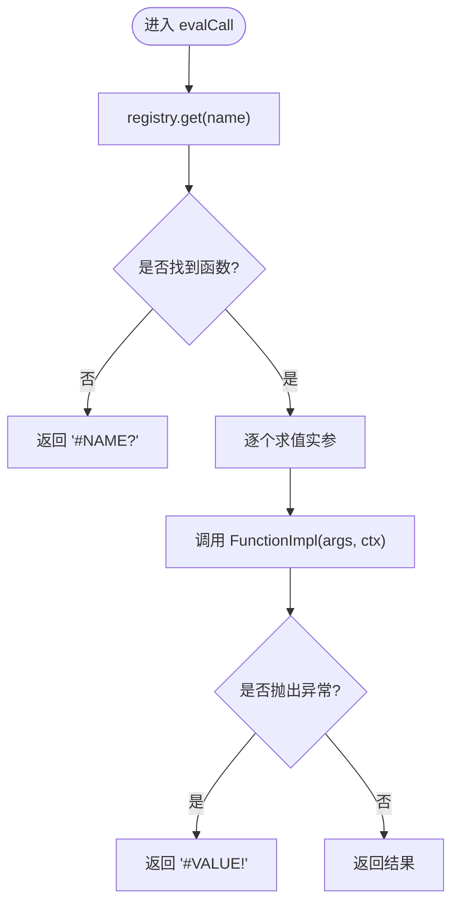
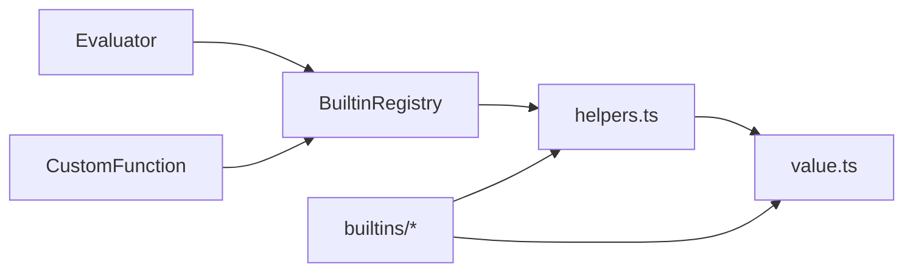

# 函数注册中心

<cite>
**本文引用的文件**
- [functions.ts](file://cmx-mega-sheet/src/formula/functions.ts)
- [Evaluator.ts](file://cmx-mega-sheet/src/formula/Evaluator.ts)
- [CustomFunction.ts](file://cmx-mega-sheet/src/formula/CustomFunction.ts)
- [math.ts](file://cmx-mega-sheet/src/formula/builtins/math.ts)
- [financial.ts](file://cmx-mega-sheet/src/formula/builtins/financial.ts)
- [textref.ts](file://cmx-mega-sheet/src/formula/builtins/textref.ts)
- [helpers.ts](file://cmx-mega-sheet/src/formula/builtins/helpers.ts)
- [value.ts](file://cmx-mega-sheet/src/formula/value.ts)
- [DependencyGraph.ts](file://cmx-mega-sheet/src/formula/DependencyGraph.ts)
- [functionsM17.test.ts](file://cmx-mega-sheet/test/functionsM17.test.ts)
</cite>

## 目录
1. [简介](#简介)
2. [项目结构](#项目结构)
3. [核心组件](#核心组件)
4. [架构总览](#架构总览)
5. [详细组件分析](#详细组件分析)
6. [依赖关系分析](#依赖关系分析)
7. [性能考量](#性能考量)
8. [故障排查指南](#故障排查指南)
9. [结论](#结论)
10. [附录](#附录)

## 简介
本文件为“函数注册中心”的权威技术文档，聚焦 BuiltinRegistry 类的架构设计与实现机制，覆盖函数发现、注册与调用流程；系统梳理内置函数库的组织结构（数学、财务、统计、数据库、文本/引用、工程）；说明函数签名验证、参数类型检查与错误处理策略；提供自定义函数开发指南（接口规范、异步支持建议、性能优化技巧）；解释 volatile（易变）函数的特殊处理及其在增量计算中的行为；并给出调试工具与性能分析方法、扩展最佳实践与常见问题解决方案。

## 项目结构
公式子系统位于 cmx-mega-sheet 的 formula 模块中，采用“解析—求值—注册表—函数族”的分层组织：
- 解析与求值：Parser/AstNode → Evaluator（AST 求值器）
- 注册表：BuiltinRegistry（内置函数注册表，可叠加自定义函数）
- 函数族：builtins/*（按领域拆分，统一汇入注册表）
- 值与类型：value.ts（FormulaValue、错误类型、转换与比较）
- 依赖图：DependencyGraph（用于增量重算与环检测）
- 报表取数：CustomFunction.ts（QM/QC/JE/FS/REF 等上下文敏感、易变的取数函数）

图表来源
- [Evaluator.ts:59-157](file://cmx-mega-sheet/src/formula/Evaluator.ts#L59-L157)
- [functions.ts:1117-1137](file://cmx-mega-sheet/src/formula/functions.ts#L1117-L1137)
- [value.ts:13-32](file://cmx-mega-sheet/src/formula/value.ts#L13-L32)

章节来源
- [Evaluator.ts:1-199](file://cmx-mega-sheet/src/formula/Evaluator.ts#L1-L199)
- [functions.ts:1-355](file://cmx-mega-sheet/src/formula/functions.ts#L1-L355)

## 核心组件
- BuiltinRegistry：实现 FunctionRegistry 接口，维护函数名到实现的映射，支持注册/覆盖、大小写不敏感查找、易变函数标记。
- Evaluator：AST 求值器，负责名称解析、引用/区域取值、二元/一元运算、函数调用封装与错误传播。
- 函数族 builtins/*：按领域拆分的函数集合，统一以 Record<string, FunctionImpl> 形式导出，由 functions.ts 合并入 BUILTINS。
- value.ts：定义 FormulaValue、FormulaError、类型转换与比较规则，保证 Excel 语义一致性。
- CustomFunction.ts：将 QM/QC/JE/FS/REF 注册为易变函数，基于 ReportValueMap 按当前格取数。
- DependencyGraph：记录公式格依赖关系，支持拓扑排序与环检测，支撑增量重算。

章节来源
- [functions.ts:1117-1137](file://cmx-mega-sheet/src/formula/functions.ts#L1117-L1137)
- [Evaluator.ts:59-157](file://cmx-mega-sheet/src/formula/Evaluator.ts#L59-L157)
- [value.ts:13-32](file://cmx-mega-sheet/src/formula/value.ts#L13-L32)
- [CustomFunction.ts:71-78](file://cmx-mega-sheet/src/formula/CustomFunction.ts#L71-L78)
- [DependencyGraph.ts:100-136](file://cmx-mega-sheet/src/formula/DependencyGraph.ts#L100-L136)

## 架构总览
下图展示了从公式解析到函数调用的完整链路，以及注册表如何统一管理内置与自定义函数。

图表来源
- [Evaluator.ts:148-157](file://cmx-mega-sheet/src/formula/Evaluator.ts#L148-L157)
- [functions.ts:1117-1137](file://cmx-mega-sheet/src/formula/functions.ts#L1117-L1137)
- [value.ts:42-75](file://cmx-mega-sheet/src/formula/value.ts#L42-L75)

## 详细组件分析

### BuiltinRegistry 类设计
- 职责
  - 维护函数名到实现的映射 Map<string, FunctionImpl>
  - 维护易变函数集合 Set<string>
  - 提供 get/register/isVolatile 方法
- 特性
  - 构造函数自动载入所有内置函数（BUILTINS），键名统一大写
  - register 支持覆盖已有函数，并可标记为易变
  - isVolatile 用于依赖图在增量重算时强制纳入
- 复杂度
  - get/register/isVolatile 均为 O(1)
  - 内存占用与函数数量线性相关

图表来源
- [functions.ts:1117-1137](file://cmx-mega-sheet/src/formula/functions.ts#L1117-L1137)

章节来源
- [functions.ts:1117-1137](file://cmx-mega-sheet/src/formula/functions.ts#L1117-L1137)

### 函数发现与调用机制
- 发现
  - 通过 Evaluator.evalCall 调用 registry.get(name)，大小写不敏感
  - 若未找到返回 #NAME?
- 调用
  - 先对每个 AST 节点求值，得到 EvaluatedArg（标量或区域二维数组）
  - 调用 FunctionImpl(args, ctx)，捕获异常并转为 #VALUE!
- 上下文
  - EvalContext 包含 accessor、row、col、sheetName，供上下文敏感函数使用

图表来源
- [Evaluator.ts:148-157](file://cmx-mega-sheet/src/formula/Evaluator.ts#L148-L157)

章节来源
- [Evaluator.ts:59-157](file://cmx-mega-sheet/src/formula/Evaluator.ts#L59-L157)

### 内置函数库组织结构
- 数学族（builtins/math.ts）
  - 三角、指数/对数、角度、组合数学、取整兄弟、进制转换、幂级数、随机
- 财务族（builtins/financial.ts）
  - 年金（PMT/PV/FV/NPER/RATE）、投资评估（NPV/IRR/XNPV/XIRR/MIRR）、折旧（SLN/SYD/DB/DDB）、利率换算（EFFECT/NOMINAL）、分数价格（DOLLARDE/DOLLARFR）、PDURATION/RRI
- 统计族（builtins/statistical.ts）
  - 聚合与分布相关函数（由 functions.ts 汇总）
- 数据库族（builtins/database.ts）
  - 条件聚合（SUMIFS/COUNTIFS/AVERAGEIF(S)/MAXIFS/MINIFS）等
- 文本/引用族（builtins/textref.ts）
  - TEXTBEFORE/TEXTAFTER/FIXED/DOLLAR/CLEAN、ADDRESS/INDIRECT、XOR/ERROR.TYPE/ISREF
- 工程族（builtins/engineering.ts）
  - 工程/日期相关函数（由 functions.ts 汇总）
- 汇聚点（functions.ts）
  - 将各族导出对象展开合并至 BUILTINS，形成统一注册表

章节来源
- [functions.ts:346-355](file://cmx-mega-sheet/src/formula/functions.ts#L346-L355)
- [math.ts:127-264](file://cmx-mega-sheet/src/formula/builtins/math.ts#L127-L264)
- [financial.ts:131-345](file://cmx-mega-sheet/src/formula/builtins/financial.ts#L131-L345)
- [textref.ts:141-188](file://cmx-mega-sheet/src/formula/builtins/textref.ts#L141-L188)

### 函数签名验证、参数类型检查与错误处理
- 参数类型检查
  - helpers.ts 提供 reqNum/optNum/collectNumbers/strictNumbers 等工具，统一进行数值提取与校验
  - value.ts 提供 toNumber/toText/toBoolean，遵循 Excel 语义（空→0，布尔→1/0，非数值文本→#VALUE!）
- 错误处理
  - 错误值透传：算术/逻辑链路上遇到错误立即短路
  - 未知函数返回 #NAME?
  - 调用异常捕获并返回 #VALUE!
  - 域外输入返回 #NUM!（如负数开方、除零等）
- 示例路径
  - 数值转换与比较：[value.ts:42-75](file://cmx-mega-sheet/src/formula/value.ts#L42-L75)
  - 严格数值校验：[helpers.ts:68-79](file://cmx-mega-sheet/src/formula/builtins/helpers.ts#L68-L79)
  - 函数调用异常保护：[Evaluator.ts:148-157](file://cmx-mega-sheet/src/formula/Evaluator.ts#L148-L157)

章节来源
- [value.ts:42-75](file://cmx-mega-sheet/src/formula/value.ts#L42-L75)
- [helpers.ts:37-79](file://cmx-mega-sheet/src/formula/builtins/helpers.ts#L37-L79)
- [Evaluator.ts:148-157](file://cmx-mega-sheet/src/formula/Evaluator.ts#L148-L157)

### 自定义函数开发指南
- 接口规范
  - 函数实现类型为 FunctionImpl：接收 EvaluatedArg[] 与 EvalContext，返回 FormulaValue
  - 可通过 BuiltinRegistry.register(name, impl, opts?) 注册，opts.volatile=true 标记为易变
- 上下文敏感函数
  - 使用 EvalContext.row/col/sheetName 获取当前格信息，适合按格取数场景（如 QM/QC/JE/FS/REF）
- 异步函数支持
  - 当前求值器同步执行，不支持 Promise；如需异步，应在上层调度（例如事件驱动或批处理队列），并在回调中触发依赖图更新与重算
- 性能优化技巧
  - 避免重复计算：缓存中间结果（注意线程安全与上下文隔离）
  - 批量处理区域：优先使用 flattenArg/flattenArgs 一次性展平区域
  - 减少字符串操作：尽量使用数值计算，必要时再转文本
  - 控制错误传播：尽早返回错误，避免后续无谓计算
- 参考路径
  - 注册与易变标记：[functions.ts:1130-1135](file://cmx-mega-sheet/src/formula/functions.ts#L1130-L1135)
  - 上下文敏感实现示例：[CustomFunction.ts:71-78](file://cmx-mega-sheet/src/formula/CustomFunction.ts#L71-L78)

章节来源
- [Evaluator.ts:43-55](file://cmx-mega-sheet/src/formula/Evaluator.ts#L43-L55)
- [functions.ts:1130-1135](file://cmx-mega-sheet/src/formula/functions.ts#L1130-L1135)
- [CustomFunction.ts:71-78](file://cmx-mega-sheet/src/formula/CustomFunction.ts#L71-L78)

### volatile 函数的特殊处理与增量计算行为
- 易变函数定义
  - 通过 register(..., { volatile: true }) 标记，isVolatile(name) 返回 true
- 增量计算影响
  - 依赖图在拓扑排序与脏传播时，会将易变函数视为“每次重算都需重新求值”，确保依赖其结果的单元格及时更新
  - 对于上下文敏感函数（如 QM/QC/…），即使依赖未变化，也需在值表更新后重算
- 行为要点
  - 易变函数不参与“仅当依赖变更才重算”的优化
  - 在大规模网格中谨慎使用易变函数，避免频繁重算导致性能下降

章节来源
- [functions.ts:1130-1137](file://cmx-mega-sheet/src/formula/functions.ts#L1130-L1137)
- [CustomFunction.ts:71-78](file://cmx-mega-sheet/src/formula/CustomFunction.ts#L71-L78)
- [DependencyGraph.ts:92-136](file://cmx-mega-sheet/src/formula/DependencyGraph.ts#L92-L136)

### 调试工具与性能分析技术
- 调试
  - 使用 ReportValueMap.raw() 查看取数映射内容，辅助定位 QM/QC/… 取值问题
  - 通过测试用例快速验证函数行为（如 functionsM17.test.ts）
- 性能分析
  - 关注易变函数使用频率与范围，尽量减少全局易变
  - 利用依赖图 topological sort 与 affectedBy 精准定位受影响单元格
  - 对大区域函数（如 SUMIFS/COUNTIFS）优先使用向量化/批量处理
- 参考路径
  - 调试输出：[CustomFunction.ts:57-60](file://cmx-mega-sheet/src/formula/CustomFunction.ts#L57-L60)
  - 测试断言与规模验证：[functionsM17.test.ts:41-52](file://cmx-mega-sheet/test/functionsM17.test.ts#L41-L52)

章节来源
- [CustomFunction.ts:57-60](file://cmx-mega-sheet/src/formula/CustomFunction.ts#L57-L60)
- [functionsM17.test.ts:41-52](file://cmx-mega-sheet/test/functionsM17.test.ts#L41-L52)

## 依赖关系分析
- 组件耦合
  - Evaluator 依赖 FunctionRegistry 抽象，解耦具体实现
  - BuiltinRegistry 依赖 value.ts 的类型转换与错误判断
  - 各函数族依赖 helpers.ts 的参数提取与校验工具
- 直接/间接依赖
  - 函数族 → helpers.ts → value.ts
  - Evaluator → value.ts（类型转换与比较）
  - CustomFunction → BuiltinRegistry（注册易变函数）
- 外部集成点
  - CellAccessor（由 Worksheet 等接入层提供）
  - ReportValueMap（由后端 setReportValueMap 注入）
- 循环依赖
  - 未发现循环依赖；模块边界清晰

图表来源
- [Evaluator.ts:59-157](file://cmx-mega-sheet/src/formula/Evaluator.ts#L59-L157)
- [functions.ts:1117-1137](file://cmx-mega-sheet/src/formula/functions.ts#L1117-L1137)
- [helpers.ts:12-24](file://cmx-mega-sheet/src/formula/builtins/helpers.ts#L12-L24)
- [value.ts:13-32](file://cmx-mega-sheet/src/formula/value.ts#L13-L32)
- [CustomFunction.ts:71-78](file://cmx-mega-sheet/src/formula/CustomFunction.ts#L71-L78)

章节来源
- [Evaluator.ts:59-157](file://cmx-mega-sheet/src/formula/Evaluator.ts#L59-L157)
- [functions.ts:1117-1137](file://cmx-mega-sheet/src/formula/functions.ts#L1117-L1137)
- [helpers.ts:12-24](file://cmx-mega-sheet/src/formula/builtins/helpers.ts#L12-L24)
- [value.ts:13-32](file://cmx-mega-sheet/src/formula/value.ts#L13-L32)
- [CustomFunction.ts:71-78](file://cmx-mega-sheet/src/formula/CustomFunction.ts#L71-L78)

## 性能考量
- 时间复杂度
  - 注册表操作 O(1)
  - 函数调用取决于参数规模（区域展平与遍历）
- 空间复杂度
  - 区域二维数组在内存中保留，注意大区域带来的内存压力
- 优化建议
  - 使用 strictNumbers/collectNumbers 减少无效计算
  - 避免不必要的字符串转换
  - 谨慎使用易变函数，尤其是全局范围
  - 批量处理区域，减少多次小范围访问

## 故障排查指南
- 常见错误
  - #NAME?：函数名不存在或未注册
  - #VALUE!：参数类型不匹配或调用异常
  - #NUM!：数值域外（如负数开方、除零）
  - #DIV/0!：除数为零
  - #N/A：未找到匹配项
- 排查步骤
  - 确认函数已注册且名称正确（大小写不敏感）
  - 检查参数类型与范围（使用 helpers.ts 工具）
  - 查看 ReportValueMap.raw() 确认取数映射
  - 使用测试用例复现问题（functionsM17.test.ts）
- 参考路径
  - 错误类型定义：[value.ts:13-32](file://cmx-mega-sheet/src/formula/value.ts#L13-L32)
  - 函数调用异常保护：[Evaluator.ts:148-157](file://cmx-mega-sheet/src/formula/Evaluator.ts#L148-L157)
  - 取数映射调试：[CustomFunction.ts:57-60](file://cmx-mega-sheet/src/formula/CustomFunction.ts#L57-L60)

章节来源
- [value.ts:13-32](file://cmx-mega-sheet/src/formula/value.ts#L13-L32)
- [Evaluator.ts:148-157](file://cmx-mega-sheet/src/formula/Evaluator.ts#L148-L157)
- [CustomFunction.ts:57-60](file://cmx-mega-sheet/src/formula/CustomFunction.ts#L57-L60)

## 结论
BuiltinRegistry 作为函数注册中心，提供了稳定、可扩展的函数管理机制，结合 Evaluator 的 AST 求值与 value.ts 的类型系统，实现了与 Excel 语义一致的函数行为。通过按领域拆分的函数族，系统具备良好的可维护性与扩展性。volatile 函数在增量计算中确保依赖更新的及时性，但需谨慎使用以避免性能瓶颈。借助调试工具与性能分析方法，开发者可以高效地构建、优化和排错自定义函数。

## 附录
- 最佳实践
  - 将函数族按领域拆分，便于维护与测试
  - 使用 helpers.ts 的工具函数统一参数校验
  - 对上下文敏感函数使用易变标记，确保依赖图正确更新
  - 避免在热路径中使用高开销的字符串操作
- 常见问题
  - 函数未生效：检查是否已注册且名称正确
  - 性能下降：减少易变函数使用，优化区域处理
  - 类型错误：使用 toNumber/toText/toBoolean 进行显式转换