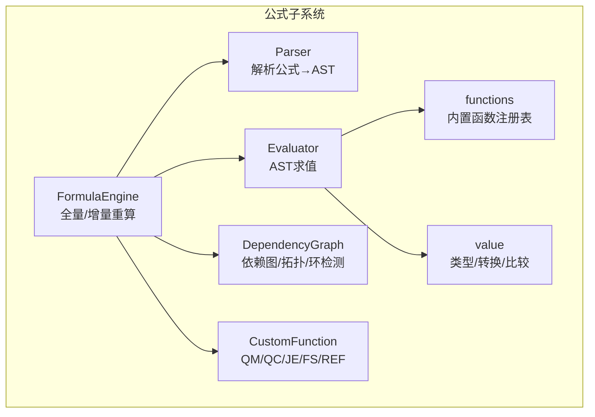
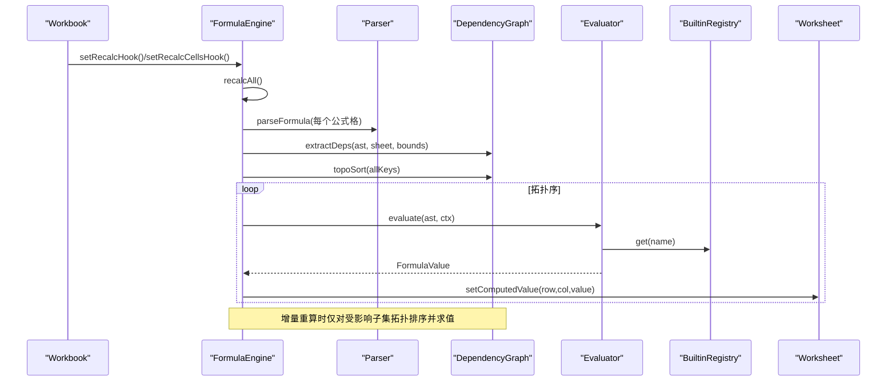
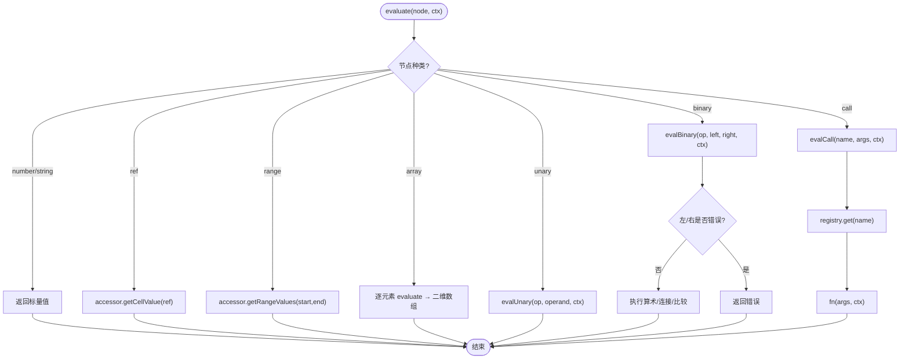
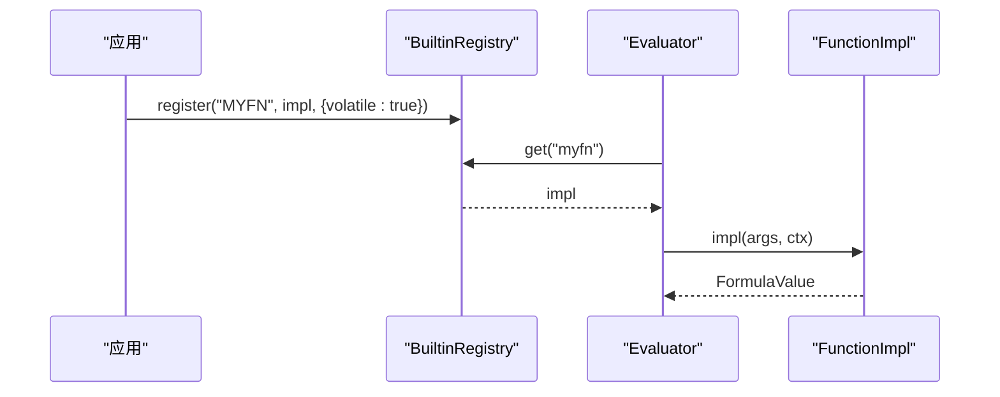
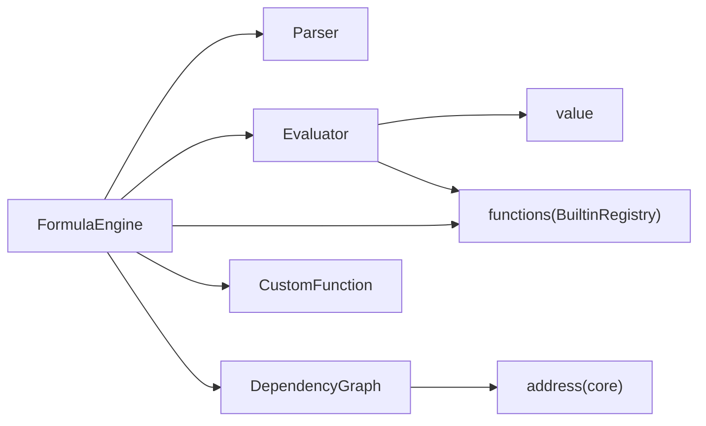

# 求值器系统

<cite>
**本文引用的文件**
- [Evaluator.ts](file://cmx-mega-sheet/src/formula/Evaluator.ts)
- [FormulaEngine.ts](file://cmx-mega-sheet/src/formula/FormulaEngine.ts)
- [value.ts](file://cmx-mega-sheet/src/formula/value.ts)
- [Parser.ts](file://cmx-mega-sheet/src/formula/Parser.ts)
- [DependencyGraph.ts](file://cmx-mega-sheet/src/formula/DependencyGraph.ts)
- [functions.ts](file://cmx-mega-sheet/src/formula/functions.ts)
- [CustomFunction.ts](file://cmx-mega-sheet/src/formula/CustomFunction.ts)
- [FormulaEval.test.ts](file://cmx-mega-sheet/test/FormulaEval.test.ts)
</cite>

## 目录
1. [简介](#简介)
2. [项目结构](#项目结构)
3. [核心组件](#核心组件)
4. [架构总览](#架构总览)
5. [详细组件分析](#详细组件分析)
6. [依赖关系分析](#依赖关系分析)
7. [性能考虑](#性能考虑)
8. [故障排查指南](#故障排查指南)
9. [结论](#结论)
10. [附录](#附录)

## 简介
本文件为“公式求值器系统”的完整技术文档，聚焦于 Evaluator 类的设计模式与执行流程、AST 节点遍历策略与递归求值机制；深入解释 EvalContext 接口的作用域管理（单元格引用解析、工作表切换、命名范围支持）；说明 FormulaValue 类型系统的实现（基础类型、数组类型、错误类型）；提供扩展点以注册新的操作符和函数；总结求值性能优化策略（短路求值、缓存机制、内存泄漏防护）；并给出调试技巧与常见求值错误的诊断方法。

## 项目结构
公式子系统位于 cmx-mega-sheet/src/formula，采用分层与职责分离：
- 词法/语法层：Tokenizer（由 Parser 使用）、Parser（生成 AST）
- 求值层：Evaluator（AST 求值）、FormulaEngine（编排全量/增量重算）
- 类型与工具：value（类型、转换、比较）、DependencyGraph（依赖图、拓扑排序、环检测）
- 函数体系：functions（内置函数注册表与实现）、CustomFunction（报表取数函数 QM/QC/JE/FS/REF）
- 测试：FormulaEval.test（覆盖值转换、运算符、内置函数、注册表等）



图表来源
- [FormulaEngine.ts:15-28](file://cmx-mega-sheet/src/formula/FormulaEngine.ts#L15-L28)
- [Evaluator.ts:11-55](file://cmx-mega-sheet/src/formula/Evaluator.ts#L11-L55)
- [Parser.ts:15-27](file://cmx-mega-sheet/src/formula/Parser.ts#L15-L27)
- [DependencyGraph.ts:12-34](file://cmx-mega-sheet/src/formula/DependencyGraph.ts#L12-L34)
- [value.ts:13-28](file://cmx-mega-sheet/src/formula/value.ts#L13-L28)
- [functions.ts:11-42](file://cmx-mega-sheet/src/formula/functions.ts#L11-L42)
- [CustomFunction.ts:15-21](file://cmx-mega-sheet/src/formula/CustomFunction.ts#L15-L21)

章节来源
- [FormulaEngine.ts:1-54](file://cmx-mega-sheet/src/formula/FormulaEngine.ts#L1-L54)
- [Evaluator.ts:1-55](file://cmx-mega-sheet/src/formula/Evaluator.ts#L1-L55)
- [Parser.ts:1-27](file://cmx-mega-sheet/src/formula/Parser.ts#L1-L27)
- [DependencyGraph.ts:1-34](file://cmx-mega-sheet/src/formula/DependencyGraph.ts#L1-L34)
- [value.ts:1-28](file://cmx-mega-sheet/src/formula/value.ts#L1-L28)
- [functions.ts:1-42](file://cmx-mega-sheet/src/formula/functions.ts#L1-L42)
- [CustomFunction.ts:1-21](file://cmx-mega-sheet/src/formula/CustomFunction.ts#L1-L21)

## 核心组件
- Evaluator：AST 求值核心，负责节点遍历、递归求值、上下文传递、错误传播与短路。
- FormulaEngine：引擎编排层，负责扫描公式格、构建依赖图、拓扑排序、全量/增量重算、回填计算值。
- value：类型系统与转换工具，定义 FormulaValue、FormulaError 及 toNumber/toText/toBoolean/compareValues 等。
- DependencyGraph：依赖图、提取依赖、拓扑排序、三色 DFS 环检测。
- functions：内置函数注册表 BuiltinRegistry 与大量函数实现（数学、统计、文本、查找、日期等）。
- CustomFunction：报表取数函数 QM/QC/JE/FS/REF 的实现与注册，基于 ReportValueMap 按所在格取值。

章节来源
- [Evaluator.ts:59-158](file://cmx-mega-sheet/src/formula/Evaluator.ts#L59-L158)
- [FormulaEngine.ts:36-54](file://cmx-mega-sheet/src/formula/FormulaEngine.ts#L36-L54)
- [value.ts:13-131](file://cmx-mega-sheet/src/formula/value.ts#L13-L131)
- [DependencyGraph.ts:100-201](file://cmx-mega-sheet/src/formula/DependencyGraph.ts#L100-L201)
- [functions.ts:63-355](file://cmx-mega-sheet/src/formula/functions.ts#L63-L355)
- [CustomFunction.ts:27-79](file://cmx-mega-sheet/src/formula/CustomFunction.ts#L27-L79)

## 架构总览
公式求值从“字符串→AST→求值→结果”的流水线进行，并由 FormulaEngine 驱动全量/增量重算。



图表来源
- [FormulaEngine.ts:149-198](file://cmx-mega-sheet/src/formula/FormulaEngine.ts#L149-L198)
- [FormulaEngine.ts:206-243](file://cmx-mega-sheet/src/formula/FormulaEngine.ts#L206-L243)
- [Evaluator.ts:62-83](file://cmx-mega-sheet/src/formula/Evaluator.ts#L62-L83)
- [DependencyGraph.ts:26-34](file://cmx-mega-sheet/src/formula/DependencyGraph.ts#L26-L34)
- [DependencyGraph.ts:163-199](file://cmx-mega-sheet/src/formula/DependencyGraph.ts#L163-L199)

## 详细组件分析

### Evaluator：AST 求值与递归机制
- 设计模式：访问者风格（evalNode 根据节点 kind 分派），配合上下文 EvalContext 与 CellAccessor 抽象，解耦 Worksheet 细节。
- 执行流程：
  - evaluate(node, ctx)：统一入口，区域在标量上下文取左上角。
  - evalNode：处理 number/string/ref/range/array/unary/binary/call。
  - evalNameNode：优先尝试 resolveNameRef（命名区域→引用文本），再回退到 resolveName（TRUE/FALSE/标量命名）。
  - evalUnary/evalBinary：算术、连接、比较，错误短路传播。
  - evalCall：通过 FunctionRegistry 获取函数实现，参数已求值为 EvaluatedArg（标量或二维区域）。
- 关键特性：
  - 错误短路：二元运算中若左/右任一为错误，直接返回该错误。
  - 区域到标量：evaluate 将区域落位到左上角，简化调用方语义。
  - 命名范围：通过 CellAccessor.resolveNameRef 支持 SUM(myRange) 等场景。



图表来源
- [Evaluator.ts:62-83](file://cmx-mega-sheet/src/formula/Evaluator.ts#L62-L83)
- [Evaluator.ts:108-157](file://cmx-mega-sheet/src/formula/Evaluator.ts#L108-L157)

章节来源
- [Evaluator.ts:21-41](file://cmx-mega-sheet/src/formula/Evaluator.ts#L21-L41)
- [Evaluator.ts:59-158](file://cmx-mega-sheet/src/formula/Evaluator.ts#L59-L158)

### EvalContext 与作用域管理
- 字段：
  - accessor：CellAccessor，封装单元格读取、区域展开、命名解析。
  - row/col：当前公式所在格（0-based），供上下文敏感函数（如 ROW/COLUMN/QM/QC/…）使用。
  - sheetName：当前工作表名，用于跨表引用与命名范围解析。
- 作用域行为：
  - 单元格引用解析：accessor.getCellValue 支持带 sheet 前缀的引用，越界/无效 sheet 返回 #REF!。
  - 工作表切换：splitRef/splitEndpoint 解析 'Sheet1!A1' 形式，默认 sheet 由 ctx.sheetName 提供。
  - 命名范围：resolveNameRef 可将命名区域转为引用文本（如 'Sheet1!A1:B3'），再由 getRangeValues 展开。

章节来源
- [Evaluator.ts:21-41](file://cmx-mega-sheet/src/formula/Evaluator.ts#L21-L41)
- [FormulaEngine.ts:82-143](file://cmx-mega-sheet/src/formula/FormulaEngine.ts#L82-L143)

### FormulaValue 类型系统
- 类型：
  - FormulaValue = number | string | boolean | FormulaError | null（空格）。
  - FormulaError = '#DIV/0!' | '#VALUE!' | '#REF!' | '#NAME?' | '#NUM!' | '#N/A' | '#SPILL!' | '#CIRC!'。
- 转换与比较：
  - toNumber：空→0，布尔→1/0，非数值文本→#VALUE!，错误透传。
  - toText：数字→字符串，布尔→TRUE/FALSE，空→''。
  - toBoolean：数字非0→true，"TRUE"/"FALSE"不敏感，空→false。
  - compareValues：对齐 Excel 排序规则（数字<文本<布尔），同类型按数值/字典序比较。
- 数组类型：
  - 区域求值产出 FormulaValue[][]，函数可接收二维数组（如 SUMIFS、SUBTOTAL）。
  - 辅助 flattenArg/flattenArgs/scalarArg/firstError 用于函数内部展平与短路。

章节来源
- [value.ts:13-131](file://cmx-mega-sheet/src/formula/value.ts#L13-L131)
- [Evaluator.ts:160-199](file://cmx-mega-sheet/src/formula/Evaluator.ts#L160-L199)

### 依赖图与重算策略
- 依赖抽取：extractDeps 遍历 AST，收集 ref 与 range 展开的单元格键集合；整列/整行按 bounds 钳制到 sheet 维度，避免百万级遍历。
- 拓扑排序：topoSort 使用三色 DFS 检测环，环上格标记 #CIRC!，其余按被依赖顺序输出。
- 全量重算：recalcAll 扫描所有公式格，重建依赖图，拓扑求值回填。
- 增量重算：recalcCells 针对种子格更新其出边，计算 affectedBy 闭包，包含 volatile 公式格，仅对子集拓扑排序并求值。

```mermaid
classDiagram
class DependencyGraph {
+setDeps(cell, deps)
+clearDeps(cell)
+affectedBy(seeds) Set~CellKey~
+topoSort(cells) {order, cyclic}
}
class FormulaEngine {
+recalcAll()
+recalcCells(seeds)
-isVolatileAst(node) bool
}
DependencyGraph <.. FormulaEngine : "used by"
```

图表来源
- [DependencyGraph.ts:100-201](file://cmx-mega-sheet/src/formula/DependencyGraph.ts#L100-L201)
- [FormulaEngine.ts:149-243](file://cmx-mega-sheet/src/formula/FormulaEngine.ts#L149-L243)

章节来源
- [DependencyGraph.ts:26-94](file://cmx-mega-sheet/src/formula/DependencyGraph.ts#L26-L94)
- [FormulaEngine.ts:149-243](file://cmx-mega-sheet/src/formula/FormulaEngine.ts#L149-L243)

### 内置函数与扩展点
- 内置函数注册表 BuiltinRegistry：
  - register(name, impl, opts?)：注册函数实现，可选 volatile 标志。
  - isVolatile(name)：判断是否为易变函数（每次重算纳入）。
  - names()：列出已注册函数名（调试用）。
- 函数族：
  - 数学/财务/统计/数据库/文本/工程：通过 builtins/*.ts 汇入 functions.ts。
  - 常用函数：SUM/AVERAGE/MAX/MIN/ROUND/IF/SUBTOTAL/TEXT/DATE/TIME/VLOOKUP/XLOOKUP 等。
- 自定义函数扩展：
  - 通过 BuiltinRegistry.register 注册新函数，支持 volatile。
  - 报表取数函数 QM/QC/JE/FS/REF：通过 registerReportFetchFunctions 注册，基于 ReportValueMap 按所在格取值。



图表来源
- [functions.ts:1133-1148](file://cmx-mega-sheet/src/formula/functions.ts#L1133-L1148)
- [CustomFunction.ts:71-79](file://cmx-mega-sheet/src/formula/CustomFunction.ts#L71-L79)

章节来源
- [functions.ts:63-355](file://cmx-mega-sheet/src/formula/functions.ts#L63-L355)
- [functions.ts:1133-1148](file://cmx-mega-sheet/src/formula/functions.ts#L1133-L1148)
- [CustomFunction.ts:27-79](file://cmx-mega-sheet/src/formula/CustomFunction.ts#L27-L79)

### 解析器与 AST
- Parser 使用 Pratt 优先级爬升算法，支持：
  - 中缀运算符（比较 < 连接& < 加减 < 乘除 < 幂），幂右结合。
  - 一元负号/正号、尾随百分号。
  - 函数调用、括号分组、字符串、数字、命名（TRUE/FALSE/命名区域）。
  - 引用与区域：A1、A1:C3、Sheet1!A1:C3、整列/整行。
- AST 节点：number/string/ref/range/array/name/unary/binary/call。

章节来源
- [Parser.ts:1-199](file://cmx-mega-sheet/src/formula/Parser.ts#L1-L199)

## 依赖关系分析
- 模块耦合：
  - FormulaEngine 依赖 Parser、Evaluator、DependencyGraph、functions、CustomFunction。
  - Evaluator 依赖 value、FunctionRegistry（functions 提供）。
  - DependencyGraph 依赖 address 工具（core/address）。
- 外部接口：
  - Workbook/Worksheet 通过 FormulaEngine 暴露的 accessorFor 与 setComputedValue 交互。
  - ReportValueMap 由上层注入数据，供 QM/QC/JE/FS/REF 查表。



图表来源
- [FormulaEngine.ts:15-28](file://cmx-mega-sheet/src/formula/FormulaEngine.ts#L15-L28)
- [Evaluator.ts:11-19](file://cmx-mega-sheet/src/formula/Evaluator.ts#L11-L19)
- [DependencyGraph.ts:12-13](file://cmx-mega-sheet/src/formula/DependencyGraph.ts#L12-L13)

章节来源
- [FormulaEngine.ts:15-28](file://cmx-mega-sheet/src/formula/FormulaEngine.ts#L15-L28)
- [Evaluator.ts:11-19](file://cmx-mega-sheet/src/formula/Evaluator.ts#L11-L19)
- [DependencyGraph.ts:12-13](file://cmx-mega-sheet/src/formula/DependencyGraph.ts#L12-L13)

## 性能考虑
- 短路求值：
  - 二元运算：若左/右任一为错误，立即返回错误，避免无意义计算。
  - AND/OR/IFERROR/IFNA：遇到错误或缺省条件提前返回。
- 缓存机制：
  - 解析缓存：parseCache 存储 AST 或解析错误，避免重复解析。
  - 依赖图复用：DependencyGraph 维护正向/反向依赖，增量重算仅影响相关子图。
- 内存与边界控制：
  - 整列/整行区域：bounds 钳制到 sheet 维度，避免遍历百万格。
  - 增量重算：recalcCells 将 O(全簿) 降为 O(受影响)，减少不必要的求值。
- 易变函数：
  - QM/QC/JE/FS/REF 标记 volatile，每次重算纳入，确保数据更新后及时刷新。
- 潜在优化建议：
  - 对超大区域求值（如 SUM(A:A)）可引入惰性求值或分块迭代。
  - 对频繁调用的复杂函数（如 XLOOKUP）可增加局部缓存（key→结果）。
  - 对 ReportValueMap 的大对象注入，注意键归一化与内存占用。

章节来源
- [FormulaEngine.ts:69-80](file://cmx-mega-sheet/src/formula/FormulaEngine.ts#L69-L80)
- [FormulaEngine.ts:149-198](file://cmx-mega-sheet/src/formula/FormulaEngine.ts#L149-L198)
- [FormulaEngine.ts:206-243](file://cmx-mega-sheet/src/formula/FormulaEngine.ts#L206-L243)
- [Evaluator.ts:116-146](file://cmx-mega-sheet/src/formula/Evaluator.ts#L116-L146)
- [CustomFunction.ts:71-79](file://cmx-mega-sheet/src/formula/CustomFunction.ts#L71-L79)

## 故障排查指南
- 常见错误与定位：
  - #NAME?：未知函数或命名未解析。检查 registry.get(name) 与 resolveNameRef。
  - #REF!：引用越界或无效 sheet。检查 splitRef/splitEndpoint 与 accessor 实现。
  - #DIV/0!：除零。检查 evalBinary 的除法分支。
  - #VALUE!：类型不匹配或函数异常。检查 toNumber/toText/toBoolean 与函数实现 try/catch。
  - #NUM!：数值溢出或非法参数。检查 POWER/SQRT/CEILING/FLOOR 等。
  - #CIRC!：循环引用。检查 DependencyGraph.topoSort 的 cyclic 集合。
- 调试技巧：
  - 使用 evaluateFormula(sheetName, formula, row, col) 直接求值不落格，快速验证。
  - 通过 ReportValueMap.raw() 查看注入的取数数据。
  - 利用 BuiltinRegistry.names() 确认函数是否注册成功。
  - 在测试用例中构造最小化的 CellAccessor，隔离问题。

章节来源
- [FormulaEngine.ts:259-287](file://cmx-mega-sheet/src/formula/FormulaEngine.ts#L259-L287)
- [CustomFunction.ts:57-65](file://cmx-mega-sheet/src/formula/CustomFunction.ts#L57-L65)
- [FormulaEval.test.ts:159-173](file://cmx-mega-sheet/test/FormulaEval.test.ts#L159-L173)

## 结论
该公式求值器系统以清晰的层次划分与职责分离实现了高性能、可扩展的公式计算能力。Evaluator 提供稳健的 AST 求值与错误传播；FormulaEngine 通过依赖图与拓扑排序实现全量/增量重算；value 类型系统对齐 Excel 语义；functions 与 CustomFunction 提供了丰富的内置与报表取数能力。通过短路求值、解析缓存、依赖图复用与边界钳制，系统在大规模表格场景下保持良好性能。扩展点明确，便于新增函数与操作符。

## 附录
- 快速上手：
  - 创建 BuiltinRegistry，注册自定义函数（含 volatile）。
  - 构造 EvalContext 与 CellAccessor，调用 Evaluator.evaluate。
  - 使用 FormulaEngine.recalcAll/reCalcCells 进行重算。
- 参考测试：
  - FormulaEval.test 覆盖了值转换、运算符、内置函数、注册表等典型场景，可作为集成参考。

章节来源
- [FormulaEval.test.ts:1-173](file://cmx-mega-sheet/test/FormulaEval.test.ts#L1-L173)