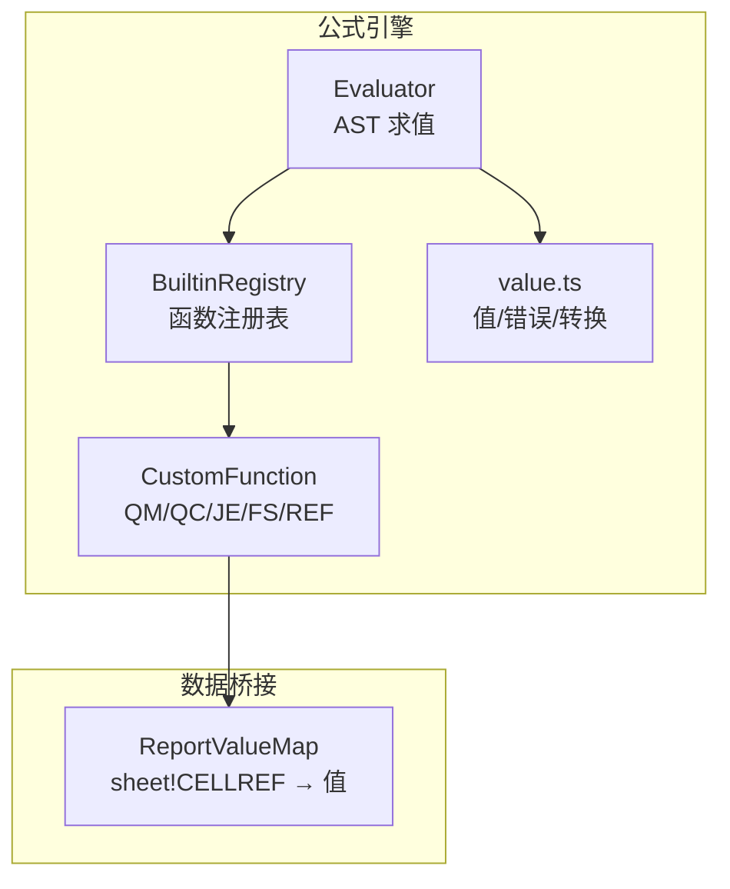
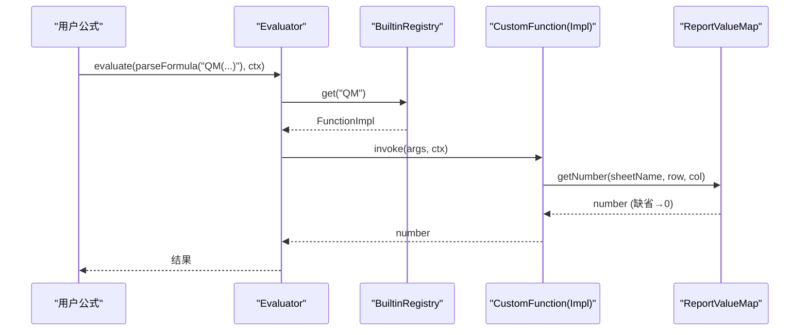
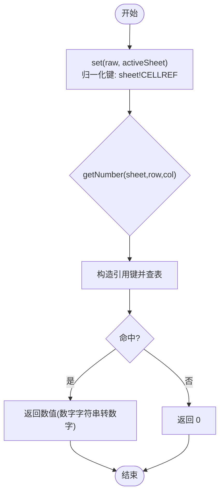
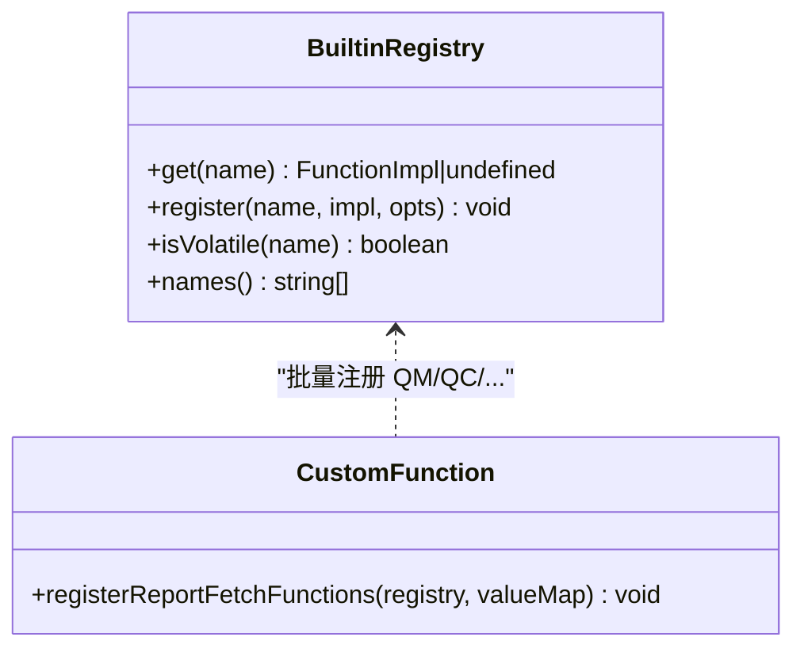
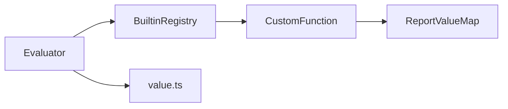

# 自定义函数开发

<cite>
**本文引用的文件**
- [CustomFunction.ts](file://cmx-mega-sheet/src/formula/CustomFunction.ts)
- [Evaluator.ts](file://cmx-mega-sheet/src/formula/Evaluator.ts)
- [functions.ts](file://cmx-mega-sheet/src/formula/functions.ts)
- [value.ts](file://cmx-mega-sheet/src/formula/value.ts)
- [CustomFunction.test.ts](file://cmx-mega-sheet/test/CustomFunction.test.ts)
- [vitest.config.ts](file://cmx-mega-sheet/vitest.config.ts)
</cite>

## 目录
1. [简介](#简介)
2. [项目结构](#项目结构)
3. [核心组件](#核心组件)
4. [架构总览](#架构总览)
5. [详细组件分析](#详细组件分析)
6. [依赖关系分析](#依赖关系分析)
7. [性能考量](#性能考量)
8. [故障排查指南](#故障排查指南)
9. [结论](#结论)
10. [附录](#附录)

## 简介
本指南面向在报表引擎中扩展“自定义函数”的开发者，聚焦以下目标：
- 深入说明 CustomFunction 接口的设计与实现要求（函数签名、参数处理、返回值规范）
- 详细说明 ReportValueMap 的使用方法，解释报表数据集成与动态数据源接入机制
- 提供完整的自定义函数开发示例（简单计算、复杂业务逻辑、异步场景）
- 说明函数注册流程（静态注册与动态注册）
- 解释函数权限控制与安全沙箱机制，防止恶意代码执行
- 包含函数测试框架的使用方法与调试技巧
- 提供性能优化建议与最佳实践模式

## 项目结构
与自定义函数相关的核心位于 cmx-mega-sheet 的 formula 层，采用纯逻辑、无 DOM 的设计，便于测试与复用。关键文件职责如下：
- Evaluator.ts：公式 AST 求值器，负责调用函数、处理上下文、错误传播
- functions.ts：内置函数注册表 BuiltinRegistry，以及大量内置函数实现
- CustomFunction.ts：报表取数自定义函数（QM/QC/JE/FS/REF）与 ReportValueMap 数据桥接
- value.ts：公式值类型、错误类型、转换与比较工具
- test/CustomFunction.test.ts：针对自定义函数的单元测试
- vitest.config.ts：测试环境配置（node 环境，利于无 DOM 逻辑快速运行）

图表来源
- [Evaluator.ts:59-158](file://cmx-mega-sheet/src/formula/Evaluator.ts#L59-L158)
- [functions.ts:1117-1145](file://cmx-mega-sheet/src/formula/functions.ts#L1117-L1145)
- [CustomFunction.ts:27-79](file://cmx-mega-sheet/src/formula/CustomFunction.ts#L27-L79)
- [value.ts:13-32](file://cmx-mega-sheet/src/formula/value.ts#L13-L32)

章节来源
- [Evaluator.ts:1-199](file://cmx-mega-sheet/src/formula/Evaluator.ts#L1-L199)
- [functions.ts:1-1149](file://cmx-mega-sheet/src/formula/functions.ts#L1-L1149)
- [CustomFunction.ts:1-79](file://cmx-mega-sheet/src/formula/CustomFunction.ts#L1-L79)
- [value.ts:1-131](file://cmx-mega-sheet/src/formula/value.ts#L1-L131)

## 核心组件
- Evaluator：解析并求值公式 AST，将函数调用委托给 FunctionRegistry；支持上下文敏感函数（如 QM/QC/…），通过 EvalContext 传递当前所在格信息
- BuiltinRegistry：维护函数名到实现的映射，支持覆盖注册与易变标记（volatile）
- CustomFunction：定义报表取数函数族（QM/QC/JE/FS/REF），统一按“所在格”从 ReportValueMap 取值
- ReportValueMap：将后端下发的“sheetName!CELLREF → 值”规范化为内部键，并提供 getNumber 等便捷读取方法
- value.ts：定义 FormulaValue、FormulaError 及 toNumber/toText/toBoolean 等转换工具，保证 Excel 语义一致性

章节来源
- [Evaluator.ts:21-55](file://cmx-mega-sheet/src/formula/Evaluator.ts#L21-L55)
- [functions.ts:1117-1145](file://cmx-mega-sheet/src/formula/functions.ts#L1117-L1145)
- [CustomFunction.ts:20-79](file://cmx-mega-sheet/src/formula/CustomFunction.ts#L20-L79)
- [value.ts:13-75](file://cmx-mega-sheet/src/formula/value.ts#L13-L75)

## 架构总览
下图展示了公式求值过程中，自定义函数如何与数据源集成：

图表来源
- [Evaluator.ts:148-157](file://cmx-mega-sheet/src/formula/Evaluator.ts#L148-L157)
- [functions.ts:1117-1139](file://cmx-mega-sheet/src/formula/functions.ts#L1117-L1139)
- [CustomFunction.ts:71-77](file://cmx-mega-sheet/src/formula/CustomFunction.ts#L71-L77)
- [CustomFunction.ts:47-55](file://cmx-mega-sheet/src/formula/CustomFunction.ts#L47-L55)

## 详细组件分析

### CustomFunction 接口设计与实现要求
- 函数签名
  - 函数实现类型为 FunctionImpl：接收已求值的参数（标量或区域二维数组）和 EvalContext，返回 FormulaValue
  - 上下文敏感函数需使用 ctx.row、ctx.col、ctx.sheetName 定位“所在格”，用于按格取数
- 参数处理
  - 参数由 Evaluator 预先求值，可能为标量或区域二维数组；函数应能处理这两种形态
  - 对于报表取数函数族（QM/QC/JE/FS/REF），忽略参数内容，仅按“所在格”查值
- 返回值规范
  - 返回 FormulaValue：number | string | boolean | FormulaError | null
  - 缺/空/非数值按 0 参与算术（对齐报表模板语义）
  - 错误值透传（如 #VALUE!/#DIV/0! 等），由 Evaluator 统一处理

章节来源
- [Evaluator.ts:43-55](file://cmx-mega-sheet/src/formula/Evaluator.ts#L43-L55)
- [CustomFunction.ts:71-77](file://cmx-mega-sheet/src/formula/CustomFunction.ts#L71-L77)
- [value.ts:13-32](file://cmx-mega-sheet/src/formula/value.ts#L13-L32)

### ReportValueMap 使用方法与数据集成机制
- 数据注入
  - 后端将“真值”计算完成后，通过 setReportValueMap 下发到一张 sheetName!CELLREF → 值的映射表
  - ReportValueMap.set 会归一化键：裸 CELLREF 会补 activeSheet 前缀，并将 CELLREF 大写
- 取值语义
  - getNumber(sheetName, row, col) 根据所在格生成引用键，查表取值；缺失/空/非数值返回 0；数字字符串转为数字
- 动态数据源接入
  - 每次刷新报表数据时，调用 set 更新映射，由于 QM/QC/… 被标记为 volatile，依赖图会纳入重算，确保结果实时性

图表来源
- [CustomFunction.ts:35-55](file://cmx-mega-sheet/src/formula/CustomFunction.ts#L35-L55)

章节来源
- [CustomFunction.ts:27-65](file://cmx-mega-sheet/src/formula/CustomFunction.ts#L27-L65)
- [CustomFunction.test.ts:31-55](file://cmx-mega-sheet/test/CustomFunction.test.ts#L31-L55)

### 函数注册流程（静态注册与动态注册）
- 静态注册
  - 内置函数在构造函数中一次性注册到 BuiltinRegistry（BUILTINS 对象合并入 Map）
  - 报表取数函数族（QM/QC/JE/FS/REF）通过 registerReportFetchFunctions 批量注册，并标记为 volatile
- 动态注册
  - 通过 registry.register(name, impl, opts?) 可叠加或覆盖自定义函数
  - 支持设置 volatile 标志，使依赖图在数据变化时强制重算

图表来源
- [functions.ts:1117-1145](file://cmx-mega-sheet/src/formula/functions.ts#L1117-L1145)
- [CustomFunction.ts:71-77](file://cmx-mega-sheet/src/formula/CustomFunction.ts#L71-L77)

章节来源
- [functions.ts:1117-1145](file://cmx-mega-sheet/src/formula/functions.ts#L1117-L1145)
- [CustomFunction.ts:71-77](file://cmx-mega-sheet/src/formula/CustomFunction.ts#L71-L77)

### 完整自定义函数开发示例

#### 示例一：简单计算函数（加法）
- 目标：实现一个名为 ADD 的函数，对两个标量求和
- 步骤
  - 在 functions.ts 中添加 ADD 实现，或使用 BuiltinRegistry.register 动态注册
  - 参数处理：使用 scalarArg 获取标量值，toNumber 做数值转换
  - 返回值：返回 number 或错误值（如 #VALUE!）
- 参考路径
  - 参数与转换工具：[Evaluator.ts:177-182](file://cmx-mega-sheet/src/formula/Evaluator.ts#L177-L182)、[value.ts:42-52](file://cmx-mega-sheet/src/formula/value.ts#L42-L52)
  - 注册方式：[functions.ts:1130-1135](file://cmx-mega-sheet/src/formula/functions.ts#L1130-L1135)

章节来源
- [Evaluator.ts:177-182](file://cmx-mega-sheet/src/formula/Evaluator.ts#L177-L182)
- [value.ts:42-52](file://cmx-mega-sheet/src/formula/value.ts#L42-L52)
- [functions.ts:1130-1135](file://cmx-mega-sheet/src/formula/functions.ts#L1130-L1135)

#### 示例二：复杂业务逻辑函数（条件聚合）
- 目标：实现类似 SUMIFS 的多条件聚合，基于区域与条件匹配进行求和
- 步骤
  - 使用 flattenArgs 展平区域为标量序列
  - 使用 matchesCriteria 判断条件是否命中（支持运算符前缀与通配符）
  - 累加满足条件的数值，返回总和
- 参考路径
  - 多条件聚合实现：[functions.ts:578-605](file://cmx-mega-sheet/src/formula/functions.ts#L578-L605)
  - 条件匹配逻辑：[functions.ts:359-387](file://cmx-mega-sheet/src/formula/functions.ts#L359-L387)

章节来源
- [functions.ts:359-387](file://cmx-mega-sheet/src/formula/functions.ts#L359-L387)
- [functions.ts:578-605](file://cmx-mega-sheet/src/formula/functions.ts#L578-L605)

#### 示例三：异步函数场景（外部服务调用）
- 目标：在自定义函数中发起异步请求（如远程 API），并返回结果
- 约束与建议
  - 当前 Evaluator 同步求值，直接返回 Promise 会导致类型不匹配；推荐在调用方封装异步逻辑，将结果写入 ReportValueMap 后再触发重算
  - 若确需在函数内异步，应在上层包装为同步等待（谨慎使用，避免阻塞 UI）
- 参考路径
  - 上下文与求值入口：[Evaluator.ts:148-157](file://cmx-mega-sheet/src/formula/Evaluator.ts#L148-L157)
  - 数据注入与重算：[CustomFunction.ts:35-45](file://cmx-mega-sheet/src/formula/CustomFunction.ts#L35-L45)

章节来源
- [Evaluator.ts:148-157](file://cmx-mega-sheet/src/formula/Evaluator.ts#L148-L157)
- [CustomFunction.ts:35-45](file://cmx-mega-sheet/src/formula/CustomFunction.ts#L35-L45)

### 函数权限控制与安全沙箱机制
- 当前实现未内置权限控制与沙箱；函数以普通 JS 形式执行
- 安全建议
  - 限制可访问的全局对象与模块，避免执行危险操作
  - 在服务端或宿主环境中对函数体进行白名单校验与资源隔离
  - 对 ReportValueMap 的写入权限进行严格管控，仅允许受信任的数据源更新
- 注意：上述为通用安全建议，具体实现需结合宿主环境与部署策略

[本节为概念性指导，不直接分析具体文件]

### 函数测试框架与调试技巧
- 测试框架
  - 使用 Vitest 进行单元测试，配置为 node 环境以提升无 DOM 逻辑的执行速度
  - 测试用例可通过 setup 构造 BuiltinRegistry、ReportValueMap 与 Evaluator，模拟不同数据场景
- 调试技巧
  - 利用 ReportValueMap.raw() 查看当前映射内容，辅助定位数据问题
  - 通过断言验证函数在不同边界条件下的行为（缺失、空、非数值、数字字符串等）
- 参考路径
  - 测试配置：[vitest.config.ts:1-17](file://cmx-mega-sheet/vitest.config.ts#L1-L17)
  - 测试用例示例：[CustomFunction.test.ts:17-29](file://cmx-mega-sheet/test/CustomFunction.test.ts#L17-L29)、[CustomFunction.test.ts:31-103](file://cmx-mega-sheet/test/CustomFunction.test.ts#L31-L103)

章节来源
- [vitest.config.ts:1-17](file://cmx-mega-sheet/vitest.config.ts#L1-L17)
- [CustomFunction.test.ts:17-29](file://cmx-mega-sheet/test/CustomFunction.test.ts#L17-L29)
- [CustomFunction.test.ts:31-103](file://cmx-mega-sheet/test/CustomFunction.test.ts#L31-L103)

## 依赖关系分析
- Evaluator 依赖 FunctionRegistry 获取函数实现，依赖 value.ts 进行值转换与错误处理
- BuiltinRegistry 维护内置函数与自定义函数的映射，支持 volatile 标记
- CustomFunction 依赖 ReportValueMap 获取报表数据，并通过 Evaluator 的上下文信息进行按格取值
- value.ts 提供统一的值类型与转换工具，确保 Excel 语义一致性

图表来源
- [Evaluator.ts:59-158](file://cmx-mega-sheet/src/formula/Evaluator.ts#L59-L158)
- [functions.ts:1117-1145](file://cmx-mega-sheet/src/formula/functions.ts#L1117-L1145)
- [CustomFunction.ts:71-77](file://cmx-mega-sheet/src/formula/CustomFunction.ts#L71-L77)

章节来源
- [Evaluator.ts:59-158](file://cmx-mega-sheet/src/formula/Evaluator.ts#L59-L158)
- [functions.ts:1117-1145](file://cmx-mega-sheet/src/formula/functions.ts#L1117-L1145)
- [CustomFunction.ts:71-77](file://cmx-mega-sheet/src/formula/CustomFunction.ts#L71-L77)

## 性能考量
- 易变函数（volatile）
  - QM/QC/JE/FS/REF 标记为 volatile，确保数据更新后依赖图重算，但会增加重算频率
  - 建议在数据频繁变更的场景下，合理控制 ReportValueMap 的更新粒度
- 参数处理
  - 避免在热点路径中进行昂贵的字符串转换或正则匹配
  - 使用 flattenArgs 与 scalarArg 减少重复计算
- 数据映射
  - ReportValueMap.set 会归一化键，建议在批量更新时使用单次 set 调用，减少重复开销
- 测试与基准
  - 使用 Vitest 的 node 环境进行快速测试，必要时引入基准测试评估性能

[本节为通用性能指导，不直接分析具体文件]

## 故障排查指南
- 常见问题
  - 函数未找到：检查函数名是否正确注册，大小写是否一致（BuiltinRegistry.get 会转换为大写）
  - 值为 0：确认 ReportValueMap 中是否存在对应键，或缺失/空/非数值的默认行为
  - 错误值传播：检查参数转换与业务逻辑是否返回错误值（如 #VALUE!/#DIV/0!）
- 调试步骤
  - 使用 ReportValueMap.raw() 查看当前映射内容
  - 通过单元测试验证边界条件（缺失、空、非数值、数字字符串）
  - 逐步缩小问题范围，定位是数据注入还是函数实现问题
- 参考路径
  - 错误类型定义：[value.ts:13-32](file://cmx-mega-sheet/src/formula/value.ts#L13-L32)
  - 测试用例示例：[CustomFunction.test.ts:43-55](file://cmx-mega-sheet/test/CustomFunction.test.ts#L43-L55)

章节来源
- [value.ts:13-32](file://cmx-mega-sheet/src/formula/value.ts#L13-L32)
- [CustomFunction.test.ts:43-55](file://cmx-mega-sheet/test/CustomFunction.test.ts#L43-L55)

## 结论
本指南系统阐述了自定义函数在报表引擎中的设计、实现与集成方式。通过 ReportValueMap 与 Evaluator 的配合，实现了数据与计算的解耦；通过 BuiltinRegistry 提供了灵活的函数注册机制。在实际开发中，建议遵循参数与返回值的统一规范，合理使用易变函数与测试框架，确保功能正确性与性能稳定。

[本节为总结性内容，不直接分析具体文件]

## 附录
- 相关术语
  - FormulaValue：公式值类型（number|string|boolean|FormulaError|null）
  - FormulaError：Excel 风格错误值（如 #DIV/0!、#VALUE! 等）
  - EvalContext：求值上下文，包含当前所在格与 accessor
  - BuiltinRegistry：函数注册表，支持静态与动态注册
- 参考文件
  - [CustomFunction.ts](file://cmx-mega-sheet/src/formula/CustomFunction.ts)
  - [Evaluator.ts](file://cmx-mega-sheet/src/formula/Evaluator.ts)
  - [functions.ts](file://cmx-mega-sheet/src/formula/functions.ts)
  - [value.ts](file://cmx-mega-sheet/src/formula/value.ts)
  - [CustomFunction.test.ts](file://cmx-mega-sheet/test/CustomFunction.test.ts)
  - [vitest.config.ts](file://cmx-mega-sheet/vitest.config.ts)

[本节为附录信息，不直接分析具体文件]