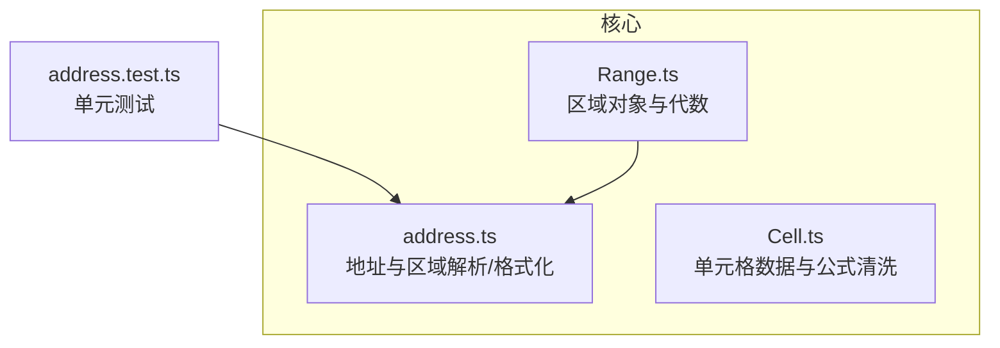
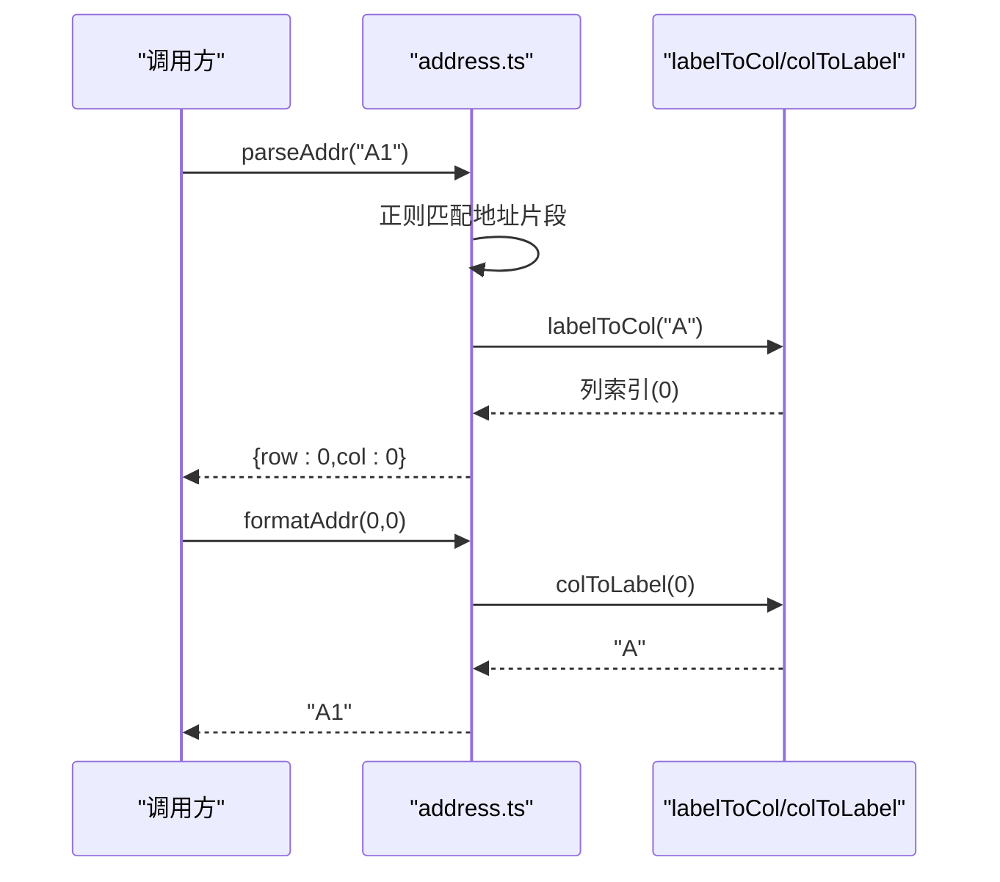
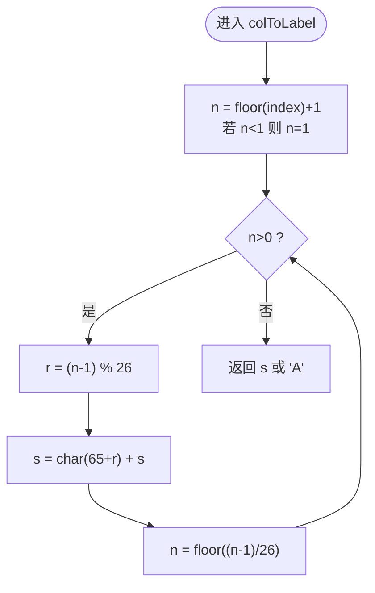
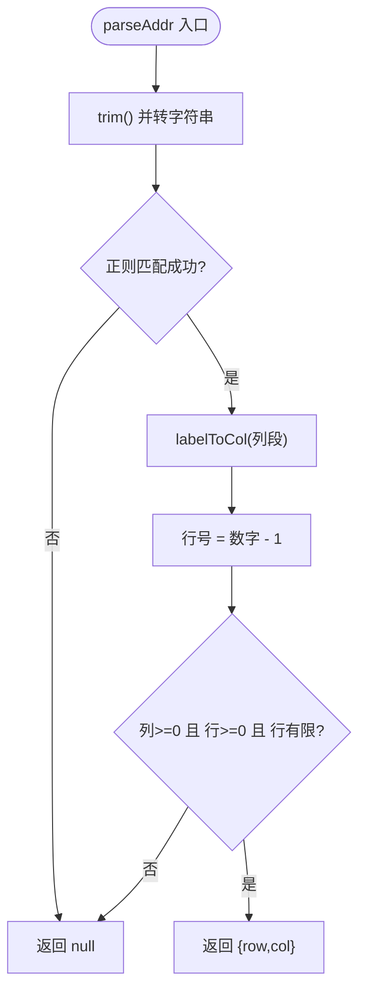
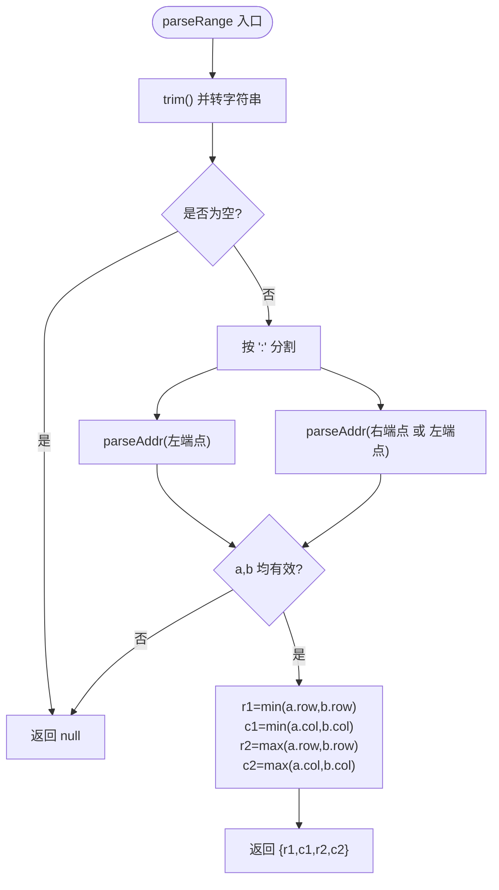
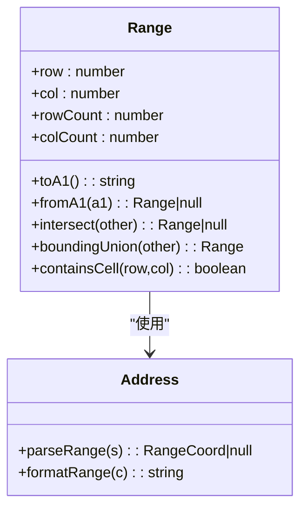
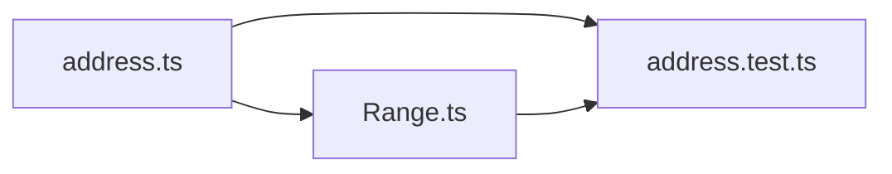

# 坐标地址工具

<cite>
**本文引用的文件**
- [address.ts](file://cmx-mega-sheet/src/core/address.ts)
- [Range.ts](file://cmx-mega-sheet/src/core/Range.ts)
- [Cell.ts](file://cmx-mega-sheet/src/core/Cell.ts)
- [address.test.ts](file://cmx-mega-sheet/test/address.test.ts)
</cite>

## 目录
1. [简介](#简介)
2. [项目结构](#项目结构)
3. [核心组件](#核心组件)
4. [架构总览](#架构总览)
5. [详细组件分析](#详细组件分析)
6. [依赖关系分析](#依赖关系分析)
7. [性能考虑](#性能考虑)
8. [故障排查指南](#故障排查指南)
9. [结论](#结论)
10. [附录：使用示例与最佳实践](#附录使用示例与最佳实践)

## 简介
本模块提供 A1 风格单元格地址与行列索引之间的双向转换，以及区域字符串的解析与格式化。它采用“列标签 bijective base-26”编码机制，确保列标签与列索引之间的一一映射（A→0, Z→25, AA→26, …）。该能力是整个电子表格引擎的坐标基元层，被 core、formula、render 等子系统广泛依赖。

## 项目结构
- 核心实现位于 cmx-mega-sheet/src/core/address.ts，提供列标签与索引互转、单格地址解析/格式化、区域解析/格式化的全部能力。
- Range.ts 在更高层封装了矩形区域的不可变值对象与代数运算，并复用 address.ts 的解析/格式化能力。
- Cell.ts 定义了单元格数据模型与公式清洗等辅助函数，虽不直接参与地址转换，但与引用处理流程紧密相关。
- address.test.ts 提供了全面的单元测试，覆盖边界情况、大小写容错、非法输入与往返一致性。

图表来源
- [address.ts:1-112](file://cmx-mega-sheet/src/core/address.ts#L1-L112)
- [Range.ts:1-166](file://cmx-mega-sheet/src/core/Range.ts#L1-L166)
- [address.test.ts:1-111](file://cmx-mega-sheet/test/address.test.ts#L1-L111)

章节来源
- [address.ts:1-112](file://cmx-mega-sheet/src/core/address.ts#L1-L112)
- [Range.ts:1-166](file://cmx-mega-sheet/src/core/Range.ts#L1-L166)
- [address.test.ts:1-111](file://cmx-mega-sheet/test/address.test.ts#L1-L111)

## 核心组件
- 列标签与索引互转
  - colToLabel(index): number → string：将 0-based 列索引转换为 A..Z、AA.. 形式的列标签。对非正整数进行安全钳制，返回 "A"。
  - labelToCol(label): string → number：将列标签转换为 0-based 列索引；非法标签返回 -1。
- 单格地址解析/格式化
  - parseAddr(addr): string → CellCoord | null：解析 "A1" 形式地址为 {row, col}（行号 1-based 转为 0-based）；非法返回 null。
  - formatAddr(row, col): (number, number) → string：将 0-based 行列索引格式化为 "A1" 形式。
- 区域解析/格式化
  - parseRange(range): string → RangeCoord | null：解析 "A1:C3" 或 "B2" 为归一化闭区间 {r1,c1,r2,c2}；非法返回 null。
  - formatRange(coord): RangeCoord → string：将归一化坐标格式化为 "A1:C3" 或 "B2"。

章节来源
- [address.ts:31-111](file://cmx-mega-sheet/src/core/address.ts#L31-L111)

## 架构总览
以下序列图展示从用户输入的 A1 地址到内部行列索引的完整调用链，以及反向格式化过程。

图表来源
- [address.ts:51-77](file://cmx-mega-sheet/src/core/address.ts#L51-L77)

## 详细组件分析

### 列标签 bijective base-26 编码机制
- 设计要点
  - 列标签是“无零位”的 26 进制表示：A=1, B=2, …, Z=26, AA=27, AB=28, …
  - 因此转换时采用“先减 1 再取模”的策略，避免传统 base-26 中“0 位”的问题。
- 复杂度
  - 时间 O(k)，k 为列标签长度（通常很小，如 1~3）。
  - 空间 O(k) 用于构建结果字符串。
- 边界与容错
  - colToLabel 对非正数或非有限数进行钳制，返回 "A"。
  - labelToCol 对空串或非字母字符返回 -1，由调用方决定容错策略。

图表来源
- [address.ts:35-45](file://cmx-mega-sheet/src/core/address.ts#L35-L45)

章节来源
- [address.ts:31-59](file://cmx-mega-sheet/src/core/address.ts#L31-L59)
- [address.test.ts:11-49](file://cmx-mega-sheet/test/address.test.ts#L11-L49)

### parseAddr：单格地址解析
- 行为
  - 接受任意可转字符串，去除首尾空白后按正则匹配列+行。
  - 行号 1-based 转为 0-based；列通过 labelToCol 转换。
  - 非法输入（无法匹配、行号无效、列无效）返回 null。
- 错误处理
  - 不处理绝对引用符号（$），由上层公式层剥离后再传入。
  - 对 NaN、负行号、非法列标签均返回 null。
- 复杂度
  - 时间 O(L)，L 为地址字符串长度；主要开销在正则与 labelToCol。

图表来源
- [address.ts:65-72](file://cmx-mega-sheet/src/core/address.ts#L65-L72)

章节来源
- [address.ts:61-77](file://cmx-mega-sheet/src/core/address.ts#L61-L77)
- [address.test.ts:51-76](file://cmx-mega-sheet/test/address.test.ts#L51-L76)

### formatAddr：单格地址格式化
- 行为
  - 将 0-based 行列索引格式化为 "A1" 形式；行号输出为 1-based。
  - 对 row 使用 Math.floor 保证整型语义。
- 复杂度
  - 时间 O(k)，k 为列标签长度。

章节来源
- [address.ts:74-77](file://cmx-mega-sheet/src/core/address.ts#L74-L77)

### parseRange：区域解析
- 行为
  - 支持 "A1:C3" 与 "B2"（退化为 1×1 区域）。
  - 端点顺序无关，自动归一化为 r1≤r2, c1≤c2。
  - 任一子地址非法则返回 null。
- 复杂度
  - 时间 O(L)，L 为区域字符串长度。

图表来源
- [address.ts:84-97](file://cmx-mega-sheet/src/core/address.ts#L84-L97)

章节来源
- [address.ts:79-97](file://cmx-mega-sheet/src/core/address.ts#L79-L97)
- [address.test.ts:78-110](file://cmx-mega-sheet/test/address.test.ts#L78-L110)

### formatRange：区域格式化
- 行为
  - 输入不要求已归一化，内部会重新计算最小/最大角点。
  - 单格输出 "A1"，多格输出 "A1:C3"。
- 复杂度
  - 时间 O(k)，k 为列标签长度。

章节来源
- [address.ts:99-111](file://cmx-mega-sheet/src/core/address.ts#L99-L111)

### 与 Range 对象的协作
- Range.fromA1 直接复用 parseRange 构造不可变区域对象。
- Range.toA1 复用 formatRange 输出标准 A1 区域字符串。
- Range 还提供交集、包围盒并集、包含判断、遍历等常用代数操作。

图表来源
- [Range.ts:55-83](file://cmx-mega-sheet/src/core/Range.ts#L55-L83)
- [address.ts:84-111](file://cmx-mega-sheet/src/core/address.ts#L84-L111)

章节来源
- [Range.ts:1-166](file://cmx-mega-sheet/src/core/Range.ts#L1-L166)
- [address.ts:84-111](file://cmx-mega-sheet/src/core/address.ts#L84-L111)

## 依赖关系分析
- address.ts 是纯函数库，无外部依赖，仅定义类型与常量。
- Range.ts 依赖 address.ts 的 parseRange/formatRange。
- Cell.ts 与 address.ts 无直接依赖，但在公式解析与引用处理中与地址工具协同工作。
- 测试文件 address.test.ts 验证所有公共 API 的行为与边界条件。

图表来源
- [address.ts:1-112](file://cmx-mega-sheet/src/core/address.ts#L1-L112)
- [Range.ts:1-166](file://cmx-mega-sheet/src/core/Range.ts#L1-L166)
- [address.test.ts:1-111](file://cmx-mega-sheet/test/address.test.ts#L1-L111)

章节来源
- [address.ts:1-112](file://cmx-mega-sheet/src/core/address.ts#L1-L112)
- [Range.ts:1-166](file://cmx-mega-sheet/src/core/Range.ts#L1-L166)
- [address.test.ts:1-111](file://cmx-mega-sheet/test/address.test.ts#L1-L111)

## 性能考虑
- 时间复杂度
  - 列标签转换：O(k)，k 为列标签长度（通常 1~3）。
  - 地址解析：O(L)，L 为地址字符串长度，主要开销在正则与 labelToCol。
  - 区域解析：两次地址解析 + 常数比较，整体 O(L)。
- 空间复杂度
  - 均为 O(k) 或 O(L) 的临时字符串/数组，内存占用极小。
- 优化建议
  - 高频场景可对热点列标签做缓存（例如短列名），但通常收益有限。
  - 避免重复 trim/toUpperCase 调用，可在调用侧预处理。
  - 对于超大区域遍历，优先使用 Range.forEachCell/cells 生成器，减少中间对象创建。

[本节为通用性能指导，不直接分析具体代码]

## 故障排查指南
- 常见错误与原因
  - 解析失败返回 null：检查是否包含绝对引用符号 $、是否包含空格或非法字符、行号是否为 0 或负数。
  - 列标签无效：确保只包含 A-Z 字母，不含数字或空格。
  - 区域端点顺序颠倒：parseRange 会自动归一化，无需担心顺序问题。
- 调试建议
  - 先用 parseAddr 确认单格地址是否正确，再组合成区域。
  - 使用 formatAddr/formatRange 校验往返一致性。
  - 参考单元测试用例，对照输入输出定位问题。

章节来源
- [address.test.ts:51-110](file://cmx-mega-sheet/test/address.test.ts#L51-L110)

## 结论
address.ts 以简洁、健壮的纯函数实现了 A1 地址与行列索引的双向转换，并通过 bijective base-26 编码保证了列标签的唯一性与可逆性。配合 Range.ts 的区域代数，能够支撑选区、样式、公式引用等上层功能。其错误处理与边界情况覆盖完善，适合作为整个引擎的坐标基元层。

[本节为总结性内容，不直接分析具体代码]

## 附录：使用示例与最佳实践
以下为常见使用场景的步骤说明（不包含具体代码内容，路径指向对应源码位置）：

- 单格地址解析
  - 步骤：调用 parseAddr("A1")，得到 {row:0, col:0}；对非法输入返回 null。
  - 参考：[address.ts:65-72](file://cmx-mega-sheet/src/core/address.ts#L65-L72)、[address.test.ts:51-76](file://cmx-mega-sheet/test/address.test.ts#L51-L76)
- 单格地址格式化
  - 步骤：调用 formatAddr(0, 0)，得到 "A1"；行号自动转为 1-based。
  - 参考：[address.ts:75-77](file://cmx-mega-sheet/src/core/address.ts#L75-L77)
- 区域范围解析
  - 步骤：调用 parseRange("A1:C3") 或 "C3:A1"，得到归一化 {r1,c1,r2,c2}；单格 "B2" 也支持。
  - 参考：[address.ts:84-97](file://cmx-mega-sheet/src/core/address.ts#L84-L97)、[address.test.ts:78-110](file://cmx-mega-sheet/test/address.test.ts#L78-L110)
- 区域范围格式化
  - 步骤：调用 formatRange({r1:0,c1:0,r2:2,c2:2})，得到 "A1:C3"；单格输出不带冒号。
  - 参考：[address.ts:103-111](file://cmx-mega-sheet/src/core/address.ts#L103-L111)
- 与 Range 对象协作
  - 步骤：Range.fromA1("A1:C3") 构造区域对象；Range.toA1() 输出标准字符串；可使用 intersect/boundingUnion 等进行区域代数运算。
  - 参考：[Range.ts:55-83](file://cmx-mega-sheet/src/core/Range.ts#L55-L83)

章节来源
- [address.ts:65-111](file://cmx-mega-sheet/src/core/address.ts#L65-L111)
- [Range.ts:55-83](file://cmx-mega-sheet/src/core/Range.ts#L55-L83)
- [address.test.ts:51-110](file://cmx-mega-sheet/test/address.test.ts#L51-L110)