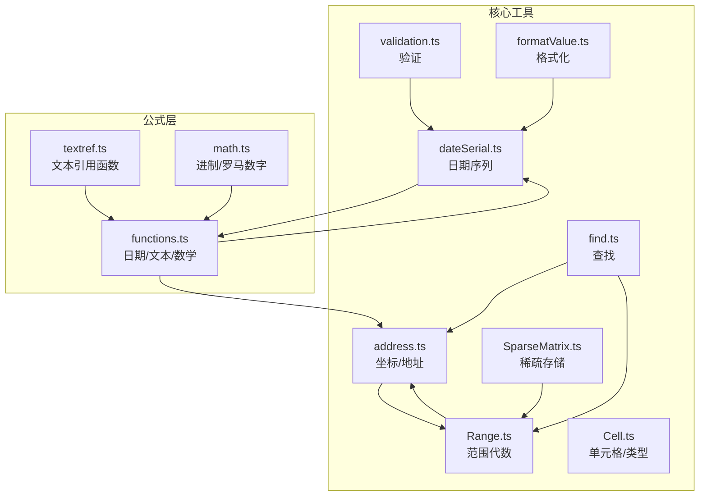
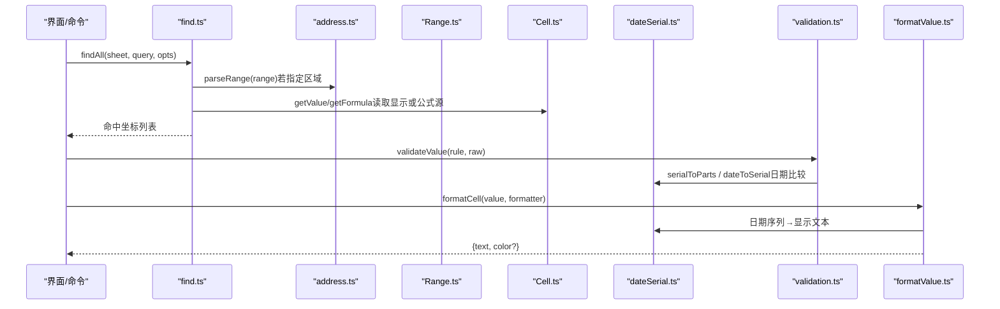
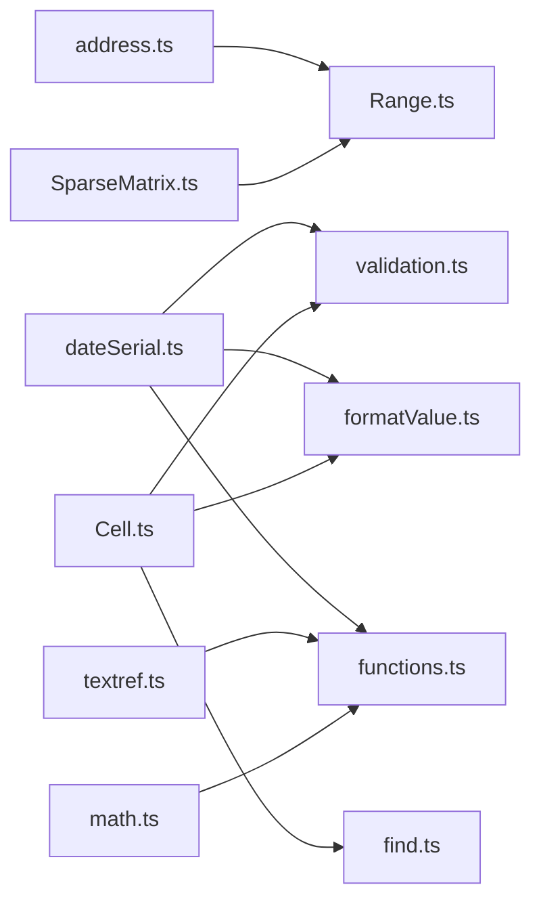

# 工具函数 API

<cite>
**本文引用的文件**
- [address.ts](file://cmx-mega-sheet/src/core/address.ts)
- [dateSerial.ts](file://cmx-mega-sheet/src/core/dateSerial.ts)
- [find.ts](file://cmx-mega-sheet/src/core/find.ts)
- [validation.ts](file://cmx-mega-sheet/src/core/validation.ts)
- [Range.ts](file://cmx-mega-sheet/src/core/Range.ts)
- [Cell.ts](file://cmx-mega-sheet/src/core/Cell.ts)
- [SparseMatrix.ts](file://cmx-mega-sheet/src/core/SparseMatrix.ts)
- [formatValue.ts](file://cmx-mega-sheet/src/render/formatValue.ts)
- [functions.ts](file://cmx-mega-sheet/src/formula/functions.ts)
- [textref.ts](file://cmx-mega-sheet/src/formula/builtins/textref.ts)
- [math.ts](file://cmx-mega-sheet/src/formula/builtins/math.ts)
- [address.test.ts](file://cmx-mega-sheet/test/address.test.ts)
- [DataTools.test.ts](file://cmx-mega-sheet/test/DataTools.test.ts)
</cite>

## 目录
1. [简介](#简介)
2. [项目结构](#项目结构)
3. [核心组件](#核心组件)
4. [架构总览](#架构总览)
5. [详细组件分析](#详细组件分析)
6. [依赖关系分析](#依赖关系分析)
7. [性能考虑](#性能考虑)
8. [故障排查指南](#故障排查指南)
9. [结论](#结论)
10. [附录：常用场景与最佳实践](#附录：常用场景与最佳实践)

## 简介
本参考文档聚焦于电子表格引擎中的实用工具函数库，覆盖坐标转换、日期处理、数据验证、查找算法、范围计算、格式化与类型转换等核心能力。文档以“从基础到组合”的方式组织，既提供函数级 API 说明，也给出调用时序、数据流与错误处理策略，帮助读者在复杂场景中正确组合这些工具函数，兼顾性能与鲁棒性。

## 项目结构
工具函数主要分布在以下模块：
- 坐标与地址解析：address.ts（A1 地址与行列索引互转、区域解析）
- 日期序列：dateSerial.ts（Excel 1900 日期系统、序列号与日期分量互转）
- 查找：find.ts（按值/公式/正则查找命中格）
- 验证：validation.ts（数值、文本长度、列表、日期等规则校验）
- 范围代数：Range.ts（矩形区域的构造、包含、交集、并集、遍历）
- 单元格与类型：Cell.ts（单元格数据结构、富文本、公式清洗）
- 稀疏矩阵：SparseMatrix.ts（稀疏二维存储与行列增删的坐标平移）
- 格式化：formatValue.ts（单元格显示值格式化，委托 numFmt 编译器）
- 内置函数：functions.ts、textref.ts、math.ts（日期、文本、数学等函数实现）

图表来源
- [address.ts:1-112](file://cmx-mega-sheet/src/core/address.ts#L1-L112)
- [dateSerial.ts:1-77](file://cmx-mega-sheet/src/core/dateSerial.ts#L1-L77)
- [Range.ts:1-166](file://cmx-mega-sheet/src/core/Range.ts#L1-L166)
- [Cell.ts:1-74](file://cmx-mega-sheet/src/core/Cell.ts#L1-L74)
- [SparseMatrix.ts:1-157](file://cmx-mega-sheet/src/core/SparseMatrix.ts#L1-L157)
- [find.ts:1-87](file://cmx-mega-sheet/src/core/find.ts#L1-L87)
- [validation.ts:1-88](file://cmx-mega-sheet/src/core/validation.ts#L1-L88)
- [formatValue.ts:1-24](file://cmx-mega-sheet/src/render/formatValue.ts#L1-L24)
- [functions.ts:704-818](file://cmx-mega-sheet/src/formula/functions.ts#L704-L818)
- [textref.ts:39-72](file://cmx-mega-sheet/src/formula/builtins/textref.ts#L39-L72)
- [math.ts:74-110](file://cmx-mega-sheet/src/formula/builtins/math.ts#L74-L110)

章节来源
- [address.ts:1-112](file://cmx-mega-sheet/src/core/address.ts#L1-L112)
- [dateSerial.ts:1-77](file://cmx-mega-sheet/src/core/dateSerial.ts#L1-L77)
- [Range.ts:1-166](file://cmx-mega-sheet/src/core/Range.ts#L1-L166)
- [Cell.ts:1-74](file://cmx-mega-sheet/src/core/Cell.ts#L1-L74)
- [SparseMatrix.ts:1-157](file://cmx-mega-sheet/src/core/SparseMatrix.ts#L1-L157)
- [find.ts:1-87](file://cmx-mega-sheet/src/core/find.ts#L1-L87)
- [validation.ts:1-88](file://cmx-mega-sheet/src/core/validation.ts#L1-L88)
- [formatValue.ts:1-24](file://cmx-mega-sheet/src/render/formatValue.ts#L1-L24)
- [functions.ts:704-818](file://cmx-mega-sheet/src/formula/functions.ts#L704-L818)
- [textref.ts:39-72](file://cmx-mega-sheet/src/formula/builtins/textref.ts#L39-L72)
- [math.ts:74-110](file://cmx-mega-sheet/src/formula/builtins/math.ts#L74-L110)

## 核心组件
- 坐标与地址解析（address.ts）
  - 列索引与标签互转（bijective base-26），支持大小写不敏感与非法输入容错
  - 单格地址解析/格式化（A1 ↔ {row,col}，行号 1-based）
  - 区域字符串解析/格式化（支持端点顺序归一化）
- 日期序列（dateSerial.ts）
  - Excel 1900 日期系统：含虚构闰年补偿
  - 序列号与日期分量互转、时刻分数、完整序列号构建
- 范围代数（Range.ts）
  - 不可变范围对象：构造、包含、相交、交集、包围盒并集、平移、遍历
  - 与 address.ts 的双向转换（A1 字符串 ↔ Range）
- 查找（find.ts）
  - 支持值/公式源匹配、大小写敏感、整格匹配、区域限定、可选正则
  - 返回命中坐标列表（行优先），供高亮/定位/替换消费
- 验证（validation.ts）
  - 类型：list/whole/decimal/date/textLength/custom
  - 边界比较 operator（between/notBetween/eq/ne/gt/lt/ge/le）
  - 空值允许策略与失败消息
- 单元格与类型（Cell.ts）
  - 单元格数据结构、富文本、纯文本提取
  - 类型规范化 toCellValue、公式清洗 sanitizeImportedFormula
- 稀疏矩阵（SparseMatrix.ts）
  - 稀疏二维存储，行列增删时的坐标平移与区间删除
- 格式化（formatValue.ts）
  - 单元格显示值格式化（委托 numFmt 编译器），支持多区段、颜色、条件段、日期掩码、科学计数、分数、缩放

章节来源
- [address.ts:1-112](file://cmx-mega-sheet/src/core/address.ts#L1-L112)
- [dateSerial.ts:1-77](file://cmx-mega-sheet/src/core/dateSerial.ts#L1-L77)
- [Range.ts:1-166](file://cmx-mega-sheet/src/core/Range.ts#L1-L166)
- [find.ts:1-87](file://cmx-mega-sheet/src/core/find.ts#L1-L87)
- [validation.ts:1-88](file://cmx-mega-sheet/src/core/validation.ts#L1-L88)
- [Cell.ts:1-74](file://cmx-mega-sheet/src/core/Cell.ts#L1-L74)
- [SparseMatrix.ts:1-157](file://cmx-mega-sheet/src/core/SparseMatrix.ts#L1-L157)
- [formatValue.ts:1-24](file://cmx-mega-sheet/src/render/formatValue.ts#L1-L24)

## 架构总览
工具函数围绕“坐标—范围—数据—格式—函数”形成清晰分层：
- 坐标层：address.ts 提供 A1 地址与行列索引互转，是其他模块的基础
- 范围层：Range.ts 基于坐标进行区域代数运算
- 数据层：Cell.ts、SparseMatrix.ts 提供单元格与稀疏存储
- 功能层：find.ts、validation.ts 提供查找与验证
- 展示层：formatValue.ts 负责显示格式化
- 公式层：functions.ts、textref.ts、math.ts 复用上述工具完成日期、文本、数学等计算

图表来源
- [find.ts:1-87](file://cmx-mega-sheet/src/core/find.ts#L1-L87)
- [address.ts:1-112](file://cmx-mega-sheet/src/core/address.ts#L1-L112)
- [Range.ts:1-166](file://cmx-mega-sheet/src/core/Range.ts#L1-L166)
- [Cell.ts:1-74](file://cmx-mega-sheet/src/core/Cell.ts#L1-L74)
- [dateSerial.ts:1-77](file://cmx-mega-sheet/src/core/dateSerial.ts#L1-L77)
- [validation.ts:1-88](file://cmx-mega-sheet/src/core/validation.ts#L1-L88)
- [formatValue.ts:1-24](file://cmx-mega-sheet/src/render/formatValue.ts#L1-L24)

## 详细组件分析

### 坐标与地址解析（address.ts）
- 关键函数
  - colToLabel(index): 列索引 → 标签（bijective base-26，负数/非整数归为 A）
  - labelToCol(label): 标签 → 索引（非法返回 -1）
  - parseAddr(addr): 解析 "A1" → {row,col}（行号 1-based，非法返回 null）
  - formatAddr(row,col): {row,col} → "A1"
  - parseRange(range): 解析 "A1:C3"/"B2" → 归一化 RangeCoord（r1≤r2, c1≤c2）
  - formatRange(coord): RangeCoord → 区域字符串（单格无冒号）
- 复杂度
  - 列标签转换 O(log_26 n)，地址解析 O(1) 正则 + 线性标签处理
  - 区域解析 O(1)
- 边界情况
  - 非法标签/地址返回 -1/null；行号 0 视为无效
  - 区域端点顺序任意，输出始终归一化
- 使用建议
  - 所有坐标内部统一 0-based；对外 A1 引用保持 1-based 行号
  - 与 Range.ts 配合：fromA1/toA1 双向转换

章节来源
- [address.ts:1-112](file://cmx-mega-sheet/src/core/address.ts#L1-L112)
- [address.test.ts:1-110](file://cmx-mega-sheet/test/address.test.ts#L1-L110)

### 日期序列（dateSerial.ts）
- 关键函数
  - serialToParts(serial): 序列号 → 日期时间分量（含星期、秒级四舍五入）
  - dateToSerial(year,month,day): 日历 → 序列号（1900-03-01 起 +1 补偿虚构闰日）
  - timeToFraction(h,m,s): 时刻 → 小数部分
  - serialToTime(serial): 序列号 → 时刻分量
  - partsToSerial(y,m,d,h=0,m=0,s=0): 日历+时刻 → 完整序列号
- 复杂度
  - 全部 O(1) 数学运算
- 边界情况
  - serial 60 对应虚构 1900-02-29，需归一到 1900-03-01
  - 跨日进位由 Date 处理，秒级四舍五入避免浮点误差
- 使用建议
  - 所有日期计算统一走序列号，避免时区与夏令时问题
  - 与 validation.ts、functions.ts 的日期函数协同

章节来源
- [dateSerial.ts:1-77](file://cmx-mega-sheet/src/core/dateSerial.ts#L1-L77)

### 范围代数（Range.ts）
- 关键方法
  - fromA1/fromCorners/fromCoord：多种构造方式
  - containsCell/containsRange/intersects/intersect/boundingUnion：区域几何运算
  - translate：平移（行列 clamp ≥0）
  - forEachCell/cells：遍历（行优先）
  - toA1/toCoord：与 address.ts 双向转换
- 复杂度
  - 几何运算 O(1)；遍历 O(N) 其中 N 为区域内单元格数
- 边界情况
  - rowCount/colCount <1 归一为 1；坐标 clamp 到 ≥0
- 使用建议
  - 选区、合并单元格、样式套用均基于 Range；与 find.ts 的区域限定参数一致

章节来源
- [Range.ts:1-166](file://cmx-mega-sheet/src/core/Range.ts#L1-L166)

### 查找算法（find.ts）
- 关键函数
  - findAll(sheet, query, opts): 返回命中坐标列表（行优先）
  - buildMatcher/literalMatcher：匹配器构造（支持正则、大小写、整格匹配）
- 复杂度
  - 全表扫描 O(R×C)；区域限定可显著减少扫描量
- 边界情况
  - 空查询直接返回空；空格不参与查找（对齐 Excel）
  - 非法正则退化为字面匹配
- 使用建议
  - 大表务必传入 range 限制搜索域；正则模式谨慎使用

章节来源
- [find.ts:1-87](file://cmx-mega-sheet/src/core/find.ts#L1-L87)

### 数据验证（validation.ts）
- 关键函数
  - validateValue(rule, raw, customEval?): 校验用户输入是否满足规则
  - compareBound(v, op, f1, f2): 边界比较（between/notBetween/eq/ne/gt/lt/ge/le）
- 复杂度
  - O(1)
- 边界情况
  - 空值允许策略 allowBlank；自定义验证未通过返回默认错误文案
- 使用建议
  - 编辑器提交前调用；对日期/数值严格校验，提升数据质量

章节来源
- [validation.ts:1-88](file://cmx-mega-sheet/src/core/validation.ts#L1-L88)

### 单元格与类型（Cell.ts）
- 关键函数
  - richToPlain(rich): 富文本 → 纯文本（用于 value 兜底/查找/排序）
  - toCellValue(v): 规范化为 CellValue（undefined/null→null）
  - normalizeFormula(formula): 剥去前导 '='，trim
  - sanitizeImportedFormula(formula): 清洗导入公式中的伪前缀（@、_xlfn._xlws.）
- 复杂度
  - O(L) L 为文本长度
- 边界情况
  - 空/undefined 公式归一为空串；导入公式多次剥离 @ 前缀
- 使用建议
  - 公式清洗应在导入后、求值前执行；富文本与标量 value 并存，保证兼容

章节来源
- [Cell.ts:1-74](file://cmx-mega-sheet/src/core/Cell.ts#L1-L74)

### 稀疏矩阵（SparseMatrix.ts）
- 关键操作
  - get/set/delete/has/size：基本存取
  - insertRows/deleteRows/insertColumns/deleteColumns：行列增删与坐标平移
  - shiftRows/shiftCols：内部平移实现（重建 map 避免键碰撞）
- 复杂度
  - 存取 O(1)；增删涉及受影响槽位平移，最坏 O(K) K 为非空槽位数
- 边界情况
  - count ≤0 为 no-op；删除区间内槽位丢弃
- 使用建议
  - 大量空格的表格适用；批量增删行列时注意性能影响

章节来源
- [SparseMatrix.ts:1-157](file://cmx-mega-sheet/src/core/SparseMatrix.ts#L1-L157)

### 格式化（formatValue.ts）
- 关键函数
  - formatCell(value, formatter?): 返回 {text, color?}
  - formatValue(value, formatter?): 仅返回显示文本（向后兼容）
- 复杂度
  - 委托 numFmt 编译器，通常为 O(L)
- 边界情况
  - 多区段格式（正;负;零;文本）、颜色段、条件段、日期掩码、科学计数、分数、缩放
- 使用建议
  - 渲染层优先使用 formatCell 获取颜色信息；TEXT() 函数复用同一引擎

章节来源
- [formatValue.ts:1-24](file://cmx-mega-sheet/src/render/formatValue.ts#L1-L24)

### 内置函数（functions.ts、textref.ts、math.ts）
- 日期函数（functions.ts）
  - datedif：按单位（D/M/Y/MD/YM/YD）计算间隔
  - dateValue：解析常见日期字符串为序列号
  - networkDays：工作日计数（跳过周末与节假日）
- 文本函数（textref.ts）
  - TEXTBEFORE/TEXTAFTER：按分隔符取第 instance 个前后子串（支持负序）
- 数学函数（math.ts）
  - 进制转换 toBaseText、罗马数字 toRoman/fromRoman
- 复杂度
  - 多为 O(1) 或 O(L) 字符串处理
- 边界情况
  - 非法参数返回 #VALUE!/#NUM!；百分比自动识别
- 使用建议
  - 与 dateSerial.ts 紧密协作；文本函数与 find.ts 的正则/字面匹配互补

章节来源
- [functions.ts:704-818](file://cmx-mega-sheet/src/formula/functions.ts#L704-L818)
- [textref.ts:39-72](file://cmx-mega-sheet/src/formula/builtins/textref.ts#L39-L72)
- [math.ts:74-110](file://cmx-mega-sheet/src/formula/builtins/math.ts#L74-L110)

## 依赖关系分析
- address.ts 被 Range.ts 依赖（A1↔Range 转换）
- dateSerial.ts 被 validation.ts、formatValue.ts、functions.ts 依赖（日期序列）
- Cell.ts 被 find.ts、validation.ts、formatValue.ts 间接使用（值/公式/富文本）
- SparseMatrix.ts 为 Worksheet 底层存储，受 Range 增删操作影响
- functions.ts 依赖 dateSerial.ts、address.ts（日期/坐标）
- textref.ts、math.ts 作为内置函数扩展，复用通用工具

图表来源
- [address.ts:1-112](file://cmx-mega-sheet/src/core/address.ts#L1-L112)
- [Range.ts:1-166](file://cmx-mega-sheet/src/core/Range.ts#L1-L166)
- [dateSerial.ts:1-77](file://cmx-mega-sheet/src/core/dateSerial.ts#L1-L77)
- [validation.ts:1-88](file://cmx-mega-sheet/src/core/validation.ts#L1-L88)
- [formatValue.ts:1-24](file://cmx-mega-sheet/src/render/formatValue.ts#L1-L24)
- [Cell.ts:1-74](file://cmx-mega-sheet/src/core/Cell.ts#L1-L74)
- [find.ts:1-87](file://cmx-mega-sheet/src/core/find.ts#L1-L87)
- [SparseMatrix.ts:1-157](file://cmx-mega-sheet/src/core/SparseMatrix.ts#L1-L157)
- [functions.ts:704-818](file://cmx-mega-sheet/src/formula/functions.ts#L704-L818)
- [textref.ts:39-72](file://cmx-mega-sheet/src/formula/builtins/textref.ts#L39-L72)
- [math.ts:74-110](file://cmx-mega-sheet/src/formula/builtins/math.ts#L74-L110)

## 性能考虑
- 查找优化
  - 使用 find.ts 的 range 参数限制搜索域，避免全表扫描
  - 正则匹配开销较大，必要时回退到字面匹配
- 日期计算
  - 统一使用序列号，避免 Date 对象频繁创建；serialToParts/timeToFraction 为 O(1)
- 范围操作
  - Range 几何运算 O(1)；遍历 O(N) 时应按需裁剪区域
- 稀疏存储
  - SparseMatrix 适合大量空格的表格；行列增删可能触发 O(K) 平移，批量操作时注意
- 格式化
  - formatValue/formatCell 委托 numFmt 编译器，复杂格式串可能带来额外开销；缓存结果可提升性能

[本节为通用指导，无需特定文件来源]

## 故障排查指南
- 地址解析失败
  - 检查 A1 字符串是否符合 /^[A-Za-z]+\d+$/；行号必须 ≥1；列标签仅字母
  - 参考：[address.ts:65-72](file://cmx-mega-sheet/src/core/address.ts#L65-L72)
- 日期序列异常
  - 确认 serial 与日期分量的转换逻辑；注意 1900 虚构闰日补偿
  - 参考：[dateSerial.ts:29-53](file://cmx-mega-sheet/src/core/dateSerial.ts#L29-L53)
- 查找无结果
  - 检查 matchCase/wholeCell/useRegex 配置；确认 region 限定是否正确
  - 参考：[find.ts:33-53](file://cmx-mega-sheet/src/core/find.ts#L33-L53)
- 验证失败
  - 核对 rule.type 与 operator；空值 allowBlank 设置；自定义验证回调
  - 参考：[validation.ts:24-65](file://cmx-mega-sheet/src/core/validation.ts#L24-L65)
- 导入公式报错
  - 使用 sanitizeImportedFormula 清理 @ 与 _xlfn./_xlws. 前缀
  - 参考：[Cell.ts:65-73](file://cmx-mega-sheet/src/core/Cell.ts#L65-L73)

章节来源
- [address.ts:65-72](file://cmx-mega-sheet/src/core/address.ts#L65-L72)
- [dateSerial.ts:29-53](file://cmx-mega-sheet/src/core/dateSerial.ts#L29-L53)
- [find.ts:33-53](file://cmx-mega-sheet/src/core/find.ts#L33-L53)
- [validation.ts:24-65](file://cmx-mega-sheet/src/core/validation.ts#L24-L65)
- [Cell.ts:65-73](file://cmx-mega-sheet/src/core/Cell.ts#L65-L73)

## 结论
该工具函数库以坐标与日期为核心基元，围绕范围代数、查找、验证、格式化与内置函数构建了完整的实用工具体系。通过严格的边界处理、清晰的依赖分层与高效的算法实现，可在大规模电子表格场景中稳定工作。建议在开发中优先使用标准化接口（如 Range、address、dateSerial），并在大数据量场景下结合范围限定与稀疏存储优化性能。

[本节为总结，无需特定文件来源]

## 附录：常用场景与最佳实践
- 坐标转换
  - 将 A1 地址解析为行列索引，再进行范围计算与遍历
  - 参考：[address.ts:35-77](file://cmx-mega-sheet/src/core/address.ts#L35-L77)
- 日期处理
  - 使用 dateToSerial/partsToSerial 统一日期表示；datedif/networkDays 计算业务间隔
  - 参考：[dateSerial.ts:47-77](file://cmx-mega-sheet/src/core/dateSerial.ts#L47-L77)、[functions.ts:771-818](file://cmx-mega-sheet/src/formula/functions.ts#L771-L818)
- 数据验证
  - 在编辑器提交前调用 validateValue；对日期/数值严格校验，提升数据质量
  - 参考：[validation.ts:24-65](file://cmx-mega-sheet/src/core/validation.ts#L24-L65)
- 查找与高亮
  - 使用 findAll 获取命中坐标；结合 Range.forEachCell 高亮显示
  - 参考：[find.ts:33-53](file://cmx-mega-sheet/src/core/find.ts#L33-L53)
- 格式化显示
  - 使用 formatCell 获取文本与颜色；TEXT() 函数复用同一引擎
  - 参考：[formatValue.ts:15-23](file://cmx-mega-sheet/src/render/formatValue.ts#L15-L23)
- 组合模式
  - 地址解析 → 范围构造 → 查找/验证 → 格式化显示，形成端到端流程
  - 参考：[Range.ts:69-83](file://cmx-mega-sheet/src/core/Range.ts#L69-L83)、[address.ts:84-111](file://cmx-mega-sheet/src/core/address.ts#L84-L111)

章节来源
- [address.ts:35-111](file://cmx-mega-sheet/src/core/address.ts#L35-L111)
- [dateSerial.ts:47-77](file://cmx-mega-sheet/src/core/dateSerial.ts#L47-L77)
- [functions.ts:771-818](file://cmx-mega-sheet/src/formula/functions.ts#L771-L818)
- [validation.ts:24-65](file://cmx-mega-sheet/src/core/validation.ts#L24-L65)
- [find.ts:33-53](file://cmx-mega-sheet/src/core/find.ts#L33-L53)
- [formatValue.ts:15-23](file://cmx-mega-sheet/src/render/formatValue.ts#L15-L23)
- [Range.ts:69-83](file://cmx-mega-sheet/src/core/Range.ts#L69-L83)