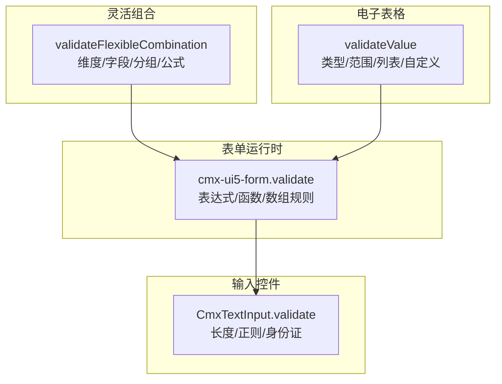
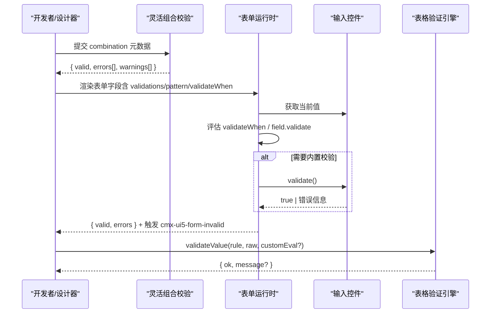
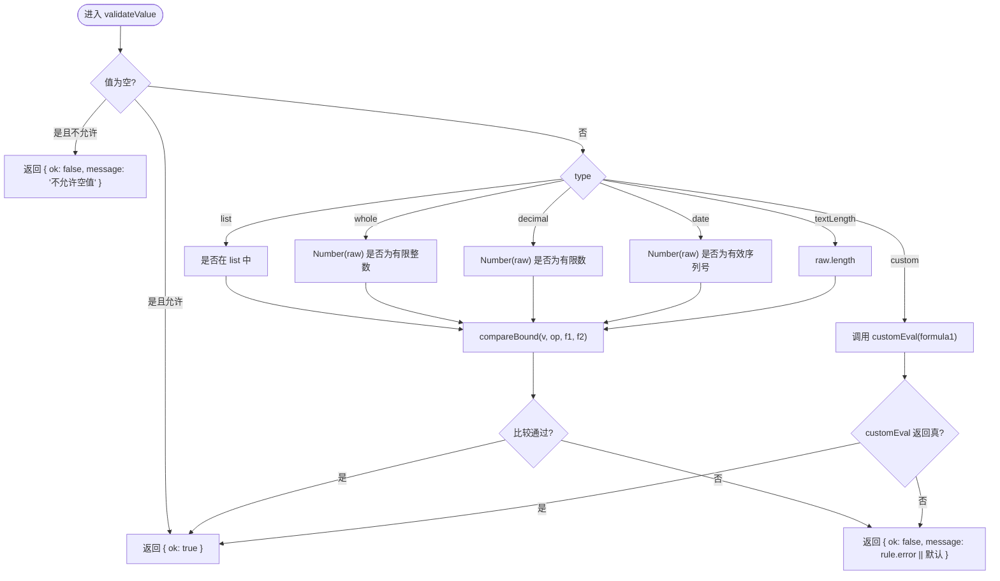
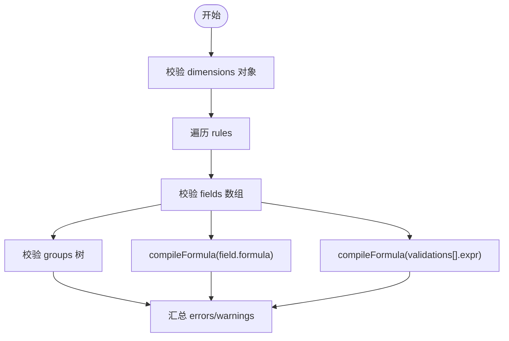
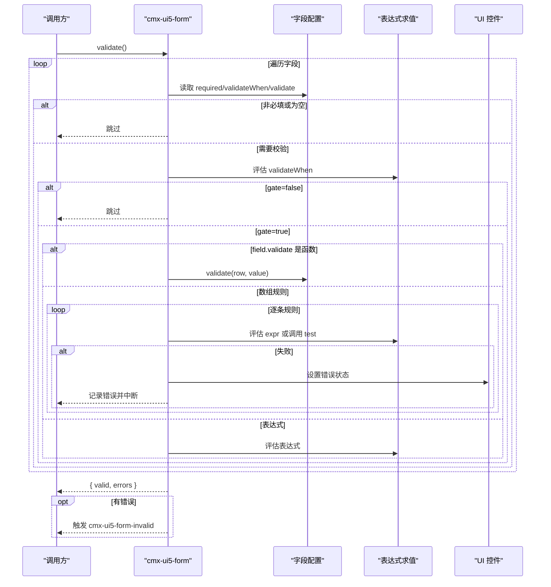
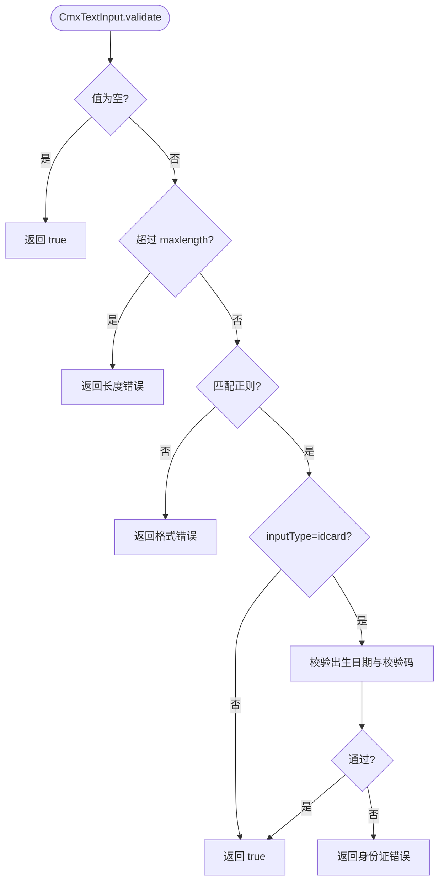
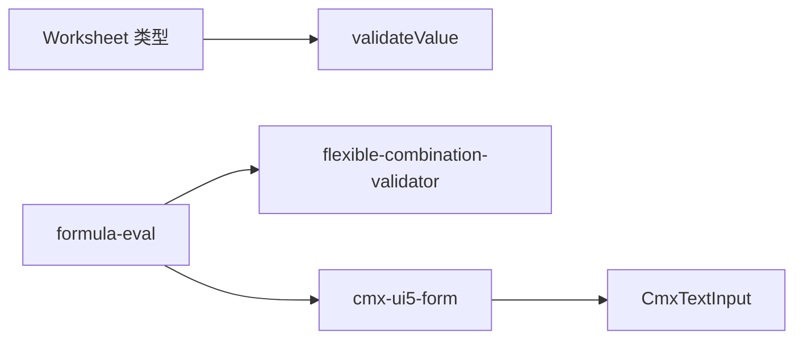

# 数据验证工具

<cite>
**本文引用的文件**
- [validation.ts](file://cmx-mega-sheet/src/core/validation.ts)
- [validationM12.test.ts](file://cmx-mega-sheet/test/validationM12.test.ts)
- [flexible-combination-validator.js](file://packages/cmx-data-comp/src/lib/flexible-combination-validator.js)
- [cmx-ui5-form.js](file://packages/cmx-data-comp/src/components/cmx-ui5-form.js)
- [cmx-text-input.js](file://packages/cmx-data-comp/src/components/cmx-text-input.js)
- [flexible-combination-engine.test.js](file://packages/cmx-data-comp/src/lib/__tests__/flexible-combination-engine.test.js)
</cite>

## 目录
1. [简介](#简介)
2. [项目结构](#项目结构)
3. [核心组件](#核心组件)
4. [架构总览](#架构总览)
5. [详细组件分析](#详细组件分析)
6. [依赖关系分析](#依赖关系分析)
7. [性能考虑](#性能考虑)
8. [故障排查指南](#故障排查指南)
9. [结论](#结论)
10. [附录](#附录)

## 简介
本文件面向“数据验证工具”的 API 与使用实践，覆盖以下主题：
- 数值、文本、日期、列表与自定义验证规则
- 验证器注册机制、执行流程与错误消息生成
- 内置规则用法（范围检查、长度限制、格式匹配等）
- 自定义验证器的开发与集成
- 批量验证、异步验证与结果处理的最佳实践

本项目在两个层面提供验证能力：
- 表格单元格级验证引擎：纯逻辑、无 DOM，适合在提交前对单值进行快速判定。
- 表单/字段级验证体系：基于字段配置与表达式求值，支持函数式规则、正则、条件门控与 UI 错误态展示。

## 项目结构
围绕数据验证的相关代码主要分布在：
- 电子表格验证引擎：位于 cmx-mega-sheet 的核心模块，提供 validateValue 等基础能力。
- 灵活组合元数据校验：位于 packages/cmx-data-comp，负责校验组合定义、字段、分组与公式合法性。
- 表单运行时验证：位于 packages/cmx-data-comp 的表单组件，负责按字段配置执行验证并反馈 UI。
- 输入控件内置校验：文本输入控件自带长度、正则与身份证等内置校验。

图表来源
- [validation.ts:1-87](file://cmx-mega-sheet/src/core/validation.ts#L1-L87)
- [flexible-combination-validator.js:24-125](file://packages/cmx-data-comp/src/lib/flexible-combination-validator.js#L24-L125)
- [cmx-ui5-form.js:690-724](file://packages/cmx-data-comp/src/components/cmx-ui5-form.js#L690-L724)
- [cmx-text-input.js:233-251](file://packages/cmx-data-comp/src/components/cmx-text-input.js#L233-L251)

章节来源
- [validation.ts:1-87](file://cmx-mega-sheet/src/core/validation.ts#L1-L87)
- [flexible-combination-validator.js:24-125](file://packages/cmx-data-comp/src/lib/flexible-combination-validator.js#L24-L125)
- [cmx-ui5-form.js:690-724](file://packages/cmx-data-comp/src/components/cmx-ui5-form.js#L690-L724)
- [cmx-text-input.js:233-251](file://packages/cmx-data-comp/src/components/cmx-text-input.js#L233-L251)

## 核心组件
- 电子表格验证引擎
  - 入口：validateValue(rule, raw, customEval?)
  - 支持类型：list、whole、decimal、date、textLength、custom
  - 比较操作符：between、notBetween、eq、ne、gt、lt、ge、le
  - 空值策略：allowBlank 控制是否允许空
  - 错误消息：优先使用 rule.error，否则返回默认提示
- 灵活组合元数据校验
  - 入口：validateFlexibleCombination(combination)
  - 校验范围：dimensions、rules、fields、groups、columnModel、anchor、match、formula、validations
  - 输出：{ valid, errors[], warnings[] }
- 表单运行时验证
  - 入口：cmx-ui5-form.validate()
  - 支持：validateWhen 门控、field.validate 为函数/表达式/数组、逐条失败取 message
  - 事件：cmx-ui5-form-invalid(detail: { errors, row })
- 输入控件内置校验
  - CmxTextInput.validate()：长度、正则、电话/邮箱/身份证内置模式
  - 多语言与只读、占位符等属性由 setField 注入

章节来源
- [validation.ts:1-87](file://cmx-mega-sheet/src/core/validation.ts#L1-L87)
- [flexible-combination-validator.js:24-125](file://packages/cmx-data-comp/src/lib/flexible-combination-validator.js#L24-L125)
- [cmx-ui5-form.js:690-724](file://packages/cmx-data-comp/src/components/cmx-ui5-form.js#L690-L724)
- [cmx-text-input.js:233-251](file://packages/cmx-data-comp/src/components/cmx-text-input.js#L233-L251)

## 架构总览
下图展示了从“字段配置”到“运行时验证”的端到端流程：设计期通过灵活组合定义字段与规则，编译期进行静态校验；运行期表单根据字段配置执行验证，必要时调用输入控件的内置校验；表格场景可直接调用 validateValue 对单元格值进行判定。

图表来源
- [flexible-combination-validator.js:24-125](file://packages/cmx-data-comp/src/lib/flexible-combination-validator.js#L24-L125)
- [cmx-ui5-form.js:690-724](file://packages/cmx-data-comp/src/components/cmx-ui5-form.js#L690-L724)
- [cmx-text-input.js:233-251](file://packages/cmx-data-comp/src/components/cmx-text-input.js#L233-L251)
- [validation.ts:1-87](file://cmx-mega-sheet/src/core/validation.ts#L1-L87)

## 详细组件分析

### 电子表格验证引擎（validateValue）
- 功能要点
  - 空值处理：allowBlank=false 时拒绝空值
  - 类型校验：whole/decimal/date 会先判断是否为有效数字/序列号
  - 范围比较：operator 支持 between/notBetween/eq/ne/gt/lt/ge/le
  - 文本长度：textLength 以字符串长度为基准
  - 自定义验证：type=custom 时调用 customEval(formula1)
  - 错误消息：rule.error 优先，否则回退默认文案
- 复杂度
  - 时间复杂度 O(1)，空间复杂度 O(1)
- 典型用法
  - 整数范围：type=whole, operator=between, formula1/formula2 指定边界
  - 小数大于某值：type=decimal, operator=gt, formula1=阈值
  - 日期区间：type=date, operator=between, 传入日期序列号
  - 文本长度限制：type=textLength, operator=le, formula1=最大长度
  - 自定义逻辑：type=custom, 传入 customEval 实现业务规则

图表来源
- [validation.ts:24-87](file://cmx-mega-sheet/src/core/validation.ts#L24-L87)

章节来源
- [validation.ts:24-87](file://cmx-mega-sheet/src/core/validation.ts#L24-L87)
- [validationM12.test.ts:29-65](file://cmx-mega-sheet/test/validationM12.test.ts#L29-L65)

### 灵活组合元数据校验（validateFlexibleCombination）
- 功能要点
  - 校验 dimensions/rules/columnModel/fields/groups/anchor/match/formula/validations
  - 字段维度引用、source/defaultFrom 的维度与属性存在性校验
  - 公式与校验表达式 compileFormula 静态检查
  - 分组成员有效性、聚合键与位置校验
  - 输出包含 errors/warnings，便于编辑器高亮定位
- 复杂度
  - 线性遍历 fields/groups，公式编译与循环检测近似 O(n)
- 典型用法
  - 在编辑界面提交前调用，收集 schema 错误并阻止发布
  - 将 validations[].expr 编译后用于运行时求值

图表来源
- [flexible-combination-validator.js:24-125](file://packages/cmx-data-comp/src/lib/flexible-combination-validator.js#L24-L125)
- [flexible-combination-validator.js:127-195](file://packages/cmx-data-comp/src/lib/flexible-combination-validator.js#L127-L195)
- [flexible-combination-validator.js:197-228](file://packages/cmx-data-comp/src/lib/flexible-combination-validator.js#L197-L228)

章节来源
- [flexible-combination-validator.js:24-125](file://packages/cmx-data-comp/src/lib/flexible-combination-validator.js#L24-L125)
- [flexible-combination-validator.js:127-195](file://packages/cmx-data-comp/src/lib/flexible-combination-validator.js#L127-L195)
- [flexible-combination-validator.js:197-228](file://packages/cmx-data-comp/src/lib/flexible-combination-validator.js#L197-L228)

### 表单运行时验证（cmx-ui5-form.validate）
- 功能要点
  - 必填校验：required 与 requiredMessage
  - 条件门控：validateWhen 表达式决定是否需要校验
  - 规则形式：
    - 函数：field.validate(row, value)
    - 表达式：field.validate 为字符串表达式
    - 数组：[{ expr/message }, { test/message }] 顺序执行，首条失败即停
  - 错误消息优先级：rule.message → field.validateMessage → field.message → 默认
  - UI 反馈：设置控件 value-state 与样式类，触发 cmx-ui5-form-invalid 事件
- 复杂度
  - 每行字段数量 n，每条规则 m，总体 O(n*m)
- 最佳实践
  - 复杂逻辑建议拆分为多个小规则，便于定位 message
  - 使用 validateWhen 避免不必要的计算
  - 统一错误消息文案，提升可维护性

图表来源
- [cmx-ui5-form.js:690-724](file://packages/cmx-data-comp/src/components/cmx-ui5-form.js#L690-L724)

章节来源
- [cmx-ui5-form.js:690-724](file://packages/cmx-data-comp/src/components/cmx-ui5-form.js#L690-L724)

### 输入控件内置校验（CmxTextInput）
- 功能要点
  - 长度限制：maxlength/length
  - 正则匹配：pattern 优先于 inputType 内置正则
  - 内置模式：phone/email/idcard（身份证含出生日期与校验码）
  - 返回值：true 表示通过，否则返回错误信息字符串
- 复杂度
  - 单次校验 O(L)（L 为字符串长度）
- 最佳实践
  - 使用 pattern 精确约束格式，避免过于宽泛的正则
  - 对敏感字段（如身份证）启用内置 idcard 模式

图表来源
- [cmx-text-input.js:233-251](file://packages/cmx-data-comp/src/components/cmx-text-input.js#L233-L251)

章节来源
- [cmx-text-input.js:233-251](file://packages/cmx-data-comp/src/components/cmx-text-input.js#L233-L251)

## 依赖关系分析
- 电子表格验证引擎
  - 依赖 Worksheet 类型定义（DataValidation、ValidationOperator）
  - 被测试用例覆盖，保证行为稳定
- 灵活组合校验
  - 依赖公式编译（compileFormula）与字段元数据工具（fieldId）
  - 与表单引擎解耦，仅产出诊断结果
- 表单运行时
  - 依赖表达式求值（evalFormula），与 UI5 控件交互
  - 与输入控件解耦，通过标准接口获取值与设置错误态
- 输入控件
  - 自包含校验逻辑，不依赖表单组件

图表来源
- [validation.ts:11-12](file://cmx-mega-sheet/src/core/validation.ts#L11-L12)
- [flexible-combination-validator.js:8-9](file://packages/cmx-data-comp/src/lib/flexible-combination-validator.js#L8-L9)
- [cmx-ui5-form.js:725-728](file://packages/cmx-data-comp/src/components/cmx-ui5-form.js#L725-L728)

章节来源
- [validation.ts:11-12](file://cmx-mega-sheet/src/core/validation.ts#L11-L12)
- [flexible-combination-validator.js:8-9](file://packages/cmx-data-comp/src/lib/flexible-combination-validator.js#L8-L9)
- [cmx-ui5-form.js:725-728](file://packages/cmx-data-comp/src/components/cmx-ui5-form.js#L725-L728)

## 性能考虑
- 电子表格验证：O(1) 判定，适合高频单元格提交前校验
- 表单验证：按字段与规则数量线性增长，建议拆分复杂规则、合理使用 validateWhen
- 灵活组合校验：编译期一次性完成，避免运行时开销
- 输入控件：正则与长度校验代价低，避免过复杂的正则表达式

## 故障排查指南
- 电子表格验证
  - 现象：整型/小数/日期校验失败
  - 排查：确认 allowBlank、operator 与 formula1/formula2 边界是否正确
  - 参考：[validation.ts:39-57](file://cmx-mega-sheet/src/core/validation.ts#L39-L57)
- 表单验证
  - 现象：未触发校验或错误消息不正确
  - 排查：检查 validateWhen 门控、field.validate 形式（函数/表达式/数组）、message 优先级
  - 参考：[cmx-ui5-form.js:690-724](file://packages/cmx-data-comp/src/components/cmx-ui5-form.js#L690-L724)
- 输入控件
  - 现象：格式校验误报
  - 排查：确认 pattern 与 inputType 的优先级，以及 maxlength 设置
  - 参考：[cmx-text-input.js:233-251](file://packages/cmx-data-comp/src/components/cmx-text-input.js#L233-L251)
- 灵活组合
  - 现象：发布时报错或警告
  - 排查：查看 errors/warnings 中的 path 与 code，修正维度/字段/分组/公式
  - 参考：[flexible-combination-validator.js:24-125](file://packages/cmx-data-comp/src/lib/flexible-combination-validator.js#L24-L125)

章节来源
- [validation.ts:39-57](file://cmx-mega-sheet/src/core/validation.ts#L39-L57)
- [cmx-ui5-form.js:690-724](file://packages/cmx-data-comp/src/components/cmx-ui5-form.js#L690-L724)
- [cmx-text-input.js:233-251](file://packages/cmx-data-comp/src/components/cmx-text-input.js#L233-L251)
- [flexible-combination-validator.js:24-125](file://packages/cmx-data-comp/src/lib/flexible-combination-validator.js#L24-L125)

## 结论
- 电子表格验证提供轻量、高性能的单值判定能力，适合单元格级强约束。
- 表单验证体系以字段配置为中心，支持函数式、表达式与数组规则，具备良好可扩展性与可观测性。
- 灵活组合校验确保元数据的正确性，降低运行时风险。
- 输入控件内置常用格式校验，减少重复实现成本。
- 推荐实践：设计期用灵活组合校验保障元数据；运行期用表单验证承载业务规则；表格场景用 validateValue 做快速拦截。

## 附录

### 内置验证规则速查
- 数值范围
  - whole/decimal/date + operator（between/eq/gt/lt/ge/le/notBetween）
  - 参考：[validation.ts:39-57](file://cmx-mega-sheet/src/core/validation.ts#L39-L57)
- 文本长度
  - textLength + operator（le/gt/ge/lt/between）
  - 参考：[validation.ts:54-57](file://cmx-mega-sheet/src/core/validation.ts#L54-L57)
- 列表选择
  - list 包含原始输入值
  - 参考：[validation.ts:35-38](file://cmx-mega-sheet/src/core/validation.ts#L35-L38)
- 格式匹配
  - 输入控件 pattern 与内置 phone/email/idcard
  - 参考：[cmx-text-input.js:233-251](file://packages/cmx-data-comp/src/components/cmx-text-input.js#L233-L251)

### 自定义验证器开发指南
- 表单字段
  - 函数式：field.validate = (row, value) => boolean
  - 表达式：field.validate = "表达式"
  - 数组规则：[{ expr/message }, { test/message }]
  - 参考：[cmx-ui5-form.js:701-712](file://packages/cmx-data-comp/src/components/cmx-ui5-form.js#L701-L712)
- 电子表格单元格
  - type=custom，提供 customEval(formula1) 实现业务逻辑
  - 参考：[validation.ts:58-61](file://cmx-mega-sheet/src/core/validation.ts#L58-L61)
- 灵活组合
  - 在字段 validations 中声明 expr 与 message，编译期静态检查
  - 参考：[flexible-combination-validator.js:178-188](file://packages/cmx-data-comp/src/lib/flexible-combination-validator.js#L178-L188)

### 批量验证与异步验证
- 批量验证
  - 表单：validate() 遍历所有字段，返回 { valid, errors }
  - 电子表格：对每个单元格调用 validateValue
  - 参考：[cmx-ui5-form.js:690-724](file://packages/cmx-data-comp/src/components/cmx-ui5-form.js#L690-L724)
- 异步验证
  - 表单：可在 field.validate 函数中发起异步请求，返回 Promise<boolean>
  - 电子表格：customEval 可封装异步逻辑（需上层适配 Promise）
  - 参考：[cmx-ui5-form.js:701-712](file://packages/cmx-data-comp/src/components/cmx-ui5-form.js#L701-L712)

### 验证结果处理最佳实践
- 统一错误消息：优先使用 rule.message，其次 field.validateMessage 或 field.message
- 用户反馈：表单触发 cmx-ui5-form-invalid 事件，结合 UI 控件 value-state 显示错误
- 调试定位：灵活组合校验返回 errors/warnings 的 path 与 code，便于精准修复
- 参考：
  - [cmx-ui5-form.js:713-721](file://packages/cmx-data-comp/src/components/cmx-ui5-form.js#L713-L721)
  - [flexible-combination-validator.js:24-32](file://packages/cmx-data-comp/src/lib/flexible-combination-validator.js#L24-L32)