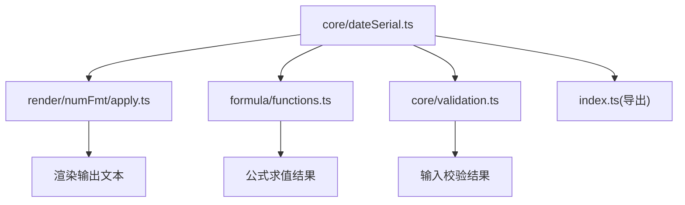
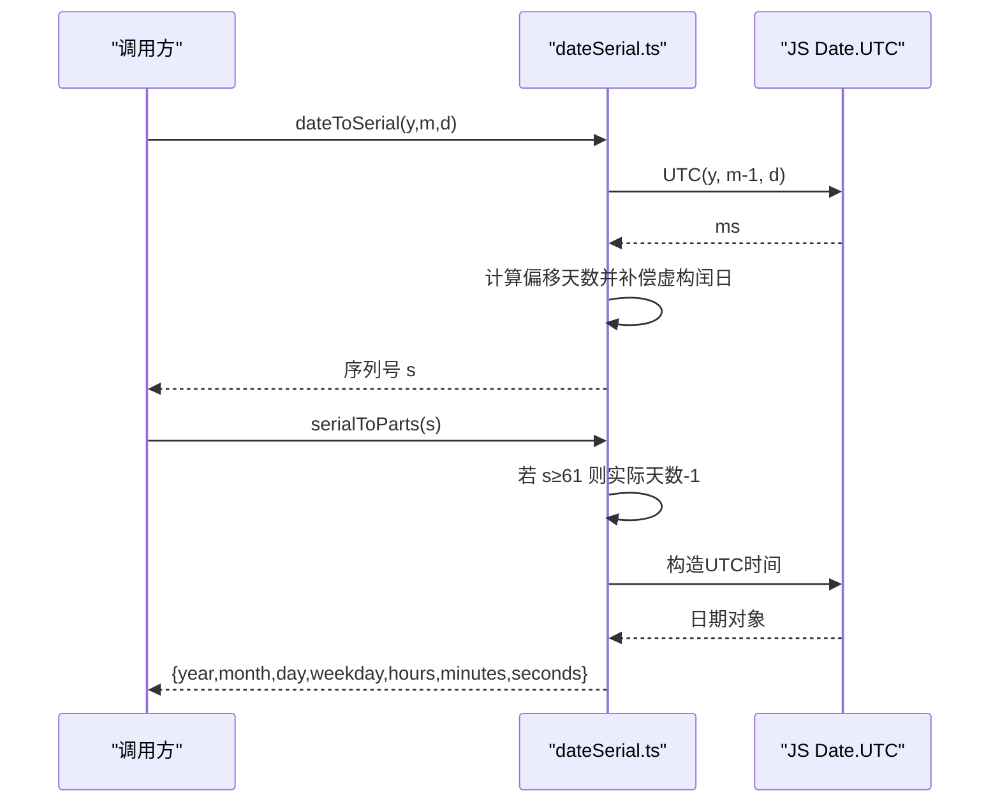
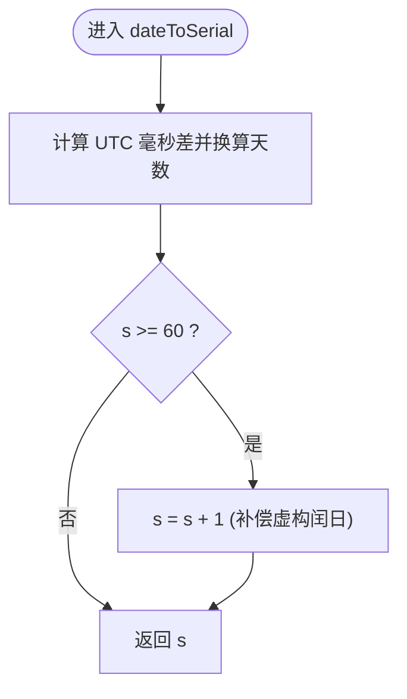
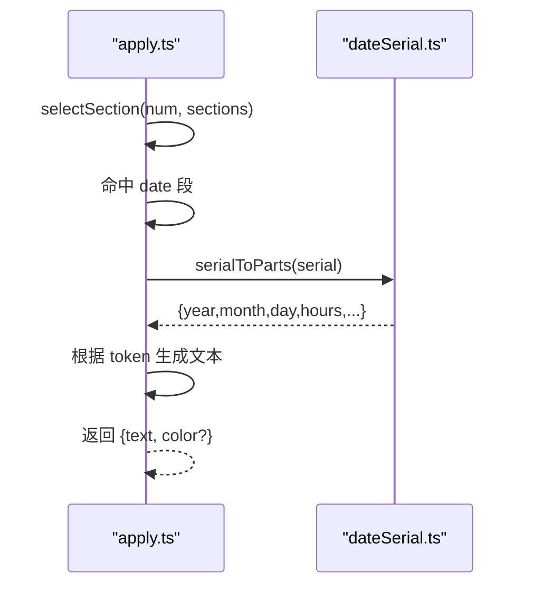
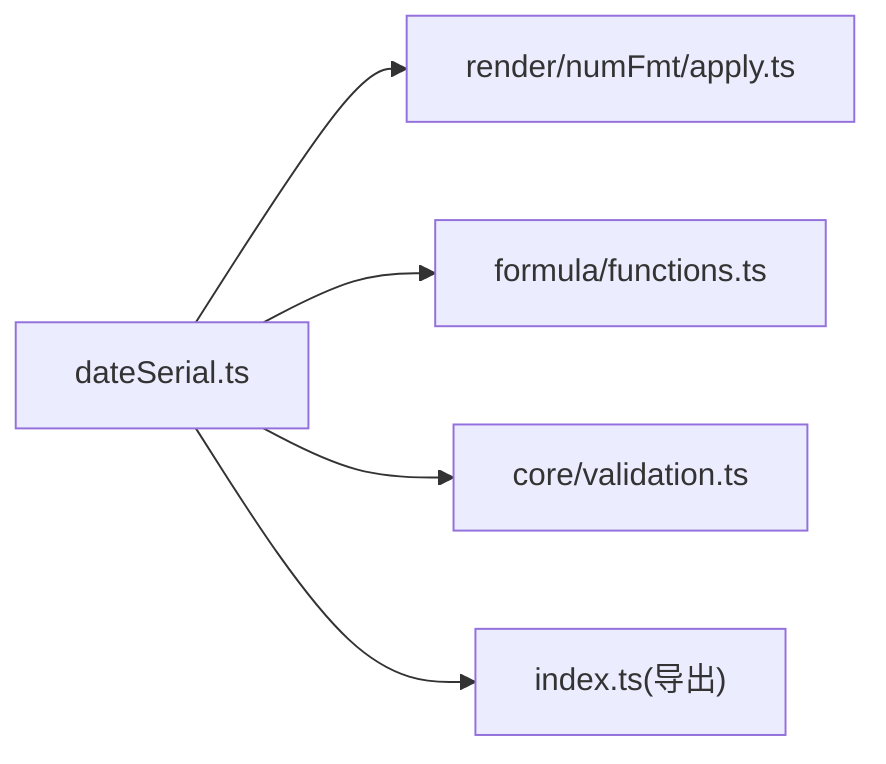

# 日期序列工具

<cite>
**本文引用的文件**
- [dateSerial.ts](file://cmx-mega-sheet/src/core/dateSerial.ts)
- [apply.ts](file://cmx-mega-sheet/src/render/numFmt/apply.ts)
- [functions.ts](file://cmx-mega-sheet/src/formula/functions.ts)
- [index.ts](file://cmx-mega-sheet/src/index.ts)
- [validation.ts](file://cmx-mega-sheet/src/core/validation.ts)
- [dateSerial.test.ts](file://cmx-mega-sheet/test/dateSerial.test.ts)
</cite>

## 目录
1. [简介](#简介)
2. [项目结构](#项目结构)
3. [核心组件](#核心组件)
4. [架构总览](#架构总览)
5. [详细组件分析](#详细组件分析)
6. [依赖关系分析](#依赖关系分析)
7. [性能考虑](#性能考虑)
8. [故障排查指南](#故障排查指南)
9. [结论](#结论)
10. [附录](#附录)

## 简介
本 API 参考文档聚焦于 Excel 日期序列号系统在前端工程中的实现与使用，覆盖以下主题：
- Excel 1900 日期系统的序列号计算、闰年“bug”补偿与跨世纪兼容性
- 日期序列号与 JavaScript Date 对象的转换方法
- 日期格式化、验证与计算的实用函数说明
- 边界情况处理与错误处理最佳实践
- 1904 日期系统的差异说明（当前实现仅支持 1900 系统）

该工具集位于 cmx-mega-sheet 的 core/dateSerial.ts，被渲染层、公式引擎和输入验证等模块复用。

## 项目结构
围绕日期序列的核心文件与调用关系如下：
- core/dateSerial.ts：提供序列号与日历分量互转、时间分数转换等基础能力
- render/numFmt/apply.ts：基于序列号进行日期格式渲染
- formula/functions.ts：在公式层消费序列号能力（如 DATE/YEAR/TODAY 等）
- core/validation.ts：对日期序列号进行范围校验
- index.ts：对外暴露 dateSerial 相关 API

图表来源
- [dateSerial.ts:1-77](file://cmx-mega-sheet/src/core/dateSerial.ts#L1-L77)
- [apply.ts:1-321](file://cmx-mega-sheet/src/render/numFmt/apply.ts#L1-L321)
- [functions.ts:20-27](file://cmx-mega-sheet/src/formula/functions.ts#L20-L27)
- [validation.ts:1-88](file://cmx-mega-sheet/src/core/validation.ts#L1-L88)
- [index.ts:190-196](file://cmx-mega-sheet/src/index.ts#L190-L196)

章节来源
- [dateSerial.ts:1-77](file://cmx-mega-sheet/src/core/dateSerial.ts#L1-L77)
- [index.ts:190-196](file://cmx-mega-sheet/src/index.ts#L190-L196)

## 核心组件
- 序列号与日期分量互转
  - serialToParts(serial): 将 Excel 序列号解析为年、月、日、星期、时、分、秒
  - dateToSerial(year, month, day): 将日历日期转换为序列号（整数天）
  - partsToSerial(year, month, day, hours?, minutes?, seconds?): 将完整日期时间转为序列号
- 时间分数转换
  - timeToFraction(hours, minutes, seconds): 将时分秒转为序列号的小数部分
  - serialToTime(serial): 从序列号提取时分秒（忽略日期部分）
- 数据模型
  - DateParts: 包含 year、month、day、weekday、hours、minutes、seconds

这些函数以纯数学 + Date.UTC 为基础，无 Node 依赖，适合浏览器环境。

章节来源
- [dateSerial.ts:17-77](file://cmx-mega-sheet/src/core/dateSerial.ts#L17-L77)

## 架构总览
Excel 1900 日期系统约定：
- 序列号 1 对应 1900-01-01
- 小数部分表示当天时刻（例如 0.5 = 12:00:00）
- 存在“1900 闰年 bug”：Excel 误认为 1900 是闰年，虚构了 1900-02-29（序列号 60）
- 为对齐 Excel：serial ≥ 61 的实际天数需减 1；反向转换时对 1900-03-01 起的日期加 1 补回虚构日

图表来源
- [dateSerial.ts:13-53](file://cmx-mega-sheet/src/core/dateSerial.ts#L13-L53)

## 详细组件分析

### 1) 序列号 ↔ 日期分量
- serialToParts(serial)
  - 行为：取整得到“天”，对 serial ≥ 61 的情况执行 -1 补偿，再按秒级四舍五入处理小数部分（跨日进位由 Date 完成），最后用 UTC 读取年月日与时分秒
  - 复杂度：O(1)
  - 边界：非有限数应在使用前拦截；负序列号会映射到 1900-01-01 之前（谨慎使用）
- dateToSerial(year, month, day)
  - 行为：基于 UTC 计算与锚点差的天数，若结果 ≥ 60 则 +1 以跳过虚构的 1900-02-29
  - 复杂度：O(1)
  - 边界：月份 1..12，日期需合法；超出范围会被 Date 归一化（注意语义）
- partsToSerial(year, month, day, hours?, minutes?, seconds?)
  - 行为：先算日期序列号，再加时间分数
  - 精度：秒级四舍五入（通过 serialToParts 内部实现）

图表来源
- [dateSerial.ts:47-53](file://cmx-mega-sheet/src/core/dateSerial.ts#L47-L53)

章节来源
- [dateSerial.ts:28-53](file://cmx-mega-sheet/src/core/dateSerial.ts#L28-L53)

### 2) 时间分数转换
- timeToFraction(hours, minutes, seconds)
  - 行为：将时分秒换算为一天的小数比例
  - 精度：秒级
- serialToTime(serial)
  - 行为：复用 serialToParts 提取时分秒（丢弃日期部分）

章节来源
- [dateSerial.ts:55-64](file://cmx-mega-sheet/src/core/dateSerial.ts#L55-L64)

### 3) 日期格式化（渲染层）
- applyFormat(value, compiled)
  - 当值为数字且匹配日期段时，调用 serialToParts 获取分量，并按 yyyy/mm/dd/hh:nn:ss/[h] 等 token 渲染
  - 支持 12 小时制 am/pm、[h]/[m]/[s] 累计时长显示
- 关键流程：选择区段 → 日期段渲染 → 拼接字面量/占位符

图表来源
- [apply.ts:30-65](file://cmx-mega-sheet/src/render/numFmt/apply.ts#L30-L65)
- [apply.ts:240-294](file://cmx-mega-sheet/src/render/numFmt/apply.ts#L240-L294)
- [dateSerial.ts:28-45](file://cmx-mega-sheet/src/core/dateSerial.ts#L28-L45)

章节来源
- [apply.ts:239-300](file://cmx-mega-sheet/src/render/numFmt/apply.ts#L239-L300)

### 4) 公式层使用
- functions.ts 导入并使用 dateSerial 的序列号转换函数，支撑 M8 日期函数（如 DATE/YEAR/TODAY 等）
- 通过 serialToParts/dateToSerial/partsToSerial/timeToFraction 统一处理日期与时间的序列化/反序列化

章节来源
- [functions.ts:20-27](file://cmx-mega-sheet/src/formula/functions.ts#L20-L27)

### 5) 数据验证（输入校验）
- validation.ts 的 validateValue 支持 type='date' 的校验规则
  - 期望输入已是“日期序列号”（数值）
  - 使用 operator 与上下界比较，失败返回错误消息
- 典型场景：限制用户只能输入某日期范围内的序列号

章节来源
- [validation.ts:24-65](file://cmx-mega-sheet/src/core/validation.ts#L24-L65)

### 6) 对外 API 导出
- index.ts 将 dateSerial 的函数与类型 DateParts 重新导出，供上层模块或外部使用者引用

章节来源
- [index.ts:190-196](file://cmx-mega-sheet/src/index.ts#L190-L196)

## 依赖关系分析
- dateSerial.ts 是核心依赖，被渲染、公式、验证等多处消费
- 渲染层依赖 serialToParts 进行日期文本生成
- 公式层依赖序列号转换以支持日期函数
- 验证层依赖序列号作为输入类型，配合范围比较

图表来源
- [dateSerial.ts:1-77](file://cmx-mega-sheet/src/core/dateSerial.ts#L1-L77)
- [apply.ts:13-14](file://cmx-mega-sheet/src/render/numFmt/apply.ts#L13-L14)
- [functions.ts:20-27](file://cmx-mega-sheet/src/formula/functions.ts#L20-L27)
- [validation.ts:1-88](file://cmx-mega-sheet/src/core/validation.ts#L1-L88)
- [index.ts:190-196](file://cmx-mega-sheet/src/index.ts#L190-L196)

## 性能考虑
- 所有核心函数均为 O(1) 时间复杂度，仅涉及基本算术与 Date.UTC
- 渲染层对日期 token 的遍历与字符串拼接为线性于 token 数量，通常很小
- 建议：
  - 批量格式化时复用编译后的格式对象（apply.ts 已内置 memo 机制）
  - 避免频繁创建 Date 对象，尽量在必要时才调用 serialToParts

## 故障排查指南
- 常见异常与处理
  - 非有限数：apply.ts 中对非有限数直接返回字符串形式；建议在调用 serialToParts 前确保输入为有限数
  - 非法日期：dateToSerial 依赖 Date 归一化行为，传入非法日期可能被自动修正，应在业务层做前置校验
  - 1900-02-29 虚构日：序列号 60 在系统中被归一到 1900-03-01；如需兼容 Excel 的原始行为，请在上层做特殊处理
- 调试建议
  - 使用测试用例对照已知锚点（如 1900-01-01=1、1900-03-01=61、2024-01-01=45292）
  - 检查 serialToParts 输出的 weekday 是否符合预期（周日=0）

章节来源
- [apply.ts:47-49](file://cmx-mega-sheet/src/render/numFmt/apply.ts#L47-L49)
- [dateSerial.ts:28-53](file://cmx-mega-sheet/src/core/dateSerial.ts#L28-L53)
- [dateSerial.test.ts:10-48](file://cmx-mega-sheet/test/dateSerial.test.ts#L10-L48)

## 结论
- 本工具实现了与 Excel 1900 日期系统一致的序列号计算，正确处理“1900 闰年 bug”与跨世纪兼容
- 提供了完整的序列号与日期分量互转、时间分数转换能力，并被渲染、公式、验证等模块广泛使用
- 当前实现未包含 1904 日期系统；如需支持，可在 dateSerial.ts 中增加系统切换与相应补偿逻辑
- 建议结合应用层的输入校验与边界检查，确保序列号的有效性与一致性

## 附录

### API 参考速查
- serialToParts(serial): number → DateParts
  - 用途：将 Excel 序列号解析为年、月、日、星期、时、分、秒
  - 注意：serial ≥ 61 时执行 -1 补偿；小数部分按秒四舍五入
- dateToSerial(year, month, day): number → number
  - 用途：将日历日期转换为序列号（整数天）
  - 注意：1900-03-01 起的结果 +1 以跳过虚构闰日
- partsToSerial(year, month, day, hours?, minutes?, seconds?): number → number
  - 用途：将完整日期时间转换为序列号（整数天 + 小数时刻）
- timeToFraction(hours, minutes, seconds): number → number
  - 用途：将时分秒转换为序列号的小数部分
- serialToTime(serial): number → {hours, minutes, seconds}
  - 用途：从序列号提取时分秒（忽略日期部分）

章节来源
- [dateSerial.ts:17-77](file://cmx-mega-sheet/src/core/dateSerial.ts#L17-L77)

### 与 JavaScript Date 对象的转换
- 序列号 → Date：通过 serialToParts 内部使用 Date.UTC 构造 UTC 时间，再以 getUTC* 读取分量
- Date → 序列号：通过 dateToSerial 基于 UTC 计算与锚点的天数差，并进行 1900 闰年补偿
- 注意事项：
  - 始终使用 UTC 以避免时区偏差
  - 对于需要本地化的展示，请在渲染层再做本地化转换

章节来源
- [dateSerial.ts:13-53](file://cmx-mega-sheet/src/core/dateSerial.ts#L13-L53)

### 1900/1904 日期系统差异说明
- 当前实现仅支持 Excel 1900 日期系统
- 1904 系统差异要点（概念性说明）：
  - 基准不同：1904 系统以 1904-01-01 为起点，序列号 0 对应 1904-01-01
  - 不存在 1900 闰年 bug 的补偿逻辑
  - 同一绝对时间点在不同系统中的序列号相差固定偏移
- 如需支持 1904 系统，建议在 dateSerial.ts 中引入系统开关，并在转换时应用相应偏移与规则

[本节为概念性说明，不直接分析具体代码文件]

### 边界情况与最佳实践
- 边界
  - serial 60（1900-02-29）：在系统中归一到 1900-03-01
  - 负序列号：映射到 1900-01-01 之前，需谨慎使用
  - 超大年份：受限于 Date 精度与 Excel 范围，建议在上层做范围校验
- 最佳实践
  - 输入侧：在编辑器提交前使用 validation.ts 的 date 类型校验
  - 渲染侧：优先使用 compile 后的格式对象，减少重复开销
  - 公式侧：统一通过序列号传递日期，避免字符串歧义

章节来源
- [validation.ts:49-53](file://cmx-mega-sheet/src/core/validation.ts#L49-L53)
- [apply.ts:72-75](file://cmx-mega-sheet/src/render/numFmt/apply.ts#L72-L75)