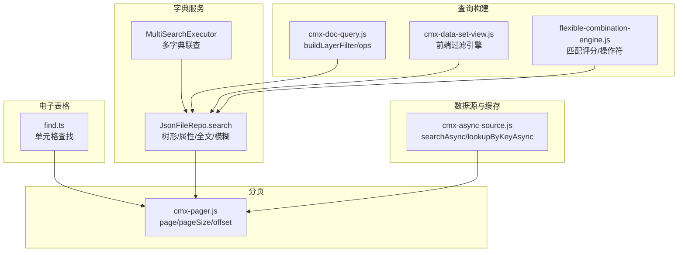
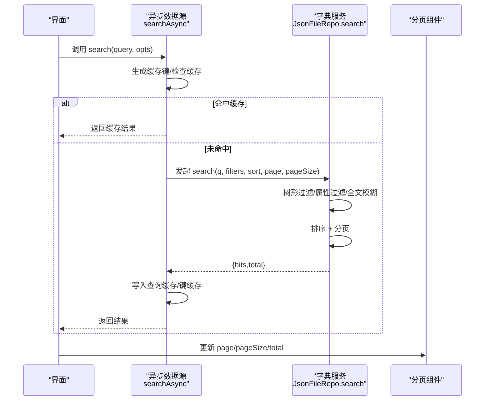
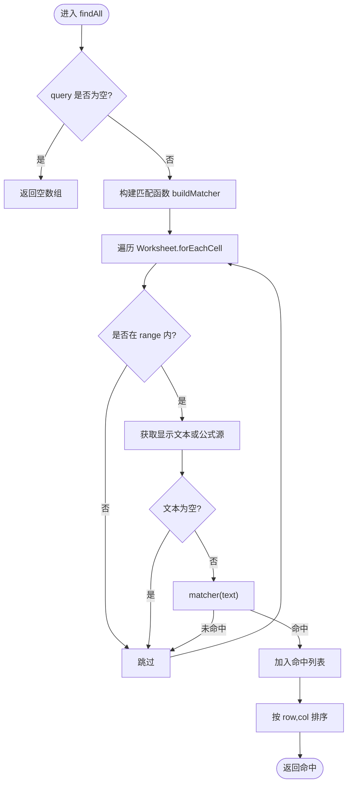
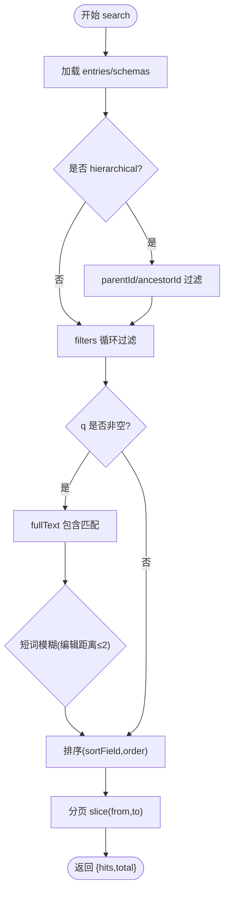
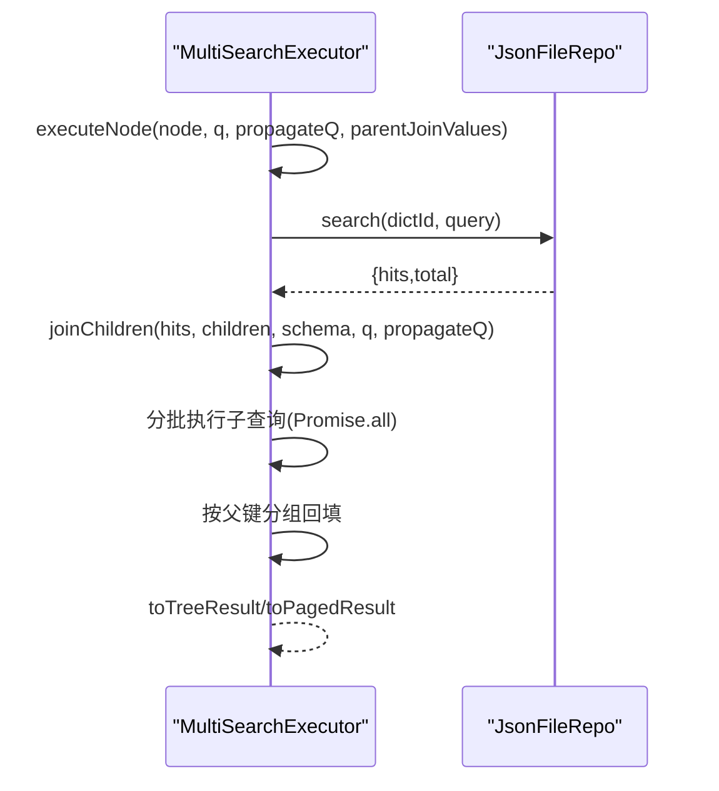
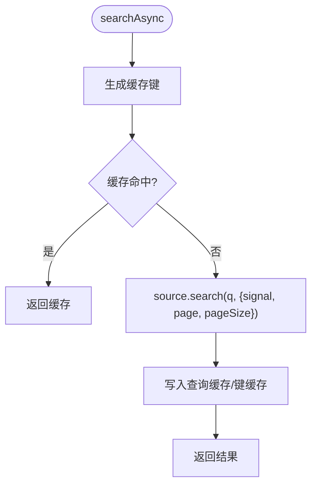
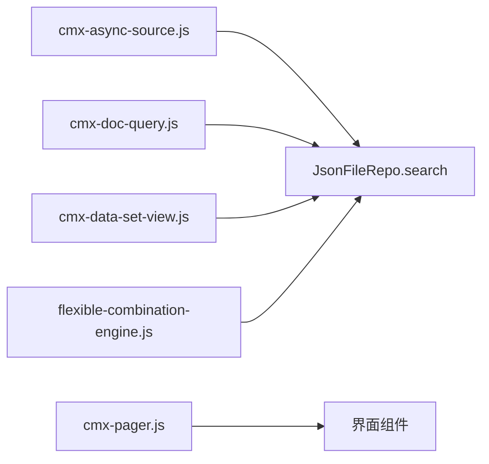

# 查找算法工具

<cite>
**本文引用的文件**
- [find.ts](file://cmx-mega-sheet/src/core/find.ts)
- [cmx-dict-service-implementation.md](file://CMXPortalManager/docs/cmx-dict-service-implementation.md)
- [cmx-async-source.js](file://packages/cmx-data-comp/src/lib/cmx-async-source.js)
- [cmx-pager.js](file://packages/cmx-data-comp/src/components/cmx-pager.js)
- [cmx-doc-query.js](file://packages/cmx-data-comp/src/lib/cmx-doc-query.js)
- [cmx-data-set-view.js](file://packages/cmx-data-comp/src/lib/cmx-data-set-view.js)
- [flexible-combination-engine.js](file://packages/cmx-data-comp/src/lib/flexible-combination-engine.js)
</cite>

## 目录
1. [简介](#简介)
2. [项目结构](#项目结构)
3. [核心组件](#核心组件)
4. [架构总览](#架构总览)
5. [详细组件分析](#详细组件分析)
6. [依赖关系分析](#依赖关系分析)
7. [性能考量](#性能考量)
8. [故障排查指南](#故障排查指南)
9. [结论](#结论)
10. [附录](#附录)

## 简介
本参考文档围绕仓库中的“查找算法工具”进行系统化梳理，覆盖精确查找、模糊查找、正则表达式查找与条件查找的实现原理；总结索引构建、缓存机制与搜索空间剪枝等性能优化策略；并文档化排序、过滤与分页处理流程。同时提供复杂场景（多条件组合查询、范围查找、模式匹配）的示例路径与调优实践建议，帮助读者在大数据集环境下高效实现稳定可靠的查找能力。

## 项目结构
本项目包含多个子模块，查找能力分布在以下位置：
- 电子表格数据层：基于 Worksheet 的单元格级查找（支持正则、整格匹配、区域限定）。
- 字典服务：内存查询引擎，支持树形过滤、属性条件过滤、全文/模糊检索、排序与分页。
- 异步数据源：统一封装远程搜索、去抖、请求取消、查询缓存与键值缓存。
- 分页组件：通用分页栏，提供页码、页大小、偏移量计算与事件派发。
- 文档查询构建器：将 UI 条件行组装为后端可执行的查询结构，含操作符与类型转换。
- 数据集视图过滤：前端轻量过滤引擎，支持多种比较与表达式求值。
- 灵活组合引擎：维度锚点匹配评分与操作符解析，用于规则匹配与推荐。

图表来源
- [find.ts:33-53](file://cmx-mega-sheet/src/core/find.ts#L33-L53)
- [cmx-dict-service-implementation.md:222-288](file://CMXPortalManager/docs/cmx-dict-service-implementation.md#L222-L288)
- [cmx-async-source.js:56-81](file://packages/cmx-data-comp/src/lib/cmx-async-source.js#L56-L81)
- [cmx-pager.js:210-218](file://packages/cmx-data-comp/src/components/cmx-pager.js#L210-L218)
- [cmx-doc-query.js:70-82](file://packages/cmx-data-comp/src/lib/cmx-doc-query.js#L70-L82)
- [cmx-data-set-view.js:51-78](file://packages/cmx-data-comp/src/lib/cmx-data-set-view.js#L51-L78)
- [flexible-combination-engine.js:271-323](file://packages/cmx-data-comp/src/lib/flexible-combination-engine.js#L271-L323)

章节来源
- [find.ts:33-53](file://cmx-mega-sheet/src/core/find.ts#L33-L53)
- [cmx-dict-service-implementation.md:222-288](file://CMXPortalManager/docs/cmx-dict-service-implementation.md#L222-L288)
- [cmx-async-source.js:56-81](file://packages/cmx-data-comp/src/lib/cmx-async-source.js#L56-L81)
- [cmx-pager.js:210-218](file://packages/cmx-data-comp/src/components/cmx-pager.js#L210-L218)
- [cmx-doc-query.js:70-82](file://packages/cmx-data-comp/src/lib/cmx-doc-query.js#L70-L82)
- [cmx-data-set-view.js:51-78](file://packages/cmx-data-comp/src/lib/cmx-data-set-view.js#L51-L78)
- [flexible-combination-engine.js:271-323](file://packages/cmx-data-comp/src/lib/flexible-combination-engine.js#L271-L323)

## 核心组件
- 单元格查找（精确/正则/区域限定）：在 Worksheet 上遍历非空单元格，按选项构造匹配函数，返回命中坐标与文本。
- 字典服务内存查询：加载条目后依次执行树形过滤、属性条件过滤、全文/模糊检索、排序与分页，返回 hits 与 total。
- 异步数据源封装：统一 searchAsync 与 lookupByKeyAsync，内置 LRU 查询缓存与键缓存、请求去抖与取消。
- 分页组件：维护 page/pageSize/total，计算 totalPages 与 offset，支持独立与协作两种模式。
- 查询构建器：将 UI 条件行转换为 filter JSON，支持数值/布尔类型转换与操作符白名单。
- 前端过滤引擎：提供 eq/ne/gt/ge/lt/le/in/nin/contains/between/empty/notempty/expr 等过滤器。
- 灵活组合引擎：对维度锚点进行匹配评分，支持 $eq/$ne/$in/$under/$exists 等操作符。

章节来源
- [find.ts:12-30](file://cmx-mega-sheet/src/core/find.ts#L12-L30)
- [cmx-dict-service-implementation.md:222-288](file://CMXPortalManager/docs/cmx-dict-service-implementation.md#L222-L288)
- [cmx-async-source.js:56-81](file://packages/cmx-data-comp/src/lib/cmx-async-source.js#L56-L81)
- [cmx-pager.js:210-218](file://packages/cmx-data-comp/src/components/cmx-pager.js#L210-L218)
- [cmx-doc-query.js:70-82](file://packages/cmx-data-comp/src/lib/cmx-doc-query.js#L70-L82)
- [cmx-data-set-view.js:51-78](file://packages/cmx-data-comp/src/lib/cmx-data-set-view.js#L51-L78)
- [flexible-combination-engine.js:271-323](file://packages/cmx-data-comp/src/lib/flexible-combination-engine.js#L271-L323)

## 架构总览
下图展示了从用户输入到结果返回的关键调用链：UI 触发搜索 → 异步数据源封装（缓存/去抖/取消）→ 字典服务内存查询（过滤/全文/模糊/排序/分页）→ 分页组件展示。

图表来源
- [cmx-async-source.js:56-81](file://packages/cmx-data-comp/src/lib/cmx-async-source.js#L56-L81)
- [cmx-dict-service-implementation.md:222-288](file://CMXPortalManager/docs/cmx-dict-service-implementation.md#L222-L288)
- [cmx-pager.js:210-218](file://packages/cmx-data-comp/src/components/cmx-pager.js#L210-L218)

## 详细组件分析

### 单元格查找（精确/正则/区域限定）
- 功能要点
  - 支持 matchCase、wholeCell、searchFormula、useRegex、range 等选项。
  - 通过 buildMatcher 构造匹配函数：正则模式优先，非法正则回退字面匹配；整格匹配时自动锚定首尾。
  - 遍历 Worksheet 的非空单元格，按区域裁剪，收集命中坐标与显示文本，并按行列排序。
- 复杂度与优化
  - 时间复杂度 O(N)，N 为遍历单元格数；使用 forEachCell 仅扫描非空格，减少无效匹配。
  - 正则预编译一次复用，避免重复开销。
  - 区域限定作为搜索空间剪枝，显著降低大表扫描成本。
- 错误处理
  - 正则构造失败时降级为字面匹配，保证健壮性。

图表来源
- [find.ts:33-53](file://cmx-mega-sheet/src/core/find.ts#L33-L53)
- [find.ts:55-80](file://cmx-mega-sheet/src/core/find.ts#L55-L80)

章节来源
- [find.ts:33-53](file://cmx-mega-sheet/src/core/find.ts#L33-L53)
- [find.ts:55-80](file://cmx-mega-sheet/src/core/find.ts#L55-L80)

### 字典服务内存查询（树形/属性/全文/模糊/排序/分页）
- 功能要点
  - 树形过滤：支持根节点、直接子节点、祖先链过滤。
  - 属性过滤：支持等值、IN、glob（* 转 .*），不区分大小写。
  - 全文/模糊：拼接 fullText 或全部字段小写化，先做包含匹配，再对短词做编辑距离 ≤ 2 的模糊匹配。
  - 排序：默认按 sortKey 升序，支持 desc。
  - 分页：计算 from=(page-1)*pageSize，切片返回 hits 与 total。
- 复杂度与优化
  - 全量读取 entries 后逐步 retain/filter，适合中小规模数据；可通过分批 join、限制 pageSize 控制内存。
  - glob 与模糊匹配仅在必要时执行，减少正则开销。
  - 编辑距离提前退出（阈值 > 2 即停止），提升性能。
- 错误处理
  - 文件不存在时返回空集合；并发写入通过 Promise 锁串行化。

图表来源
- [cmx-dict-service-implementation.md:222-288](file://CMXPortalManager/docs/cmx-dict-service-implementation.md#L222-L288)
- [cmx-dict-service-implementation.md:324-341](file://CMXPortalManager/docs/cmx-dict-service-implementation.md#L324-L341)

章节来源
- [cmx-dict-service-implementation.md:222-288](file://CMXPortalManager/docs/cmx-dict-service-implementation.md#L222-L288)
- [cmx-dict-service-implementation.md:324-341](file://CMXPortalManager/docs/cmx-dict-service-implementation.md#L324-L341)

### 多字典联查（批处理与合并）
- 功能要点
  - 支持父子字典 join，注入父节点值作为子查询条件。
  - 批量执行子查询（MAX_JOIN_BATCH），并发合并结果，按父键分组回填。
  - 支持 select 字段裁剪与 treeMode 树形结果转换。
- 复杂度与优化
  - 通过分批与并发控制，避免一次性 join 过大导致内存压力。
  - 子查询 pageSize 放大至 9999，确保子集完整后再合并。
- 错误处理
  - 无父节点值时跳过子查询，每行置空子字典结果。

图表来源
- [cmx-dict-service-implementation.md:556-688](file://CMXPortalManager/docs/cmx-dict-service-implementation.md#L556-L688)

章节来源
- [cmx-dict-service-implementation.md:556-688](file://CMXPortalManager/docs/cmx-dict-service-implementation.md#L556-L688)

### 异步数据源封装（缓存/去抖/取消）
- 功能要点
  - searchAsync：统一远程搜索入口，LRU 查询缓存，同 source 前次请求自动 abort，去抖 timer 共享。
  - lookupByKeyAsync：优先本地 items/keyCache，其次 loadByKeys，最后回退 search。
  - 稳定缓存键：忽略 signal 与函数参数，序列化剩余选项。
- 复杂度与优化
  - 查询缓存命中率直接影响响应时间；keyCache 加速单值查找。
  - AbortController 避免竞态与无用网络开销。
- 错误处理
  - AbortError 被捕获并返回空结果，避免上层异常。

图表来源
- [cmx-async-source.js:56-81](file://packages/cmx-data-comp/src/lib/cmx-async-source.js#L56-L81)
- [cmx-async-source.js:87-115](file://packages/cmx-data-comp/src/lib/cmx-async-source.js#L87-L115)

章节来源
- [cmx-async-source.js:56-81](file://packages/cmx-data-comp/src/lib/cmx-async-source.js#L56-L81)
- [cmx-async-source.js:87-115](file://packages/cmx-data-comp/src/lib/cmx-async-source.js#L87-L115)

### 分页组件（page/pageSize/offset）
- 功能要点
  - 独立模式：自管状态，派发 page-change 事件，外部拉数据后回填 total。
  - 协作模式：与协调器联动，状态同步。
  - 提供 getPagingInfo 返回 page、pageSize、total、totalPages、offset。
- 复杂度与优化
  - 纯前端计算，O(1)；通过合理 pageSize 控制渲染与网络负载。
- 错误处理
  - total 未知时 totalPages 为 null，按钮禁用逻辑保护。

章节来源
- [cmx-pager.js:210-218](file://packages/cmx-data-comp/src/components/cmx-pager.js#L210-L218)

### 查询构建器（操作符与类型转换）
- 功能要点
  - 定义操作符集合与适用数据类型（数值/日期/布尔/文本）。
  - coerceValue：根据 dataType 将字符串转为数字/布尔。
  - buildLayerFilter：将 UI 条件行组装为 filter JSON，列白名单校验与操作符校验。
- 复杂度与优化
  - 构建阶段 O(M)，M 为条件行数；类型转换避免后端类型不一致导致的误判。
- 错误处理
  - 不支持的操作符或列不在该层时抛出错误，便于快速定位配置问题。

章节来源
- [cmx-doc-query.js:25-82](file://packages/cmx-data-comp/src/lib/cmx-doc-query.js#L25-L82)

### 前端过滤引擎（比较与表达式）
- 功能要点
  - 支持 eq/ne/gt/ge/lt/le/in/nin/contains/startswith/endswith/between/empty/notempty/expr。
  - expr：以行字段为作用域，执行公式求值，实现动态条件。
- 复杂度与优化
  - 过滤器函数按需创建与复用；expr 评估需控制复杂度，避免重计算。
- 错误处理
  - 未知操作符返回恒真过滤器，避免阻断流程。

章节来源
- [cmx-data-set-view.js:51-78](file://packages/cmx-data-comp/src/lib/cmx-data-set-view.js#L51-L78)

### 灵活组合引擎（匹配评分与操作符）
- 功能要点
  - _scoreMatch/_scoreCondition/_scoreOperatorCondition：对维度锚点进行评分，支持 $eq/$ne/$in/$under/$exists。
  - 层级泛化：$under 结合 __path 祖先链，匹配子孙节点。
- 复杂度与优化
  - 评分累加，短路返回 -1 快速排除不匹配项。
- 错误处理
  - 不满足存在性或相等性条件时立即返回 -1，减少后续计算。

章节来源
- [flexible-combination-engine.js:271-323](file://packages/cmx-data-comp/src/lib/flexible-combination-engine.js#L271-L323)

## 依赖关系分析
- 组件耦合
  - 异步数据源与字典服务解耦：searchAsync 仅依赖 source.search 接口，便于替换后端实现。
  - 分页组件与数据源解耦：通过事件与属性传递状态，支持独立与协作模式。
  - 查询构建器与前端过滤引擎：前者负责构建后端可执行查询，后者负责前端轻量过滤，职责清晰。
- 外部依赖
  - 正则表达式、AbortController、LRU 缓存（第三方库）、Promise 锁。
- 潜在循环依赖
  - 当前模块间单向依赖，未见循环引用。

图表来源
- [cmx-async-source.js:56-81](file://packages/cmx-data-comp/src/lib/cmx-async-source.js#L56-L81)
- [cmx-dict-service-implementation.md:222-288](file://CMXPortalManager/docs/cmx-dict-service-implementation.md#L222-L288)
- [cmx-pager.js:210-218](file://packages/cmx-data-comp/src/components/cmx-pager.js#L210-L218)
- [cmx-doc-query.js:70-82](file://packages/cmx-data-comp/src/lib/cmx-doc-query.js#L70-L82)
- [cmx-data-set-view.js:51-78](file://packages/cmx-data-comp/src/lib/cmx-data-set-view.js#L51-L78)
- [flexible-combination-engine.js:271-323](file://packages/cmx-data-comp/src/lib/flexible-combination-engine.js#L271-L323)

章节来源
- [cmx-async-source.js:56-81](file://packages/cmx-data-comp/src/lib/cmx-async-source.js#L56-L81)
- [cmx-dict-service-implementation.md:222-288](file://CMXPortalManager/docs/cmx-dict-service-implementation.md#L222-L288)
- [cmx-pager.js:210-218](file://packages/cmx-data-comp/src/components/cmx-pager.js#L210-L218)
- [cmx-doc-query.js:70-82](file://packages/cmx-data-comp/src/lib/cmx-doc-query.js#L70-L82)
- [cmx-data-set-view.js:51-78](file://packages/cmx-data-comp/src/lib/cmx-data-set-view.js#L51-L78)
- [flexible-combination-engine.js:271-323](file://packages/cmx-data-comp/src/lib/flexible-combination-engine.js#L271-L323)

## 性能考量
- 索引构建
  - 字典服务当前为内存查询，建议在数据写入时维护倒排索引或全文索引（如 Elasticsearch/SQLite FTS），以提升全文/模糊检索性能。
  - 对高频过滤字段建立哈希索引（如 Set/Map），加速 IN/等值过滤。
- 缓存机制
  - 使用 LRU 查询缓存与键缓存，合理设置 cacheSize，避免内存膨胀。
  - 对只读或低频变更数据启用持久化缓存（如 IndexedDB/LocalStorage）。
- 搜索空间剪枝
  - 单元格查找使用 range 限定区域，减少遍历范围。
  - 字典服务先执行树形与属性过滤，再执行全文/模糊，降低后续计算量。
- 分页与排序
  - 合理设置 pageSize，避免单次传输过多数据。
  - 排序尽量在后端完成，前端仅做轻量排序或展示。
- 大数据集处理
  - 多字典联查采用分批并发（MAX_JOIN_BATCH），避免内存峰值。
  - 对长耗时操作引入进度反馈与取消机制（AbortController）。

[本节为通用指导，无需特定文件来源]

## 故障排查指南
- 正则表达式错误
  - 现象：正则构造失败导致查找异常。
  - 处理：系统已自动降级为字面匹配，但仍建议校验用户输入的正则合法性。
  - 参考路径：[find.ts:55-72](file://cmx-mega-sheet/src/core/find.ts#L55-L72)
- 缓存未命中或过期
  - 现象：重复搜索仍触发网络请求。
  - 处理：检查缓存键生成逻辑（stableOptsKey），确认信号与函数参数被正确忽略；调整 cacheSize。
  - 参考路径：[cmx-async-source.js:132-143](file://packages/cmx-data-comp/src/lib/cmx-async-source.js#L132-L143)
- 分页状态不同步
  - 现象：页码变化但数据未刷新。
  - 处理：确认 pager.getPagingInfo 返回值正确，外部监听 page-change 事件并回填 total。
  - 参考路径：[cmx-pager.js:210-218](file://packages/cmx-data-comp/src/components/cmx-pager.js#L210-L218)
- 查询构建错误
  - 现象：后端报列不存在或操作符不支持。
  - 处理：检查 buildLayerFilter 的列白名单与操作符集合，确保 UI 配置合法。
  - 参考路径：[cmx-doc-query.js:70-82](file://packages/cmx-data-comp/src/lib/cmx-doc-query.js#L70-L82)

章节来源
- [find.ts:55-72](file://cmx-mega-sheet/src/core/find.ts#L55-L72)
- [cmx-async-source.js:132-143](file://packages/cmx-data-comp/src/lib/cmx-async-source.js#L132-L143)
- [cmx-pager.js:210-218](file://packages/cmx-data-comp/src/components/cmx-pager.js#L210-L218)
- [cmx-doc-query.js:70-82](file://packages/cmx-data-comp/src/lib/cmx-doc-query.js#L70-L82)

## 结论
本仓库提供了完整的查找算法工具链，涵盖从单元格级精确/正则查找，到字典服务的树形/属性/全文/模糊检索，再到异步数据源的缓存/去抖/取消机制，以及分页、排序与条件构建。通过合理的索引构建、缓存策略与搜索空间剪枝，可在大数据集环境下获得良好的性能表现。建议在生产环境中结合后端索引与全文检索能力，进一步优化大规模数据的查找效率。

[本节为总结性内容，无需特定文件来源]

## 附录
- 复杂场景示例路径
  - 多条件组合查询：参见 [cmx-doc-query.js:70-82](file://packages/cmx-data-comp/src/lib/cmx-doc-query.js#L70-L82) 与 [cmx-data-set-view.js:51-78](file://packages/cmx-data-comp/src/lib/cmx-data-set-view.js#L51-L78)。
  - 范围查找：参见 [cmx-data-set-view.js:62-65](file://packages/cmx-data-comp/src/lib/cmx-data-set-view.js#L62-L65)。
  - 模式匹配：参见 [find.ts:55-72](file://cmx-mega-sheet/src/core/find.ts#L55-L72) 与 [cmx-dict-service-implementation.md:252-258](file://CMXPortalManager/docs/cmx-dict-service-implementation.md#L252-L258)。
- 性能调优实践
  - 调整 pageSize 与 cacheSize，监控缓存命中率与内存占用。
  - 对高频字段建立索引，减少全表扫描。
  - 使用分批并发与取消机制，提升交互体验。

[本节为补充信息，无需特定文件来源]