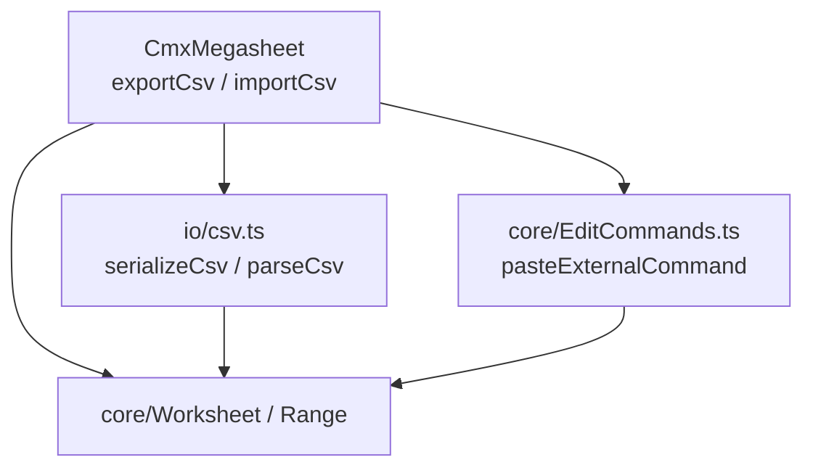
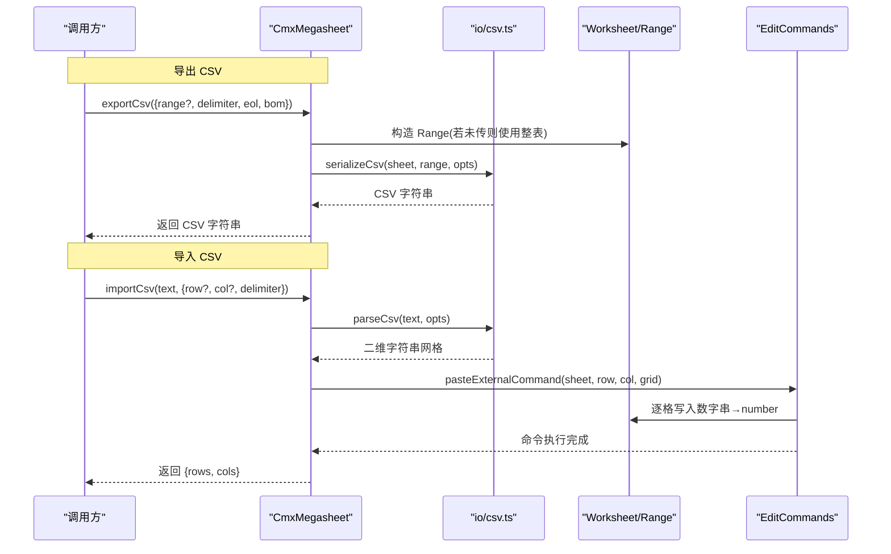
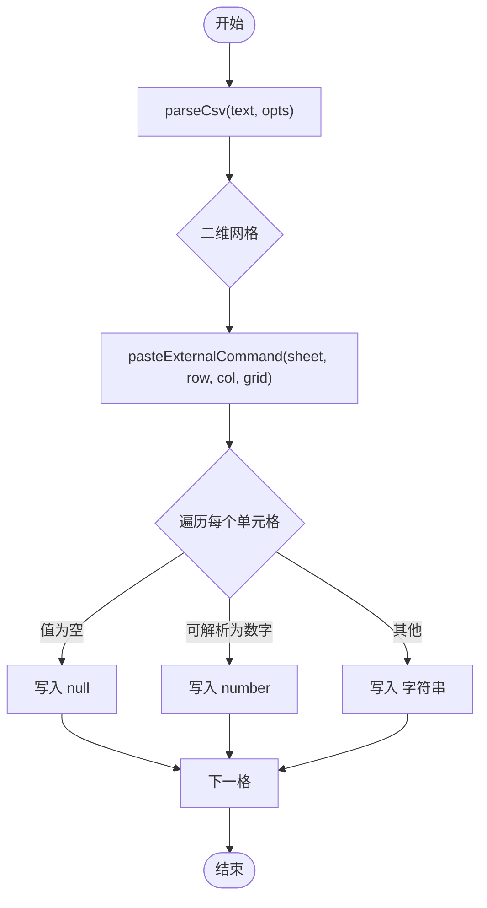

# CSV 导入导出

<cite>
**本文引用的文件**
- [csv.ts](file://cmx-mega-sheet/src/io/csv.ts)
- [snapshot.ts](file://cmx-mega-sheet/src/io/snapshot.ts)
- [cmx-megasheet.ts](file://cmx-mega-sheet/src/element/cmx-megasheet.ts)
- [EditCommands.ts](file://cmx-mega-sheet/src/core/EditCommands.ts)
- [Csv.test.ts](file://cmx-mega-sheet/test/Csv.test.ts)
</cite>

## 目录
1. [简介](#简介)
2. [项目结构](#项目结构)
3. [核心组件](#核心组件)
4. [架构总览](#架构总览)
5. [详细组件分析](#详细组件分析)
6. [依赖关系分析](#依赖关系分析)
7. [性能与内存管理](#性能与内存管理)
8. [故障排查指南](#故障排查指南)
9. [结论](#结论)
10. [附录：API 参考](#附录api-参考)

## 简介
本章节面向需要在电子表格中实现 CSV 格式导入导出的开发者，提供完整的 API 参考与实现说明。重点覆盖以下能力：
- 导出：将工作表选区序列化为 CSV 文本（支持分隔符、行结束符、UTF-8 BOM）。
- 导入：解析 CSV 文本为二维字符串网格，并粘贴到指定起始单元格，自动识别数字类型，支持撤销。
- 字符编码与国际化：默认 UTF-8；通过可选 BOM 提升 Excel 中文兼容性。
- 分隔符与引号转义：逗号、分号、制表符等可配置；RFC-4180 式引号包裹与双引号转义。
- 数据类型推断：导入时“纯数字串”自动转为数值，其余保持字符串或空值。
- 大文件与流式处理：当前实现为内存内逐行扫描与拼接，适合中小规模数据；超大文件建议上层分块处理。
- 错误恢复与回滚：导入基于可撤销命令，失败不影响已执行的其他操作；可通过撤销栈恢复。

## 项目结构
CSV 导入导出功能由三层协作完成：
- IO 层：csv.ts 负责 CSV 文本的序列化与解析。
- 元素门面层：cmx-megasheet.ts 暴露 exportCsv/importCsv 方法，封装 Range、Worksheet 与编辑命令。
- 编辑命令层：EditCommands.ts 提供 pasteExternalCommand，负责落格与数字类型推断，并纳入撤销栈。



图表来源
- [cmx-megasheet.ts:715-738](file://cmx-mega-sheet/src/element/cmx-megasheet.ts#L715-L738)
- [csv.ts:14-89](file://cmx-mega-sheet/src/io/csv.ts#L14-L89)
- [EditCommands.ts:215-241](file://cmx-mega-sheet/src/core/EditCommands.ts#L215-L241)

章节来源
- [cmx-megasheet.ts:715-738](file://cmx-mega-sheet/src/element/cmx-megasheet.ts#L715-L738)
- [csv.ts:14-89](file://cmx-mega-sheet/src/io/csv.ts#L14-L89)
- [EditCommands.ts:215-241](file://cmx-mega-sheet/src/core/EditCommands.ts#L215-L241)

## 核心组件
- CsvSerializeOptions：控制导出时的分隔符、行结束符、是否添加 UTF-8 BOM。
- CsvParseOptions：控制导入时的字段分隔符。
- serializeCsv：将 Worksheet 指定 Range 的值序列化为 CSV 文本。
- parseCsv：将 CSV 文本解析为二维字符串数组。
- CmxMegasheet.exportCsv / importCsv：对外暴露的便捷接口，内部组合上述能力。
- pasteExternalCommand：将二维字符串网格写入工作表，进行数字类型推断，并记录撤销信息。

章节来源
- [csv.ts:14-89](file://cmx-mega-sheet/src/io/csv.ts#L14-L89)
- [cmx-megasheet.ts:715-738](file://cmx-mega-sheet/src/element/cmx-megasheet.ts#L715-L738)
- [EditCommands.ts:215-241](file://cmx-mega-sheet/src/core/EditCommands.ts#L215-L241)

## 架构总览
下图展示了从用户调用到数据落格的完整流程，包括导出与导入两条路径。



图表来源
- [cmx-megasheet.ts:715-738](file://cmx-mega-sheet/src/element/cmx-megasheet.ts#L715-L738)
- [csv.ts:42-89](file://cmx-mega-sheet/src/io/csv.ts#L42-L89)
- [EditCommands.ts:215-241](file://cmx-mega-sheet/src/core/EditCommands.ts#L215-L241)

## 详细组件分析

### CSV 序列化（导出）
- 行为要点
  - 取显示值：公式单元格取计算后的显示值，对齐 Excel “另存为 CSV”语义。
  - 特殊字符处理：包含分隔符、双引号、换行符的字段会被双引号包裹；字段内的双引号以双写转义。
  - 布尔值：导出为 TRUE/FALSE。
  - 空值：null/undefined 导出为空字段。
  - 行结束符：默认 \n，可配置为 \r\n 以兼容 Windows/Excel。
  - BOM：可选在输出前添加 UTF-8 BOM，便于 Excel 打开中文不乱码。
- 复杂度
  - 时间 O(R×C)，空间 O(R×C) 用于构建行与列数组后拼接。
- 边界情况
  - 空选区：不产生额外行。
  - 末尾换行：不会导致多余空行。
  - 分隔符自定义：支持逗号、分号、制表符等任意单字符分隔符。

章节来源
- [csv.ts:28-55](file://cmx-mega-sheet/src/io/csv.ts#L28-L55)
- [Csv.test.ts:44-74](file://cmx-mega-sheet/test/Csv.test.ts#L44-L74)

### CSV 解析（导入）
- 行为要点
  - RFC-4180 风格：支持引号内含分隔符/换行、双引号转义。
  - 行结束符：\r\n 与 \n 均作为换行；\r 被忽略。
  - BOM：自动剥离前导 BOM。
  - 分隔符：默认逗号，可通过选项指定单字符分隔符。
  - 空输入：返回空二维数组。
- 复杂度
  - 时间 O(N)，N 为输入文本长度；空间 O(N) 用于存储结果。
- 边界情况
  - 末尾换行不产生空行。
  - 仅首字符为 BOM 时剥离，后续 BOM 保留。

章节来源
- [csv.ts:57-89](file://cmx-mega-sheet/src/io/csv.ts#L57-L89)
- [Csv.test.ts:14-42](file://cmx-mega-sheet/test/Csv.test.ts#L14-L42)

### 导入落格与类型推断
- 入口：CmxMegasheet.importCsv 调用 parseCsv 得到二维字符串网格，再通过 pasteExternalCommand 写入工作表。
- 类型推断规则
  - 非空且去除空白后可解析为数字的字符串 → number。
  - 空字符串 → null。
  - 其他 → 保持原字符串。
- 撤销支持
  - 所有写入通过 SnapshotCommand 包装，支持 undo/redo。
- 事件与重算
  - 导入完成后触发重算与绘制，并派发单元格编辑事件。



图表来源
- [cmx-megasheet.ts:728-738](file://cmx-mega-sheet/src/element/cmx-megasheet.ts#L728-L738)
- [EditCommands.ts:215-241](file://cmx-mega-sheet/src/core/EditCommands.ts#L215-L241)

章节来源
- [cmx-megasheet.ts:728-738](file://cmx-mega-sheet/src/element/cmx-megasheet.ts#L728-L738)
- [EditCommands.ts:215-241](file://cmx-mega-sheet/src/core/EditCommands.ts#L215-L241)

### 与快照格式的衔接
- 中性快照：工作簿/工作表可序列化为中性 JSON 快照（doc_format="cmx-megasheet"），用于持久化与迁移。
- 与 CSV 的关系：CSV 是文本交换格式；如需保留样式、公式、合并区域等元数据，应使用快照格式或 XLSX。
- 迁移策略：旧内核 SSJSON 与新快照格式可互相转换，CSV 仅承载值与基础格式。

章节来源
- [snapshot.ts:1-21](file://cmx-mega-sheet/src/io/snapshot.ts#L1-L21)
- [snapshot.ts:271-319](file://cmx-mega-sheet/src/io/snapshot.ts#L271-L319)

## 依赖关系分析
- CmxMegasheet 依赖 io/csv.ts 与 core/EditCommands.ts。
- io/csv.ts 依赖 Worksheet 与 Range 的类型定义，但不直接修改状态，属于纯逻辑模块。
- EditCommands.ts 依赖 Worksheet 的 setFormula/setValue/setStyle 等 API，并通过 SnapshotCommand 统一撤销。

```mermaid
classDiagram
class CmxMegasheet {
+exportCsv(opts) string
+importCsv(text, opts) {rows, cols}
}
class CsvIO {
+serializeCsv(sheet, range, opts) string
+parseCsv(text, opts) string[][]
}
class EditCommands {
+pasteExternalCommand(sheet, row, col, grid) UndoableAction
}
class Worksheet
class Range
CmxMegasheet --> CsvIO : "调用"
CmxMegasheet --> EditCommands : "调用"
CsvIO --> Worksheet : "读取值"
EditCommands --> Worksheet : "写入值"
CmxMegasheet --> Range : "构造范围"
```

图表来源
- [cmx-megasheet.ts:715-738](file://cmx-mega-sheet/src/element/cmx-megasheet.ts#L715-L738)
- [csv.ts:14-89](file://cmx-mega-sheet/src/io/csv.ts#L14-L89)
- [EditCommands.ts:215-241](file://cmx-mega-sheet/src/core/EditCommands.ts#L215-L241)

章节来源
- [cmx-megasheet.ts:715-738](file://cmx-mega-sheet/src/element/cmx-megasheet.ts#L715-L738)
- [csv.ts:14-89](file://cmx-mega-sheet/src/io/csv.ts#L14-L89)
- [EditCommands.ts:215-241](file://cmx-mega-sheet/src/core/EditCommands.ts#L215-L241)

## 性能与内存管理
- 序列化与解析均为线性时间复杂度，适合中等规模数据。
- 内存占用与数据量成正比：
  - 导出：按行列构建中间数组再拼接，峰值约为 R×C 个单元格的字符串。
  - 导入：解析过程维护行与字段缓冲，最终生成二维数组。
- 大文件建议
  - 分批导出：按页或按区域分段导出，避免一次性生成超大字符串。
  - 分批导入：对超大 CSV 文本进行分块解析（例如按行切分），逐批调用 pasteExternalCommand 写入，减少单次内存峰值。
  - 流式处理：当前 parseCsv 为内存解析，如需严格流式，可在上层实现行级迭代器，逐步消费并写入。
- 性能优化点
  - 合理设置 Range，仅导出/导入必要区域。
  - 使用合适的分隔符与行结束符，减少不必要的转义与拼接开销。
  - 批量导入时尽量合并多次写入，减少重算与绘制次数（可在业务层聚合后再调用一次 importCsv）。

[本节为通用指导，不直接引用具体代码]

## 故障排查指南
- 中文乱码
  - 现象：Excel 打开 CSV 中文乱码。
  - 解决：导出时启用 bom=true，添加 UTF-8 BOM。
- 分隔符不生效
  - 现象：导入未按预期分列。
  - 检查：确认传入的 delimiter 为单字符；确保 CSV 文本确实使用该分隔符。
- 数字被当作字符串
  - 现象：导入后数字仍为字符串。
  - 原因：该字符串不可解析为数字（如带千分位、货币符号、空格等）。
  - 解决：预处理清洗数据，或在上层进行类型转换。
- 换行符异常
  - 现象：行分割不符合预期。
  - 说明：解析器同时支持 \r\n 与 \n；\r 单独出现会被跳过。
- 撤销失效
  - 现象：导入后无法撤销。
  - 原因：未通过 CmxMegasheet.importCsv 入口，而是直接修改 Worksheet。
  - 解决：始终通过 importCsv 或 EditCommands 提供的命令进行操作。

章节来源
- [csv.ts:14-26](file://cmx-mega-sheet/src/io/csv.ts#L14-L26)
- [csv.ts:57-89](file://cmx-mega-sheet/src/io/csv.ts#L57-L89)
- [EditCommands.ts:215-241](file://cmx-mega-sheet/src/core/EditCommands.ts#L215-L241)

## 结论
本实现提供了符合 RFC-4180 风格的 CSV 导入导出能力，具备分隔符可配、引号转义、BOM 支持、数字类型推断与撤销机制。对于中小规模数据可直接使用；对于超大文件建议在业务层进行分块与流式处理以降低内存压力。如需保留更丰富的元数据（样式、公式、合并区域等），请结合快照格式或 XLSX 进行持久化与迁移。

[本节为总结性内容，不直接引用具体代码]

## 附录：API 参考

### CmxMegasheet.exportCsv
- 作用：导出活动工作表的 usedRange 或指定 Range 为 CSV 文本。
- 参数
  - range?: { row, col, rowCount, colCount }：导出区域，缺省为整表。
  - delimiter?: string：字段分隔符，默认逗号。
  - eol?: string：行结束符，默认 \n。
  - bom?: boolean：是否添加 UTF-8 BOM，默认 false。
- 返回值：string（CSV 文本）。
- 行为
  - 公式单元格取计算值。
  - 特殊字符按 RFC-4180 转义。
  - 布尔值导出为 TRUE/FALSE。

章节来源
- [cmx-megasheet.ts:715-722](file://cmx-mega-sheet/src/element/cmx-megasheet.ts#L715-L722)
- [csv.ts:14-55](file://cmx-mega-sheet/src/io/csv.ts#L14-L55)

### CmxMegasheet.importCsv
- 作用：导入 CSV 文本，解析后从目标单元格起铺格，自动识别数字类型，支持撤销。
- 参数
  - text: string：CSV 文本。
  - row?: number：起始行，缺省为活动单元格行。
  - col?: number：起始列，缺省为活动单元格列。
  - delimiter?: string：字段分隔符，默认逗号。
- 返回值：{ rows: number; cols: number }：落区的行数与列数。
- 行为
  - 解析遵循 RFC-4180 风格。
  - 数字串自动转为 number。
  - 通过 pasteExternalCommand 写入，可撤销。

章节来源
- [cmx-megasheet.ts:728-738](file://cmx-mega-sheet/src/element/cmx-megasheet.ts#L728-L738)
- [EditCommands.ts:215-241](file://cmx-mega-sheet/src/core/EditCommands.ts#L215-L241)

### io/csv.ts.serializeCsv
- 作用：将 Worksheet 指定 Range 的值序列化为 CSV 文本。
- 参数
  - sheet: Worksheet：工作表实例。
  - range: Range：导出区域。
  - opts: CsvSerializeOptions：delimiter/eol/bom。
- 返回值：string。
- 行为
  - 取显示值（公式→计算值）。
  - 含分隔符/引号/换行的字段包引号并转义双引号。
  - 可选 BOM。

章节来源
- [csv.ts:28-55](file://cmx-mega-sheet/src/io/csv.ts#L28-L55)

### io/csv.ts.parseCsv
- 作用：解析 CSV 文本为二维字符串数组。
- 参数
  - text: string：CSV 文本。
  - opts: CsvParseOptions：delimiter。
- 返回值：string[][]。
- 行为
  - 支持引号内分隔符/换行、双引号转义。
  - 自动剥离前导 BOM。
  - 支持 \r\n 与 \n 作为换行。
  - 空文本返回 []。

章节来源
- [csv.ts:57-89](file://cmx-mega-sheet/src/io/csv.ts#L57-L89)

### core/EditCommands.pasteExternalCommand
- 作用：将二维字符串网格写入工作表，进行数字类型推断，并记录撤销信息。
- 参数
  - sheet: Worksheet。
  - targetRow: number。
  - targetCol: number。
  - grid: string[][]。
- 返回值：UndoableAction（可撤销命令）。
- 行为
  - 非空且可解析为数字的字符串 → number。
  - 空字符串 → null。
  - 其他 → 字符串。

章节来源
- [EditCommands.ts:215-241](file://cmx-mega-sheet/src/core/EditCommands.ts#L215-L241)

### 常见变体与兼容性
- 分隔符
  - 逗号（默认）、分号、制表符均可通过 delimiter 配置。
- 行结束符
  - 默认 \n；Windows/Excel 常用 \r\n，可通过 eol 配置。
- BOM
  - 导出时可加 UTF-8 BOM，提升 Excel 中文兼容性。
- 引号与转义
  - 遵循 RFC-4180：字段含分隔符/引号/换行需包引号；字段内双引号以双写转义。
- 数据类型
  - 导入时“纯数字串”自动转为 number；其他保持字符串或空值。
- 国际化
  - 文本层面无本地化限制；日期/数字格式化不在 CSV 层处理，应在上游或下游进行。

章节来源
- [csv.ts:14-89](file://cmx-mega-sheet/src/io/csv.ts#L14-L89)
- [Csv.test.ts:14-82](file://cmx-mega-sheet/test/Csv.test.ts#L14-L82)