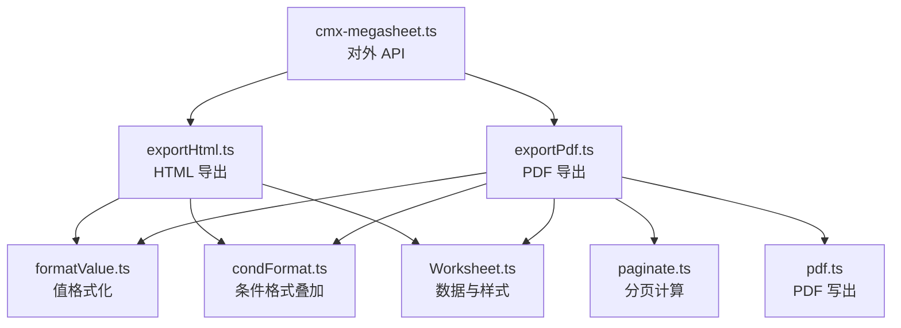
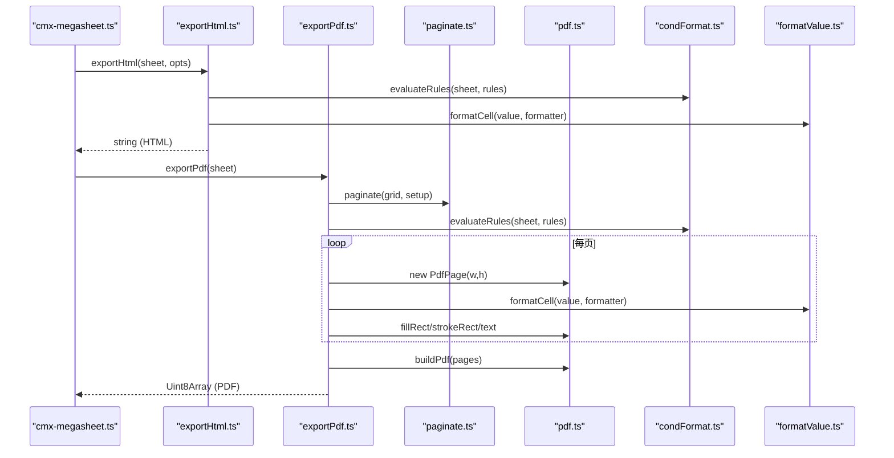
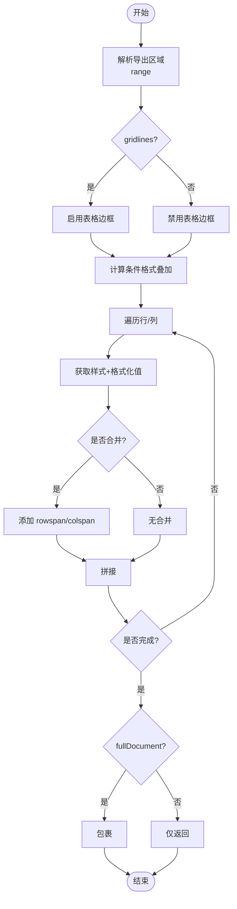
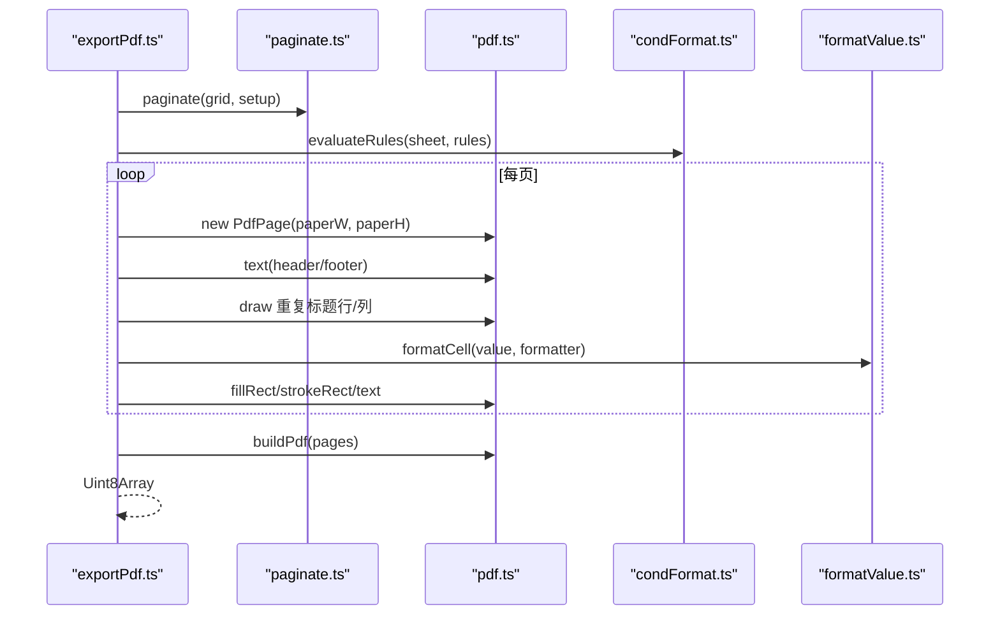
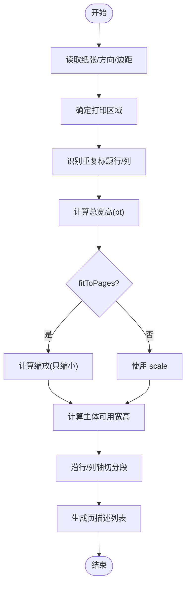
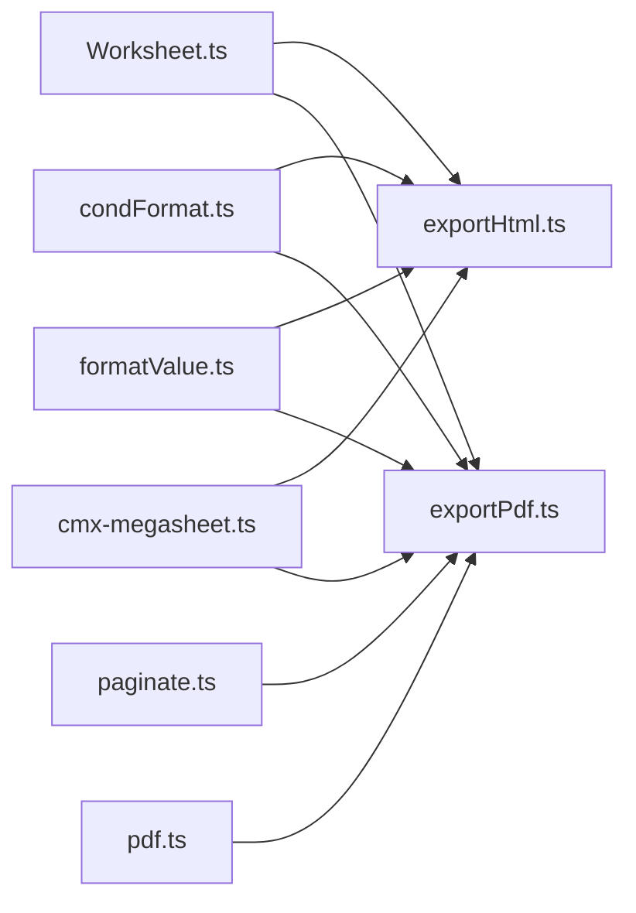

# HTML/PDF 导出

<cite>
**本文引用的文件**
- [exportHtml.ts](file://cmx-mega-sheet/src/io/exportHtml.ts)
- [exportPdf.ts](file://cmx-mega-sheet/src/io/exportPdf.ts)
- [pdf.ts](file://cmx-mega-sheet/src/io/pdf.ts)
- [paginate.ts](file://cmx-mega-sheet/src/io/paginate.ts)
- [Worksheet.ts](file://cmx-mega-sheet/src/core/Worksheet.ts)
- [formatValue.ts](file://cmx-mega-sheet/src/render/formatValue.ts)
- [condFormat.ts](file://cmx-mega-sheet/src/render/condFormat.ts)
- [cmx-megasheet.ts](file://cmx-mega-sheet/src/element/cmx-megasheet.ts)
- [demo_actions.js](file://cmx-mega-sheet/demo/demo_actions.js)
- [verify-m15.mjs](file://cmx-mega-sheet/demo/verify-m15.mjs)
- [exportM15.test.ts](file://cmx-mega-sheet/test/exportM15.test.ts)
</cite>

## 目录
1. [简介](#简介)
2. [项目结构](#项目结构)
3. [核心组件](#核心组件)
4. [架构总览](#架构总览)
5. [详细组件分析](#详细组件分析)
6. [依赖关系分析](#依赖关系分析)
7. [性能与内存优化](#性能与内存优化)
8. [故障排查指南](#故障排查指南)
9. [结论](#结论)
10. [附录：API 参考](#附录api-参考)

## 简介
本章节面向 cmx-mega-sheet 的 HTML 与 PDF 导出能力，提供完整的 API 文档与实现说明。重点覆盖：
- exportHtml 与 exportPdf 的接口定义、配置选项与输出格式
- HTML 导出的表格渲染、样式保留、分页处理与响应式适配
- PDF 导出的页面布局、边距设置、纸张方向与打印优化策略
- 图表、图片、超链接等富媒体内容的导出现状与限制
- 自定义模板、样式覆盖与主题定制方法
- 大文档分页处理、内存优化与进度回调机制
- 浏览器兼容性与第三方依赖要求

## 项目结构
导出功能位于 cmx-mega-sheet 模块中，核心文件分布如下：
- io/exportHtml.ts：HTML 导出主逻辑（生成自包含 HTML）
- io/exportPdf.ts：PDF 导出主逻辑（基于分页 + 手写 PDF 写出）
- io/paginate.ts：分页计算（纸张、边距、缩放、重复标题行/列）
- io/pdf.ts：零依赖手写 PDF 写出（多页、文本、矩形、描边）
- core/Worksheet.ts：工作表模型与 PageSetup 定义
- render/formatValue.ts：单元格值格式化（显示文本与颜色）
- render/condFormat.ts：条件格式叠加（背景色、数据条、图标集）
- element/cmx-megasheet.ts：对外暴露的 Web Component 接口（exportHtml/exportPdf/print/getPageCount）
- demo/* 与 test/*：演示与单元测试，验证导出行为

**图示来源**
- [cmx-megasheet.ts:1623-1647](file://cmx-mega-sheet/src/element/cmx-megasheet.ts#L1623-L1647)
- [exportHtml.ts:1-53](file://cmx-mega-sheet/src/io/exportHtml.ts#L1-L53)
- [exportPdf.ts:1-108](file://cmx-mega-sheet/src/io/exportPdf.ts#L1-L108)
- [paginate.ts:64-132](file://cmx-mega-sheet/src/io/paginate.ts#L64-L132)
- [pdf.ts:63-114](file://cmx-mega-sheet/src/io/pdf.ts#L63-L114)

**章节来源**
- [cmx-megasheet.ts:1623-1647](file://cmx-mega-sheet/src/element/cmx-megasheet.ts#L1623-L1647)
- [exportHtml.ts:1-53](file://cmx-mega-sheet/src/io/exportHtml.ts#L1-L53)
- [exportPdf.ts:1-108](file://cmx-mega-sheet/src/io/exportPdf.ts#L1-L108)
- [paginate.ts:64-132](file://cmx-mega-sheet/src/io/paginate.ts#L64-L132)
- [pdf.ts:63-114](file://cmx-mega-sheet/src/io/pdf.ts#L63-L114)

## 核心组件
- Worksheet：承载工作表数据、样式、合并、条件格式、页面设置等；导出时通过 getRowHeight/getColumnWidth/getRowCount/getColumnCount 等访问网格度量。
- ExportHtmlOptions：控制导出区域、是否完整文档、标题、是否绘制网格线。
- PageSetup：控制 PDF 导出的纸张、方向、边距、缩放/适合页数、打印区域、重复标题行/列、页眉页脚、是否显示网格线。
- PdfPage/buildPdf：构建单页内容流并组装多页 PDF 字节。
- paginate：根据 PageSetup 将网格切分为若干页段，返回每页的行/列区间、缩放系数、可打印尺寸、重复标题信息。

**章节来源**
- [Worksheet.ts:188-200](file://cmx-mega-sheet/src/core/Worksheet.ts#L188-L200)
- [exportHtml.ts:15-24](file://cmx-mega-sheet/src/io/exportHtml.ts#L15-L24)
- [paginate.ts:22-50](file://cmx-mega-sheet/src/io/paginate.ts#L22-L50)
- [pdf.ts:13-60](file://cmx-mega-sheet/src/io/pdf.ts#L13-L60)

## 架构总览
导出流程由两个路径组成：
- HTML 导出：读取工作表区域 → 应用条件格式叠加 → 逐格渲染为 <table>/<tr>/<td>，内联样式保留字体、对齐、背景、边框、字号等 → 可选输出完整 HTML 文档。
- PDF 导出：读取 PageSetup → 分页计算 → 逐页绘制：先画页眉/页脚，再画重复标题行/列与主体区域，逐格填充背景、绘制网格线、写入文本 → 使用 buildPdf 输出 Uint8Array。

**图示来源**
- [cmx-megasheet.ts:1623-1647](file://cmx-mega-sheet/src/element/cmx-megasheet.ts#L1623-L1647)
- [exportHtml.ts:27-53](file://cmx-mega-sheet/src/io/exportHtml.ts#L27-L53)
- [exportPdf.ts:19-108](file://cmx-mega-sheet/src/io/exportPdf.ts#L19-L108)
- [paginate.ts:64-132](file://cmx-mega-sheet/src/io/paginate.ts#L64-L132)
- [pdf.ts:63-114](file://cmx-mega-sheet/src/io/pdf.ts#L63-L114)

## 详细组件分析

### HTML 导出（exportHtml）
- 接口定义
  - 输入：Worksheet 实例 + ExportHtmlOptions
  - 输出：字符串（HTML 片段或完整文档）
- 配置选项
  - range：导出区域（缺省为全表）
  - fullDocument：是否输出完整 HTML 文档（默认 true）
  - title：文档标题（缺省使用 sheet.name()）
  - gridlines：是否绘制网格线（默认开启）
- 渲染要点
  - 表格结构：<colgroup> 声明列宽，<tbody> 逐行 <tr>，单元格 <td>
  - 样式保留：字体粗细、斜体、下划线、水平/垂直对齐、背景色、前景色、字号、边框（四边）
  - 合并单元格：rowspan/colspan
  - 条件格式：叠加背景色/字色（evaluateRules）
  - 值格式化：复用 formatCell，确保数值/日期等显示一致
- 响应式适配
  - 当前实现以固定 px 列宽与内联样式为主，未内置响应式断点；可通过外层容器 CSS 控制 table 宽度与滚动
- 示例用法
  - 在 demo_actions.js 中调用 el.exportHtml({ fullDocument: true }) 并下载

**图示来源**
- [exportHtml.ts:27-53](file://cmx-mega-sheet/src/io/exportHtml.ts#L27-L53)
- [exportHtml.ts:55-91](file://cmx-mega-sheet/src/io/exportHtml.ts#L55-L91)

**章节来源**
- [exportHtml.ts:15-53](file://cmx-mega-sheet/src/io/exportHtml.ts#L15-L53)
- [exportHtml.ts:55-91](file://cmx-mega-sheet/src/io/exportHtml.ts#L55-L91)
- [formatValue.ts:15-23](file://cmx-mega-sheet/src/render/formatValue.ts#L15-L23)
- [condFormat.ts:33-45](file://cmx-mega-sheet/src/render/condFormat.ts#L33-L45)
- [demo_actions.js:277-283](file://cmx-mega-sheet/demo/demo_actions.js#L277-L283)

### PDF 导出（exportPdf）
- 接口定义
  - 输入：Worksheet 实例
  - 输出：Uint8Array（PDF 字节）
- 页面布局与边距
  - 支持 orientation（portrait/landscape）、paperSize（A4/A3/Letter/Legal）、margins（pt）
  - 可打印区 = 纸张尺寸 - 边距
- 缩放与适合页数
  - scale：百分比缩放
  - fitToPages：按目标页数自动计算缩放（只缩小不放大）
- 重复标题行/列
  - printTitles.rowStart/end、printTitles.colStart/end：每页顶部/左侧重复显示
- 页眉/页脚
  - header/footer 支持宏展开：&P 页码、&N 总页、&D 日期（当前实现 &D 为空）
- 渲染策略
  - 逐页绘制：先页眉/页脚，再重复标题行/列与主体区域
  - 逐格绘制：背景（含条件格式底色）、网格线、文本（左/中/右对齐，粗体）
  - 坐标系：内部左上原点 y 向下，输出时翻转至 PDF 标准坐标
- 图表/图片/超链接
  - 当前版本未栅格化嵌入图表/图片；超链接未在 HTML/PDF 导出中体现
- 示例用法
  - 在 demo_actions.js 中调用 el.exportPdf() 并下载

**图示来源**
- [exportPdf.ts:19-108](file://cmx-mega-sheet/src/io/exportPdf.ts#L19-L108)
- [paginate.ts:64-132](file://cmx-mega-sheet/src/io/paginate.ts#L64-L132)
- [pdf.ts:63-114](file://cmx-mega-sheet/src/io/pdf.ts#L63-L114)

**章节来源**
- [exportPdf.ts:19-108](file://cmx-mega-sheet/src/io/exportPdf.ts#L19-L108)
- [paginate.ts:64-132](file://cmx-mega-sheet/src/io/paginate.ts#L64-L132)
- [pdf.ts:13-60](file://cmx-mega-sheet/src/io/pdf.ts#L13-L60)
- [demo_actions.js:277-283](file://cmx-mega-sheet/demo/demo_actions.js#L277-L283)

### 分页计算（paginate）
- 输入：GridMetrics（行列高宽、行列数）+ PageSetup
- 输出：PaginateResult（pages、scale、可打印尺寸、纸张尺寸、重复标题、横向/纵向页数）
- 关键算法
  - 计算总宽高（pt），根据 fitToPages 或 scale 确定缩放
  - 扣除重复标题占位后，沿行/列轴贪心切分，保证每页不超过可打印尺寸
  - 空表兜底至少一页
- 测试覆盖
  - 小表单一页、大表多页、横向纸更宽、fitToPages 缩至单页、printTitles 重复标题行/列

**图示来源**
- [paginate.ts:64-132](file://cmx-mega-sheet/src/io/paginate.ts#L64-L132)
- [paginate.ts:139-168](file://cmx-mega-sheet/src/io/paginate.ts#L139-L168)

**章节来源**
- [paginate.ts:22-50](file://cmx-mega-sheet/src/io/paginate.ts#L22-L50)
- [paginate.ts:64-132](file://cmx-mega-sheet/src/io/paginate.ts#L64-L132)
- [exportM15.test.ts:22-60](file://cmx-mega-sheet/test/exportM15.test.ts#L22-L60)

### 手写 PDF 写出（pdf.ts）
- PdfPage：提供 fillRect、line、strokeRect、text、clip 等操作符构建
- buildPdf：组装 Catalog、Pages、Font、Page、Content 对象，生成 xref 与 trailer，输出 Uint8Array
- 字体：Helvetica/Helvetica-Bold（内置 Type1），CJK 字符暂用占位（非 ASCII 转义）
- 颜色：支持 #hex 与 rgb()/rgba() 解析

**章节来源**
- [pdf.ts:13-60](file://cmx-mega-sheet/src/io/pdf.ts#L13-L60)
- [pdf.ts:63-114](file://cmx-mega-sheet/src/io/pdf.ts#L63-L114)
- [pdf.ts:127-165](file://cmx-mega-sheet/src/io/pdf.ts#L127-L165)

### 条件格式与值格式化
- condFormat.evaluateRules：对规则区域计算叠加结果（style/fill/bar/icon），供 HTML/PDF 渲染时应用
- formatValue.formatCell：统一值格式化引擎，返回显示文本与颜色（用于负数标红等）

**章节来源**
- [condFormat.ts:33-45](file://cmx-mega-sheet/src/render/condFormat.ts#L33-L45)
- [condFormat.ts:137-182](file://cmx-mega-sheet/src/render/condFormat.ts#L137-L182)
- [formatValue.ts:15-23](file://cmx-mega-sheet/src/render/formatValue.ts#L15-L23)

## 依赖关系分析
- 导出层依赖
  - exportHtml.ts 依赖 formatValue.ts、condFormat.ts、Worksheet 接口
  - exportPdf.ts 依赖 paginate.ts、pdf.ts、formatValue.ts、condFormat.ts、Worksheet 接口
- 分页层依赖
  - paginate.ts 依赖 Worksheet.PageSetup 与 GridMetrics 回调
- 写出层依赖
  - pdf.ts 纯逻辑，无外部依赖，输出 Uint8Array
- 对外暴露
  - cmx-megasheet.ts 提供 exportHtml/exportPdf/print/getPageCount 等方法，便于 UI 集成

**图示来源**
- [exportHtml.ts:11-13](file://cmx-mega-sheet/src/io/exportHtml.ts#L11-L13)
- [exportPdf.ts:10-14](file://cmx-mega-sheet/src/io/exportPdf.ts#L10-L14)
- [cmx-megasheet.ts:1623-1647](file://cmx-mega-sheet/src/element/cmx-megasheet.ts#L1623-L1647)

**章节来源**
- [exportHtml.ts:11-13](file://cmx-mega-sheet/src/io/exportHtml.ts#L11-L13)
- [exportPdf.ts:10-14](file://cmx-mega-sheet/src/io/exportPdf.ts#L10-L14)
- [cmx-megasheet.ts:1623-1647](file://cmx-mega-sheet/src/element/cmx-megasheet.ts#L1623-L1647)

## 性能与内存优化
- 纯逻辑、零 DOM：exportHtml/exportPdf/paginate/pdf 均为纯函数，可在 Node 环境运行与单测
- 分页裁剪：通过 printArea 与 fitToPages 控制导出范围与缩放，避免不必要的大图导出
- 条件格式预计算：evaluateRules 一次性计算叠加结果，减少重复计算
- 内存占用：PDF 写出采用流式拼接 chunks 并合并为 Uint8Array，避免中间大对象
- 进度回调：当前实现未提供异步进度回调；如需长文档导出，可在上层封装分批导出与回调

[本节为通用指导，无需特定文件引用]

## 故障排查指南
- HTML 导出问题
  - 样式丢失：检查是否启用了 gridlines，确认样式字段（bold/italic/underline/hAlign/vAlign/backColor/foreColor/fontSize/borders）是否正确设置
  - 合并异常：确认 addSpan 的左上角单元格被正确跳过渲染
  - 条件格式未生效：确认已调用 evaluateRules 且规则区域匹配
- PDF 导出问题
  - 中文乱码：当前 Helvetica 无 CJK 字形，非 ASCII 字符会转义为占位；需后续扩展内嵌字体
  - 分页错位：检查 printArea、printTitles、margins、orientation、fitToPages 配置
  - 页眉页脚宏：&P/&N 有效，&D 当前为空
- 兼容性
  - 浏览器：依赖现代 JS（TextEncoder/TextDecoder、Uint8Array），Chrome/Edge/Firefox/Safari 现代版本均可
  - Node：纯逻辑可运行于 Node 环境进行单测与批量导出
- 第三方依赖
  - 导出模块零依赖；演示与测试可能使用 Playwright/Chromium 进行真机校验

**章节来源**
- [pdf.ts:127-145](file://cmx-mega-sheet/src/io/pdf.ts#L127-L145)
- [exportPdf.ts:33-38](file://cmx-mega-sheet/src/io/exportPdf.ts#L33-L38)
- [exportM15.test.ts:101-139](file://cmx-mega-sheet/test/exportM15.test.ts#L101-L139)
- [verify-m15.mjs:69-92](file://cmx-mega-sheet/demo/verify-m15.mjs#L69-L92)

## 结论
- HTML 导出提供自包含表格与内联样式，支持条件格式与合并单元格，适合存档与嵌入
- PDF 导出支持多页、边距、方向、缩放与重复标题，适合打印与归档
- 当前版本未嵌入图表/图片/超链接；后续可扩展栅格化与字体内嵌
- 导出过程纯逻辑、零 DOM，具备良好可测试性与跨环境能力
- 建议在大文档场景结合 printArea/fitToPages 控制范围，并在上层实现分批导出与进度回调

[本节为总结性内容，无需特定文件引用]

## 附录：API 参考

### exportHtml
- 入口：cmx-megasheet.ts 暴露 exportHtml(opts)
- 参数：ExportHtmlOptions
  - range：{ row, col, rowCount, colCount }
  - fullDocument：boolean（默认 true）
  - title：string（默认 sheet.name()）
  - gridlines：boolean（默认 true）
- 返回：string（HTML 片段或完整文档）
- 行为：生成 <table> + 内联样式，叠加条件格式，支持合并单元格

**章节来源**
- [cmx-megasheet.ts:1623-1626](file://cmx-mega-sheet/src/element/cmx-megasheet.ts#L1623-L1626)
- [exportHtml.ts:15-53](file://cmx-mega-sheet/src/io/exportHtml.ts#L15-L53)

### exportPdf
- 入口：cmx-megasheet.ts 暴露 exportPdf()
- 参数：无（基于 Worksheet 的 PageSetup）
- 返回：Uint8Array（PDF 字节）
- 行为：分页计算 → 逐页绘制 → 构建 PDF 字节

**章节来源**
- [cmx-megasheet.ts:1628-1631](file://cmx-mega-sheet/src/element/cmx-megasheet.ts#L1628-L1631)
- [exportPdf.ts:19-108](file://cmx-mega-sheet/src/io/exportPdf.ts#L19-L108)

### PageSetup（PDF 相关）
- orientation：'portrait' | 'landscape'
- paperSize：'A4' | 'A3' | 'Letter' | 'Legal'
- margins：{ top, right, bottom, left }（pt）
- scale：百分比（与 fitToPages 互斥）
- fitToPages：{ width, height }（自动缩放）
- printArea：{ row, col, rowCount, colCount }
- printTitles：{ rowStart, rowEnd, colStart, colEnd }
- header/footer：字符串（支持 &P/&N/&D）
- showGridlines：boolean（默认 true）

**章节来源**
- [Worksheet.ts:188-200](file://cmx-mega-sheet/src/core/Worksheet.ts#L188-L200)
- [paginate.ts:64-132](file://cmx-mega-sheet/src/io/paginate.ts#L64-L132)

### 分页预览
- getPageCount()：返回 { pagesWide, pagesTall, total }
- computePages(sheet)：返回 PaginateResult（供上层预览）

**章节来源**
- [cmx-megasheet.ts:1633-1638](file://cmx-mega-sheet/src/element/cmx-megasheet.ts#L1633-L1638)
- [exportPdf.ts:123-130](file://cmx-mega-sheet/src/io/exportPdf.ts#L123-L130)

### 浏览器兼容性与依赖
- 浏览器：现代浏览器（支持 TextEncoder/TextDecoder、Uint8Array）
- Node：纯逻辑可运行，便于单测与批量导出
- 第三方：导出模块零依赖；演示/测试可能使用 Playwright/Chromium

**章节来源**
- [pdf.ts:87-113](file://cmx-mega-sheet/src/io/pdf.ts#L87-L113)
- [verify-m15.mjs:69-92](file://cmx-mega-sheet/demo/verify-m15.mjs#L69-L92)