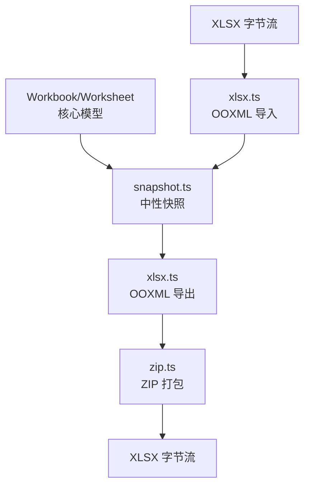
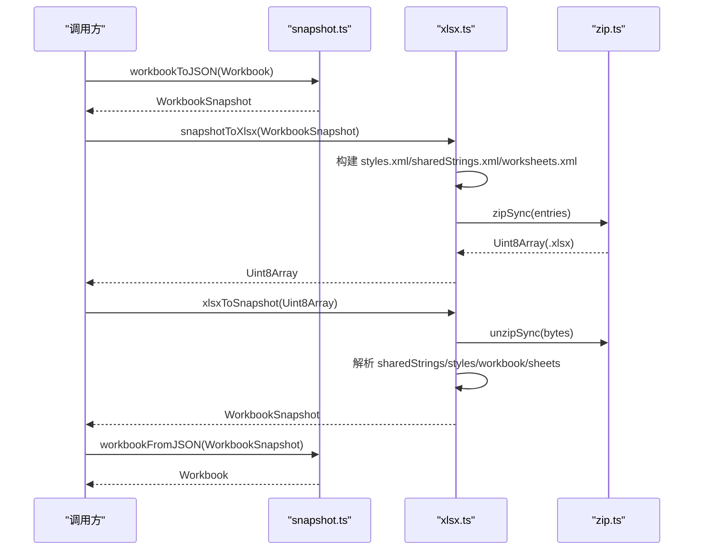
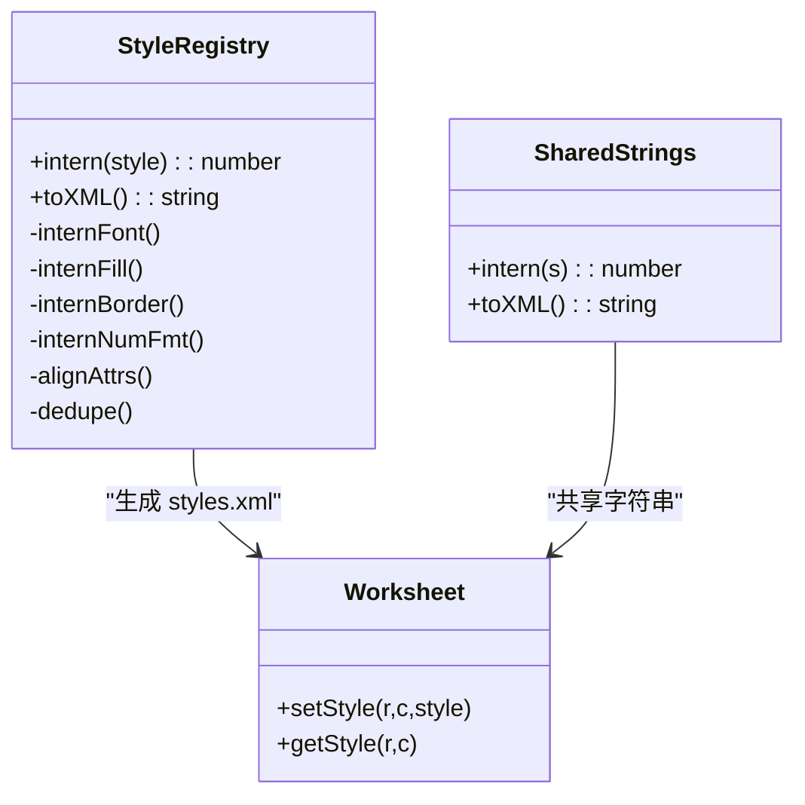
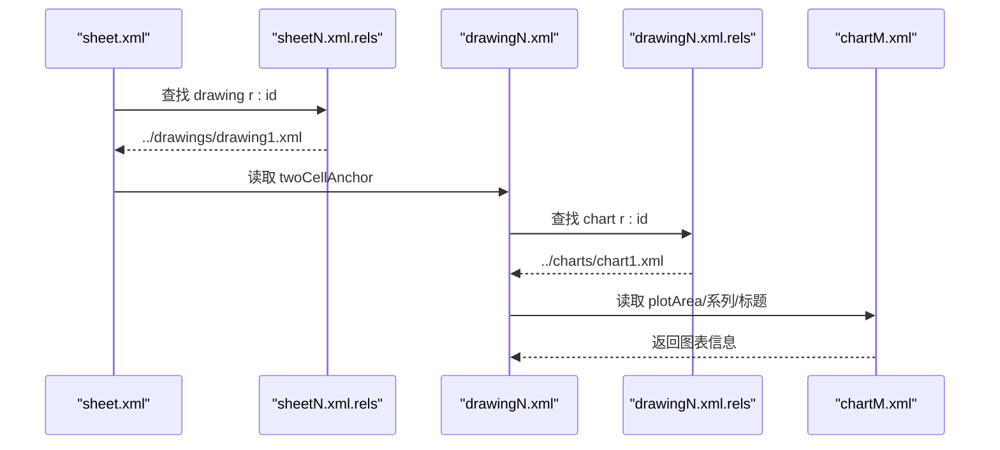
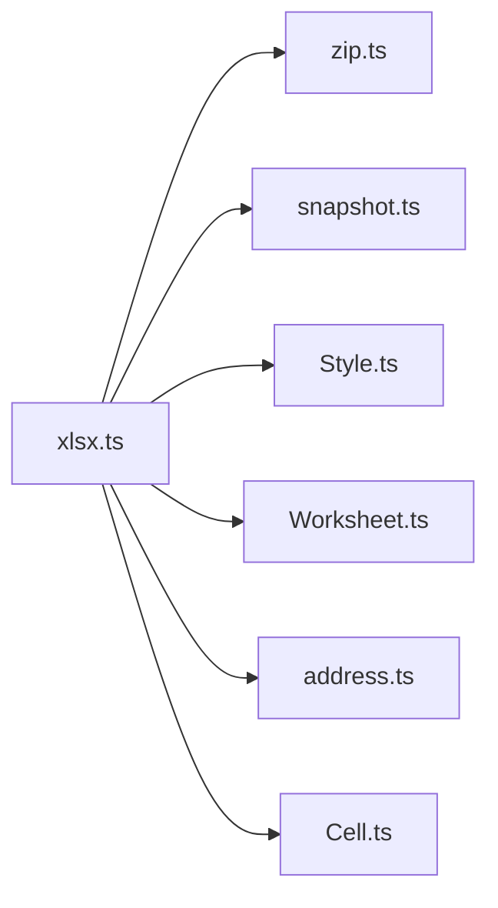

# XLSX 导入导出

<cite>
**本文引用的文件**
- [xlsx.ts](file://cmx-mega-sheet/src/io/xlsx.ts)
- [snapshot.ts](file://cmx-mega-sheet/src/io/snapshot.ts)
- [Style.ts](file://cmx-mega-sheet/src/core/Style.ts)
- [Worksheet.ts](file://cmx-mega-sheet/src/core/Worksheet.ts)
- [zip.ts](file://cmx-mega-sheet/src/io/zip.ts)
- [xlsx.test.ts](file://cmx-mega-sheet/test/xlsx.test.ts)
</cite>

## 目录
1. [简介](#简介)
2. [项目结构](#项目结构)
3. [核心组件](#核心组件)
4. [架构总览](#架构总览)
5. [详细组件分析](#详细组件分析)
6. [依赖关系分析](#依赖关系分析)
7. [性能与内存优化](#性能与内存优化)
8. [故障排查指南](#故障排查指南)
9. [结论](#结论)
10. [附录：兼容性矩阵与最佳实践](#附录：兼容性矩阵与最佳实践)

## 简介
本模块实现 XLSX（OOXML SpreadsheetML）的导入导出能力，采用“零依赖、手写 OOXML”的策略，围绕中性快照格式进行双向转换。导出路径为：工作簿 → 中性快照 → OOXML ZIP；导入路径为：OOXML ZIP → 解析为中性快照 → 重建工作簿。该设计将样式、图表、合并单元格、冻结窗格、大纲分组、数据验证、页面设置等特性统一收敛到中性快照，再映射到 OOXML 部件。

## 项目结构
- io/xlsx.ts：XLSX 导入导出的核心实现，包含 OOXML 生成与解析、共享字符串表、样式注册表、图表/drawing 处理、迷你图、数据验证、页面设置等。
- io/snapshot.ts：中性快照定义与序列化/反序列化，桥接 Workbook/Worksheet 与外部 IO。
- core/Style.ts：样式模型（字体、填充、边框、数字格式、对齐、保护等）。
- core/Worksheet.ts：工作表数据模型（单元格、合并、筛选、验证、浮动对象、迷你图等）。
- io/zip.ts：ZIP 压缩/解压工具，支撑 OOXML 打包。
- test/xlsx.test.ts：端到端测试，覆盖导出 ZIP 结构、XML 合法性、往返一致性等。

**图示来源**
- [xlsx.ts:679-807](file://cmx-mega-sheet/src/io/xlsx.ts#L679-L807)
- [snapshot.ts:271-304](file://cmx-mega-sheet/src/io/snapshot.ts#L271-L304)
- [zip.ts](file://cmx-mega-sheet/src/io/zip.ts)

**章节来源**
- [xlsx.ts:1-22](file://cmx-mega-sheet/src/io/xlsx.ts#L1-L22)
- [snapshot.ts:1-21](file://cmx-mega-sheet/src/io/snapshot.ts#L1-L21)

## 核心组件
- StyleRegistry：去重并构建 styles.xml 的 fonts/fills/borders/numFmts/cellXfs，支持 M18 图案/渐变填充、M20 解锁锁定。
- SharedStrings：共享字符串表，减少重复文本体积。
- sheetToXml：单工作表 XML 生成，含行高/列宽/隐藏、合并、冻结窗格、自动筛选、数据验证、页面设置、迷你图、图表锚点引用。
- parseStyles/parseSheetXml：从 styles.xml/worksheet.xml 解析回 StyleProps 与 SheetSnapshot。
- chart/drawing：按 Rust 侧约定生成 chartN.xml、drawingN.xml 及 rels，并在导入时反向还原为 FloatingObject 图表规格。
- snapshotToXlsx / xlsxToSnapshot：顶层 API，完成字节级转换。

**章节来源**
- [xlsx.ts:88-236](file://cmx-mega-sheet/src/io/xlsx.ts#L88-L236)
- [xlsx.ts:238-261](file://cmx-mega-sheet/src/io/xlsx.ts#L238-L261)
- [xlsx.ts:290-396](file://cmx-mega-sheet/src/io/xlsx.ts#L290-L396)
- [xlsx.ts:853-973](file://cmx-mega-sheet/src/io/xlsx.ts#L853-L973)
- [xlsx.ts:1171-1389](file://cmx-mega-sheet/src/io/xlsx.ts#L1171-L1389)
- [xlsx.ts:1459-1519](file://cmx-mega-sheet/src/io/xlsx.ts#L1459-L1519)

## 架构总览
导出流程（工作簿 → XLSX）：
- 通过 workbookToJSON 将 Workbook 序列化为 WorkbookSnapshot。
- snapshotToXlsx 基于快照构建 styles.xml、sharedStrings.xml、各 worksheet.xml，以及可选的 charts/drawings。
- 使用 zipSync 打包为 .xlsx 字节数组。

导入流程（XLSX → 工作簿）：
- unzipSync 解包，读取 sharedStrings.xml、styles.xml、workbook.xml 及各 sheet XML。
- 解析为 SheetSnapshot[]，组合成 WorkbookSnapshot。
- workbookFromJSON 重建 Workbook。

**图示来源**
- [xlsx.ts:679-807](file://cmx-mega-sheet/src/io/xlsx.ts#L679-L807)
- [xlsx.ts:1459-1519](file://cmx-mega-sheet/src/io/xlsx.ts#L1459-L1519)
- [snapshot.ts:271-304](file://cmx-mega-sheet/src/io/snapshot.ts#L271-L304)

## 详细组件分析

### 样式系统（字体、填充、边框、数字格式、对齐、保护）
- 导出：StyleRegistry 对 font/fill/border/numFmt 去重，cellXfs 索引化；对齐属性（水平/垂直/换行/旋转/缩进/缩小）写入 alignment；M20 显式 unlocked 写 protection locked="0"。
- 导入：parseStyles 从 cellXfs 反推 StyleProps，内置 numFmt id 映射到 CMX formatter 串；pattern/gradient/backColor 均能还原；对角线边框方向由 diagonalUp/diagonalDown 决定。

**图示来源**
- [xlsx.ts:88-236](file://cmx-mega-sheet/src/io/xlsx.ts#L88-L236)
- [xlsx.ts:238-261](file://cmx-mega-sheet/src/io/xlsx.ts#L238-L261)
- [Style.ts:68-100](file://cmx-mega-sheet/src/core/Style.ts#L68-L100)

**章节来源**
- [xlsx.ts:88-236](file://cmx-mega-sheet/src/io/xlsx.ts#L88-L236)
- [xlsx.ts:853-973](file://cmx-mega-sheet/src/io/xlsx.ts#L853-L973)
- [Style.ts:68-100](file://cmx-mega-sheet/src/core/Style.ts#L68-L100)

### 共享字符串表优化
- 导出：SharedStrings.intern 去重所有字符串，输出 sst.xml，单元格以 t="s" 引用索引，显著降低大文档体积。
- 导入：parseSharedStrings 用正则扫描 <si>/<t> 拼接富文本 run 文本，恢复原串。

**章节来源**
- [xlsx.ts:238-261](file://cmx-mega-sheet/src/io/xlsx.ts#L238-L261)
- [xlsx.ts:834-851](file://cmx-mega-sheet/src/io/xlsx.ts#L834-L851)

### 合并单元格、冻结窗格、大纲分组
- 合并：spans 在 sheetToXml 中转为 mergeCells；导入时解析 mergeCell ref 区间。
- 冻结窗格：<pane> 在 sheetViewsXml 中生成；导入时从 pane 提取 frozenRowCount/frozenColCount，并提升到工作簿级快照。
- 大纲分组：导出时根据 outlineLevel 计算层级并写入 row/col 的 outlineLevel；导入时用 levelsToGroups 将 level 序列还原为 OutlineGroupSnapshot[]，同时考虑 summaryBelow/Right。

**图示来源**
- [xlsx.ts:357-396](file://cmx-mega-sheet/src/io/xlsx.ts#L357-L396)
- [xlsx.ts:410-428](file://cmx-mega-sheet/src/io/xlsx.ts#L410-L428)
- [xlsx.ts:1011-1042](file://cmx-mega-sheet/src/io/xlsx.ts#L1011-L1042)
- [xlsx.ts:1263-1348](file://cmx-mega-sheet/src/io/xlsx.ts#L1263-L1348)

**章节来源**
- [xlsx.ts:357-396](file://cmx-mega-sheet/src/io/xlsx.ts#L357-L396)
- [xlsx.ts:410-428](file://cmx-mega-sheet/src/io/xlsx.ts#L410-L428)
- [xlsx.ts:1011-1042](file://cmx-mega-sheet/src/io/xlsx.ts#L1011-L1042)
- [xlsx.ts:1263-1348](file://cmx-mega-sheet/src/io/xlsx.ts#L1263-L1348)

### 图表与绘图（FloatingObject 图表）
- 导出：为每个有图表的工作表生成 drawingN.xml（twoCellAnchor 锚点），chartM.xml（plotArea/系列/轴/标题/图例），并通过 rels 关联。
- 导入：从 sheet.xml 的 <drawing r:id> 定位 drawingN.xml，再经 rels 找到 chartM.xml，反解出 ChartSpec（类型、数据区域、标题、图例），作为 FloatingObject 注入快照。

**图示来源**
- [xlsx.ts:541-676](file://cmx-mega-sheet/src/io/xlsx.ts#L541-L676)
- [xlsx.ts:1087-1146](file://cmx-mega-sheet/src/io/xlsx.ts#L1087-L1146)

**章节来源**
- [xlsx.ts:541-676](file://cmx-mega-sheet/src/io/xlsx.ts#L541-L676)
- [xlsx.ts:1087-1146](file://cmx-mega-sheet/src/io/xlsx.ts#L1087-L1146)

### 迷你图（Sparkline）
- 导出：将内部 Sparkline 类型映射为 Excel 原生 3 型（line/column/stacked），写入 x14:sparklineGroup/extLst。
- 导入：解析 x14:sparklineGroup，还原 type/markers/dataRange，落回 SheetSnapshot.sparklines。

**章节来源**
- [xlsx.ts:467-492](file://cmx-mega-sheet/src/io/xlsx.ts#L467-L492)
- [xlsx.ts:1350-1386](file://cmx-mega-sheet/src/io/xlsx.ts#L1350-L1386)

### 数据验证与页面设置
- 数据验证：导出时将 list 类型序列化为 formula1 引号列表；导入时解析 dataValidation，支持多种类型与操作符。
- 页面设置：导出 pageSetup/pageMargins；导入时还原纸张、边距、缩放、fitToPages。

**章节来源**
- [xlsx.ts:430-450](file://cmx-mega-sheet/src/io/xlsx.ts#L430-L450)
- [xlsx.ts:494-505](file://cmx-mega-sheet/src/io/xlsx.ts#L494-L505)
- [xlsx.ts:1391-1457](file://cmx-mega-sheet/src/io/xlsx.ts#L1391-L1457)

### 公式与缓存值
- 导出：带公式的单元格输出 <f> 源与 <v> 缓存值（数字/布尔/字符串），字符串结果标记 t="str"。
- 导入：读取 <f> 并 sanitizeImportedFormula，读取 <v> 或 <is> 内容，恢复单元格值。

**章节来源**
- [xlsx.ts:507-539](file://cmx-mega-sheet/src/io/xlsx.ts#L507-L539)
- [xlsx.ts:1216-1234](file://cmx-mega-sheet/src/io/xlsx.ts#L1216-L1234)

### 顶层 API 说明

#### snapshotToXlsx
- 输入：WorkbookSnapshot（来自 workbookToJSON）。
- 行为：
  - 构建 StyleRegistry 与 SharedStrings。
  - 生成 workbook.xml、styles.xml、sharedStrings.xml、各 worksheet.xml。
  - 若存在图表，生成 drawingN.xml、chartM.xml 及对应 rels。
  - 使用 zipSync 打包为 Uint8Array。
- 输出：Uint8Array（.xlsx 字节）。

**章节来源**
- [xlsx.ts:679-807](file://cmx-mega-sheet/src/io/xlsx.ts#L679-L807)

#### xlsxToSnapshot
- 输入：Uint8Array（.xlsx 字节）。
- 行为：
  - unzipSync 解包，读取 sharedStrings.xml、styles.xml、workbook.xml、各 sheet XML。
  - 解析 styles.xml 为 ParsedStyles，解析 sheet XML 为 SheetSnapshot。
  - 解析图表（drawing→rels→chart）为 FloatingObject。
  - 组装 WorkbookSnapshot（含 activeSheet、冻结提升）。
- 输出：WorkbookSnapshot。

**章节来源**
- [xlsx.ts:1459-1519](file://cmx-mega-sheet/src/io/xlsx.ts#L1459-L1519)

## 依赖关系分析
- xlsx.ts 依赖：
  - zip.ts：ZIP 打包/解压。
  - snapshot.ts：中性快照序列化/反序列化。
  - core/Style.ts：样式模型与命名样式表。
  - core/Worksheet.ts：工作表数据结构（ChartSpec、Sparkline、FloatingObject 等）。
  - core/address.ts：地址格式化/解析。
  - core/Cell.ts：公式清洗 sanitizeImportedFormula。

**图示来源**
- [xlsx.ts:14-21](file://cmx-mega-sheet/src/io/xlsx.ts#L14-L21)

**章节来源**
- [xlsx.ts:14-21](file://cmx-mega-sheet/src/io/xlsx.ts#L14-L21)

## 性能与内存优化
- 共享字符串表：大量重复文本通过 SharedStrings.intern 去重，显著减小 sharedStrings.xml 体积。
- 样式去重：StyleRegistry 对 font/fill/border/numFmt/cellXfs 去重，避免冗余。
- 稀疏存储：只序列化非默认值（如默认行高/列宽不写），减少 JSON/XML 体积。
- 正则扫描：导入侧使用轻量正则解析 XML，避免 DOM 开销，适合大文件。
- 建议：
  - 超大文件建议分片处理（例如分批写入 worksheet 片段后统一打包），当前实现一次性构建 entries，注意内存峰值。
  - 控制命名样式数量，避免过多唯一样式导致 cellXfs 膨胀。
  - 谨慎使用复杂渐变/图案填充，优先 backColor 简写以降低 fills 复杂度。

[本节提供通用指导，无需具体文件分析]

## 故障排查指南
- XML 合法性：测试校验每个 .xml 以 <?xml 开头且标签平衡，便于快速发现生成错误。
- 公式导入：确保公式源不含非法字符，导入时会执行 sanitizeImportedFormula。
- 冻结窗格：活动 sheet 的 <pane> 会提升到工作簿级快照；若未生效，检查 activeTab 与 pane 坐标。
- 图表导入：需确保 sheet.xml 含 <drawing r:id>，且 rels 链完整（worksheet rels → drawing → chart）。
- 数据验证：list 类型需正确序列化 formula1 为引号分隔列表；导入时解析允许空值 allowBlank。

**章节来源**
- [xlsx.test.ts:41-68](file://cmx-mega-sheet/test/xlsx.test.ts#L41-L68)
- [xlsx.ts:1216-1234](file://cmx-mega-sheet/src/io/xlsx.ts#L1216-L1234)
- [xlsx.ts:1491-1513](file://cmx-mega-sheet/src/io/xlsx.ts#L1491-L1513)

## 结论
本实现以中性快照为核心，实现了 XLSX 的高保真导入导出，覆盖工作簿、工作表、单元格、样式、图表、迷你图、合并、冻结、大纲、数据验证、页面设置等关键特性。通过共享字符串与样式去重、稀疏序列化与正则解析，兼顾了功能完整性与性能。建议在大规模场景下关注内存峰值与命名样式规模，以获得更优吞吐。

[本节总结性内容，无需具体文件分析]

## 附录：兼容性矩阵与最佳实践

### 支持的 OOXML 特性
- 工作簿/工作表：多 sheet、活动 sheet、维度、名称。
- 单元格：数值、布尔、字符串（共享字符串）、公式（含缓存值）。
- 样式：字体（粗细/斜体/下划线/删除线/字号/族/颜色）、填充（纯色/图案/渐变）、边框（四边+对角线）、数字格式（内置与自定义）、对齐（水平/垂直/换行/旋转/缩进/缩小）、保护（locked/unlocked）。
- 结构：合并单元格、行高/列宽、隐藏行列、冻结窗格、自动筛选、数据验证、页面设置。
- 可视化：图表（柱/条/折线/面积/饼/环形/散点/气泡/雷达/股票/组合）、迷你图（line/column/winloss）。
- 高级：大纲分组（行/列）、汇总方位（summaryBelow/Right）。

### 版本与兼容
- 目标：Excel 可打开的 OOXML（.xlsx），遵循 SpreadsheetML 2006 main 命名空间。
- 扩展：x14 迷你图、drawing/chart 部件、rel 机制。
- 限制：仅覆盖 CMX 报表常用子集，非任意 Excel 全量特性。

### 最佳实践
- 导出前清理无用命名样式，减少 styles.xml 体积。
- 尽量复用命名样式，避免每格独立样式导致 cellXfs 膨胀。
- 大文档优先使用共享字符串与去重样式。
- 图表数据区域尽量紧凑，避免过大空白区域。
- 导入外部 XLSX 时，关注 rels 链完整性（drawing/chart），否则图表可能丢失。

[本节为通用指导，无需具体文件分析]