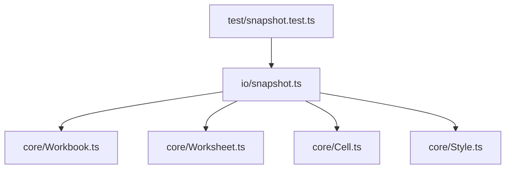
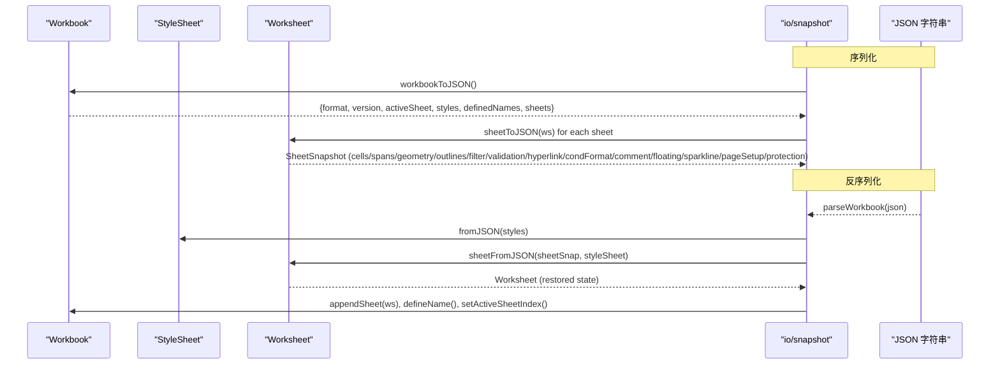
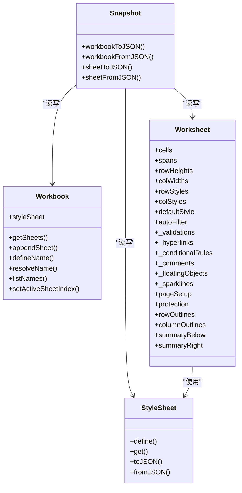

# 快照格式规范

<cite>
**本文引用的文件**
- [snapshot.ts](file://cmx-mega-sheet/src/io/snapshot.ts)
- [Workbook.ts](file://cmx-mega-sheet/src/core/Workbook.ts)
- [Worksheet.ts](file://cmx-mega-sheet/src/core/Worksheet.ts)
- [Cell.ts](file://cmx-mega-sheet/src/core/Cell.ts)
- [Style.ts](file://cmx-mega-sheet/src/core/Style.ts)
- [snapshot.test.ts](file://cmx-mega-sheet/test/snapshot.test.ts)
</cite>

## 目录
1. [引言](#引言)
2. [项目结构](#项目结构)
3. [核心组件](#核心组件)
4. [架构总览](#架构总览)
5. [详细组件分析](#详细组件分析)
6. [依赖关系分析](#依赖关系分析)
7. [性能与序列化特性](#性能与序列化特性)
8. [数据完整性验证与错误诊断](#数据完整性验证与错误诊断)
9. [结论](#结论)
10. [附录：字段与约束速查](#附录字段与约束速查)

## 引言
本规范定义中性快照格式（cmx-megasheet），用于持久化工作簿、工作表与单元格的完整状态。该格式遵循以下原则：
- 中性：不包含视图色等渲染态，不记录几何派生结果（如大纲层级、outline 隐藏）。
- 稀疏：仅序列化非默认值（例如未设置的行列高、列宽不写入）。
- 无损往返：workbookToJSON → workbookFromJSON 可还原全部持久状态。

快照以 JSON 为载体，顶层包含 format/version 标签与 sheets 数组；每个 sheet 包含单元格、合并区、行列元数据、筛选、验证、条件格式、批注、浮动对象、迷你图、页面设置与保护等。

## 项目结构
快照相关代码集中在 io/snapshot.ts，其依赖 core 层的数据模型（Workbook、Worksheet、Cell、Style）完成序列化与反序列化。测试覆盖在 test/snapshot.test.ts，用于断言往返一致性与关键特性。

图表来源
- [snapshot.ts:1-319](file://cmx-mega-sheet/src/io/snapshot.ts#L1-L319)
- [Workbook.ts:174-397](file://cmx-mega-sheet/src/core/Workbook.ts#L174-L397)
- [Worksheet.ts:435-1283](file://cmx-mega-sheet/src/core/Worksheet.ts#L435-L1283)
- [Cell.ts:1-74](file://cmx-mega-sheet/src/core/Cell.ts#L1-L74)
- [Style.ts:1-234](file://cmx-mega-sheet/src/core/Style.ts#L1-L234)
- [snapshot.test.ts:1-197](file://cmx-mega-sheet/test/snapshot.test.ts#L1-L197)

章节来源
- [snapshot.ts:1-319](file://cmx-mega-sheet/src/io/snapshot.ts#L1-L319)
- [snapshot.test.ts:1-197](file://cmx-mega-sheet/test/snapshot.test.ts#L1-L197)

## 核心组件
- WorkbookSnapshot：工作簿级快照，包含 format、version、activeSheet、命名样式表、命名区域、冻结/拆分视口态透传字段、sheets。
- SheetSnapshot：工作表级快照，包含名称、行列数、cells、spans、行列高宽、行列样式、默认样式、手动隐藏、大纲分组、汇总位置、缩放、活动格、自动筛选、数据验证、超链接、条件格式、批注、浮动对象、迷你图、页面设置、保护、冻结行列数。
- CellSnapshot：单元格快照，包含坐标 r/c 以及可选的 v（值）、f（公式源串）、s（样式）、rich（富文本）。

章节来源
- [snapshot.ts:23-109](file://cmx-mega-sheet/src/io/snapshot.ts#L23-L109)
- [Worksheet.ts:29-227](file://cmx-mega-sheet/src/core/Worksheet.ts#L29-L227)
- [Cell.ts:14-36](file://cmx-mega-sheet/src/core/Cell.ts#L14-L36)
- [Style.ts:68-100](file://cmx-mega-sheet/src/core/Style.ts#L68-L100)

## 架构总览
快照序列化的主流程：
- workbookToJSON：导出命名样式表、所有工作表快照、活动表索引、命名区域。
- sheetToJSON：遍历非空单元格，按行升序稳定输出；按需附加 spans、行列高宽、行列样式、默认样式、手动隐藏、大纲分组、summary 位置、zoom、活动格、自动筛选、验证、超链接、条件格式、批注、浮动对象、迷你图、页面设置、保护。
- workbookFromJSON / sheetFromJSON：重建 StyleSheet，创建 Worksheet，依次恢复默认样式、行列高宽、行列样式、单元格值/公式/样式/富文本、合并区、大纲分组及折叠态、手动隐藏、筛选、验证、超链接、条件格式、批注、浮动对象、迷你图、页面设置、保护。

图表来源
- [snapshot.ts:271-319](file://cmx-mega-sheet/src/io/snapshot.ts#L271-L319)
- [Workbook.ts:174-397](file://cmx-mega-sheet/src/core/Workbook.ts#L174-L397)
- [Worksheet.ts:435-1283](file://cmx-mega-sheet/src/core/Worksheet.ts#L435-L1283)

## 详细组件分析

### 工作簿级属性
- 活动工作表：activeSheet（索引，默认 0）。
- 命名样式表：styles（Record<string, StyleProps>），由 StyleSheet.toJSON 导出，反序列化时先装载再逐表使用。
- 命名区域：definedNames（name/scope/refersTo），支持 workbook 或 sheet 作用域。
- 冻结/拆分视口态：frozenRowCount/frozenColCount、trailingRowCount/trailingColCount、splitRow/splitCol 作为透传字段，不参与 workbookFromJSON 的状态变更，由 element 消费。

章节来源
- [snapshot.ts:90-109](file://cmx-mega-sheet/src/io/snapshot.ts#L90-L109)
- [Workbook.ts:185-229](file://cmx-mega-sheet/src/core/Workbook.ts#L185-L229)
- [snapshot.test.ts:158-169](file://cmx-mega-sheet/test/snapshot.test.ts#L158-L169)

### 工作表级属性
- 维度：rowCount/colCount。
- 合并区：spans（矩形列表）。
- 行列元数据：rowHeights/colWidths、rowStyles/colStyles、defaultStyle。
- 可见性：hiddenRows/hiddenCols（仅手动隐藏，不含大纲折叠派生隐藏）。
- 大纲分组：rowOutlines/colOutlines（start/count/collapsed），level 在还原时派生。
- 汇总位置：summaryBelow/summaryRight（默认 true，仅在 false 时写入）。
- 缩放：zoom（默认 1，非 1 时写入）。
- 活动格：activeRow/activeCol（默认 0，非 0 时写入）。
- 自动筛选：autoFilter.range + criteria（每列 FilterCriterion）。
- 数据验证：validations（DataValidation[]）。
- 超链接：hyperlinks（[row,col,Hyperlink][]）。
- 条件格式：conditionalRules（ConditionalRule[]）。
- 批注：comments（[row,col,CellComment][]）。
- 浮动对象：floatingObjects（FloatingObject[]）。
- 迷你图：sparklines（[row,col,Sparkline][]）。
- 页面设置：pageSetup（PageSetup）。
- 保护：protection（SheetProtection）。
- 冻结窗格：frozenRowCount/frozenColCount（XLSX 中 per-sheet，中性快照中冻结在 WorkbookSnapshot 更合适，此处保留兼容字段）。

章节来源
- [snapshot.ts:42-88](file://cmx-mega-sheet/src/io/snapshot.ts#L42-L88)
- [Worksheet.ts:29-227](file://cmx-mega-sheet/src/core/Worksheet.ts#L29-L227)
- [Worksheet.ts:894-1067](file://cmx-mega-sheet/src/core/Worksheet.ts#L894-L1067)

### 单元格数据结构
- 坐标：r/c（number）。
- 值：v（CellValue = string | number | boolean | null）。
- 公式：f（string，不含前导 '='）。
- 样式：s（StyleProps，稀疏键集合）。
- 富文本：rich（RichText，runs 数组，value 同步为纯文本兜底）。

注意：
- 当同时存在 f 与 v 时，表示“公式源 + 计算值”，反序列化时通过 setComputedValue 保留公式源。
- 单元格为空壳（无 v/f/s/rich）不会被写入，保证稀疏。

章节来源
- [snapshot.ts:23-33](file://cmx-mega-sheet/src/io/snapshot.ts#L23-L33)
- [Cell.ts:14-36](file://cmx-mega-sheet/src/core/Cell.ts#L14-L36)
- [Worksheet.ts:529-603](file://cmx-mega-sheet/src/core/Worksheet.ts#L529-L603)

### 高级特性快照表示
- 数据验证（M12）：DataValidation 包含 range、type、operator、formula1/formula2、list、allowBlank、prompt/error。序列化时去重同区域同类型规则，反序列化后按顺序应用，后加入优先。
- 条件格式（M13）：ConditionalRule 包含 range、type（cellValue/colorScale/dataBar/iconSet）、operator/value1/value2/style/colors/barColor/iconSet。渲染时叠加计算，不改单元格数据。
- 迷你图（M21）：Sparkline 包含 type、dataRange、color/negativeColor/markers/highLow/firstLast/target。序列化时深拷贝 dataRange。
- 批注（M14）：CellComment 包含 text/author。
- 浮动对象（M14）：FloatingObject 包含 id/kind/anchor/src/chart/shape/z。序列化时深拷贝 anchor。
- 页面设置（M15）：PageSetup 包含 orientation/paperSize/margins/scale/fitToPages/printArea/printTitles/header/footer/showGridlines。
- 保护（M20）：SheetProtection 包含 enabled/allowSelectLocked/allowFormatCells/allowInsertDelete/allowSort/allowFilter。locked 随 StyleProps 存储于单元格样式。

章节来源
- [Worksheet.ts:55-227](file://cmx-mega-sheet/src/core/Worksheet.ts#L55-L227)
- [Worksheet.ts:894-1067](file://cmx-mega-sheet/src/core/Worksheet.ts#L894-L1067)
- [snapshot.ts:162-187](file://cmx-mega-sheet/src/io/snapshot.ts#L162-L187)

### 序列化与反序列化算法
- 单元格遍历：forEachCell 收集非空单元格，按 r 升序、c 升序排序，确保稳定 diff。
- 公式与值：若 cell.f 存在且 cell.v 非空，反序列化时调用 setComputedValue 保留公式源；否则 setValue。
- 大纲分组：先 group(start,count)，再 setCollapsed；summaryBelow/summaryRight 仅在 false 时写入。
- 手动隐藏与大纲隐藏分离：hiddenRows/hiddenCols 仅记录用户手动隐藏；applyOutlineVisibility 在还原时叠加大纲折叠导致的隐藏。
- 自动筛选：先 setAutoFilter(range)，再逐列 setFilterCriterion；applyFilterVisibility 会重算隐藏。
- 命名样式：workbookFromJSON 先装载 styles，再逐表 sheetFromJSON 传入 styleSheet，使跨表共享命名样式。
- 命名区域：workbookFromJSON 中 restore definedNames。
- 活动表：setActiveSheetIndex(snap.activeSheet ?? 0)。

章节来源
- [snapshot.ts:111-187](file://cmx-mega-sheet/src/io/snapshot.ts#L111-L187)
- [snapshot.ts:200-304](file://cmx-mega-sheet/src/io/snapshot.ts#L200-L304)
- [Worksheet.ts:775-815](file://cmx-mega-sheet/src/core/Worksheet.ts#L775-L815)

### 版本兼容性策略
- 格式标签：SNAPSHOT_FORMAT = 'cmx-megasheet'，用于识别中性快照。
- 版本号：SNAPSHOT_VERSION = 1，用于未来破坏性变更时的迁移。
- 解析校验：parseWorkbook 对非 cmx-megasheet 的 JSON 抛出错误，便于上层决定是否走旧格式迁移。
- 向后兼容：新增字段（如 trailingRowCount/splitRow/splitCol）在 fromJSON 中忽略但不报错，保持向前兼容。

章节来源
- [snapshot.ts:18-21](file://cmx-mega-sheet/src/io/snapshot.ts#L18-L21)
- [snapshot.ts:311-319](file://cmx-mega-sheet/src/io/snapshot.ts#L311-L319)
- [snapshot.test.ts:138-146](file://cmx-mega-sheet/test/snapshot.test.ts#L138-L146)

## 依赖关系分析
- snapshot.ts 依赖：
  - Workbook/Worksheet：提供数据访问与状态重建 API。
  - Style：命名样式表与样式合并/解析。
  - Cell：值类型、富文本、公式归一化。
- Worksheet 内部依赖：
  - SparseMatrix：稀疏矩阵存储单元格数据。
  - Range/Span：区域与合并区操作。
  - OutlineAxis：大纲分组与层级派生。
  - AutoFilterState：自动筛选状态与可见性计算。
- Workbook 内部依赖：
  - StyleSheet：命名样式管理。
  - EventEmitter：事件（活动表切换、增删表）。
  - CommandManager/UndoManager：命令与撤销栈（快照不直接依赖，但影响编辑行为）。

图表来源
- [Workbook.ts:174-397](file://cmx-mega-sheet/src/core/Workbook.ts#L174-L397)
- [Worksheet.ts:435-1283](file://cmx-mega-sheet/src/core/Worksheet.ts#L435-L1283)
- [Style.ts:162-216](file://cmx-mega-sheet/src/core/Style.ts#L162-L216)
- [snapshot.ts:271-319](file://cmx-mega-sheet/src/io/snapshot.ts#L271-L319)

章节来源
- [Workbook.ts:174-397](file://cmx-mega-sheet/src/core/Workbook.ts#L174-L397)
- [Worksheet.ts:435-1283](file://cmx-mega-sheet/src/core/Worksheet.ts#L435-L1283)
- [Style.ts:162-216](file://cmx-mega-sheet/src/core/Style.ts#L162-L216)
- [snapshot.ts:271-319](file://cmx-mega-sheet/src/io/snapshot.ts#L271-L319)

## 性能与序列化特性
- 稀疏存储：仅写入非默认值，减少 JSON 体积。
- 稳定排序：单元格按行列升序，利于 diff 与增量更新。
- 只读副本：导出时返回浅拷贝（如 rich.runs、anchor、dataRange），避免外部修改内部状态。
- 批量恢复：sheetFromJSON 按顺序批量设置行列高宽/样式/单元格，减少中间态开销。
- 大纲与筛选可见性分离：避免重复计算与误删用户手动隐藏。

章节来源
- [snapshot.ts:111-187](file://cmx-mega-sheet/src/io/snapshot.ts#L111-L187)
- [Worksheet.ts:775-815](file://cmx-mega-sheet/src/core/Worksheet.ts#L775-L815)

## 数据完整性验证与错误诊断
- 格式校验：parseWorkbook 检查 format 是否为 'cmx-megasheet'，否则抛错。
- 空快照兜底：workbookFromJSON 若无 sheets，追加一张空表，避免下游 getActiveSheet 异常。
- 公式清洗：normalizeFormula 去除前导 '='，sanitizeImportedFormula 剥离 Excel 导入伪前缀，避免 #NAME?。
- 验证规则去重：setDataValidation 移除完全同区域的旧规则，避免堆积。
- 筛选可见性：applyFilterVisibility 仅恢复筛选隐藏的行，不动手动/大纲隐藏。
- 保护逻辑：isProtected/isCellLocked/canEditCell 基于 StyleProps.locked 与工作表保护状态判断。

章节来源
- [snapshot.ts:311-319](file://cmx-mega-sheet/src/io/snapshot.ts#L311-L319)
- [snapshot.ts:286-304](file://cmx-mega-sheet/src/io/snapshot.ts#L286-L304)
- [Cell.ts:50-73](file://cmx-mega-sheet/src/core/Cell.ts#L50-L73)
- [Worksheet.ts:894-919](file://cmx-mega-sheet/src/core/Worksheet.ts#L894-L919)
- [Worksheet.ts:633-661](file://cmx-mega-sheet/src/core/Worksheet.ts#L633-L661)

## 结论
中性快照格式以简洁、稀疏、稳定的方式表达工作簿/工作表/单元格的持久状态，并通过明确的版本与格式标签保障兼容性。其设计将渲染态与数据态解耦，将派生态（如大纲层级、筛选隐藏）与持久态分离，确保往返无损与可维护性。对于高级特性（验证、条件格式、迷你图等），快照提供了清晰的字段映射与序列化策略，便于跨平台交换与长期演进。

## 附录：字段与约束速查
- WorkbookSnapshot
  - format: 'cmx-megasheet'
  - version: 数字（当前 1）
  - activeSheet: 索引（默认 0）
  - styles: Record<string, StyleProps>
  - definedNames: [{ name, scope, refersTo }]
  - frozenRowCount/frozenColCount: 整数（透传）
  - trailingRowCount/trailingColCount: 整数（透传）
  - splitRow/splitCol: 布尔（透传）
  - sheets: SheetSnapshot[]
- SheetSnapshot
  - name: string
  - rowCount/colCount: number
  - cells: CellSnapshot[]
  - spans?: Span[]
  - rowHeights/colWidths?: Array<[number, number]>
  - rowStyles/colStyles?: Array<[number, StyleProps]>
  - defaultStyle?: StyleProps
  - hiddenRows/hiddenCols?: number[]
  - rowOutlines/colOutlines?: OutlineGroupSnapshot[]
  - summaryBelow/summaryRight?: boolean
  - zoom?: number
  - activeRow/activeCol?: number
  - autoFilter?: { range, criteria }
  - validations?: DataValidation[]
  - hyperlinks?: Array<[number, number, Hyperlink]>
  - conditionalRules?: ConditionalRule[]
  - comments?: Array<[number, number, CellComment]>
  - floatingObjects?: FloatingObject[]
  - sparklines?: Array<[number, number, Sparkline]>
  - pageSetup?: PageSetup
  - protection?: SheetProtection
  - frozenRowCount/frozenColCount?: number
- CellSnapshot
  - r/c: number
  - v?: CellValue
  - f?: string（不含 '='）
  - s?: StyleProps
  - rich?: RichText

章节来源
- [snapshot.ts:23-109](file://cmx-mega-sheet/src/io/snapshot.ts#L23-L109)
- [Worksheet.ts:29-227](file://cmx-mega-sheet/src/core/Worksheet.ts#L29-L227)
- [Cell.ts:14-36](file://cmx-mega-sheet/src/core/Cell.ts#L14-L36)
- [Style.ts:68-100](file://cmx-mega-sheet/src/core/Style.ts#L68-L100)